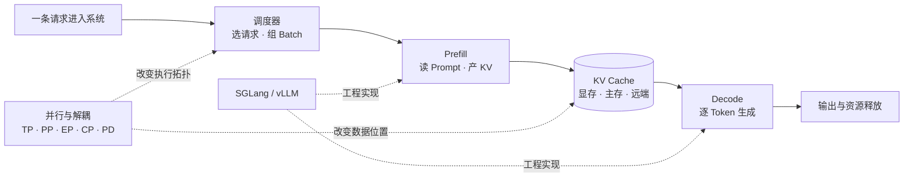
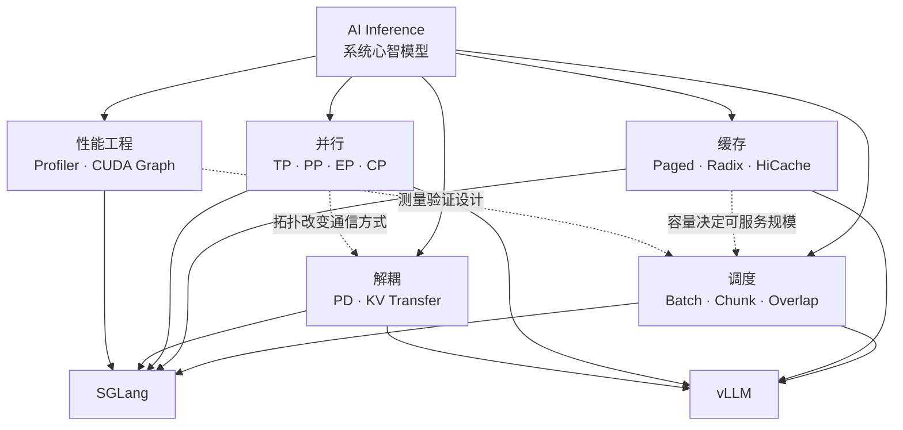

<div align="center">


<br />

**从一次请求出发，把调度、并行、KV Cache 与推理引擎连成一张图。**

<sub>写给第一次深入 AI Infra 的你，也写给正在源码和性能现场里排障的你。</sub>

<br /><br />

<a href="#start"><kbd>🚀 开始探索</kbd></a>&nbsp;&nbsp;
<a href="#routes"><kbd>🧭 选择路线</kbd></a>&nbsp;&nbsp;
<a href="#catalog"><kbd>🗂️ 全部文档</kbd></a>&nbsp;&nbsp;
<a href="#contribute"><kbd>🛠️ 一起建设</kbd></a>

</div>

---

> [!TIP]
> 这里不是术语百科，也不是文章收藏夹。每篇笔记都尽量回答四个问题：**系统为什么这样设计、请求到底怎么走、数据究竟存在哪里、出问题该从哪里查。**

<a id="start"></a>

## 这是一座什么样的 Wiki？

AI 推理系统很容易被拆成一堆孤立名词：Continuous Batching、PagedAttention、Radix Cache、PD 分离、TP/PP/EP/CP……但真实系统从来不是按名词运行的。

这个仓库选择另一条路线：

- 从一条真实请求出发，追踪它从排队、Prefill、Decode 到完成释放的生命周期。
- 同时观察控制流与数据流，拆清“谁做决策”和“谁搬数据”。
- 回到源码锚点验证机制，不把猜测包装成事实。
- 用人话、Mermaid、原始技术图和具体例子降低第一次阅读的门槛。



<p align="center"><sub>先看请求生命周期，再看机制如何改变这条链路，最后回到具体引擎源码。</sub></p>

<a id="routes"></a>

## 选择一条学习路线

不用从第一篇顺序读到最后一篇。点开最接近你当前状态的入口，拿走一条可执行的阅读路径。

<details open>
<summary><strong>🌱 路线 A：我刚开始接触 LLM 推理系统</strong></summary>

建议先建立“请求、显存、调度”三件套心智模型：

1. [LLM 推理系统心智模型与 SGLang、vLLM 选型边界](<./llm-inference/LLM 推理系统心智模型与 SGLang、vLLM 选型边界学习文档.md>)
2. [vLLM 从连续批处理到 PagedAttention 的引擎工作流](<./vllm/vLLM 从连续批处理到 PagedAttention 的引擎工作流学习文档.md>)
3. [Chunked Prefill 与 Prefill-Decode 共推](<./llm-inference/Chunked Prefill 与 Prefill-Decode 共推学习文档.md>)
4. [KV Cache 容量优化技术地图](<./llm-inference/KV Cache 容量优化技术地图学习文档.md>)

读完你应该能解释：为什么推理不是“一次 forward”、KV Cache 为什么主导容量，以及调度器为何要同时平衡吞吐与时延。

</details>

<details>
<summary><strong>🧠 路线 B：我想系统攻克 KV Cache</strong></summary>

从“存什么”一路读到“怎么命中、怎么分层、怎么跨节点传”：

1. [vLLM V1 KV Cache 管理全生命周期](<./vllm/vLLM V1 KV Cache 管理全生命周期源码学习文档.md>)
2. [SGLang RadixAttention 与 HiCache KV Cache 技术主线](<./sglang/SGLang RadixAttention 与 HiCache KV Cache 技术主线学习文档.md>)
3. [SGLang KV Pool、请求视图与 HiCache 工程](<./sglang/SGLang KV Pool、请求视图与 HiCache 工程学习文档.md>)
4. [vLLM V1 KV Connector 架构与实现地图](<./vllm/vLLM V1 KV Connector 架构与实现地图源码学习文档.md>)
5. [KV Cache Salt 全链路键空间](<./llm-inference/KV Cache Salt 全链路键空间学习文档.md>)

读完你应该能区分：逻辑前缀、物理 KV 块、Block ID、Connector 元数据，以及“能访问缓存”和“拥有缓存生命周期”的边界。

</details>

<details>
<summary><strong>⚡ 路线 C：我在做并行、解耦与长上下文</strong></summary>

先搭并行坐标系，再进入具体引擎实现：

1. [Context Parallel、PCP 与 DCP 总体学习](<./llm-inference/Context Parallel、PCP 与 DCP 总体学习文档.md>)
2. [SGLang Pipeline Parallel 模式](<./sglang/SGLang Pipeline Parallel 模式学习文档.md>)
3. [vLLM Pipeline Parallel 流水线并行](<./vllm/vLLM Pipeline Parallel 流水线并行学习文档.md>)
4. [vLLM Expert Parallel 与 EPLB](<./vllm/vLLM Expert Parallel 与 EPLB 学习文档.md>)
5. [PersistentKV 长上下文注意力调度](<./vllm/PersistentKV 长上下文注意力调度学习文档.md>)

读完你应该能画出 rank、stage、token 分片与 KV 分片之间的关系，并理解不同并行方式优化的瓶颈并不相同。

</details>

<details>
<summary><strong>🔬 路线 D：我正在读 SGLang / vLLM 源码</strong></summary>

推荐按“入口 → 主循环 → 核心对象 → 数据通路”阅读：

- SGLang：[调度器请求生命周期与重叠调度](<./sglang/SGLang 调度器请求生命周期与重叠调度学习文档.md>) → [Chunked Prefill 与调度器显存预算](<./sglang/SGLang Chunked Prefill 与调度器显存预算学习文档.md>) → [PD 分离下的 PP](<./sglang/PD 分离下的 PP 源码学习文档.md>)
- vLLM：[引擎工作流](<./vllm/vLLM 从连续批处理到 PagedAttention 的引擎工作流学习文档.md>) → [KV Cache 全生命周期](<./vllm/vLLM V1 KV Cache 管理全生命周期源码学习文档.md>) → [KV Connector 架构](<./vllm/vLLM V1 KV Connector 架构与实现地图源码学习文档.md>)

不要从单个函数硬啃。先确认它在整条请求链路上负责哪一步，再向对象状态与边界条件下钻。

</details>

## 知识星图

同一个机制经常横跨多条主线。下面这张图适合用来判断“下一篇该往哪里跳”。



| 如果你关心…… | 先抓住这个问题 | 推荐入口 |
| --- | --- | --- |
| 吞吐 / TTFT / TPOT | 请求什么时候被选中，Prefill 会不会阻塞 Decode？ | [Chunked Prefill 与共推](<./llm-inference/Chunked Prefill 与 Prefill-Decode 共推学习文档.md>) |
| OOM / 可服务并发 | 每个 token 的 KV 占多少，碎片和冗余在哪里？ | [KV Cache 容量优化地图](<./llm-inference/KV Cache 容量优化技术地图学习文档.md>) |
| 前缀缓存命中 | “相同前缀”如何编码，命中后复用了哪一层资源？ | [RadixAttention 前缀命中定义](<./sglang/SGLang RadixAttention 前缀缓存命中定义学习文档.md>) |
| 多卡扩展 | 切模型、切专家、切序列分别改变了什么？ | [Context Parallel、PCP 与 DCP](<./llm-inference/Context Parallel、PCP 与 DCP 总体学习文档.md>) |
| PD 分离 | 谁发起传输，KV 到齐前请求处于什么状态？ | [PD 分离下的 PP](<./sglang/PD 分离下的 PP 源码学习文档.md>) |
| Kernel / Trace | 一段耗时属于调度空洞、通信还是算子本身？ | [SGLang Torch Profiler 与 Trace](<./sglang/SGLang Torch Profiler 与 Trace 性能分析学习文档.md>) |

<a id="catalog"></a>

## 全部文档

<details open>
<summary><strong>01 / LLM Inference · 跨引擎的系统方法论</strong></summary>

> 先建立不绑定某个代码库的系统坐标系，再进入具体实现。

- [LLM 推理系统心智模型与 SGLang、vLLM 选型边界](<./llm-inference/LLM 推理系统心智模型与 SGLang、vLLM 选型边界学习文档.md>) — 一次请求、核心资源与引擎边界的总入口。
- [推理引擎与集群推理层分工](<./llm-inference/推理引擎与集群推理层分工学习文档.md>) — 区分单实例执行能力与集群级控制面职责。
- [Chunked Prefill 与 Prefill-Decode 共推](<./llm-inference/Chunked Prefill 与 Prefill-Decode 共推学习文档.md>) — 从静态批处理走向连续批处理与分块调度。
- [KV Cache 容量优化技术地图](<./llm-inference/KV Cache 容量优化技术地图学习文档.md>) — GQA、MLA、滑窗、跨层共享与稀疏注意力的统一地图。
- [KV Cache 与推理调度协同优化](<./llm-inference/KV Cache 与推理调度协同优化学习文档.md>) — 从十篇论文拆清请求派发、缓存保留、跨模型转换、按头裁剪与物理页回收，并核对性能证据边界。
- [KV Cache Salt 全链路键空间](<./llm-inference/KV Cache Salt 全链路键空间学习文档.md>) — 理解租户隔离、前缀身份与缓存键空间。
- [Context Parallel、PCP 与 DCP 总体学习](<./llm-inference/Context Parallel、PCP 与 DCP 总体学习文档.md>) — 序列切分、通信与负载均衡的整体坐标系。
- [PCP 长上下文 Prefill 并行](<./llm-inference/PCP 长上下文 Prefill 并行学习文档.md>) — 聚焦长上下文 Prefill 的 token 分片与注意力合并。

</details>

<details>
<summary><strong>02 / SGLang · 调度、Radix Cache 与分布式执行</strong></summary>

> 从 Scheduler 主循环出发，沿请求状态、KV 所有权与并行拓扑深入源码。

- [SGLang 调度器请求生命周期与重叠调度](<./sglang/SGLang 调度器请求生命周期与重叠调度学习文档.md>) — 请求如何跨过 waiting、running 与输出阶段。
- [SGLang Chunked Prefill 与调度器显存预算](<./sglang/SGLang Chunked Prefill 与调度器显存预算学习文档.md>) — 调度器如何在 token budget 与显存之间做选择。
- [SGLang RadixAttention 前缀缓存命中定义](<./sglang/SGLang RadixAttention 前缀缓存命中定义学习文档.md>) — 逐步拆开 token 匹配、树节点与物理 KV 复用。
- [SGLang RadixAttention 与 HiCache KV Cache 技术主线](<./sglang/SGLang RadixAttention 与 HiCache KV Cache 技术主线学习文档.md>) — 从 GPU Radix Cache 延伸到分层缓存。
- [SGLang KV Pool、请求视图与 HiCache 工程](<./sglang/SGLang KV Pool、请求视图与 HiCache 工程学习文档.md>) — 区分物理池、逻辑请求视图与缓存控制面。
- [SGLang Unified Radix Cache](<./sglang/SGLang Unified Radix Cache 学习文档.md>) — 统一前缀树、会话与分层缓存视角。
- [Mooncake 与 SGLang HiCache](<./sglang/Mooncake 与 SGLang HiCache 学习文档.md>) — 外部 KV 存储接入 SGLang 的控制与数据通路。
- [SGLang Pipeline Parallel 模式](<./sglang/SGLang Pipeline Parallel 模式学习文档.md>) — PP 进程拓扑、microbatch 与请求反馈回路。
- [PD 分离下的 PP 源码](<./sglang/PD 分离下的 PP 源码学习文档.md>) — PD + PP 下控制流、proxy tensor 与 KV 传输的完整链路。
- [SGLang 数据并行、负载均衡与专家并行边界](<./sglang/SGLang 数据并行、负载均衡与专家并行边界学习文档.md>) — 拆清 DP、路由与 EP 的职责分界。
- [SGLang Breakable CUDA Graph 与 Prefill 捕获](<./sglang/SGLang Breakable CUDA Graph 与 Prefill 捕获学习文档.md>) — 图捕获策略、动态形状与 Prefill 性能权衡。
- [SGLang Torch Profiler 与 Trace 性能分析](<./sglang/SGLang Torch Profiler 与 Trace 性能分析学习文档.md>) — 从 trace 定位 CPU、GPU、通信与算子瓶颈。
- [SGLang GLM-5.2 NVFP4 推理优化案例](<./sglang/SGLang GLM-5.2 NVFP4 推理优化案例学习文档.md>) — 一个从 profiler 观察走向量化算子优化的案例。
- [SGLang v0.5.16 24GB 显存调优案例](<./sglang/SGLang v0.5.16 24GB 显存调优案例学习文档.md>) — 有限显存下的容量、配置与失败边界。
- [SGLang v0.5.18 推理系统协同演进](<./sglang/SGLang v0.5.18 推理系统协同演进学习文档.md>) — 从版本变化观察调度、缓存与执行层如何协同演进。

</details>

<details>
<summary><strong>03 / vLLM · PagedAttention、KV Connector 与并行系统</strong></summary>

> 沿 Engine、Scheduler、KV Cache Manager 与 Connector 建立 V1 执行地图。

- [vLLM 从连续批处理到 PagedAttention 的引擎工作流](<./vllm/vLLM 从连续批处理到 PagedAttention 的引擎工作流学习文档.md>) — 面向初学者的请求执行与显存分页总览。
- [vLLM V1 KV Cache 管理全生命周期源码](<./vllm/vLLM V1 KV Cache 管理全生命周期源码学习文档.md>) — 分配、引用、复用、回收与 Scheduler 交互。
- [vLLM APC 链式哈希](<./vllm/vLLM APC 链式哈希学习文档.md>) — Automatic Prefix Caching 的块身份与前缀连续性。
- [vLLM V1 KV Connector 架构与实现地图源码](<./vllm/vLLM V1 KV Connector 架构与实现地图源码学习文档.md>) — KV 外部传输的控制面、数据面与角色边界。
- [Mooncake 与 vLLM 接入地图](<./vllm/Mooncake 与 vLLM 接入地图学习文档.md>) — Mooncake 在 Connector 体系中的接入位置。
- [vLLM Chunked Prefill 与 Block Size](<./vllm/vLLM Chunked Prefill 与 Block Size 学习文档.md>) — 分块调度如何与物理 KV block 交互。
- [vLLM Pipeline Parallel 流水线并行](<./vllm/vLLM Pipeline Parallel 流水线并行学习文档.md>) — stage 切分、microbatch、异步重叠与生命周期。
- [vLLM Expert Parallel 与 EPLB](<./vllm/vLLM Expert Parallel 与 EPLB 学习文档.md>) — MoE dispatch/combine 与动态负载均衡反馈环。
- [vLLM DCP KV Cache 去重与 LSE 合并](<./vllm/vLLM DCP KV Cache 去重与 LSE 合并学习文档.md>) — Decode Context Parallel 的 KV 布局和注意力合并。
- [PersistentKV 长上下文注意力调度](<./vllm/PersistentKV 长上下文注意力调度学习文档.md>) — 从 kernel launch、序列切分到持久化调度设计。

</details>

## 仓库结构

```text
ai-infra-wiki/
├── llm-inference/   # 跨引擎的方法论与技术地图
├── sglang/          # SGLang 源码、机制与性能案例
├── vllm/            # vLLM 源码、机制与生态接入
├── images/          # 所有文档的本地图片，按长期主题归档
├── AGENTS.md        # 文档方法论、图片规则与验证清单
└── README.md        # 你现在看到的知识入口
```

仓库里的内容主要分成两类：

| 类型 | 证据基线 | 阅读重点 |
| --- | --- | --- |
| 源码分析型 | 固定源码目录、分支、commit、读取时间与工作区状态 | 控制流、数据流、对象生命周期、状态机、硬约束 |
| 第三方资料整理型 | 保留原文、作者/机构、读取时间与验证边界 | 技术主线、关键原图、图意解读、结论适用条件 |

<a id="contribute"></a>

## 一起建设

欢迎补充新的学习主线，也欢迎修正文档里的源码锚点、机制解释与失效链接。开始前请先阅读 [AGENTS.md](./AGENTS.md)，它定义了这个仓库共同遵守的写作方法。

最重要的几条约定：

1. **先讲人话，再讲源码。** 不默认读者已经知道所有缩写和对象关系。
2. **机制必须可追溯。** 源码事实给出文件/函数锚点，外部资料保留原始链接。
3. **图不是装饰。** 每张关键图都要解释控制权、数据面和边界。
4. **图片统一归档。** 所有图片都放在根目录 `images/<topic>/`，文档只使用相对路径。
5. **区分事实与推断。** 没有跑过实验，就不把源码阅读写成运行结论。

<details>
<summary><strong>✅ 提交前自检</strong></summary>

- [ ] 文档放在最合适的技术主题目录，而不是临时任务目录。
- [ ] 标题层级清晰，复杂章节包含人话版、机制拆解、图意解读或例子。
- [ ] 来源、读取时间、整理范围与验证边界已经写明。
- [ ] 所有本地链接和图片路径都能从当前文档正确解析。
- [ ] Mermaid 与正文一致，没有画入源码或资料中不存在的模块。
- [ ] `git status --short` 里只有本次任务相关变更。

</details>

---

<div align="center">

**读懂一次请求，才算真正走进推理系统。**

<sub>Keep tracing. Keep measuring. Keep the mental model honest.</sub>

<br /><br />

<a href="#start">回到入口 ↑</a>

</div>
