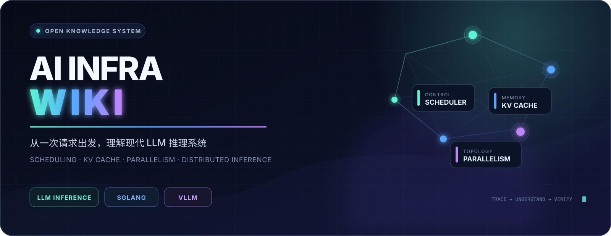
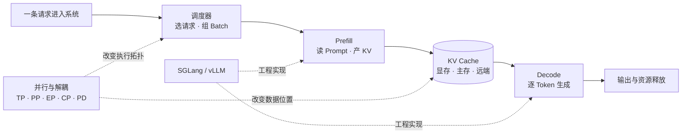
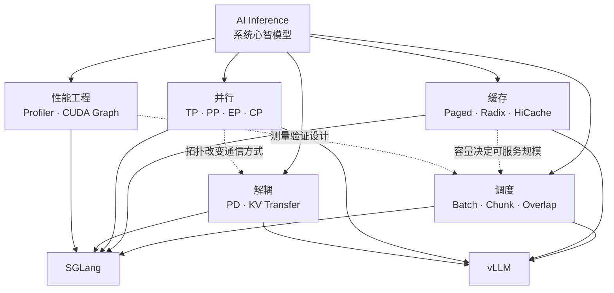

<div align="center">



<br />

**从一次请求出发，把调度、并行、KV Cache 与推理引擎连成一张图。**

<sub>写给第一次深入 AI Infra 的你，也写给正在源码和性能现场里排障的你。</sub>

<br /><br />

<a href="https://asher-xunzhang.github.io/ai-infra-wiki/"><kbd>▶ 打开交互学习网站</kbd></a>&nbsp;&nbsp;
<a href="#start"><kbd>📖 阅读指南</kbd></a>&nbsp;&nbsp;
<a href="#routes"><kbd>🧭 选择路线</kbd></a>&nbsp;&nbsp;
<a href="#catalog"><kbd>🗂️ 专题目录</kbd></a>&nbsp;&nbsp;
<a href="#contribute"><kbd>🛠️ 一起建设</kbd></a>

</div>

---

**第一次学习先看 [Pages 整体学习框架](https://asher-xunzhang.github.io/ai-infra-wiki/#learning-path)，从 [SGLang 推理全景](https://asher-xunzhang.github.io/ai-infra-wiki/sglang/inference-overview/journey.html) 起步。** 文字主线：[通用推理入门](llm-inference/README.md#入门主线) → 选择 [SGLang](sglang/README.md) 或 [vLLM](vllm/README.md)。PD / PP 交互案例适合在掌握请求、缓存和基本并行后阅读。

<a id="interactive"></a>

## 交互式可视化学习网站

### [▶ 打开 AI Infra Wiki 学习网站](https://asher-xunzhang.github.io/ai-infra-wiki/)

直接在浏览器中学习，无需安装推理引擎。通过播放、暂停、单步推进和修改参数，观察请求、batch、激活与 KV 如何在系统中流动，再从当前步骤跳到对应源码。

首页按五个层次组织十二个学习模块。编号用于定位，不要求所有支线顺序学完；各模块明确区分已有课程、部分内容和预留模块，当前未建设的独立课程不会链接到空页面。

| 学习层次 | 模块 | 首页位置 |
| --- | --- | --- |
| 建立全局 | 推理系统全景；请求生命周期与运行时架构 | [从请求认识系统](https://asher-xunzhang.github.io/ai-infra-wiki/#stage-foundations) |
| 理解单实例 | 模型执行、硬件与算子；KV Cache 与内存管理；调度与批处理 | [执行、缓存与调度](https://asher-xunzhang.github.io/ai-infra-wiki/#stage-instance) |
| 扩展到多卡多机 | 并行与执行拓扑；通信与传输；分离部署与分布式状态交接 | [并行、通信与分离部署](https://asher-xunzhang.github.io/ai-infra-wiki/#stage-distributed) |
| 理解功能与服务 | 模型结构与高级生成；服务部署与运行治理 | [按需选择深入方向](https://asher-xunzhang.github.io/ai-infra-wiki/#stage-serving) |
| 综合验证 | 性能分析与优化方法；综合案例与源码实践 | [从机制到验证](https://asher-xunzhang.github.io/ai-infra-wiki/#stage-practice) |

先走通单实例，再扩展到多卡多机；模型、服务与性能按目标选读。全站首页与课程页共用五层十二模块导航，每门课程有唯一的主要归属：请求生成属于推理全景，Transformer、KV、调度分别进入对应基础模块，部署与 PD Prefill 旅程归入分离部署，PP loop 成套演示归入综合案例。入门路线与关联模块可以引用同一页面，各页面保留自己的版本与适用范围。

维护导航时修改 `scripts/build_learning_navigation.py` 中的模块与课程映射，再运行该脚本更新全部页面。Pages 构建会检查生成一致性，避免首页与课程页使用不同导航。

**已可阅读的交互课程：**

| 学习专题 | 可以观察什么 | 在线入口 |
| --- | --- | --- |
| **SGLang 推理全景** | 面向初学者，理解请求、P/D 与 Transformer、KV 复用、合并与分离部署、调度与延迟。五节内容，每节都有交互实验。 | [进入推理全景](https://asher-xunzhang.github.io/ai-infra-wiki/sglang/inference-overview/journey.html) |
| **PD Prefill 请求旅程** | 跟随请求走完 PD 分离下的 Prefill：握手准入、切 chunk、组 batch、三级前向、KV 交接与资源释放。比较正常、等待、取消和部分 PP 失败的分支。 | [请求生命周期](https://asher-xunzhang.github.io/ai-infra-wiki/sglang/pd-prefill-lifecycle/) |
| **PD Prefill 与 PP 调度** | 同一轮为何“算 M3、收 M1”？追踪多个 batch 在 PP=3 中的交错执行，查看 CPU、GPU、通信与缓存事件之间的依赖。 | [快速入门](https://asher-xunzhang.github.io/ai-infra-wiki/sglang/pd-prefill-pp-loop/quick.html) · [依赖分析](https://asher-xunzhang.github.io/ai-infra-wiki/sglang/pd-prefill-pp-loop/) · [源码说明](https://asher-xunzhang.github.io/ai-infra-wiki/sglang/pd-prefill-pp-loop/notes.html) |

**初学者先读推理全景；掌握宏观行为后，再理解 PP 请求与多批次调度：**

1. [单请求正常路径](https://asher-xunzhang.github.io/ai-infra-wiki/sglang/pd-prefill-lifecycle/?chunkSize=0)：先不切块，认清各模块的职责，以及请求、激活和 KV 的区别。
2. 在“请求生命周期”里选择“一条请求 · 分三块”，观察 12 token 如何按 4 token 处理；首批详细，后续整段播放，也可段内单步。再调整请求数量、输入长度、chunk-size 与 batch-size，或尝试等待和部分失败场景。
3. 进入“快速入门”和“依赖分析”，理解多个 batch 为何交错执行，以及新前向、旧结果和资源释放为什么会出现在同一轮 loop 中。

页面提供固定源码链接与适用范围。后两个专题采用不同的缓存场景；动画节奏和时间线均为教学示意，不代表真实 GPU trace 或性能测量。

> [!TIP]
> **用交互图建立直觉，用源码文档核对机制。** 网站是学习入口；下面的阅读路线和完整目录覆盖调度、并行、缓存、传输与性能分析。

<a id="start"></a>

## 仓库内容与阅读方式

AI 推理系统很容易被拆成一堆孤立名词：Continuous Batching、PagedAttention、Radix Cache、PD 分离、TP/PP/EP/CP……但真实系统从来不是按名词运行的。

文档围绕请求执行过程展开：

- 从一条请求出发，追踪它从排队、Prefill、Decode 到完成释放的生命周期。
- 同时观察控制流与数据流，拆清“谁做决策”和“谁搬数据”。
- 回到源码锚点验证机制，不把猜测包装成事实。
- 用人话、Mermaid、原始技术图和具体例子降低第一次阅读的门槛。



<p align="center"><sub>先看请求生命周期，再看机制如何改变这条链路，最后回到具体引擎源码。</sub></p>

<a id="routes"></a>

## 选择一条学习路线

| 你的起点 | 推荐入口 | 完成这一轮的目标 |
| --- | --- | --- |
| 刚接触推理系统 | [通用推理入门主线](llm-inference/README.md#入门主线)，随后选择一个引擎 | 能解释请求、Prefill / Decode、调度和 KV 的关系 |
| 想理解引擎机制 | [SGLang 学习导航](sglang/README.md) 或 [vLLM 学习导航](vllm/README.md) | 能沿请求追踪决策、状态与资源生命周期 |
| 准备系统读源码 | [SGLang 架构导读](sglang/source-study/architecture/README.md) → [分阶段课程](sglang/source-study/README.md) | 先建立整体地图，再把关键行为对应到固定版本源码 |
| 有具体部署或性能问题 | 从各专题的“按目标选择路线”进入 | 找到相关机制、先修资料和验证边界 |

不用先读完所有通用文章，也不用把两个引擎全部学完。掌握请求、调度和缓存后，再按需要进入并行、分离部署、模型或性能方向。

## 知识星图

调度专题可从[总览与学习路线](<./sglang/runtime/SGLang 调度机制总览与学习路线.md>)开始：先拆清路由、队列排序、admission 和 Overlap，再用请求生命周期与 64K→16K 的 chunk 对照理解性能取舍。来源清单记录了八条资料的采用、排除和核对依据。

同一个机制经常横跨多条主线。下面这张图适合用来判断“下一篇该往哪里跳”。



| 如果你关心…… | 先抓住这个问题 | 推荐入口 |
| --- | --- | --- |
| 吞吐 / TTFT / TPOT | 请求什么时候被选中，Prefill 会不会阻塞 Decode？ | [Chunked Prefill 与共推](<./llm-inference/scheduling/Chunked Prefill 与 Prefill-Decode 共推学习文档.md>) |
| OOM / 可服务并发 | 每个 token 的 KV 占多少，碎片和冗余在哪里？ | [KV Cache 容量优化地图](<./llm-inference/kv-cache/KV Cache 容量优化技术地图学习文档.md>) |
| 前缀缓存命中 | “相同前缀”如何编码，命中后复用了哪一层资源？ | [RadixAttention 前缀命中定义](<./sglang/kv-cache/SGLang RadixAttention 前缀缓存命中定义学习文档.md>) |
| 多卡扩展 | 切模型、切专家、切序列分别改变了什么？ | [Context Parallel、PCP 与 DCP](<./llm-inference/parallelism/Context Parallel、PCP 与 DCP 总体学习文档.md>) |
| PD 分离 | 谁发起传输，KV 到齐前请求处于什么状态？ | [PD Prefill 请求生命周期](<./sglang/disaggregation/PD Prefill PP=3 请求生命周期源码学习文档.md>) |
| Kernel / Trace | 一段耗时属于调度空洞、通信还是算子本身？ | [SGLang Torch Profiler 与 Trace](<./sglang/performance-engineering/SGLang Torch Profiler 与 Trace 性能分析学习文档.md>) |

<a id="catalog"></a>

## 按专题进入资料库

资料按稳定技术领域存放，学习顺序在各级 README 中维护。先选一个专题，再沿“入门主线 → 机制深入 → 按目标选读”前进。

| 专题入口 | 入门主线 | 进阶方向 |
| --- | --- | --- |
| [LLM 推理系统](llm-inference/README.md) | 推理基础 → 调度方法 → KV Cache | 并行、集群服务、模型状态、性能方法 |
| [SGLang](sglang/README.md) | 架构 → 请求调度 → 缓存 → 执行分层 | 并行、分离部署、模型适配、性能与版本 |
| [vLLM](vllm/README.md) | 引擎工作流 → 分块调度 → APC → KV 生命周期 | 并行、Connector 与 Attention 性能 |
| [SGLang 系统源码课程](sglang/source-study/README.md) | 基础与架构导读 → 00–12 阶段 | 高级生成、服务治理、模型适配与综合实践 |

各专题入口覆盖全部已归档文章；每个领域目录提供先修链接、逐篇定位、自测问题和后续路线。案例、研究和历史参考按需阅读，不是所有读者都必须走完的阶段。

## 仓库结构

```text
ai-infra-wiki/
├── llm-inference/   # 基础、调度、缓存、并行、集群、模型与性能
├── sglang/          # 按技术领域归档；source-study/ 保留分阶段课程
├── vllm/            # 运行时、缓存、并行、分离部署与性能
├── pages/           # 交互式学习网站与可视化页面
├── scripts/         # 页面构建、场景生成与验证工具
├── images/          # 文档图片，按长期主题归档
├── AGENTS.md        # 文档方法论、图片规则与验证清单
└── README.md        # 你现在看到的知识入口
```

每个大专题和已建立的领域目录都有 `README.md`。领域名保持稳定，学习顺序只在导航中调整。图片统一留在顶层 `images/`，交互页面继续由 `pages/` 提供。

新增资料按“主要问题 → 技术归属 → 先修与定位 → 阅读路线”归档。形成稳定子主题后再拆分目录，扩展规则见 [AGENTS.md](AGENTS.md#长期分类与学习导航)。

仓库里的内容主要分成两类：

| 类型 | 证据基线 | 阅读重点 |
| --- | --- | --- |
| 源码分析型 | 公开源码仓库、固定 commit、仓内路径、读取时间与验证边界 | 控制流、数据流、对象生命周期、状态机、硬约束 |
| 第三方资料整理型 | 保留原文、作者/机构、读取时间与验证边界 | 技术主线、关键原图、图意解读、结论适用条件 |

<a id="contribute"></a>

## 一起建设

欢迎补充新的学习主线，也欢迎修正文档里的源码锚点、机制解释与失效链接。开始前请先阅读 [AGENTS.md](./AGENTS.md)，它定义了这个仓库共同遵守的写作方法。

最重要的几条约定：

1. **先讲人话，再讲源码。** 不默认读者已经知道所有缩写和对象关系。
2. **机制必须可追溯。** 源码事实使用公开仓库、固定 commit 和文件/函数锚点；外部资料保留原始链接，不写入个人电脑路径。
3. **图不是装饰。** 每张关键图都要解释控制权、数据面和边界。
4. **图片统一归档。** 所有图片都放在根目录 `images/<topic>/`，文档只使用相对路径。
5. **区分事实与推断。** 没有跑过实验，就不把源码阅读写成运行结论。

<details>
<summary><strong>✅ 提交前自检</strong></summary>

- [ ] 文档放在最合适的技术主题目录，而不是临时任务目录。
- [ ] 标题层级清晰，复杂章节包含人话版、机制拆解、图意解读或例子。
- [ ] 来源、读取时间、整理范围与验证边界已经写明，源码入口可由公开仓库定位。
- [ ] 学习入口直接说明主题与学习目标，不以开发顺序或发布时间作为内容标签。
- [ ] 所有本地链接和图片路径都能从当前文档正确解析。
- [ ] Mermaid 与正文一致，没有画入源码或资料中不存在的模块。
- [ ] `git status --short` 里只有本次任务相关变更。

</details>

---

<div align="center">

**读懂一次请求，才算真正走进推理系统。**

<sub>Keep tracing. Keep measuring. Keep the mental model honest.</sub>

<br /><br />

<a href="#start">回到入口 ↑</a>

</div>
