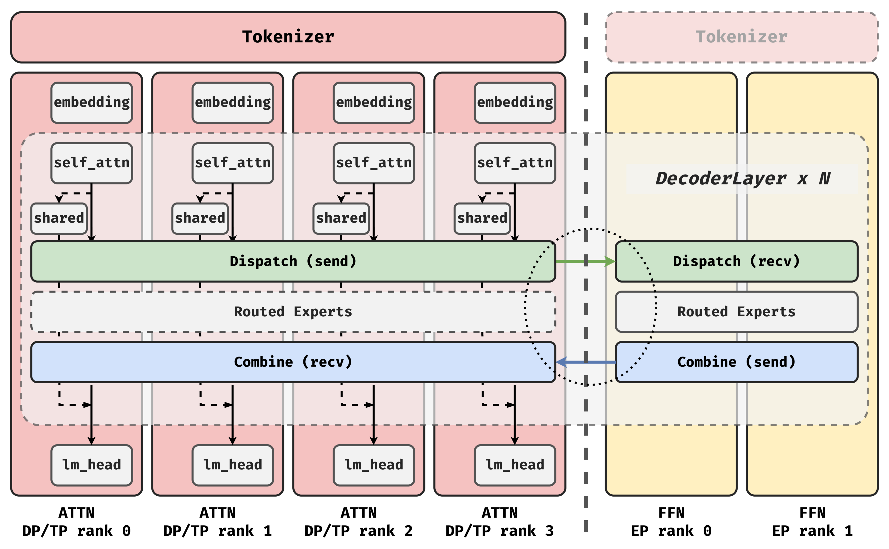
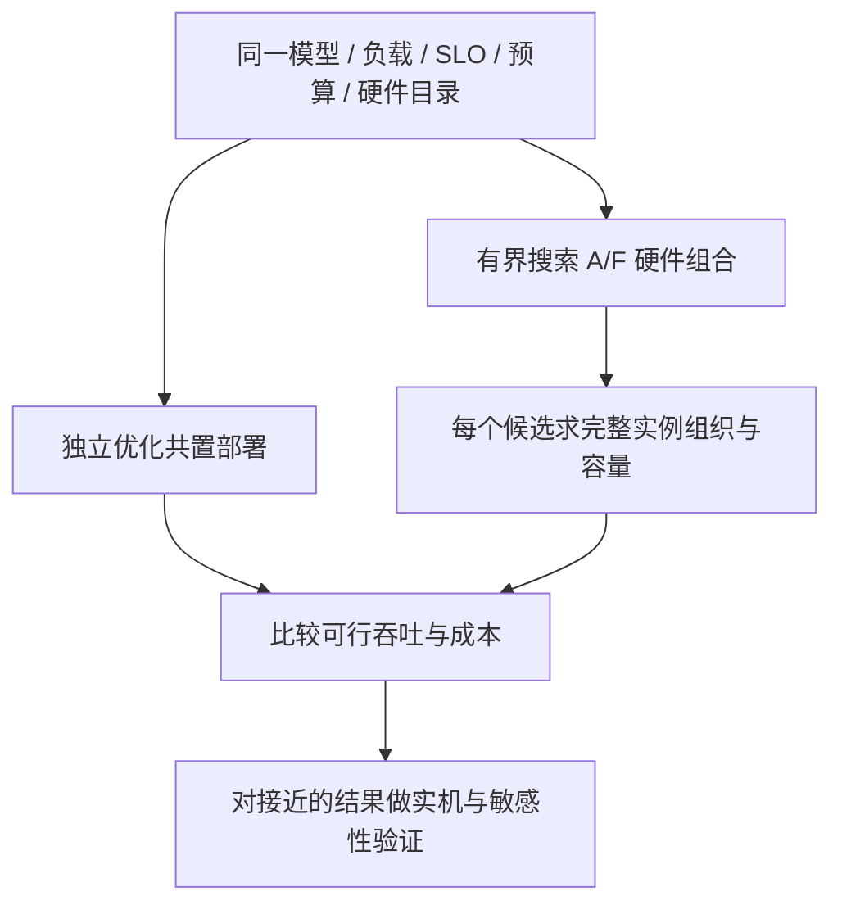
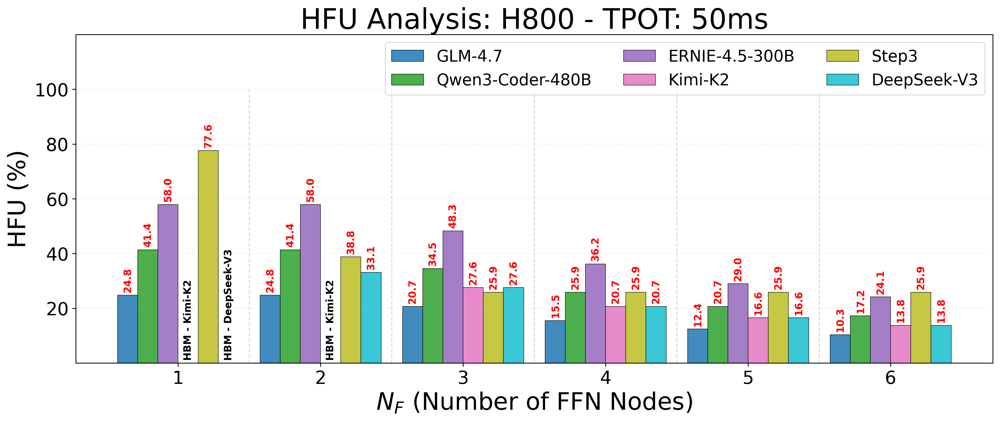

# Attention–FFN 分离的收益边界与部署选型学习文档

把推理拆成更多资源池，会让每个池更专业，也会增加往返、排队和协调。判断该不该拆，必须比较相同预算与服务目标下，两种架构各自能做到的最好部署。

本文属于**第三方资料整理型学习文档**，以 AFD-Ledger、百度百舸 AFD 分析和 AInfer-PD 为主线，解释“独立扩容的好处什么时候抵不过通信与调度成本”。没有运行作者代码，没有进行集群实验或采购测算。

## 0. 阅读基线与范围

| 项目 | 内容 |
| --- | --- |
| 原文标题 | 再拆一层就亏：PD分离的第二刀，撞上了33%的天花板 |
| 原文链接 | [HyperAI 原文](https://mp.weixin.qq.com/s/cY0zoJptia-eu91z197ykw) |
| 作者 / 机构 | HyperAI |
| 发布时间 / 读取时间 | 原文 2026-09-11 08:31:45，Asia/Shanghai；读取 2026-09-14 |
| 核对方式 | 阅读下列三篇论文 v1 的正文、方法与评测边界 |
| 不展开 | 原文厂商路线图、市场采用率、采购报价，以及 SMARTGEN / KVServe 等旁支数字的完整复核 |
| 图片 | 原文无正文位图，仅一个三色圆点装饰 SVG；补充百度论文架构与 H800 HFU 原图，见[图片来源](../images/afd-deployment/SOURCES.md) |
| 查重 | 原文链接、题名及三项主线未见已有专篇；现有分层内存资料只涉及其他 AFD 方案 |

| 一手来源 | 作者 / 机构 | 固定版本与用途 |
| --- | --- | --- |
| [AFD-Ledger: Deployment Provisioning for Attention–FFN Disaggregation](https://arxiv.org/html/2608.04502v1) | 清华大学、美团相关作者 | 2026-08，v1；固定预算下的离线部署比较 |
| [Revealing the Challenges of Attention-FFN Disaggregation for Modern MoE Models and Hardware Systems](https://arxiv.org/html/2602.09721v1) | Guowei Liu 等，百度百舸团队 | 2026-02-10，v1；通信 roofline、HFU 上界与不均衡 |
| [AInfer-PD: Communication-Safe In-Place Prefill–Decode Multiplexing for Distributed MoE Rollouts](https://arxiv.org/html/2609.00993v1) | 蚂蚁集团相关作者 | 2026-09，v1；同设备 P/D 并发的通信安全与 rollout 评测 |

先纠正原文的时间叙述：三篇并非都发表于 8–9 月，百度论文是 2 月。“33% 天花板”也不是所有模型和集群共同的极限。

| 术语 | 人话解释 |
| --- | --- |
| PD 分离 | 按请求执行阶段分成 Prefill 池与 Decode 池 |
| AFD | 在模型层内部把 Attention 与 FFN / 路由专家放到不同资源上 |
| EP | 将专家放到不同 rank，按 token 路由分发和合并 |
| scale-up / scale-out | 紧密互连域内通信 / 跨更大节点域的通信；看实际拓扑，不只看名称 |
| OFU / HFU | 算子活跃期间的算力利用 / 把等待也计入时间后的硬件算力利用 |
| goodput | 在指定 SLO 下能有效完成的服务量 |
| makespan | 完成整组固定工作负载所需的时间 |

## 1. 第一刀和第二刀搬的是不同东西



**图意解读：** Attention 一侧保留请求相关状态，FFN 侧持有路由专家；激活发到专家侧，结果返回。注意“Attention 池”不是只运行一个 attention kernel，其他模型层操作的归属取决于实现。

| 切分 | 边界处的数据 | 发生频率 | 主要希望解决的问题 |
| --- | --- | --- | --- |
| PD | 已建立的 KV / 模型状态 | 典型单轮每次 P→D 交接；多轮可重复 | Prefill 和 Decode 的资源干扰 |
| AFD | 中间激活与专家输出 | 涉及的层、生成步和 microbatch 持续发生 | 专家计算、容量与 Attention 状态的配比 |
| PP | 层间激活等 | 每个 microbatch 跨 stage | 模型层容量与流水线执行 |

AFD 并不意味着一定搬运“比 KV 更多的总字节”，总量还依赖层数、生成长度、隐藏维度、top-k 路由和通信合并。确定的变化是：通信进入逐层执行依赖，更难仅靠一次交接摊薄。


**图意解读：** 整理者画的是依赖关系。调度可让不同 microbatch 交叠，但同一个 microbatch 必须等自己的专家结果回来。

## 2. 怎样判断拆分是否回本

### 2.1 先看最慢阶段，再看总预算

粗略串行模型为：

```text
每层耗时 ≈ Attention + dispatch + FFN + combine + 其他开销
```

存在重叠时不能直接相加，但也不能把所有通信删掉。稳态节拍受最慢计算 / 通信阶段和依赖空洞限制，端到端延迟还包括流水线填充、排队和尾部等待。

**整理者例子：** 某层原来 Attention 3 ms、FFN 5 ms。拆分后 FFN 变成 2 ms，但新增不可隐藏的往返为 4 ms，单请求串行路径从 8 ms 变成 9 ms。多请求吞吐可能因重叠改善，不过必须同时检查单 token SLO 和为 FFN 池新增的卡数。

### 2.2 固定预算下，承载请求的资源也会减少

可以用一个教学近似式拆解吞吐比：

```text
吞吐比 ≈ 请求承载资源数之比 × 每资源驻留 batch 之比 × 原 TPOT / 新 TPOT
```

这不是任何拓扑都能直接套用的性能模型。它提醒我们：如果抽走一批卡专门当 FFN 池，剩下 Attention 侧要靠更大 batch 或更短 TPOT 补回承载资源减少的损失。只展示单个 FFN kernel 变快，会漏掉这一项。

## 3. AFD-Ledger：两边都重新调优后再比较

AFD-Ledger 将模型、工作负载、TPOT SLO、预算、可选硬件和运行时能力固定，分别求 AFD 与共置方案的部署配置。硬件分工和实例组织同时改变，所以“Attention 买便宜卡、FFN 买强卡”的单卡经验不保证整体最优。[论文 §2–3](https://arxiv.org/html/2608.04502v1#S3)



**图意解读：** 搜索的是完整部署，而不是把某个原始 AFD 配置和未经调优的 baseline 放在一起。图中的最后一步是整理者建议，用来处理模型误差与实际开销。

论文报告的 68.8%–83.5% 是在可穷举空间里减少的**完整候选评估次数**，不等于生产推理省掉相同比例 GPU 时间。其三个 LongCat 2.0 验证点使用 Ascend 910C、共 160 卡、32K / 64K / 120K 输入，预测吞吐比与测量的差异为 6.6%–9.6%；这不是任意集群的误差保证。[论文 §5](https://arxiv.org/html/2608.04502v1#S5)

**判断例子：** 如果解析模型预测 AFD 只赢 3%，而你的硬件尚未校准，就不能把这个差距当作确定收益。先检查调度、内核、网络竞争和容量估算，必要时把两者列为近似持平。

## 4. 百度分析：为什么“加 FFN 卡”会进入死区

### 4.1 机器有算力，却没有足够工作可算

FFN 的 token 供给受通信带宽和每层时延预算约束。如果网络在预算内最多送来这么多 token，再增加 FFN 节点只是把有限工作摊得更薄。专家数量还要按整数分配，分工无法连续变化。[百度论文 §3.1–3.2](https://arxiv.org/html/2602.09721v1#S3)

```text
可执行 token 数 ≤ 时间预算内可传入的 token 数
HFU ≈ 算子活跃效率 × 算子活跃时间占比
```

**整理者例子：** 某 FFN GEMM 执行时达到峰值算力的 90%，但每 10 ms 只有 3 ms 在运行，则这段时间的近似 HFU 只有 27%。内核再快一点也未必改善等待造成的低利用率。



**图意解读：** 横轴为 FFN 节点数，纵轴为 HFU，标题固定 TPOT 预算为 50 ms；不同颜色对应不同模型，容量不满足的配置标为 HBM。它用于解释专家节点数量变化与时延预算、硬件利用率的关系，不能看作对所有 H800 集群的实测曲线。论文的 33.1% 来自其非 Superpod H800、DeepSeek-V3 及预算假设下的 FFN 阶段理论上界，甚至假定活跃期 OFU 为 100%；约 60% 的 EP 对照使用论文引用 / 分析中的另一套利用口径，不是本文复现的一组全系统对照实验。

**单位提醒：** 带宽推导必须统一 bit 与 byte。400 Gb/s 理论上约为 50 GB/s；不能把 50 Gb/s 当成 50 GB/s。原论文个别文字里的 GbE 表述应结合公式和硬件表核对。

### 4.2 3BO 不是通信消失术

论文在其阶段预算假设下讨论三 microbatch 重叠。多一条可运行工作能填补依赖空洞，但也提高了对均衡和抖动的敏感性；专家热点、长上下文差异或网络波动仍可能使空洞在 A/F 两边传播。

有利条件包括更充分的互连带宽、更粗粒度专家和较低稀疏度。应重新代入具体模型与设备参数，不能根据“国产”“非超节点”或某个产品名称直接判定必然碰到 33.1%。

## 5. AInfer-PD：把状态留在原地，需要解决什么

### 5.1 它回答的是另一类问题

AInfer-PD 针对多轮 RL rollout。不同轨迹不断结束 Decode、执行环境交互、再产生新的 Prefill，P/D 共存贯穿整批任务。它共享模型权重与 KV，避免为阶段切换另设模型实例和搬 KV。[论文 §1–2](https://arxiv.org/html/2609.00993v1#S1)

这不直接证明 AFD 无效：AFD 比较的是层内角色分工，AInfer-PD 优化的是同设备上的阶段并发，而且主目标是完成整批 rollout。

### 5.2 两条流并发为何可能卡住

```text
rank 0 的通信入队顺序：P collective → D collective
rank 1 的通信入队顺序：D collective → P collective
```

这是整理者简化示例。交叉通信域、设备进度和资源占用可能形成环形等待，给 P 和 D 各建一条 CUDA stream 不足以保证正确。AInfer-PD 协调跨 rank 的冲突通信顺序，并让正常 P 路径与低延迟 D 路径独立持有 DeepEP 的可变通信状态。


**图意解读：** 这是论文机制的简化逻辑图，控制的是入队秩序。收到一个阶段许可，不表示该段 GPU 已经执行结束；共享权重与 KV，也不等于通信缓冲、计数器和 QP 范围可以共享写入。

### 5.3 更快完成 rollout，可能牺牲 TTFT

论文的单节点内部 RL trace 回放包含 128 条会话、1,265 个请求；相比关闭复用的同引擎，固定工作量完成时间降低 7.1%–22.5%。双节点评测又报告相对同引擎 p99 TTFT 上升 13.2%–37.9%。不能只取相对 SGLang 的收益，再把 TTFT 代价省略。[论文 §7，尤其表 6](https://arxiv.org/html/2609.00993v1#S7)

## 6. 一套可复用的选型记录

| 先固定 | 至少记录 | 不这样做会怎样 |
| --- | --- | --- |
| 工作负载 | 初始 / 追加输入、输出长度、轮数、环境等待、到达分布 | 单轮结果错误迁移到 Agent |
| 模型 | 层数、专家数量和 top-k、KV 结构、精度、投机配置 | 激活 / 状态大小估错 |
| 拓扑 | 各级有效带宽、延迟、网络竞争、每角色实例数 | 用网卡标称带宽代替实际预算 |
| 服务目标 | TTFT、TPOT / ITL、分位数、失败率、makespan | 不同目标的“最优”混为一谈 |
| 成本 | 总卡数或同一价格体系、功耗、冗余 | 用多花钱换来的吞吐假装效率提升 |
| 基线 | 两边都优化 batch、并行、缓存、角色比例 | 只打赢一个较弱配置 |
| 证据 | 解析 / 模拟 / 实机 / 生产分别标注 | 理论值变成生产承诺 |

建议从最便宜的建模开始，筛掉明显不满足带宽或容量的组合，再对差距小、状态复杂的候选做有代表性的实机对照。本文没有执行表中的实验。

## 7. 原文结论采用与保留表

| 原文表述 | 本文处理 |
| --- | --- |
| AFD 需要与优化后的共置方案比较 | 采用，并说明固定预算和 SLO |
| 非超节点有 33.1% 天花板 | 限定为百度论文的特定配置与 FFN 阶段理论值 |
| 三份 8–9 月报告同时刹车 | 修正：百度论文发表于 2 月 |
| 第一刀争论已经结束 | 不作为事实；PD 收益仍依赖负载、网络与缓存 |
| 旁支论文和厂商多倍收益 | 不纳入本篇量化论据，未做逐项一手复核 |
| 多切一刀固定付三次钱 | 作为提醒有用，不能当严格成本公式；通信可流水化，失败域也需按实现定义 |

## 8. 自测与延伸

- **FFN kernel 快一倍，系统吞吐一定快一倍吗？** 还受请求承载容量、通信节拍和 SLO 约束。
- **模型预测收益 5%，可以直接宣布获胜吗？** 先看模型误差、缺失开销与实机差异。
- **把 P/D 合回同设备是否只需两条 stream？** 还要处理跨 rank 的通信顺序和共享状态。
- **AFD 与 PD 谁替代谁？** 它们切分维度不同，可以组合，也可以分别评估。

相关资料：[KV Cache 与 MoE 权重的分层内存](<KV Cache 与 MoE 权重的分层内存学习文档.md>)、[多轮 Agent 的 PD 路由与跨数据中心 Prefill](<多轮 Agent 的 PD 路由与跨数据中心 Prefill 学习文档.md>)、[PD 分离下的 PP](<../sglang/PD 分离下的 PP 源码学习文档.md>)。

**一句话总结：** 拆分能否获利由完整部署的预算、状态局部性、通信节拍和服务目标共同决定，单算子效率与单个理论上界都不能独立决定架构。
