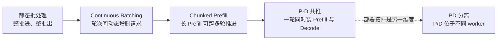
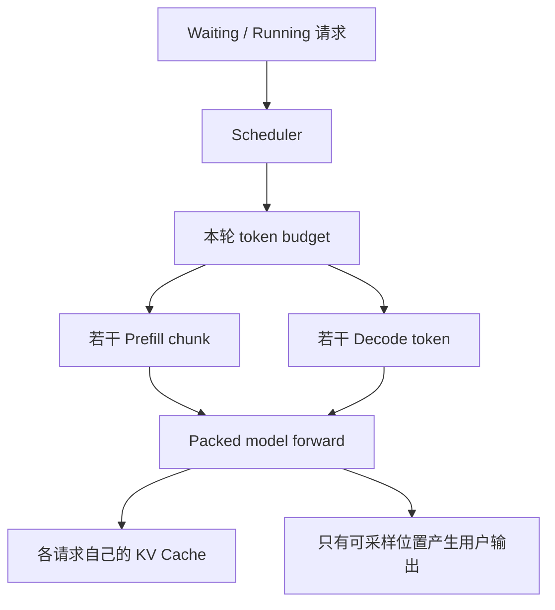
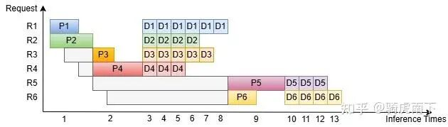
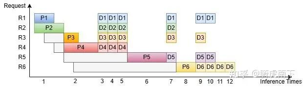
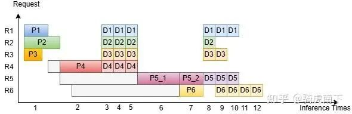
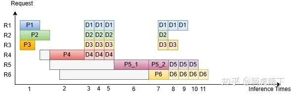
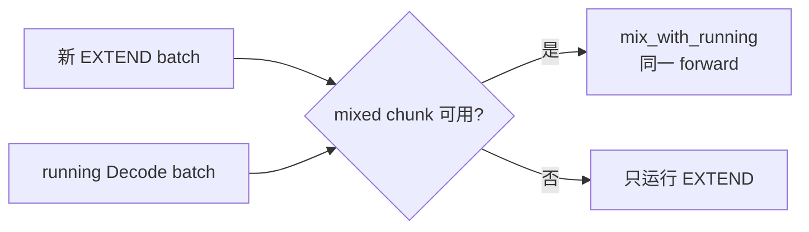

# Chunked Prefill 与 Prefill-Decode 共推学习文档

本文面向第一次理解大模型在线调度的同学，回答三个容易混在一起的问题：

1. Continuous Batching 已经能动态增删请求，为什么还需要 Chunked Prefill？
2. Prefill chunk 和 Decode token 怎样进入同一次模型 forward？
3. 文章所说的“PD 共推”，和把 Prefill、Decode 放到不同节点的“PD 分离”是不是一回事？

先给结论：**Chunked Prefill 先把长 Prefill 切成可调度片段，P-D 共推再把片段与 Decode token 装进同一轮 token budget。** 前者创造重新调度的边界，后者利用一轮里尚未用满的计算容量。它们都属于单实例内部调度，不等于 PD 分离。

本文是第三方资料整理型学习资料，并用本地 SGLang、vLLM 源码做了关键路径抽查；没有运行 benchmark，也不把原文示意时间线当作性能承诺。

> 历史基线说明：表中上游链接用于定位开源项目；本文的 `muxi-main` 是历史阅读分支，不表示该分支或提交属于官方 `main`。历史结论需按所列版本核对；当前开源实现请使用固定的官方源码链接。

## 0. 阅读基线与范围

### 0.1 原文基线

| 项目 | 内容 |
| --- | --- |
| 原文标题 | 《介绍一下大语言模型Chunked Prefill调度与PD共推技术》 |
| 原文链接 | https://mp.weixin.qq.com/s/VS-Uz1QsPLCZG4U9ygKD0Q |
| 原始发布链接 | https://zhuanlan.zhihu.com/p/1975453978205647475 |
| 作者 | 骑虎南下 |
| 发布账号 | 吃果冻不吐果冻皮 |
| 发布时间 | 2025-12-13 |
| 读取时间 | 2026-08-03 |
| 资料类型 | 调度机制图文 |
| 整理范围 | 静态批处理、Continuous Batching、Chunked Prefill、P-D 共推的递进关系 |
| 不展开内容 | PD KV 传输协议、特定 Attention kernel 实现、原文性能复现 |

### 0.2 源码抽查基线

| 项目 | SGLang | vLLM |
| --- | --- | --- |
| 项目上游 | [sgl-project/sglang](https://github.com/sgl-project/sglang) | [vllm-project/vllm](https://github.com/vllm-project/vllm) |
| 分支 | `muxi-main` | `main` |
| commit | `453b33c46be575da6973b31c2d89d9455679110d` | `f727951d3f0dbeb9acdb8a2f7ebfecaeb67090b3` |
| 工作区状态 | 有本地改动与未跟踪文件；本文只读 | 干净；本文只读 |
| 验证方式 | 抽查 Scheduler 与 mixed chunk 路径 | 抽查 V1 Scheduler 与 KV Cache Manager |

源码基线用于说明“当前本地版本怎样表达这件事”，不代表上游所有版本都采用相同参数、队列或默认策略。

### 0.3 术语速查

| 术语 | 人话解释 |
| --- | --- |
| Static batching | 一批请求一起开始，通常等整批结束再换下一批 |
| Continuous Batching | 每轮都可以移除完成请求、补入新请求 |
| Chunked Prefill | 把一个长 prompt 的 Prefill 拆成多轮推进 |
| P-D 共推 | 同一个 forward batch 中既有 Prefill token，也有 Decode token |
| PD 分离 | Prefill 与 Decode 放到不同 worker 或节点，靠 KV 传输衔接 |
| Token budget | 一轮允许模型新计算的 token 总额度 |
| Packing | 不用 padding 把不同请求的有效 token 紧凑组织起来 |
| TTFT | 从请求到达到首 token 返回的时间 |
| ITL/TPOT | 生成阶段相邻 token 的间隔 |

## 1. 先建立整体地图

### 1.1 四种调度不是同一个层次



递进关系是：

- Continuous Batching 把调度边界从“整批完成”缩短到“每次 forward 完成”。
- Chunked Prefill 又把一个超长 Prefill 从一次 forward 拆到多个 forward。
- P-D 共推进一步利用每轮 token budget，把不同阶段的 token 一起提交。
- PD 分离改变的是 worker 拓扑，不负责定义单个 worker 内部怎样装 batch。

### 1.2 控制面与数据面



**整理者归纳：** Scheduler 拥有控制权，决定谁在本轮推进多少 token；模型执行器负责数据面计算。虽然 token 被 packing 到同一个 batch，各请求仍读取自己的历史 KV 和位置元数据，不会互相看见上下文。

## 2. 从静态批处理到 Continuous Batching

### 2.1 静态批处理为什么浪费



**图意解读：** 横轴是模型 forward 次数，纵轴是请求。`P1...P6` 是各请求的完整 Prefill，`D1...D6` 是逐 token Decode。静态批处理让后到请求先等当前批次收尾；当批内请求完成时间不同，后半段并发度不断下降。灰色区域表现的是排队，不是 GPU 数据传输。

### 2.2 Continuous Batching 改了什么



**图意解读：** 完成的请求能在轮次边界退出，新请求也能补位，因此 `P5`、`P6` 更早开始，Decode batch 也能重新填满。控制面的调度频率变高了，但一段完整长 Prefill 仍可能占据整个 forward；Continuous Batching 本身没有保证 Prefill 一定会被切开。

### 2.3 一个容易忽略的代价

新 Prefill 插入运行中的 Decode 流，会让部分 Decode 请求多等一个 Prefill forward。因此系统目标不能只看总推理轮数，还要同时看：

```text
TTFT: 新请求多快拿到首 token
ITL: 已运行请求的输出是否被插入的 Prefill 拉长
Throughput: 单位时间总共处理多少 token
```

Continuous Batching 提高平均利用率，不自动保证 ITL 稳定。

## 3. Chunked Prefill 创造了哪些新边界

### 3.1 从“按请求接纳”变成“按 token 接纳”

原文假设一次 Prefill 最多处理 768 tokens。若三个 prompt 分别是 256、384、128 tokens，它们可以 packing 成 `256 + 384 + 128 = 768`，不必受“每次只能两个请求”的人为限制。

当 1024-token prompt 到来时，也可以拆成 768 和 256 两段，而不是让一次 forward 超过预算。



**图意解读：** `P5_1`、`P5_2` 表示同一请求的两个 Prefill chunk。图的关键不是固定切成两段，而是调度单位从整条 prompt 变成“本轮可容纳的 token 片段”。已完成 chunk 的 KV 必须保留，下一段才能从正确历史继续计算。

### 3.2 切 chunk 不等于并行计算同一请求

普通 Chunked Prefill 是时间维度上的多轮推进：

```text
chunk 1 forward -> 保存 KV -> chunk 2 forward -> 保存 KV -> ...
```

它不会自动把一个请求的多个 chunk 同时放到多张卡；后者属于 Context Parallel、PCP 等空间并行问题。

### 3.3 每个边界给 Scheduler 三次机会

一个长 Prefill 被切开后，Scheduler 可以在 chunk 边界：

1. 接纳刚到达的短 prompt。
2. 推进已经在生成的 Decode 请求。
3. 因 KV 容量、优先级或后端限制改变本轮组合。

但“有边界”不等于“必然穿插 Decode”。具体是否混合，取决于框架策略和开关。

## 4. P-D 共推怎样减少空槽

### 4.1 人话版

假设本轮预算是 768 tokens，而最后一个 Prefill chunk 只有 512 tokens。如果只做 Prefill，剩下 256-token 额度没有利用。P-D 共推会尝试把若干运行请求的 Decode token 也放进这一轮。



**图意解读：** 图中第 7 次 forward 同时包含 `P5_2`、`P6` 和若干 `D`，把原先分开的计算合并，示例总轮数从 12 降到 11。这里的“共推”发生在同一个模型实例、同一个 forward，不包含跨节点 KV 传输。

### 4.2 它不是让 Attention 跨请求相连

原文用“大部分算子是 token-wise”解释 packing，这个直觉有帮助，但不能理解成 Attention token 彼此独立。更准确的说法是：

- LayerNorm、线性层、MoE 路由等可以对 packed token 批量执行。
- Attention 仍需要每个 token 的请求边界、位置和历史 KV。
- Varlen/Paged Attention 根据元数据把不同请求隔离，各自执行正确的 causal attention。
- Prefill token 不会读另一个请求的 KV，Decode token也不会读尚未完成的未来 chunk。

### 4.3 为什么少一次 forward 可能更快

Decode 常受模型权重读取与内存带宽限制。如果本来要先做一次小 Prefill、再做一次 Decode，共推有机会让两类 token 共享一次权重遍历和调度开销。

这是机制上的机会，不是固定收益：混合后的 shape、Attention backend、MoE All-to-All、CUDA Graph 命中和 kernel 效率都可能改变结果。

## 5. 当前 SGLang 源码怎样表达共推

### 5.1 默认路径：先尝试 Prefill

源码锚点：

| 行为 | 源码 |
| --- | --- |
| 初始化 chunk 状态与 mixed 开关 | `python/sglang/srt/managers/scheduler.py::init_chunked_prefill` |
| 每轮选择 Prefill 或 Decode | `scheduler.py::get_next_batch_to_run` |
| 接纳并截断长请求 | `scheduler.py::_get_new_batch_prefill_raw` |
| 把 running Decode 混入 EXTEND | `scheduler.py` 的 `Mixed-style chunked prefill` 分支 |

当前源码先调用 `get_new_batch_prefill()`；有新 Prefill batch 时直接返回，只有没有 Prefill 可跑时才更新 running Decode batch。因此默认路径仍是 Prefill-first。

### 5.2 `--enable-mixed-chunk` 才是同轮共推开关

`init_chunked_prefill()` 只有在 chunking 有效且 `enable_mixed_chunk` 打开时，才令 `is_mixed_chunk=True`。之后新 EXTEND batch 会在满足下列条件时调用 `mix_with_running()`：

- running batch 非空；
- Prefill/Decode 都不要求当前不兼容的 logprob 返回；
- 新 batch 不使用会造成 shape 不匹配的 `input_embeds` 路径。



所以“Chunked Prefill 一定与 Decode 交替或混跑”不是 SGLang 的稳定事实。**chunking 提供切点，mixed chunk 决定是否同轮装入 Decode。**

### 5.3 一个版本边界

当前源码还显示：

- Scheduler 只有一个主 `chunked_req` 槽位，并用断言保护单一所有权。
- `chunked_prefill_size` 在普通路径要求可被 `page_size` 整除。
- dynamic chunking 只在 `pp_size > 1` 时启用。
- 某些 speculative、DP attention、输入 embedding、logprob 路径会限制混合。
- `enable_pdmux` 与 Chunked Prefill 在当前参数校验中不兼容。

最后一条尤其说明：SGLang 的 “PDMux” 是具体功能名，不能因为名字相似就等同于本文泛指的 P-D 共推。

## 6. 当前 vLLM 源码怎样表达共推

### 6.1 Scheduler 刻意不划死 Prefill/Decode 阶段

`vllm/v1/core/sched/scheduler.py::schedule` 的注释直接说明：Scheduler 没有独立的 decoding phase 或 prefill phase。它只比较：

```text
request.num_tokens_with_spec - request.num_computed_tokens
```

差值为 prompt 剩余部分时，就是 Prefill；差值接近 1 时，就是普通 Decode。两者共享 `token_budget`。

### 6.2 为什么一个 batch 自然可能同时含 P 和 D

当前流程是：

1. 先遍历 `running` 请求。
2. 每个请求按未计算 token 数、`long_prefill_token_threshold` 和剩余 budget 决定本轮推进量。
3. budget 尚有剩余时，再从 `waiting` 接纳新请求。
4. 为每个请求调用 `KVCacheManager.allocate_slots()`，最后形成统一 `SchedulerOutput`。

`running` 里既可能有 Decode 请求，也可能有上一轮尚未完成的 Prefill 请求。因此“running 先调度”不等于“每个 running 请求都只分配一个 Decode token”。当前实现用同一套差值追赶逻辑覆盖两种状态。

### 6.3 Token budget 是上限，不是固定 chunk size

当前配置中：

- `enable_chunked_prefill=True` 允许等待请求受剩余 budget 截断。
- `max_num_batched_tokens` 是单轮模型容量配置；实际 Scheduler 可用 `max_num_scheduled_tokens` 作为发放上限。
- `long_prefill_token_threshold=0` 表示默认不额外施加单请求长 Prefill cap。

因此某请求的实际 chunk 通常为多个约束的最小值，而不是固定等于 2048：

```text
num_new_tokens
= min(
    请求尚未计算的 token,
    long prefill cap（若启用）,
    本轮剩余 token budget,
    模型长度与特殊后端约束
  )
```

## 7. “PD 共推”与“PD 分离”必须分开

| 维度 | P-D 共推 | PD 分离 |
| --- | --- | --- |
| 位置 | 同一模型实例、同一 forward | 不同 worker/节点 |
| 目标 | 填满一轮计算、减少小 batch | 隔离资源、独立扩缩容 |
| KV | 本地按请求访问 | Prefill 侧生成后传给 Decode 侧 |
| 主要代价 | 混合 shape 与阶段干扰 | 网络传输、路由、状态一致性 |

两者可以组合，但组合后的含义要具体分析：

- 纯 Prefill worker 内部可以对多个 prompt 做 Chunked Prefill，但没有本地 Decode token 可供“共推”。
- Decode worker 若严格只接收已完成 Prefill 的请求，通常只有 Decode。
- 混合路由、回退重算或非严格拆分部署中，某个 worker 才可能再次出现 P-D 混合。

因此“PD 分离后仍应默认 P-D 共推”不是普遍结论。

## 8. 收益、代价与调参顺序

### 8.1 可能收益

- 长 Prefill 不再形成一个不可重新决策的超长 forward。
- 新短请求能在 chunk 边界更早被接纳，改善 TTFT 尾部。
- Decode token 可填充 Prefill batch 的剩余预算，减少小 batch。
- 更小 chunk 通常降低单轮 activation 峰值。

### 8.2 可能代价

- chunk 太小会增加调度、kernel launch 和状态维护次数。
- chunk 太大仍会造成 ITL 尖峰。
- 已完成 chunk 的 KV 要持续驻留，最终 KV 容量并未减少。
- MoE 中混合大量 Prefill token 与少量 Decode token，可能带来专家负载和 All-to-All shape 波动。
- 某些 logprob、speculative、multimodal 或特殊状态缓存路径不支持任意混合。

### 8.3 建议压测矩阵

| 变量 | 至少观察 |
| --- | --- |
| chunk / long prefill cap | TTFT P99、ITL P99、Prefill 轮数 |
| 单轮 token budget | 总吞吐、单轮时长、GPU 利用率 |
| mixed P-D 开关 | Decode 抖动、混合 batch 比例、kernel shape |
| 请求长度分布 | 短请求尾延迟、长请求完成时间 |
| KV 容量 | preemption/retract、block/page 使用率 |

不要只用“总 forward 次数减少”判断配置更好；在线服务最终要同时满足吞吐和延迟 SLO。

## 9. 排障地图

| 现象 | 优先确认 | 可能解释 |
| --- | --- | --- |
| 开了 chunking 仍看不到 P-D 混合 | 框架 mixed 开关与兼容条件 | 只有切点，没有启用同轮混合 |
| Decode ITL 周期性尖峰 | 尖峰是否与大 chunk 同步 | chunk 太大或 Prefill-first 路径 |
| 长 prompt 被切得很碎 | 总 token budget、单请求 cap | budget 被 running 请求占用 |
| 吞吐下降但 ITL 变稳 | forward 次数与 kernel shape | chunk 过小的典型权衡 |
| Prefix 命中后 chunk 仍很大 | 命中长度与未命中后缀 | chunk 只约束还需计算的部分 |
| 文档说能混，实际参数报错 | 目标 commit、后端和功能组合 | 版本或兼容矩阵不同 |

## 10. 一句话总结

Continuous Batching 让请求能在 forward 边界进出，Chunked Prefill 让长 prompt 本身产生更多 forward 边界，P-D 共推则用统一 token budget 把 Prefill 片段与 Decode token 放进同一轮；PD 分离是另一条部署拓扑轴，不能用“PD”两个字把它们混成同一机制。

## 11. 参考与延伸

- 《介绍一下大语言模型Chunked Prefill调度与PD共推技术》：https://mp.weixin.qq.com/s/VS-Uz1QsPLCZG4U9ygKD0Q
- 原始发布链接：https://zhuanlan.zhihu.com/p/1975453978205647475
- [SGLang Chunked Prefill 与调度器显存预算学习文档](../sglang/SGLang%20Chunked%20Prefill%20与调度器显存预算学习文档.md)
- [vLLM Chunked Prefill 与 Block Size 学习文档](../vllm/vLLM%20Chunked%20Prefill%20与%20Block%20Size%20学习文档.md)
- [PD 分离下的 PP 源码学习文档](../sglang/PD%20分离下的%20PP%20源码学习文档.md)

本文对原文机制做了二次整理，并对两个本地源码版本做静态抽查；未进行性能复现。原图中的轮次数与容量只服务于示例，不应外推到真实模型和硬件。
