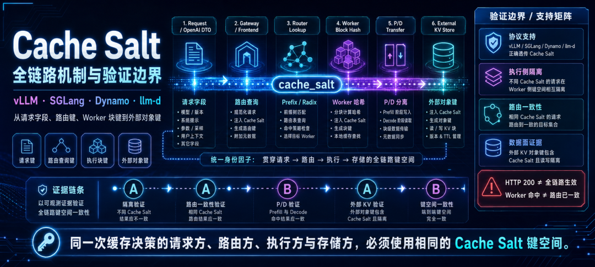
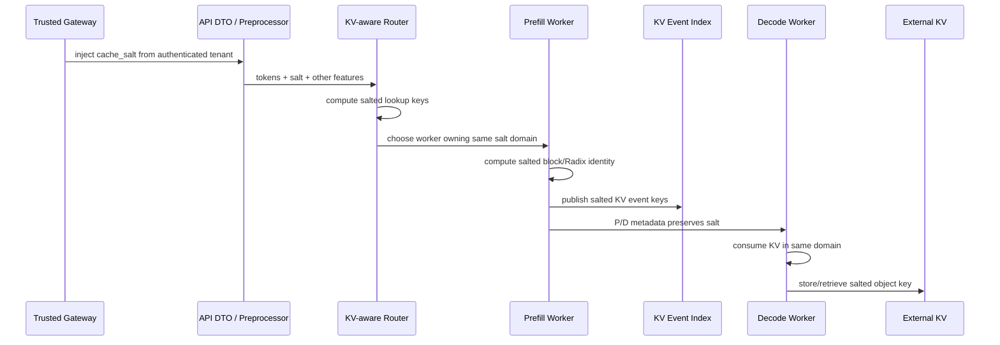
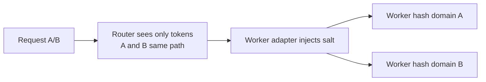

# KV Cache Salt 全链路键空间学习文档

本文面向需要在共享推理实例中隔离 Prefix Cache、或想用同一进程稳定构造冷/热缓存实验的工程同学。重点不是“API 能不能接收 `cache_salt`”，而是请求方、Router、Worker、KV event、P/D transfer 和外部存储是否始终使用同一个键空间。

本文是第三方资料整理型学习资料，不是 vLLM、SGLang、Dynamo 或 llm-d 当前版本的源码审计。原文包含作者的实际源码修改和环境验证；本文只整理证据边界，不声称复现这些环境。

## 0. 阅读基线与范围

| 项目 | 内容 |
| --- | --- |
| 原文标题 | 《KV Cache Salt 全链路机制与验证：vLLM、SGLang、Dynamo 与 llm-d》 |
| 原文链接 | <https://mp.weixin.qq.com/s/2q4ycpe8mXuoZsROzLLv0A> |
| 作者/机构 | AI码酱 |
| 发布时间 | 2026-08-14 |
| 读取时间 | 2026-08-25 |
| 资料类型 | 多组件源码定位与环境验证记录 |
| 整理范围 | salt 语义、三类身份、九跳传播、vLLM/SGLang/llm-d/Dynamo 证据、A/A/B/A/B、P/D 与外存验收 |
| 不展开内容 | 原文私有 patch、镜像构建细节、当前主线完整源码、密码学密钥管理 |
| 官方核对 | vLLM 当前 Prefix Caching 文档确认：`cache_salt` 注入首个 block hash，仅相同 salt 可共享后续链式 blocks |
| 验证边界 | vLLM 通用机制已对照官方文档；SGLang/Dynamo/llm-d 的版本特定行为均保留为“原文实测/原文源码核对”，本文未复验 |

### 术语速查

| 术语 | 人话解释 | 不能证明什么 |
| --- | --- | --- |
| `cache_salt` | 调用方控制的 Prefix Cache 命名空间因子 | 不是认证或加密 |
| Request identity | 当前请求想查哪个缓存域 | 不等于 Router 真使用了它 |
| Routing identity | Router 查询缓存位置的 key | 不等于 Worker 实际 block key |
| Storage identity | Worker/外存真正保存的 block/object key | 不等于请求被正确路由 |
| `cached_tokens` | Worker 报告本请求复用多少 tokens | 不证明 P/D 真传输或多 Worker 选点正确 |
| A/A/B/A/B | 同 prompt 只切 salt 的正/负控制序列 | 只能证明观察到的那一层 |

## 1. Salt 是命名空间，不是安全边界的全部

没有 salt 时，简化缓存身份可能是：

```text
cache key = model + token blocks + adapter/multimodal features
```

加入 salt：

```text
cache key = model + token blocks + cache_salt + other cache features
```

相同 tokens、相同 salt 可以复用；相同 tokens、不同 salt 必须落入不同缓存域。

### 它能做什么

- 在共享 model instance 中隔离 tenant/business/session 的 Prefix Cache；
- 允许同一信任域继续复用公共 system prompt；
- 不重启进程就构造稳定 cold/hit 测试组；
- 降低跨信任域通过命中延迟推测缓存内容的风险。

### 它不能做什么

- 不验证请求者是谁；
- 不加密 KV bytes；
- 不自动限制调用方伪造其他租户的 salt；
- 不保证 Router、KV event、P/D、外存已经同步支持；
- 不替代模型、adapter 和多模态输入等其他 cache features。

因此应由可信 Gateway 根据认证身份生成稳定、不可预测的 salt，并阻止普通调用方覆盖。若每个请求随机新 salt，隔离成立但缓存永久冷算；若用户可任意填写其他租户 salt，隔离依据就失去信任。

## 2. 一张图看完整键空间



**图意解读：** 原图从请求 DTO、Gateway、Router、Worker、P/D 到外部 KV Store 画出 `cache_salt` 必须传播的链路，并把 HTTP 200 与“全链路生效”明确分开。图中的支持矩阵来自原文版本与环境，不是当前所有版本的实时状态。

### 三类身份必须一致

```text
request identity
  = model + token sequence + cache_salt + cache features

routing identity
  = Router 查询 worker 缓存归属使用的 block keys

storage identity
  = Worker / external KV 保存和发布的 block/object keys
```

全链路不变量：

> 参与同一次缓存决策的请求方、路由方、执行方与存储方，必须使用相同的 salt 编码、block 边界和键空间。

## 3. 九跳传播路径



逐跳检查：

1. Gateway 基于认证结果注入 salt；
2. DTO 接收字段，tokenize 后仍保留；
3. Router 用 tokens + salt 计算请求侧 block keys；
4. Router 在同一域中选择 Prefill Worker；
5. Worker 用同一 salt 构造 vLLM block hash 或 SGLang `RadixKey`；
6. KV events 发布相同编码的 key；
7. P/D 路由和 transfer metadata 保留该域；
8. Decode Worker 消费同域 KV；
9. LMCache/Mooncake 等外存 object key 继续包含该域。

任意一步中断，HTTP 仍可能成功：最常见降级是冷算、本地重算或错误选点，而不是直接报错。

## 4. vLLM：首块 salt 如何传播整条哈希链

vLLM 的 block hash 包含：

- parent block hash；
- 当前 block tokens；
- LoRA、多模态 hash、cache salt 等 extra features。

`cache_salt` 注入第一个可缓存 block 的额外哈希输入，后续 block 又依赖 parent hash，因此首块差异沿整条链传播：

```mermaid
flowchart LR
    S[cache_salt A] --> H0A[H0A = hash(tokens0 + A)]
    H0A --> H1A[H1A = hash(H0A + tokens1)]
    H1A --> H2A[H2A = hash(H1A + tokens2)]

    T[cache_salt B] --> H0B[H0B = hash(tokens0 + B)]
    H0B --> H1B[H1B = hash(H0B + tokens1)]
    H1B --> H2B[H2B = hash(H1B + tokens2)]
```

即使 token blocks 相同，A/B 的首块不同，所有后续 block identities 也不同。

### 原文实测

原文固定模型、长 prompt 与采样参数，只切 salt，得到两组类似结果：

```text
request:       A     A     B     A     B
cached_tokens: 0   448     0   448   448
```

或冷请求报告 `null`，热请求报告 3328。`0`/`null` 是版本输出差异；状态关系才是证据。

### 字段位置

标准语义是 Chat Completion 顶层字段：

```json
{
  "model": "model-name",
  "messages": [{"role": "user", "content": "..."}],
  "cache_salt": "tenant-domain"
}
```

把 salt 塞进 `messages` 文本或任意 metadata，不会自动进入 vLLM block hash，除非上层显式映射。

## 5. SGLang：入口和终点都有字段，中间仍可能丢

原文核对的预期路径：

```text
OpenAI cache_salt
-> _compute_extra_key
-> GenerateReqInput.extra_key
-> Scheduler Req.extra_key
-> RadixKey.extra_key
-> Radix Cache namespace
```

### v0.5.10.post1 的原文实测

原文环境中，协议字段、`GenerateReqInput` 和 `RadixKey` 已存在，但 Scheduler 创建内部 `Req` 时没有复制 `recv_req.extra_key`，结果为：

```text
request:       A       A       B       A       B
cached_tokens: null  3335    3335    3335    3335
```

B1 错误复用了 A 域。绕过 OpenAI parser、直接向原生 `/generate` 传不同 `extra_key` 仍失败，因此断点定位在 Scheduler 对象转换，而不是入口 parser。

原文称上游已在 v0.5.11 及后续版本修复该传播。这里必须保留版本边界：

- 能确认的是原文 v0.5.10.post1 镜像失败原因；
- “修复进入上游”不等于任意 v0.5.11+ 发行镜像和集群组合已完成运行验收；
- 升级后仍应重新跑 A/A/B/A/B。

### 可迁移教训

API DTO 和最终 cache key 同时存在字段，仍不能证明中间 Scheduler、queue message、RPC DTO 和 engine request 没丢字段。全链路审计要逐次对象转换检查。

## 6. llm-d：透传成功不等于精确路由成功

原文认为 llm-d OpenAI 路径同时保留 typed request 与完整 body map，Director 继续序列化 payload，因此未知扩展字段可以透传。

### 原文已覆盖

`llm-d Gateway -> direct-service -> 单个 vLLM worker` 的 A/A/B/A/B 符合预期，证明：

- Gateway 没丢字段；
- vLLM Worker 使用 salt 隔离本地 block hash。

### 原文未覆盖

多 Worker 下 EPP/PrecisePrefixCache 需要比较：

```text
request-side lookup key
vs
worker-published KV event key
```

salt、block 划分、序列化或 hash 算法任一不同，Router 都会在错误索引域查找。单 Worker direct-service 没有选点竞争，无法证明多 Worker 路由一致。

原文还指出，llm-d + SGLang 的失败仍来自 v0.5.10.post1 Scheduler 断点；同时其核对版本的 SGLang KV event/hash 是否包含 `extra_key` 仍是独立待验项。

## 7. Dynamo 1.0.1：Worker 正确也可能全局失败

### 顶层 DTO 拒绝

原文环境中，Dynamo 1.0.1 Rust `CreateChatCompletionRequest` 未定义顶层 `cache_salt`，它被当作 unsupported field 并在 Python preprocessor 前返回 400。

作者先借用已允许的 `metadata.cache_salt` 进入，再用 Python patch 把它旁路到 vLLM `TokensPrompt.cache_salt`。Worker A/A/B/A/B 通过，但日志出现 block hash mismatch。

### 假成功是怎么形成的

```text
Router local key
  = hash(token blocks + router-known features)

Worker block key
  = hash(parent + token block + cache_salt)
```

Python 注入发生在 Router 查询之后：



Worker 的本地隔离正确，但 Router 仍把 A/B 当成同一缓存路径。1P1D 只有一个 Prefill 候选，错误选点被拓扑掩盖；多 Prefill 才会暴露路由失效。

因此“单 Worker `cached_tokens` 正确”只证明执行侧，不足以声称 Dynamo P/D 全链路支持。

### 原文的 Rust 原生改造

原文最终修改 Rust 请求模型与 Service V2 preprocessor：

```text
top-level cache_salt
-> Rust request DTO + validation
-> OpenAI Preprocessor
-> PreprocessedRequest.extra_args.cache_salt
-> standard routing/P-D request lifecycle
-> vLLM Worker adapter
-> TokensPrompt.cache_salt
-> vLLM block hash
```

重建镜像后，1P1D 长请求获得 `0 / 128 / 0`，证明顶层字段传到 Worker；但 Router 仍给 B 请求约 0.89 的命中估算，说明 salt-aware scoring、request lookup 与 KV event identity 尚未闭环。原文明确把多 Prefill 选点留在验证边界之外。

## 8. P/D 数据面：HTTP 200 可能是 Decode 本地重算

原文一次 1P1D 调查同时看到：

- salt 隔离正确；
- HTTP 成功；
- NIXL remote agent 失效；
- successful transfer count 为 0；
- Decode 本地重算后完成请求。

所以：

```text
Cache Salt isolation succeeded
!=
Prefill KV transferred to Decode
```

P/D 验收至少同时观察：

| 证据 | 要看什么 |
| --- | --- |
| 请求级缓存 | `cached_tokens` 或 engine 明确命中来源 |
| transfer | 成功次数、bytes、latency |
| failure | failed transfer 保持为 0 |
| Decode 行为 | 排除本地重算 Prefill |
| identity | Prefill/Decode metadata 使用同一 salt |

Pod Ready、HTTP 200、无 error log 都只是控制面或最终可用性，不是 KV 数据面证据。

## 9. 外部 KV：共享 Store 不理解业务语义

原文指出 LMCache 某些 MP `ObjectKey.cache_salt` 路径把 salt 纳入对象相等、索引和序列化；但其他 connector 路径不一定相同。

Mooncake Store 接收调用方给定的字符串 `object_key`：

- 调用方传 salted key，它保存隔离对象；
- 调用方传 unsalted key，它也照样保存；
- Store 本身不解析 OpenAI request，也不知道 tenant 或 `cache_salt`。

因此“多租户共享同一个 Store”不代表 Store 自动提供 cache namespace。对象键语义属于上游 connector/engine。

### 外存验收前先逐出本地缓存

若 GPU/CPU 本地 KV 仍命中，外部 Store 根本没有被访问，外存键冲突会被完全掩盖。应先逐出本地 KV，再执行 A/A/B，并同时检查 Store/Retrieve、object key 和最终命中来源。

## 10. A/A/B/A/B 验证法

### 标准序列

| 请求 | 预期 | 证明什么 |
| --- | --- | --- |
| A1 | Miss | 建立缓存域 A |
| A2 | Hit A | 同 salt 可复用 |
| B1 | Miss | B 未复用 A |
| A3 | Hit A | 切到 B 没清除 A |
| B2 | Hit B | B 域可独立保留 |

固定模型、messages/token IDs、采样参数、入口、进程和请求长度，只改变 salt。

### 为什么比随机 prompt 更好

随机 prompt 会同时改变 token 数、分词结果和 Prefill 计算量。Salt 让输入 token 完全相同，只改变 cache namespace，从而把“缓存状态”变成实验变量。

### Prompt 要足够长

若 block size 为 16，可复用完整 blocks 的上限近似：

```text
floor((prompt_tokens - 1) / 16) × 16
```

过短 prompt 无法形成完整 cache block，连续 `cached_tokens=0` 不能证明 salt 失败。具体公式还受版本、是否缓存输出 block 和保留 token 规则影响，复现实验应先读目标引擎的 block 语义。

## 11. 证据分级与支持矩阵

| 证据等级 | 已证明 | 仍未证明 |
| --- | --- | --- |
| 字段接受 | API 未返回 400 | salt 进入缓存 key |
| Worker 隔离 | 单 Worker A/A/B/A/B 正确 | 多 Worker Router 选点 |
| 路由一致 | salted lookup/event key 可选对 Worker | P/D transfer 真成功 |
| 存储一致 | block/object key 同域 | 故障恢复、逐出/回载正确 |

原文组合状态应按其版本理解：

| 组合 | 原文已确认 | 原文未闭环 |
| --- | --- | --- |
| Native + vLLM | 本地同 salt 复用、异 salt 隔离 | 多副本路由、外部 KV |
| Native + SGLang | v0.5.10.post1 失败断点与上游修复位置 | 目标新镜像运行复验 |
| llm-d + vLLM | Gateway 透传、单 Worker 隔离 | EPP 多 Worker |
| llm-d + SGLang | 字段送达后端 | Scheduler 修复与 KV event key |
| Dynamo + vLLM | 原文 Rust 传播、单 Prefill Worker 隔离 | 多 Prefill salt-aware scoring/event |
| External KV | 某些 object-key 源码路径 | 逐出本地缓存后的真实 Store/Retrieve |

## 12. 生产落地清单

1. 由可信 Gateway 从认证租户映射出 stable、unpredictable salt。
2. 明确禁止普通用户覆盖或猜测其他租户 salt。
3. 固定 cache identity schema：model、revision、adapter、tokens、salt、multimodal features。
4. 逐跳审计 DTO、preprocessor、queue/RPC、scheduler、worker prompt。
5. 让 Router lookup、KV events、Worker block hash 使用同一 block 划分和序列化。
6. 让 P/D transfer metadata 与 retry/migration 保留 salt。
7. 让外部 KV object key 包含同一域，并验证逐出后的远端命中。
8. 在单 Worker、1P1D、多 Prefill、多 Decode 分别跑 A/A/B/A/B。
9. 同时看 `cached_tokens`、Router scoring、transfer bytes、外存操作和重算比例。
10. 升级任一组件后重新跑矩阵，不用旧版本结论代替当前验收。

## 13. 小白排障地图

| 现象 | 优先检查 |
| --- | --- |
| 顶层 `cache_salt` 返回 400 | API DTO/validator 是否声明字段 |
| API 接受但 B1 命中 A | 中间对象转换是否丢 extra key |
| Worker A/A/B 正确但 Router mismatch | 注入是否发生在路由之后、lookup/event/hash schema 是否一致 |
| 1P1D 正常，多 Prefill 选错点 | 单候选掩盖了 salt-unaware scoring |
| P/D 请求成功但 transfer 为 0 | Decode 是否本地重算 |
| 外存测试总是命中 | GPU/CPU 本地缓存是否未逐出 |
| 每次都冷算 | 是否每请求随机新 salt，或某一跳没有稳定传播 |
| 跨租户仍可命中 | Gateway 是否允许用户自带/覆盖 salt |

## 14. 一句话总结

`cache_salt` 只是把命名空间因子加入缓存身份；真正的工程难点是让 Gateway、Router、Scheduler、Worker、KV event、P/D 和外部 Store 全部使用同一编码。单 Worker 命中正确、HTTP 200 或字段未报错都只是局部证据，全链路验收必须用 A/A/B/A/B 加路由、传输和存储数据面指标闭环。

## 15. 参考与延伸

- 原文：<https://mp.weixin.qq.com/s/2q4ycpe8mXuoZsROzLLv0A>
- vLLM Automatic Prefix Caching：<https://docs.vllm.ai/en/latest/design/prefix_caching/>
- vLLM 仓库：<https://github.com/vllm-project/vllm>
- SGLang 仓库：<https://github.com/sgl-project/sglang>
- NVIDIA Dynamo 仓库：<https://github.com/ai-dynamo/dynamo>
- llm-d Precise Prefix Cache Routing：<https://llm-d.ai/docs/well-lit-paths/foundations/precise-prefix-cache-routing>
- LMCache 仓库：<https://github.com/LMCache/LMCache>
- Mooncake 仓库：<https://github.com/kvcache-ai/Mooncake>
- [vLLM APC 链式哈希学习文档](../vllm/vLLM%20APC%20链式哈希学习文档.md)
- [SGLang RadixAttention 前缀缓存命中定义学习文档](../sglang/SGLang%20RadixAttention%20前缀缓存命中定义学习文档.md)
