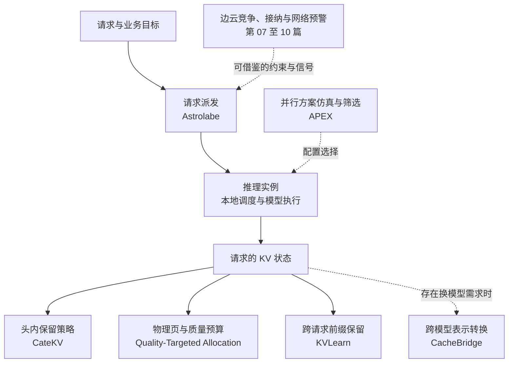
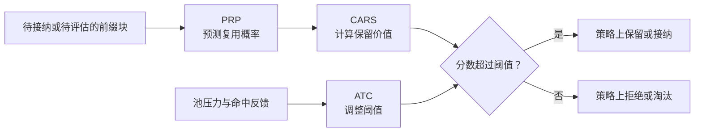
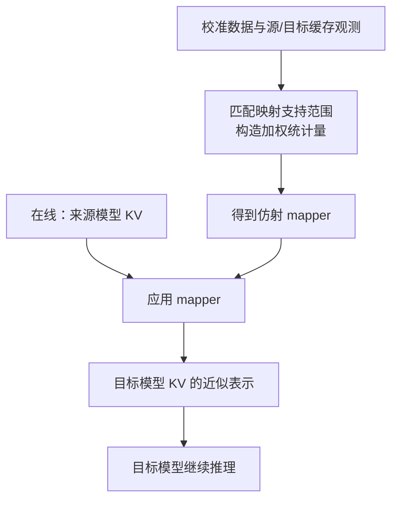
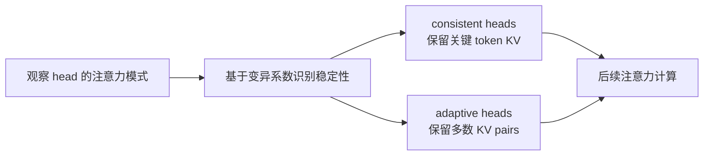

# KV Cache 与推理调度协同优化学习文档

本文面向已经知道 Prefill、Decode 和 KV Cache，希望进一步理解“请求怎么分、缓存怎么留、内存怎么真正省下来”的同学。资料起点是一份 10 篇论文推荐，本文按系统决策重组内容，把不同工作的作用对象、控制权和证据边界放到同一张地图上。

本文属于**第三方资料整理型学习资料**。已读取原文完整正文，并对论文摘要、作者项目说明、出版元数据及一份白皮书做交叉核对；没有审计这些系统的实现，也没有复现实验。

## 0. 阅读基线与范围

| 项目 | 内容 |
| --- | --- |
| 原文标题 | 《【论文日推】KV Cache 与推理调度｜09.04》 |
| 原文链接 | [微信原文](https://mp.weixin.qq.com/s/prr8CZwrgRxiu5oVHDi2MQ) |
| 作者/机构 | 智算互联网络；第 47 期论文日推 |
| 发布时间 | 2026-09-04 |
| 读取时间 | 2026-09-07 |
| 资料类型 | 论文推荐与摘要式解读，包含会议论文、期刊文章、综述、预印本及白皮书 |
| 整理范围 | 多实例派发、分离式缓存保留、跨模型 KV 转换、按头裁剪、物理页回收、并行计划搜索，以及边云和网络调度的借鉴关系 |
| 不展开内容 | 逐篇算法推导、模型/硬件完整兼容矩阵、生产接入补丁、性能复现 |
| 图片情况 | 原文正文未包含技术图片、SVG 或背景图片；本文使用可维护的 Mermaid 图和文字示例，没有需要下载的原文配图 |
| 落盘判断 | 主线跨越多个模型和推理引擎，归入 `llm-inference/`，与容量优化、Chunked Prefill、集群推理层文档连续阅读 |

### 0.1 如何区分证据

- **原文信息**：来自推荐文章，特别是尚未获得一手实验说明的结果。
- **一手资料核对**：论文摘要、出版记录、作者项目说明或白皮书确实支持的表述；仍然是作者报告，并非本仓库复现。
- **整理者归纳**：为帮助理解而建立的分类、图、简化成本例子和排障问题，不代表论文中的完整算法或已实现的集成系统。

| 原文序号 | 工作简称 | 本次实际核对到的资料 | 阅读时应保留的边界 |
| --- | --- | --- | --- |
| 01 | Astrolabe | [arXiv v3 摘要、版本历史](https://arxiv.org/abs/2508.03611v3)及 [SYSTOR 2026 议程](https://www.systor.org/2026/program2/) | 默认配置容量基本持平；尾延迟收益与另一组 A100 迁移对比不能合成一个倍率 |
| 02 | KVLearn | [作者仓库 README 与其中的论文摘要](https://github.com/FastLM/KVLearn)；会议议程 | 阅读的是项目说明和成本表达，没有运行模拟器或核对其全部源码 |
| 03 | CacheBridge | [arXiv v1 摘要与元数据](https://arxiv.org/abs/2609.00891v1) | 跨模型转换需要校准；结果只覆盖所测模型方向 |
| 04 | CateKV | [PMLR 正式论文页](https://proceedings.mlr.press/v267/jiang25e.html)及 [arXiv v1](https://arxiv.org/abs/2608.30295v1) | 已发表于 ICML 2025；2026-08-31 是 arXiv 提交日期，不能称为刚出现的新预印本成果 |
| 05 | APEX | [出版方页面的索引文本：引言、贡献和结论](https://www.sciencedirect.com/science/article/pii/S0743731526001280) | 直接页面访问受限；未核对全部实验表和配置空间 |
| 06 | Quality-Targeted Allocation | [Zenodo 元数据](https://zenodo.org/api/records/21527759)及[白皮书全文](https://zenodo.org/api/records/21527759/files/whitepaper_v1.pdf/content) | 版本记录为 `21527759`，PDF 内标注 Version 2.0；专有机制、研究规模与未达标项见第 6 节 |
| 07 | 时空超图卸载 | [Springer 出版方摘要与发布说明](https://link.springer.com/article/10.1186/s13677-026-00971-w) | 提前公开的已接受版本；结果来自轨迹驱动仿真 |
| 08 | 制造业边云 LLM 综述 | [出版方摘要与书目信息](https://www.sciencedirect.com/science/article/pii/S1383762126002936) | 是架构综述，不能作为某套 serving 引擎的跑分证据 |
| 09 | 光学感知边缘调度 | [Crossref 出版元数据](https://api.crossref.org/works/10.1117/12.3122414)；技术与数字来自推荐原文 | 已核对题名、作者及日期，未取得一手摘要或全文，性能条件未独立确认 |
| 10 | 5G 传输层预警 | [出版方索引正文中的引言与研究问题](https://www.mdpi.com/1999-4893/19/9/728) | 是隔离 5G 测试床的网络预测研究；原文的“分布式训练”标签不等于训练实测 |

原文中出现的日期可能是上线、收录或 arXiv 提交时间，不统一等于研究首次发表日期。Zenodo 是资料存储平台，不能由其平台背景推断作者来自 CERN，也不能把一个 DOI 同时标成“已公开代码”。

### 0.2 术语速查

| 术语 | 人话解释 | 本文要区分什么 |
| --- | --- | --- |
| TTFT | 请求到达后，多久收到第一个 token | 包含排队、前缀准备等成本，不只是模型计算 |
| TPOT / ITL | 输出阶段的平均每 token 时间 / 相邻 token 间隔 | 与首 token 延迟和整段完成时间不同 |
| P99 | 99% 样本不超过的那个值 | 看尾部体验，不能用平均值替代 |
| SLO capacity | 还能满足指定服务目标的请求到达率 | 必须绑定目标阈值和达标规则 |
| One-shot dispatch | 初次派发后，不依赖请求迁移来修正负载 | 决策在集群入口，实例内部仍有调度 |
| Admission / eviction | 接纳 / 驱逐 | 接纳请求、接纳缓存、删除头内 token 是不同动作 |
| KV retention | 决定什么 KV 值得留下 | 全局前缀块保留与头内 token 裁剪具有不同语义 |
| Mapper | 把一个模型的 KV 表示转换为另一个模型的表示 | 不等于把原字节复制过去 |
| Page / block | 分配器页 / 逻辑数据块 | 各论文定义可能不同，必须核对两者的映射 |
| Quality target | 希望压缩后仍达到的质量目标 | 统计目标不等于逐请求硬保证 |
| Memory price | 表示内存稀缺程度的协调信号 | 不一定是费用，也不等于完整请求调度器 |
| Hypergraph | 一条边可以连接一组对象的图 | 用来表达多个任务共同争用资源 |

## 1. 先建立整体地图：到底在决定什么

### 人话版

可以把系统理解为一家有多个工位的工厂：入口决定把任务送到哪个工位；仓库决定保留哪些半成品；不同型号的机器需要转换半成品格式；每个工位还要决定保留多少历史信息；最后，仓库账面上少了货，不代表整块货架已经能腾出来。

这几件事会相互影响，但控制对象不同。

| 决策 | 作用对象 | 对应工作 | 主要优化目标 |
| --- | --- | --- | --- |
| 请求给谁 | 请求与实例 | Astrolabe | 降低失衡、尾延迟和抢占 |
| 前缀值得留多久 | 全局缓存池中的 KV 块 | KVLearn | 在复用收益、网络和存储成本间取舍 |
| 换模型后能否复用 | 来源模型与目标模型的 KV 表示 | CacheBridge | 减少目标模型重新处理共享前缀的成本 |
| 哪些历史内容可少留 | 某层某个 attention head 的 KV | CateKV | 在质量条件下减少保留量和访问工作 |
| 删掉后能否回收物理空间 | 页、精度与请求预算 | Quality-Targeted Allocation | 让质量目标对应可核算的内存占用 |
| 模型如何分到多卡 | 并行执行计划 | APEX | 筛选时延或能耗更合适的配置 |
| 是否卸载、是否接纳、何时预警 | 边云任务和共享网络 | 第 07—10 篇 | 借鉴竞争建模与提前控制的方法 |



**图意解读（整理者归纳）：** 实线用于展开决策对象，虚线表示配置或借鉴关系。它是一张阅读地图，不是已经把十项研究接到一起的系统架构。尤其不能由图推断 Astrolabe 已支持 CacheBridge、KVLearn 已实现 CateKV，或某个传输库拥有缓存淘汰权。

## 2. Astrolabe：先把请求分好，少依赖事后搬迁

### 人话版

两个实例都只有两条请求，却可能一个马上结束，另一个还要生成很长的回答。只数请求数，无法准确表示未来负载；把新请求反复送向同一个“看起来最空”的实例，又可能造成请求扎堆。

### 机制拆解

[论文 v3 摘要](https://arxiv.org/abs/2508.03611v3)描述三个组成部分：输出长度估计、实例级时延模拟、随机二选一派发。预测提供比队列长度更丰富的信号，随机候选减少所有决策同时盯住一个实例的风险。


**图意解读：** 这是摘要机制的整理图，表达输入、评估和决定的关系，不规定真实 RPC 顺序。全局派发控制请求去向，本地引擎仍负责组 batch、分配 KV 和执行；one-shot 也不表示一个请求只运行一次 forward。

### 小例子与边界

**示例假设：** 请求 X 随机比较 A、C，请求 Y 比较 B、C。即使 C 最近最空，两次选择也不必总把 A、B 排除在外。预测错误、负载状态过期和突发强度仍可能影响选择，随机化不是不会失衡的保证。

论文默认 Llama-2-7B/ShareGPT 配置的 SLO capacity 为 31.6 QPS，最佳负载感知基线为 31.5 QPS。更值得关注的是平均 TTFT 降低 8%–36%、P99 TTFT 降低 16%–77%，以及达到容量时抢占约减少到原来的六分之一。A100 上相对 Llumnix 的最高 2.6 倍吞吐属于另一组启用迁移的比较，不能套到默认配置或推导“迁移永远没有价值”。

## 3. KVLearn：命中概率高，还要看留下它是否划算

### 人话版

把所有 KV 都存起来，会花掉写入带宽和存储空间；一个很少复用的大块，可能挤走许多更有价值的前缀。反过来，某个重算很贵的前缀，即使复用概率不是最高，也可能值得留下。

### 机制拆解

[作者项目说明](https://github.com/FastLM/KVLearn)将策略放在全局 KV pool 的协调路径中：

| 组件 | 输入与作用 | 不负责什么 |
| --- | --- | --- |
| PRP：Prefix Reuse Predictor | 根据前缀特征估计未来复用概率，并从延迟获得的复用标签学习 | 不修改语言模型权重 |
| CARS：Cost-Aware Retention Score | 将复用概率和重算、传输、存储成本组成保留分数 | 不直接执行张量搬运 |
| ATC：Adaptive Threshold Controller | 根据池压力和命中率调整接纳阈值 | 不能替代完整请求调度策略 |

README 给出的简化表达是：

```text
CARS(b) = P_reuse(b) × (R(b) - T(b)) - U(b, Δt)
KEEP 当且仅当 CARS(b) > threshold
```

其中，`R` 是重算成本，`T` 是该成本模型计入的传输项，`U` 是随占用空间和时间增长的存储代价。实际接入时应按目标拓扑明确哪些传输被新增、保留或省去，并统一成本单位；不能把整条 P→S→D 链路机械压成一个与拓扑无关的常数。



**图意解读：** 此处是保留策略的决策示意，不是传输完成状态机。协调器给出策略决定，数据面负责移动 tensor；真实释放还必须满足引用、使用和传输生命周期约束。

**示例假设：** 若统一成本单位后 `P=0.5、R=100、T=20、U=10`，分数为 30；网络成本上升至 80，分数只剩 0。相同命中概率在不同网络状态下可以对应不同保留价值。

作者摘要报告 TTFT 相对 No-Cache、LRU-Pool、Mooncake-style 基线最多分别降低 56%、38%、33%，传输量相对 LRU-Pool 最多降低 53%。这些是文本和多模态测试中的不同最大值，不能当成同一负载同时达到的指标；本文未复核完整实验矩阵。

## 4. CacheBridge：跨模型复用需要转换表示

### 人话版

同一段文字交给两个不同模型，它们算出的 KV 通常不能直接互换。即使 tensor 形状碰巧一致，也不说明含义一致。CacheBridge 研究的是把来源模型的 KV 转换成目标模型可使用的近似表示。

### 机制拆解

[论文摘要](https://arxiv.org/abs/2609.00891v1)对比 Full-Head Mapping：后者让目标 KV head 使用所选层中所有来源 KV heads 的信息，映射的存储和应用开销随支持范围增加。CacheBridge 限制为匹配的来源 head，引入按因果注意力敏感度加权的校准，并用 fused GPU kernel 构造统计量，保留闭式仿射映射接口。



**图意解读：** 离线校准构造转换关系，在线路径应用它。这里的数据流是表示转换，不等同于同模型 PD 分离的 KV 字节传输；网络搬运如果存在，还要另外计入。

### 读结果时不要看错对象

Qwen3 的平均 target retention 为 99.83%，指任务表现相对目标模型的质量保留指标，不是“保留了 99.83% 的缓存字节”，也不表示输出逐 token 相同。Qwen3 14B→32B 中的 8 倍存储缩减针对 mapper；最高 3.0 倍加速针对映射应用；92.63→8.63 秒针对使用 500 条序列的映射构建。

**整理者归纳：** 若一个 Agent 中途切换模型，是否值得使用转换，应比较“转换、必要传输及质量代价”与“目标模型重做共享前缀”的成本。还要验证 tokenizer、位置编码、模型版本和所需上下文的对应关系；不能仅凭模型同属一个家族就默认可互换。

## 5. CateKV：稳定的头少留，变化大的头多留

### 人话版

有些 attention heads 在连续生成过程中反复关注相近的历史位置，另一些头的关注点更灵活。如果对所有头统一保留相同比例，可能在前者上浪费空间，在后者上损害质量。

### 机制拆解

[PMLR 摘要](https://proceedings.mlr.press/v267/jiang25e.html)描述用基于变异系数的方法识别注意力模式的 sequential consistency：consistent heads 保留关键 token，adaptive heads 保留多数 KV。这里的 consistency 指**注意力模式沿序列的稳定性**，不是分布式系统的顺序一致性协议。



**图意解读：** 策略作用于模型内部的头与历史位置，不在集群路由器上。图没有给出分类更新周期、阈值或 kernel 布局，因为本次只核对了摘要和发表信息。

论文报告长上下文基准上质量与 full attention 相近，单样本内存最高缩减 2.72 倍、Decode 加速 2.18 倍，批处理吞吐最高提升 3.96 倍。“缩减 2.72 倍”对应优化后约为基线的 `1/2.72 ≈ 36.8%`，不能写成“内存降至 2.72 倍”。这些倍率对应不同指标和测试条件。

**整理者归纳：** 它与 KVLearn 的关键差别是：KVLearn 决定未来是否保留可复用的前缀块；CateKV 改变当前注意力路径能使用哪些 KV，涉及近似与任务质量。某个头语义上少用 KV，也不自动说明物理分配器已经释放整页，下一节专门拆开这个边界。

## 6. 质量目标与页回收：账面少存，不等于物理空间可复用

### 6.1 人话版

假设仓库只能按整箱退租。每箱扔掉一半物品，但每箱还留一件，租金可能一分不少。推理引擎如果按页分配 KV，只在页内零散删除 token，也可能无法回收完整页。

以下是**整理者构造的例子**：每页四个位置，`K` 是仍需保留的数据，`·` 是逻辑删除。

```text
原始：          Page A [K K K K]    Page B [K K K K]
零散删除四个：  Page A [K · K ·]    Page B [K · K ·]    可回收整页：0
整页删除四个：  Page A [· · · ·]    Page B [K K K K]    可回收整页：1
```

**图意解读：** 两种操作都少保留四个位置，整页回收结果却不同。例子假设页内没有额外搬移压实，且回收页没有其他引用；真实系统的 page/head/layer 布局可能不同，应以实际分配器为准。

### 6.2 两个目标的区别

传统固定预算可以理解为“给定内存额度，尽量减少质量损失”；质量目标模式则可以理解为“满足可接受的损失目标，尽量少占内存”，同时保留硬件容量上限。

白皮书还描述了共享 memory price，用一个稀缺程度信号协调多个请求的分配。它不是完整请求调度器，不负责回答请求先后顺序、实例路由等所有问题。具体估计器、求解规则与源码并未公开，本文不据摘要补造算法。

### 6.3 这份白皮书能证明到哪里

第 06 篇在 [Zenodo](https://zenodo.org/records/21527759) 登记为预印本；[PDF](https://zenodo.org/api/records/21527759/files/whitepaper_v1.pdf/content) 自述为结果披露白皮书。以下条件来自第 4、5、6 节，必须与数字一起读：

| 项目 | 白皮书披露的条件或结果 | 对理解的影响 |
| --- | --- | --- |
| 规模 | Llama-3.2-1B-Instruct，CPU float32，约 0.5K–1.4K 上下文 | 不能外推到大模型、128K 上下文和生产 GPU |
| 内存测量 | 遵循整页回收规则的分页记账模拟器 | “实际占用”是该模拟器的计量口径，不是真实 vLLM/SGLang GPU 分配器实测 |
| 质量目标 | 单请求测得违约率 10.4%，目标 5%；多请求为 17.7% | 统计目标尚未满足，不能表述为硬质量保证 |
| 估计器开销 | CPU/Python Decode 开销 6.9%–9.8%，目标低于 5% | 低内存不能直接推导低端到端时延 |
| 接入缺口 | 使用生产融合 kernel 通常不直接暴露的注意力统计 | kernel 适配路径尚未实现 |
| 可复现性 | 机制和源码为专有内容 | 原文重复的 Zenodo 链接不能当作可用开源代码 |

原文列出的 25% 预算下检索准确率 0.92 对 0.58、减少 32.5 个 FP16 占用百分点、每 GiB 请求数增加 37.9%，均应限定为这份白皮书的研究条件。32.5 是相对完整 FP16 占用基准的**百分点差**，不是在任意基线上节省 32.5%。每 GiB 请求数也不是 GPU 在线吞吐。

**整理者归纳：** 可迁移的检查方法是同时看“逻辑删除多少、整页回收多少、页是否可再分配、质量违约多少”。即使论文的算法未公开，这四个问题仍可用来检查现有系统；但它们不替该白皮书补上缺失的生产证据。

## 7. APEX：先模拟服务过程，再筛并行计划

### 人话版

把模型分到多张卡不只有一种方法。固定用“机内 TP、机间 PP”可能合适，也可能被请求长度、动态 batching 或网络条件改变。APEX 用 CPU 仿真筛选计划，减少逐个部署 GPU 试错的代价。

根据[出版方引言与结论](https://www.sciencedirect.com/science/article/pii/S0743731526001280)，核心是建模 iteration-level batching：请求逐轮加入、退出，Prefill 与 Decode 的计算特征不同，不能只测一个静态 batch 再简单相乘。


**图意解读：** APEX 是配置评估工具，不是每条请求到来都重新搜索的路由器。摘要和引言可确认 DP/PP/TP 主线；原文也提到 EP，但本次没有核查其完整支持范围，不据此给出任意 MoE/EP 配置可用的承诺。

三个数字要分开：最高 3.37 倍指所评估空间中较启发式计划更快的执行计划；结论中的最高 45% 节能相对时延优化计划；71 倍指计划评估比真实云端 GPU 部署评估更快。**71 倍不是模型推理加速比。** 出版方还报告速度提升预测的平均相对误差为 10.7%，这也是保留真实验证环节的理由。

## 8. 边云与网络四篇：借鉴什么，不能推出什么

### 8.1 第 07 篇：一组任务共同争资源，要显式表示竞争

[时空超图论文摘要](https://link.springer.com/article/10.1186/s13677-026-00971-w)研究多个边缘小模型同时访问共享云端大模型接口时的竞争。ST-HGNN 用于提取时空关系并预测瓶颈，WTHM 用启发式搜索形成卸载匹配，双时间尺度设计把较重工作与在线决策分开。

**例子（整理者归纳）：** 三个边缘节点单独连接云端都够快，一起上传却挤满同一上行链路。只看三条独立边的时延，容易漏掉共同竞争域；超边可以描述“这一组任务一起占用同一资源”。

EUA/T-Drive 轨迹驱动仿真报告 normalized VCI 为 0.64，相对所选二部图/就近基线绝对改善 0.17–0.38。VCI 是论文自定的综合指标，本次未核查其完整公式，不能改写为 TTFT 下降 64% 或线上 LLM 吞吐提升。

### 8.2 第 08 篇：制造场景需要先分清业务层次

[制造业边云 LLM 综述摘要](https://www.sciencedirect.com/science/article/pii/S1383762126002936)提出六层架构，把现场设备和感知模型与边缘认知、云端认知、工业知识、应用治理联系起来，并比较动态路由、协同推理、RAG 和 QoS 优化。

**整理者归纳：** 学习价值在于先问一项任务要在何处完成、需要何种知识与时延，再选择引擎和卸载方式。本篇没有逐项重建其六层定义，也不把综述当成一个可直接部署的六进程系统。出版方卷期标为 2026 年 12 月，原文列的是 9 月日期，二者不应合并成首次发表时间的断言。

### 8.3 第 09 篇：接纳控制也是推理调度的一部分

**原文信息：** 光学感知边缘调度联合模型切分、任务卸载和基于阈值的 admission control，在 deadline 约束下安排视觉任务；报告相对 FIFO/LBF 接纳率提高 15%–30%、上行数据量约降低 40%、吞吐提高超过 20%。

本次只通过[出版元数据](https://api.crossref.org/works/10.1117/12.3122414)确认题名、作者和 2026-09-02 日期，没有独立核对上述实验及分母。它的工作负载是边缘视觉，不能作为 KV Cache 或 LLM Decode 的性能证据。

**整理者归纳：** 可借鉴的问题是：当任务已经不可能按期完成时，继续接纳是否反而损害所有任务。迁移到 LLM 场景需要重新定义首 token、逐 token 和完成时限。

### 8.4 第 10 篇：预测拥塞，不等于已经解决拥塞

[5G 论文出版方正文](https://www.mdpi.com/1999-4893/19/9/728)明确使用 Open5GS/srsRAN 与 ZeroMQ 模拟物理层的隔离测试床，研究传输层排队和协议状态能否提前预告瓶颈。它强调按时间隔开观测和预测，避免未来信息泄漏。

**原文信息：** 一秒 RTT 预测的树集成模型达到约 `R²=0.90`，五秒预警具有较高 precision。本次未逐表核对这些结果。`R²` 是回归拟合指标，不是告警准确率；秒级预警也不能直接作为毫秒级 Decode 控制能力的证明。

**整理者归纳：** 将它用于 AI Infra 时，还需要验证预警触发后的限流、改路或迁移是否真正改善 SLO，以及误报是否制造新的拥塞。原文把它列在“分布式训练”下，但研究对象本身不是训练集群。

## 9. 把机制放回一条请求：一个成本对比练习

以下为**整理者构造的教学场景**，不代表某篇论文的实验，也不表示这些方案已经可以组合部署。

一条请求带着长共享前缀到来。实例 A 已有可用 KV，但队列很长；B 比较空，远端池中有同模型前缀；C 也空闲，但只有另一个模型的缓存。

| 候选 | 首先需要比较的成本 | 容易漏掉的约束 |
| --- | --- | --- |
| A | 排队 + 剩余前缀计算 | 本地命中再高，也可能被排队时间抵消 |
| B | 排队 + 远端读取/传输 + 剩余前缀计算 | “池中存在”不等于已经到达可计算位置 |
| C | 若存在经过校准验证的映射，则比较转换路径；否则比较目标模型重算 | 不同模型的 KV 不能直接当成同模型命中 |

第一步决定去向后，实例内还要检查本轮 token budget 和物理页是否足够。若使用近似保留策略，必须同时记录质量影响；删除逻辑 KV 后还应确认空闲页是否真的增加。请求离开活跃阶段后，保留前缀供下一次复用又是另一项成本决策。

不能把“派发收益 × 裁剪收益 × 转换收益 × 并行收益”相乘得到整套系统的预期加速。这些优化可能竞争同一份内存、网络带宽和 CPU 时间，甚至改变彼此的预测输入。

### 一个容易漏掉的单位区别

```text
逻辑层：参与 attention 的 token / head / KV 元素数
分配层：占用页数、可回收页数、空闲页数
设备层：为整个 KV pool 预留的 GPU 内存
服务层：满足质量和时延目标的请求数、吞吐与尾延迟
```

**整理者归纳：** 回收页可以使引擎在预分配池内接纳更多请求，而进程的 GPU 总占用可能不变。因此，设备占用曲线不下降既不能单独证明优化无效，也不能用逻辑 token 数下降证明物理回收成功。

## 10. 小白排障地图与阅读路线

| 现象 | 先区分的问题 | 建议查看的信号 | 对应阅读方向 |
| --- | --- | --- | --- |
| 平均时延尚可，P99 突然变差 | 是否请求扎堆、实例队列失衡 | 每实例到达率、排队、抢占、预测偏差 | Astrolabe |
| 命中率提高，TTFT 没改善 | 是否把重算省下的时间花在传输上 | 前缀命中位置、传输等待、重算时间、池压力 | KVLearn |
| 同一 prompt 换模型后结果异常 | 是否错误复用了不兼容 KV | 模型版本、映射方向、校准覆盖、目标质量 | CacheBridge |
| 长文本裁剪后检索失败 | 裁掉的内容是否对后续查询仍有用 | head 保留策略、检索深度、任务质量 | CateKV、质量目标 |
| 宣称删了很多 KV，仍无法接新请求 | 回收的是逻辑 token 还是物理页 | 页引用、空闲页、碎片、在途使用 | 页回收与分配器 |
| 模拟最优配置上线变慢 | 输入分布和实际系统是否偏离模型 | P/D 比例、batch 动态、算子耗时、通信 | APEX |
| 卸载越积极，网络越拥堵 | 是否忽略共同竞争资源 | 共享链路、队列、并发接口负载 | 时空超图与接纳控制 |
| 预警准确但服务没有改善 | 预测之后的动作是否有效 | 告警提前量、误报、动作代价、SLO 变化 | 5G 预警的迁移边界 |

以上是定位方向，不是仅凭现象即可确定的根因。

建议先读第 1—3 节，建立请求与缓存成本坐标；再对照第 4—6 节，理解三种不同的“少算、少留、少占”；最后读并行和边云部分，观察决策尺度如何扩大。

仓库内的连续阅读入口：

- [推理引擎与集群推理层分工](<./推理引擎与集群推理层分工学习文档.md>)：区分请求路由与实例内执行。
- [KV Cache 容量优化技术地图](<./KV Cache 容量优化技术地图学习文档.md>)：把本文方法放回容量公式和模型结构。
- [Chunked Prefill 与 Prefill-Decode 共推](<./Chunked Prefill 与 Prefill-Decode 共推学习文档.md>)：理解动态 batching 的调度边界。
- [vLLM V1 KV Cache 管理全生命周期](<../vllm/vLLM V1 KV Cache 管理全生命周期源码学习文档.md>)：从学习地图走向物理块、引用和回收实现。
- [SGLang RadixAttention 与 HiCache KV Cache 技术主线](<../sglang/SGLang RadixAttention 与 HiCache KV Cache 技术主线学习文档.md>)：理解前缀身份与分层缓存。

## 11. 一句话总结

围绕 KV Cache 的系统优化，要把“请求发给谁、前缀留什么、模型间如何转换、注意力删什么、物理页何时回收”分别讲清，再用同一负载下的质量、网络成本和服务指标判断组合收益。

## 12. 原始资料与论文索引

以下保留完整题名，方便回到原始资料。正文中的核对范围优先于“拥有一个链接”所产生的完整验证印象。

0. 智算互联网络：[《【论文日推】KV Cache 与推理调度｜09.04》](https://mp.weixin.qq.com/s/prr8CZwrgRxiu5oVHDi2MQ)，2026-09-04，第 47 期。
1. Wei Da、Evangelia Kalyvianaki：[Astrolabe: Balancing Load in LLM Serving with Randomized Prediction-Guided Scheduling](https://arxiv.org/abs/2508.03611v3)。SYSTOR 2026；[原文所列 DOI](https://doi.org/10.1145/3793230.3837768)。arXiv 首次提交于 2025-08-05，本次核对 v3（2026-08-11）。
2. Dong Liu、Yanxuan Yu、Eric Jiang、Shu Wang、Ying Nian Wu：[To Keep or Not to Keep: Learning KV Cache Retention in Disaggregated LLM Serving Systems](https://doi.org/10.1145/3793230.3837769)。SYSTOR 2026；[作者项目说明](https://github.com/FastLM/KVLearn)。
3. Xingyu Qu、Siyuan Lu、Zhiyu Chen、Sheng Wang、Tao Lin：[CacheBridge: Efficient Cross-Model KV Cache Transfer](https://arxiv.org/abs/2609.00891v1)，2026-09-01 提交，预印本。
4. Haoyun Jiang 等：[CateKV: On Sequential Consistency for Long-Context LLM Inference Acceleration](https://proceedings.mlr.press/v267/jiang25e.html)。ICML 2025，PMLR 267:27569–27585；[原文所列 arXiv](https://arxiv.org/abs/2608.30295)。
5. Yi-Chien Lin、Ronald Pineda、Fanny Nina Paravecino：[APEX: An Extensible and Dynamism-Aware Simulator for Automated Parallel Execution in LLM Serving](https://www.sciencedirect.com/science/article/pii/S0743731526001280)。Journal of Parallel and Distributed Computing；[DOI](https://doi.org/10.1016/j.jpdc.2026.105350)。
6. Athanase Matabaro：[Quality-Targeted, Page-Aligned KV-Cache Allocation for LLM Inference](https://zenodo.org/records/21527759)。独立研究者白皮书，Zenodo 发布日期 2026-07-24；[原文概念 DOI](https://doi.org/10.5281/zenodo.21527757)指向本次读取的版本记录，PDF 内标注 Version 2.0。
7. Kun Ding、Xiwen Qiu、Nianfeng Weng、Peng Zhu：[Synergizing large and small models in cloud-edge continuum: a spatiotemporal hypergraph approach for dynamic offloading](https://link.springer.com/article/10.1186/s13677-026-00971-w)。Journal of Cloud Computing，2026-09-02 提前发布。
8. Dan Xia 等：[A survey of edge–cloud collaborative large language models for discrete manufacturing: Architectures, technologies, and applications](https://www.sciencedirect.com/science/article/pii/S1383762126002936)。Journal of Systems Architecture；[DOI](https://doi.org/10.1016/j.sysarc.2026.103975)。
9. Ying Gou：[Edge collaborative inference and resource scheduling optimization for optical sensing networks](https://doi.org/10.1117/12.3122414)。EECS 2026，2026-09-02；本文只完成出版元数据核对。
10. Yedil Nurakhov 等：[Machine Learning-Based Early Warning System for Transport-Layer Bottlenecks in Open-Source 5G Testbeds](https://www.mdpi.com/1999-4893/19/9/728)。Algorithms 19(9):728；[DOI](https://doi.org/10.3390/a19090728)。
