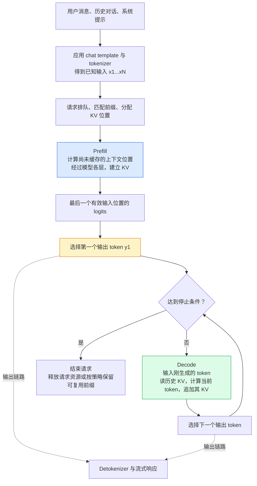
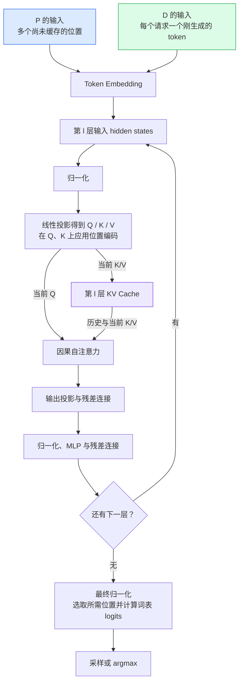
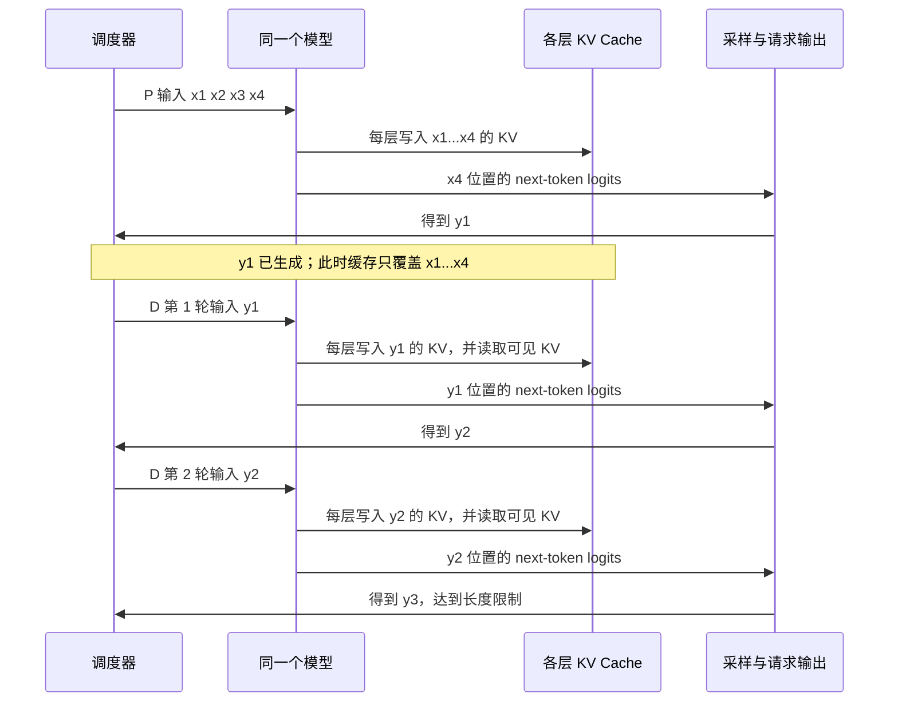
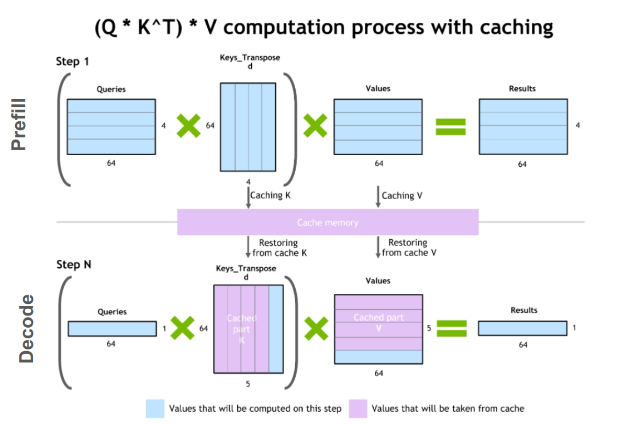
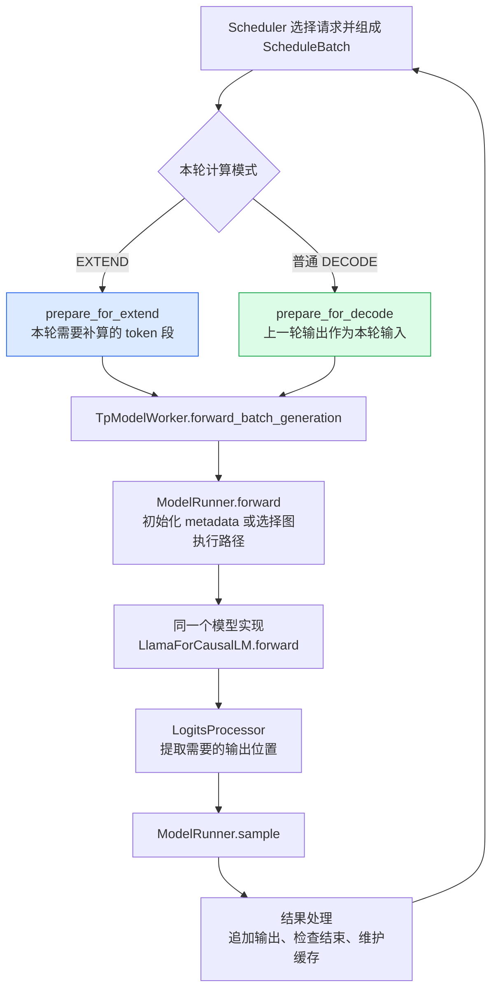
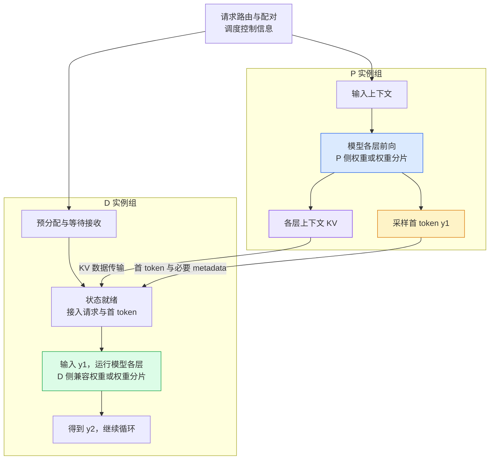
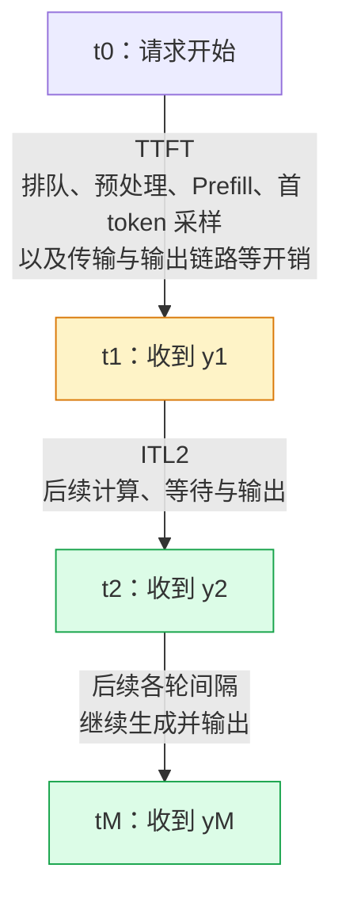
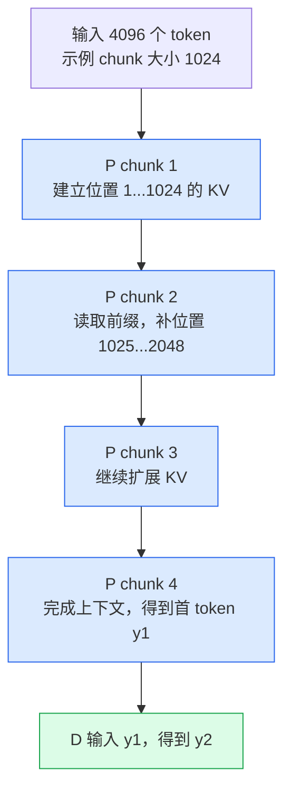

# LLM Prefill 与 Decode 阶段源码学习文档

本文面向第一次接触 LLM 推理的同学，回答一个基础问题：**P/D 分别对应大模型的什么阶段，模型在这两个阶段到底算了什么？**

先记住这句话：**Prefill（P）处理已经给定的上下文，建立可复用的 KV Cache，并在常规生成中得到第一个输出 token；Decode（D）把上一步生成的 token 送回同一个模型，利用历史 KV，继续生成下一个 token。**

两者都属于**推理时的前向计算**，都会经过模型的 Transformer 层。P/D 不是训练与推理的划分，也不是 Encoder 与 Decoder 两个网络模块的划分。PD 分离则是在这个基础上，把两种计算交给不同的 worker 执行。

本文属于**源码分析型学习资料**：以本地 SGLang 为实现证据，结合 11 项官方文档、作者文章和论文核对概念。没有启动模型、运行 GPU 实验或复现性能数据。

**建议阅读顺序：** 第 1–4 节建立计算直觉，第 5–7 节连接 KV 与 SGLang 实现，第 8–10 节理解性能和优化边界。源码与网页索引集中在第 12–13 节，第一次阅读可以先跳过。

## 0. 阅读基线与范围

### 0.1 固定源码基线

| 项目 | 内容 |
| --- | --- |
| 源码目录 | `/Users/mac/Documents/Documents/工作/sglang` |
| 分支 | `muxi-main` |
| commit | `e8d7e7fe004419902c04641e2ae2f4a973339c60` |
| 读取时间 | 2026-09-09 |
| 工作区状态 | 已跟踪文件无本地改动；存在下列未跟踪文件和目录 |
| 操作边界 | 只读源码及网页；仅修改 `ai-infra-wiki` 中的文档、索引和配图，不修改 SGLang，不启动服务 |
| 模型计算主线 | `models/llama.py` 中的 decoder-only、因果自注意力文本生成路径 |
| Attention 实现例子 | `layers/attention/triton_backend.py`；用于证明 KV 读写路径，不表示运行时一定选择该后端 |
| 默认讨论条件 | 使用 KV Cache、普通自回归生成；先忽略前缀命中、Chunked Prefill、投机解码、PP，再逐项加回 |

读取时 SGLang 的未跟踪项如下，本文未读取这些内容作为实现依据，也未改动它们：

```text
docker/Dockerfile.pre-muxi-maca-20260731.bak
docs_new/
mainline_diffs.txt
reverted_diffs.txt
scripts/playground/pd_pp_mtp/
scripts/run_prefill_pp_mtp_forward_unit_tests.sh
upstream_diffs.txt
working_notes/
```

本文研究的是跨引擎通用的推理阶段，并用 SGLang 落到代码，因此归入 `llm-inference/`，与 [Chunked Prefill 与 Prefill-Decode 共推](<./Chunked Prefill 与 Prefill-Decode 共推学习文档.md>) 连续阅读。更细的分布式流水线放在 [PD 分离下的 PP 源码学习文档](<../sglang/PD 分离下的 PP 源码学习文档.md>)。

### 0.2 证据怎么读

| 标记 | 含义 | 可以证明什么 |
| --- | --- | --- |
| 源码事实 | 本文固定 commit 中直接读到的行为；`C01` 等编号见第 12 节 | 该版本怎样组输入、执行前向、处理结果 |
| 资料信息 | 官方文档、作者文章或论文中的描述；`R01` 等编号见第 13 节 | 来源对概念、设计或实验的陈述 |
| 整理者归纳 | 将代码与数学关系连接起来的解释、例子或示意图 | 帮助理解，不代替运行证据 |

在线文档可能随上游更新，不能用来推定本地 `muxi-main` 具备相同默认值或全部功能。本文不展开特定模型的 MoE 专家通信、MLA 压缩布局、混合状态空间模型、扩散式生成，也不验证 P/D 故障回收或 RDMA 安全性。

### 0.3 术语速查

| 术语 | 人话解释 | 本文最需要注意的边界 |
| --- | --- | --- |
| Token | 模型处理的离散编号，可对应字、词片段或特殊标记 | 一个中文字不一定等于一个 token |
| Prompt / context | 这一轮生成开始前已经给定的 token 序列 | 包括系统提示、历史对话、工具结果和角色标记等 |
| Forward | 用当前权重把输入算成输出的一次前向执行 | 一次 forward 不等于一次完整回答 |
| Hidden states | token 在某一层的中间向量表示 | 会继续交给下一层，不等同于 KV Cache |
| Q / K / V | 当前查询、用于匹配的键、匹配后汇聚的值 | 都是层内张量，不是三个独立模型 |
| KV Cache | 保存历史位置在各层产生的 K/V | 保存中间计算，不保存模型的全部“思考” |
| Logits | 模型对词表中各 token 给出的未归一化分数 | 还需要采样或 argmax 才得到 token ID |
| Sampling | 根据分数与规则选出下一个 token | 贪心选最大分数也属于这里讨论的输出选择 |
| Decoder-only | 使用因果自注意力的生成模型架构 | 其中的 decoder 与执行阶段 Decode 不是同一层概念 |
| TTFT | 从请求起点到首个输出 token 到达的时间 | 包含排队等开销，不等于纯 Prefill kernel 时间 |
| ITL / TPOT | 相邻输出 token 间隔 / 平均每个后续输出 token 用时 | 单个间隔与平均值要分开 |
| P/D worker | 专门负责 Prefill / Decode 的服务实例或实例组 | 是部署角色，不是模型中的一半层 |

## 1. 先建立整体地图：P/D 属于哪里

### 1.1 从用户提问到模型回答

**人话版：** 先把问题变成模型能读的编号；模型读入已知上下文，算出接下来最可能出现的 token；再把新 token 放回输入，继续往后接。



**图意解读：** 实线说明计算依赖，虚线说明 token 可以送入输出链路；它不是所有进程的精确时序图。调度器决定哪个请求何时执行，模型计算决定 token 的分数，输出链路把编号转换成文本。停止检查说明：若首 token 已满足结束条件，就不必再做普通 Decode forward。（源码 C01、C02、C08、C09、C15。）

聊天模型实际仍然在续写 token 序列。`role/content` 消息经过 chat template 后，才成为带角色标记的输入；用户界面的一条消息和模型的一段输入不一定一一对应。[R04：Chat templates](https://huggingface.co/docs/transformers/v4.57.0/en/chat_templating)

### 1.2 一张表回答“分别对应什么阶段”

| 观察层次 | Prefill（P） | Decode（D） |
| --- | --- | --- |
| 请求进程 | 消化本轮已经给定的上下文 | 继续生成尚未知晓的后续内容 |
| 模型执行 | 对多个已知输入位置做前向；命中缓存时只补未计算部分 | 普通生成时每个请求每轮对一个新位置做前向 |
| Transformer 层 | Embedding → 各层 Attention 与 MLP → 最终输出处理 | 同样经过这条模型路径 |
| Attention | 当前段的多个 Q 读取允许访问的 K/V | 当前 token 的 Q 读取历史与当前位置的 K/V |
| KV 变化 | 建立输入上下文的 KV | 每轮追加刚作为输入处理的 token 的 KV |
| 输出边界 | 常规生成在最后一段 Prefill 完成后得到 `y1` | 第一轮普通 Decode 输入 `y1`，得到 `y2` |
| 常见服务指标 | 强烈影响 TTFT | 强烈影响 ITL、TPOT 和生成吞吐 |

前两行的概念与 NVIDIA 的 Prefill/Decode 说明一致；具体张量组织、采样和缓存写入由本地代码进一步确认。[R01：Inference Optimization](https://developer.nvidia.com/blog/mastering-llm-techniques-inference-optimization/)（源码 C02–C09。）

## 2. 先拆开四组容易混淆的概念

### 2.1 P/D 都是推理，不是“训练 / 推理”

训练会利用目标和损失更新模型权重；本文 P/D 使用已加载的权重进行前向生成。Prefill 虽然能并行处理很多位置，也没有因此变成训练。

可以这样理解：训练改变“这台机器怎样计算”，P/D 是拿这台机器来处理某一次请求的两个阶段。本文所读 `LlamaForCausalLM.forward` 和模型执行路径没有承担训练循环。（源码 C04、C05。）

### 2.2 P 不等于 Encoder，D 不等于 Decoder 模块

原始 Transformer 论文研究的架构有独立 Encoder 和 Decoder，其中 Decoder 还有读取 Encoder 输出的交叉注意力。这里的两个名字指**模型结构**。[R05：Attention Is All You Need，§3](https://arxiv.org/html/1706.03762v7)

本文所读 Llama 的模型路径则由 `LlamaDecoderLayer` 组成，P 和 D 都调用它。P 不会先调用一个 Llama Encoder，也不会在完成后把任务交给另一半名叫 Decoder 的层。（源码 C05。）

| 名称 | 它在划分什么 | 一个直观例子 |
| --- | --- | --- |
| Encoder / Decoder | 模型模块及注意力结构 | 原始 Transformer 的编码器与解码器 |
| Prefill / Decode | 一轮生成中处理已知输入和继续生成的执行阶段 | 同一个 Llama 先读 prompt，再逐步续写 |
| PD 分离 | 执行两阶段的 worker 部署位置 | P 实例算输入，D 实例接 KV 后续写 |
| Pipeline Parallel（PP） | 同一条模型前向中的层如何分给不同设备 | stage 0 算前几层，stage 1 算后几层 |

### 2.3 “思考 / 最终回答”也不是 P/D

对这里讨论的自回归模型来说，模型新生成的推理文本和最终回答都是续写输出。不能把“生成思考过程”称为 P，把“生成答案”称为 D。

如果某段历史推理文本被再次作为输入提交，它在新一轮中又属于已知上下文。**角色由本轮输入边界决定，不由文字的语义决定。** 这是对 token 续写机制的归纳，不涉及模型内部不可见的心理过程。

### 2.4 Tokenizer 的 decode 与模型 Decode 不同

Tokenizer 的 `decode` 是把 token ID 转回文本；模型 Decode 是计算下一个 token 的循环。前者是表示转换，后者会执行神经网络。

排障时看到“输出文字卡住”，需要分别检查模型是否产生 token、token 是否送到 detokenizer、流式响应是否及时送出，不能仅凭用户界面现象判断 D 计算慢。（整体机制见第 1 节；调度输出见 C08、C09。）

## 3. 同一个 Transformer，P 和 D 都算哪些东西

### 3.1 人话版：整台模型重复用，每轮处理的位置数不同

以本文 Llama 路径为例，一个 token 的表示会依次经过 Embedding、各层归一化、Attention、MLP，最后通过输出处理得到词表分数。P 一次带来一段已知 token；普通 D 每个请求带来一个刚生成的 token。



**图意解读：** 这是根据 Llama 源码整理的数学计算图。残差与归一化在代码中有融合和延后执行，因此图中位置是逻辑关系，不代表 kernel 调用数。每次经过不同层，使用的是该层自己的 KV。P/D 共享这条模型计算结构；PD 分离时是在不同实例组上分别执行。（源码 C05、C06、C07。）

**不要把 Prefill 理解为只做 K/V 投影。** 为了得到深层的 K/V 和最后位置的输出，仍需要逐层计算前面的 Attention、MLP 等。**Decode 也不只是查 KV 表。** 当前 token 的 Q/K/V、Attention、MLP 和输出分数仍要重新计算。

### 3.2 为什么 Prefill 能并行，却仍然不能看未来

假设输入是四个已知 token `x1 x2 x3 x4`。因果注意力的可见关系如下：

| 当前查询位置 | K/V(x1) | K/V(x2) | K/V(x3) | K/V(x4) |
| --- | --- | --- | --- | --- |
| Q(x1) | 可见 | 屏蔽 | 屏蔽 | 屏蔽 |
| Q(x2) | 可见 | 可见 | 屏蔽 | 屏蔽 |
| Q(x3) | 可见 | 可见 | 可见 | 屏蔽 |
| Q(x4) | 可见 | 可见 | 可见 | 可见 |

输入 token 的身份已经确定，因此同一层可以用矩阵运算一起算这些位置，再用 mask 限制各位置能看见什么。**并行的是已知位置的计算，限制的是信息可见范围。** 各层之间仍有前后依赖，也不能提前把未知的回答 token 一起当作确定输入。（资料 R02、R05；源码 C05、C06。）

### 3.3 Q、K、V 各自干什么

用一个检索比喻：Q 像“当前位置要找什么”，K 像历史条目的匹配标签，V 像匹配后实际读取的内容。它们只是帮助理解的比喻，真实实现是学习得到的向量。

对单层、单个注意力头，可以把计算写成：

$$
Q = HW_Q,\qquad K = HW_K,\qquad V = HW_V
$$

$$
O = \operatorname{softmax}\left(\frac{QK^T}{\sqrt{d_h}} + M\right)V
$$

这里 `H` 是该层投影前的 token 表示；`M` 在可见位置为 0、被屏蔽位置为负无穷；Llama 还会对 Q/K 应用 RoPE 位置编码。上式省略 batch、多头、投影融合与数值精度细节，不是 kernel 实现。（源码 C05；标准注意力公式见 [R05 §3.2](https://arxiv.org/html/1706.03762v7)。）

### 3.4 用张量形状看清差别

下面只看一个请求的一层、一个头；`N` 是原始 prompt 长度，`S` 是本轮开始前已经计算好的历史长度，`C` 是本轮输入的位置数。

| 场景 | 本轮 Q | Attention 可用的 K/V | 逻辑注意力分数形状 |
| --- | --- | --- | --- |
| 无前缀缓存的完整 P | `[N, d_h]` | `[N, d_h]` | `[N, N]`，带因果 mask |
| 已有 S 个历史位置，再补 C 个位置 | `[C, d_h]` | `[S+C, d_h]` | `[C, S+C]`，当前段仍有因果限制 |
| 普通 D 一步 | `[1, d_h]` | `[S+1, d_h]` | `[1, S+1]` |

这张表解释了两个现象：P 的当前查询多；D 的当前查询少，但它需要访问的历史可能很长。**这些是逻辑形状，并不要求实现把完整分数矩阵写入显存。** 分块、融合 Attention 可以改变中间存储方式。（资料 [R02：Caching](https://huggingface.co/docs/transformers/v4.57.0/en/cache_explanation)；源码 C06。）

## 4. 用四个输入 token，走完首 token 和后续生成

### 4.1 先固定例子的前提

假设 tokenizer 已经给出 `x1 x2 x3 x4`，要生成三个 token `y1 y2 y3`。这些只是编号，不假装某句中文一定会切成四个 token。

本例使用普通自回归生成、无缓存命中、无投机解码、无分块、不计重算。每次输入都经过模型各层。

| 执行轮次 | 本轮真正送入模型的 token | 本轮开始前已有 KV | 本轮新增 KV | 本轮采样结果 |
| --- | --- | --- | --- | --- |
| Prefill | `x1 x2 x3 x4` | 无 | `KV(x1..x4)` | `y1` |
| Decode 第 1 轮 | `y1` | `KV(x1..x4)` | `KV(y1)` | `y2` |
| Decode 第 2 轮 | `y2` | `KV(x1..x4,y1)` | `KV(y2)` | `y3` |

**最关键的一行是第一行：产生 `y1` 的，是 `x4` 最后位置的输出分数。此时 `y1` 还没有作为模型输入经过各层，因此常规路径下还没有它自己的 KV。**

### 4.2 用时序图分开两个时刻



**图意解读：** “输出了一个 token”和“计算了这个 token 的 KV”相差下一次输入它的前向执行。图中把逐层交错的计算合并成一条消息，不意味着先写完所有层 KV 才计算 Attention。（源码 C02、C06–C09。）

SGLang 中对应的两个关键更新如下，省略了其他分支：

```python
# scheduler_output_processor_mixin.py::process_batch_result_prefill
if req.is_chunked <= 0:
    req.output_ids.append(next_token_id)

# schedule_batch.py::prepare_for_decode，普通非投机路径
self.input_ids = self.output_ids.to(torch.int64)
self.output_ids = None
self.out_cache_loc = alloc_for_decode(self, token_per_req=1)
```

第一段把 Prefill 的采样结果记为输出；第二段把批次上轮输出转成本轮输入，并为当前输入 token 分配新的 KV 位置。请求级的 `req.output_ids` 是累计历史，批次级的 `self.output_ids` 是轮间衔接数据，不能因为同名就混为一个对象。

### 4.3 三个常见追问

**只要求生成一个 token，还要跑 D 吗？**

在本例条件下不需要：一次完整 Prefill 加采样就得到它。代码在结果处理中检查停止条件；PD 分离时 D 侧也可以在接收已有结果后结束，而不再执行一次普通 Decode forward。（源码 C08、C13、C15。）

**生成 M 个 token，需要多少次前向？**

在本例条件且 `M ≥ 1` 时，是 `1 次 P + (M−1) 次 D = M 次模型前向`。分块、投机、重算、辅助模型或跨 PP stage 的执行会改变实际调用数，不能直接套这个计数。

**结束时最后一个 token 的 KV 一定存在吗？**

不一定。本例产出 `y3` 后立即停止，最后一次前向算的是 `y2`，逻辑有效 KV 长度为 `4+3−1=6`。物理池可能有预分配、页对齐或重叠执行产生的额外位置，不能把池容量或已分配长度当作有效 KV 长度。（源码 C02、C13；表格推导为整理者归纳。）

## 5. KV Cache 到底缓存了什么

### 5.1 先读一张原始技术图



**来源：** NVIDIA《Mastering LLM Techniques: Inference Optimization》Figure 1，Shashank Verma、Neal Vaidya；[原文](https://developer.nvidia.com/blog/mastering-llm-techniques-inference-optimization/)。原图本地保存，未重绘。

**图意解读：** 上半部分 P 同时计算多个位置；下半部分 D 只有一行新的 Q，紫色区域是复用的历史 K/V，蓝色部分是本轮新增计算。缓存的作用是避免重新算历史位置的 K/V；当前 Attention 输出仍需计算。图没有画调度器或 P/D 网络传输，因此不能据此判断控制权或部署拓扑。

**读图边界：** 原图用 `4`、`5`、`64` 演示形状，不是模型配置或性能结果；标题中的矩阵乘法是简写，省略了缩放、mask、softmax 和多头等步骤，完整逻辑见第 3 节。原图只有 619×424 像素，可结合前面的中文形状表阅读。

### 5.2 为什么通常缓存 K/V，不缓存历史 Q

新位置需要自己的 Q 去查询历史 K/V；已经算完的旧位置，不需要为“继续向右生成”重新发出旧 Q。因果 mask 又保证后面新增 token 不会反过来改变前面位置的表示，因此历史 K/V 可以复用。[R02：Caching](https://huggingface.co/docs/transformers/v4.57.0/en/cache_explanation)

这是本文因果 Transformer 路径下的解释，不能直接推广成所有网络结构或所有任务的缓存规则。SGLang 的 `MHATokenToKVPool` 按层保存 K/V，`set_kv_buffer` 根据当前缓存位置写入；Attention 后端负责使用这些 buffer。（源码 C06。）

### 5.3 四类数据的所有权与生命周期

| 对象 | 内容 | 谁控制 / 谁使用 | 生命周期 |
| --- | --- | --- | --- |
| 模型权重 | 投影、MLP、Embedding 等参数 | 模型实例加载，前向计算读取 | 通常跨请求存在；本文 P/D 不更新它 |
| Hidden states | 本轮输入位置逐层变化的激活 | 模型层消费，PP 时还会跨 stage 传递 | 主要服务当前前向，部分功能会额外保留 |
| KV Cache | 历史 token 在各层的 K/V | 调度器、分配器和缓存策略管理位置；Attention 读写 | 跟随活跃请求，部分前缀可在请求结束后保留 |
| Token ID / logits | 离散输出编号 / 词表分数 | 输出处理与采样模块消费 | logits 通常短暂；输出 token 累积为请求结果 |

**能访问 KV buffer，不等于拥有它的回收策略。** Attention 后端会调用 `set_kv_buffer`；何时分配、保留、释放位置，还要看调度器与缓存管理代码。（源码 C02、C06、C08、C09。）

### 5.4 为什么输入长，D 阶段也可能更贵

对于各层头数和维度相同的普通 MHA/GQA 缓存布局，单请求的逻辑 K/V 数据量可估算为：

$$
\text{KV bytes} \approx 2 \times L \times T \times H_{kv} \times d_h \times b
$$

其中 `L` 是层数，`T` 是已缓存位置数，`Hkv` 是 **KV 头数**，`dh` 是头维度，`b` 是每个元素的字节数。前面的 2 对应 K 和 V；GQA 应使用 KV 头数，不能直接代入 Q 头数。（源码 C05、C06；整理者按张量布局归纳。）

**纯算术例子，非实测模型：** 假设 `L=32、T=4096、Hkv=8、dh=128、b=2`，得到 `536,870,912 bytes = 512 MiB`，每增加一个缓存位置约增加 `128 KiB`。

这只是整模型单请求的逻辑量；不包含权重、激活、页浪费、元数据、量化附加信息，也不等于每张卡的分配量。TP/PP 切分、头复制、共享前缀都会改变物理占用；MLA、滑窗及混合结构需要另算。

PagedAttention 等机制可通过分块和索引表改变物理放置，逻辑上连续的历史不必在显存中连续存储。它优化的是内存组织，不会取消新 token 对历史状态的依赖。[R09：PagedAttention](https://huggingface.co/docs/text-generation-inference/en/conceptual/paged_attention)

## 6. 在 SGLang 中把 P/D 对到真实执行路径

### 6.1 三层名字要分别看

**人话版：** 先看这个 worker 被部署来干什么，再看当前 batch 带了什么输入，最后才看模型和 kernel 怎样计算。三层名字有联系，但不能直接互换。

| 层次 | 源码表达 | 回答的问题 |
| --- | --- | --- |
| worker 角色 | `DisaggregationMode.NULL / PREFILL / DECODE` | 是统一执行，还是专用 P/D 实例？ |
| batch 执行模式 | `ForwardMode.EXTEND / DECODE / MIXED / PREBUILT / ...` | 当前这一批数据处于哪种执行状态？ |
| 模型与 Attention | `ModelRunner`、`LlamaForCausalLM`、Attention backend | 输入怎样穿过模型并读写 KV？ |

一个统一 worker 会先为某请求跑 EXTEND，后续跑 DECODE。一个专用 D worker 还可能处理 PREBUILT 或投机验证模式。不能只看进程标签，就假定所有执行都叫 `ForwardMode.DECODE`。（源码 C01、C03、C13、C14。）

### 6.2 EXTEND：把还没算过的输入送进模型

`ForwardMode` 的注释直接把 EXTEND 与通常所说的 Prefill 联系起来，因为开头的一段 KV 可能已经算过，本轮只需延长它。（源码 C03。）

```python
# schedule_batch.py::prepare_for_extend
self.forward_mode = ForwardMode.EXTEND
input_ids = [r.fill_ids[len(r.prefix_indices) :] for r in reqs]
extend_num_tokens = sum(len(ids) for ids in input_ids)
```

`fill_ids` 是本轮考虑的输入序列，`prefix_indices` 指向已复用的前缀 KV。切片保留需要新计算的后缀，随后分配 KV 位置并把多请求 token 打包。缓存命中改变需要计算的数量，不改变输入上下文的逻辑含义。（源码 C02、C10。）

### 6.3 两种模式最后都进入同一个模型

在未走图重放等快捷路径的 `_forward_raw` 分支中，`ModelRunner` 按 mode 选择 `forward_decode` 或 `forward_extend`；两者都调用 `self.model.forward`。Llama 再进入同一组 `LlamaDecoderLayer`。（源码 C04、C05。）



**图意解读：** 图表达普通生成的逻辑通路，不是精确调用栈；实际 `ForwardBatch` 转换、重叠调度、图重放和 PP 传递会改变执行细节。P/D 的差别首先在本轮 token 与 metadata，不能据此想象存在两个互不相干的模型算法。（源码 C01–C09。）

### 6.4 为什么 Prefill 通常只返回每条请求最后位置的 logits

输入已有 `x1...xN`，用户需要的是它后面的新 token。为了续写，最有用的是最后有效位置的分数；前面位置对应的“下一个 token”已经是输入的一部分。

代码在普通 Prefill、未请求输入 logprob 的分支中取出每条序列最后一个有效 hidden state，再计算需要的 logits。不是每个 prompt token 都会对应一个新的用户输出。（源码 C07。）

```python
# logits_processor.py::_get_pruned_states
# 普通非 padding 的 Prefill、无需输入 logprob 分支
last_index = torch.cumsum(logits_metadata.extend_seq_lens, dim=0) - 1
pruned_states = hidden_states[last_index]
```

如果需要输入 logprob、投机验证或其他输出，代码会选择更多位置。**“Prefill 输出首 token”是常规生成主线，不适用于只做 embedding、打分或显式 prefill-only 的所有请求。** `TpModelWorker` 对 `is_prefill_only` 有单独处理，不能将它与专用 P worker 混为一谈。（源码 C07、C08。）

## 7. 加上 PD 分离：搬走的是执行位置，不是半个模型

### 7.1 两组 worker 都需要走完整模型计算



**图意解读：** 每个实例组共同持有并执行该模型所需的层和权重分片。P/D 可以采用不同并行布局，但不能任意换成不兼容的模型或 KV 表示。图中的 P→D 是请求状态交接，通常不是每条请求重新搬运模型权重。预分配、配对与 KV 就绪属于控制条件；传输引擎负责数据搬运，不能替代调度器的准入和资源管理。

SGLang 官方文档将 PD 分离用于减少两阶段的调度干扰，并提供专用 P/D worker 与传输后端的接入方式；本图的具体 token 交接用本地源码核对。[R03：PD Disaggregation](https://docs.sglang.io/docs/advanced_features/pd_disaggregation)（源码 C01、C11–C13。）

### 7.2 本地代码怎样接上第一个 token

| 步骤 | 本地源码行为 | 对前面例子的含义 |
| --- | --- | --- |
| P 完成最后一个 chunk | `process_batch_result_disagg_prefill` 追加 `next_token_id`，进入发送中的请求队列 | `y1` 已经在 P 侧产生 |
| P 写结果 metadata | `MetadataBuffers.set_buf` 保存 `req.output_ids[0]`；末块发送路径调用它 | 首 token ID 和 KV 是不同数据 |
| D 检查并接收结果 | `pop_transferred` 的成功分支进入 `_commit_transfer_to_req`，检查配对信息并追加 `output_id` | D 恢复已有 `y1`，不是重新预测一次 `y1` |
| D 接入批次 | `prepare_for_prebuilt`、`process_prebuilt` 设置状态和上轮输出 | PREBUILT 表示已有结果的接入状态 |
| D 做后续前向 | `prepare_for_decode` 把上轮输出放进 `input_ids` | 输入 `y1`，写 `KV(y1)`，预测 `y2` |

这里的“成功”仅指当前代码所检查的状态分支；本文未验证底层传输完成性、DMA 排空或异常回收安全。（源码 C11、C12、C13。）

**特别留意 PREBUILT：** D 侧接入的是 P 已完成的上下文状态。它会补齐调度和结果处理所需的信息，不意味着在 D 上重新把完整 prompt 做一遍正常 Prefill。`process_batch_result_prebuilt` 还会处理首 token 的输出与停止条件，因此“从 D 的响应链路返回首 token”和“由 D 计算首 token”是两件事。（源码 C13。）

首 token 到客户端的准确时刻，还取决于路由、流式配置、输出处理和传输就绪顺序。不能把“P 已完成采样”直接等同于端到端 TTFT 已结束。

### 7.3 PP 与 P/D 是两个方向

整理者举例：假设模型有 32 层、PP=2，P 组和 D 组都可以各有一个 stage 计算 0–15 层，另一个计算 16–31 层。一次 P 或 D 的前向都会经过它所在组的全部层。

- **组内 PP 传递：** 主要衔接本轮 hidden states，让下一段层继续计算。
- **P→D 传递：** 交接各层的历史状态，让另一实例组继续生成。

不能把 P 画成“前 16 层”、D 画成“后 16 层”。Llama 的 `PPProxyTensors` 路径和 scheduler 的 P/D、PP 分支支持这一区分；具体 rank 映射与分层发送请继续读 [PD 分离下的 PP](<../sglang/PD 分离下的 PP 源码学习文档.md>)，并留意那篇文档自己的 commit 基线。（源码 C01、C05。）

## 8. 为什么常说 P 偏计算、D 偏带宽

### 8.1 人话版：读一遍权重，能服务多少个新位置

一个线性层可以粗略写成 `XW`。P 有很多已知位置，能把同一组权重用于许多行的计算；普通单请求 D 只有一个新位置，但依然要读取并使用模型权重。合批后 D 也能形成多行输入，所以“D 是矩阵向量运算”只是小 batch 下的简化。

| 维度 | 常见 P 特征 | 常见 D 特征 | 不能省略的条件 |
| --- | --- | --- | --- |
| 新计算位置数 | 一段甚至很长的上下文 | 普通生成每个请求一个位置 | Chunked Prefill 与投机模式会改变数量 |
| 权重摊销 | 较多 token 共享一次算子的权重读取 | 小 batch 下摊销少，增大 batch 可改善 | 缓存层级、量化、并行通信都会影响 |
| Attention 历史访问 | 同时为多个查询访问允许的历史 | 当前查询少，但历史可能很大 | 长上下文下 D 的 Attention 同样很贵 |
| 常见限制因素 | 矩阵计算、长序列 Attention、临时激活 | 权重/KV 带宽、KV 容量、通信或调度间隙 | 不同配置下瓶颈会变化 |

这解释了文献中常见的 compute-bound / memory-bound 分类，但**不是测量结论**。例如 prompt 很短、缓存命中很多时 P 也可能不能充分利用算力；D batch 很大或通信较重时，也不能只按显存带宽预测速度。[R06：DistServe，§2.1 与 §3](https://arxiv.org/html/2401.09670v3)

### 8.2 把 TTFT、ITL、TPOT 画成同一条时间线



**图意解读：** 这是客户端观测的概念分解；实际预处理、传输和计算可能重叠，不能机械相加所有子阶段耗时。图中时间点按收到 token 定义，流式 chunk 合并多个 token 时需要额外说明计时口径。

在 `M > 1` 且能够获得逐 token 接收时刻的前提下，本文采用：

$$
\text{TTFT}=t_1-t_0,\qquad \text{ITL}_i=t_i-t_{i-1}\quad (i\ge2)
$$

$$
\text{TPOT}=\frac{t_M-t_1}{M-1}
$$

`M=1` 时没有后续 token 间隔，不能把上式算成 0 来比较 Decode 性能。不同压测工具可能有不同起点、chunk 与 TPOT 统计口径，比较前应先对齐定义。DistServe 用两阶段延迟约束讨论 goodput；本文没有照搬其基准性能倍数。[R06：DistServe](https://arxiv.org/html/2401.09670v3)

### 8.3 分离能减少干扰，但有状态交接成本

在同实例调度中，一个长 Prefill 可能拉长同批或后续 Decode 请求的等待。PD 分离可以分别配置两类实例的容量和并行方式，代价是 KV 传输、排队与两侧资源配比。若链路慢或负载不合适，分离并不保证更低延迟。（资料 R03、R06。）

Mooncake 论文进一步把 KV 的放置、复用和调度作为服务架构主线。这里只采用其摘要中对架构的描述，不展开缓存层次和过载策略，更不把论文系统的所有能力归给 SGLang 的某个传输后端。[R08：Mooncake](https://arxiv.org/abs/2407.00079v4)

## 9. 加回现实中的优化，基础概念会怎样变化

### 9.1 前缀缓存：P 只补算缺失部分

假设新输入 1024 个 token，前 768 个已有可用 KV，那么本轮主要补后 256 个。后缀查询仍需要结合前缀 KV，不能把命中部分从逻辑上下文中删除。（源码 C02、C10。）

**“完全相同的输入”也不能自动推断 Prefill 零计算。** 本地 `Req.init_next_round_input` 将匹配长度上限设为 `input_len−1`，以保留输出计算需要的位置；页对齐和特殊分支还可能进一步限制命中。是否可以连 logits 或输出一起复用，是另一个机制。

### 9.2 Chunked Prefill：多轮 P，最后一段才交出正常续写结果



**图意解读：** 分块切的是已知输入的计算和调度边界。中间 chunk 的结果处理不会把临时采样结果当成这条请求的正常续写输出；当前代码用 `req.is_chunked` 区分是否完成。图中不表示每个 chunk 必须占独立 GPU，也不表示 chunk 大小是推荐配置。（源码 C08、C11。）

SARATHI 介绍了将 Prefill 切块，并把 chunk 与其他请求的 Decode 装进批次的设计。它们改善批次组织，并不把某个 prompt 的中间 chunk 变成新答案。[R07：SARATHI](https://arxiv.org/abs/2308.16369v1)

### 9.3 Continuous Batching 与 MIXED：一次 forward 可有多种请求阶段

例如一轮同时装入 A 的 256 个 Prefill token、B 的一个 Decode token、C 的一个 Decode token，便有 258 个新计算位置。各请求仍有独立的逻辑上下文与 KV 映射，不会因为打包而互相看到数据。

本地 `mix_with_running` 会设置 `ForwardMode.MIXED`。因此“这次 forward 是多 token”不足以判断每条请求都处于 P；“这次计算有 EXTEND 类 kernel”也不等于整个实例只承担 P。（源码 C03、C14；更多例子见 [共推学习文档](<./Chunked Prefill 与 Prefill-Decode 共推学习文档.md>)。）

### 9.4 投机解码 / MTP：D 的“一步一个 token”要加限定

普通自回归生成每个请求每轮通常推进一个新输入位置。投机路径先产生候选，再由目标模型验证；一次目标模型前向可以处理多个候选位置，最终接受多个输出 token。SGLang 因而有 `TARGET_VERIFY`、`DRAFT_EXTEND` 等模式。（源码 C03、C09。）

Hugging Face 的作者文章解释了用一次前向验证多个候选的思路。它仍服务于后续生成，不会因为 target 一次处理多个位置，就变成最初输入的 Prefill。[R10：Assisted Generation](https://huggingface.co/blog/assisted-generation)

本文没有沿本地 MTP/EAGLE 的所有模型路径复核接受规则、辅助状态和 KV 回收。普通生成中的 `N+M−1` 计数不能不加调整地用于这些模式。

### 9.5 多轮对话与多模态

多轮对话中，上一轮输出可能成为下一轮输入的一部分；新一轮仍要建立其输入边界，已有 KV 能否复用取决于缓存和会话机制，而不是“曾经聊过”这个用户侧事实。（资料 R04；源码 C10。）

多模态模型还可能有视觉或音频编码器，不能把所有预处理统称为语言模型 P，更不能把它们套成“P=Encoder、D=Decoder”。本文源码例子没有沿多模态编码器展开；进入语言模型后的状态与输出还需按具体模型核查。

## 10. 小白排障地图：现象先定位到阶段，再看证据

下表是**检查方向，不是故障结论或生产调参指令**。

| 现象 | 先区分什么 | 对应源码或观测入口 |
| --- | --- | --- |
| 输入很长，迟迟不出首 token | 排队、Prefill 计算、KV 交接和流式输出各占多久 | C01、C02、C11–C13；对齐请求计时 |
| 首 token 快，后续 token 慢 | D 的 batch、历史长度、权重/KV 带宽、通信、调度空隙 | C02、C04、C06、C09；GPU trace 与逐 token 时间 |
| 首 token 后长时间没有第二个 | 接入 D 后是否真正拿到执行机会，第一轮 D 是否完成 | C12、C13；不要把“拿到 y1”当作已完成 D 计算 |
| D 的 `input_ids` 很短但显存占用很大 | 新输入长度与已缓存历史总长度是否混淆 | C02、C06；请求 KV 逻辑长度与池容量分开看 |
| P 的某轮结束却没有用户输出 | 是否还是中间 chunk，或属于 prefill-only / 打分 | C07、C08、C11 |
| D 侧日志出现 PREBUILT | 是否在接收并接入 P 已产生的状态 | C12、C13 |
| 缓存命中很高但 TTFT 仍不为零 | 是否仍需最后位置计算、缓存回载、排队和输出 | C02、C10；命中率不等于端到端时延比例 |
| KV 池满，Decode 请求被回退 | 活跃序列长度、并发、预分配与回收状态 | `scheduler.py::update_running_batch`、C06 |
| 用户一次收到多个 token | 是流式缓冲合并，还是投机路径一次接受多个 | C09、C14；结合服务响应粒度核查 |

SGLang 调优文档分别讨论 Prefill 临时内存与 Decode 并发相关的 OOM 方向，并区分权重、KV 池、CUDA Graph 与激活占用。这里用它确认检查维度，不照搬某个阈值或参数值作为通用建议。[R11：Hyperparameter Tuning](https://docs.sglang.io/docs/advanced_features/hyperparameter_tuning)

进一步做运行分析，可读 [SGLang Torch Profiler 与 Trace 性能分析](<../sglang/SGLang Torch Profiler 与 Trace 性能分析学习文档.md>)。本文只完成静态阅读，表中任何一行都没有在生产环境复现。

## 11. 用五道题检查自己是否真的分清了

<details>
<summary><strong>1. Llama 是 decoder-only，所以它只有 D，没有 P，对吗？</strong></summary>

不对。decoder-only 是架构名称，P/D 是执行阶段。Llama 的已知上下文仍需要 Prefill，随后才做后续生成。

</details>

<details>
<summary><strong>2. Prefill 已经生成 y1，是否说明 KV(y1) 也已存在？</strong></summary>

普通路径下不说明。Prefill 最后输入位置的 logits 产生 y1；下一轮把 y1 输入模型，才计算它自己的 KV。投机或辅助模型路径需单独分析。

</details>

<details>
<summary><strong>3. 100 条请求组成 Decode batch，本轮只能生成一个 token 吗？</strong></summary>

普通非投机路径是每条仍活跃的请求各生成一个，因此整批通常可以生成 100 个。每条请求下一轮仍依赖自己这一轮的结果。

</details>

<details>
<summary><strong>4. 有了 KV Cache，D 是否只查表，不用跑 MLP？</strong></summary>

不是。历史 K/V 复用，但当前 token 仍要经过各层 Attention 与 MLP，再计算词表分数。

</details>

<details>
<summary><strong>5. PD 分离后，D 从 P 收到完整模型权重和整段回答吗？</strong></summary>

本文主线下，P/D 实例组各自已有兼容的模型权重或分片。P→D 交接上下文 KV、首 token 和必要 metadata；D 继续生成后面的回答。具体协议可能还传输辅助状态。

</details>

## 12. 源码锚点与建议阅读路线

下表路径均相对于 **`/Users/mac/Documents/Documents/工作/sglang`**。行号固定于本文 commit，后续更新时优先用函数名搜索，不要依赖旧行号判断实现。

| 编号 | 要验证的行为 | 文件、行号与符号 |
| --- | --- | --- |
| C01 | 进程启动、普通与 P/D 专用循环分发 | `python/sglang/srt/managers/scheduler.py:4324` `run_scheduler_process`；`:1593` `Scheduler.run_event_loop`；`:4236` `dispatch_event_loop`；`:2568` `get_next_batch_to_run` |
| C02 | P 切出后缀，D 将上轮输出变成本轮输入并分配 KV | `python/sglang/srt/managers/schedule_batch.py:1694` `ScheduleBatch.prepare_for_extend`；`:2300` `prepare_for_decode` |
| C03 | EXTEND、DECODE、MIXED、PREBUILT、投机模式的定义 | `python/sglang/srt/model_executor/forward_batch_info.py:83` `ForwardMode` |
| C04 | 按模式分支，P/D 都调用模型前向 | `python/sglang/srt/model_executor/model_runner.py:3463` `ModelRunner._forward_raw`；`:3192` `forward_decode`；`:3228` `forward_extend` |
| C05 | QKV 投影、RoPE、Attention、MLP、逐层执行与 PP 激活 | `python/sglang/srt/models/llama.py:205` `LlamaAttention.forward_prepare_native`；`:225` `forward`；`:308` `LlamaDecoderLayer.forward`；`:371` `LlamaModel.forward`；`:515` `LlamaForCausalLM.forward` |
| C06 | P/D 的 KV 写入与按层缓存 | `python/sglang/srt/layers/attention/triton_backend.py:929` `TritonAttnBackend.forward_extend`；`:1196` `forward_decode`；`python/sglang/srt/mem_cache/memory_pool.py:887` `MHATokenToKVPool`；`:1145` `set_kv_buffer` |
| C07 | 普通 Prefill 选择每条序列最后位置 | `python/sglang/srt/layers/logits_processor.py:405` `LogitsProcessor._get_pruned_states` |
| C08 | 前向后采样、Prefill 追加首输出与区分 chunk | `python/sglang/srt/managers/tp_worker.py:451` `TpModelWorker.forward_batch_generation`；`python/sglang/srt/managers/scheduler_output_processor_mixin.py:181` `process_batch_result_prefill` |
| C09 | Decode 追加输出、检查结束、普通与投机结果处理 | `python/sglang/srt/managers/scheduler_output_processor_mixin.py:468` `process_batch_result_decode` |
| C10 | 组装完整逻辑输入、匹配前缀并保留末尾计算位置 | `python/sglang/srt/managers/schedule_batch.py:988` `Req.init_next_round_input` |
| C11 | P 侧首 token、inflight 队列、末块 metadata 与 KV 发送 | `python/sglang/srt/disaggregation/prefill.py:649` `SchedulerDisaggregationPrefillMixin.process_batch_result_disagg_prefill`；`:942` `send_kv_chunk`；`python/sglang/srt/disaggregation/utils.py:258` `MetadataBuffers.set_buf` |
| C12 | D 侧接收成功条件、配对校验和首 token 恢复 | `python/sglang/srt/disaggregation/decode.py:1482` `DecodeTransferQueue.pop_transferred`；`:1382` `_commit_transfer_to_req` |
| C13 | PREBUILT 接入、输出、转为正常 Decode batch | `python/sglang/srt/disaggregation/decode.py:1646` `get_next_disagg_decode_batch_to_run`；`:1678` `get_new_prebuilt_batch`；`python/sglang/srt/disaggregation/decode_schedule_batch_mixin.py:23` `prepare_for_prebuilt`；`:104` `process_prebuilt`；`python/sglang/srt/managers/scheduler_output_processor_mixin.py:91` `process_batch_result_prebuilt` |
| C14 | 同一批混合 P 与 D、区别执行模式与请求阶段 | `python/sglang/srt/managers/schedule_batch.py:2080` `ScheduleBatch.mix_with_running`；`python/sglang/srt/model_executor/forward_batch_info.py:83` `ForwardMode` |
| C15 | 达到生成长度、EOS/停止条件后结束 | `python/sglang/srt/managers/schedule_batch.py:1213` `Req.check_finished` 及其调用的检查函数 |

**第一遍只读五站：** `ForwardMode` → `prepare_for_extend / prepare_for_decode` → `LlamaDecoderLayer.forward` → `_get_pruned_states` → `process_batch_result_prefill / decode`。每站只回答“本轮输入是什么、KV 怎样变化、下一 token 从哪里来”。

**第二遍再读 PD：** `dispatch_event_loop` → `process_batch_result_disagg_prefill` → `MetadataBuffers.set_buf` → `DecodeTransferQueue` → PREBUILT 接入。先核对 `y1` 的来路，再追具体传输后端；否则容易把网络协议和模型计算混在一起。

只读定位命令示例：

```bash
cd /Users/mac/Documents/Documents/工作/sglang
rg -n 'class ForwardMode|def prepare_for_extend|def prepare_for_decode' python/sglang/srt
rg -n 'def _get_pruned_states|def process_batch_result_disagg_prefill|def _commit_transfer_to_req' python/sglang/srt
```

## 13. 网页来源、配图与延伸阅读

### 13.1 本次实际采用的外部资料

**统一读取时间：2026-09-09。** 下表记录原题名、作者或机构、资料类型、日期/版本及采用范围。在线说明未给出稳定发布日期的，以读取日期为准；论文摘要阅读与正文阅读分别标注。

| 编号 | 原文完整标题与链接 | 作者 / 机构 | 类型、日期或版本 | 本文采用范围与边界 |
| --- | --- | --- | --- | --- |
| R01 | [Mastering LLM Techniques: Inference Optimization](https://developer.nvidia.com/blog/mastering-llm-techniques-inference-optimization/) | Shashank Verma、Neal Vaidya / NVIDIA | 技术文章；页面标注 2023-11-17，内容可能更新 | 阅读正文的 P/D 与 KV 章节，保留 Figure 1；未将页面自动摘要作为依据，未引用性能倍数 |
| R02 | [Caching](https://huggingface.co/docs/transformers/v4.57.0/en/cache_explanation) | Hugging Face Transformers | 官方文档；v4.57.0 | 因果可见性、逐层 KV、新旧状态结合；本文公式使用加性 mask 明确屏蔽含义 |
| R03 | [PD Disaggregation](https://docs.sglang.io/docs/advanced_features/pd_disaggregation) | SGLang 项目 | 官方动态文档 | 分离动机与实例角色；具体实现以本地 commit 为准，不照搬当前部署参数 |
| R04 | [Chat templates](https://huggingface.co/docs/transformers/v4.57.0/en/chat_templating) | Hugging Face Transformers | 官方文档；v4.57.0 | 消息如何转为 token 序列；不展开具体模型模板兼容性 |
| R05 | [Attention Is All You Need](https://arxiv.org/html/1706.03762v7) | Ashish Vaswani 等 / Google Brain、Google Research 等 | 论文；2017 年首发，阅读 v7（2023-08-02）正文 §3 | 模块意义、因果约束、Attention；不把原始 Encoder–Decoder 架构套给 Llama |
| R06 | [DistServe: Disaggregating Prefill and Decoding for Goodput-optimized Large Language Model Serving](https://arxiv.org/html/2401.09670v3) | Yinmin Zhong 等 | 论文；OSDI 2024，v3（2024-06-06）；摘要与正文相关章节 | 两阶段工作负载、干扰、TTFT/TPOT 与资源分配；未复现 benchmark |
| R07 | [SARATHI: Efficient LLM Inference by Piggybacking Decodes with Chunked Prefills](https://arxiv.org/abs/2308.16369v1) | Amey Agrawal 等 | 论文；2023-08-31；本次采用摘要 | Chunked Prefill 与 Decode 混批思路；代码行为另由本地 SGLang 确认，不复述实验图 |
| R08 | [Mooncake: A KVCache-centric Disaggregated Architecture for LLM Serving](https://arxiv.org/abs/2407.00079v4) | Ruoyu Qin 等 | 论文；2024 年首发，v4（2025-09-03）；本次采用摘要 | KV 为中心的分离架构定位；未核验全文算法或性能结论 |
| R09 | [PagedAttention](https://huggingface.co/docs/text-generation-inference/en/conceptual/paged_attention) | Hugging Face Text Generation Inference | 官方动态文档 | 逻辑 KV 与物理分块、索引表的区别；不作为 SGLang 内部页布局说明 |
| R10 | [Assisted Generation: a new direction toward low-latency text generation](https://huggingface.co/blog/assisted-generation) | Joao Gante / Hugging Face | 作者技术文章；2023-05-11 | 前向输出位置与候选验证思路；不将其性能或算法配置套给本地 MTP |
| R11 | [Hyperparameter Tuning](https://docs.sglang.io/docs/advanced_features/hyperparameter_tuning) | SGLang 项目 | 官方动态文档 | Prefill/Decode 内存压力的检查维度；不提供未经实验的参数建议 |

SGLang 的旧地址 `https://docs.sglang.ai/advanced_features/pd_disaggregation.html` 与 `https://docs.sglang.ai/advanced_features/hyperparameter_tuning.html` 在本次读取时跳转到上表 `.io/docs/` 地址，本文记录最终可读页面。

### 13.2 配图来源与使用范围

| 文件 / 图表 | 来源与用途 |
| --- | --- |
| `../images/prefill-decode-stages/01-kv-cache-prefill-decode.png` | R01 Figure 1；[原始图片地址](https://developer-blogs.nvidia.com/wp-content/uploads/2023/11/key-value-caching_.png)；原样保留；解释 P/D 的 Q/K/V 形状，不是性能图 |
| 第 1、3、4、6、7、8、9 节的 Mermaid | 整理者根据本地源码和基础计算关系绘制；分别表达请求流程、层内数据流、token/KV 时序、执行通路、部署交接、指标时间线和分块 Prefill |

Mermaid 是可维护的机制示意，不是运行 trace、真实进程数或 GPU 拓扑证明。正文图片只使用本地相对路径；来源链接用于追溯。

### 13.3 接下来读什么

1. [SGLang 调度器请求生命周期与重叠调度](<../sglang/SGLang 调度器请求生命周期与重叠调度学习文档.md>)：从“每轮算什么”走到“每轮选谁算”。
2. [Chunked Prefill 与 Prefill-Decode 共推](<./Chunked Prefill 与 Prefill-Decode 共推学习文档.md>)：理解一轮 token budget 怎样容纳不同阶段的请求。
3. [SGLang RadixAttention 前缀缓存命中定义](<../sglang/SGLang RadixAttention 前缀缓存命中定义学习文档.md>)：理解“输入相同”和“物理 KV 命中”的差别。
4. [PD 分离下的 PP](<../sglang/PD 分离下的 PP 源码学习文档.md>)：理解层内计算、组内激活传递和跨 P/D KV 传递。
5. [KV Cache 容量优化技术地图](<./KV Cache 容量优化技术地图学习文档.md>)：继续学习 GQA、MLA、滑窗等机制如何改变缓存成本。

## 14. 一句话总结

**P 是用同一个模型算完已知上下文并取得首个续写 token，D 是反复把刚生成的 token 输入这个模型继续续写；KV Cache 连接两种计算，PD 分离改变它们在哪里执行。**
