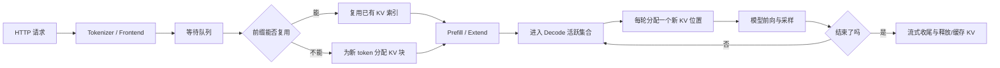
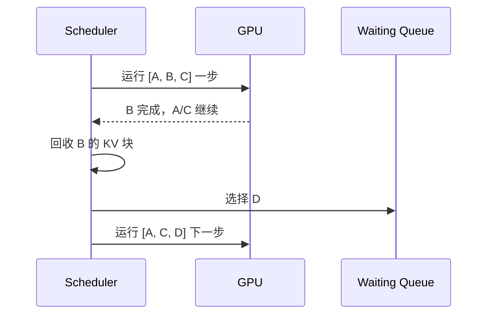
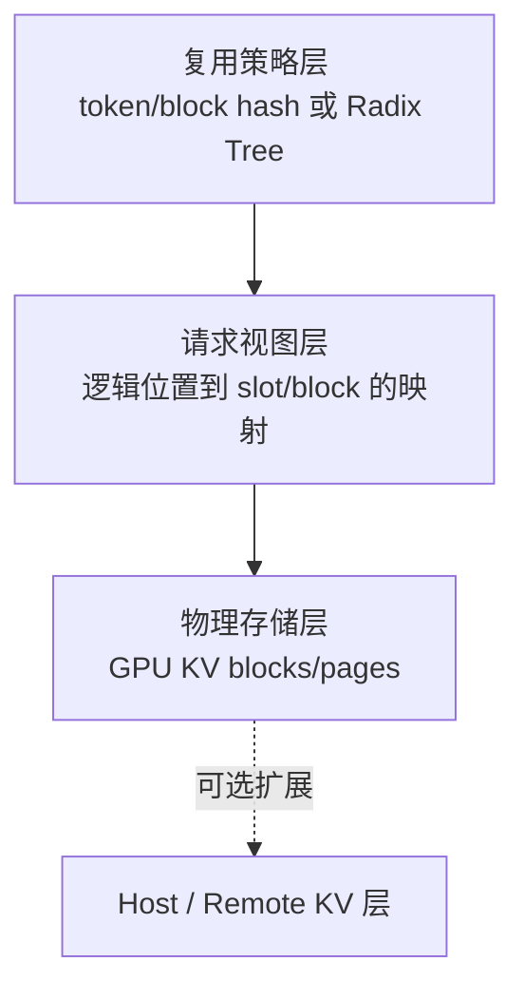
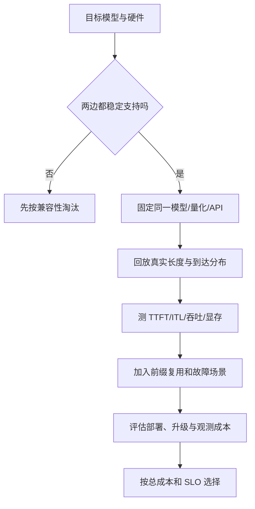

# LLM 推理系统心智模型与 SGLang、vLLM 选型边界学习文档

本文面向第一次接触 LLM Serving 的同学。它不把 SGLang 和 vLLM 做成一张“功能打勾表”，而是先建立一套能反复使用的心智模型：一次请求消耗哪些资源、调度器在决定什么、KV Cache 为什么同时牵动吞吐和延迟，以及应当怎样根据业务负载选框架。

本文是第三方资料整理型学习资料，不是两个项目当前版本的源码审计。框架能力、参数名和性能会快速变化；涉及上线选型时，应以目标版本的官方文档和自己的压测为准。

## 0. 阅读基线与范围

### 0.1 主要来源

| 项目 | 内容 |
| --- | --- |
| 原文一 | 《vLLM vs SGLang 深度技术对比》 |
| 链接 | https://mp.weixin.qq.com/s/VIM5rweSUH1H5n3a0ju31w |
| 作者/机构 | Database 笔记本 |
| 发布时间 | 2026-06-06 |
| 原文二 | 《SGLang Overview：设计哲学与关键机制》 |
| 链接 | https://mp.weixin.qq.com/s/ACaY5jXblT4Br1RRVAqqUw |
| 作者/机构 | 页面署名“青稞AI”，正文署名“方弦” |
| 发布时间 | 2026-04-08 |
| 读取时间 | 2026-07-25 |
| 整理范围 | 通用 Serving 心智模型、SGLang/vLLM 的抽象差异、选型和压测方法 |
| 不展开内容 | 逐版本功能矩阵、硬件兼容清单、未经一手材料支持的市场占有率和性能排名 |
| 验证边界 | 对明显易变或相互矛盾的说法，只保留为原文观点；本文未对两个项目做同版本源码复核或端到端复现 |

原文二说明其阅读基线为 SGLang commit `c01ee848b`（2026-03-24），并提示部分内容经过 LLM 辅助整理。因此，本文只吸收其中适合建立心智模型的部分，不把函数级描述当成当前源码事实。

### 0.2 怎么读本文

第一次阅读建议按下面顺序：

1. 先读第 1、2 节，建立“请求、计算、KV、调度”四张地图。
2. 再读第 3 节，理解 PagedAttention 与 RadixAttention 为什么不是二选一。
3. 带着自己的业务特征看第 5 节，不要先问“谁更快”。
4. 最后从第 7 节跳到仓库中的专项文档。

### 0.3 术语速查

| 术语 | 人话解释 | 容易混淆的点 |
| --- | --- | --- |
| Serving | 把模型包装成能持续接收并发请求的在线系统 | 不只是一次 `forward` |
| Prefill | 一次处理输入 prompt，并建立其 KV Cache | 通常计算密集，影响 TTFT |
| Decode | 基于已有 KV，每轮生成一个或少量 token | 通常访存密集，影响 ITL/TPOT |
| TTFT | 从请求到首个输出 token 的时间 | 会被排队和长 prefill 放大 |
| ITL/TPOT | 相邻输出 token 的间隔/每输出 token 时间 | 受 decode batch 和干扰影响 |
| Continuous Batching | 每个迭代都移除完成请求、接纳新请求 | 是调度方法，不是 KV 存储方法 |
| PagedAttention | 用块表把逻辑 token 映射到不连续物理 KV 块 | 主要解决物理分配和寻址 |
| Prefix Cache | 跨请求复用已计算的相同前缀 | 需要匹配、所有权和回收策略 |
| RadixAttention | SGLang 用 Radix Tree 组织和复用前缀 KV | 可以建立在分页物理池之上 |
| APC | vLLM 的 Automatic Prefix Caching | 通常以完整 block 为复用粒度 |
| Chunked Prefill | 把长 prompt 的计算拆成多个调度片段 | chunk 是计算粒度，block/page 是存储粒度 |
| Overlap Scheduling | CPU 准备下一批时，GPU 执行当前批 | “隐藏开销”不等于开销不存在 |
| PD 分离 | Prefill 和 Decode 部署到不同 worker 池 | 要额外传输 KV 和管理生命周期 |

## 1. 先建立整体地图

### 1.1 人话版

把一台推理服务器想成一间只有一条主生产线的工厂：

- 模型权重是常驻设备，占掉一大块显存。
- KV Cache 是每个在制订单的半成品，随输入和输出长度增长。
- GPU 算子是真正加工 token 的机器。
- Scheduler 决定下一轮让哪些请求上机、给它们多少 KV 空间。
- 前端负责 tokenization、流式连接、超时与取消。

因此，在线推理的核心问题不是单纯“矩阵乘多快”，而是：

> 在显存、计算、带宽和延迟目标同时受限时，每一轮应该让哪些 token 上 GPU。

### 1.2 一条请求的完整旅程



控制面是 Scheduler 的“选谁、分多少、何时回收”；数据面是 token、KV 张量和采样结果的实际流动。二者必须分开理解。

### 1.3 四类资源预算

| 预算 | 典型约束 | 用尽后的表现 |
| --- | --- | --- |
| 权重显存 | 模型大小、量化、TP/PP | 模型无法加载 |
| KV 显存 | 上下文长度、并发、KV dtype、层数 | 请求无法 admission、被抢占或回退 |
| 单轮计算预算 | batch token 数、prefill chunk、CUDA Graph bucket | 长任务阻塞、GPU 利用率低或激活 OOM |
| CPU/通信预算 | 调度、Python 后处理、IPC、跨卡/跨节点传输 | GPU 迭代之间出现 bubble |

一个很实用的近似式是：

```text
可用于 KV 的显存
≈ GPU 总显存 - 模型权重 - 激活/CUDA Graph/运行时预留

可承载的活跃请求数
≈ KV token 总容量 / 每请求平均 live tokens
```

这里的 `live tokens` 是“仍需要保留 KV 的 prompt token + 已生成 token”，不是 API 层的最大请求数。

## 2. 为什么吞吐、TTFT 和 ITL 会互相拉扯

### 2.1 Prefill 和 Decode 不是同一种工作

| 阶段 | 一次处理 | 常见瓶颈 | 用户指标 |
| --- | --- | --- | --- |
| Prefill | 一个或多个请求的大量输入 token | 计算、激活显存 | TTFT |
| Decode | 每个活跃请求一个新 token | 权重/KV 读取带宽、启动开销 | ITL/TPOT |

大 prefill batch 有利于算力利用率，却可能让正在 decode 的请求长时间拿不到下一轮；小 chunk 可以降低阻塞，却会增加调度轮次和 kernel launch。没有一个 chunk 大小对所有流量都最优。

### 2.2 连续批处理解决什么

静态批处理要求一批中最慢的请求结束后才能换批。连续批处理在每个迭代边界做三件事：

1. 移除已经完成的请求。
2. 立即回收它们的 KV 块和 batch 槽位。
3. 从等待队列接纳新请求，重组下一轮 batch。



它消除的是“等整批结束”的空槽，不保证所有 workload 都满载，也不自动提供前缀复用。

### 2.3 Chunked Prefill 解决什么

如果一个 100K token prompt 一次完成 prefill，其他请求可能在整个 forward 期间无法获得 GPU。Chunked Prefill 把它拆成若干调度单元，让系统在 chunk 边界重新做 admission。

需要注意两点：

- “可以在 chunk 边界重新调度”不等于每种实现都会严格交替运行 decode。
- chunk 越小，公平性通常越好，但总 launch/调度开销越大。

## 3. 三层 KV 心智模型

初学者最容易把 PagedAttention、Prefix Cache 和分层存储都叫作“KV Cache”。更稳妥的拆法是三层：



### 3.1 物理存储层：PagedAttention 的主要位置

物理 KV 块不要求连续。一个请求的逻辑序列可以通过 block table 指向散落在显存中的块。好处是按需分配、容易回收，外部碎片显著减少。

### 3.2 请求视图层：把散块拼成一条逻辑序列

Attention kernel 需要知道“这个请求第 0、1、2……个逻辑位置在哪个物理块”。请求视图保存这张映射表。它拥有寻址信息，但不等于拥有跨请求缓存策略。

### 3.3 复用策略层：APC 与 RadixAttention

当前缀缓存启用时，系统需要回答：

- 新请求与哪些已缓存 token/block 相同？
- 哪些物理块可以共享？
- 活跃请求引用的块如何防止被回收？
- 请求结束后，哪些 KV 留作缓存，哪些立即释放？

vLLM APC 常用链式 block hash 在完整 block 边界判断命中；SGLang RadixAttention 用压缩 Radix Tree 表达 token 序列分支。二者粒度与元数据结构不同，但都建立在“逻辑序列映射到物理 KV”之上。

详细机制分别见：

- [vLLM APC 链式哈希学习文档](../vllm/vLLM%20APC%20链式哈希学习文档.md)
- [SGLang RadixAttention 前缀缓存命中定义学习文档](../sglang/SGLang%20RadixAttention%20前缀缓存命中定义学习文档.md)

## 4. SGLang 与 vLLM 应该比较哪些维度

### 4.1 不要只比较功能名字

同样写着“支持 Chunked Prefill”或“支持 PD 分离”，实现成熟度、兼容矩阵和默认策略可能完全不同。选型时至少要分下面六层：

| 维度 | 要问的问题 |
| --- | --- |
| 模型/硬件 | 目标 checkpoint、量化格式、GPU 是否有稳定后端 |
| KV 管理 | 前缀复用粒度、回收策略、分层存储是否满足流量 |
| 调度 | prefill/decode 如何混合，是否支持目标 SLA |
| 分布式 | TP/PP/DP/EP/PD 的目标组合是否经过验证 |
| API/生态 | OpenAI 兼容、结构化输出、LoRA、监控是否满足产品 |
| 运维 | 版本升级、故障隔离、扩缩容、可观测性是否成熟 |

### 4.2 可以保留的抽象差异

下面是帮助理解的倾向，不是永久功能边界：

| 观察角度 | vLLM | SGLang |
| --- | --- | --- |
| 代表性抽象 | PagedAttention、block table、连续批处理 | RadixAttention、请求状态机、重叠调度 |
| 前缀复用心智模型 | 以完整 block hash 为核心 | 以 token 序列的压缩 Radix Tree 为核心 |
| 学习入口 | 先理解 block/KV manager，再看 scheduler | 先理解 Req/ScheduleBatch，再看 radix 和 scheduler |
| 适合重点压测 | 通用模型兼容与稳定吞吐 | 前缀密集、复杂调度和 SGLang 专项优化 |

两边都在快速吸收彼此的优秀设计。把上表理解为“读代码时从哪里切入”，比理解为“谁有、谁没有”更可靠。

### 4.3 “零开销”应怎样理解

SGLang 的 overlap scheduler 尝试让 GPU 执行 batch N 时，CPU 完成 batch N 的后处理和 batch N+1 的准备：

```mermaid
gantt
    title 重叠调度的理想时间线
    dateFormat X
    axisFormat %L
    section GPU
    Forward N     :0, 6
    Forward N+1   :6, 12
    section CPU
    Prepare N+1   :1, 5
    Post N        :2, 6
    Prepare N+2   :7, 11
```



“零开销”是效果目标：CPU 工作尽量被 GPU 时间覆盖。它并不表示排序、分配、同步和后处理不再消耗 CPU；当 GPU 单步很短、CPU 很慢或发生强制同步时，bubble 仍会暴露。

## 5. 用 workload 做选型，而不是用口号

### 5.1 先描述自己的流量

至少收集这些分布，而不是只写“并发 100”：

| 变量 | 为什么重要 |
| --- | --- |
| 输入长度 P50/P95/P99 | 决定 prefill 计算和 KV 初始占用 |
| 输出长度 P50/P95/P99 | 决定请求驻留时间和 decode 压力 |
| 共享前缀长度与复用频率 | 决定 Prefix Cache 的实际价值 |
| 到达过程和突发程度 | 决定 batch 能否自然形成 |
| TTFT/ITL SLO | 决定 chunk、调度和 PD 是否值得 |
| 模型、量化、并行拓扑 | 决定可用 kernel 和通信成本 |

### 5.2 四类典型场景

#### 场景 A：独立短请求、几乎无共享前缀

重点是连续批处理、模型后端成熟度、CUDA Graph 和运维稳定性。Radix/APC 的理论命中能力不是主要矛盾。

#### 场景 B：长系统提示词、多轮 Agent、RAG 模板稳定

重点是可复现的 prefix hit、缓存生命周期和 worker 路由亲和性。需要压测“冷启动、热缓存、缓存被逐出”三种状态。

#### 场景 C：长输入与在线短请求混合

重点是 Chunked Prefill、抢占/回退、TTFT P99 和 decode 抖动。平均吞吐不能代替尾延迟。

#### 场景 D：大规模 MoE 或 PD 集群

重点从单机 scheduler 转向 all-to-all、EP 负载、KV 传输、故障域和跨 worker 路由。单卡 benchmark 很难直接预测集群效果。

### 5.3 一个可执行的选型漏斗



## 6. 如何阅读和质疑性能数字

### 6.1 数字必须绑定测试条件

任何“快 30%”“吞吐 23 倍”的说法，至少要附带：

- 框架 commit/tag 和容器；
- 模型、量化、dtype；
- GPU 型号、数量和互联；
- 输入/输出长度分布；
- 并发或到达率；
- 是否启用 prefix cache、chunked prefill、spec decode；
- 指标是 input TPS、output TPS、goodput 还是单用户 TPS；
- TTFT/ITL 是否满足同一个 SLO。

缺少这些条件的数字适合产生假设，不适合做采购结论。

### 6.2 正确的对比对象是 Pareto 前沿

一个配置可能用更高 TTFT 换更高吞吐。应同时画出：

- 吞吐 vs TTFT P99；
- 吞吐 vs ITL P99；
- goodput vs GPU 成本；
- prefix hit rate vs L2/L3 I/O；
- 并发 vs retract/preemption 比例。

只有在同一延迟约束下仍更高的吞吐，才是对在线业务真正有效的提升。

## 7. 本仓库的递进阅读地图

### 7.1 先读共同基础

1. [vLLM 从连续批处理到 PagedAttention 的引擎工作流学习文档](../vllm/vLLM%20从连续批处理到%20PagedAttention%20的引擎工作流学习文档.md)
2. [SGLang 调度器请求生命周期与重叠调度学习文档](../sglang/SGLang%20调度器请求生命周期与重叠调度学习文档.md)

### 7.2 再按问题深入

| 你正在追的问题 | 建议阅读 |
| --- | --- |
| block 与 chunk 为什么同时存在 | [vLLM Chunked Prefill 与 Block Size 学习文档](../vllm/vLLM%20Chunked%20Prefill%20与%20Block%20Size%20学习文档.md) |
| SGLang 长 prompt 和显存参数 | [SGLang Chunked Prefill 与调度器显存预算学习文档](../sglang/SGLang%20Chunked%20Prefill%20与调度器显存预算学习文档.md) |
| SGLang 的三层 KV 数据结构 | [SGLang KV Pool、请求视图与 HiCache 工程学习文档](../sglang/SGLang%20KV%20Pool、请求视图与%20HiCache%20工程学习文档.md) |
| HiCache 与 Mooncake 后端的职责边界 | [Mooncake 与 SGLang HiCache 学习文档](../sglang/Mooncake%20与%20SGLang%20HiCache%20学习文档.md) |
| 多副本和路由怎么选 | [SGLang 数据并行、负载均衡与专家并行边界学习文档](../sglang/SGLang%20数据并行、负载均衡与专家并行边界学习文档.md) |
| 长上下文 kernel 调度 | [PersistentKV 长上下文注意力调度学习文档](../vllm/PersistentKV%20长上下文注意力调度学习文档.md) |

### 7.3 源码型资料

第三方文章建立概念后，再读源码型文档：

- [PD 分离下的 PP 源码学习文档](../sglang/PD%20分离下的%20PP%20源码学习文档.md)

## 8. 本轮来源去重映射

17 个输入链接没有按“一篇文章一篇笔记”机械拆分，而是按问题域归并：

| 序号 | 原文主题 | 归入文档 |
| ---: | --- | --- |
| 1 | SGLang KV Pool、Radix Tree、请求视图 | [SGLang KV Pool、请求视图与 HiCache 工程学习文档](../sglang/SGLang%20KV%20Pool、请求视图与%20HiCache%20工程学习文档.md) |
| 2 | PersistentKV 长上下文调度 | [PersistentKV 长上下文注意力调度学习文档](../vllm/PersistentKV%20长上下文注意力调度学习文档.md) |
| 3 | 连续批处理 | [vLLM 从连续批处理到 PagedAttention 的引擎工作流学习文档](../vllm/vLLM%20从连续批处理到%20PagedAttention%20的引擎工作流学习文档.md) |
| 4 | SGLang Scheduler 代码解析 | [SGLang 调度器请求生命周期与重叠调度学习文档](../sglang/SGLang%20调度器请求生命周期与重叠调度学习文档.md) |
| 5 | SGLang Chunked Prefill | [SGLang Chunked Prefill 与调度器显存预算学习文档](../sglang/SGLang%20Chunked%20Prefill%20与调度器显存预算学习文档.md) |
| 6 | SGLang Native DP | [SGLang 数据并行、负载均衡与专家并行边界学习文档](../sglang/SGLang%20数据并行、负载均衡与专家并行边界学习文档.md) |
| 7 | vLLM Block Size 与 Chunk | [vLLM Chunked Prefill 与 Block Size 学习文档](../vllm/vLLM%20Chunked%20Prefill%20与%20Block%20Size%20学习文档.md) |
| 8 | vLLM 入门工作流 | [vLLM 从连续批处理到 PagedAttention 的引擎工作流学习文档](../vllm/vLLM%20从连续批处理到%20PagedAttention%20的引擎工作流学习文档.md) |
| 9 | SGLang Scheduler 显存估算 | [SGLang Chunked Prefill 与调度器显存预算学习文档](../sglang/SGLang%20Chunked%20Prefill%20与调度器显存预算学习文档.md) |
| 10 | SGLang Zero-Overhead Scheduler 转载 | [SGLang 调度器请求生命周期与重叠调度学习文档](../sglang/SGLang%20调度器请求生命周期与重叠调度学习文档.md) |
| 11 | SGLang ScheduleBatch | [SGLang 调度器请求生命周期与重叠调度学习文档](../sglang/SGLang%20调度器请求生命周期与重叠调度学习文档.md) |
| 12 | vLLM 与 SGLang 对比 | 本文 |
| 13 | Waterfill/LPLB 性能说法 | [SGLang 数据并行、负载均衡与专家并行边界学习文档](../sglang/SGLang%20数据并行、负载均衡与专家并行边界学习文档.md)中的事实核验章节 |
| 14 | GLM-5.2 NVFP4 优化 | [SGLang GLM-5.2 NVFP4 推理优化案例学习文档](../sglang/SGLang%20GLM-5.2%20NVFP4%20推理优化案例学习文档.md) |
| 15 | HiCache 工程链路 | [SGLang KV Pool、请求视图与 HiCache 工程学习文档](../sglang/SGLang%20KV%20Pool、请求视图与%20HiCache%20工程学习文档.md) |
| 16 | SGLang 设计哲学 | 本文与 [SGLang 调度器请求生命周期与重叠调度学习文档](../sglang/SGLang%20调度器请求生命周期与重叠调度学习文档.md) |
| 17 | 第 10 篇的原始文章 | 与第 10 篇合并为同一来源组，不重复计证据 |

这样安排后，每篇专项文档只回答一种核心问题；共同基础通过链接引用，不再复制一套 Prefill/Decode、PagedAttention 或 RadixAttention 入门说明。

## 9. 一句话总结

SGLang 和 vLLM 都是在做同一道资源调度题：用有限显存承载不断增长的 KV，在 prefill 与 decode 之间分配 GPU 时间；可靠选型不是寻找永久冠军，而是让目标版本在真实 workload 和同一 SLO 下正面对比。

## 10. 参考与延伸

- 《vLLM vs SGLang 深度技术对比》：https://mp.weixin.qq.com/s/VIM5rweSUH1H5n3a0ju31w
- 《SGLang Overview：设计哲学与关键机制》：https://mp.weixin.qq.com/s/ACaY5jXblT4Br1RRVAqqUw

本文基于上述资料做主题重组和边界校正。框架特性表和性能数字均未在本文中做同版本复现。
