# P/D 分离的 RDMA、IB 与 GPU 可见性学习文档

Decode 发起 READ，KV 数据却从 Prefill 流向 Decode；网卡报告完成，GPU 也未必已经可以消费；一个请求结束，更不意味着两端缓存能在同一时刻释放。读懂这些方向与生命周期，是把网络抓包连接到推理业务的关键。

本文属于**第三方资料整理型学习文档**，围绕原文的一项 512 KiB KV Pull，建立“请求 → 地址区间 → RDMA 工作 → 报文 → 本地完成 → GPU 消费 → 回收”的地图。原文有现场抓包，本次只有公开文章和图片，**没有取得原始 PCAP、日志、容器镜像或 GPU 内容，因此没有完成独立抓包复现或生产验证**。

## 0. 阅读基线与范围

| 项目 | 内容 |
| --- | --- |
| 原文标题 | P/D 分离中的 RDMA 传输：基于 Wireshark 的 IB 与 GPUDirect 分析 |
| 原文链接 | [AI码酱原文](https://mp.weixin.qq.com/s/kK6jmNGU7RrKlpnrKp10KA) |
| 作者 / 机构 | AI码酱；文章自述从事推理编排与基础设施工程 |
| 发布时间 / 读取时间 | 2026-09-13 23:51:24，Asia/Shanghai；读取 2026-09-14 |
| 原文环境标识 | 文章写作“Dynamo/vLLM 1.4.0”，模型为 Qwen3-30B-A3B；未提供本次可独立固定的镜像 digest 或源码 commit |
| 本次核对 | 正文全部 17 节、全部 23 张图片；Wireshark 字段表、CUDA GPUDirect 文档、rdma-core API 手册 |
| 不展开 | 逐跳交换机遥测、硬件 DMA trace、RoCE 报文、其他 connector 的实现证明 |
| 图片采用 | 保留 2 张抓包截图和 20 张编号技术图；排除封面。下载原始图像未改写，见[完整图片来源与 SHA-256](../images/rdma-kv-transfer/SOURCES.md) |
| 查重 | 链接与题名未命中已有分析；现有 KV Connector 和 PD+PP 文档属于相关基础 |

证据分三层：**原文报告**包括样本字节数、MR、日志和函数描述；**官方接口核对**支持通用协议 / API 语义；**整理者分析**包括算例、状态机和建议验证步骤。原文的函数名作为回查线索保留，没有把它们写成当前某个上游 commit 的源码事实。

| 术语 | 人话解释 | 所属范围 |
| --- | --- | --- |
| RDMA | 让网卡按授权直接读写对端内存的操作机制 | 内存传输语义 |
| IB | 承载本样本传输的 InfiniBand 网络 | 网络协议 |
| GPUDirect RDMA | NIC 访问 GPU 内存的映射与数据路径 | 本机设备互访 |
| MR | 已注册给 RDMA 设备访问的内存区域 | 地址、长度、权限、有效期 |
| lkey / rkey | 校验本地 / 远端内存访问的键 | 不代表加密认证 |
| QP / QPN | 通信队列对 / 本机端点编号 | 连接与操作状态 |
| PSN | IB 传输包序号 | 24 位，会回绕 |
| WR / WQE | 软件工作请求 / 设备工作描述 | 提交与执行 |
| SGE | 本地地址、长度和 lkey 描述 | READ 的目标位置 |
| CQE / WC | 设备完成条目 / 软件读取的完成结果 | 本地工作完成 |
| PD | 本文“P/D”指 Prefill/Decode；verbs 的 PD 指 Protection Domain | 两种缩写务必分开 |

## 1. 先建立一项 KV Pull 的整体地图

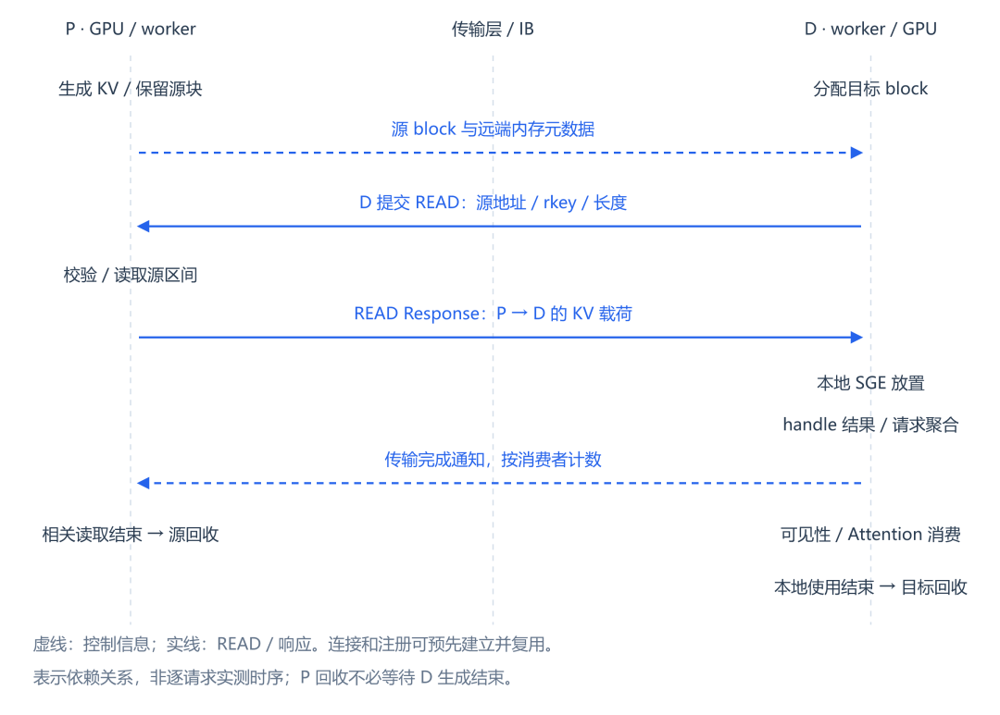

**图意解读：** P 生产并保留源 KV，D 准备目标 block，控制面交换授权与地址元数据，D 发起 READ，P 返回字节。回收分两条：P 等相关读取者结束，D 等自己的 GPU 消费者结束；图展示依赖，不是逐请求实测时间线。

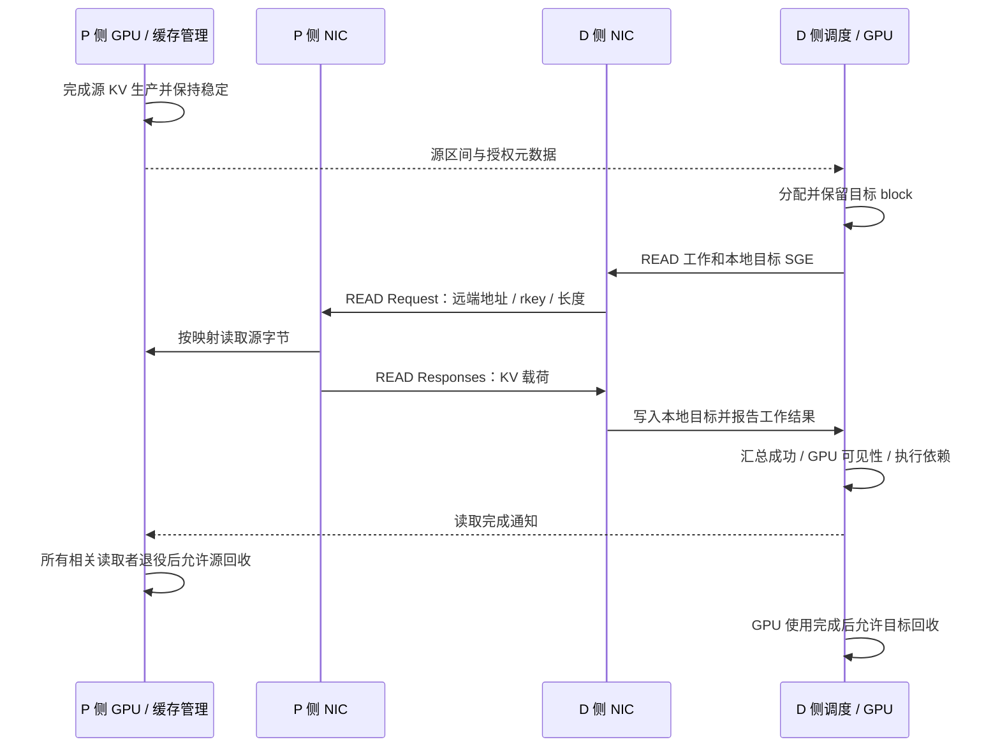
```mermaid
sequenceDiagram
    participant P as P 侧 GPU / 缓存管理
    participant PN as P 侧 NIC
    participant DN as D 侧 NIC
    participant D as D 侧调度 / GPU
    P->>P: 完成源 KV 生产并保持稳定
    P-->>D: 源区间与授权元数据
    D->>D: 分配并保留目标 block
    D->>DN: READ 工作和本地目标 SGE
    DN->>PN: READ Request：远端地址 / rkey / 长度
    PN->>P: 按映射读取源字节
    PN->>DN: READ Responses：KV 载荷
    DN->>D: 写入本地目标并报告工作结果
    D->>D: 汇总成功 / GPU 可见性 / 执行依赖
    D-->>P: 读取完成通知
    P->>P: 所有相关读取者退役后允许源回收
    D->>D: GPU 使用完成后允许目标回收
```

**图意解读：** 整理者画的是通用正确性依赖，不假定通知 API、CUDA flush 或 NIC 内部实现完全相同。允许源回收与允许目标回收，不是同一个条件。

## 2. 先确定抓到了什么，再解释抓包

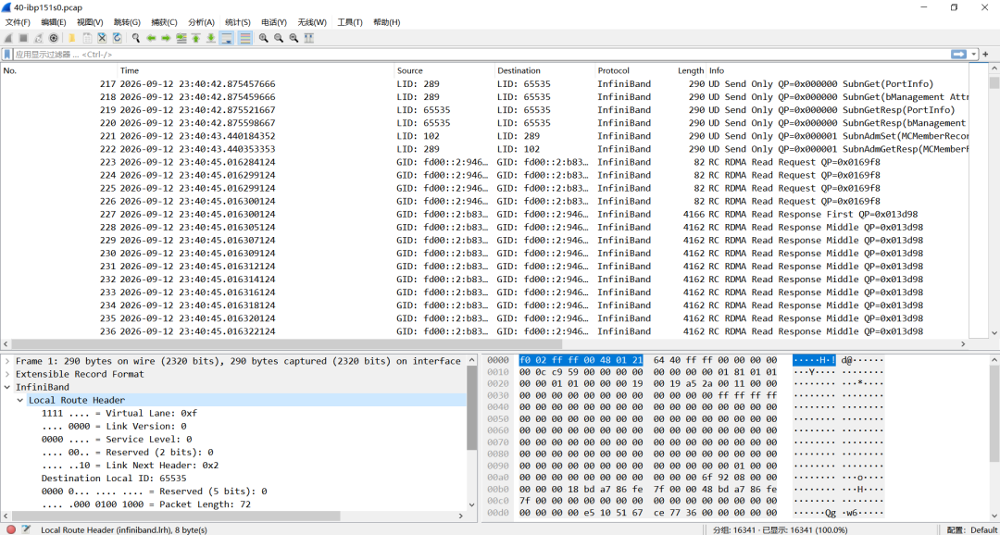

**图意解读：** 截图展示 Wireshark 的报文列表与 LRH 等协议树，可用来观察如何读取字段；这里选中的是管理类帧，不应把它直接当成后面那项 512 KiB READ Request 的证据。

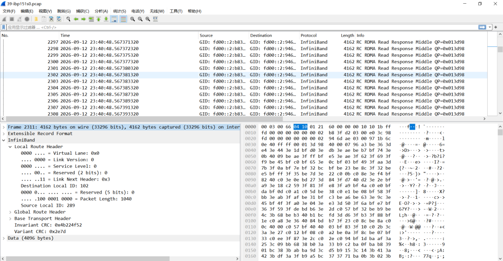

**图意解读：** 截图显示 READ Response Middle 和 4096 字节数据区域，支持观察响应封装；两张截图来自其他展示端口，不能与正文 `ibp205s0` 的 LID / QPN 混在一起配对。

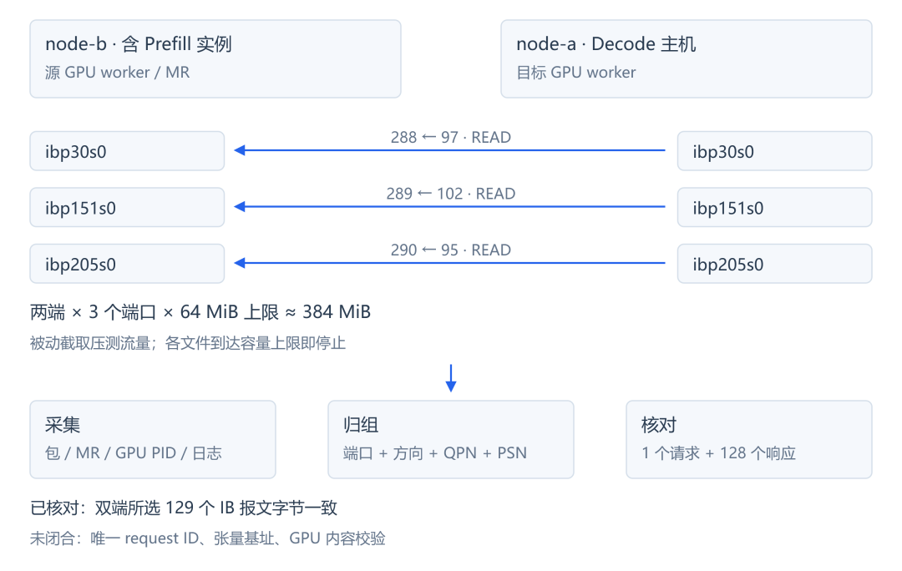

**图意解读：** 原文按双端、端口、方向、QP 与序号归组；图中明确列出尚未闭环的唯一 request ID、张量基址和 GPU 内容校验。这意味着“字节与操作可配对”仍不足以确定业务请求身份和完整数值正确性。

### 2.1 样本账本

| 项目 | 原文报告 | 本次能核对的范围 |
| --- | --- | --- |
| 操作方向 | D→P 发 READ；P→D 回数据 | 正文与图一致 |
| 选定端口的 LID | 请求 95→290，响应 290→95 | 原文记录，不视为本次实时拓扑 |
| 请求目的 QPN / 响应目的 QPN | `0x016b76` / `0x013eee` | 不同方向命中不同本机 QP |
| 请求长度 | 524,288 B | 等于 512 KiB |
| 响应 | 128 × 4096 B；PSN 6–133 | 字节算术与编号一致 |
| 源 MR 长度 | 606,076,928 B | 等于 578 MiB，与单次 READ 粒度不同 |
| 全请求关联 | 尚未唯一绑定 request ID / 张量基址 | 不能宣称完整业务复现 |

原文没有提供可供本次重新解析的 PCAP 下载，因此“选定 129 个报文双端字节一致”仍属于原文报告。

## 3. 一项 READ 怎样从多条并发流里找出来

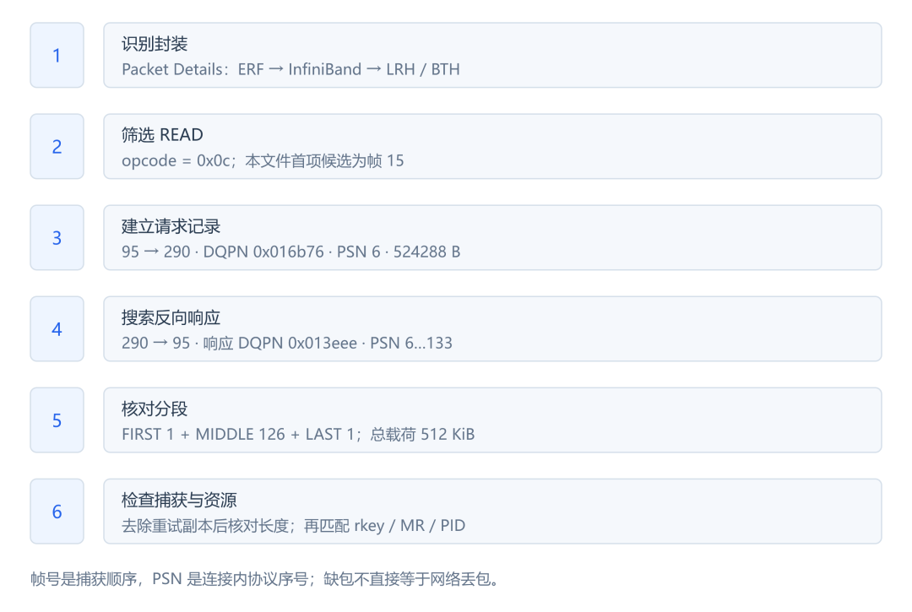

**图意解读：** 先识别封装，再锁定请求、反向端点、PSN 范围和长度。文件帧号只表示捕获顺序，协议序号表示传输关系；不能认为相邻帧必属于同一项操作。

下列命令只示范对**已经取得的本地 PCAP**做分析。本次没有运行，也不包含生产抓包或注入流量：

```bash
tshark -r sample.pcap -Y 'infiniband.bth.opcode == 0x0c' \
  -T fields -e frame.number \
  -e infiniband.lrh.slid -e infiniband.lrh.dlid \
  -e infiniband.bth.destqp -e infiniband.bth.psn \
  -e infiniband.reth.dmalen
```

上述字段名已对照 [Wireshark InfiniBand 字段表](https://www.wireshark.org/docs/dfref/i/infiniband.html)。字段可用性仍取决于本机版本和捕获封装。

本样本响应候选的过滤表达式为：

```text
infiniband.lrh.slid == 290 &&
infiniband.lrh.dlid == 95 &&
infiniband.bth.destqp == 0x013eee &&
infiniband.bth.opcode >= 0x0d &&
infiniband.bth.opcode <= 0x0f
```

这是多包 RC READ 的候选筛选。通用工具还应处理单包 `READ Response Only`（0x10）、PSN 回绕、重传与捕获缺口；opcode 可回查 [Wireshark 官方解码器](https://gitlab.com/wireshark/wireshark/-/blob/master/epan/dissectors/packet-infiniband.c)。反向 LID 和时间接近都不足以唯一配对，还要结合连接 epoch、QP 配对和请求长度；同一数值 QPN 后来可能被复用。

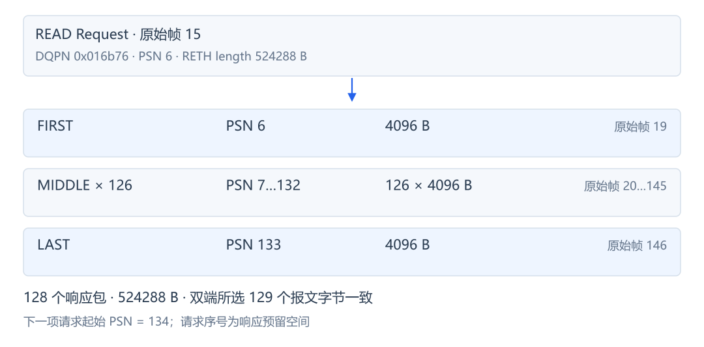

**图意解读：** FIRST + 126 个 MIDDLE + LAST 一共 128 个响应，`133−6+1=128`。下一请求从 134 开始是原文所选连接的序号安排，不能推广为“所有 opcode 每次都加 128”。

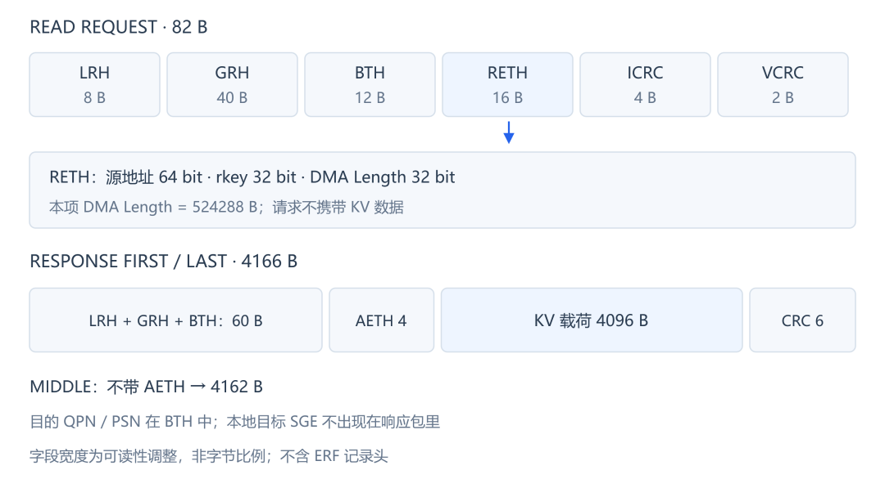

**图意解读：** 4096 B 是有效 KV 载荷，4166 / 4162 B 还包含协议字段和校验；图中的 82 B READ Request 依赖存在 GRH 的该封装，不含 ERF 捕获记录头。不同链路封装不能直接套用同一个帧长度。

**校验例子：** 如果重复捕获一个响应又漏了另一个，单纯“数到 128 包”仍可能通过。要去除重传副本，检查唯一分段覆盖、总载荷和缺口，必要时对双端字节做比对。捕获文件缺包也不自动证明网络丢包。

## 4. 从 KV block 到地址区间

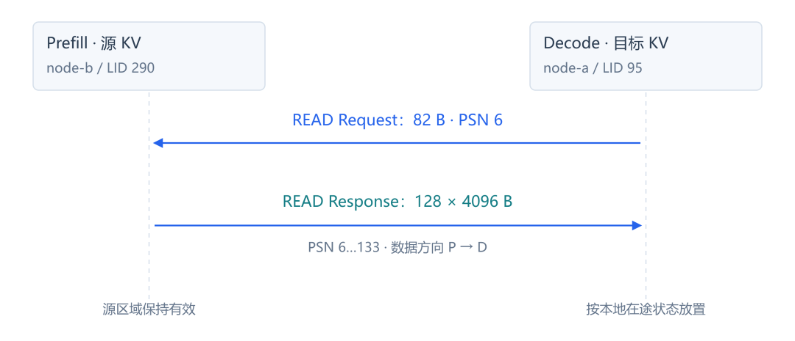

**图意解读：** READ 的动作由 D 发起，载荷由 P 返回。D 的本地目标早已记录在工作描述中，网卡不会为 128 个响应逐个向应用申请 128 个接收 buffer。

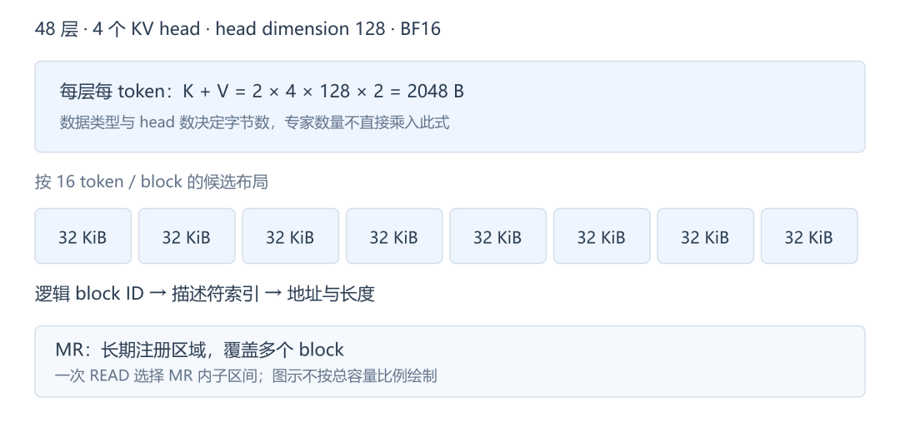

**图意解读：** MR 是长期授权区域，逻辑 block 是引擎的分配单位，READ 是其中一个访问区间。三种粒度没有固定的一一对应。

原文给出的模型条件为 48 层、4 个 KV head、head dimension 128、BF16。以每元素 2 B 计算：

```text
每层每 token 的 K+V = 2 × 4 × 128 × 2 = 2048 B
若 block 为 16 token：每层每 block = 32 KiB
跨 48 层：16-token 状态合计 = 1.5 MiB
```

这里的 16 token/block 是原文用于解释的候选布局。是否一个 tensor 同时含 K/V、不同层是否连续、TP 分片如何分布，都不能仅从模型配置推出。

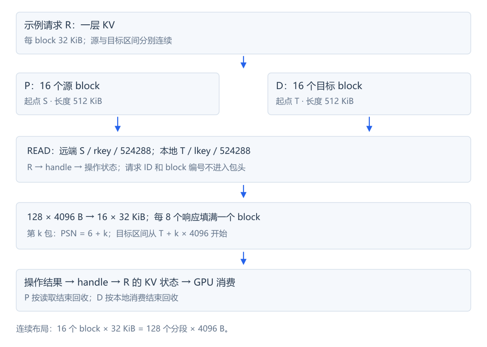

**图意解读：** 图使用一层中连续 16 个 32 KiB block，拼出 512 KiB；本地 T 和远端 S 可以不同，block ID 也可以不同。request ID 和层号留在软件映射中，不会自动进入 IB 包头。

**地址算例：** 若每包放入连续 4096 B，零起始第 k 包覆盖 `[T+4096k, T+4096(k+1))`，每 8 包填满一个 32 KiB block。这个映射需要连续布局假设；分散 SGE 或后端拆分时不能直接沿用。

## 5. 地址映射与内存授权：地址对了还不够

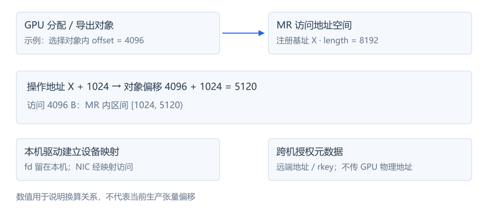

**图意解读：** GPU VA、导出对象内偏移、MR 访问基址是不同概念；DMA-BUF 的 fd 留在本机供驱动导入，远端持有的是访问所需的地址与 key 元数据。注册建立映射与授权，不是复制整块 KV。

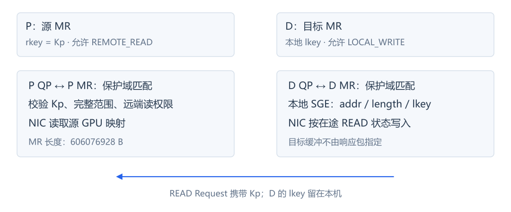

**图意解读：** 源区域允许远端 READ，目标允许本地写入，两边各自满足本机保护域和访问规则。两端的 Protection Domain 数字无需相同；rkey 也不是从源节点推导目标 QP 的办法。

对 MR 区间 `[B, B+L)` 与访问 `[A, A+N)`，可以检查：

```text
A ≥ B
A − B ≤ L
N ≤ L − (A − B)
```

这种写法避免简单相加的溢出陷阱。范围通过还要验证权限、设备 / 保护域、映射有效性，以及在途期间显存没有被重新分配。

[rdma-core 的内存注册手册](https://github.com/linux-rdma/rdma-core/blob/master/libibverbs/man/ibv_reg_mr.3)区分 `addr`、`iova`、DMA-BUF `offset` 和访问标志。具体 GPU 映射机制由平台与后端决定，不能从 PCAP 识别究竟采用哪条注册路径。

## 6. 连接与操作：QP、SQ、RQ 分别负责什么

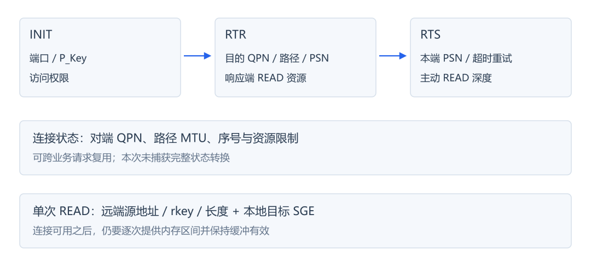

**图意解读：** INIT / RTR / RTS 建立端点路径和通信能力；每次请求继续提供地址与长度。原图也说明没有完整捕获状态转换，不能把这张示意图当作本次建连 trace。

QP 的 READ 并发受请求侧与响应侧资源、SQ 容量及软件窗口共同限制。BTH 带目的 QPN；返回端点依据连接状态确定，不是用 rkey 计算出来。

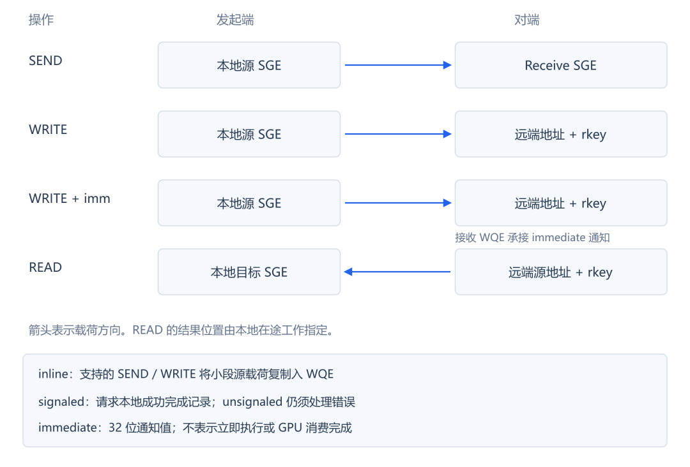

**图意解读：** READ 的结果进入请求方本地 SGE；SEND 消费接收方提供的接收资源；普通 WRITE 按远端地址写；WRITE with immediate 还需要相应接收资源承载通知。`immediate` 不代表“GPU 立即消费完成”。

[rdma-core 的提交手册](https://github.com/linux-rdma/rdma-core/blob/master/libibverbs/man/ibv_post_send.3)描述 WR、SGE、操作类型和完成前的 buffer 使用约束。传输后端也可能走设备直接接口，因此不能从语义上有 READ 推断每项操作必经过公开 `ibv_post_send()`。

## 7. 从引擎描述符到网卡执行

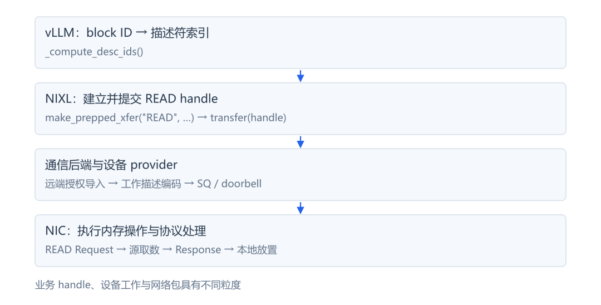

**图意解读：** 引擎先把逻辑 block 转为传输描述，NIXL 管理 handle，后端/provider 将工作交给设备；业务请求、handle、WR 与网络包可以是多对多关系。

原文给出的代码回查线索如下。由于未提供可固定源码基线，这里只记录**原文命名**：

| 原文文件 / 函数线索 | 原文描述的职责 | 真正做源码复核还需取得 |
| --- | --- | --- |
| `base_worker.py`、`get_reg_descs()`、`register_memory()` | 注册缓存区 | 文件完整路径、commit、后端与设备分配方式 |
| `_compute_desc_ids()` | block 到描述符索引 | block layout、TP/PP 与缓存组定义 |
| `pull_worker.py`、`make_prepped_xfer("READ", …)`、`transfer(handle)` | 建立并提交拉取 | handle 生命周期、错误返回及异步完成契约 |
| `_pop_done_transfers()` | 请求级传输结果汇总 | 所有 handle 成功与失败路径、GPU 消费依赖 |
| `_get_new_notifs()` | 读取完成通知与源回收 | 消费者身份、计数和过期通知防护 |

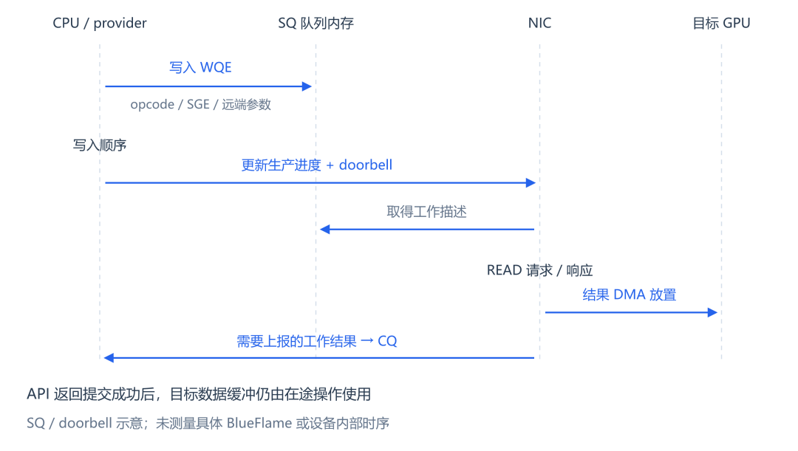

**图意解读：** 描述先完整写好并满足平台顺序，再通知 NIC；doorbell 只是工作通知，不承载整段 KV。图没有测量设备内部 BlueFlame 时序，不能据此推导具体硬件优化是否启用。

软件提交成功表示工作被接受，不表示数据已传完。WR 结构体是否可复用与数据 buffer 是否可回收，是两个接口问题。

## 8. 网络转发不负责理解 KV

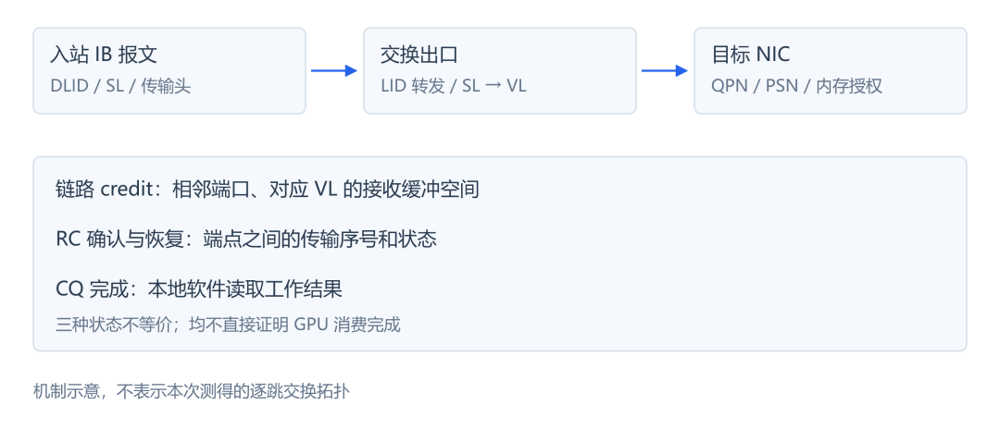

**图意解读：** LID 帮网络选择目的端口，QPN 帮目标 NIC 定位端点；链路 credit、RC 协议状态、CQ 完成是三层不同反馈。credit 充足不代表 GPU 已读完，网络无丢包也不代表没有排队。

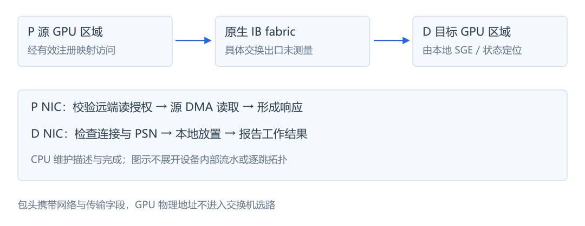

**图意解读：** P NIC 根据源 MR 授权读取，D NIC 根据在途工作放到本地目标。响应不携带 D 的本地地址与 lkey；交换机也无需知道 token、layer 或 GPU 物理地址。

这里讨论原生 IB。RoCE 同样能承载 RDMA 语义，但网络封装、寻址、拥塞处理与抓包字段不同，不能照抄本节 LRH/LID 过滤器。

## 9. 把容量、操作、报文三个账本分开

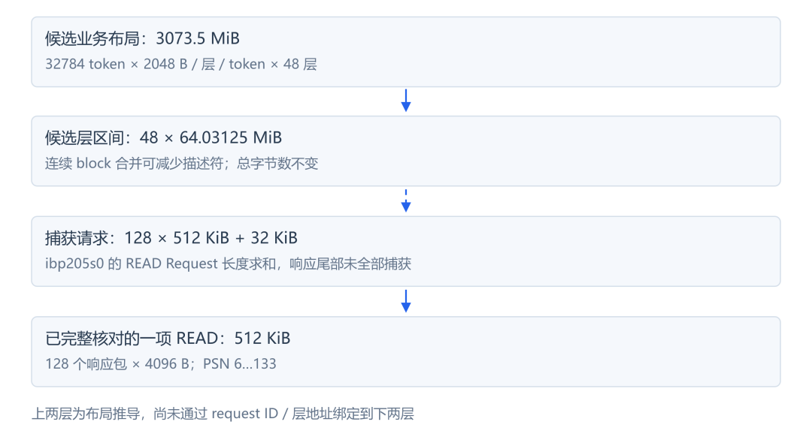

**图意解读：** 图有四层：3073.5 MiB 候选业务布局、48 个连续层区间、捕获请求长度总量、选定且完整配对的 512 KiB READ。上层并未通过 request ID 和层地址绑定到下层，不能把四层当成一条已证明的因果链。

原文算术可以核对为：

```text
32784 token × 2048 B / 层 / token × 48 层 = 3073.5 MiB
32784 / 16 × 48 = 98352 个候选块描述
128 × 512 KiB + 32 KiB = 64.03125 MiB
64.03125 MiB × 48 = 3073.5 MiB
```

字节总量相等只说明候选解释在容量上自洽；要证明实际请求真的这样布局，需要 tensor 基址、描述符地址区间、请求 handle 与捕获操作逐项关联。描述符减少也不保证网络操作按相同比例减少，后端可能继续拆分。

另外，源 MR 的 578 MiB、单次 READ 的 512 KiB、日志候选总量的 3073.5 MiB 是不同对象。本文统一使用二进制 KiB / MiB，避免把日志中标作 MB 的数值直接按十进制理解。

## 10. 从传输完成到业务完成，需要四道边界

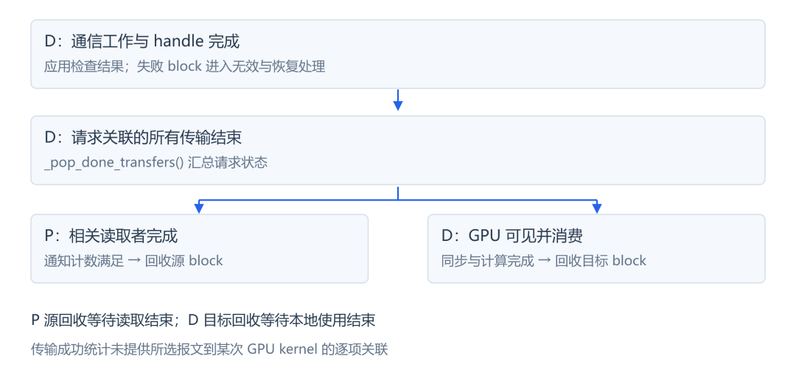

**图意解读：** 单项工作完成先进入通信栈，再汇总到 request；P 等读取者退役，D 等消费者退役。一次 WC 不能代表多 QP、多 handle 的整个请求全部成功。

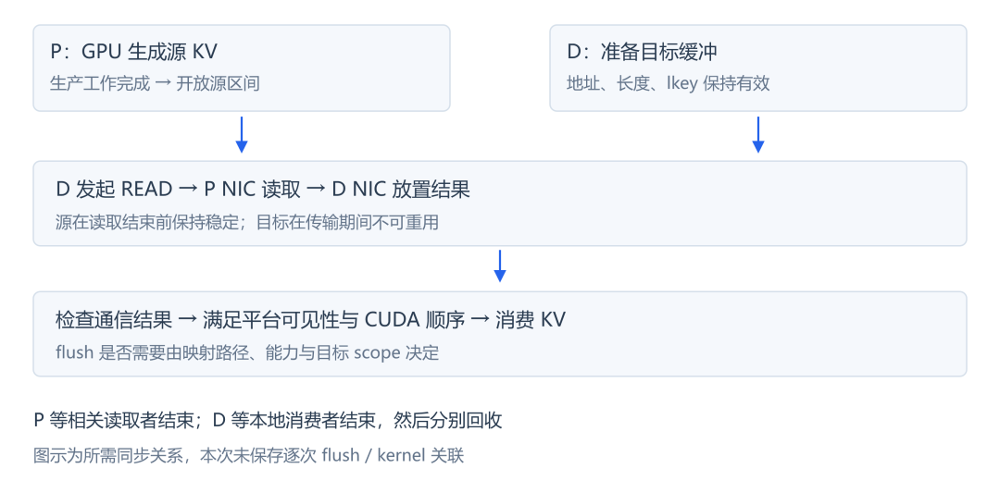

**图意解读：** 左边要求源 GPU 已写好 KV，右边要求目标仍被保留；网络结束后还需要适用平台的可见性与计算顺序。原文未保存逐次 flush / kernel 的关联记录，这张图只表达所需依赖。

四道边界是：

1. **生产完成：** P 的 GPU 写入必须在 NIC 读取前完成并满足可见性。
2. **传输成功：** 检查工作状态，汇总请求全部传输；部分写入或错误不能发布为有效 KV。
3. **GPU 可消费：** 按映射路径、驱动能力和目标作用域建立内存顺序，再让计算使用结果。
4. **可回收：** 所有相关 DMA 与 GPU 使用都已退役，才允许复用或解除注册。

CUDA 文档要求应用处理 GPUDirect 与 GPU 工作之间的顺序；`cuFlushGPUDirectRDMAWrites()` 的适用范围由映射和设备能力决定，不能机械地在每个 CQE 后加一次。[GPUDirect RDMA 文档](https://docs.nvidia.com/cuda/gpudirect-rdma/index.html)、[CUDA Driver API：Device Management](https://docs.nvidia.com/cuda/cuda-driver-api/cuda_driver_api/group__CUDA__DEVICE.html)

`cudaDeviceSynchronize()` 本身不会等待一个未纳入 CUDA 依赖的未来网络响应；单独轮询 CQ 也不替代 GPU 侧执行顺序。两者要通过框架与后端正确连接起来。

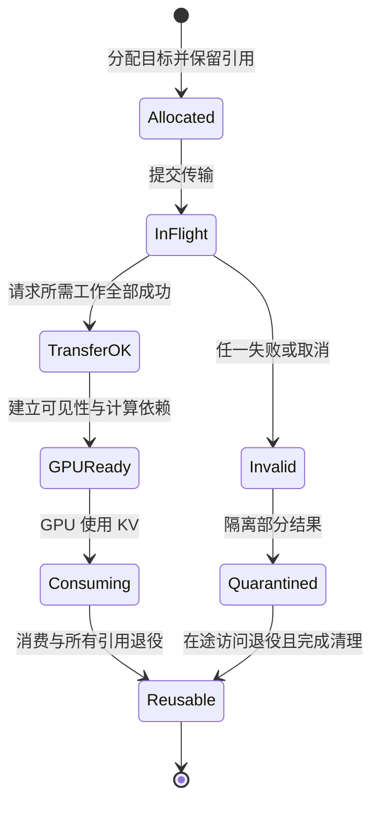
```mermaid
stateDiagram-v2
    [*] --> Allocated: 分配目标并保留引用
    Allocated --> InFlight: 提交传输
    InFlight --> TransferOK: 请求所需工作全部成功
    InFlight --> Invalid: 任一失败或取消
    TransferOK --> GPUReady: 建立可见性与计算依赖
    GPUReady --> Consuming: GPU 使用 KV
    Consuming --> Reusable: 消费与所有引用退役
    Invalid --> Quarantined: 隔离部分结果
    Quarantined --> Reusable: 在途访问退役且完成清理
    Reusable --> [*]
```

**图意解读：** 这是整理者建议的逻辑状态机，不对应某个引擎枚举。失败不直接回到可复用，防止旧 DMA 晚到后覆盖新请求。

## 11. 排障：先找断开的关联，别先猜网卡

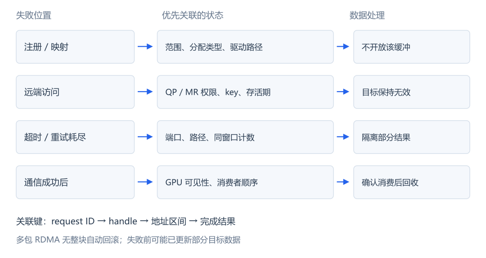

**图意解读：** 注册失败、远端访问失败、超时和传输后计算错误，需要不同证据。RDMA 多包写入没有通用的“整段自动回滚”，错误路径必须把部分结果保持无效。

| 现象 | 优先检查 | 不能据此直接认定 |
| --- | --- | --- |
| 没看到 READ Request | 端口、捕获路径、请求是否已进入提交、QP 状态 | 网络已经坏了 |
| READ 失败、远端访问错误 | rkey epoch、完整范围、权限、映射与 MR 有效期 | 只是丢包 |
| 响应缺段 | 捕获丢包 / 截断、重传、QP 与 PSN 配对 | 对端一定没发送 |
| 工作完成但请求未放行 | 其他 handle / rank 是否完成、请求聚合条件 | CQ 轮询太慢 |
| 数值偶发错误 | 生产与消费顺序、布局、错误 KV 发布、槽位复用 | GPUDirect 一定没生效 |
| 取消后新请求损坏 | 在途 DMA 是否退役、旧通知是否匹配 generation | 收到取消 ACK 就可以回收 |

### 最小闭环证据应该长什么样

```text
request ID + 请求代次
  → 源/目标 block 与 tensor 地址区间
  → transfer handle + 后端工作
  → QP 配对 + 连接代次 + PSN 范围 + 长度
  → 完成状态与完整性校验
  → GPU 可见性与消费事件
  → 源读取者退役 / 目标消费者退役
```

原文已覆盖其中多个观测层，但还没有完成整条唯一关联。本次也没有补做硬件实验。未来若复现，应保留双端时间基准、原始 PCAP、资源快照、完整版本标识、逐请求日志和 GPU 内容校验结果，再讨论性能或正确性验收。

## 12. 自测与延伸

- **READ 请求从 D 发出，为什么抓到大流量是 P→D？** 请求只描述要读哪里，响应才携带 KV。
- **128 个响应需要 128 个 Receive WQE 吗？** READ 响应按本地在途工作放置，不按 SEND 接收模式逐包申请。
- **有合法 rkey 就能证明传的是某个请求的 KV 吗？** 只能说明访问授权，还缺请求与地址映射。
- **P 为什么不用等 D 全文生成完再释放源？** D 使用的是自己的目标副本，P 只需等待相关源读取彻底结束。
- **传输失败后 buffer 能直接分给新请求吗？** 不能只看软件失败标记，还需排除仍在途的访问并完成清理。

相关资料：[vLLM V1 KV Connector 架构](<../vllm/vLLM V1 KV Connector 架构与实现地图源码学习文档.md>)、[PD 分离下的 PP](<../sglang/PD 分离下的 PP 源码学习文档.md>)、[跨模型 KV Cache 转换](<跨模型 KV Cache 转换与 Prefill 复用学习文档.md>)。

**一句话总结：** 网络正确搬完一段授权字节，是请求正确消费 KV 的必要环节；完整证明还要连上业务身份、GPU 顺序和两端资源退役。
