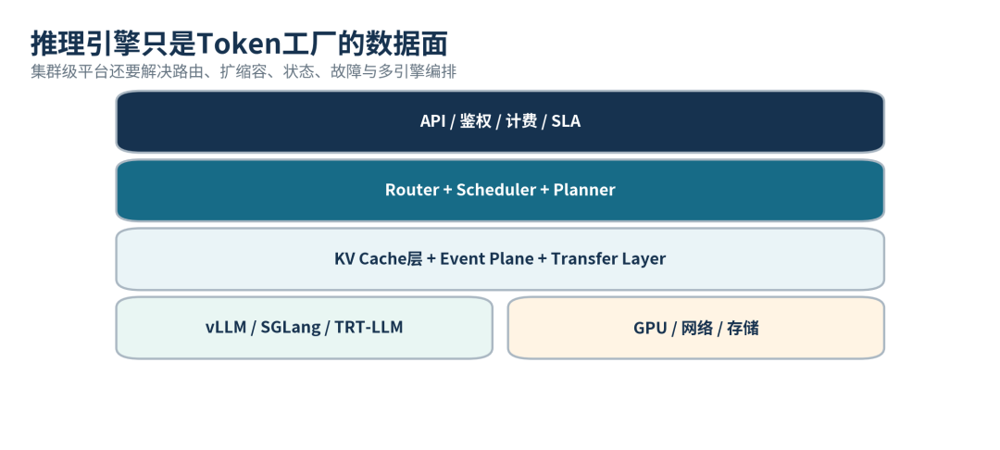
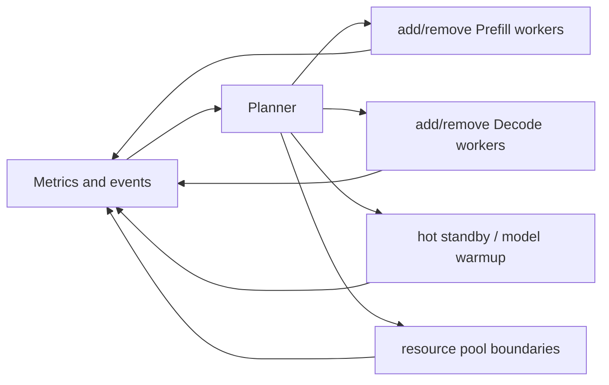
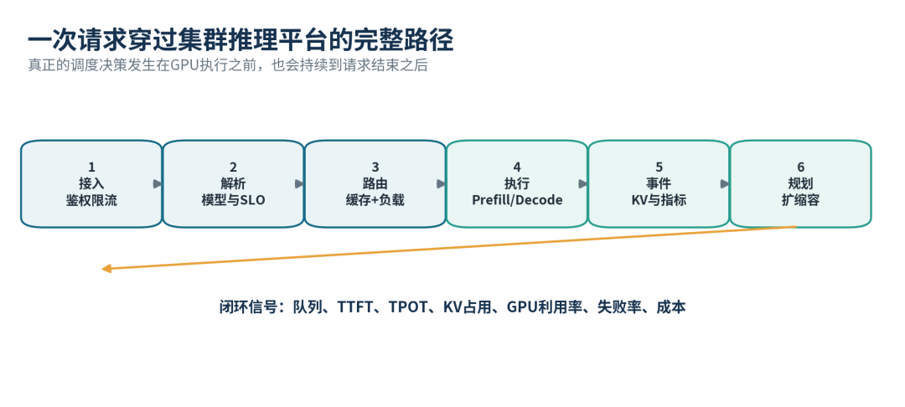
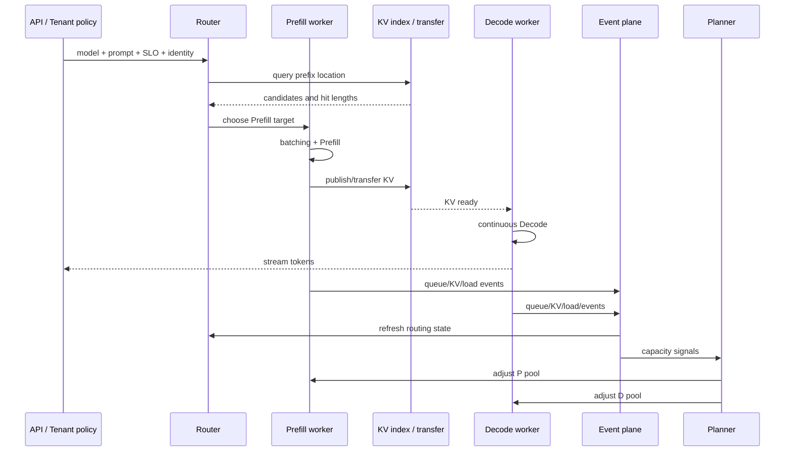
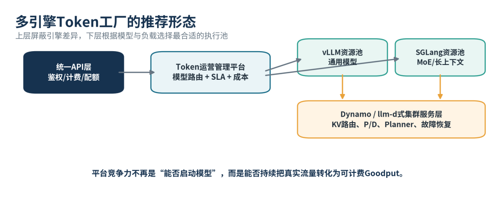
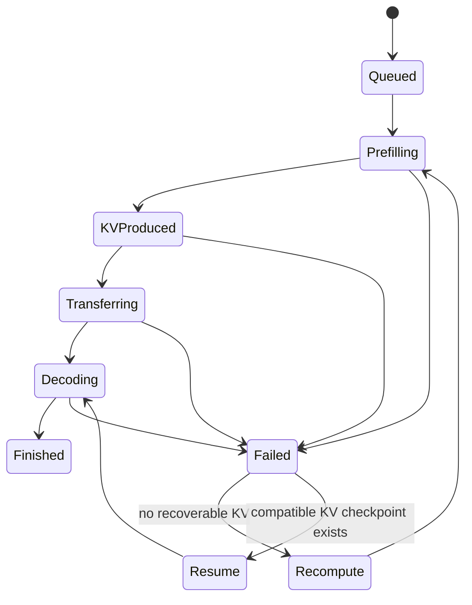

# 推理引擎与集群推理层分工学习文档

本文面向已经能用 vLLM 或 SGLang 启动模型服务、但第一次建设多模型、多副本 GPU 集群的同学。核心问题不是“Dynamo/llm-d 是否替代推理引擎”，而是单个引擎高效生成 token 之后，谁来负责跨副本路由、P/D 资源规划、KV 位置、故障恢复和成本闭环。

本文是第三方资料整理型学习资料，是架构心智模型，不是 Dynamo、llm-d、vLLM 或 SGLang 当前版本的功能审计。

## 0. 阅读基线与范围

| 项目 | 内容 |
| --- | --- |
| 原文标题 | 《从vLLM和SGLang到Dynamo：推理引擎之上为什么还需要集群操作系统？》 |
| 原文链接 | <https://mp.weixin.qq.com/s/rYCSzy_YsZYwkZXZWx6Lqw> |
| 作者/机构 | 博士AI拆解师 |
| 发布时间 | 2026-08-16 |
| 读取时间 | 2026-08-25 |
| 资料类型 | 集群推理平台架构解读 |
| 整理范围 | Engine/Cluster/API 分层、Router、Planner、Event Plane、KV 层、P/D、故障恢复、多引擎 Goodput |
| 不展开内容 | 各项目部署命令、版本兼容矩阵、Kubernetes CRD、具体厂商产品选型 |
| 验证边界 | 只整理原文架构观点；未对 Dynamo/llm-d 当前代码和部署能力做逐项核对，易变功能应以目标版本官方文档和实测为准 |

### “集群操作系统”是什么类比

这里的“操作系统”不是说 Dynamo 或 llm-d 接管 GPU kernel、进程和内存管理。它强调上层平台像资源操作层一样，围绕多个 model workers 维护路由、状态、资源计划、故障和生命周期。更准确的中性名称是“集群推理层”或“分布式推理控制/数据面”。

### 术语速查

| 术语 | 人话解释 | 作用范围 |
| --- | --- | --- |
| Inference Engine | 把进入某个 worker 的请求高效变成 tokens | 请求批处理到 GPU kernel |
| Router | 为当前请求选择模型、Prefill/Decode worker | 秒内或请求级决策 |
| Planner | 调整未来需要多少副本、P/D 比例和资源池 | 分钟级容量决策 |
| Event Plane | 传播 KV、队列、健康和负载变化 | 让 Router/Planner 看见集群状态 |
| KV-aware routing | 尽量把请求送到已有最长前缀的 worker | 依赖缓存身份与位置索引 |
| Goodput | 满足 SLO 的有效吞吐 | 比裸吞吐更接近业务价值 |

## 1. 一张分层图先看清谁拥有谁



**图意解读：** vLLM/SGLang/TRT-LLM 是 token 工厂的数据面；其上是 KV Cache、事件和传输层，再上是 Router/Scheduler/Planner，最上层是鉴权、计费和 SLA。原图用于表达职责分层，不代表所有平台都必须按相同进程或网络边界部署。

### 分层职责

| 层 | 主要责任 | 不应假装拥有 |
| --- | --- | --- |
| API/业务层 | 鉴权、配额、计费、模型目录、租户 SLA | GPU 内 KV slot 生命周期 |
| 集群推理层 | 路由、P/D 编排、KV 位置、资源计划、故障摘流 | 单个 kernel 调度细节 |
| 推理引擎层 | continuous batching、KV block、并行、Attention、采样 | 全集群未来容量和跨模型成本 |
| 基础设施层 | GPU、互联、CPU、存储、Kubernetes | 请求语义和缓存命中规则 |

### 为什么“引擎已经支持多节点”仍不等于平台完成

一个 engine 可以用 TP/PP/EP 跨多张卡运行一个模型，也可以支持 PD 和 KV connector；但商业平台还要同时管理：

- 多个模型与版本；
- 每个模型的多份副本；
- 不同硬件池；
- 流量预测与扩缩容；
- 滚动升级和故障节点；
- 租户、SLA 和成本；
- 跨实例 KV 位置和状态时效。

这些决策发生在“请求进入某个 engine worker 之前”和“worker 结束之后”，不是把引擎内部 scheduler 再做大一点就自然得到。

## 2. Router：LLM 后端不是等价的无状态 Pod

普通 HTTP 负载均衡常看连接数、健康和响应时间。LLM Router 还需要理解：

| 信号 | 为什么重要 |
| --- | --- |
| model / revision / quantization | 错 worker 可能根本不能执行请求 |
| LoRA/adapter | adapter 是否已加载会改变启动与缓存身份 |
| prefix/KV 位置 | 命中 worker 可避免大段 Prefill |
| queue depth | 当前命中收益可能被长队列抵消 |
| live KV capacity | worker 是否还能接纳完整生命周期 |
| Prefill/Decode role | PD 拓扑中不能把阶段随意混用 |
| GPU/网络拓扑 | KV transfer 距离和通信路径不同 |

### 一个更真实的选点函数

```text
score(worker)
= prefix_hit_value
- queue_delay
- kv_transfer_cost
- admission_risk
- topology_penalty
- SLO_risk
```

这不是固定公式，而是说明“最长前缀”只是一个信号。若持有缓存的 worker 队列已爆满，把请求送去冷 worker 重新 Prefill 可能反而更快。

### Router 的一致性前提

Router 查询的 cache key、Worker 实际 block key、KV event 发布 key 必须在 model、tokens、adapter、salt、block 划分等字段上统一。否则 Router 看到的是过期或错误的缓存地图。相关案例见 [KV Cache Salt 全链路键空间学习文档](../kv-cache/KV%20Cache%20Salt%20全链路键空间学习文档.md)。

## 3. Planner：解决未来几分钟，而不是当前一个请求

Router 做当前选点；Planner 调整资源池：



### 为什么不能只在队列变长后扩容

模型副本进入 Ready 之前可能经历：

1. Pod/VM 调度；
2. 镜像拉取；
3. checkpoint 读取和 staging；
4. TP/EP 通信组建立；
5. kernel JIT/AOT 准备；
6. CUDA Graph capture；
7. RDMA/NIXL 注册；
8. 健康检查和缓存预热。

若总共需要几分钟，Planner 必须预测流量或维护热备，而不是看到 P99 超时才启动实例。Time To Ready 本身应进入容量模型。

### P/D 比例不是常量

Prefill 池压力主要随输入 tokens 和计算强度变化；Decode 池压力主要随活跃序列、输出长度和 KV 容量变化。Agent 流量、短问答和长文档批处理需要完全不同的 P:D 资源比例。

## 4. Event Plane：快照、增量和过期状态

Router 与 Planner 需要 worker 持续发布：

- 队列长度与活跃请求；
- KV block 创建、移动、淘汰；
- GPU/HBM/网络利用率；
- Prefill/Decode 完成和传输状态；
- 健康、故障和摘流状态。

事件系统不是“发消息就行”，还要处理：

| 问题 | 可能后果 | 防护 |
| --- | --- | --- |
| 延迟 | Router 以为 KV 仍在旧 worker | TTL、版本号、保守降级 |
| 重复 | ref count 或容量被重复累计 | 幂等 event ID |
| 丢失 | 索引永久落后于真实 worker | 周期快照/重建 |
| 乱序 | 淘汰事件早于创建事件到达 | generation/sequence number |
| 多副本脑裂 | Router 实例看到不同状态 | 一致的 source of truth 与版本 |

### 控制回路



**图意解读：** 请求从接入、模型/SLO 解析、路由到执行，执行侧再把 KV 和指标事件反馈给规划层。最底部箭头表示系统是闭环，不是一次性流水线；反馈若过期或错误，扩缩容和路由会振荡。

## 5. KV 层：跨实例管理不等于取代引擎本地管理

需要明确两层所有权：

| 层 | 拥有什么 |
| --- | --- |
| Engine KV manager | GPU 内 block/page 分配、请求 block table、Attention 访问、当前 step 生命周期 |
| Cluster KV layer | 哪个 worker/tier 持有哪个 cache identity、跨节点 transfer、外部持久层、路由可见性 |

独立 KV 层可以组织 GPU HBM、CPU DRAM、SSD 或远端 memory，但不能让 engine 内部 block allocator 消失。二者必须共享兼容身份、block/page 元数据和传输完成语义。

### “能访问外部 KV”不等于“拥有生命周期策略”

Connector 可能只会 store/retrieve bytes；谁决定 admission、prefetch、eviction、失败回退和请求何时可运行，仍属于上层 orchestration 与 engine 共同契约。

## 6. 一次请求穿过集群的完整路径



控制流和数据流要分别验收：HTTP 成功说明控制面走通，不证明 Prefill KV 真传到 Decode；Decode 可能本地重算后仍返回正确答案。

## 7. Dynamo、llm-d、vLLM 与 SGLang 的位置关系

按原文的抽象：

| 项目 | 主要定位 | 与底层引擎关系 |
| --- | --- | --- |
| vLLM | 通用高性能推理引擎 | 自身执行模型 |
| SGLang | 推理引擎与程序化/结构化运行时 | 自身执行模型 |
| NVIDIA Dynamo | 分布式推理 runtime/platform | 可接多种 engine backend |
| llm-d | Kubernetes 原生分布式推理栈 | 围绕 model server、gateway 和调度插件组合 |

这张表是职责心智模型，不是当前功能矩阵。具体 backend、版本和 feature maturity 会变化，部署前必须查目标版本官方文档。



**图意解读：** 统一 API 和运营层把请求送入适合的 engine resource pool，Dynamo/llm-d 式集群服务层提供 KV 路由、P/D、Planner 和故障恢复。图中的 vLLM/SGLang 业务分工是示意，不代表某类模型只能运行在某一个引擎。

## 8. 故障恢复：请求状态比 Pod 更重要

Worker 退出时可能处在不同状态：



### 恢复策略需要按价值分层

- 短请求：重新执行可能最便宜。
- 长 Prefill：优先复用外部化 KV，避免重算。
- 高价值长 Agent：需要 checkpoint、迁移和幂等 request identity。
- 流式请求：要处理客户端已收到部分 tokens 后的重试语义。

平台至少需要健康检查、优雅摘流、请求取消、超时、重试上限和幂等标识。简单重启 Pod 只恢复服务进程，不会自动恢复正在增长的序列状态。

## 9. 用 Goodput 和成本闭环验收

| 维度 | 指标 |
| --- | --- |
| 用户体验 | TTFT、TPOT/ITL、P95/P99、流式中断、错误率 |
| 有效产能 | SLO 内 input/output TPM、并发完成数、Goodput |
| 缓存效率 | cached tokens、避免的 Prefill、load/transfer latency |
| 资源效率 | GPU/HBM/网卡利用率、空闲时间、P/D 不平衡 |
| 弹性 | Time To Ready、扩缩容追赶时间、热备命中 |
| 可靠性 | 摘流时间、迁移/重试成功率、重算比例 |
| 运营成本 | 每百万输入/输出 token 的 GPU、网络、存储、功耗 |

裸峰值吞吐无法回答多少请求在 SLO 内完成，也无法显示为了缓存命中而产生的排队和 transfer 代价。

## 10. 三阶段建设路径

1. **稳定数据面**：固定 engine/model/hardware 基线，建立正确性、监控、计费和可复现压测。
2. **集群服务层**：加入 KV-aware routing、P/D、拓扑、故障摘流、容量和事件一致性。
3. **运营优化**：多引擎策略、成本模型、预测性 Planner、SLO-aware Goodput。

不要在第一阶段还没有稳定测量时就直接做自动 Planner；反馈信号不可信时，自动化只会更快地放大错误。

## 11. 小白排障地图

| 现象 | 优先检查 |
| --- | --- |
| Router 估计命中但 Worker 冷算 | 请求 lookup key 与 worker/event key 是否一致、状态是否过期 |
| P/D 请求 200 但没有吞吐收益 | KV 是否真正传输，Decode 是否本地重算 |
| 扩容后长时间不接流量 | Time To Ready 分段：权重、graph、RDMA、健康检查 |
| GPU 利用率高但 Goodput 低 | 排队、TPOT/P99、超时和重试是否吞掉有效产能 |
| Planner 反复扩缩容 | 指标延迟、窗口太短、冷启动滞后和 hysteresis |
| 外部 KV 容量很大但 TTFT 变差 | 命中价值是否覆盖查询、load 和网络开销 |
| 重启 Pod 后长请求丢失 | 是否有可恢复请求/KV checkpoint，而不只是服务副本 |

## 12. 一句话总结

vLLM 和 SGLang 负责把一个 worker 内的请求高效变成 token；集群推理层负责在多个 worker、缓存层和资源池之间维持正确路由、状态和容量闭环。两者是上下层协作关系，平台竞争力最终体现在 SLO 内 Goodput、恢复能力和单位 token 成本，而不是单引擎峰值。

## 13. 参考与延伸

- 原文：<https://mp.weixin.qq.com/s/rYCSzy_YsZYwkZXZWx6Lqw>
- [LLM 推理系统心智模型与 SGLang、vLLM 选型边界学习文档](../foundations/LLM%20推理系统心智模型与%20SGLang、vLLM%20选型边界学习文档.md)
- [Chunked Prefill 与 Prefill-Decode 共推学习文档](../scheduling/Chunked%20Prefill%20与%20Prefill-Decode%20共推学习文档.md)
- [Mooncake 与 vLLM 接入地图学习文档](../../vllm/disaggregation/Mooncake%20与%20vLLM%20接入地图学习文档.md)
- [Mooncake 与 SGLang HiCache 学习文档](../../sglang/kv-cache/Mooncake%20与%20SGLang%20HiCache%20学习文档.md)
