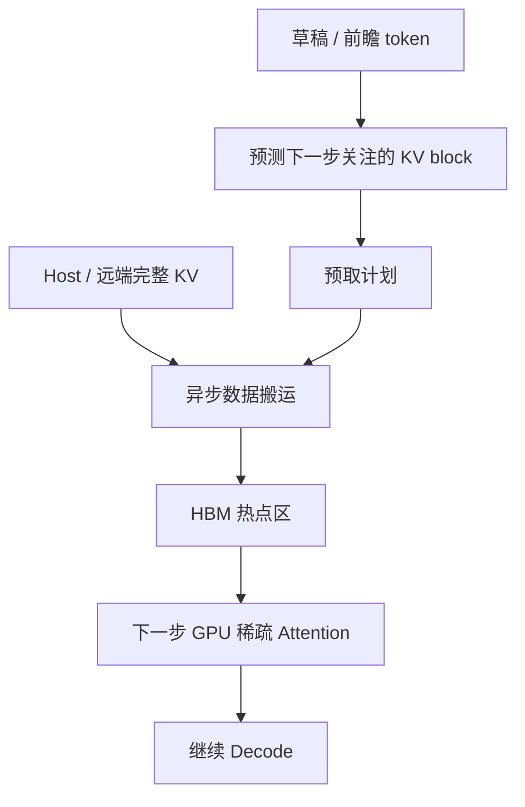
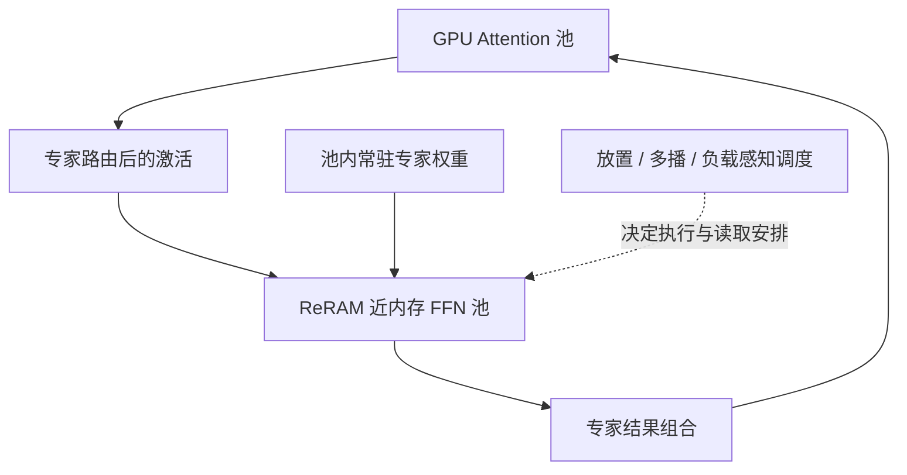
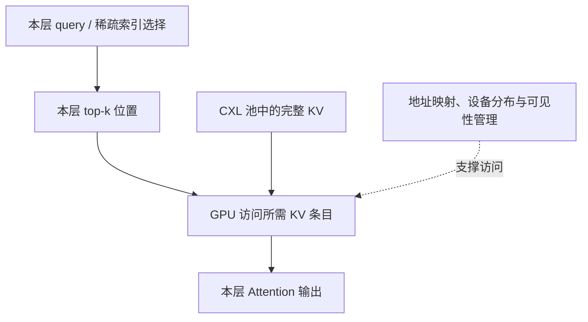

# KV Cache 与 MoE 权重的分层内存学习文档

显存装不下时，“把数据搬出去”只是第一步。真正决定能否加速的是：下一次使用前能否拿到数据，搬运能否被计算覆盖，以及移动的究竟是 KV、专家权重还是中间激活。

本文是第三方资料整理型学习文档，从 OasisKV、ReRAM 专家池和 SAC 三条路线建立比较框架。原文标题的“吞吐翻 10 倍”不能当成三种方案共同实现的结果。

## 0. 阅读基线与范围

| 项目 | 内容 |
| --- | --- |
| 原文标题 | KV Cache 和专家权重一起被赶出 HBM：近内存架构让推理吞吐翻 10 倍 |
| 原文链接 | [HyperAI 文章](https://mp.weixin.qq.com/s/n7pabHwC4LEjTrVKpYy6OQ) |
| 作者 / 机构 | HyperAI |
| 发布时间 | 2026-08-21 |
| 读取时间 | 2026-09-09 |
| 整理范围 | 内存层级、数据访问路径、预取、Attention–FFN 分离与性能证据 |
| 不展开内容 | 产品采购建议、CXL 标准细节、芯片路线图、完整论文复现 |
| 核对方式 | 已读三篇 arXiv 摘要，获取 v1 HTML，并查看关键评测口径；没有运行作者代码或测试硬件 |
| 图片情况 | 原文无正文图片或技术 SVG；本篇用 Mermaid 绘制整理者的逻辑路径，不以自绘图代替论文实验结果 |

| 论文 | 作者标识 | 本次阅读版本 | 关键证据边界 |
| --- | --- | --- | --- |
| [OasisKV: Scaling In-Decode KV Cache Beyond HBM with Lookahead Sparse Prefetching](https://arxiv.org/abs/2608.08097v1) | Can Xiao 等 | v1，2026-08-08 | 基于 vLLM 的系统评测；稀疏近似有质量口径 |
| [MoE Expert Execution in Disaggregated LLM Serving with a High-Bandwidth ReRAM Near-Memory Architecture](https://arxiv.org/abs/2608.13962v1) | Kunming Shao 等 | v1，2026-08-14 | 明确为 measured + modeled 研究；原文以 ReXpert 称呼这条路线 |
| [SAC: Disaggregated KV Cache System for Sparse Attention LLMs with CXL](https://arxiv.org/abs/2606.19746v1) | Ruiyang Ma 等 | v1，2026-06-18 | DeepSeek-V3.2、SGLang 和指定 CXL/RDMA/DRAM 环境的对比 |

### 术语速查

| 术语 | 人话解释 |
| --- | --- |
| HBM | GPU 附近容量有限、带宽很高的显存 |
| Host DRAM | CPU 侧主存；容量、带宽和访问路径与 HBM 不同 |
| CXL pool | 经支持的互连、设备和地址映射组织的内存池 |
| ReRAM near-memory | 把权重放在专用近内存架构中，就近读取和执行 |
| offload | 把对象移到另一存储/计算层级 |
| prefetch | 在真正需要前，提前把对象移到可使用位置 |
| Attention–FFN 分离 | 同一层中的注意力与前馈/专家计算由不同资源池执行 |
| TPOT / TBT | 每输出 token 的平均耗时 / 相邻 token 间隔；需看具体测量定义 |

## 1. 三条路线移动的是三种不同负担

| 路线 | 大对象主要在哪 | 计算主要在哪 | 每步关键数据流 | 主要条件 |
| --- | --- | --- | --- | --- |
| OasisKV | 完整 KV 在更大容量层，热点在 HBM | 目标注意力仍用 GPU 热点 KV | 提前预测并搬运将用到的 KV block | 稀疏近似可接受、预测有用、预取来得及 |
| ReRAM 专家池 | 专家权重常驻专用 FFN 池 | Attention 与 FFN 分池 | 向专家池传激活，读取本地专家权重，再返回结果 | 专用硬件、放置和负载分配匹配 |
| SAC | 完整 KV 放到 CXL 容量池 | GPU 执行稀疏注意力 | 根据真实 top-k 索引按需访问 KV | 支持的数据路径、地址映射、互连和内核集成 |

**整理者归纳：** 三者不能相加为“KV 和权重一起卸载即可十倍”。OasisKV 与 SAC 主要改变 KV 的存放和访问，ReRAM 方案改变专家权重靠近哪种计算资源。Attention–FFN 分离是后者的明确前提，不是前两者必需的共同前提。

HBM 也没有因此消失。GPU 计算仍需要权重、热点 KV、激活或临时工作区，只是不同方案改变其中一部分的驻留方式。

## 2. OasisKV：提前猜下一步会读什么

### 人话版

与其等下一步已经要读 KV 时再去取，不如利用草稿 token 提前观察可能相关的历史块，把它们放进下一步能直接访问的热点区。

**图意解读：** 整理者的逻辑图中，预测路径做选择，传输路径搬字节，GPU 使用就绪热点。图没有承诺一次预测必然正确，也没有把后台选择和同步成本删掉。

### 为什么“草稿已有”不等于预取免费

原文报告在 Qwen3-8B/GSM8K 上预测块与真实查询有较高一致率，但这不是任何模型、任意任务的保证。完整成本包括块评分、地址管理、I/O、流间依赖和热点替换。

整理者用一个预算例子解释：若下一步还有 2 ms 才需要某块，搬运加排队需要 1 ms，就可能被覆盖；若需要 4 ms，关键路径至少还会暴露一部分等待。这只是时间预算示例，不是论文测量。

### 质量与容量必须一起记录

论文摘要报告 2048-token KV 预算下与 full attention 的质量差距在 0.7 点内；推理负载相对 dense vLLM 的 1.69 倍吞吐对应另一组 0.1 点质量差距，多 GPU 长上下文最高 2.1 倍。不要把不同实验点的最好质量和最高速度拼成同一配置。

只保留相关 KV 参与本步注意力属于近似策略。预测 top-k 接近，不等于输出分布严格不变；它与无损前缀复用的证据标准不同。

## 3. ReRAM 专家池：让激活去找权重

### 人话版

MoE 每个 token 只选部分专家，但一个 batch 的所有 token 合起来可能选中很多专家。权重读流量无法无限被更多 token 平摊，热点专家还会让部分资源忙、另一部分空闲。

**图意解读：** 权重的大体量读取发生在专家池内部，跨池仍需要激活与结果通信。近内存提高局部读取能力，不会自动消除路由倾斜、热点排队或池间通信。

### 一个 batch 的专家并集

假设每个 token 选 2 个专家。两个 token 恰好都选同一组，权重能被更好复用；若分别选完全不同的专家，就要访问 4 个专家。增大 batch 不一定按比例提高每个专家的有效批量。

论文用有界核内多播、协同激活感知放置和负载感知获取来处理这个问题。它报告 occupancy 从 0.328 到 0.519，以及等峰值计算能力下 FFN-pool 每 token 延迟约降低 9.5 倍、权重移动能耗降低约 20 倍。

**证据边界：** 摘要明确写 measured + modeled。端到端 TPOT 范围分别来自 Qwen3.5-35B-A3B、Qwen3.5-397B-A17B、GLM-5.2 的特定对照；不能将最高约 10 倍写成已在任意现成生产服务器上测得的吞吐提升。

## 4. SAC：从整段取回变成按需访问

### 人话版

如果稀疏注意力每步只用少量 KV，先把整段历史拉到 Decode 本地再开始可能很浪费。SAC 的目标是在支持的 CXL 内存路径上，围绕真实 top-k 条目进行细粒度读取。

**图意解读：** top-k 的模型语义由稀疏注意力路径决定，CXL 提供的是适配后的访问介质与语义。这个图不能简化为“给任何 GPU 接一个 CXL 设备，就能透明替换 RDMA”。

### 测试条件比标题更重要

本次查看论文 §5 与附录：模型是 AWQ 4-bit DeepSeek-V3.2，平台为 8×H20、2 TB CXL 池，比较 RDMA 池和本地主存；输入 16K–128K、输出 1K。两轮测试分别衡量填充缓存和复用已有前缀，不能把热缓存 TTFT 当成完全冷启动首请求 TTFT。

原文/摘要的 2.1 倍吞吐、9.7 倍更低 TTFT、1.8 倍更低 TBT，属于其给定基线与负载。9.7 倍更低延迟应理解为约原来的 `1/9.7`，不是“降低 970%”。

这里变化同时包含访问介质、软件路径和取数粒度。不能据此断言所有稀疏 RDMA 设计都必然落后，也不能把本地主存上界对照称作完全相同的集群部署。

## 5. 将原文的强结论改成可验证问题

| 原文容易被误读的表述 | 更准确的学习结论 |
| --- | --- |
| 推理不再算力受限，只受内存限制 | 原文研究的是特定 Decode/长上下文/MoE 工作集；Prefill、专家 GEMM 或通信仍可能主导 |
| KV 不再放 HBM | 完整容量层移走后，热点区和工作空间通常仍存在 |
| 所有专家权重每步都要跨卡搬运 | 是否跨卡/跨层取决于权重放置；本地 HBM 到计算单元的读取也不能等同跨节点传输 |
| 三者共同要求 Attention–FFN 分离 | 这是 ReRAM FFN 池的主线；OasisKV、SAC 不以此为共同必要条件 |
| 近内存方案都能在国产集群即插即用 | 必须核对硬件、内存映射、内核、精度和调度支持；本文未验证任何国产芯片适配 |
| 标题“吞吐十倍”适用于全部方案 | 最高倍数涉及模型化研究及特定 TPOT/FFN 延迟；三者指标口径不同 |

原文中的芯片商业化时间和厂商路线图没有作为本篇技术事实沿用；本篇讨论可迁移机制，不做产品状态或可购买性判断。

## 6. 做实验时应该看哪些指标

下面是整理者提出的验证设计，本次未执行。

| 层次 | 需要记录 | 用来区分什么 |
| --- | --- | --- |
| 容量 | HBM 热点、完整 KV、检查点、主存与远端占用 | 是扩大可接纳规模，还是只换了存储位置 |
| I/O | 有效字节、读放大、预取命中、就绪前等待 | 搬得少、搬得早，还是介质更快 |
| 调度 | 活动请求数、专家分布、排队和回撤 | 算力不足、热点倾斜与内存压力 |
| 正确性 | 质量指标、接受率、固定请求输出、版本/布局一致性 | 有损近似与无损搬运 |
| 服务 | TTFT、TPOT/TBT、p95/p99、满足 SLO 的吞吐 | 局部 kernel 收益与最终服务收益 |

先固定模型、精度、输入输出分布、请求到达方式和基线，再比较。尤其不要把更多可接纳并发换来的吞吐，解释为单请求本身也更快。

## 7. 继续阅读

- [KV Cache 容量优化技术地图](<./KV Cache 容量优化技术地图学习文档.md>)：区分改模型表示与改存储层级。
- [Kimi K3 混合注意力缓存与 Mooncake 状态传输](<../model-architecture/Kimi K3 混合注意力缓存与 Mooncake 状态传输学习文档.md>)：先确保搬运的是可恢复状态。
- [SGLang RadixAttention 与 HiCache 技术主线](<../../sglang/kv-cache/SGLang RadixAttention 与 HiCache KV Cache 技术主线学习文档.md>)：从跨请求复用理解到活动请求内稀疏换入。
- [大模型推理全链路优化](<../performance-engineering/大模型推理全链路优化学习文档.md>)：把容量、计算、量化和异构调度放回同一条请求链路。
