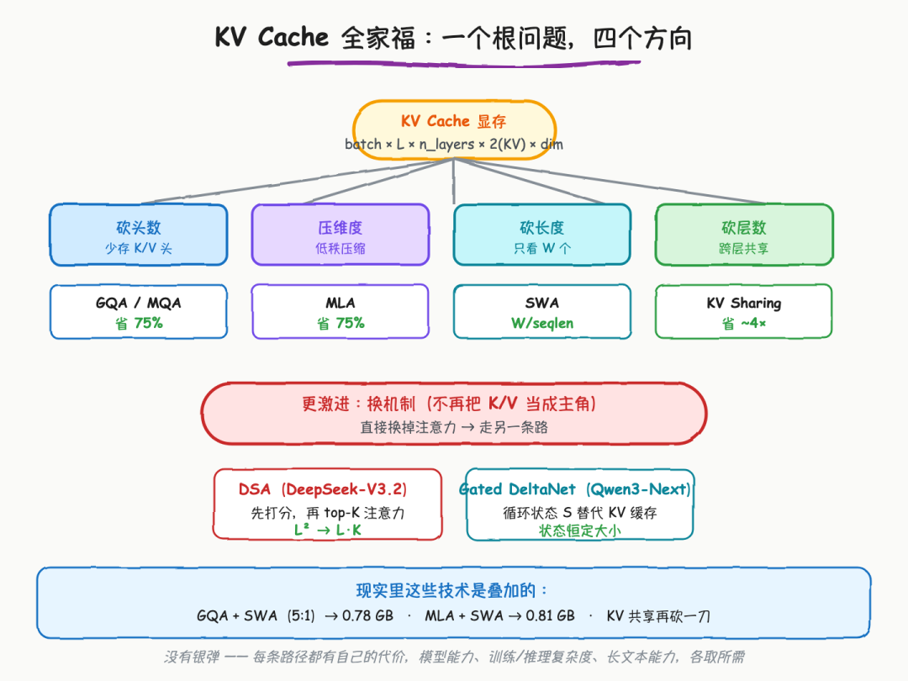
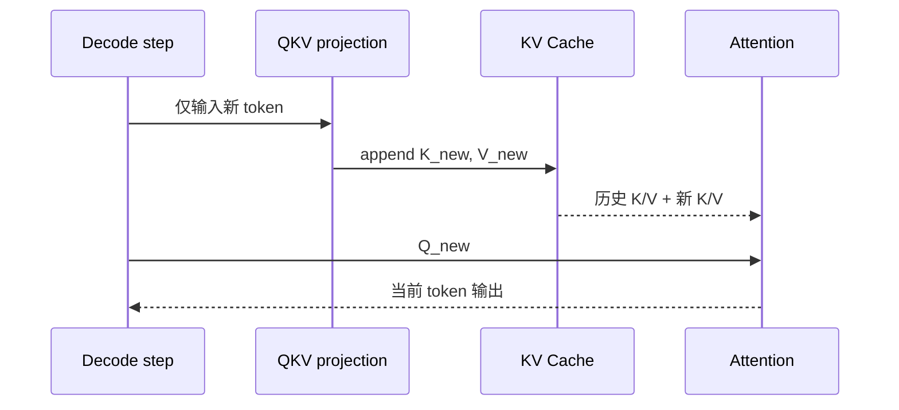
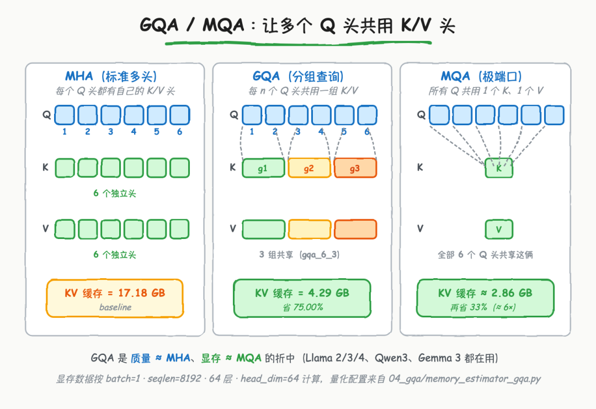
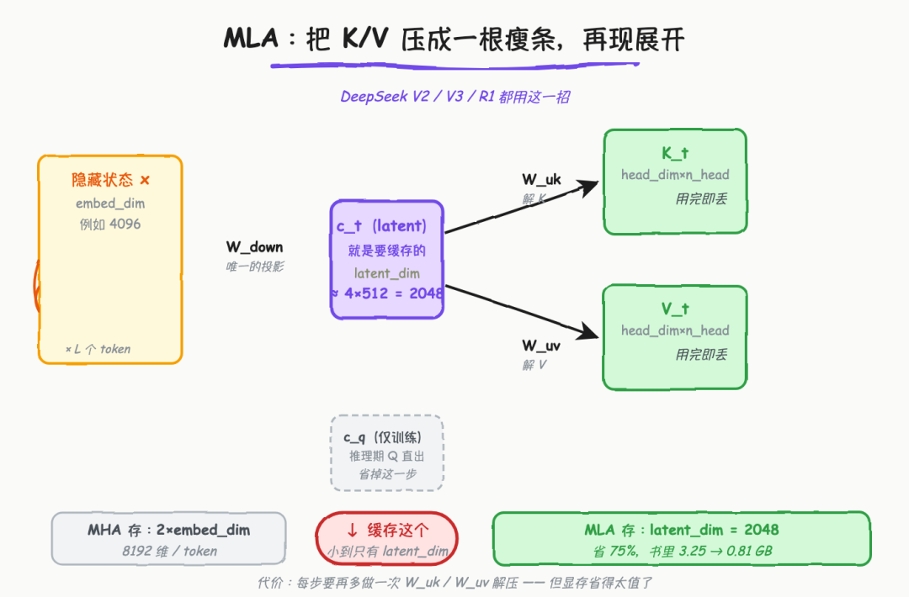
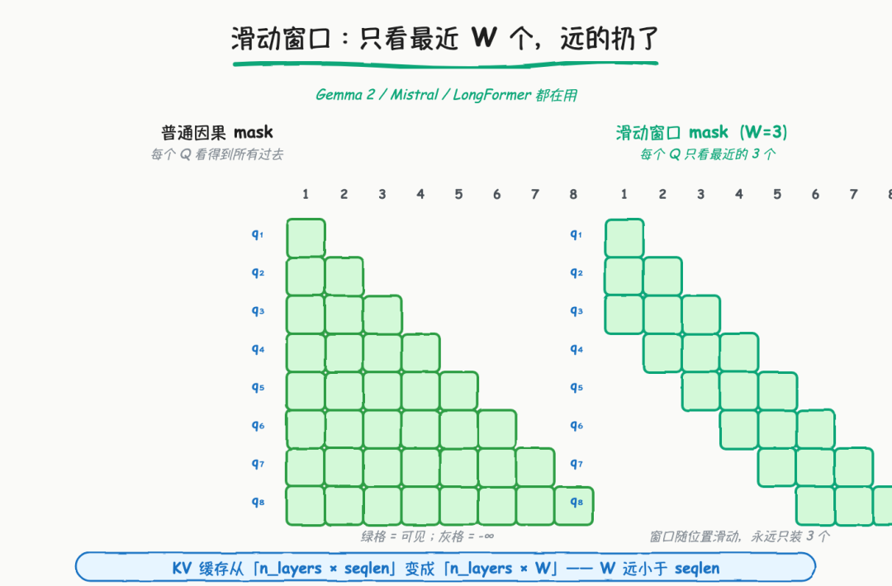
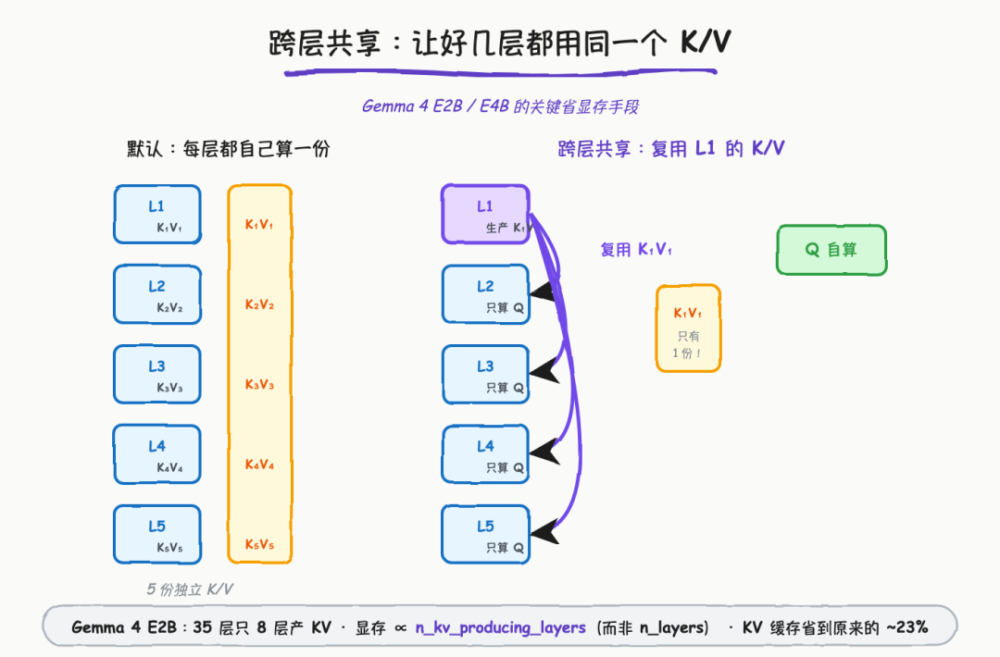
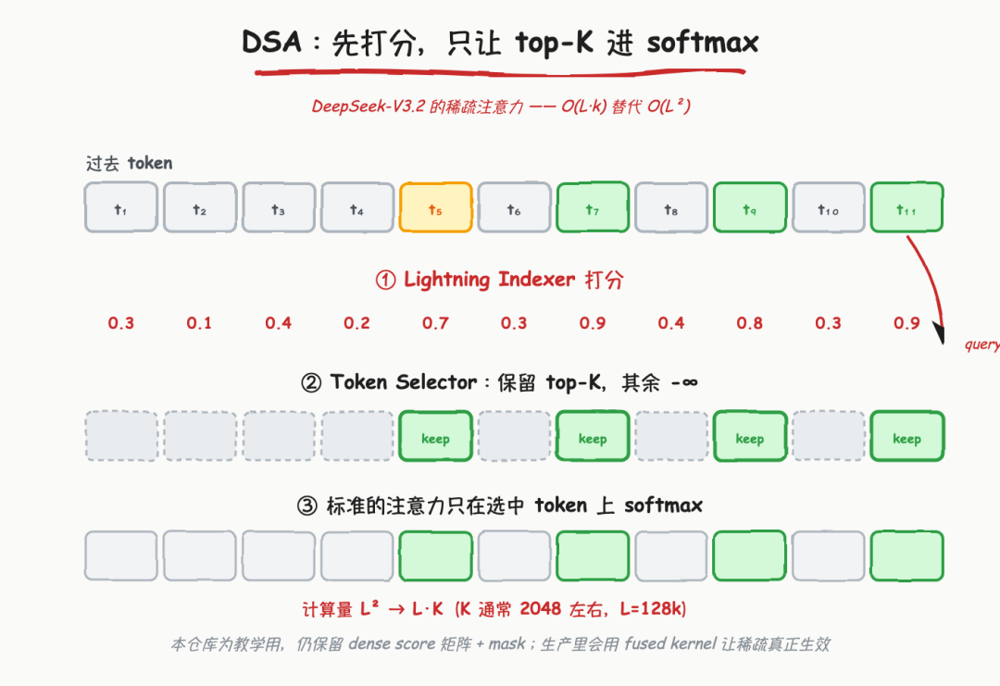
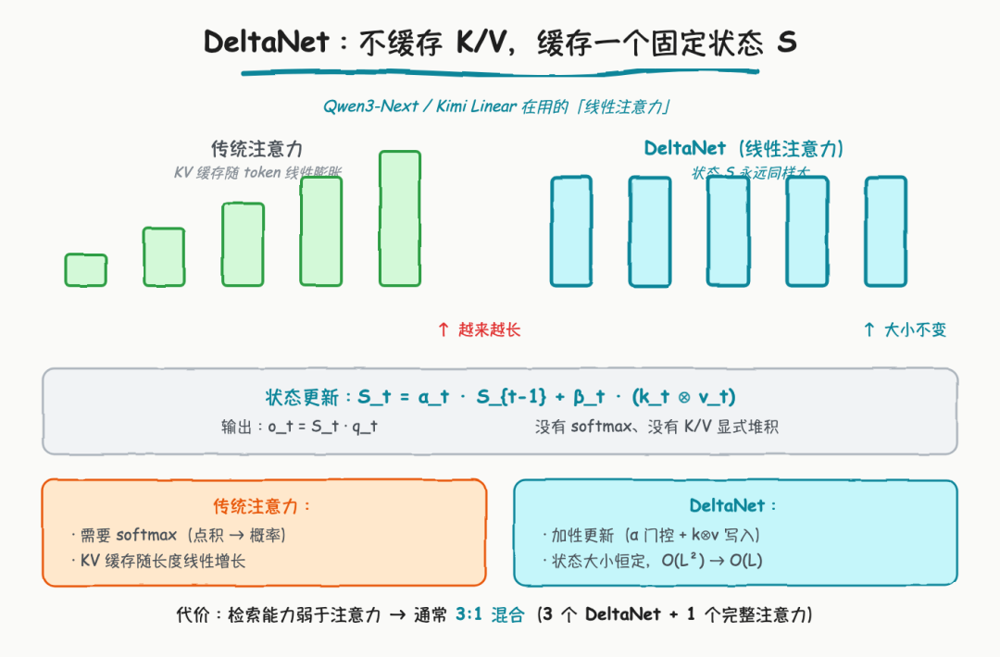
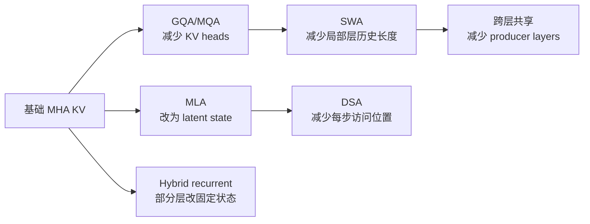

# KV Cache 容量优化技术地图学习文档

本文面向第一次系统比较 KV Cache 容量优化路线的同学。重点不是背六个缩写，而是先找出 KV 容量公式中的维度，再判断每种技术究竟砍了头数、表示维度、历史长度、产 KV 层数，还是直接改变了 Attention 机制。

本文是第三方资料整理型学习资料，不是各模型论文的完整复现或生产 kernel 实现说明。

## 0. 阅读基线与范围

| 项目 | 内容 |
| --- | --- |
| 原文标题 | 《KV Cache 全攻略》 |
| 原文链接 | <https://mp.weixin.qq.com/s/v6YYxCf_N4Q6c7qfD_lZDw> |
| 作者/机构 | 光仔玩AI |
| 发布时间 | 2026-08-18 |
| 读取时间 | 2026-08-25 |
| 资料类型 | 原理图解与教学代码 |
| 整理范围 | 基础 KV Cache、GQA/MQA、MLA、SWA、跨层 KV 共享、DSA、Gated DeltaNet |
| 不展开内容 | PagedAttention 分配、KV 量化、具体模型训练配方、生产 fused kernel |
| 验证边界 | 只基于原文和其引用论文做机制整理；原文代码是教学简化版，本文未运行；模型名称、数字与质量结论不作跨模型外推 |

### 一个重要校正

原文用“KV Cache 让推理从 O(n²) 变成 O(n)”帮助建立直觉。更精确地说：KV Cache 消除了历史 token 的 K/V 投影重算，使这部分累计工作从随生成长度二次增长降为线性；但标准自回归 Attention 的新 query 仍要读取已有 K/V，单步 Attention 随历史长度增长，生成整段序列的 Attention 工作通常仍是 O(n²)。

所以 KV Cache 是“避免重复投影”，不是把标准全注意力整体变成线性复杂度。后文 DSA、SWA、DeltaNet 才进一步改变“每步看多少历史”的计算结构。

### 术语速查

| 术语 | 人话解释 | 主要缩减维度 |
| --- | --- | --- |
| MHA | 每个 Query head 都有独立 K/V head | 基线 |
| GQA/MQA | 多个或全部 Q heads 共用较少 K/V heads | `n_kv_heads` |
| MLA | 缓存低维 latent，而不是完整多头 K/V 表示 | 每 token 状态宽度 |
| SWA | 每层只保留最近窗口中的 KV | 有效历史长度 |
| Cross-layer KV Sharing | 多层共享少数 producer layer 的 K/V | 产 KV 层数 |
| DSA | 先选 Top-K 历史位置，再做稀疏 Attention | 每步参与计算的位置数 |
| Gated DeltaNet | 用固定大小 recurrent state 代替显式全历史 KV | 改变模型机制 |

## 1. 先看公式：你到底在砍哪一个维度

忽略 page 对齐、padding 和额外 metadata 时，标准 KV Cache 的近似容量为：

```text
bytes
≈ batch
× live_tokens
× n_layers
× n_kv_heads
× head_dim
× 2              # K 和 V
× bytes_per_elem
```



**图意解读：** 原图把技术分成砍头数、表示维度、历史长度、产 KV 层数，以及改变机制两组。它很适合做路线地图，但图中的节省比例来自特定示例参数，不能视为所有模型的固定比例；DSA 主要降低注意力计算和活跃访问量，DeltaNet 则是架构替换，不应与无损缓存压缩混为一谈。

### 技术定位表

| 路线 | 直接改变 | 是否需要训练时采用 | 主要代价 |
| --- | --- | --- | --- |
| GQA/MQA | K/V head 数 | 通常需要 | 共享过强可能损失质量 |
| MLA | 缓存表示 | 需要模型架构支持 | 额外投影、RoPE 与 kernel 设计更复杂 |
| SWA | 每层可见历史 | 需要模型架构支持 | 窗口外信息只能经全局层或状态间接传递 |
| 跨层共享 | 产 K/V 的层数 | 需要 | 层表达能力与路由更受约束 |
| DSA | 每个 query 实际访问位置 | 需要 Indexer/Selector | Top-K 正确性与选择开销 |
| DeltaNet | Attention 状态机 | 需要 | 精确检索能力弱于完整 Attention，常与全注意力混合 |
| KV 量化 | 每个元素字节数 | 可作为推理优化 | 量化误差与 kernel 支持 |
| PagedAttention | 物理分配方式 | 不改变模型 | 不直接减少理论 KV 元素数 |

## 2. KV Cache 的基本收益和真实代价

### 人话版

自回归 Decode 每步只新增一个 token。历史 token 的 K/V 一旦算好，在同一请求的后续步骤中不会变化，因此应保存并复用。



收益是历史 K/V 投影不再重算；代价是缓存随 live tokens、并发和层数线性增长。`torch.cat` 形式的教学实现会反复分配和复制，在生产引擎中通常使用预分配 page/block pool 与位置表，不能把教学代码直接当成 serving 实现。

### 生命周期边界

KV Cache 不只是一块 tensor，还要回答：

- 请求进入时分配哪些 slots；
- Prefill 写多少，Decode 每步追加多少；
- 请求被抢占时保留、转移还是释放；
- 请求结束后是否进入 prefix cache；
- 多租户、LoRA 和多模态输入如何进入缓存身份。

这也是“容量技术”和“缓存管理技术”必须分开的原因：GQA 决定每个 token 需要多少 K/V，PagedAttention 决定这些 K/V 如何分配，Prefix Cache 决定不同请求能否共享。

## 3. GQA/MQA：减少 K/V 头数



**图意解读：** MHA 为每个 Q head 配独立 K/V，GQA 让一组 Q heads 共享一个 K/V head，MQA 让所有 Q heads 共享一套 K/V。图中的 17.18 GB、4.29 GB、2.86 GB 是原文示例配置下的估算，实际值取决于层数、序列长度、KV dtype 和 head 维度。

### 机制拆解

如果 Query heads 为 64，KV heads 从 64 降到 8，理论 KV 头维度缩小 8 倍：

```text
MHA: 64 Q heads -> 64 K heads + 64 V heads
GQA: 64 Q heads ->  8 K heads +  8 V heads
MQA: 64 Q heads ->  1 K head  +  1 V head
```

Attention 计算时会按组把 K/V 视图提供给多个 Q heads。生产 kernel 通常不会先物理复制成 64 份；教学代码里的 `repeat_interleave` 只用于表达语义。

### 适用边界

- 它直接减少 KV 容量和读取带宽，是当前最常见路线之一。
- `n_heads` 必须能按模型定义映射到 `n_kv_heads`。
- 从 MHA 检查点直接改成 GQA 不是无损推理开关，通常涉及训练或结构转换。
- MQA 共享最激进，容量最好，但质量与 kernel 行为必须按模型验证。

## 4. MLA：缓存低维 latent



**图意解读：** 原图用“先压成 latent、使用时再展开”解释 MLA。这个图是教学抽象：真实 DeepSeek MLA 还涉及 decoupled RoPE、矩阵吸收和专用 kernel，优化实现不一定显式重建一份完整多头 K/V 再做 Attention。

### 人话版

GQA 是“少存几套头”，MLA 是“换一种更紧凑的状态表示”。每个 token 保存低维 latent，Attention 路径再通过投影或矩阵吸收使用它。

```text
hidden state
   -> down projection
compact KV latent  <- 缓存这个
   -> model-specific projections / absorbed weights
attention result
```

### 为什么不能只看 latent 维度

MLA 的真实成本还包括：

- 与位置编码相关的额外状态；
- latent 到 key/value 使用路径的投影；
- Prefill 和 Decode 不同 kernel；
- TP/CP 下的分片与通信；
- 模型训练时是否围绕该瓶颈设计。

所以“latent_dim 是原维度 1/4”不自动等于端到端显存、带宽和延迟都精确缩小 4 倍。

## 5. SWA：减少每层保留的历史长度



**图意解读：** 左侧因果 Attention 的可见区域随序列增长，右侧每个 query 只看最近 `W` 个 token。若所有层都只使用 SWA，窗口外信息不能被直接检索；因此很多模型采用 SWA 与全局 Attention 的交错结构。

### 机制拆解

如果一层只需要最近 `W` 个 token，其该层活跃 KV 规模从：

```text
O(sequence_length)
```

变成：

```text
O(window_size)
```

当 `sequence_length >> window_size` 时，容量和 Attention 工作量都显著下降。但这里有两个不同问题：

1. 模型语义上，旧 token 是否真的不再需要；
2. 引擎实现上，旧 slot 是否能回收、是否还要保留树节点或外层 checkpoint。

Hybrid model 可能同时有 FULL、SWA 和 recurrent state，它们的可复用边界并不一致。相关系统设计见 [SGLang Unified Radix Cache 学习文档](../../sglang/kv-cache/SGLang%20Unified%20Radix%20Cache%20学习文档.md)。

## 6. 跨层 KV 共享：减少产 KV 的层数



**图意解读：** 原图用一个 producer layer 和多个 consumer layers 展示跨层共享。真实模型可能按 layer group 分配多个 producer，而不是所有层全共享一套 K/V；图中的模型与比例属于原文示例，需以目标模型配置为准。

### 机制拆解

传统每层都产生独立 K/V：

```text
layer 0 -> KV0
layer 1 -> KV1
layer 2 -> KV2
...
```

跨层共享改为：

```text
producer layer -> shared KV
consumer layers -> 自己算 Q，复用该组 shared KV
```

容量近似与 `n_kv_producing_layers` 成正比，而不是与全部 `n_layers` 成正比。它比 GQA 更深入地改变模型容量分配，不能靠运行时 flag 给已有普通 Transformer 无损开启。

## 7. DSA：先选位置，再做稀疏 Attention



**图意解读：** Indexer 为历史位置打分，Selector 保留 Top-K，再在选中位置上执行 Attention。该图主要表达计算稀疏化，不表示未选 KV 一定从所有存储层永久删除；缓存容量、GPU 驻留量和单步访问量是三个不同指标。

### 为什么它不是普通“KV 压缩”

DSA 主要把全历史 Attention 从概念上的 `L × L` 交互缩成 `L × K`。但是为了未来 query 仍能选到旧位置，系统可能仍要在 Host 或分层缓存中保存相关状态。

需要分别问：

- 完整历史 KV 是否仍存在？
- GPU 上只驻留 Top-K 还是有更大的热点池？
- Indexer 的打分状态保存在何处？
- Top-K 选择开销是否吞掉稀疏收益？
- Prefill 和 Decode 是否使用同一稀疏路径？

## 8. Gated DeltaNet：用固定状态替代显式全历史 KV



**图意解读：** 左侧全注意力保存随序列增长的 KV，右侧线性/recurrent 路径维护固定大小状态。它表达“状态不随上下文长度线性增长”的核心，但真实 Gated DeltaNet 的更新、归一化、卷积和门控比图中公式更复杂。

### 人话版

DeltaNet 不再显式保存每个历史 token 的 K/V，而是把历史压入固定大小状态 `S_t`：

```text
S_t = gated_update(S_{t-1}, k_t, v_t)
o_t = read(S_t, q_t)
```

这从根上改变了状态规模，但也改变了信息检索方式。完整 Attention 可以直接对任意历史位置做内容寻址；固定状态必须把历史不断压缩，精确检索能力可能下降。因此现代混合模型常让 recurrent/linear layers 承担长程状态，再用周期性的 full attention layers 做精确检索兜底。

## 9. 怎么组合，而不是怎么选唯一赢家

这些技术作用于不同维度，经常可以叠加：



组合时要同时检查：

| 维度 | 问题 |
| --- | --- |
| 模型质量 | 训练是否显式适配共享、窗口或 recurrent 路径 |
| 容量 | 理论元素数、page 对齐和运行时预留分别是多少 |
| 带宽 | Decode 每步实际从 HBM/Host 读多少状态 |
| 计算 | Attention、Indexer、投影和恢复分别耗时多少 |
| 生命周期 | Prefix Cache、抢占、PD 和外部 KV 是否理解这些状态 |
| Kernel | 目标 GPU 是否有对应高效实现 |

## 10. 小白排障地图

| 现象 | 优先检查 |
| --- | --- |
| 开了 KV Cache 仍随长度变慢 | Attention 仍需读取增长的历史，不是历史 K/V 投影又重算 |
| 理论节省 8 倍，实际显存只降一部分 | 权重、激活、graph、page padding 和其他 pool 仍占显存 |
| GQA 教学代码显存反而变大 | 是否用 `repeat_interleave` 物理复制 K/V，而不是 kernel 视图 |
| SWA 质量明显下降 | 全局层比例、窗口大小、训练设置是否匹配 |
| DSA Top-K kernel 很快但端到端不快 | Indexer、数据搬运、稀疏 KV 驻留和其他层占比 |
| DeltaNet 长文档精确检索差 | 固定状态压缩的能力边界、full attention 兜底比例 |

## 11. 一句话总结

KV Cache 容量优化没有一颗银弹：GQA/MQA 砍头数，MLA 压表示，SWA 砍历史长度，跨层共享砍产 KV 层数，DSA 砍每步访问位置，DeltaNet 则替换状态机制；只有先明确自己受容量、带宽、计算还是质量约束，才能读懂它们为什么常被组合使用。

## 12. 参考与延伸

- 原文：<https://mp.weixin.qq.com/s/v6YYxCf_N4Q6c7qfD_lZDw>
- GQA：<https://arxiv.org/abs/2305.13245>
- DeepSeek-V2 / MLA：<https://arxiv.org/abs/2405.04434>
- Gated DeltaNet：<https://arxiv.org/abs/2412.06464>
- [LLM 推理系统心智模型与 SGLang、vLLM 选型边界学习文档](../foundations/LLM%20推理系统心智模型与%20SGLang、vLLM%20选型边界学习文档.md)
- [vLLM V1 KV Cache 管理全生命周期源码学习文档](../../vllm/kv-cache/vLLM%20V1%20KV%20Cache%20管理全生命周期源码学习文档.md)
