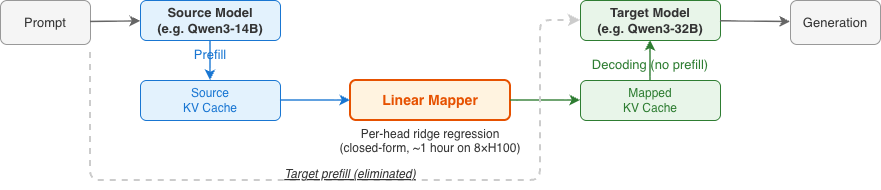
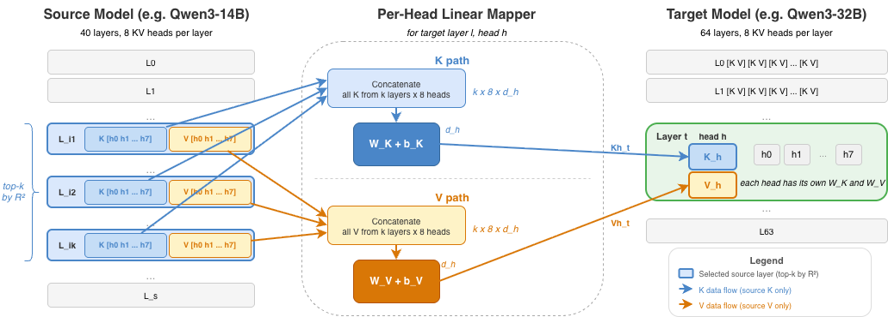
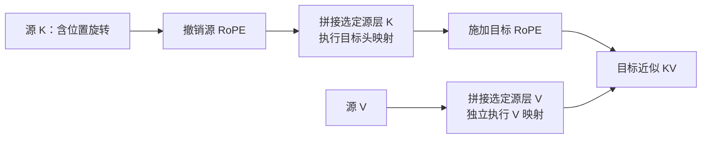
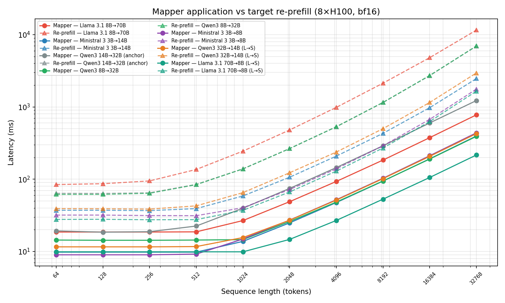

# 跨模型 KV Cache 转换与 Prefill 复用学习文档

同一段对话从小模型切到大模型，为什么还要让大模型重新读一遍？因为 KV Cache 是模型计算后的内部状态，带有模型权重、层、注意力头和位置编码的语义。把字节搬过去很容易，让目标模型正确理解这些字节才是难点。

本文属于**第三方资料整理型学习文档**。主线是“如何把源模型的历史状态转换成目标模型可使用的近似状态”，并拆清拟合、运行、质量与端到端成本。没有复现论文训练、GPU 推理或服务部署。

## 0. 阅读基线与范围

| 项目 | 内容 |
| --- | --- |
| 原文标题 | NVIDIA 论文解读：KV Cache 跨模型转换 |
| 原文链接 | [Realtime AI Lab 原文](https://mp.weixin.qq.com/s/YTrcAvoBxp7eNCLODmOzWQ?scene=1&click_id=1) |
| 作者 / 机构 | Realtime AI Lab；论文作者 Taekyung Heo 等，NVIDIA |
| 发布时间 / 读取时间 | 原文 2026-09-09 22:02，Asia/Shanghai；读取 2026-09-14 |
| 论文基线 | [Cross-Model KV Cache Transfer in LLM Families: A Closed-Form Linear Mapping for Prefill Reuse](https://arxiv.org/html/2608.03893v1)，v1，2026-08-04 |
| 核对范围 | 论文 §2–4、§5 与附录 C、D、F、G、H；模型条件、映射公式和指标口径 |
| 不展开 | 自行训练 mapper、引擎插件实现、跨家族与混合注意力适配 |
| 图片 | 原文没有正文位图、技术 SVG 或背景图，机制主要由 HTML 文本排版表达；补充论文图 1、3、9，见[图片来源](../../images/cross-model-kv/SOURCES.md) |
| 查重 | 原文链接、题名、论文编号未命中已有资料；仓内 CacheBridge 条目属于另一篇论文，不视为本网页已分析 |

后文“论文结果”只指上述版本的作者报告；公式例子、接入检查和排障路线是整理者的分析。

| 术语 | 人话解释 | 易混点 |
| --- | --- | --- |
| source / target | 已经算过上下文的模型 / 接下来负责生成的模型 | 不是同一模型的 P、D 两个实例 |
| mapper | 把一套内部表示近似转换成另一套表示的算子 | 不是传输协议或字节格式转换器 |
| matched-KV | 两边 KV 头数与每头维度匹配 | 仍不意味着 KV 数值相同 |
| ridge regression | 加约束的线性拟合，避免过度依赖某些特征 | 无梯度训练也需要校准样本 |
| RoPE | 把 token 位置编码进 Q、K 的旋转 | V 不走同样的旋转路径 |
| retention | 转换后任务得分相对目标模型原得分的比例 | 不表示逐 token 等价或所有能力保留 |

## 1. 先分清三种“复用”

| 复用方式 | 保持不变的语义 | 主要工作 | 质量要求 |
| --- | --- | --- | --- |
| 同模型前缀缓存 | 模型版本、前缀、位置等匹配 | 找到已有状态并引用 | 通常以正确性等价为目标 |
| 同模型跨 P/D 传输 | 相同模型状态；物理分片可不同 | 地址映射、搬运和就绪通知 | 字节 / 数值及状态完整性 |
| 本文跨模型转换 | 输入上下文相同，模型改变 | 预测目标内部状态 | 必须重新评估任务质量 |



**图意解读：** 源模型先产生缓存，mapper 生成目标缓存，之后目标模型 Decode。图的关键是“改变表示空间”，不承诺传输免费，也不表示目标输出与自己 Prefill 后完全一致。

**小例子：** 同一段 8K 对话在模型 A 上积累了历史 KV，现在将回答交给模型 B。直接把 A 的缓存指针塞进 B，相当于拿另一套坐标系中的数值当作本机坐标：即使张量形状合法，语义也可能错。常规回退是 B 重做 Prefill；本文研究的是能否用一个较便宜的转换来替代这一步。

## 2. 离线阶段：先学会如何转换

### 2.1 为什么不能直接把第 10 层映到第 10 层

深浅不同的模型在相同层号上，已经完成的特征加工量不同。论文按目标层选择多个有预测价值的源层，再拼接这些层的特征。这里的 top-k 选择单位是**源层**，不是 token，也不是只保留 k 个 KV head。

对某目标层、某目标头，设校准样本数为 N，选 k 个源层，每个源层有 Hs 个 KV 头、每头维度 ds，则可以把输入看成：

```text
X: [N, k × Hs × ds]
W: [k × Hs × ds, dt]
b: [dt]
预测目标某头: Y_hat = X W + b
```

每个目标头输出 dt 维；K 与 V 分别拟合。多层拼接增加表达能力，也会增大 mapper 的参数、读带宽和矩阵乘法成本，因此 k 不应越大越好。

### 2.2 “闭式解”省掉了什么

去中心化后的 ridge 目标为：

```text
min_W ||XW - Y||² + λ ||W||²
W* = (XᵀX + λI)⁻¹ XᵀY
```

这是一种数学写法，实现时可解线性方程组，无需显式求逆。它省掉迭代反向传播的训练流程，没有省掉源、目标模型生成配对 KV、选层和求解的成本。论文使用 FineWeb-Edu 校准数据；“training-free”应读成“不使用梯度训练”，不能写成零数据、零计算。

**整理者例子：** 若把 mapper 类比为两种地图的坐标变换，校准数据就是已知对应关系的地标。少量地标能拟合，不代表离开这些地标的分布后仍保持精度。代码、数学、多语言与长历史需要独立的验证样本。

### 2.3 RoPE：先还原内容坐标，再加目标位置



**图意解读：** 图中源层选择和特征拼接决定“使用哪些信息”；独立 K/V 映射决定“怎样预测”。该原图主要展开拼接与线性映射，下面的 Mermaid 再补充 RoPE 处理顺序。这些是表示转换步骤，不涉及跨节点 QP、MR 或网络调度。



**图意解读：** 整理者把 K 和 V 分成两条路径，避免把“去 RoPE”误套到所有张量。位置必须与目标请求实际的 position、RoPE 配置相符，不能把短校准长度误认为目标模型支持任意长上下文。

## 3. 在线阶段：从缓存到可执行请求

可以用下面的逻辑步骤理解一次交接；这是接入设计，不是论文已公开的服务端实现：

1. 确认源缓存覆盖的确切 token 范围，记录源 / 目标模型 revision、位置与 mapper 版本。
2. 保留源缓存引用，防止转换正在读取时被淘汰或被下一请求覆盖。
3. 按目标层和头转换 K、V，生成与目标引擎布局一致的缓冲。
4. 完成设备 / 进程间搬运及目标缓存安装，建立 GPU 消费依赖。
5. 目标模型开始生成；失败路径根据状态选择清理并重新 Prefill。

**控制权边界：** mapper 只产生数值。调度器决定何时切模型、是否允许近似质量损失；缓存管理器持有物理块；传输后端搬运字节；目标运行时决定何时可以执行。拥有其中一个能力不意味着拥有其余生命周期。

切换时还要明确下一步 logits 如何取得、已处理 token 与下一输入 token 的边界。KV 仅覆盖历史状态，不能凭“历史 KV 已安装”就假定所有请求执行元数据也已恢复。

## 4. 质量指标：拟合得像，未必回答得对

### 4.1 R² 与任务质量回答的是不同问题

R² 衡量预测 KV 对目标 KV 方差的解释程度；下游任务分数衡量最终回答。Attention 还取决于 Query 与 Key 的相对方向：某些误差虽然小，却可能落在非常敏感的方向上。

因此验收不能只看重建误差。应同时检查目标任务得分、长上下文行为、多次切换、推理稳定性与失败分布。

### 4.2 如何读 retention

论文六组 matched-KV、同家族、全注意力模型对中，有四组的五任务平均 retention 约为 73%–98%，另两组明显下降；非线性 MLP 对失败组合的 HellaSwag 有改善，但不能据此宣称其他任务也全部恢复。[论文 §4 与附录 F](https://arxiv.org/html/2608.03893v1#S4)

**计算例子，非实验结果：** 原始目标得分 80%，转换后 76%，retention 为 95%。它表示该指标相对下降 5%，绝对下降 4 个百分点；不表示“95% 的输出 token 相同”。若随机猜测本来就有较高得分，普通 retention 还可能掩盖实际退化，需同时看去除 chance floor 后的指标。

### 4.3 未覆盖条件不能靠形状推断

| 条件 | 应如何判断 |
| --- | --- |
| 同家族、KV 头数和维度匹配 | 属于论文实验范围，但仍需逐模型对评估 |
| 跨家族或 tokenizer 不一致 | 不能直接沿用相同 token 对齐假设 |
| KV 维度不匹配 | 公式可表达不同维度，不代表已有实验保证 |
| 滑窗、线性注意力、混合状态模型 | 状态类型和恢复边界改变，不能只转换 full-attention KV |
| 更换量化 / RoPE / 模型 revision | 必须重新检查 mapper 的适用身份与数值行为 |

## 5. 性能：25 倍发生在哪一段



**图意解读：** 横轴是序列长度，实线和虚线对比两种生成目标状态的方式；它不是整段会话的端到端加速图。论文使用单台 8×H100、NVLink、BF16 和 synthetic inputs，Qwen3 14B→32B 在 32K 点约为 278 ms 对 6,975 ms。跨 GPU 的源缓存移动计入其测量，但把映射缓存发给目标进程的完整服务成本未测。[论文 §4.7、附录 G](https://arxiv.org/html/2608.03893v1#A7)

整理者把服务切换成本拆为：

```text
常规切换 = 目标排队 + 目标重做 Prefill + 执行准备
转换切换 = 源状态准备 + mapper + 搬运与安装 + 目标排队 + 执行准备
```

两条路径还都要支付后续 Decode。比较时不要重复加计 mapper 基准已包含的跨 GPU 移动，也不要漏掉未包含的跨进程传输。

**Amdahl 例子，非论文结果：** 原请求总耗时 10 秒，其中可替换的目标 Prefill 占 4 秒。如果这 4 秒缩短 20 倍，而其他部分保持 6 秒，整体为 6.2 秒，只快约 1.61 倍；新增交接开销会继续压低收益。

## 6. 排障与最小验收路线

| 现象 | 先查什么 | 对应边界 |
| --- | --- | --- |
| 输出质量明显下降，张量形状正常 | 模型对、校准域、RoPE、位置对齐 | 数值语义 |
| 短上下文好，长上下文坏 | 位置处理、目标长度支持、长上下文质量 | 外推范围 |
| mapper 很快，TTFT 没改善 | 排队、转换前准备、目标安装与传输 | 微基准与服务成本 |
| 偶发错误且随并发增加 | 缓存引用、异步转换结束、槽位复用 | 生命周期 |
| 切换多轮后逐渐退化 | 多轮误差、交接方向、选层配置 | 单次与累积效果 |

建议先在固定目标 revision 上建立原生 Prefill 对照，再测转换质量和完整交接时延。保留请求长度、校准数据、k、位置配置、dtype、硬件拓扑和错误比例。本文仅给验证设计，没有执行这些实验。

## 7. 自测与延伸

- **同模型 P/D 传输需要 ridge mapper 吗？** 通常不需要。它解决地址与布局兼容，本文解决模型表示不同。
- **R² 高就能替代下游任务评测吗？** 不能。Attention 对误差方向敏感。
- **闭式解代表部署时不需要额外显存吗？** 不能这样推断。mapper 参数、中间拼接与目标 KV 都有资源需求。
- **论文加速能直接用于跨机房部署吗？** 不能。需要重新计算传输和状态安装成本。

继续阅读：[KV Cache 与推理调度协同优化](<../performance-engineering/KV Cache 与推理调度协同优化学习文档.md>)、[多轮 Agent 的 PD 路由与跨数据中心 Prefill](<../distributed-serving/多轮 Agent 的 PD 路由与跨数据中心 Prefill 学习文档.md>)、[P/D 分离的 RDMA、IB 与 GPU 可见性](<../distributed-serving/P-D 分离的 RDMA、IB 与 GPU 可见性学习文档.md>)。

**一句话总结：** 跨模型 KV 转换用较便宜的近似表示映射替代目标重新 Prefill，成立条件必须同时覆盖模型兼容、任务质量、完整交接成本和状态生命周期。
