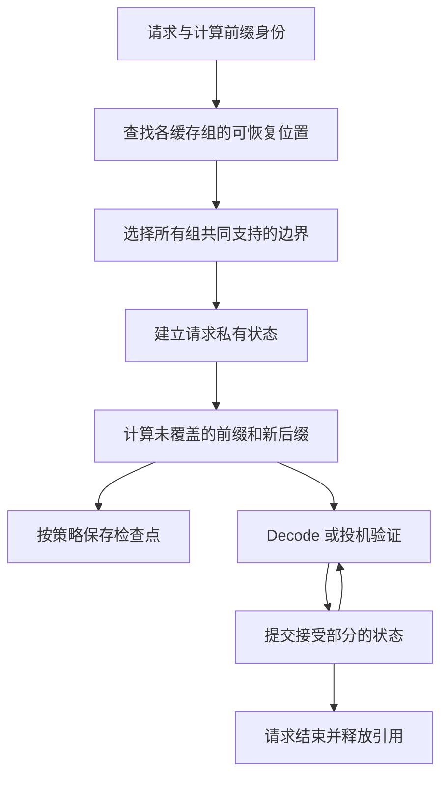
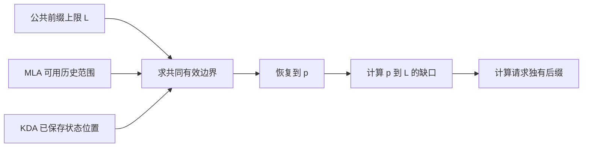
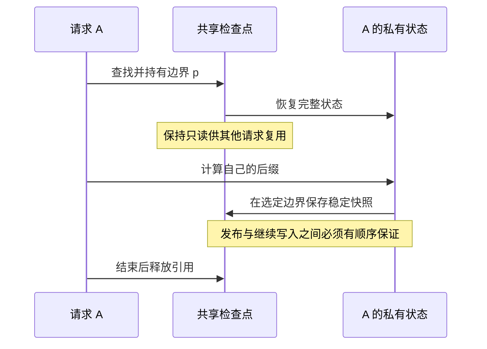
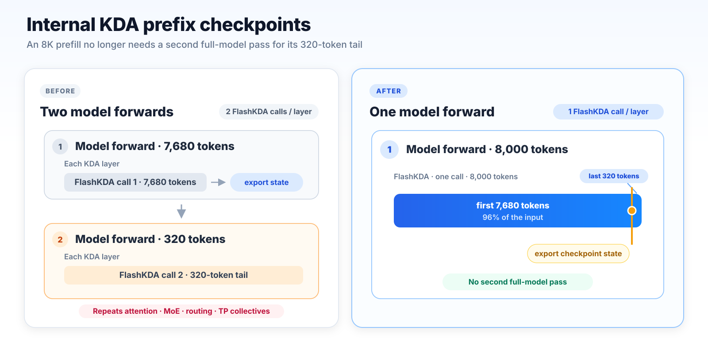
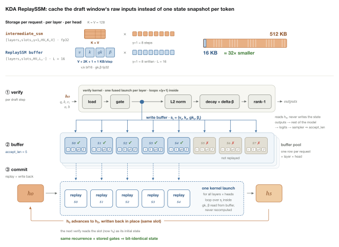
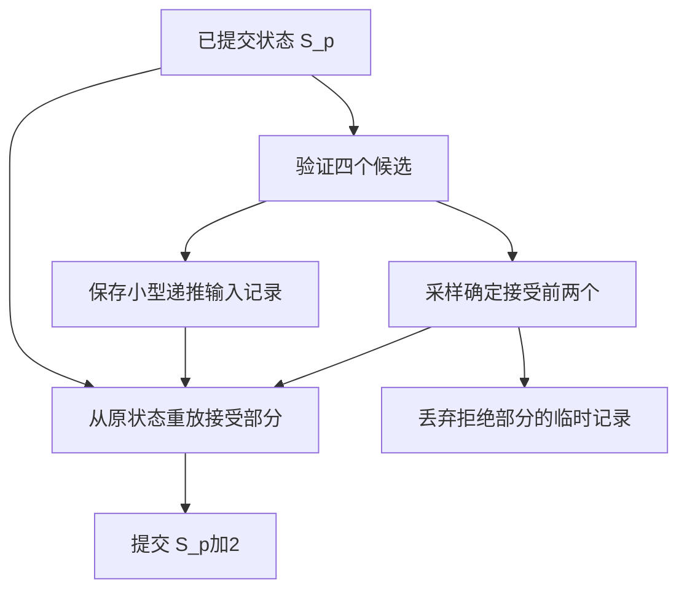

# KDA Cache 检查点、前缀复用与投机回滚学习文档

本文是**第三方资料整理型学习资料**，面向第一次接触线性注意力缓存的读者。主线是：KDA 的一份状态代表哪个前缀，怎样让多个请求安全复用它，以及投机验证结束后怎样只提交被接受的部分。

本文基于《图解KDA Cache》，并核对其引用的 vLLM、SGLang 与 ReplaySSM 作者资料；没有进行引擎源码逐行审计、GPU 实验或性能复现。下文的状态集合、伪代码和检查表是整理者建立的解释模型，不是某个引擎的 API 或调度实现。

## 0. 阅读基线与范围

| 项目 | 内容 |
| --- | --- |
| 原文标题 | 图解KDA Cache |
| 原文链接 | [微信公众号原文](https://mp.weixin.qq.com/s/baxG8LbBmuLLhpGrO1jusA) |
| 作者 | franky1011 |
| 发布时间 | 2026-09-16 14:27:21，Asia/Shanghai；由网页时间字段换算 |
| 读取时间 | 2026-09-17 |
| 资料类型 | 技术文章及其引用的一手项目博客 |
| 整理范围 | recurrent state、卷积状态、合法恢复边界、检查点所有权、internal checkpoint、投机状态提交 |
| 不展开内容 | KDA 算法完整推导、MoE 内核、DSpark 训练、完整 PD 传输协议 |
| 验证边界 | 已读取完整原文与五篇一手网页；未复现速度、容量或数值等价结果；技术报告仅保留为延伸入口 |
| 图片处理 | 原文有 38 个文本排版块；38 个 SVG 均为相同的三圆点装饰，正文无技术位图。本文用 Mermaid 重新组织机制，并保存两张一手技术原图 |

**与仓内资料的关系：** [Kimi K3 混合注意力缓存与 Mooncake 状态传输](<./Kimi K3 混合注意力缓存与 Mooncake 状态传输学习文档.md>)覆盖三家引擎的缓存与传输设计；本文深入其中的恢复和回滚语义，补充内部检查点及性能归因边界，不把同一篇文章重复入库。

### 术语速查

| 术语 | 人话解释 | 不能混淆的对象 |
| --- | --- | --- |
| KDA | Kimi Delta Attention；用递推状态吸收历史信息的注意力机制 | 不等同于“没有历史依赖” |
| recurrent state | 当前递推矩阵，是历史处理后的状态 | 不是每个 token 都保留一份的 KV 列表 |
| convolution state | 短卷积继续计算所需的最近输入窗口 | 不可只恢复矩阵而忽略它 |
| checkpoint | 某一前缀边界可恢复的状态记录 | 不一定覆盖所有 token 位置 |
| working state | 当前请求私有、可继续更新的状态 | 不可直接拿共享缓存原地写入 |
| prefix identity | 判断是否同一计算前缀的身份信息 | 文本相似不代表 token、模型与计算上下文一致 |
| COW | copy-on-write；共享状态变成可写状态前先建立私有副本 | 不是每一步都复制整份状态 |
| verify / commit | 计算候选的验证结果 / 将被接受的前缀写入持久状态 | 计算过的候选不一定最终被接受 |
| ReplaySSM | 用较小的递推输入记录重建所需状态的一类方法 | 不是重新执行整个 Transformer |
| TTFT | time to first token，首 token 延迟 | 包括排队和执行，不能等同于单个 kernel 时间 |

## 1. 先建立整体地图：状态是“算到了哪里”

### 人话版

普通全注意力缓存像按页保存的流水账：第 1 到第 N 个 token 的 K/V 各有位置。若回到较早的前缀，通常可以让后续计算不再看到多出的部分；物理页释放仍有引用和执行顺序要求。

KDA 状态更像不断更新的工作底稿。读完新 token 后，底稿被改写；把“已处理长度”从 5000 改成 4096，并不能把内容变回第 4096 步的样子。需要真的保存过旧底稿，或者从更早的底稿重新计算。

用抽象式描述依赖关系：

```text
(S_t, C_t) = F(S_(t-1), C_(t-1), X_t)
```

S 是递推矩阵，C 是卷积相关状态，X 是该层当前输入。这里刻意不用 Mamba 或其他 DeltaNet 的更新公式代替 KDA；它只表达“恢复必须覆盖继续计算所需的全部历史状态”。



**图意解读：** 整理者绘制的逻辑地图。决定命中位置、决定保留哪些状态、执行矩阵更新是不同职责。图中循环不表示每次 Decode 都保存共享检查点。

### “固定大小”固定的是什么

单层单头的递推矩阵形状可以不随上下文增长，但系统还要容纳并发请求的 working state、多个前缀检查点、卷积状态、验证临时缓冲，以及混合模型中的 MLA 历史缓存。

因此应分别问三个问题：一份状态多大、同时活跃多少份、为了复用保留多少份。固定大小状态并不推出整个模型推理内存为常数。

## 2. 命中 5000 个 token，为什么还要计算 904 个

### 三种长度需要分开看

假设新旧请求前 5000 个 token 相同，KDA 只保留了第 4096 个 token 后的完整状态：

| 量 | 本例 | 含义 |
| --- | --- | --- |
| 文本对应的 token 公共前缀 | 5000 | 身份校验通过后，语义上可共享的上限 |
| 已保存的可恢复边界 | 4096 | 实际能拿到完整旧状态的位置 |
| 仍需计算的公共前缀尾段 | 904 | token 4097 到 5000，不能仅靠改长度跳过 |

从状态 4096 开始，再执行 904 个 token 才能到达分叉点。其后才处理新请求独有的后缀。这个尾段需要正常的模型计算，不能凭空得到每层 KDA 的输入向量。

### 混合缓存的共同边界不是简单取两个最大值的最小值

Kimi K3 的公开资料描述了 KDA 与 gated MLA 的混合结构。为了强调恢复条件，令每个缓存组 g 的有效边界集合为 B_g，公共 token 前缀长度为 L。整理者的逻辑表达是：

```text
可恢复位置 p = max({0} ∪ { b | b ≤ L 且 b 属于每个 B_g })
```

“有效”同时要求：同一计算前缀、该组必要状态完整、格式与布局可解释、引用仍有效。不是只比较两个缓存对象上的整数。

例如 MLA 支持恢复到 8192 以内的所需边界，KDA 只保存 7680，那么可以选 7680。若两个组最大位置分别为 7680 和 7168，却没有共同支持 7168 的记录，则取 `min(7680,7168)` 仍然错误。普通历史 KV 能保留到某个长度与 recurrent 状态只在离散位置存在，必须分别处理。



**图意解读：** 这张整理图表达约束关系，不声称引擎真的创建三个集合再求交。实现可以通过树、block table 和 cache group 的匹配逻辑达到相同目的。

### 三种粒度为什么要分开

[vLLM 预览文章](https://vllm.ai/blog/2026-07-22-kimi-k3-preview)区分较大的物理分配单元与更细的匹配机会。学习时应拆成：

- **分配粒度：** 为状态或缓存页一次申请多少空间。
- **调度粒度：** 一次安排多少计算，在哪些边界切分或提交。
- **匹配粒度：** 能以多细的前缀身份寻找已有记录。

更细的 hash 或匹配粒度，只能帮助找到实际存在且完整的状态。它不能把一个大物理块的最终状态拆回块内每个历史时刻，也不保证调度器可在任意 token 停下。

## 3. 共享前缀以后，谁有权修改状态

### 一份共享底稿不能被两个分支轮流涂改

A 和 B 都命中 checkpoint 4096。A 接着输入“写代码”，B 接着输入“解释论文”。如果两者原地写同一份 recurrent state，即使 token 索引各自正确，后续结果也会交叉污染。

共享对象承担“可恢复的历史”，私有对象承担“继续执行的现在”。[SGLang 一手文章](https://www.lmsys.org/blog/2026-07-27-kimi-k3-day0-support/)用 COW、snapshot、donate 描述它们之间的移动：

| 动作 | 所有权变化 | 需要保证什么 |
| --- | --- | --- |
| Restore / COW | 从共享历史建立私有 working state | 新请求的写入不修改共享历史 |
| Snapshot | 将运行中的某个边界保留为缓存记录 | 拷贝看到的是该边界完整状态；发布后保持稳定 |
| Donate | 将不再被当前请求使用的槽位交给缓存 | 后续计算不再把它当可写 working state |
| Evict / release | 缓存停止保留或请求结束 | 其他引用和在途使用结束后，物理槽位才可复用 |



**图意解读：** 整理者把所有权与计算顺序分开画出。某实现可用同一 GPU stream 的顺序、事件依赖或其他同步方案保证正确性；不能据此推断所有引擎都使用全设备同步，也不能省掉在途拷贝的完成条件。

**排障提示：** 若同前缀单请求正确、并发分支错误，优先查共享状态被写、COW 完成顺序和槽位过早复用。仅检查缓存命中率，通常看不到这类问题。

## 4. 检查点留多密：少算一点与多占一点的交换

### 稀疏检查点是容量策略

若每个位置都保存完整矩阵，就重新引入了随长度增长的高额存储。较稀疏的检查点节省容量，却使分叉请求从较早位置补算更多内容。

下面是**教学估算**，不是项目实测：设一份完整跨层状态为 M，检查点固定间隔为 q，前缀长度为 L。忽略端点策略与淘汰后，保留量约为 `L/q × M`。若分叉位置均匀分布且每个检查点都命中，平均补算距离约为 `q/2`。真实分叉高度不均匀，热门分支点可能比固定间隔更值得保留。

[vLLM day-0 文章](https://vllm.ai/blog/2026-07-27-k3)介绍间隔保留与选择性保留；已有的[混合缓存学习文档](<./Kimi K3 混合注意力缓存与 Mooncake 状态传输学习文档.md>)保存了相关原图。这里重点补充两个容易遗漏的条件：

1. 看见某前缀被再次访问，是“值得保留”的信号；如果该位置原本没有状态，仍需先算到那里，再保存供后续请求使用。
2. 检查点越多，不代表总收益越大。占据的显存可能挤掉其他请求或更热门的历史 KV，甚至增加排队时间。

### 统一内存池解决容量分配，不改变状态语义

KDA 的需求主要随并发状态份数变化，MLA 历史则受保留 token 量影响。统一管理底层空闲容量，可以缓解两个静态池“一边空、一边满”的问题。它不能让两种状态互相替代，也不能免除各自的索引、对齐与生命周期管理。

这里的 unified memory 指引擎内部的容量组织方式，不应直接解释为 CUDA Unified Memory 的按需迁页功能。

## 5. Internal checkpoint：在一次 Prefill 中间留档

### 为什么一个短尾巴也会很贵

若为了保存 7680 边界，把 8000 token 输入拆成 `7680 + 320`，后面的 320 token 仍可能触发第二次完整模型 forward。额外成本除了 KDA，还有模型其他层以及通信和调度开销。



**图意解读：** [vLLM 原图](https://vllm.ai/blog/2026-09-13-kimi-k3-performance-optimization)左侧为分两次 forward 的路径；右侧在一次 Prefill 的 KDA 递推经过 7680 时导出状态，再继续处理到 8000。它减少的是为了取得该边界而额外切出的一轮执行，并没有免去后 320 token 的计算。每个相关层仍需交出同一语义边界的状态。

### 留下中间状态，不等于缓存所有中间状态

Internal checkpoint 让 kernel 在选定位置产出可保存状态；checkpoint 策略再决定是否保留、怎样索引。最终 working state 在 8000，共享 checkpoint 在 7680，这两个版本不能共用一份随后继续覆盖的内容。

因此需分别问：

- 导出的是哪个边界，是否与后续 prefix matching 规则兼容？
- recurrent 与其他所需状态是否在同一边界可恢复？
- 输入来自 partial hit 或投机路径时，局部 offset 如何对应全局 token 位置？
- 留档写入、发布引用、继续递推是否有可靠的先后关系？

官方文章把该能力关联到 [PR #52789](https://github.com/vllm-project/vllm/pull/52789)，把 partial hit 与投机边界支持关联到 [PR #53614](https://github.com/vllm-project/vllm/pull/53614)。本文核对的是博客的归属说明，没有据此声称逐行复核过 PR 或确认任意安装版本都已支持。

## 6. ReplaySSM：算过候选之后，只提交被接受的部分

### 先分清目标模型验证与草稿模型预测

草稿模型提出候选 token，目标模型计算这些候选的验证结果，采样逻辑再确定接受哪一段。目标模型算到第 4 个候选，并不意味着第 4 个候选已经成为正式输出。

对 recurrent state 而言，如果直接把最终状态写回，再发现只接受前两个候选，就不能通过缩短长度恢复正确状态。朴素方式是逐步保存全矩阵，以便选回接受位置；ReplaySSM 则保留更小的递推输入记录。



**图意解读：** [SGLang 原图](https://www.lmsys.org/blog/2026-07-27-kimi-k3-day0-support/)将 committed checkpoint 与 verify 临时数据分开。verify 读取已提交状态，并保存目标模型递推所需的输入；接受长度确定后，fold 从原检查点重放接受部分，再更新正式状态。这些记录不是草稿模型的 hidden state，也不是只靠 token ID 就能代替的输入。原图标签较密，可打开 SVG 放大阅读。

原图还给出了容量口径：每请求、每层、每头，矩阵 `K=V=128` 且为 FP32，一份为 `128×128×4 = 64 KiB`；8 个验证位置的快照共 512 KiB。输入记录约 1 KiB/步，图中的 replay buffer 容量 `L=16`，因此占约 16 KiB，虽然示例只写入 8 步。这解释了为什么不能把“每步约 1 KiB”机械乘以 8，便认定原文的 16 KB 写错。图上标为 KB，按此矩阵计算实际对应二进制 KiB。

### 一个接受 2 个、拒绝后 2 个的例子

以下省略 correction / bonus token，只解释候选的状态提交：

```text
正式边界：p，对应状态 S_p
候选序列：d1、d2、d3、d4
verify 产物：验证输出，以及目标模型递推输入 r1、r2、r3、r4
采样结果：接受 d1、d2
fold：从 S_p 依次应用 r1、r2，得到 S_(p+2)
释放：不再需要的 r3、r4；不把对应状态提交给下一轮
```



**图意解读：** 这是教学模型。实际框架还可能验证 `γ+1` 个位置，并为 correction / bonus token 安排后续执行。接受数量、目标模型真正计算过的位置、下一轮使用的 token 索引必须统一口径；不能把例子中的“2”直接当作 kernel 的通用计数参数。

### 两种“重算”不是同一条路径

| 场景 | 已有什么 | 缺什么 | 所需工作 |
| --- | --- | --- | --- |
| 前缀公共部分超过最近 checkpoint | 较早的完整模型状态与 token | 缺口内各层目标输入 | 正常执行缺口的模型 forward |
| 投机验证后恢复接受边界 | 已提交状态、verify 保存的递推输入 | 接受位置的物化状态 | 重放必要的递推，不重跑整套 Transformer |
| 仅有 draft model 的候选 token | 候选序列 | 目标模型验证输出与目标递推输入 | 仍需目标模型验证 |

[ReplaySSM 作者文章](https://tridao.me/blog/2026/replayssm/)还讨论延迟物化状态：基础 checkpoint 加上输入缓冲共同表示逻辑上的当前状态。在这类设计中，“已经接受到 p”与“矩阵已经物化到 p”可能不是同一时刻。读取、迁移或发布检查点时，需要知道消费方能否理解这套表示，否则应先 materialize。

本文不会把该通用思路与 SGLang 博客描述的每轮 fold 提交写成完全相同的实现。

### 正确性还依赖什么

重放所用的 gate、数值精度、更新顺序与验证路径必须一致；卷积窗口和其他必要状态也要按同一接受边界更新。只证明 recurrent 矩阵的重放正确，不足以证明整条混合模型请求恢复正确。

SGLang 作者把其所述 fold 的 bit-identical 归因于复用相同递推和已保存的 gate。本文未做数值测试；不能把该声明推广到任意重排、重新计算 gate、不同 kernel 或不同版本的实现。

## 7. 怎样阅读性能数字而不误归因

| 来源与数字 | 衡量对象 | 可以支持什么 | 不能推出什么 |
| --- | --- | --- | --- |
| vLLM 2026-09-13：internal checkpoint 的 TTFT 下降 9%–25% | 文章所述局部优化 | 避免为留档额外拆出 forward 可能有收益 | 任意长度、命中率和版本都有相同比例收益；该小节未完整列出独立消融条件 |
| 同篇总榜：吞吐约 2.2–2.8 倍 | 多项优化后的端到端版本对比 | 给定配置下的新旧版本整体差异 | 不能归因为 prefix cache 或 internal checkpoint：两次总榜都关闭了前缀缓存 |
| SGLang day-0：验证窗口 512 KB → 16 KB，约 32 倍 | 作者示例中的状态快照与输入缓冲 | 大矩阵快照可以被小型输入记录替代 | 整模型显存减少 32 倍；窗口、每层每头与 `γ+1` 口径仍需逐项核对 |
| vLLM 2026-09-13：相同 46.48 GiB 预算，有效缓存容量增加 10.97% | TP8、Model Runner V2 的所述 ReplaySSM 路径 | 减少验证 scratch 可释放其他缓存容量 | 与 SGLang 的 32 倍是同一统计量，或并发和吞吐也必然增加 10.97% |

总榜的配置为 B300、CUDA 13.3、TP8、8 个 DSpark speculative tokens，输入/输出 8000/1000 token，并发 1、4、16，对比 v0.27.1 与文章标注提交 `82a85dc1`。这些是**总榜配置**，不应自动补成所有局部数字的实验条件。来源见 [vLLM 性能文章](https://vllm.ai/blog/2026-09-13-kimi-k3-performance-optimization)和 [SGLang K3 文章](https://www.lmsys.org/blog/2026-07-27-kimi-k3-day0-support/)。

32 倍缓冲缩小与 10.97% 有效容量提升并不矛盾：前者只看一个局部临时对象，后者受模型其他常驻对象和可用预算影响。它们不能相乘得到一个预计吞吐收益。

## 8. 从单请求正确到可复用系统：验证与排障地图

下表是**建议验证方法**，不是本文已经完成的实验。

| 现象或目标 | 应观察的边界 | 有用的对照 |
| --- | --- | --- |
| 命中率很高但首 token 仍慢 | token 公共长度、实际恢复长度、补算 token 数、排队时间 | 同前缀跨不同 checkpoint 间隔 |
| 两个分支各跑正确，一起跑错误 | COW、共享状态写入、异步拷贝完成、槽位复用 | 相同前缀同时分叉与串行分叉 |
| 接受长度为 0 或接近窗口末尾时错误 | committed boundary、correction token、conv window | 不开投机与开投机的同前缀状态/输出对照 |
| 内部 checkpoint 后恢复结果不同 | 导出 offset、跨层一致性、partial hit 的全局位置 | 从头执行与边界恢复后执行 |
| 缓存容量空闲却分配失败 | KDA 与 MLA 分配单元、碎片、临时缓冲预算 | 活跃请求数与上下文长度分别扫描 |
| 远端有对象却无法继续执行 | 前缀身份、完整状态、布局、逻辑/物化边界 | 本地恢复与远端恢复同一边界 |

若自行做实验，至少记录公开代码 commit、模型版本、GPU/TP 布局、状态精度、checkpoint 策略、投机窗口与接受率，以及是否启用 prefix cache。将正确性对照与性能对照分开：先证明恢复得到相同语义的状态，再判断节省的计算是否抵得过留档、复制和排队成本。

### 三个自测问题

1. 缓存记录写着“8192”，为什么不一定能恢复到 8000？因为该记录可能是最终 recurrent state，历史 8000 的状态未保存；还要检查其他缓存组。
2. 把接受长度改回 2，为什么不能撤销已经写入的第 3、4 步矩阵更新？长度元数据不会逆转数值计算；需要旧 checkpoint 或可重放输入。
3. 网络已经把状态传完，为什么仍不能保证请求可运行？还要确认身份、布局、边界完整性和物理写入对后续计算的可见性；传输完成与调度就绪不是同一条件。

## 9. 总结与阅读路线

KDA Cache 的核心是把“这是什么前缀、状态停在哪里、谁能修改它”绑定起来：检查点提供恢复位置，私有状态承接分支，投机提交只推进被接受的部分。

推荐顺序：先读本文第 1–3 节建立正确性模型，再读第 4–6 节理解容量与执行优化，最后用第 7–8 节审查性能结论和设计实验。

- [图解KDA Cache](https://mp.weixin.qq.com/s/baxG8LbBmuLLhpGrO1jusA)：本次整理的完整来源。
- [vLLM Kimi K3 预览](https://vllm.ai/blog/2026-07-22-kimi-k3-preview)：状态表示与细粒度前缀复用。
- [vLLM Kimi K3 day-0](https://vllm.ai/blog/2026-07-27-k3)：混合缓存与保留策略。
- [vLLM Kimi K3 性能优化](https://vllm.ai/blog/2026-09-13-kimi-k3-performance-optimization)：internal checkpoint、ReplaySSM 与指标条件。
- [SGLang Kimi K3 day-0](https://www.lmsys.org/blog/2026-07-27-kimi-k3-day0-support/)：状态所有权与具体 replay 路径。
- [ReplaySSM 作者文章](https://tridao.me/blog/2026/replayssm/)：输入缓冲、延迟物化与回滚思想。
- [Kimi K3 官方技术报告](https://github.com/MoonshotAI/Kimi-K3/raw/main/k3_tech_report.pdf)：延伸阅读，本文未独立核读全文。
- [SGLang Kimi K3 推理协同优化](<../../sglang/model-support/SGLang Kimi K3 推理协同优化学习文档.md>)：继续连接投机、kernel 与并行部署。
- [本篇图片来源与提取记录](../../images/kda-cache/SOURCES.md)：两张原图与原文技术图识别记录。
