# Kimi K3 混合注意力缓存与 Mooncake 状态传输学习文档

本文面向已经知道 Prefill、Decode 和前缀缓存，但还不理解“线性注意力为什么反而让缓存管理更难”的同学。主线是：**共享 token 前缀之后，还必须找到一组能在同一位置恢复的模型状态。**

这是第三方资料整理型学习文档。正文以两篇 Mooncake 相关文章及原图为基础，交叉核对官方博客和公开模型配置；未运行引擎、复现实验或审计传输协议源码。

## 0. 阅读基线与范围

| 来源 | 作者 / 发布账号 | 发布时间（北京时间） | 用途 |
| --- | --- | --- | --- |
| [当 Prefix Cache 遇见 KDA：Mooncake 如何 Day-0 支持 Kimi K3](https://mp.weixin.qq.com/s/Yxmt-Foq2D7b46sYOk7WAg) | Mooncake 团队 / KVCache.AI | 2026-07-31 | 主资料，包含 10 张技术图 |
| [Prefix Cache遇上KDA: 详解Mooncake+SGLang/vLLM/TokenSpeed应对Kimi K3挑战](https://mp.weixin.qq.com/s/Q4aCKh4ViMzQQwMpv8qOgg) | AI圈的9527 | 2026-08-04 | 同一主线的再次整理；不能当成独立实验佐证 |
| [Mooncake 英文说明](https://kvcache.ai/blog/kimi-k3-day0-support/) | Mooncake Community | 页面标注 2026-08-03 | 核对状态语义和三家引擎的分工 |
| [Kimi K3 发布说明](https://www.kimi.com/blog/kimi-k3) | Moonshot AI | 2026-07-27 | 模型结构术语 |

| 项目 | 内容 |
| --- | --- |
| 读取时间 | 2026-09-09 |
| 整理范围 | MLA 与 KDA 的历史表示、检查点、可变状态所有权、跨实例恢复、Flat KV 与 EPD |
| 不展开内容 | KDA 完整数学推导、训练、内核实现、生产可用性验收 |
| 验证边界 | 官方页面与 ModelScope `config.json` 支持 93 层、69 KDA + 24 MLA、896 个路由专家中选 16 的结构；Hugging Face 模型卡可读，但本次其 raw config 请求超时。未下载权重、统计权重总字节或做运行验证 |
| 图片处理 | 两篇中的 9 张图片字节相同，另 1 张内容相同但编码不同；统一保留主资料的 10 张原图，见[来源与校验](../../images/kimi-k3-hybrid-cache/SOURCES.md) |

### 术语速查

| 术语 | 人话解释 | 关键边界 |
| --- | --- | --- |
| MLA | 每个历史 token 留下压缩后的 latent KV | 仍随 token 数增长 |
| KDA | Kimi Delta Attention，把历史递推进有限大小的状态 | 当前状态不能任意退回过去 |
| recurrent / temporal state | 递推得到的历史记忆 | 后续计算会原地更新 |
| convolution state | 最近几个位置的卷积窗口 | 恢复时也不能遗漏 |
| checkpoint | 某个明确前缀边界的状态快照 | 只有位置、身份、布局匹配才可恢复 |
| COW | Copy-on-write，写之前获得私有副本 | 共享快照不能直接当活动状态改写 |
| Mooncake | 分布式缓存与传输基础设施 | 搬运对象不等于理解模型恢复语义 |
| EPD | Encoder、Prefill、Decode 三阶段分离 | E→P 传视觉表示，P→D 传语言模型状态 |

## 1. 先把“历史”拆成两种对象

### 人话版

MLA 像逐页追加笔记；KDA 像不断修改一份固定大小的总结。前者可以保留“前 8k 页”，后者若已经写成“前 10k 页的总结”，就不能删去末尾两个数字而得到 8k 时刻的内容。

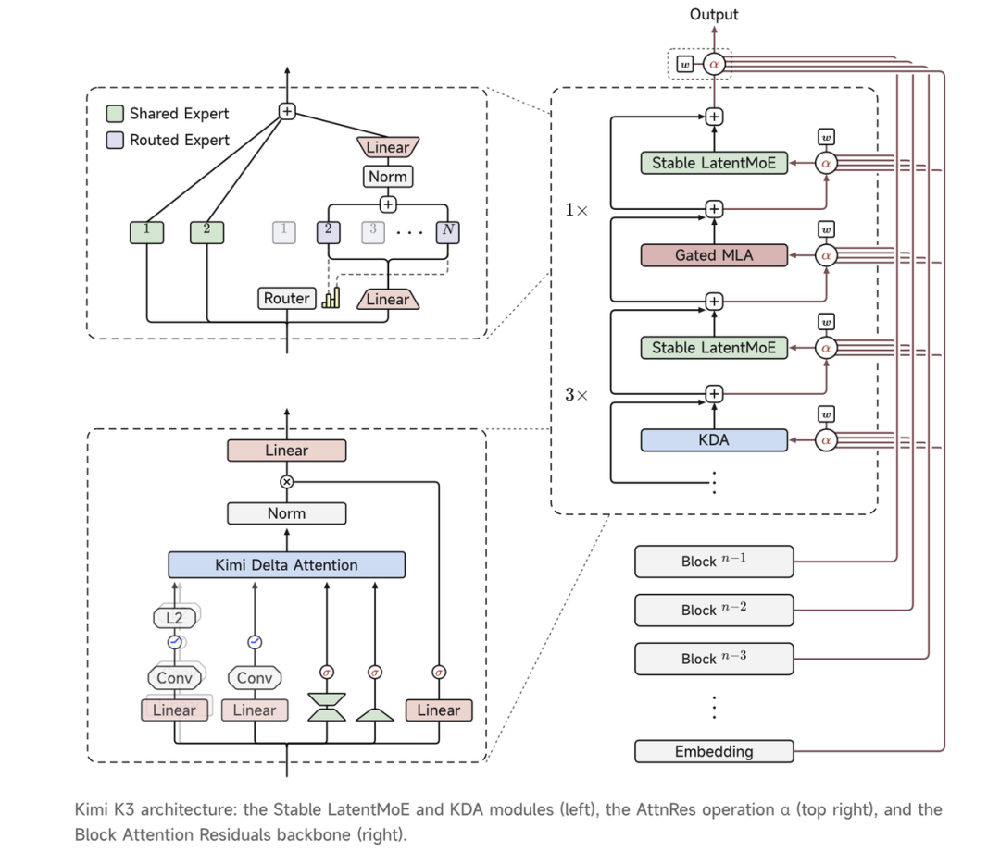

**图意解读：** 左下是 KDA 内部的投影、卷积和门控，左上是专家路由，右边是层间组合。图中的 AttnRes 是跨深度的 Attention Residuals；不能把右侧跨层连线解释为按 token 远近调整“注意力分辨率”。这张图解释模型计算结构，没有画缓存所有权和网络调度器。

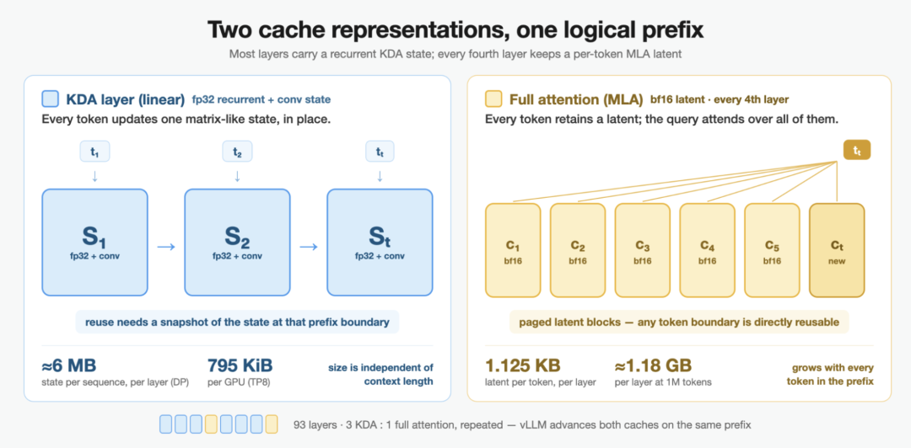

**图意解读：** 左边的 `S1 → S2 → St` 是同一类状态随时间演进，不意味着运行时自动永久保存每一步；右边的 `c1…ct` 是不断追加的历史。左侧图示使用 FP32 recurrent state，右侧使用 BF16 latent KV，大小还区分单层、单 GPU 和 TP8。不要把这些数字与其他精度的容量计算混用。

**整理者归纳：** “KDA 状态大小固定”只描述单个请求、单个状态版本。系统总容量仍受 MLA token 数、活动请求数、检查点数量、临时验证状态和并行布局影响。

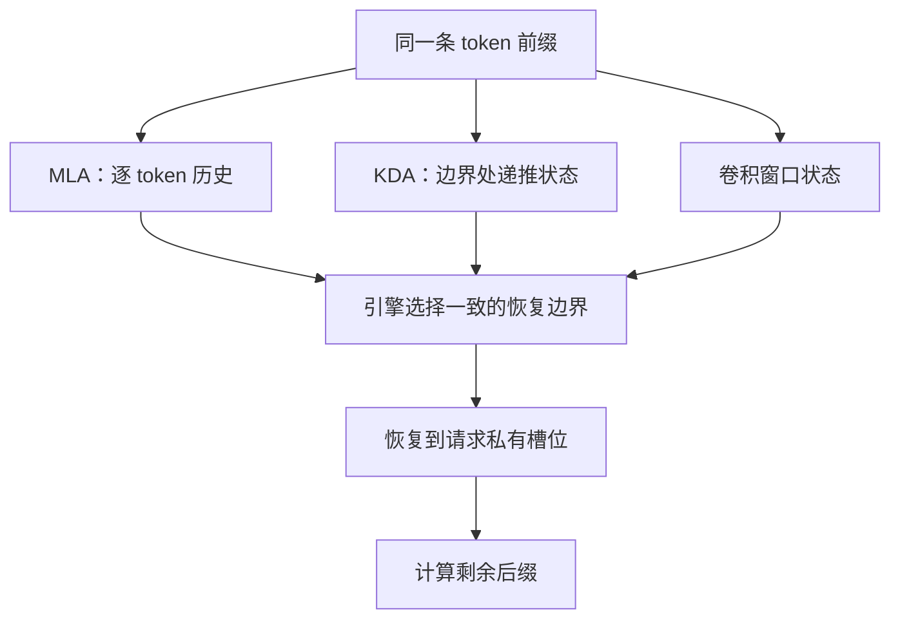

**图意解读：** 这是一张整理者绘制的条件图。三条边表示恢复条件必须齐备，不表示它们一定来自同一台物理机器，也不表示网络一次调用就能完成原子恢复。

## 2. Token 命中长度，为什么不等于可跳过的计算长度

### 用一条请求走完整流程

假设 A 已处理 10k token，缓存只留下 `S_10k`；B 与 A 共享前 8k token。即使 MLA 已经拥有这 8k token 的全部 KV，B 也不能从 `S_10k` 开始，因为它带着 B 不共享的后续信息。

如果另有 `S_6k` 且对应的其他状态仍可用，B 可以恢复到 6k，然后把 6k–8k 这段再执行一次。这里的“再执行”是从合法旧状态向前推进，不是从新状态反向撤销。

设 token 匹配上界为 `P`，所有模型身份、缓存组、rank 布局等兼容性条件均已满足。整理者用下面的表达式描述合法边界：

```text
R = max { b ≤ P : MLA[0:b] 可用，并且 KDA 与卷积状态在 b 处可恢复 }
额外重放长度 = P - R
实际需处理的后缀长度 = 请求长度 - R
```

`P-R` 是额外 token 数，不是额外耗时；不同长度、内核和 chunk 形状下，每 token 成本可能不同。

### 检查点的密度为什么昂贵

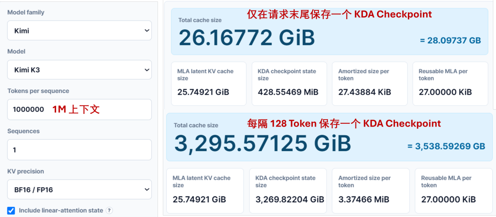

**图意解读：** 原图为容量计算器截图，条件是 1 条、1,000,000 token、BF16/FP16 配置。只在末尾留一个检查点时，总缓存约 26.17 GiB；每 128 token 保留时，约 3295.57 GiB。它是给定布局下的计算示例，不是某个生产 GPU 的实测占用，也没有包含模型权重和全部运行时开销。

近似理解：

```text
检查点空间 ≈ 每份检查点字节数 × 保留份数
均匀间隔 Δ 下，保留份数约为上下文长度 / Δ
```

以原文的约 0.4 GiB/份为例，百万上下文每 10k 保留一份也会形成约 40 GiB 的检查点开销。节点共享、淘汰、精度和 TP 切分都会改变实际结果，不能拿这个估算直接采购设备。

### 高命中率仍可能有明显浪费

原文举例：910k token 的请求共享前 905k，但最近检查点在 900k。表面看命中率仍超过 98%，实际需要处理 10k token；若能恢复到 905k，则只需处理 5k。

排障时应同时看“token 匹配长度、合法恢复长度、额外重放长度、恢复传输时间”，只看一个 cache hit rate 会掩盖问题。

## 3. SGLang：树上是快照，请求里是活动状态

### 人话版

共享快照像只读教材。每个请求先拿自己的草稿纸继续写，再在合适的边界把一份稳定副本交回图书馆。

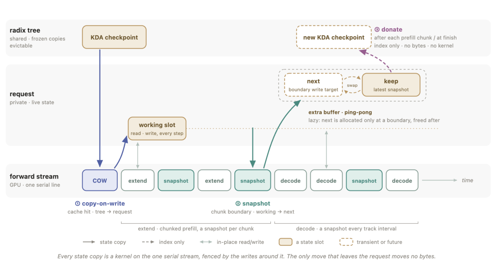

**图意解读：** 顶部是 Radix Tree 持有的共享状态，中间是请求的私有槽位和交替快照缓冲，底部是 forward stream。实线复制状态字节；虚线 Donate 只转交槽位索引。复制与计算在同一 stream 的顺序保障本地读写先后，不能把它扩展为跨节点传输已经完成的证明。

| 动作 | 数据怎么走 | 谁随后拥有可写状态 |
| --- | --- | --- |
| COW / 恢复 | 树上快照复制到请求 working slot | 当前请求 |
| Snapshot | working slot 复制到边界快照缓冲 | 工作副本继续属于请求；快照保持稳定 |
| Donate | 把快照槽位的所有权挂到树上 | 树管理快照生命周期；请求不能继续改这份快照 |

Donate 消除的是快照完成后的再次拷贝，不是宣称整个缓存保存过程零拷贝。

### 检查点放在哪里

原文给出三个有价值的位置：Prefill chunk 边界、Decode 追踪间隔、Radix Tree 的共享分叉。再以单路径数量预算和 LRU 控制保留成本。

遇到边中间分叉时，先从已有合法检查点重放到对齐后的分叉，再为将来的请求留下可恢复状态。树节点切开，只创造了逻辑边界；它不会凭空生成那一刻的 KDA 状态。

### 压缩检查点的另一条边界

主资料介绍可选的本地 INT8 非活动 recurrent checkpoint 路径，卷积窗口保持原精度，命中时恢复到活动槽位。这属于有损状态压缩，应单独验证恢复误差，不能与普通精确 COW 或投机解码的无损承诺混为一谈。本次没有验证其跨实例兼容组合或默认启用情况。

### Unified Memory 统一的是物理容量

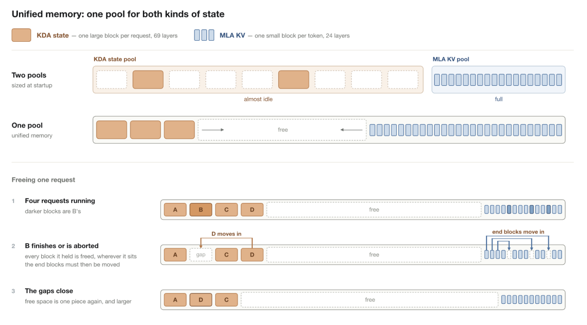

**图意解读：** 分离的两个池可能一个空闲、另一个耗尽。统一模式让大 KDA block 和小 MLA block 从两端向中间使用空间；释放中间对象后，用末端对象填补空洞。不同逻辑对象仍有不同大小和引用关系，移动后必须由引擎维护索引。它不是 CUDA 自动 CPU/GPU 分页意义下的 Unified Memory。

这也不同于“统一 Radix Tree”：前者分配物理字节，后者统一逻辑缓存结构。原文的 `--enable-unified-memory` 是可选路径，不能由树实现变为默认推断该开关也默认开启。

## 4. vLLM：细粒度匹配不能绕过状态存在条件

### 人话版

地址簿可以更精细，但地址簿上的名字不能代替真正保存的状态。

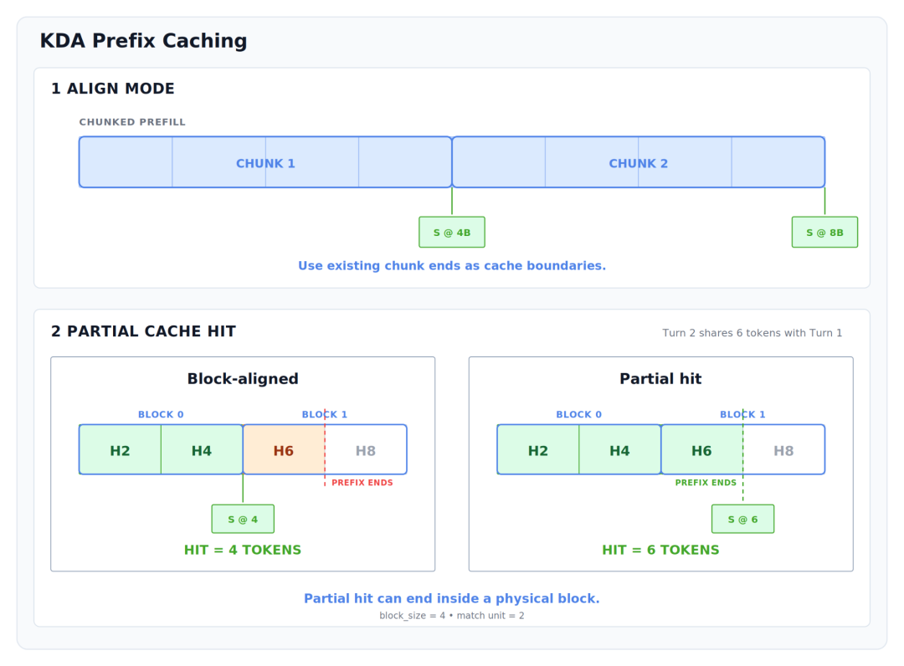

**图意解读：** 图中物理 block 大小为 4，匹配单位为 2。普通块对齐只能停在 4；partial hit 可以识别到 6，**前提是 `S@6` 已经存在**。不能从 `S@8` 截断出 `S@6`。图中的块只是教学尺寸，不能当作 K3 的启动参数。

原文的 4096 / 4480 例子也是同一件事：将 prefix hash 的匹配粒度与物理 state block 粒度分开。恢复时仍需给请求私有状态，partial hit 没有取消 COW。

### 两种保留策略

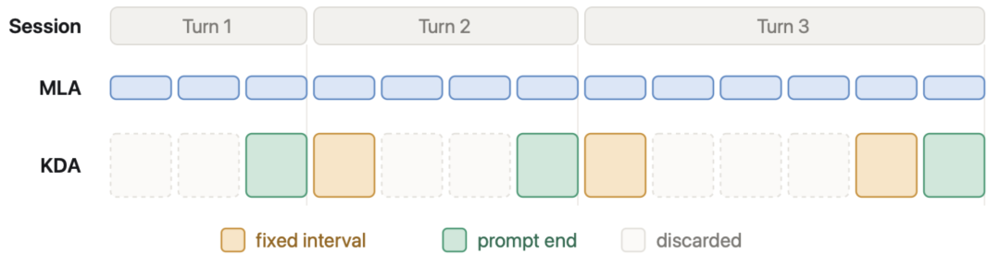

**图意解读：** MLA 持续追加，KDA 只在选定位置保留。黄色是固定间隔，绿色是 prompt 结束，虚框表示未保留的旧状态。保留 prompt 末尾通常适合下一轮继续复用上一轮输入，但聊天模板或历史改写仍会影响命中。

原文介绍 `VLLM_PREFIX_CACHE_RETENTION_INTERVAL=0` 关闭周期保留、只留 prompt-end 的行为；这是对应文章的实现描述，使用前应对照目标版本。

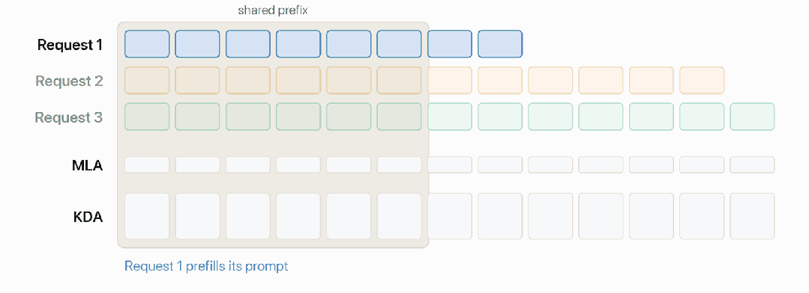

**图意解读：** 动画中第二条请求仍需重算共享前缀，并在这次执行后保留相应 KDA 状态；第三条请求才从该边界直接复用。Marconi 风格策略减少一次性前缀占用。记录第一次访问的元数据，与拥有可恢复检查点，是两个不同阶段；后续仍需在执行到该位置时生成状态。

## 5. Mooncake：从“搬 KV”变成“搬合法状态集合”

### 谁负责什么

| 组件 | 控制职责 | 数据职责 |
| --- | --- | --- |
| SGLang / vLLM 缓存管理器 | 决定前缀身份、合法边界、状态保留和恢复 | 为请求准备正确的 MLA、KDA、卷积状态视图 |
| HiCache / KV Connector 接入层 | 协调本地、远端命中和加载完成 | 组织各 cache group、rank 的对象与目的地址 |
| Mooncake Store / Transfer Engine | 提供对象存储、定位和传输能力 | 存取、搬运上层交付的字节对象 |
| Router / Gateway | 选择 worker、编排阶段 | 不自动拥有 GPU 缓存生命周期 |

这张表是对原文分工的归纳，不是源码接口清单。即使 Mooncake 返回某个对象存在，引擎仍需确认同一边界的其他状态完整、布局兼容且已就绪。

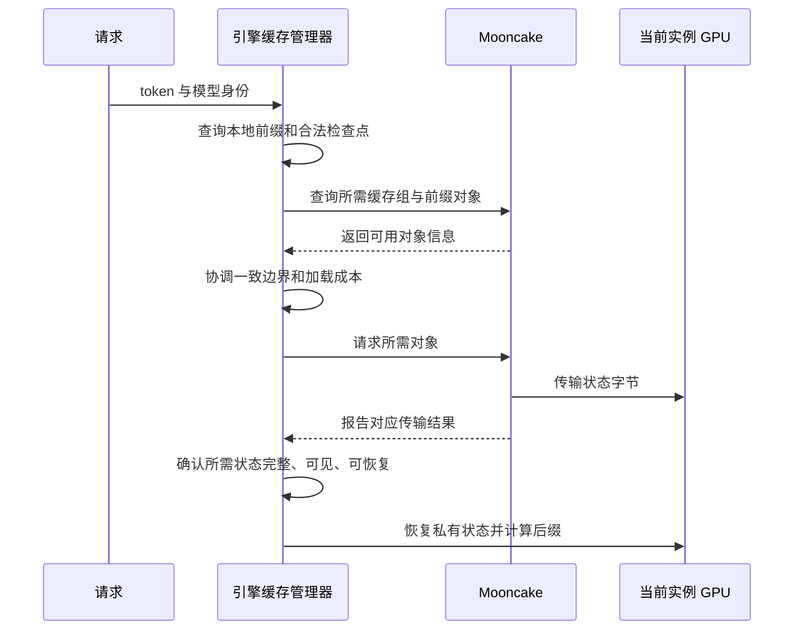

**图意解读：** 这是整理者绘制的逻辑顺序，不承诺具体 API 或通信时序。完成一次网络动作与整个请求可以继续执行之间，还有引擎负责的恢复条件。

远端命中更长也未必更快。判断可以使用如下成本关系，而非只按最长前缀选择：

```text
远端恢复值得做 ⇔ 省掉的计算时间 > 查询 + 搬运 + 解包 / 恢复 + 等待成本
```

## 6. TokenSpeed：Flat KV 与 EPD

### 统一管理单元，不抹去内部语义

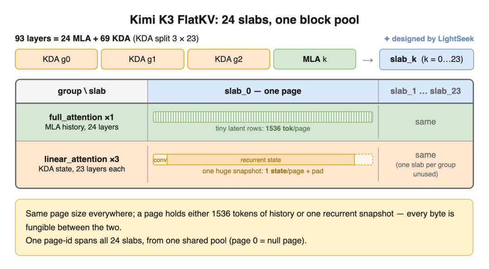

**图意解读：** 原图为 K3 的特定布局：69 个 KDA 层分成 3 组，每组 23 层，与 24 个 MLA 层映射到 24 个物理 slab；每组有一个 slab 不使用。一个 page 的容量可对应 1536 token 的 MLA history，或一份 KDA snapshot 加 padding。统一的是分配/传输单位，页内部的卷积和 recurrent 数据仍有自己的解释。图有透明背景，深色预览下可切换浅色背景阅读标题。

| 方案 | “统一”的对象 | 仍需区别什么 |
| --- | --- | --- |
| SGLang Unified Memory | 底层剩余容量 | 两种分配大小与索引 |
| vLLM Hybrid KV Cache Manager | 请求调度下的异构缓存管理 | cache group、状态边界与保留策略 |
| TokenSpeed Flat KV | page ID、分配和传输单元 | page 内容的模型语义与布局 |

原文称“全局 page ID 空间”，应理解为该 Flat KV 管理与映射方案中的统一标识。它不意味着任意两个实例同一个整数就指向同一物理地址；跨实例仍需目的页映射与元数据协议。

### 三阶段分别搬什么

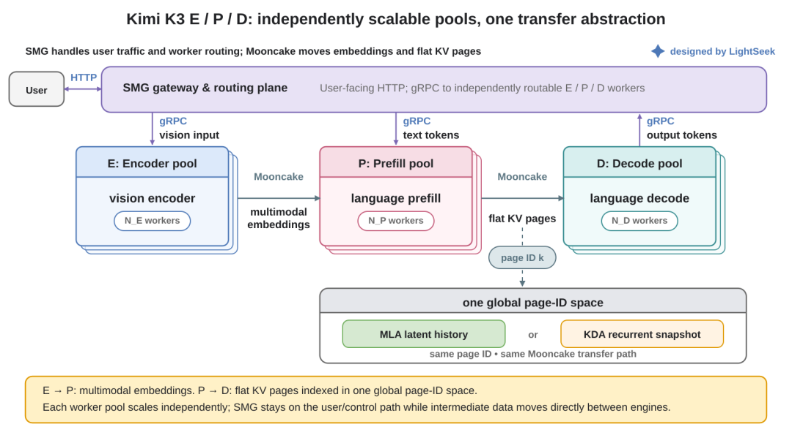

**图意解读：** 上方 SMG 负责用户入口和 worker 路由；下方 E→P 搬视觉 embeddings，P→D 搬 Flat KV pages。三个池可按负载分别配置容量。图中两条 Mooncake 箭头表示复用数据传输能力，不表示视觉 embeddings 与 KDA 状态可相互替代。

例子：一个包含 20 张图片的请求，视觉编码可能先成为瓶颈。增加 Encoder 容量能够缓解这段排队，却不能直接解决 Decode 的 KDA 请求槽位耗尽。先辨认慢的是哪一阶段、等待哪一类状态，再调整资源。

## 7. 小白排障地图

| 现象 | 优先检查 | 常见误解 |
| --- | --- | --- |
| token 命中很长，Prefill 仍然很重 | 合法检查点边界、额外 replay 长度 | 命中 token 就一定能跳过计算 |
| 两个分支相互影响 | 共享快照是否被原地改写、COW 与 snapshot 顺序 | 同一个前缀可以共享一个可写状态 |
| MLA 池还有余量，却无法增加请求 | KDA 槽位、检查点和临时状态容量 | 剩余显存等于所有分配器可用容量 |
| 远端对象存在但无法恢复 | cache group、模型版本、rank 布局、同边界完整性 | Store 命中等于可运行 |
| partial hit 没带来预期收益 | 该细粒度边界是否真的有状态 | hash 更细就能倒推任意旧状态 |
| EPD 扩容收益有限 | E/P/D 队列和每段传输耗时 | 多加任意一种 worker 都能加速全链路 |

## 8. 阅读路线与参考

关于恢复边界、内部检查点与投机状态提交，可继续阅读 [KDA Cache 检查点、前缀复用与投机回滚](<./KDA Cache 检查点、前缀复用与投机回滚学习文档.md>)。该文也区分了前缀补算与 ReplaySSM 的局部递推重放。

先读[前缀命中定义](<../../sglang/kv-cache/SGLang RadixAttention 前缀缓存命中定义学习文档.md>)，再读本文，最后进入 [SGLang K3 推理协同优化](<../../sglang/model-support/SGLang Kimi K3 推理协同优化学习文档.md>)。

- [SGLang 官方 K3 文章](https://www.lmsys.org/blog/2026-07-27-kimi-k3-day0-support/)：COW、checkpoint、统一容量与并行。
- [vLLM 官方 K3 文章](https://vllm.ai/blog/2026-07-27-k3)：混合缓存与保留策略。
- [TokenSpeed 官方 K3 文章](https://lightseek.org/blog/tokenspeed-kimi-k3.html)：Flat KV 与 EPD。
- [Hugging Face 模型卡](https://huggingface.co/moonshotai/Kimi-K3)、[ModelScope 配置](https://modelscope.cn/models/moonshotai/Kimi-K3/resolve/master/config.json)：本次仅核对公开结构，不是源码执行基线。
- [Mooncake 与 vLLM 接入地图](<../../vllm/disaggregation/Mooncake 与 vLLM 接入地图学习文档.md>)、[Mooncake 与 SGLang HiCache](<../../sglang/kv-cache/Mooncake 与 SGLang HiCache 学习文档.md>)：继续追踪接入边界。
