# Transformer 架构与推理流程学习文档

[模型结构学习入口](README.md) · [LLM 推理系统导航](../README.md) · [推理基础](../foundations/README.md)

想让模型把 `I love cats` 翻译成 `我喜欢猫`，它会先把文字切成小块（**token**），每块换成一串数字（**向量**）。接着让这些数字表示互相补充信息，再决定接下来写哪一块。**选出一个 token，就把它接回输入，继续计算，直到结束。**

本文按推理实际遇到模块的顺序讲解。先用经典 **Encoder–Decoder（编码器—解码器）** 架构走完一次翻译，再映射到常见的 **Decoder-only（仅解码器）** 语言模型。全文围绕推理中的输入、计算、数据复用与逐步生成展开。

本文是**第三方资料整理型学习文档**，依据原始论文与官方文档整理，读取时间为 2026-10-08。图和数值是原创教学示例，未加载模型权重或进行性能实验；来源见第 0 节。

## 先抓住一个例子：把“I love cats”翻译成“我喜欢猫”

可以把这件事分成两个动作：**先读源句，再接着写目标句。** 读源句时，模型把 `I / love / cats` 各变成一串数字，让它们互相补充上下文；写目标句时，模型看“已经写了什么”，再查询源句，决定接下来写哪个 token。

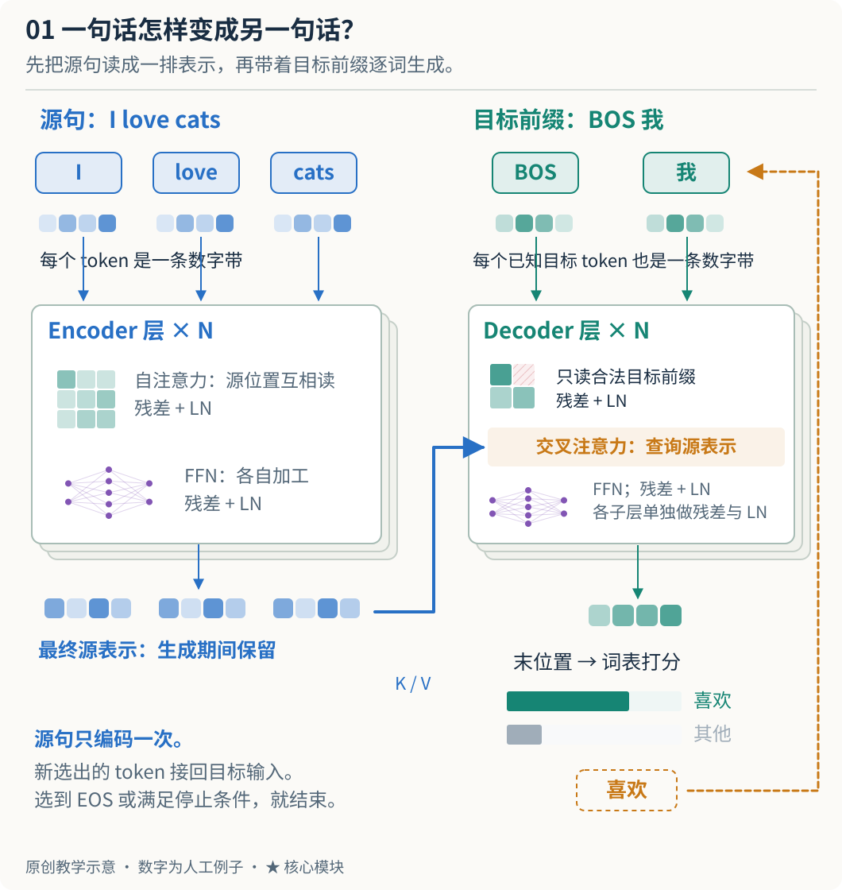

**图意解读：** 先沿左侧看：三个源 token 各有一条数字带，经过多层后仍是三个位置的表示。蓝色横向通路把这排源表示提供给右侧交叉注意力。再沿右侧看：已写前缀经过 Decoder，末位置给下一 token 打分；刚选出的“喜欢”沿虚线接回输入。两座层堆叠分别负责“读源句”和“接着写”，不是两台机器。

先记住下面这张“用途表”，公式可以稍后再看：

| 按推理经过的顺序 | 它到底帮什么忙？ |
| --- | --- |
| 分词与词嵌入 | 把文字切成几块，每块换成一条可计算的数字带。 |
| 位置编码 | 告诉模型这些块的顺序，避免只知道“有哪些内容”。 |
| 注意力与掩码 | 决定“从哪些位置拿多少信息”，并排除不该读取的位置。 |
| 残差与归一化 | 保留原表示、叠加变化，并整理各个位置的数值尺度。 |
| FFN / MoE | 每个位置各自加工特征；MoE 先选少数几个 FFN 专家，再汇总各自结果。 |
| 输出与循环 | 给下一 token 的候选打分，选一个接到后面，再继续。 |

**图里的小格子怎么读？** 一个 token 对应一条数字带；一格是一项特征。几项特征就是几维，把几条带并排放便成为矩阵。图中的颜色帮助追踪用途，人工数字帮助看清算术，不是从真实模型中测出的语义或权重。

第一次阅读，先看每节的“先看懂用意”、图和“图意解读”；能说清数据在前后有什么变化后，再读公式、形状表和实现边界。

## 0. 阅读基线、范围与路线

### 0.1 来源与边界

<details>
<summary>展开论文与官方文档来源，深入阅读时核对</summary>

| 资料 | 作者 / 机构 | 发布或版本信息 | 本文用途 |
| --- | --- | --- | --- |
| [Attention Is All You Need](https://arxiv.org/html/1706.03762v7) | Ashish Vaswani 等，Google / University of Toronto | 初发 2017-06；读取 arXiv v7，2023-08-02 | 经典架构、Attention、FFN、Embedding、正弦位置编码、Post-LN；重点为 §3 |
| [Layer Normalization](https://arxiv.org/abs/1607.06450) | Jimmy Lei Ba、Jamie Ryan Kiros、Geoffrey E. Hinton | 2016-07 | LayerNorm 的统计范围与公式 |
| [On Layer Normalization in the Transformer Architecture](https://arxiv.org/abs/2002.04745) | Ruibin Xiong 等 | 2020-02 | Pre-LN / Post-LN 的位置区别 |
| [RoFormer: Enhanced Transformer with Rotary Position Embedding](https://arxiv.org/abs/2104.09864) | Jianlin Su 等 | 2021-04 | RoPE 的旋转与相对位置关系 |
| [Root Mean Square Layer Normalization](https://arxiv.org/abs/1910.07467) | Biao Zhang、Rico Sennrich | 2019-10 | RMSNorm 对照 |
| [Mixtral of Experts](https://arxiv.org/html/2401.04088v1) | Albert Q. Jiang 等，Mistral AI | arXiv v1，2024-01-08 | §2.1 的 Top-2 路由、专家加权汇总；§3 的参数与内存口径；§5 的专家分工边界 |
| [Switch Transformers: Scaling to Trillion Parameter Models with Simple and Efficient Sparsity](https://arxiv.org/html/2101.03961v3) | William Fedus、Barret Zoph、Noam Shazeer，Google | arXiv v3，2022-06-16；初发 2021-01 | Top-1 变体与路由权重规则的区别 |
| [GLU Variants Improve Transformer](https://arxiv.org/abs/2002.05202) | Noam Shazeer | 2020-02 | 门控 FFN / SwiGLU 对照 |
| [MultiheadAttention](https://docs.pytorch.org/docs/2.14/generated/torch.nn.MultiheadAttention.html) 与 [scaled_dot_product_attention](https://docs.pytorch.org/docs/2.14/generated/torch.nn.functional.scaled_dot_product_attention.html) | PyTorch | 读取文档版本 2.14 | padding / attention mask 的含义与布尔值接口差异 |
| [How caching works](https://huggingface.co/docs/transformers/main/en/cache_explanation) | Hugging Face | 读取 `main` 文档；内容会继续变化 | 每层 KV Cache、增量 Query 与缓存增长 |

</details>

统一读取时间：**2026-10-08**。正文主线固定在原始 Transformer 的 Post-LN 结构；现代变体会另行标注，不能把这些来源拼成“所有模型都如此”的配置。本文在 FFN 后补充稀疏 MoE 的推理路径；不展开反向传播、优化器、分布式并行实现和 Attention 内核实现。

**图片约定：** 图 01–26 是整理者绘制的教学图，用抽行、数轴、几何向量、权重条、逐 token 连线和缓存格展示变化，不代表软件进程或硬件模块。另保留 Transformer 原论文 Figure 1、Figure 2 两个子图及 Mixtral 的 MoE 原图作为核对材料，见文末。所有图片都有本地文件；[图片来源与复现](../../images/transformer-architecture/SOURCES.md)记录出处、校验值和生成命令。手机阅读复杂全局图时，可打开原尺寸图片；对应模块均有单独的细节图。

视觉表达参考了 [The Illustrated Transformer](https://jalammar.github.io/illustrated-transformer/)、[3Blue1Brown 的注意力课程](https://www.3blue1brown.com/lessons/attention/)、[3Blue1Brown 的 MLP 课程](https://www.3blue1brown.com/lessons/mlp/) 与 [Transformer Explainer](https://poloclub.github.io/transformer-explainer/)。借鉴的是“把向量、读取比例和前后变化画出来”的方法，本文图片重新设计、数据自行构造；技术边界仍按上述原论文和官方文档核对。

### 0.2 先认清三种架构

| 架构 | 输入怎样流动 | 典型注意力关系 | 本文的位置 |
| --- | --- | --- | --- |
| Encoder-only | 输入序列进入 Encoder，输出各位置表示 | 自注意力通常双向可见，排除 PAD | 理解编码侧；不作为本文逐词生成的主线 |
| Encoder–Decoder | 源序列先编码；Decoder 读目标前缀并查询源表示 | Encoder 自注意力、Decoder 因果自注意力、跨两侧的交叉注意力 | **主线**，能覆盖本文全部关键模块 |
| Decoder-only | 提示词与已生成内容组成同一条序列 | 常见文本生成结构使用因果自注意力，没有独立编码侧 | 第 15 节映射到 LLM 推理 |

**Encoder / Decoder 是模型结构；Prefill / Decode 是推理运行阶段。两组概念不能一一配对。** 同一个 Decoder-only 模型在 Prefill 和 Decode 阶段都执行它的全部层。

### 0.3 阅读优先级与顺序

**★ 核心必读**表示理解数据怎样流动必需的环节；**补充**用于理解实现差异。标注是学习优先级，不表示未加星的部分可以从实现中随意删除。

| 推理顺序 | 先问什么 | 对应章节 |
| --- | --- | --- |
| 1 | 文本怎么变成模型能接收的编号？起止与补齐如何表达？ | 2：Tokenizer、BOS、EOS、PAD |
| 2 | 编号怎样变成向量？顺序信息在哪里？ | 3–4：**★ Embedding、位置编码** |
| 3 | 每个位置怎样读取其他位置？ | 5–6：**★ QKV、缩放点积、多头、填充掩码** |
| 4 | 交换信息后，怎样保留原输入并加工特征？ | 7–8：**★ 残差、LayerNorm、FFN**；8.5–8.8：**★ MoE 变体** |
| 5 | 源序列怎样形成可查询的表示？ | 9：Encoder 层与堆叠 |
| 6 | Decoder 怎样只看合法前缀，并读取源序列？ | 10–12：**★ 前瞻掩码、交叉多头注意力、Decoder 层** |
| 7 | 向量怎样变成下一个 token，并开始下一轮？ | 13–14：**★ LM Head、解码选择、自回归循环** |
| 扩展 | 常见 LLM 如何保留这条主线、减少重复计算？ | 15：**★ KV Cache、Prefill / Decode、Decoder-only** |

### 0.4 术语与张量形状速查

先把矩阵看成表格：**一行对应一个位置，一行里的数字是这个位置的特征。** 加上 batch 维度后，就是同时处理几份这样的表格。

| 符号 / 术语 | 人话解释 | 本文约定 |
| --- | --- | --- |
| token / Token ID | 一段文本单位 / 它在词表中的编号 | 不必等于一个词，也不必等于一个字 |
| `B` | 同时处理的序列数 | batch size |
| `S` / `T` | 源序列长度 / 当前目标输入长度 | 交叉注意力中通常不相等 |
| `V` / `V_value` | 词表大小 / 注意力的 Value 矩阵 | 公式中按上下文区分；形状表用 `V_value` 避免混淆 |
| `d` | 每个 token 的隐藏特征数 | `d_model`；教学例设为 8 |
| `h`、`d_k`、`d_v` | 头数、每头 Q/K 维度、每头 Value 维度 | 标准 MHA 示例 `h=2, d_k=d_v=4` |
| `d_ff` | FFN 中间层宽度 | 教学例设为 32，不是模型通用常数 |
| `n_exp` / `k` | 专家总数 / 每个 token 选中的专家数 | MoE 手算例用 4 / 2；不等于注意力头数或生成采样的 Top-k |
| hidden state | token 在当前层的表示 | 初始是词嵌入；之后逐层包含上下文 |
| logits | 还没归一化的候选分数 | 每个词表 token 一个分数 |
| mask | 允许或禁止读取哪些位置的规则 | 本文统一用“允许加 0、禁止加 −∞”表示 |

## 1. 全局地图：一条翻译请求如何穿过模型

### 1.1 先用一句话理解各部分

假设输入是 `I love cats`，希望模型逐步生成 `我 喜欢 猫`。下面暂把这些片段分别视为一个 token，真实 tokenizer 不保证如此切分。

Encoder 把源句变成一组带上下文的向量，像给每个源位置做一张带关联信息的卡片。Decoder 每轮拿到“目前写到了哪里”，先整理目标前缀，再通过交叉注意力查询源卡片，最后决定接下来写什么。这里的“卡片”“查询”是帮助理解的比喻，不表示模型在执行人工设计的词典检索。


### 1.2 ★ 全模块总览：把每个子层和生成循环展开

前面的图先帮助建立“读源句、接着写”的直觉。下面这张图把经典 Transformer 的主要推理模块全部展开，**橙色短旁路是每个子层自己的残差，最右侧橙色长线才是生成循环。** 两者用途不同。

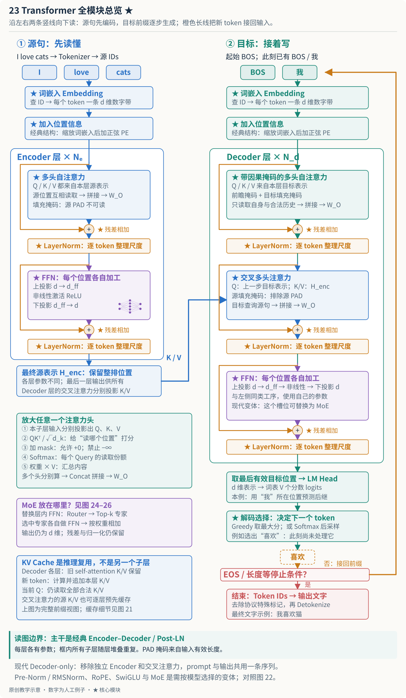

[打开全模块总览原图，可放大阅读](../../images/transformer-architecture/23-full-architecture.svg)

**图意解读：** 按下面四步看，就能把模块连成一件完整的事：

1. **左侧先读源句。** Tokenizer 给出 IDs，Embedding 查出向量，加上位置；每层先用自注意力交换源位置的信息，再用 FFN 独立加工。每个子层都有独立的“残差相加 → LayerNorm”。经过所有 Encoder 层，保留整排源表示。
2. **右侧处理已写前缀。** 从 BOS 等起始标记开始，目标自注意力只读合法前缀；交叉注意力用目标作 Query、最终源表示作 Key/Value；然后 FFN 加工结果。三种工序分别带残差与归一化，整个 Decoder 层再重复多次。
3. **底部决定写什么。** 取最后有效目标位置，经 LM Head 给词表打分，再由生成器选择 token。未结束就接回前缀；选到 EOS 或满足其他停止条件，才把 IDs 解码成文本。Greedy 可以直接对 logits 取最大值，不必先计算完整 Softmax。
4. **看左下的放大说明。** 它拆开了每个注意力头的打分、掩码、Softmax、Value 汇总，以及多头拼接。MoE 对应 FFN 槽位的可选替换；KV Cache 对应已有 K/V 的复用。二者都没有取代注意力的职责。

**掩码在图中的位置：** 源 padding mask 用在 Encoder 自注意力和 Decoder 交叉注意力；目标 padding mask 与前瞻掩码共同约束 Decoder 自注意力。这里画的是已整理好前缀的逻辑视图；使用 KV Cache 后，新一轮通常只输入新 token，读取范围仍包含合法历史。

**架构边界：** 主干采用经典 Post-LN，加法位置编码位于层堆叠之前。MoE 不是原始 2017 Transformer 的组成部分；图中只标出它可替换的 FFN 位置。现代 Pre-Norm / RMSNorm、RoPE 的位置见第 7、15 节，不应把所有变体同时塞进经典主干。正常推理时 Dropout 关闭，因此不作为独立计算工序画出。

### 1.3 控制流程和神经网络计算要分开看

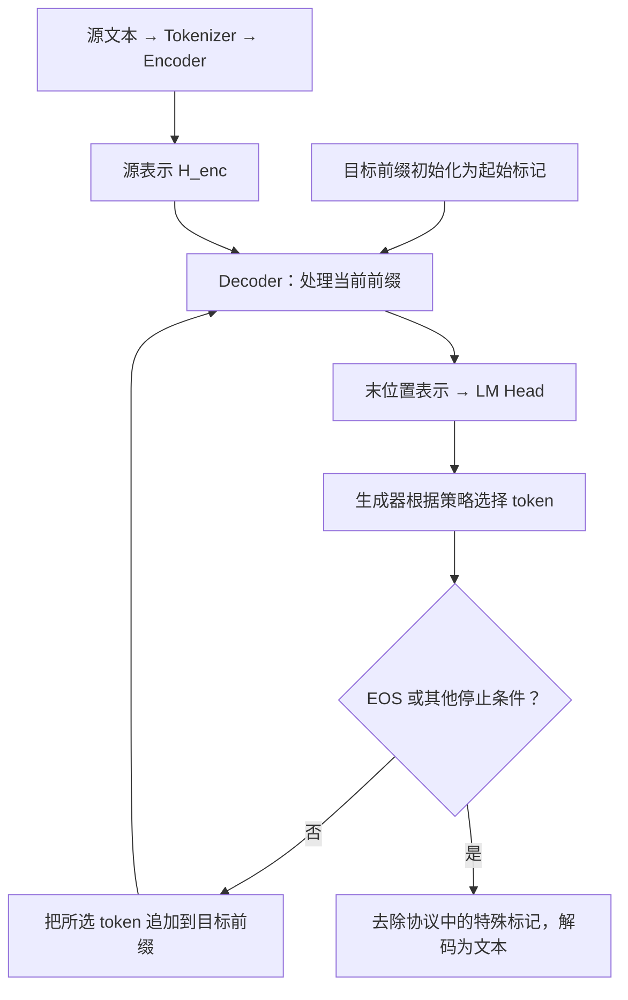
```mermaid
flowchart TD
    A["源文本 → Tokenizer → Encoder"] --> M["源表示 H_enc"]
    B["目标前缀初始化为起始标记"] --> D["Decoder：处理当前前缀"]
    M --> D
    D --> L["末位置表示 → LM Head"]
    L --> S["生成器根据策略选择 token"]
    S --> C{"EOS 或其他停止条件？"}
    C -->|否| U["把所选 token 追加到目标前缀"]
    U --> D
    C -->|是| O["去除协议中的特殊标记，解码为文本"]
```

**图意解读：** 模型负责算分数；生成器负责选 token、维护循环并判断停止。EOS 的向量没有“停止执行”的能力，必须由外层生成逻辑识别对应 ID。模型权重在正常推理中保持不变，变化的是输入、隐藏状态和缓存。

## 2. 输入准备：Tokenization、BOS、EOS 与 PAD

**先看懂用意：** 模型需要明确的输入单位和起止规则。先把句子切成 token、给出编号，再按模型协议处理开始、结束和占位符。

### 2.1 Tokenization：先切分，再编号

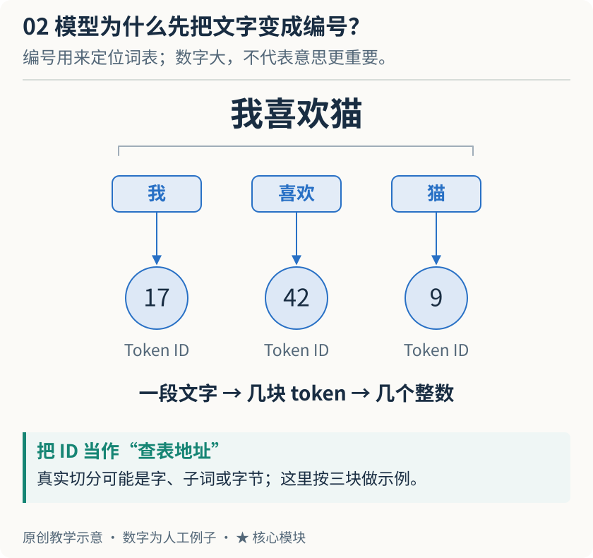

**人话版：** 神经网络不直接接收字符串。Tokenizer 按既定规则把字符串变成 token，再映射成整数编号。`17` 和 `42` 之间的数值差不代表词义距离；编号只是查表的地址。

**图意解读：** 上面是一句文字，中间是本例分成的三块 token，下面是各自的编号。沿一列看，就能把“喜欢”与 ID 42 对上。42 只是一个地址，不意味着它比编号 9 的“猫”更重要；编号和切分均为人工示例。

### 2.2 三种特殊 token 解决三个不同问题

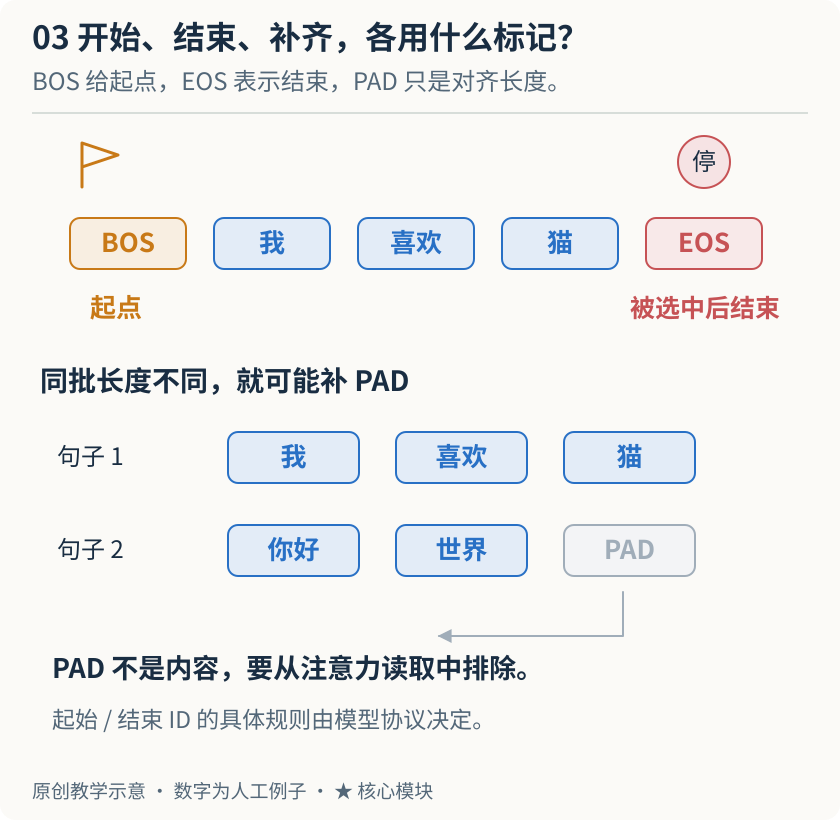

| 标记 | 职责 | 推理中怎样出现 | 容易误解的地方 |
| --- | --- | --- | --- |
| **BOS**，Beginning of Sequence | 指示序列开始，或作为初始输入 | 无目标词时提供一个可计算的位置 | 有些模型用专门的 `decoder_start_token_id`、语言标记或其他 ID，不一定使用叫 BOS 的 token |
| **EOS**，End of Sequence | 指示一段输出结束 | 作为普通词表候选被模型打分和选出 | 选中后由生成器结束；不同协议可能配置多个结束标记 |
| **PAD**，Padding | 为批处理对齐长度 | 给较短序列补占位位置 | 不是语义内容；Embedding 值为零也不能代替 padding mask |

**图意解读：** 上排像一行带起止标志的文字：BOS 提供起点，EOS 被选择后触发结束。下排两句话长度不同，灰色 PAD 只用来摆齐最后一列。它没有新增语义，后面的注意力需要排除它。具体模型可以使用不同的起始标记。

**具体例子：** 同批两条输入长度分别为 3 和 2，教学中可以整理为 `[我, 喜欢, 猫]` 与 `[你好, 世界, PAD]`。模型需要知道第二条最后一个位置只是占位。PAD 对注意力与有效输出的影响要分别处理，第 6 节会展开。

## 3. ★ 词嵌入：从 Token ID 到向量

**先看懂用意：** 一个整数编号不能直接表达丰富的特征。Embedding 用这个编号查表，拿出一条可供后续计算的数字带。

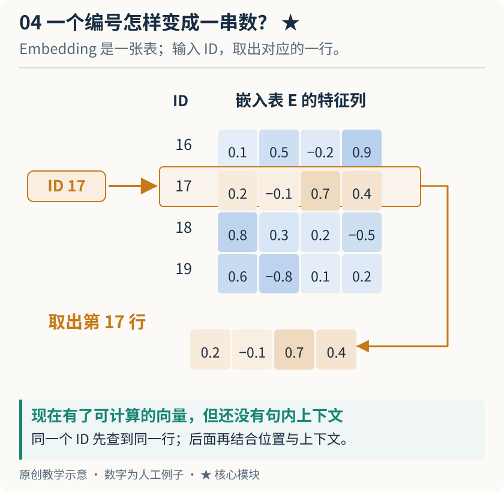

**人话版：** Embedding 是一张会在训练中学习的表。每一行属于一个 token，每一列是一个特征维度。输入一个 ID，就取出对应行。

**深入看计算（首次可跳过）：**

```text
嵌入矩阵 E 的形状：[V, d]
Token IDs 的形状：[B, T]
查表后 H 的形状：[B, T, d]

例：d = 4，token ID = 17
E[17] = [0.2, -0.1, 0.7, 0.4]    # 人工示例
```

**图意解读：** 左边的 ID 17 直接指向中间表格的第 17 行，橙色框圈出的四个数被原样拿到下方。图形强调的是“取一行”，不是把整数 17 做四次放大。拿到这条数字带后，才继续加入位置与上下文。

同一个 token 在同一张嵌入表里取得相同的初始向量；它在“河边的 bank”和“贷款的 bank”里含义不同，靠后续位置机制和 Attention 逐层形成不同的上下文表示。不要把 Embedding 直接解释为最终词义判断。

原始 Transformer 在加入位置编码前，把查出的向量乘以 `√d`；这是论文中的具体设计。另一个模型的 Embedding 是否缩放、是否与输出层共享参数，都应以该模型定义为准。[来源：原论文 §3.4](https://arxiv.org/html/1706.03762v7#S3.SS4)

### 3.1 “维度”和“投影”到底是什么

可以把一个向量想成一张**有 d 个刻度的仪表盘**：每个位置都用同样数量的刻度描述当前状态。真实模型中的刻度通常没有“颜色”“主语”这样的固定人工名字；很多信息由多个刻度共同表达。

线性投影 `y=xW` 则像给这张仪表盘接一组新的传感器：每个输出传感器都按不同权重，混合读取输入刻度。若 `x` 有 `d_in` 个数，`W` 的形状是 `[d_in,d_out]`，输出就有 `d_out` 个数。带偏置时是 `y=xW+b`，严格说属于仿射变换。

| 维度关系 | 常用叫法 | 真正发生的事 | 不要误解成 |
| --- | --- | --- | --- |
| `d_out > d_in` | 上投影 / 升维 | 用更多输出通道表达输入的不同加权组合 | 凭空获得新事实，或只是尾部补零 |
| `d_out < d_in` | 下投影 / 降维 | 把多个输入通道汇总成较少输出通道 | 自动、无损、可逆地压缩所有信息 |
| `d_out = d_in` | 等维投影 | 改变特征组合与坐标表达方式 | 什么都没做 |

机器学习语境里的“投影”通常泛指这种学习到的线性映射，**不保证是几何学中的正交投影**，也不一定升降维。Q/K/V 投影、FFN 的上下投影和 LM Head 都可用这套形状规则理解，但职责不同。Embedding 查表直接拿出已学习的向量，也不能简单理解成“把整数 ID 的大小放大成一堆数”。

## 4. ★ 位置编码：把“是什么”与“在哪里”接起来

**先看懂用意：** “猫追狗”和“狗追猫”包含相同的词，却不是同一个意思。位置机制把站位信息带进计算。

### 4.1 为什么还需要位置信息

如果把一组 token 的表示交给不带位置机制的双向自注意力，同时一致地交换这些位置，输出也会随之交换；单靠这种内容匹配，模型没有显式的位置坐标来区分“猫追狗”和“狗追猫”的顺序关系。因果掩码会提供可见性结构，但它与细致的位置表示不是同一个机制。

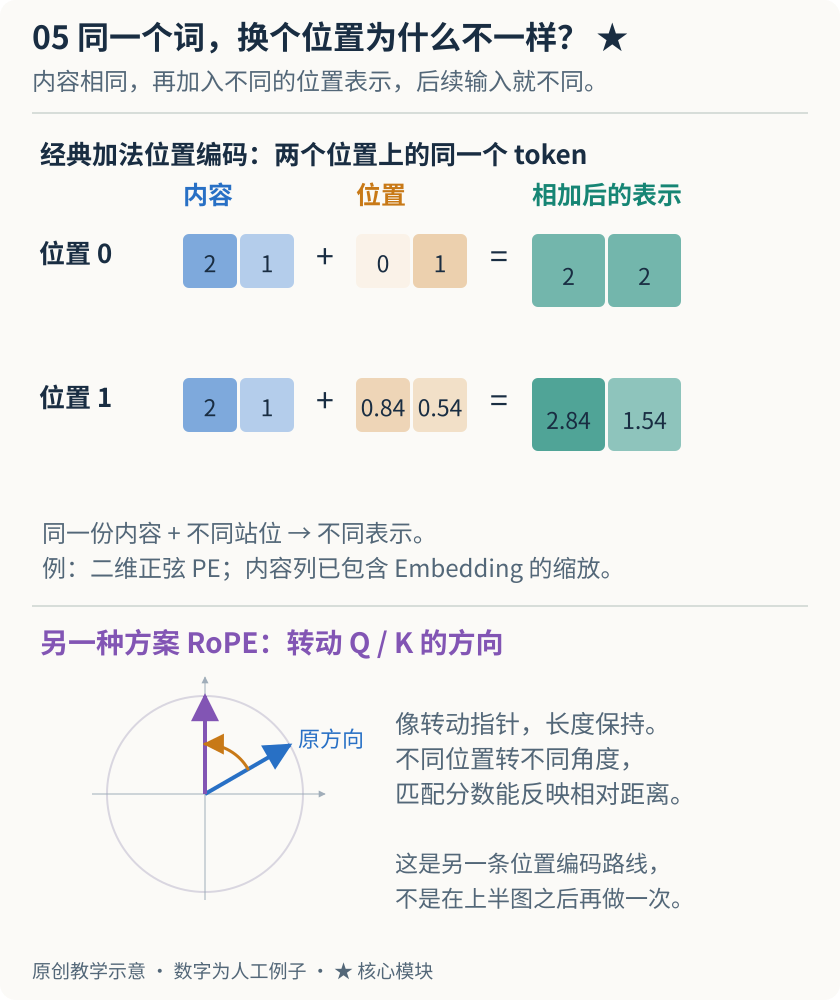

**图意解读：** 上半图的蓝色内容始终是 [2,1]；橙色位置向量不同，右侧相加结果也就不同。这展示同一个 token 怎样因站位不同而进入不同的计算。下半图是另一条方案：RoPE 像转动指针那样旋转 Q/K 的特征对，让匹配受相对位置影响；两半图不是连续执行的两道工序。

### 4.2 经典正弦位置编码怎么加

**深入看计算（首次可跳过）：**

对从 0 开始的 `pos` 和维度对索引 `i`：

```text
PE(pos, 2i)   = sin(pos / 10000^(2i/d))
PE(pos, 2i+1) = cos(pos / 10000^(2i/d))
H₀[pos]      = √d × E[token_id[pos]] + PE[pos]
```

不同维度使用不同变化速度，组成同样长为 `d` 的位置向量，再与内容向量逐元素相加。**相加后仍是 `d` 维，不是拼成 `2d` 维。** 经典正弦 PE 不需要学习位置参数；学习式绝对位置嵌入则使用可训练位置表。

可以把内容表示想成货物的描述，把位置表示想成它在队伍里的站位信息。两件同样的货物站在不同位置，进入后续计算的表示就不同。这个比喻只说明为什么要提供位置；实际相加并没有在向量里划出一个可以单独撕下来的“位置标签区”。

### 4.3 补充：RoPE 为什么常出现在注意力里面

RoPE 对 Q/K 的二维特征对做与位置有关的旋转。在简化表示下：

```text
q'_m = R(m) q_m
k'_n = R(n) k_n
(q'_m)ᵀ k'_n = q_mᵀ R(n - m) k_n
```

点积中由此出现相对位移。RoPE 通常不旋转 Value，也不改变 token 数；旋转后维度保持不变。上式忽略具体模型的频率调整、部分维度旋转等变体。[来源：RoFormer](https://arxiv.org/abs/2104.09864)

**排障提示：** 增量生成时，新 token 的位置要接续已有有效前缀，而不是每轮从零重新编号。Padding 与 `position_ids` 的映射取决于模型接口；把补齐后的数组下标直接当语义位置，可能造成偏移错误。位置机制本身也不保证任意长度外推都可靠。

## 5. ★ 注意力：QKV → 缩放点积 → 多头汇总

**先看懂用意：** 当前位置可能需要别处的信息。Attention 为不同位置分配读取比例，把它们的内容按比例混合回来。

这一节先拆注意力的计算，再在后续章节决定“它能读取哪些位置”。自注意力和交叉注意力都复用这套计算，主要区别是 Q/K/V 的来源。

### 5.1 Q、K、V：查询条件、匹配标签与被读取内容

三个缩写分别是 Query（查询）、Key（键，用于匹配）、Value（值，被读取的内容）。可以先记住一句话：**用 Q 找 K，按匹配结果拿 V。**

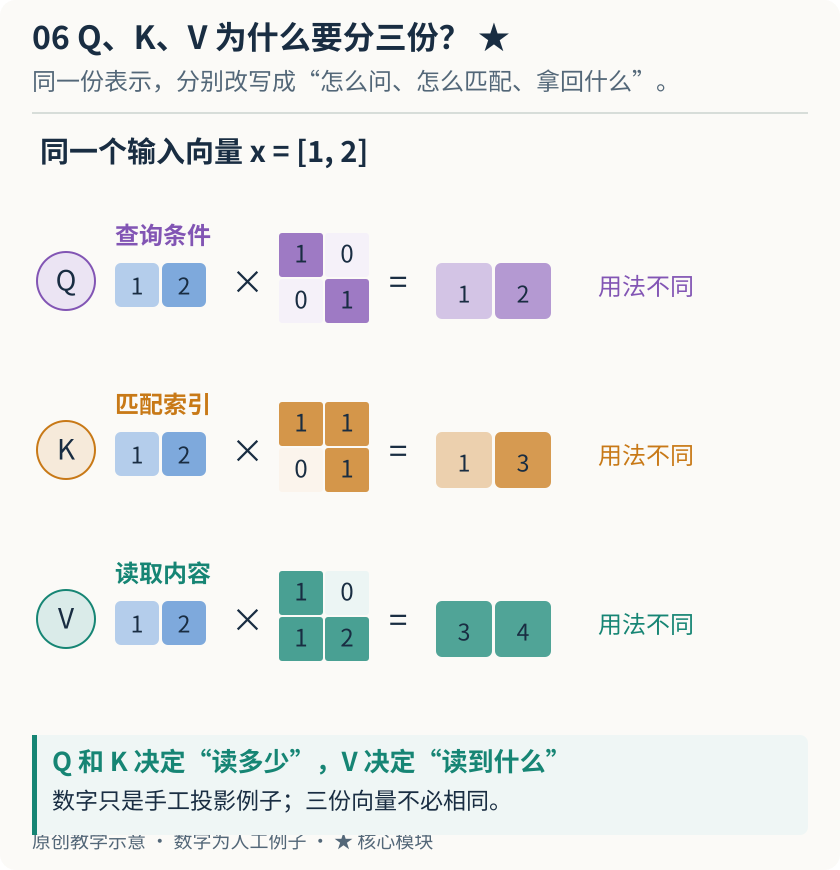

```text
Q = H W_Q       K = H W_K       V_value = H W_V
```

这里 `W` 是模型已经学好的计算系数；后面每次输入算出的“注意力权重”则是本轮的读取比例。两者都可能被叫作权重，但不是同一个对象。

**图意解读：** 每行都从同一个 [1,2] 出发，乘的矩阵不同，结果也不同。紫色 Q 用于提出查询，橙色 K 用于匹配，绿色 V 用于提供被汇总的内容。把三行分开画，是为了看清“同一份表示可以改写成三种用途”，不是声称每个数都对应一个可命名的语义。

可以把 Q 理解为“当前位置要找什么”，K 为“各位置以什么特征参与匹配”，Value 为“匹配后拿回什么内容”。真正的计算是向量点积和加权求和，没有人为指定“这一维专门表示主语”。深层的 Q/K/V 由当前层隐藏状态生成，不是每一层都从原始 Embedding 重算。

**为什么拆成三份？** 像检索资料时，“我的检索条件”“每份资料的索引”“最后读到的内容”不需要采用同一套表达。Q/K 可以专注于匹配，Value 可以保留适合传递的内容。同一个 token 在查询者和被查询者的位置上也可以使用不同投影。模型并非必须使用三个完全无关的数据源，而是在同一份表示上学习三种用途。

### 5.2 一次缩放点积注意力分四步

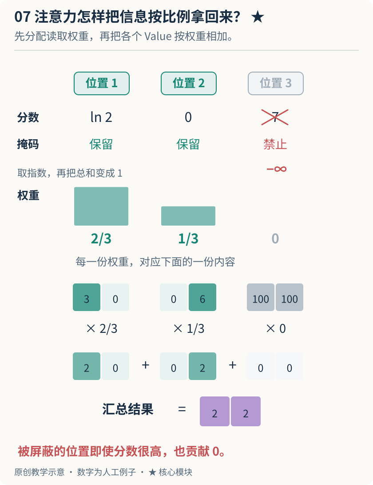

**深入看计算（首次可跳过）：**

```text
Scores = Q Kᵀ / √d_k
A      = softmax(Scores + M, axis=Key位置)
Output = A V_value
```

**第一步：打分。** 每个 Query 与每个 Key 点积，得到一个位置对位置的分数表。它还不是概率。

**第二步：缩放并加掩码。** `√d_k` 中的 `d_k` 是每个头的 Q/K 维度。直观上，特征维度增加会让点积的波动更大，缩放有助于控制分数尺度。掩码负责排除不合法的读取位置，与缩放目的不同。

可以把点积想成“许多项评分相加”。若每项都是近似独立、均值 0、方差 1 的贡献，`d_k` 项之和的标准差约为 `√d_k`，所以用这个量缩放。此假设用于解释设计动机，不保证真实激活严格满足它。Softmax 会对分数差做指数放大：`[1,2]` 对应约 `[0.27,0.73]`，而 `[10,20]` 几乎全押在第二项。缩放避免仅因维度变化就把这种竞争过度放大。

**第三步：按每行做 Softmax。** 对一个 Query，把所有允许 Key 的分数转换为非负权重。在推理时、没有 attention dropout 且至少有一个合法 Key 的条件下，一行权重之和为 1。

它像把总量固定的“读取份额”分给候选位置。份额多的位置，在加权求和中乘的系数更大；所有合法位置参与同一次竞争。这个份额是每个 Query、每个头各算一份，不是整条句子只分配一次。

**第四步：按权重汇总 Value。** 每个 Query 产生一个输出向量，而不是直接选出一个词。

**图意解读：** 从上往下按列追踪一个位置：第三列分数原本是 7，却被掩码挡住，下面权重和贡献都变为 0。前两列分别拿到 2/3 和 1/3 的份额，把 [3,0] 和 [0,6] 加权后变成 [2,0] 与 [0,2]，最后相加得到 [2,2]。图中柱高表示读取比例；它是人工算例，不是词义解释。

### 5.3 一个可以手算的例子

假设某个 Query 对三个 Key 的**缩放后分数**是 `[ln 2, 0, 7]`，第三个位置被屏蔽。对应 Value 是 `[3,0]`、`[0,6]`、`[100,100]`：

```text
加掩码后：[ln 2, 0, -∞]
指数值：  [2,    1,  0]
权重：    [2/3, 1/3, 0]
输出：    (2/3)[3,0] + (1/3)[0,6] + 0[100,100] = [2,2]
```

第三个分数原本很高，仍然不能影响结果。**把禁止位置的分数置为 0 不等于屏蔽，因为 `exp(0)=1`。** 在数学表示中用 `−∞`；具体内核可能用布尔掩码或等价的数值处理。

### 5.4 多头注意力：并行的不同投影空间

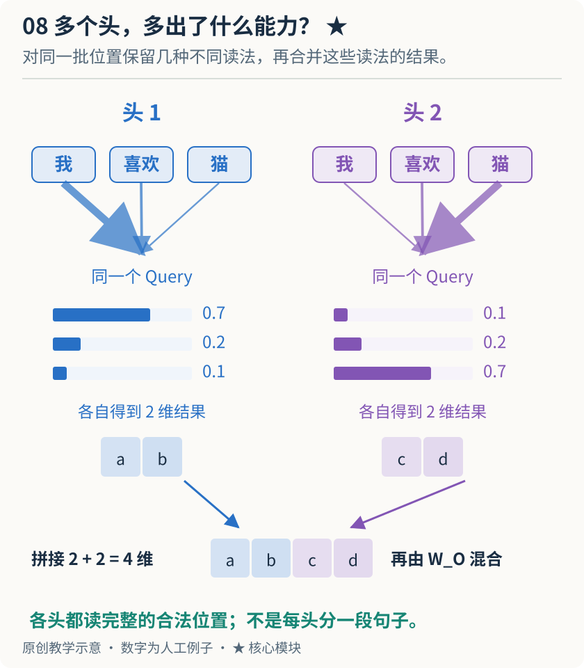

```text
head_i = Attention(H W_Q_i, H W_K_i, H W_V_i, M)
MHA(H) = Concat(head_1, ..., head_h) W_O
```

**图意解读：** 左右两头面对同一批“我 / 喜欢 / 猫”，但线宽和权重条展示两份不同的读法。每头保留自己的两维结果，下方把两条带接成四维，再交给输出投影混合。两头没有分割句子，也没有预设固定的语法或语义职责；权重为人工示例。

**为什么不只用一个头？** 一个头对当前 Query 形成一份读取权重；多个头可以形成多份不同的权重，在汇总前保留几种关系的结果。像同时用多组检索条件读同一批资料，再汇总各组摘要。不同头不保证真的分工明确，但架构给了它们分别选择读取方式的空间。标准 MHA 常把固定总宽度分给各头，因此增加头数不等于每个头都复制一份完整 `d` 维计算。

用 `B=1, T=4, d=8, h=2, d_k=d_v=4` 跟踪形状：

| 步骤 | 形状 | 含义 |
| --- | --- | --- |
| 输入 | `[1,4,8]` | 4 个位置，每个 8 维 |
| Q/K/V 投影并分头 | 各为 `[1,2,4,4]` | 2 个头，每头处理全部 4 个位置 |
| 每头分数与权重 | `[1,2,4,4]` | 最后两个 4 分别是 Query 数、Key 数，不是特征维度 |
| 权重乘 Value | `[1,2,4,4]` | 最后一个 4 重新成为每头 Value 维度 |
| 拼接、输出投影 | `[1,4,8]` | 回到可以与输入做残差相加的形状 |

这个例子恰好多个维度都等于 4，不代表它们是同一个轴。交叉注意力会用不同源、目标长度把这个区别显露出来。工程实现可以一次大投影后 reshape 分头，数学含义不变。

“某个头专门学语法、另一个专门学语义”只是可能的观察，不是架构承诺；注意力权重也不能单独当作完整因果解释。[计算定义：原论文 §3.2](https://arxiv.org/html/1706.03762v7#S3.SS2)

## 6. ★ 填充掩码：不让占位符成为有效信息源

**先看懂用意：** PAD 是为了把长度摆齐而塞入的空位。Padding mask 让这个空位不再分走有效内容的读取份额。

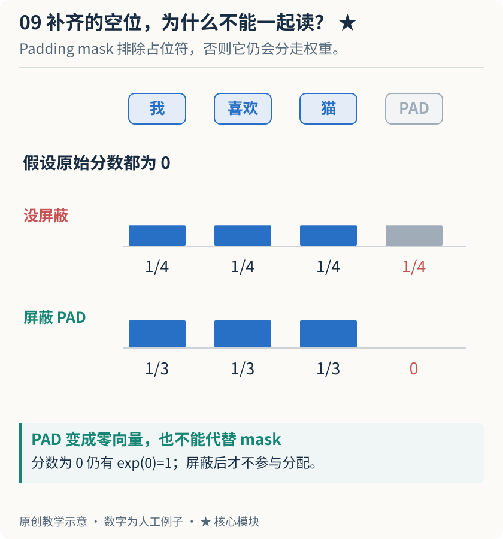

**人话版：** 为了把不同长度的序列装进同一批次，可能需要补 PAD。Padding mask 告诉注意力：“这里是占位，不要把它当作内容读回来。”

**图意解读：** 上方灰色格是 PAD。假设四个读取分数相同，没有屏蔽时，它仍分到 1/4，挤占有效位置的份额；屏蔽后 PAD 为 0，三个有效位置各分到 1/3。本图展示一个有效 Query 的权重变化，不代表 PAD Query 的输出也被自动清零；输出时仍要选有效位置。

### 6.1 为什么零向量不够

即使把 PAD 的 Embedding 固定为零，加入位置编码、带偏置的投影或经过残差后也不保证一直为零。即便 Key 恰好为零，点积分数为零仍会参与 Softmax 分母，使有效位置权重改变。**“没有语义”必须通过可见性规则表达，不能只靠数值碰巧为零。**

### 6.2 三处注意力要屏蔽对应来源的 PAD

| 注意力位置 | Query 来自哪里 | Key/Value 来自哪里 | 要屏蔽哪里的 PAD |
| --- | --- | --- | --- |
| Encoder self-attention | 源序列 | 源序列 | 源 Key 位置 |
| Decoder self-attention | 目标前缀 | 目标前缀 | 目标 Key 位置，另叠加因果限制 |
| Encoder–Decoder cross-attention | 目标侧中间表示 | Encoder 源表示 | 源 Key 位置 |

### 6.3 掩码接口里的 True 不是统一含义

本文只使用加法语义：允许项是 `0`，禁止项是 `−∞`。真实 API 必须看定义：在所读 PyTorch 文档中，`MultiheadAttention` 的布尔 mask 用 `True` 表示忽略/禁止，而 `scaled_dot_product_attention` 的布尔 `attn_mask` 用 `True` 表示允许参与。不能直接在这两个接口之间照搬布尔张量。[官方 MHA](https://docs.pytorch.org/docs/2.14/generated/torch.nn.MultiheadAttention.html)、[官方 SDPA](https://docs.pytorch.org/docs/2.14/generated/torch.nn.functional.scaled_dot_product_attention.html)

**排障提示：** 对需要产生有效结果的 Query，不应制造整行全为禁止项的情况；数学上的全 `−∞` Softmax 没有有效分布，不同内核对它可能有专门处理。批次中的 padding 查询行，应遵循具体实现的约定，不能假设一律输出零或一律产生 NaN。

## 7. ★ 残差连接与层归一化：每个子层周围都在发生

**先看懂用意：** 每次加工既要保留已有表示，也要控制数值尺度。残差负责相加保留，LayerNorm 负责整理每条数字带的刻度。

这两个模块不是 Encoder 末尾才做一次。经典结构在每个 Attention 和 FFN 子层之后都安排一套，所以先拆开理解，再把它们放回完整层。

### 7.1 残差连接：保留输入，再加上新计算

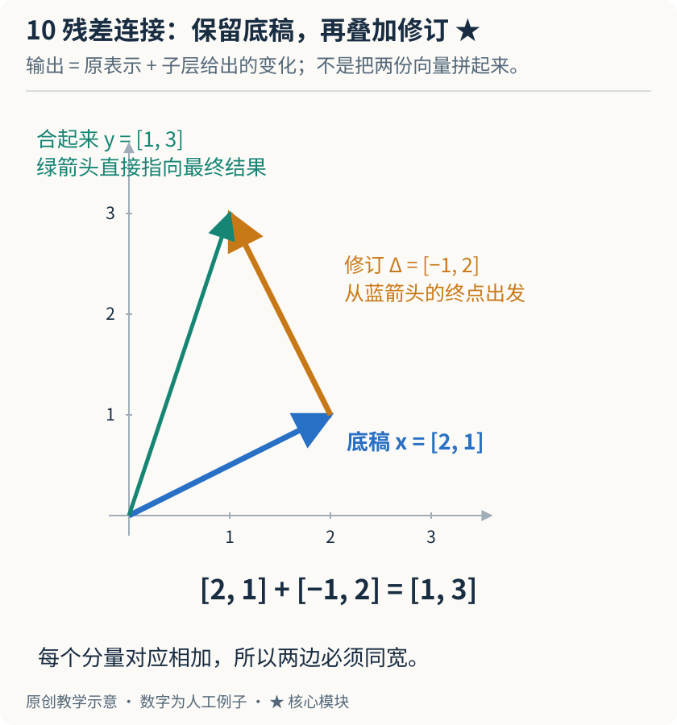

```text
y = x + F(x)
```

**人话版：** 子层可以只学习“在原表示上应该改多少”，不用每次重新制造一份完整表示。在推理中，这是一条保留已有表示的直接通路，执行的是逐元素相加。

**图意解读：** 蓝箭头是原表示 [2,1]，橙箭头从它的终点开始叠加 [-1,2]，绿箭头直接指向最终 [1,3]。首尾相接把“保留原值再加修订”画成了几何动作；实际计算对每个分量分别相加。修订不保证很小，后续归一化也仍会继续改变数值。

可以把它理解成**在底稿上叠加修订量**：底稿通过旁路保留下来，子层贡献一份修订。好处是每个子层不必把所有已有信息重新搬运一遍；它可以集中表达增量变化。这个比喻不意味着真实网络一定只做很小的修订，也不保证后续归一化仍保存底稿的原始数值。

小例子：`x=[2,1]`，`F(x)=[-1,2]`，则和为 `[1,3]`，与图中的三根箭头对应。若子层输出接近零，残差加法的输出就接近输入；如果后面还有 LayerNorm，整个子层包装的最终输出仍会再被归一化。

### 7.2 LayerNorm：每个 token 内部整理特征尺度

先把“均值”理解成这排数的平均值，把“标准差”理解成它们分散得有多开：先把中心移到零附近，再按分散程度调整尺度。每个 token 用自己的数字来算这两件事。

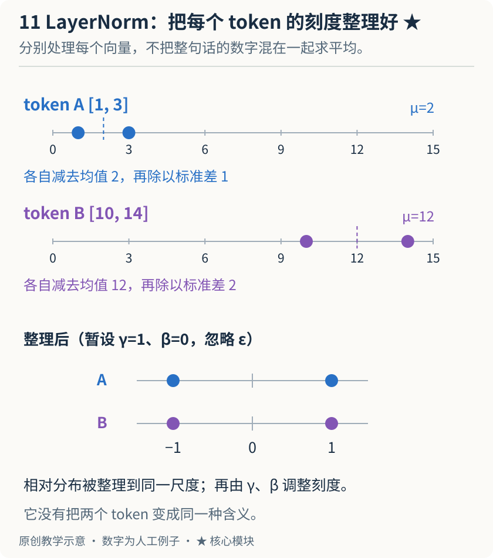

**深入看计算（首次可跳过）：**

对一个 token 的向量 `x∈R^d`：

```text
μ    = (1/d) Σ_j x_j
σ²   = (1/d) Σ_j (x_j - μ)²
LN(x)= γ ⊙ (x - μ) / √(σ² + ε) + β
```

**图意解读：** 上面两条数轴分别属于两个 token：A 是 [1,3]，B 是 [10,14]，偏移和幅度都不同。各自减掉自己的均值、除以自己的标准差后，下方两行都落在 [-1,1]。这是为了展示尺度整理，暂设 γ=1、β=0 并忽略 ε；真实不同 token 并不都会得到相同向量。

例如 `x=[1,3]`，均值 2、方差 1；忽略 `ε`，归一化中间结果为 `[-1,1]`。再乘 `γ`、加 `β` 后，最终输出并不要求严格保持零均值、单位方差。它也不会变成概率向量。[定义来源：Layer Normalization](https://arxiv.org/abs/1607.06450)

**为什么要归一化？** 把各层想成连续加工信号的设备：前一道输出的整体偏移和幅度会变化，直接交给后一道可能改变它的工作尺度。LayerNorm 先整理这一个 token 内的相对分布，再由 `γ、β` 调整适合本层的刻度。它不是给所有 token 统一词义，也不是保留所有原始幅度信息的无损变换；它提供的是受控的特征尺度。正常推理时，这仍是模型计算不可省略的一部分。

| 操作 | 看哪些数 | 解决什么问题 |
| --- | --- | --- |
| LayerNorm | 单个 token 的特征向量 | 调整特征尺度，使用本次输入自己的统计量 |
| BatchNorm | 沿 batch 等轴聚合，具体依布局定义 | 使用不同的统计机制；不能直接等同于 LayerNorm |
| Attention Softmax | 一个 Query 对各个 Key 的分数 | 形成读取位置的权重 |
| 词表 Softmax | 一个位置对词表候选的 logits | 形成候选 token 的概率 |

### 7.3 Post-LN 与 Pre-LN：顺序必须标清楚

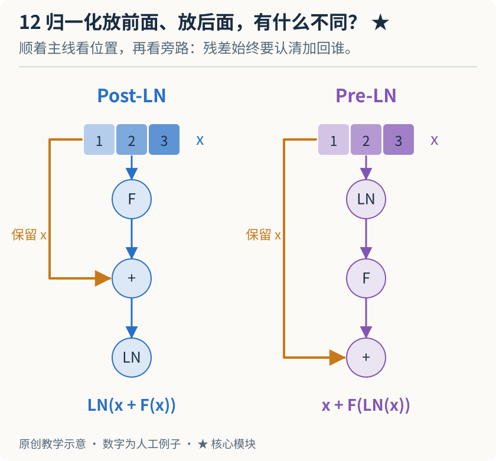

```text
经典 Post-LN：y = LN(x + F(x))
另一种 Pre-LN：y = x + F(LN(x))
```

**图意解读：** 把 F 看成一次 Attention 或 FFN 加工。左侧先加工、加回 x，再做 LN；右侧先对送入 F 的分支做 LN，再加回原 x。橙色旁路让你始终能追踪“加回来的是哪份表示”。它说明结构顺序，具体 LayerNorm 或 RMSNorm 仍取决于模型。

本文第 1–14 节的经典主线使用 Post-LN；第 15 节才切到一种常见 Pre-RMSNorm 示例。**不要既照经典图在子层后做 LN，又照另一张图在子层前加 LN，却没有注明模型发生了变化。**

**补充：RMSNorm。** 它使用均方根缩放，常见形式是 `γ ⊙ x / √(mean(x²)+ε)`，不减均值，通常没有 LayerNorm 那样的偏移项。它是另一种归一化，不是 LayerNorm 的简称。[RMSNorm 论文](https://arxiv.org/abs/1910.07467)

## 8. ★ FFN：交换完信息，再加工各位置的特征

**先看懂用意：** 拿到上下文后，还要加工每个位置内部的特征。FFN 先展开更多组合，经过非线性，再汇总回原宽度。

FFN 全称 **Feed-Forward Network，前馈网络**。这里可以把它看成一个“特征加工器”：一条数字带进去，经过几次计算，仍输出同样宽的一条带。经典结构中的 ReLU 是一种简单非线性——负数变成零，正数保留；它不是把所有输入按一个固定比例缩放。

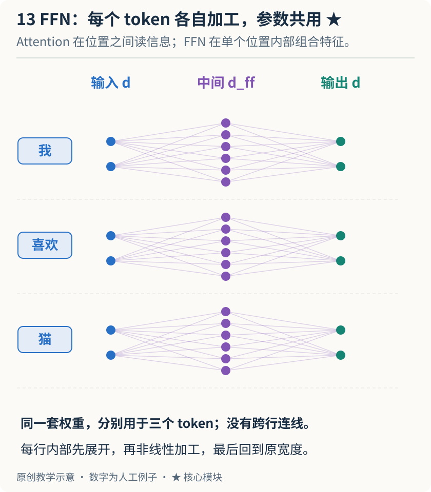

**人话版：** Attention 让位置之间交换信息；FFN 对每个位置拿到的结果进一步做非线性加工。两个模块职责不同，只有 Attention 不能代表完整 Transformer 层。

**深入看计算（首次可跳过）：**

经典形式：

```text
FFN(x) = ReLU(x W₁ + b₁) W₂ + b₂
W₁: [d, d_ff]        W₂: [d_ff, d]
形状：[B,T,d] → [B,T,d_ff] → [B,T,d]
```

**图意解读：** 每一行对应一个 token，一个圆点表示一个特征通道里的数，圆点数量展示内部先变宽再变窄。所有连线都留在本行内，因此 FFN 不读取别的 token；三行使用同一套参数。这里节点数只是宽度示意，不是某个模型的实际隐藏维度。

为什么需要中间非线性？若没有 ReLU 等激活，两次线性/仿射变换可合并成一次，表达能力不会因堆叠这两次变换而获得同样的非线性扩展。原论文基础配置用 `d=512, d_ff=2048`，比例 4 只是该配置，不能套到所有模型。[原论文 §3.3](https://arxiv.org/html/1706.03762v7#S3.SS3)

### 8.1 为什么先升维，再降维

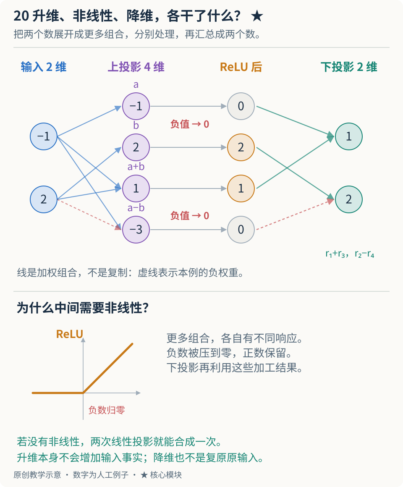

把一层的 `d` 维表示看作一张固定宽度的工作台。**上投影**把同一份输入展开成更多“候选特征通道”，中间激活分别对这些通道做非线性处理，**下投影**再把这些结果按需组合回固定宽度，交给下一层。

为什么不直接在 `d` 维里处理？中间有更多通道，就能同时形成更多不同的线性组合，并给它们分别配置非线性响应，提供更大的表达容量。但更宽会增加参数、计算和中间激活成本，因此 `d_ff` 是容量与成本之间的设计选择，绝不是越大就必然越好。

为什么要降回来？一是残差 `x + FFN(x)` 需要相同宽度；二是让各层保持统一的接口。如果永久把整个隐藏状态从 `d` 扩成 `4d`，后续投影、激活乃至注意力相关存储的成本都会扩大。只在 FFN 内部变宽，可以把额外容量集中放在这个子层，而不是让后续所有模块都处理同样宽的表示。

**图意解读：** 沿圆点中的数字看一次 2→4→4→2：[-1,2] 先展开为 [-1,2,1,-3]，ReLU 把两个负值压到零，再用剩余通道组合成 [1,2]。上投影增加可加工的组合，非线性改变响应方式，下投影负责汇总；并没有凭空增加输入事实。底部折线把“负值归零、正值保留”画出来；虚线权重在本例中为负。

### 8.2 手算：升维没有凭空增加信息，非线性改变了可表达的函数

设输入 `x=[a,b]`，人为选择上投影，使它产生四个通道：

```text
上投影：u = [a, b, a+b, a-b]
激活：  r = [max(0,a), max(0,b), max(0,a+b), max(0,a-b)]
下投影：y = [r₁+r₃, r₂-r₄]

若 x = [-1,2]：
u = [-1,2,1,-3]
r = [0,2,1,0]
y = [1,2]
```

四个中间通道都由原来的 `a,b` 算出，没有获得输入之外的新事实。纯线性升维后的向量仍落在至多二维的线性子空间里；带偏置时对应仿射子空间。但经过 ReLU，`a>0`、`b>0`、`a+b>0`、`a-b>0` 等不同条件可以分别影响结果，再由下投影汇总，这就能形成一层线性映射无法表达的分段非线性关系。

如果去掉激活，上面的输出会退化成：

```text
y = [a+(a+b), b-(a-b)] = [2a+b, 2b-a]
```

完全可以用一次 2 → 2 的线性变换完成。更一般地，`(xW₁+b₁)W₂+b₂ = x(W₁W₂) + (b₁W₂+b₂)`。所以关键收益来自**足够宽的中间表示与非线性共同作用**，而不是仅仅把数字个数变多。

也可以用本例检查它不再是线性函数：网络对 `[1,0]` 输出 `[2,-1]`，对 `[-1,0]` 输出 `[0,0]`；二者之和不是对 `[0,0]` 的输出 `[0,0]`。它不满足线性映射的可加性。

### 8.3 补充：门控 FFN 与 SwiGLU

忽略偏置的一种常见写法是：

```text
SwiGLU(x) = [SiLU(x W_gate) ⊙ (x W_up)] W_down
```

两条投影分支逐元素相乘后降回 `d` 维。门控使一个分支调制另一个分支，不是让 token 去读取别的位置。其宽度和参数量不能直接用经典两矩阵 FFN 的 4 倍规则估算。[GLU Variants Improve Transformer](https://arxiv.org/abs/2002.05202)

可以把 `up` 分支理解为产生候选内容，`gate` 分支为各通道提供随输入变化的调制系数，`down` 分支负责汇总。这里的门不是一定为 0/1 的开关；SiLU 输出也不保证落在 `[0,1]`，因此不能直接叫作“通过概率”。

### 8.4 几种常见投影，不要只按名字判断功能

| 投影 | 常见形状 | 为什么这样设计 |
| --- | --- | --- |
| Q/K/V 投影 | `d → h×d_head`，标准 MHA 中常与 `d` 相等 | 把当前表示改写为查询、匹配、内容三种用途；不一定改变总维度 |
| FFN up / down | `d → d_ff → d` | 在内部增加非线性特征容量，再回到层间统一宽度 |
| Attention 输出投影 `W_O` | `h×d_v → d` | 混合各头结果；输入输出同宽时仍有作用，不一定叫降维 |
| LM Head | `d → V` | 给词表里的各个候选打分；虽然通常变宽，但它不承担 FFN up 的职责 |

### 8.5 ★ MoE：把一个加工台换成多个可选专家

**先看懂用意：** 普通 FFN 让所有 token 使用同一套加工参数。如果想让模型拥有更多参数，又不想每处理一个 token 都把新增参数全部算一遍，可以准备多套 FFN，由一个小的分配器为当前 token 选少数几套执行，再把结果汇总。这就是本文讨论的**稀疏混合专家，Sparse Mixture of Experts（MoE）**。

把它想成一个有多个加工台的工作间：每个加工台都有不同工具和处理方式；分配员先看这份材料，再挑少数几个加工台。**专家就是各自有参数的 FFN，Router（路由器）就是分配器。** 这个比喻帮助理解分工，不能据此认定某一专家固定负责“数学”、另一位固定负责“中文”。真实路由取决于当前隐藏表示。

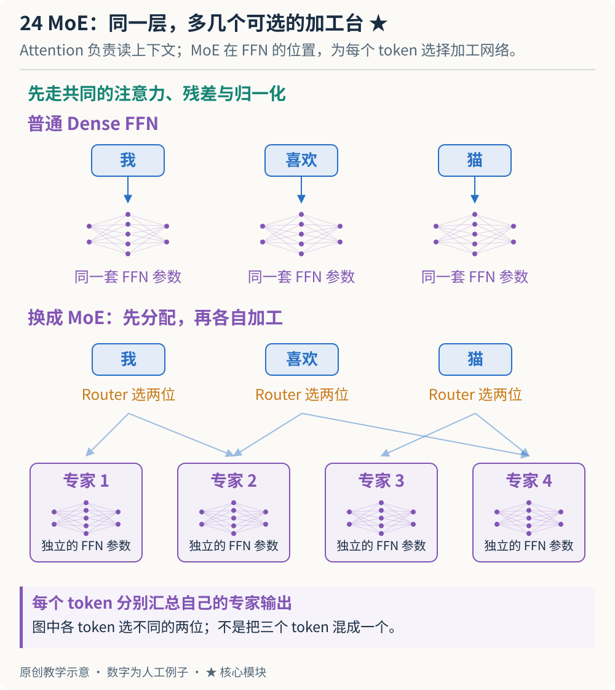

**图意解读：** 上半图的三个小网络代表同一套 Dense FFN 参数在不同 token 上重复使用。下半图的四位专家各有自己的参数，“我”“喜欢”“猫”分别被分配到两位专家；每个 token 最后只汇总属于自己的结果。线条表示本例的分配关系，不表示 token 之间交换内容。

在常见 Transformer MoE 中，**替换的是 FFN 子层**。例如原来 `x → FFN → 残差相加 → LN`，替换后是 `x → MoE → 残差相加 → LN`；Pre-Norm 结构则保留它原有的归一化位置。Attention、残差和归一化照常存在。专家内部还可以用 SwiGLU 等门控 FFN；专家内部的通道门控，与 Router 在专家之间选择，是两层不同的决定。[Mixtral §2.1](https://arxiv.org/html/2401.04088v1#S2.SS1)

### 8.6 ★ 路由手算：同一个 token 怎么选专家、怎么合并

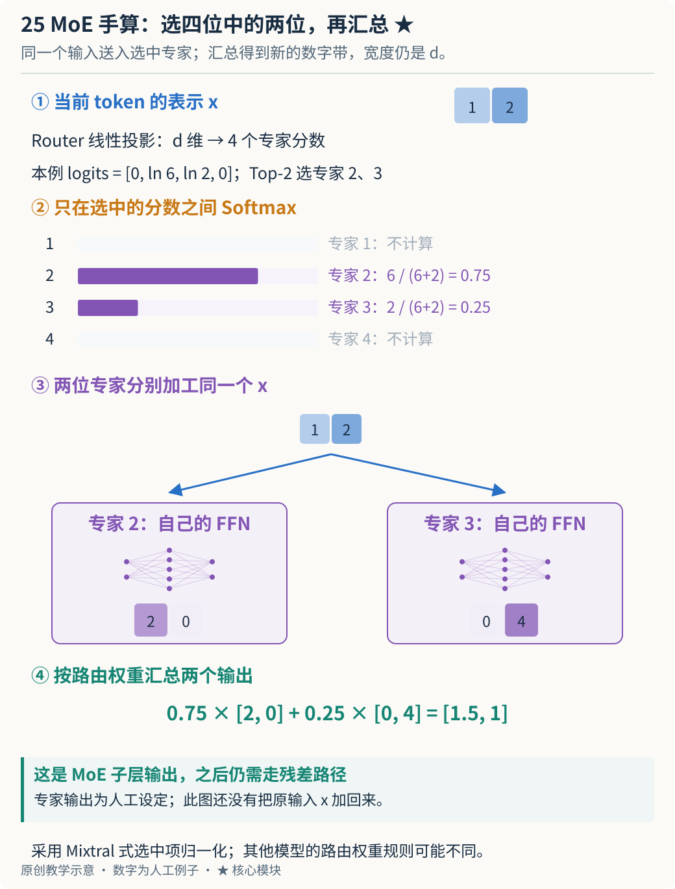

**人话版：** Router 只负责“派给谁、各占多少”，选中的专家才实际加工特征。多个专家收到的是同一个 token 的当前表示，输出也各是一条同样宽度的数字带。

下面采用与 Mixtral 类似的“先保留 Top-k 分数，再对选中项做 Softmax”规则。**专家数、分数和输出均为人工教学例子，不是 Mixtral 的实测输出。** 假设当前表示 `x=[1,2]`，共有四位专家，每次选两位：

| 步骤 | 本例发生了什么 | 为什么需要它 |
| --- | --- | --- |
| Router 打分 | 线性映射 `d → n_exp`，得到 `[0, ln 6, ln 2, 0]` | 对每位专家给出一个候选分数 |
| Top-2 选择 | 选中专家 2、3，未选项视作 `−∞` | 只执行少数专家的 FFN |
| 选中项归一化 | 权重为 `[0, 0.75, 0.25, 0]` | 决定各专家结果如何组合；`6/(6+2)=0.75` |
| 分发与加工 | 专家 2、3 都接收 `x`；假设分别输出 `[2,0]`、`[0,4]` | 不同参数可给出不同加工结果 |
| 加权汇总 | `0.75×[2,0] + 0.25×[0,4] = [1.5,1]` | 汇总回一条 `d=2` 维表示，交给后续模块 |

**图意解读：** 先看四条权重条，只有两条非零；再沿两条分支看，同一输入进入两个专家，各自产生结果；最下面按坐标相加，没有把两个输出拼成四维。图中的 `[1.5,1]` 只是 MoE 输出，还没有加回残差。若采用本节 Post-LN 包装，则先得到 `x + MoE(x) = [2.5,3]`，之后才做 LayerNorm。

**深入看计算（首次可跳过）：**

```text
x 的形状：[d]
Router 参数 W_r：[d, n_exp]
路由分数 s = x W_r：[n_exp]
selected = TopK(s, k)
g_i = exp(s_i) / Σ_{j∈selected} exp(s_j)   （i∈selected）
g_i = 0                                 （其他专家）
MoE(x) = Σ_{i∈selected} g_i · Expert_i(x)  # 输出仍是 [d]
```

不要把这一种权重规则当成 MoE 的统一定义。例如 Switch 使用 Top-1，保留相应路由概率来缩放专家输出；不能套用上面的选中项归一化后就断言“单专家权重必定为 1”。有些模型还增加始终执行的共享专家，应按具体模型说明区分。[Switch 的路由伪代码，Figure 15](https://arxiv.org/html/2101.03961v3#A6.F15)

### 8.7 ★ 为什么专家更多，单 token 计算却不必同比增加

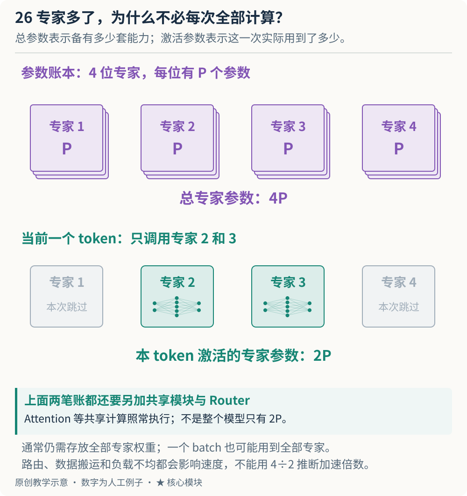

**先看懂用意：** 备有更多工具，不代表每次都把所有工具用一遍。MoE 让“模型存有多少参数”和“当前 token 用到多少参数”成为两笔不同的账。

**图意解读：** 上排四叠卡片都存在，代表全部专家参数；下排只有两位亮起，代表这一次被调用的专家。灰色专家只是本次跳过，没有从模型中消失。另一个 token 或另一个 batch 可能调用它们。

为避免混淆，先假设模型只有一个 MoE 层，用同样大小的专家手算；多个 MoE 层时再逐层累加。设每位专家有 `P` 个参数，共 `n_exp=4` 位，每个 token 选 `k=2` 位；把共享 Attention、Embedding、输出头等及 Router 的参数合计记为 `C`：

```text
模型总参数账本：             C + 4P
单 token 激活参数的常用账本：C + 2P
```

第二行是常见的模型规模口径，并非硬件实际读取了哪些字节的逐项测量；例如 Embedding 只查选中行，缓存也会改变实际计算。更严格地，只看这层专家 FFN，存有 `4P`、本 token 选用 `2P`，关系就很清楚。

相比同样大小的**单个** FFN，调用两个专家仍可能多做计算；MoE 的价值是扩大可选参数容量时，不要求每个 token 都执行全部专家。它也不等于把整个隐藏向量永久升维：每个专家内部可以升降维，MoE 汇总后仍保持层间的 `d` 维接口。

**实际速度还受什么影响？** 路由器要打分，输入需要按专家整理，输出要送回原 token 的位置；专家分在不同设备上时，还会有通信。如果很多 token 都选择同一专家，负载也可能不均。因而 `4P / 2P` 不能直接变成两倍加速；通常也仍需在设备、主存或其他权重存储中容纳全部专家，而非只保留当前两位。[Mixtral §2.1 与 §3](https://arxiv.org/html/2401.04088v1)

### 8.8 把 MoE 与已经学过的模块分清楚

| 容易混淆的概念 | 区别在哪里 |
| --- | --- |
| 多头注意力 vs 多专家 | 多头分别读取 token 位置，再拼接投影；这里的稀疏 MoE 选择若干独立 FFN，加工同一个 token，再加权求和。 |
| 一个专家 vs 一个完整大模型 | 这里每位专家是某层的 FFN，并没有自己的整套 Tokenizer、Attention 和生成循环。 |
| 专家分配 vs 专家“擅长的领域” | 不能只凭名字给专家贴学科标签；Mixtral 的分析未发现明显按主题分工的模式。[论文 §5](https://arxiv.org/html/2401.04088v1#S5) |
| 同一 token 的不同层 | 每层有自己的路由与专家参数；同一个位置到下一层时，表示变化，可以选另一组专家。 |
| Router Top-k vs 生成 Top-k | 前者选加工网络；后者在词表候选中限制采样范围。 |
| MoE vs KV Cache | MoE 改变逐位置加工路径；KV Cache 复用注意力的历史 K/V。专家没有因此各自复制一套完整的注意力缓存。 |

到这里，把 Encoder 或 Decoder 层中的 FFN 换成 MoE，就能沿原来的推理主线继续读下去；并不是在生成循环之外再启动多个模型。

## 9. 拼回一个 Encoder 层，再堆成编码器

**先看懂用意：** 读懂源句并不是只算一次注意力。每层先让位置互相读，再让各位置独立加工，重复后留下整排源表示。

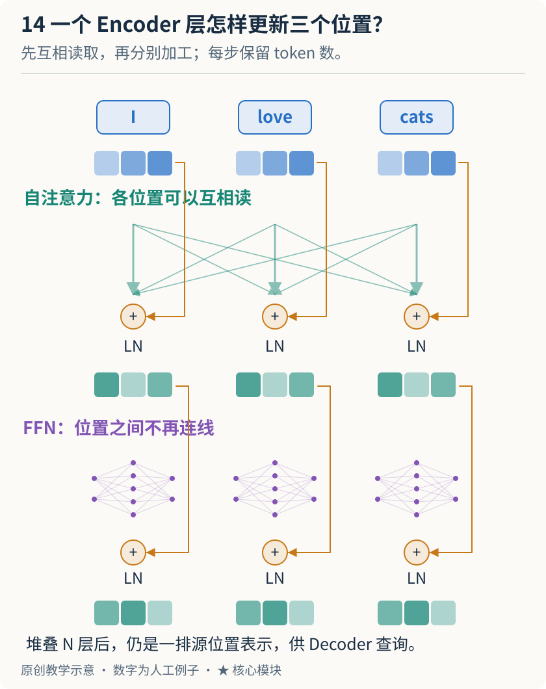

用刚学的模块，一层经典 Encoder 可以写成：

```text
U      = LN₁(H + MHA_self(H, source_padding_mask))
H_next = LN₂(U + FFN(U))
```

**图意解读：** 先看上半部分交叉连线：三个源位置互相读，输出仍各有自己的位置。再看下半部分各自的小网络：FFN 在各位置内部展开与汇总，没有跨位置连线。橙色旁路与加号标出残差，LN 整理每个位置的尺度；重复多个这样的层，得到最终源表示。

最后得到 `H_enc:[B,S,d]`。它是一串位置表示，不是强行把整句压成一个 `d` 维向量。对于 `I love cats`，每个源位置都能在双向自注意力中读到其他有效源位置，最后三个表示会包含不同的上下文关系。

**到这里先停一下：** 编码器尚未产出目标词。它提供的是后续 Decoder 可以读取的源信息。同一条固定源句在这次生成过程中通常只需编码一次；如果源输入变化，那是另一种计算条件。

## 10. ★ Decoder 的前瞻掩码：限制未来输入可见性

**先看懂用意：** 输入“我”的位置要预测它后面的 token，不能提前读取“喜欢”。因果掩码把这一位置后方的信息挡住。

### 10.1 为什么目标侧需要更严格的规则

生成“喜欢”时，只能利用已经给定的源句和目标前缀 `BOS 我`，不能提前读取目标里的“猫”。在一次处理多个已知输入位置的 Prefill 中，也要遵守各位置的因果边界，才能与逐步生成使用一致的计算规则。

前瞻掩码（look-ahead mask）、因果掩码（causal mask）通常是在说这个可见性限制。注意“前瞻”指**屏蔽前瞻**，不是允许看未来。

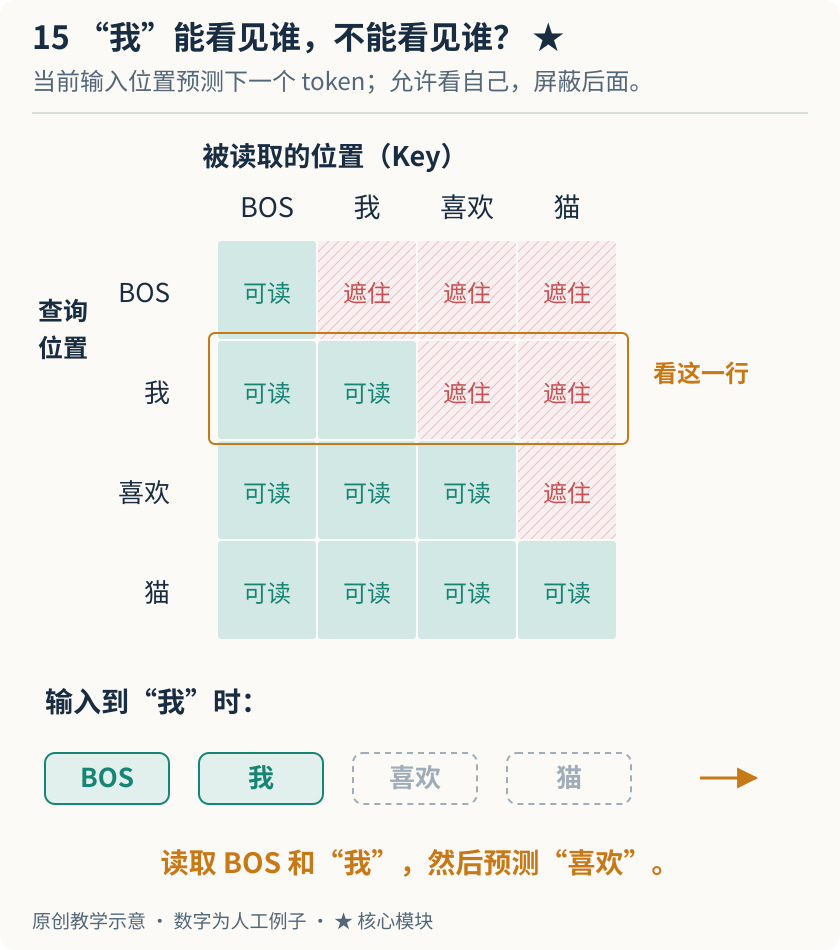

```text
行 = Query 位置 i，列 = Key 位置 j
M_causal[i,j] = 0     当 j ≤ i
M_causal[i,j] = -∞    当 j > i
```

**图意解读：** 橙框圈住“我”这一 Query 行。它可以读取 BOS 和自身输入“我”，右边的“喜欢”“猫”都被遮住；下方 token 条把这条规则换成一句话可见的样子。因此，看到当前输入不等于提前知道下一个输出。斜纹区表示禁止读取，不是 token 已从内存删除。

### 10.2 前瞻掩码与填充掩码可以同时存在

```text
允许(i,j) = (j ≤ i) AND (Key j 是有效 token)
M_total   = M_causal + M_padding    # 都采用 0 / -∞ 加法约定
```

| 对比 | 前瞻 / 因果掩码 | 填充掩码 |
| --- | --- | --- |
| 屏蔽原因 | 当前位置不该读未来位置 | 对方根本不是有效内容 |
| 是否依赖 Query 位置 | 是；不同行允许的前缀不同 | 常见 key-padding mask 对所有 Query 屏蔽同一组 Key |
| 无 PAD 时还需要吗 | Decoder 处理多位置输入时仍需要 | 可以没有 |
| Encoder 通常使用吗 | 普通双向 Encoder 通常不用 | 有 padding 就要处理 |

**增量推理的细节：** 如果本轮只有一个新 Query，Key 只包含历史和当前有效位置，根本没有未来 Key 需要屏蔽。但接口仍要对齐缓存长度与绝对位置；多 token 的 chunk 或验证批次仍需区分 chunk 内的未来位置。不能直接拿一个从零开始的 `[1,T]` 左上角三角掩码，假装新 Query 的绝对位置也是 0。

## 11. ★ 交叉多头注意力：目标侧怎样读源句

**先看懂用意：** 写到“我”以后，需要参照源句才能决定接着写什么。交叉注意力让目标侧提出查询，让源侧提供内容。

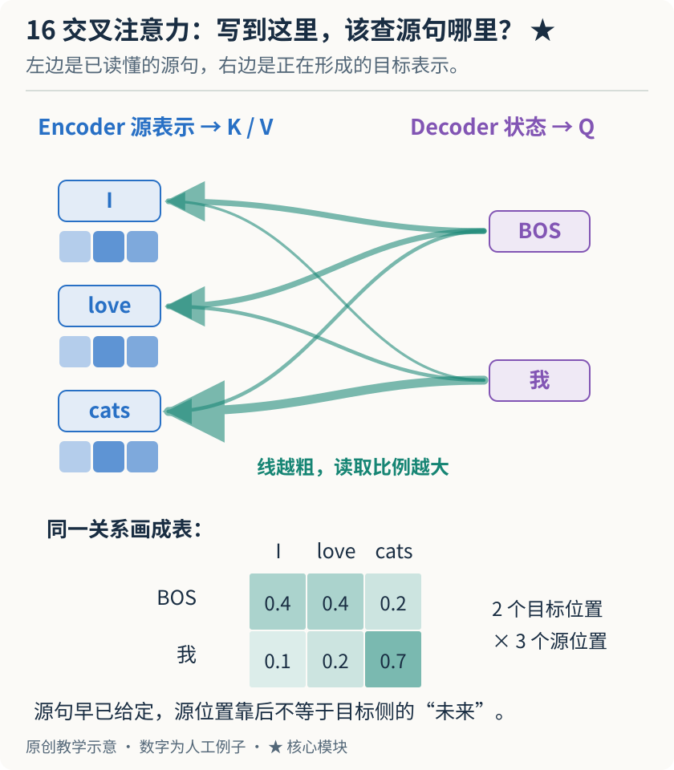

**人话版：** Decoder 先通过 masked self-attention 整理“已经写到哪里”，再带着这个状态去源句里查需要的信息。“交叉”表示 Q 与 K/V 来自不同序列；“多头”表示用多个投影子空间进行这件事。

对某个 Decoder 层，设 `U` 是其自注意力子层及残差/LN 之后的表示：

```text
Q_i = U W_Q_i
K_i = H_enc W_K_i
V_i = H_enc W_V_i
head_i = Attention(Q_i, K_i, V_i, source_padding_mask)
CrossAttn(U, H_enc) = Concat(head_1, ..., head_h) W_O
```

**图意解读：** 左边有三个源位置，右边有两个目标位置；从右侧某个 Query 沿线看，就能看到它在查询哪些源位置，粗线表示较高读取比例。下方 2×3 表格是同一组人工权重的另一种画法：每个目标位置分别分配一行份额。源与目标不需要等长，也不要求词与词按序号一对一对应。

普通离线翻译中，源句已完整给定，所以 cross-attention 通常只屏蔽源 PAD，不套目标侧的下三角限制；“源位置 3”并不是“目标位置 2 的未来”。流式输入等特殊架构可能另有限制，不在本文主线内。

所有 Decoder 层都可读取同一份**最终** `H_enc`，但每层的交叉注意力投影参数通常不同，因此每层得到的 K/V 也不同。固定源输入时，这些投影结果可以按层缓存；不能把一层的 cross-attention KV 无条件当作其他层的 KV。[经典来源：原论文 §3.2.3](https://arxiv.org/html/1706.03762v7#S3.SS2.SSS3)

## 12. 拼回一个 Decoder 层

**先看懂用意：** Decoder 一层连做三件事：整理目标前缀、查询源句、加工融合后的特征。每一步都有自己的残差和归一化。

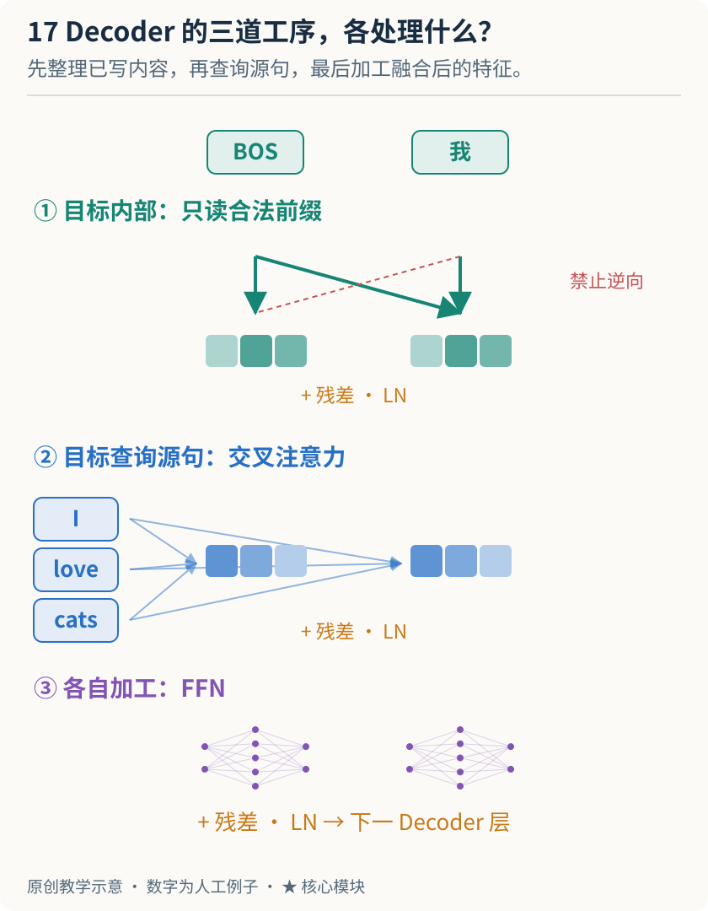

```text
U      = LN₁(H + MHA_self(H, causal_and_target_padding_mask))
Z      = LN₂(U + MHA_cross(U, H_enc, source_padding_mask))
H_next = LN₃(Z + FFN(Z))
```

**图意解读：** 第一段只有目标侧连线，红虚线表示较早位置不能读较晚位置。第二段引入左边的源表示，目标侧从这份源内容中补充信息。第三段用各自的小网络加工每个目标位置。每段后面都有自己的残差与 LN，完成后再进入下一层。

经过 `N` 层后，Decoder 的每个有效输入位置都有最终隐藏表示。在推理中，通常只用当前前缀最后一个有效位置的表示来选择下一个 token。

### 12.1 三种注意力用一张表区分

| 位置 | Q 来源 | K/V 来源 | 常见可见性 | 作用 |
| --- | --- | --- | --- | --- |
| Encoder 自注意力 | 本层源侧输入 | 同一源侧输入 | 全部有效源位置 | 源句内部交换信息 |
| Decoder 掩码自注意力 | 本层目标侧输入 | 同一目标侧输入 | 当前及更早的有效目标位置 | 整理合法生成前缀 |
| Decoder 交叉注意力 | 本层目标自注意力之后的表示 | Encoder 最终输出 | 全部有效源位置 | 把源句信息引入目标生成 |

三者都可以是多头。**自注意力 / 交叉注意力**描述数据来源，**单头 / 多头**描述投影组织方式，**因果 / 非因果**描述可见性规则；这是三个可以组合的维度。

## 13. ★ 输出层：从隐藏表示到下一个 token

**先看懂用意：** 隐藏向量本身不是一个词。LM Head 把它换成词表分数，解码策略才从候选里选出下一个 token。

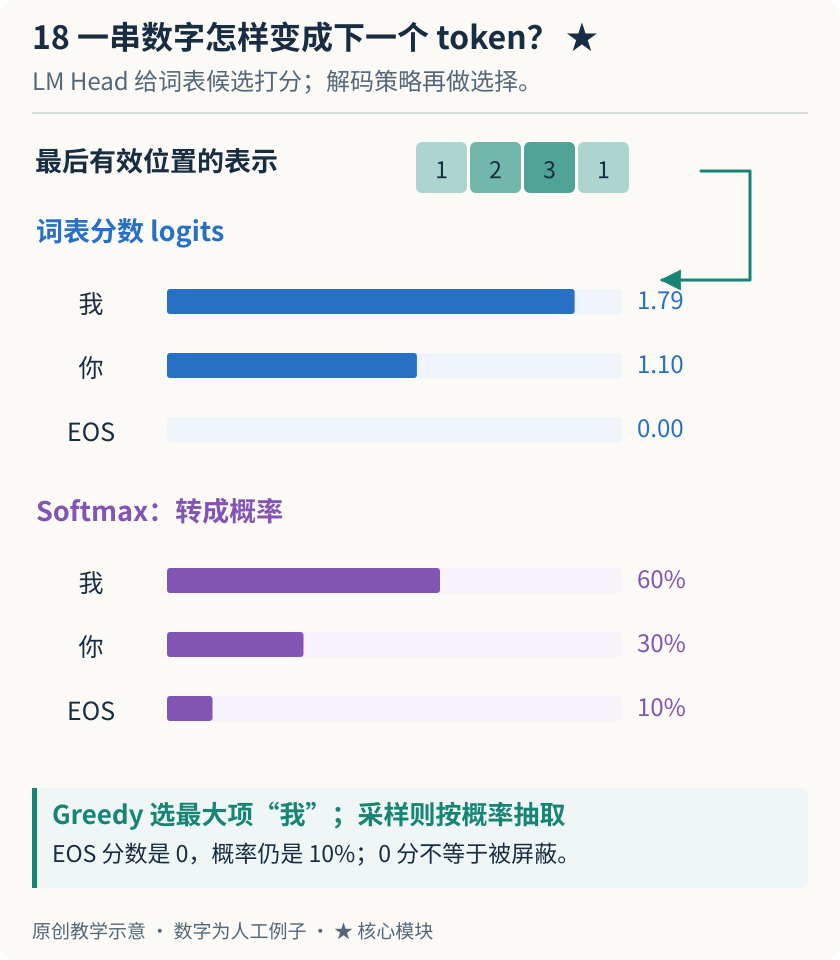

### 13.1 LM Head 先给所有候选打分

```text
h_last: [B,d]
logits = h_last W_vocab + b_vocab
W_vocab: [d,V]
logits: [B,V]
```

这里带偏置的写法用于说明一般线性层；具体模型可以省略偏置。隐藏维度 `d` 不等于词表大小 `V`，LM Head 才完成从特征空间到词表候选空间的映射。

**图意解读：** 先看蓝色词表分数，再看紫色概率条：分数 [ln 6, ln 3, 0] 变成 [60%,30%,10%]。EOS 的分数虽为 0，概率仍非零；Greedy 选最长的一条，采样则按这些比例抽取。本图仅画三个候选方便理解，真实词表更大。

### 13.2 选 token 是另一层策略

| 策略 | 怎么选 | 需要知道的边界 |
| --- | --- | --- |
| Greedy | 取最大 logit 对应的 token | 最大值和 Softmax 后最大概率位置一致，可以不显式算 Softmax |
| 温度采样 | 对 `logits / τ` 做 Softmax，再抽样，`τ>0` | 温度影响分布；不等于提升事实正确率 |
| Top-k | 只保留分数最高的 k 个候选再采样 | k 是候选数，不是生成长度 |
| Top-p | 保留按概率排序后累计达到阈值 p 的最小候选集合，再归一化采样 | 候选数可随分布变化 |
| Beam search（补充） | 维护多条候选序列，比较累计分数等指标 | 涉及序列级搜索、长度处理；不是本例单分支循环 |

采样示例：词表候选暂缩成 `[我, 你, EOS]`，logits 为 `[ln 6, ln 3, 0]`，Softmax 得到 `[0.6,0.3,0.1]`。Greedy 选“我”；随机采样不保证选“我”。真实词表远大于 3，这里只为手算。

### 13.3 补充：输出权重可以与 Embedding 共享

若输入输出使用兼容词表与维度，可以令 `W_vocab=Eᵀ`，称为 weight tying。查表是“ID → 向量”，输出头则用最终向量对词表行评分。共享权重不代表生成 token 必然等于输入 token，也不能默认不同源/目标词表总能共享。

## 14. ★ 自回归推理：一个 token 怎样接到下一轮

**先看懂用意：** 本轮刚选出的 token，要到下一轮作为输入才继续参与计算。把输出接回输入，就是自回归生成。

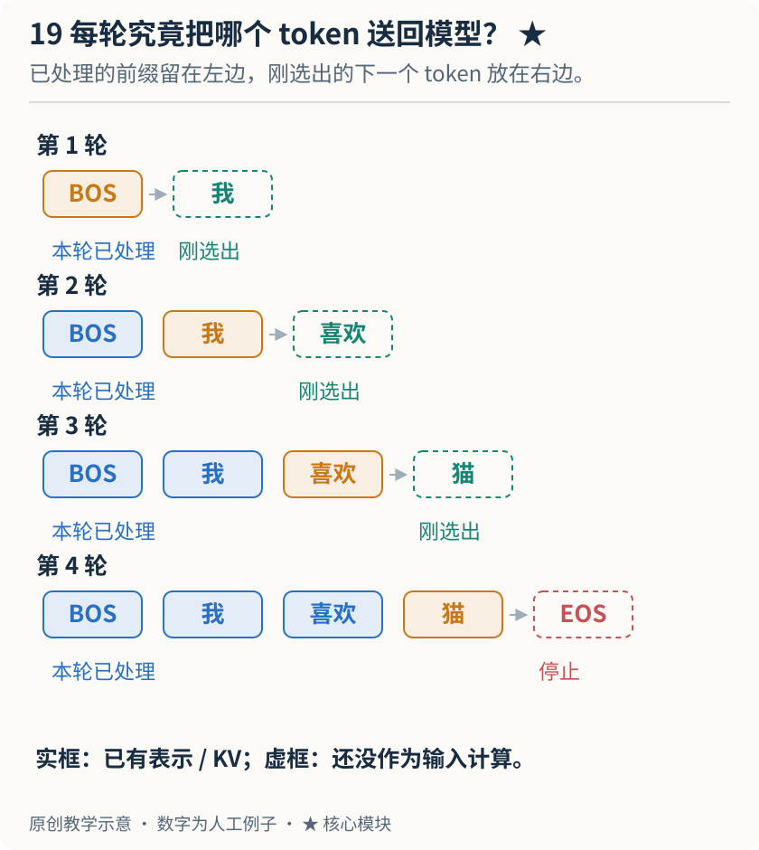

假设模型每一步刚好选择正确译文，固定源表示为 `H_enc`：

| 生成轮次 | 当前完整目标输入 | 哪个位置负责本轮预测 | 本轮选择 | 下一步 |
| --- | --- | --- | --- | --- |
| 1 | `[BOS]` | BOS | 我 | 把“我”追加到前缀 |
| 2 | `[BOS, 我]` | 我 | 喜欢 | 追加“喜欢” |
| 3 | `[BOS, 我, 喜欢]` | 喜欢 | 猫 | 追加“猫” |
| 4 | `[BOS, 我, 喜欢, 猫]` | 猫 | EOS | 生成器终止并还原文本 |

**图意解读：** 每一行是一轮。实框是本轮已经处理的输入，橙色实框标出这轮新送入的位置；最右虚框是刚选择出的下一 token。到了下一行，它才变成输入并拥有自己的表示与 KV。第四行选出 EOS 后终止，不需要再处理 EOS 来预测后继。

```text
# 概念伪代码：无缓存版本，省略 batch、长度处理和异常处理
memory = Encoder(source_ids)
prefix = [decoder_start_id]
while not reached_length_limit:
    hidden = Decoder(prefix, memory, masks)
    logits = LMHead(hidden[last_valid_position])
    token  = select(logits)
    if token in stop_token_ids:
        break
    prefix.append(token)
text = detokenize(prefix, skip_special_tokens=True)
```

停止也可能来自最大生成长度、用户取消或其他配置条件；不能把“没有生成 EOS”解释为一定无限运行。若因长度上限终止，句子也不保证语义完整。

**排障提示：** 对右侧补齐的批次，数组最后一个下标可能是 PAD，不是最后一个有效输入。应按模型/框架支持的 padding 方式处理并选对预测位置；不能对任意补齐布局一律用 `hidden[:, -1]`。

## 15. ★ 映射到 LLM：Decoder-only、KV Cache 与两个推理阶段

**先看懂用意：** 旧前缀已经算过，就把各层的 K/V 留下来。下一轮仍读取旧内容，但只补新输入的位置。

### 15.1 KV Cache 缓存什么，为什么能复用

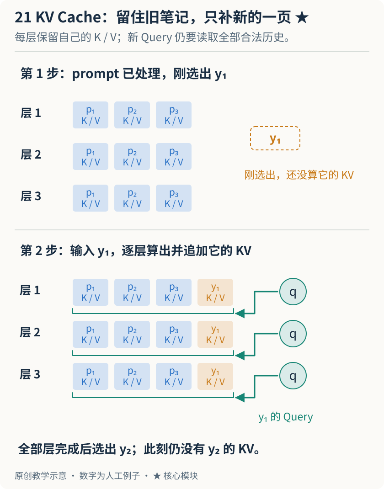

**人话版：** 因果模型里，增加未来 token 不会让已经算过的旧位置突然需要读取未来。在模型权重、位置规则、可见性等条件不变时，旧位置对应的各层 K/V 可以继续使用。

```text
第 l 层，处理当前新位置 t：
q_t, k_t, v_t = 由这一层当前输入投影得到
K_l = [K_l_past; k_t]
V_l = [V_l_past; v_t]
o_t = softmax(q_t K_lᵀ / √d_k + mask_t) V_l
```

**图意解读：** 上半图的每层只留下 prompt 三个位置的 K/V，右侧 y₁ 是刚选出的结果，还没有自己的缓存。下半图才把 y₁ 送入各层，追加橙色 K/V；绿色 Query 仍读取包含蓝色历史和橙色当前项的整段合法内容。各层各有一排缓存，不共用同一份 K/V。

对于最简单的标准 MHA、相同精度与固定长度 `T`，K/V 存储元素数近似为 `2 × N_layers × B × T × h × d_head`。这只是张量元素账本，不含分配余量；GQA/MQA 的 KV 头数、量化和滑动窗口等都会改变估算，不能套用到所有模型。

### 15.2 Prefill 与 Decode 在同一套层上做不同形状的工作

| 时刻 | 新送入模型的 token | 每层主要计算 | 完成后选择什么 |
| --- | --- | --- | --- |
| Prefill | prompt 的多个有效 token | 为多个位置执行层计算，建立 KV | 通常用 prompt 最后有效位置选择第一个新 token `y₁` |
| 第一次增量 Decode | 刚选出的 `y₁` | 新位置走完整模型，读取旧 KV 并追加自身 KV | 选择 `y₂` |
| 第二次增量 Decode | `y₂` | 同上 | 选择 `y₃` |

在首个新 token `y₁` 刚被选出时，缓存覆盖 prompt，**尚不覆盖 `y₁`**。这是理解生成时序和显存增长的关键。Prefill 也不是 Encoder 的别名；Decoder-only 也有 Prefill。

标准稠密因果注意力中，全长 `T` 的一层注意力数学分数表规模是 `T×T`；缓存增量单 Query 对历史的规模约为 `1×T`。这描述计算形状，不代表端到端耗时比例，也不表示优化内核一定把完整分数矩阵写入显存。投影、FFN、访存、批大小等同样影响运行成本。

### 15.3 Decoder-only 的完整执行图

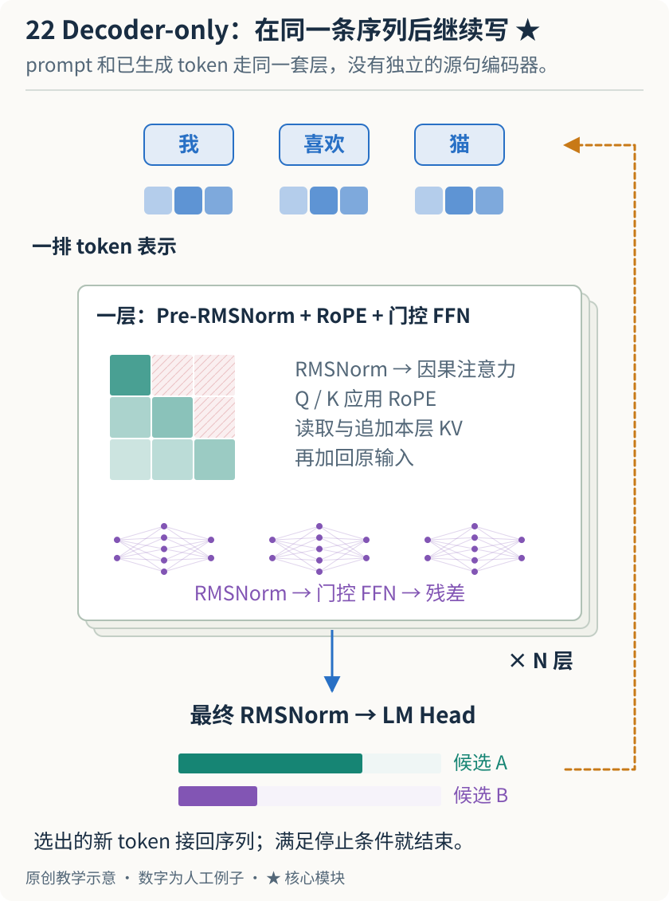

**图意解读：** 所有 prompt token 进入同一座层堆叠，层内的三角图表示因果可见性，几组小网络表示逐位置 FFN。栈末根据最后有效位置给候选打分，新选 token 再沿虚线接回。这是一种 Pre-RMSNorm、RoPE、门控 FFN 的文本结构示意，没有独立 Encoder 或经典的交叉注意力。

| 经典 Encoder–Decoder 主线 | 本节 Decoder-only 示例 | 保留下来的学习问题 |
| --- | --- | --- |
| 源 Embedding 与目标 Embedding | 单条文本序列的 Embedding | token 怎样变成向量 |
| 加法式正弦 PE | RoPE 在注意力 Q/K 上注入位置 | 模型怎样使用顺序 |
| Encoder 双向自注意力 | 没有独立 Encoder | prompt 仍通过同一模型处理 |
| Decoder 因果自注意力 | 因果自注意力，具体模型也可用 GQA 等变体 | 合法上下文怎样被读取 |
| 交叉注意力读取源表示 | 此文本示例没有交叉注意力 | 信息已在同一条 prompt/输出序列中 |
| Post-LN + ReLU FFN | Pre-RMSNorm + 门控 FFN | 残差保留、尺度控制、逐位置加工 |
| 输出头与自回归循环 | 输出头与自回归循环 | 怎样选下一 token、何时停止 |

**MoE 怎样接入这张图？** 图 22 的门控 FFN 是 Dense 示例。对于采用 MoE 的 Decoder-only 模型，把相应 FFN 槽位替换成第 8.5–8.8 节的路由与专家汇总即可；有些模型只替换部分层，有些模型增加共享专家，以模型配置为准。

多模态模型可能额外拥有视觉/音频编码器、投影层或交叉注意力，不能仅凭“语言部分是 Decoder”就推断整个系统没有 Encoder。本文对照图只覆盖所述文本路径。

## 16. 沿一条请求核对形状与职责

设 `B=1, S=3, T=2, d=8, h=2, d_k=d_v=4, d_ff=32`，词表大小用 `V` 表示。源句是 `I / love / cats`，目标前缀是 `BOS / 我`，本轮准备预测“喜欢”。

| 顺序 | 对象 | 形状 | 这一刻在做什么 |
| --- | --- | --- | --- |
| 1 | 源 IDs | `[1,3]` | 记录源 token 编号 |
| 2 | 源 Embedding + PE | `[1,3,8]` | 建立内容与位置表示 |
| 3 | Encoder 自注意力权重 | `[1,2,3,3]` | 两个头分别进行源位置间交互 |
| 4 | Encoder FFN 中间结果 | `[1,3,32]` | 每个源位置做非线性加工 |
| 5 | 最终 `H_enc` | `[1,3,8]` | 保留三个可被读取的源位置 |
| 6 | 目标 Embedding + PE | `[1,2,8]` | 给 BOS 与“我”建立初始表示 |
| 7 | Decoder 自注意力权重 | `[1,2,2,2]` | 因果限制：BOS 不能看“我”，“我”可看 BOS 和自身 |
| 8 | 交叉注意力 Q | `[1,2,2,4]` | 每个目标位置提出查询 |
| 9 | 交叉注意力 K/V | 各 `[1,2,3,4]` | 提供三个源位置的匹配与内容 |
| 10 | 交叉注意力权重 | `[1,2,2,3]` | 两个目标位置分别读取三个源位置 |
| 11 | 交叉注意力拼接并投影 | `[1,2,8]` | 回到目标侧形状，才能加回目标残差 |
| 12 | Decoder FFN 中间 / 输出 | `[1,2,32]` / `[1,2,8]` | 加工后仍保留两个目标位置 |
| 13 | 末位置最终表示 | `[1,8]` | 选“我”所在位置来预测后继 |
| 14 | LM Head logits | `[1,V]` | 给“喜欢”等词表 token 打分 |
| 15 | 选择出的 token ID | `[1]` | 追加到前缀，进入下一轮或终止 |

这张表按完整前缀计算写出形状。若 BOS 已经完成前一轮并被缓存，本轮只新送入“我”，则新 Query 长度为 1；自注意力仍读取包含 BOS 的历史 Key，交叉注意力仍读取全部三个源位置。

## 17. 常见误解与排查入口

| 现象或说法 | 先检查什么 | 对应机制 |
| --- | --- | --- |
| “Prompt 已经完整给定，所以所有位置可以互看” | 是否仍按模型的因果规则限制可见性 | 第 10、15 节 |
| “Masked Attention 就是把输入 token 遮掉” | mask 是否作用在 Query-Key 分数/可见性上 | 第 5、6、10 节 |
| “同一 token 的 Embedding 相同，因此词义不会变化” | 是否区分初始 Embedding 与逐层 hidden state | 第 3、5 节 |
| “多头就是多跑几个完整 Transformer” | 是否在同一子层内分投影空间、拼接并投影 | 第 5.4 节 |
| “PAD 向量置零就不需要 mask” | 是否仍影响位置编码和 Softmax 分母 | 第 6 节 |
| “LayerNorm 沿整句话求均值” | normalized shape 是否是每个 token 的特征维度 | 第 7.2 节 |
| “FFN 会让序列变长” | 变大的是 `d_ff` 还是 token 数 `T` | 第 8 节 |
| “MoE 选两位专家，所以只需要两位的显存” | 是否把单 token 激活参数和总权重存储混为一谈 | 第 8.7 节 |
| “MoE 的专家就是注意力头” | 被选择的是 FFN 还是读取位置的投影空间 | 第 8.8 节 |
| “交叉注意力 K/V 来自上一层 Decoder” | 是否把自注意力和交叉注意力混淆 | 第 11 节 |
| 生成重复、结束异常 | mask、起始/结束 ID、采样和长度规则 | 第 2、10、13–14 节；这些只是排查入口，不能单凭症状归因 |
| 打开缓存后结果发生不合理变化 | 缓存层号、KV 长度、位置编号、新 Query 对齐 | 第 4、10、15 节；数值精度差异需另外判断 |
| 批处理中短句输出异常 | 有效 Key、预测位置、padding 方向是否符合接口约定 | 第 6、14 节 |

## 18. 自测与下一步

读完后，尝试不看图回答：

1. Embedding、Attention 输出与 LM Head logits 分别是什么形状？哪个才对词表打分？
2. 为什么因果掩码允许对角线？输入“我”的位置究竟在预测哪个 token？
3. Padding mask 屏蔽了 PAD Key 后，PAD Query 的输出为什么仍可能不是零？
4. 同一个 Decoder 层里，Self-attention 和 Cross-attention 的 Q/K/V 来源有什么变化？
5. `T=2,S=3` 时，交叉注意力权重为什么是 `2×3`，而不是 `2×2`？
6. Post-LN 与 Pre-LN 的残差旁路分别保留哪个张量？FFN 为什么要回到 `d` 维？
7. FFN 升维会凭空增加输入信息吗？为什么没有非线性时，两层线性变换可以合并？
8. 首个新 token 刚选出时，KV Cache 是否已经包含它？下一轮是否只执行最后一层？

9. MoE 替换哪个子层？四位专家每次选两位时，总专家参数、激活专家参数和输出维度分别是什么？

**核对要点：** ID 查表产生 `d` 维向量；注意力输出仍是特征；LM Head 才产生 `V` 维分数。当前位置读取包括自身的已知输入，预测后继 token。Key mask 不等于删除 Query。交叉注意力以目标为 Query、源为 K/V。两种归一化顺序都要认清原输入旁路。升维展开中间特征，非线性打破两层仿射可合并的限制，降维汇总回残差所需宽度。新 token 到下一轮处理后才进入各层 KV，且每轮仍经过全部层。MoE 替换 FFN；每位专家 P 参数时，共有 4P 专家参数，本 token 激活 2P，汇总后仍为 d 维。

下一步按兴趣选择，不必把支线都当必修：

- **把模型计算接到引擎执行：** [LLM Prefill 与 Decode 阶段源码](<../foundations/LLM Prefill 与 Decode 阶段源码学习文档.md>)。
- **理解缓存占用：** [KV Cache 方法与内存层次](../kv-cache/README.md)。
- **理解模型结构怎样改变状态：** [Kimi K3 混合注意力缓存与 Mooncake 状态传输](<Kimi K3 混合注意力缓存与 Mooncake 状态传输学习文档.md>)。
- **回到工程模块地图：** [SGLang 学习导航](../../sglang/README.md) 或 [vLLM 学习导航](../../vllm/README.md)。

## 19. 原论文图片与阅读锚点

以下原图来自 Vaswani 等人的 *Attention Is All You Need*，保留用于对应论文模块名称。它们是经典架构依据，不作为现代变体或运行性能的证据。论文说明允许在署名归属清楚的学术或新闻用途下复现图表；本页保留作者、原始链接与图号。

### 19.1 Figure 1：经典 Transformer 架构


**图意解读：** 原图从下向上阅读。左边 Encoder 有两组 Add & Norm，右边 Decoder 有三组；横向连线从 Encoder 最终输出进入每个 Decoder 层的中间 Attention。`N×` 表示层堆叠。原图中的 `shifted right` 属于其训练输入标注，本文不展开；推理直接按第 14 节的已生成前缀理解。它没有画生成器循环，也没有显式表示 KV Cache，不能据此断言推理不会缓存。

### 19.2 Figure 2 左：缩放点积注意力


**图意解读：** Q 与 K 先做矩阵乘法，经过缩放、可选 mask 和 Softmax，再与 V 相乘。图中的可选 mask 需要按子层场景决定；对于多位置因果 Decoder，未来可见性限制不是可以随意省略的训练技巧。

### 19.3 Figure 2 右：多头注意力


**图意解读：** 多个 Linear 表示各头的学习投影，内部复用缩放点积注意力，顶部 Concat 与 Linear 合并各头信息。不同头不是按 token 分块，也不是多个完整 Encoder–Decoder。图没有为每个头指定固定语义职责。

回读论文时，优先走 **§3.1 栈结构 → §3.2 注意力 → §3.3 FFN → §3.4 嵌入与输出 → §3.5 位置**。本文开头的来源表提供原始资料入口；阅读现代变体时再分别核对其位置机制、归一化和 FFN 定义。

### 19.4 Mixtral：专家是如何接到同一个 token 上的

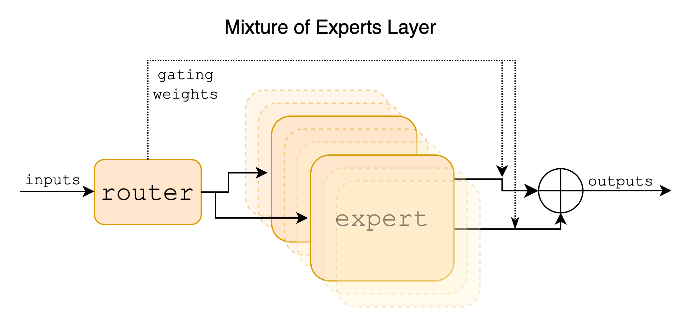

**原图来源：** Albert Q. Jiang 等，*Mixtral of Experts*，arXiv:2401.04088v1，Figure 1。作者、原始地址与文件校验值见[图片来源](../../images/transformer-architecture/SOURCES.md)。

**图意解读：** 图中一份输入经 Router 选择八个专家中的两个，所选专家分别执行 FFN，结果经过加权相加形成输出。原图用于核对结构；正文图 24–26 把“放在哪、怎么算、参数如何计数”分开讲，并使用四选二的人工小例子。
