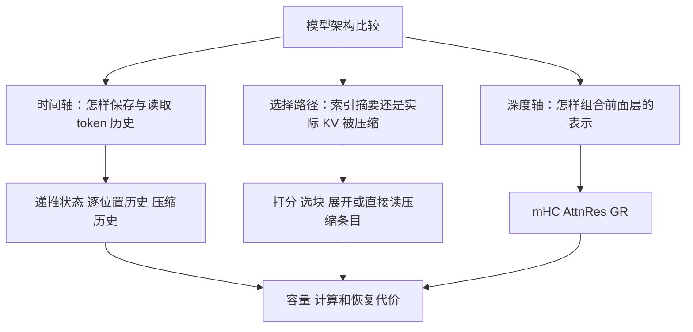
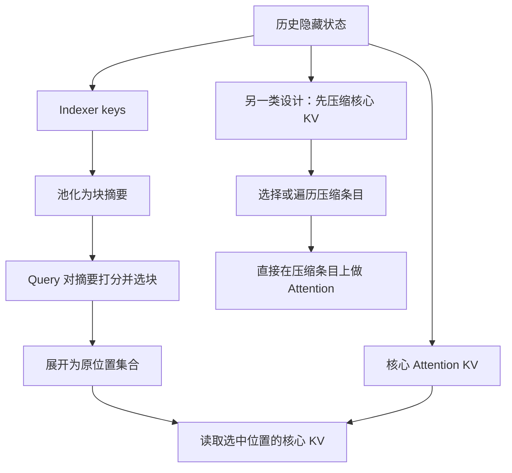
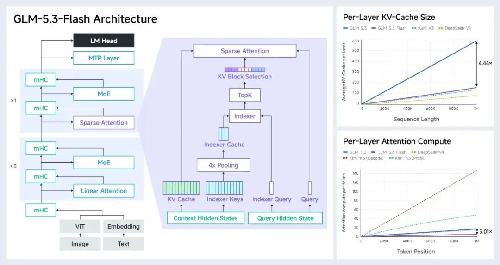
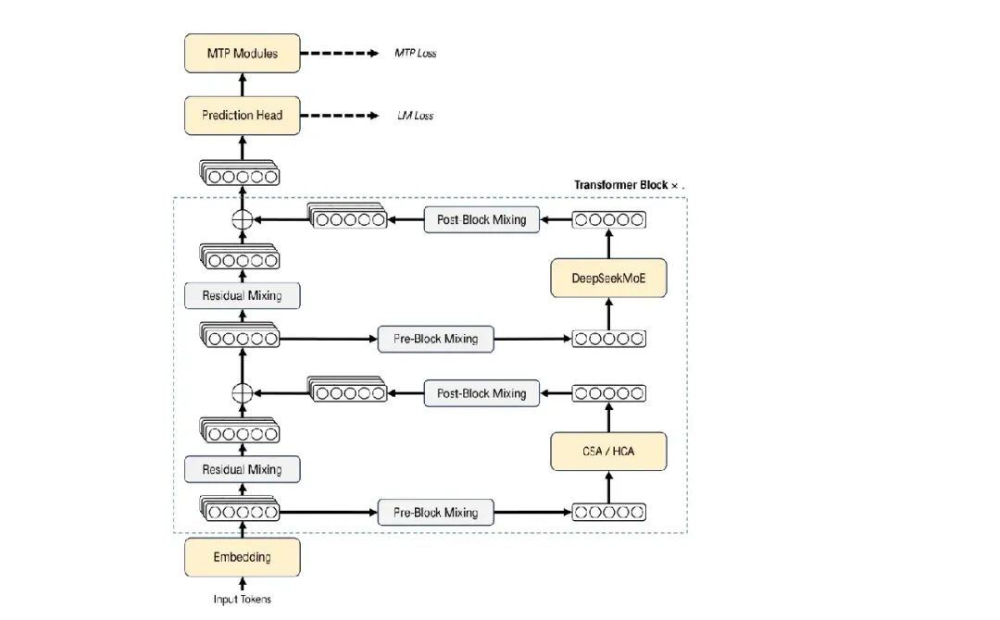
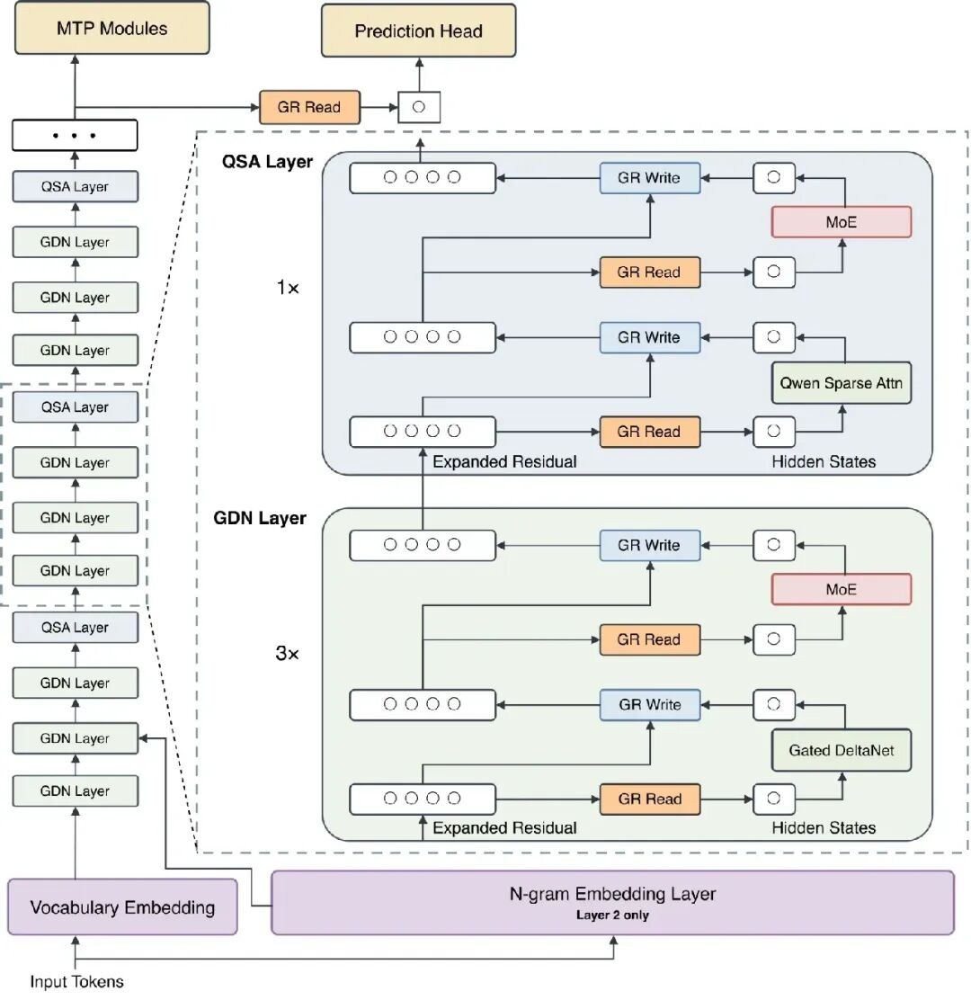
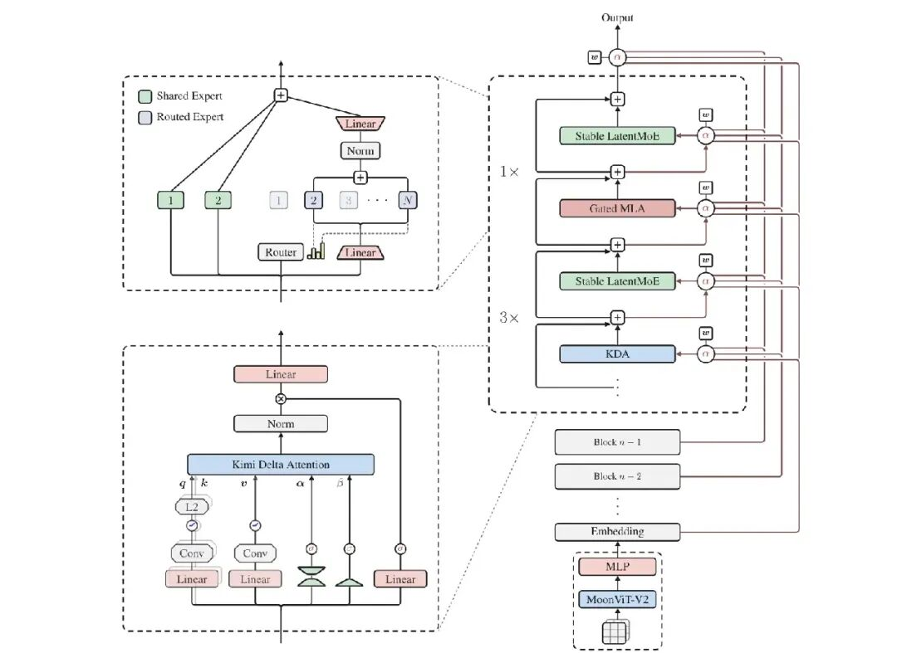

# 混合注意力、索引压缩与残差流架构对比学习文档

比较 GLM、Kimi、DeepSeek 和 Qwen 时，先问三个问题：历史信息存在哪里，当前 token 从哪里读取信息，深层网络如何组合前面层的表示。模型名字与“3:1”“1:1”只是入口，不能替代这三个问题。

本文属于**第三方资料整理型学习资料**。基于一篇架构比较文章，核对公开技术报告、模型配置与官方博客；主要产出是机制理解和比较方法，没有复现训练质量、推理速度或源码实现。

## 0. 阅读基线与范围

| 项目 | 内容 |
| --- | --- |
| 原文标题 | 面试官：GLM/Kimi/DS/Qwen架构有什么区别？ |
| 原文链接 | [公众号文章](https://mp.weixin.qq.com/s/N7TbIq01pMbJ0VtqyH5tBg) |
| 作者 | panda；文末署名 AI算法研习社 |
| 发布时间 | 2026-09-16 15:13:36，Asia/Shanghai |
| 读取时间 | 2026-10-08 |
| 范围 | 混合注意力、索引与实际 KV 的压缩边界、残差信息路径、容量和计算口径 |
| 不展开 | 完整训练配方、MoE 路由实现、具体引擎 kernel、榜单排名 |
| 一手资料 | DeepSeek V4 报告 v1；Qwen3.8-Next 架构报告 v1；Kimi K3 报告 v2；GLM-5.3-Flash 官方博客及模型配置，见末尾链接 |
| 复核方式 | 阅读相关架构/配置章节；GLM 博客初始 HTML 是空壳，读取其公开静态资源中的正文字符串，未执行网页脚本；不是源码逐行审计 |
| 配图 | 保留原文四张架构图；第五张为作者交流二维码，不收录；22 个内嵌 SVG 为公式，关键含义改为可维护文字/公式 |

先修：[KV Cache 容量优化技术地图](<../kv-cache/KV Cache 容量优化技术地图学习文档.md>)。恢复语义可接着读 [KDA Cache 检查点、前缀复用与投机回滚](<KDA Cache 检查点、前缀复用与投机回滚学习文档.md>)。

### 术语速查

| 术语 | 人话解释 | 关注的对象 |
| --- | --- | --- |
| KDA / GDN | 两类带门控的递推记忆机制 | 随 token 更新的矩阵状态；不是相同更新公式 |
| MLA | 压缩每个位置的 KV 表示，保留历史检索路径 | 表示维度压缩不等于稀疏选择 token |
| DSA / QSA | 先估计哪些历史位置重要，再选择一部分做注意力 | 索引结果控制实际读取集合 |
| CSA / HCA | DeepSeek V4 的压缩稀疏注意力 / 高压缩注意力 | 实际参与注意力的历史 KV 已压缩 |
| Indexer | 生成重要性分数和选择结果的轻量路径 | 它的 key 与核心 Attention 的 KV 不应混为一谈 |
| mHC | 对多分支残差变换施加约束 | 跨深度的信息传播稳定性 |
| AttnRes | 对前面层或 block 的表示做选择性聚合 | 沿深度读取表示，不是 token 历史 Attention |
| GR | 加宽残差流，用门控控制读写 | 分支、通道与写回权重 |

## 1. 三条相互独立的轴，建立比较地图



**图意解读：** 整理者的分类图。某模型既可压缩 KV 又可采用 mHC，两者作用在不同维度；不能把“用了层间 Attention”理解成历史 token 都保存在残差流里。

### 经复核后的总览

| 对象 | 历史混合方式 | 深度路径 | 配置与证据边界 |
| --- | --- | --- | --- |
| GLM-5.3-Flash | KDA 与 DSA；Indexer 使用 IndexPool | mHC | 官方 `text_config.layer_types` 为 34 个 linear、11 个 sparse，共 45 层；是周期模式加尾部，不能只拿 3:1 推总层数 |
| Kimi K3 | KDA 与 Gated MLA | Block AttnRes | 报告给出 69 KDA+24 MLA；MLA 仍读取历史，gate 不等同于稀疏 Top-K |
| DeepSeek V4-Pro | CSA 与 HCA | mHC | 报告为 61 层，前两层 HCA，随后交错；CSA Top-K=1024 |
| DeepSeek V4-Flash | CSA 与 HCA，另有开头 SWA 层 | mHC | 报告为 43 层，前两层纯 SWA，随后交错；CSA Top-K=512 |
| Qwen3.8-Flash-Next | GDN 与全局层混合；继续预训练阶段将全局层替换为 QSA | GR | 报告确认每四层一个全局层及 QSA 替换路径；原文的 36+12 作为其配置描述，不推广到报告里的所有消融模型 |

来源：[GLM 配置](https://huggingface.co/zai-org/GLM-5.3-Flash/raw/main/config.json)、[Kimi 报告](https://arxiv.org/html/2607.24653v2)、[DeepSeek 报告](https://arxiv.org/html/2606.19348v1)、[Qwen 报告](https://arxiv.org/html/2608.30320v1)。GLM 链接是读取时的 `main`，后续可能更新；本文未把它声明为固定源码实现基线。

**对原文的重要修正：** DeepSeek V4 不是“线性状态层+全局层”的同一种配方。CSA 与 HCA 都保存随上下文增长的压缩历史；而且不能把 Pro 的层数与 Flash 的 Top-K=512 合成一个配置。

## 2. 历史状态压缩了，信息到底去了哪里

### 递推矩阵与历史条目是不同数据结构

线性递推层把前缀吸收到有限大小的矩阵。对固定层数、头数、状态精度与并发数，单请求当前状态的空间不随序列长度 n 增长；但检查点、卷积窗口和混合模型的全局层仍占空间。

逐位置 KV 像一列历史条目。MLA 可以让每条更短，稀疏 Attention 可以少读其中一些，CSA/HCA 可以把多个位置压成一个条目。这三种优化改变的分别是条目宽度、读取数量和历史粒度。

用整理者的粗略容量模型表示：

```text
请求状态 ≈ N_rec × M_rec
         + N_hist × n × bytes_per_entry
         + 压缩/索引/窗口/检查点等额外状态
```

其中参数仅用于表达组成关系，不是四种模型通用的精确显存公式。将历史条目压缩率设为固定 r 后，`O(n/r)` 仍随 n 线性增长；它不是递推状态的 `O(1)`。

**小例子：** 读取 32768 个 token，某历史路径按 4 个压成 1 个，得到约 8192 个条目；长度翻倍时条目数也约翻倍。递推矩阵仍可能保持原形状，但不能据此直接恢复任意旧前缀。

### 不按结构名字给质量排座次

保存原始位置的 KV，不意味着每次都会读取全部位置；读取全部压缩条目，也不意味着能还原逐 token 的原始信息。训练数据、选择器质量、层间补偿与评测任务都会影响质量。

因此原文的“信息表征最好”“某家信息不如某家”适合作为待验证假设，不能当成跨模型的已证实排序。

## 3. IndexPool、QSA 与 CSA：压缩发生在不同路径

### 两条数据路径必须分开画



**图意解读：** 左侧沿池化、选块、展开到原位置的路径概括 IndexPool/QSA；中间直接压缩核心 KV 的路径概括 CSA/HCA。不是某个模型把两条路径都同时接上，也省略了位置编码与尾部处理。

| 方法 | 被压缩的对象 | 选择后读什么 | 关键例外 |
| --- | --- | --- | --- |
| GLM IndexPool | 四个 indexer key 以加权池化形成摘要 | 被选位置的核心 KV | 不能把 indexer cache 缩小比例当作整个 KV cache 缩小比例 |
| Qwen QSA | r=4 的 indexer keys 平均池化 | 将选中 micro-block 展开到原 token 索引 | 完整块需满足因果条件；最后不足一块的可见 token 单独纳入 |
| DeepSeek CSA | 核心 KV 被压缩，索引器在压缩历史上选择 | 压缩后的 KV 条目 | Flash/Pro 的 Top-K 不同；还有局部滑窗分支 |
| DeepSeek HCA | 历史以更高比例压缩 | 全部可见的高压缩条目，无稀疏 Top-K | “Dense”指压缩空间上的全遍历，不是原 token 空间的全量历史 |

依据为 GLM 官方博客、Qwen §2.1.2、DeepSeek §2.3。GLM 的加权池化是官方描述；“可学习比平均池化一定更好”并无同条件消融支撑，本文不采用这个推论。

### QSA 的具体例子：为什么还要管尾巴

设当前可见前缀为 14 个 token，块大小为 4。前三个完整块包含 12 个 token，末尾还有 2 个。索引器对完整可见块打分，选中块展开为原位置；最后不完整块的可见 token 另行保留。

这避免把未来位置混入摘要，也说明 `512 blocks × 4 = 2048 tokens` 只是主要预算口径，实际访问还需要说明尾部规则。原文只说“固定平均池化”，不足以独立实现正确的 causal attention。

QSA 报告还说明先池化内容、再为块赋予位置编码，避免直接平均不同旋转相位。本文将它作为设计约束理解，未审计实际 kernel 的 masking。

### O(n²/r) 并不表示复杂度阶数变成线性

若 Prefill 中 n 个 query 都对约 n/r 个摘要打分，索引工作量可近似为 `O(n²/r)`。r 固定时仍是二次阶；单步 Decode 只有一个新 query，对历史摘要的打分约为 `O(n/r)`。这两个式子针对不同工作单位。

此外还要加上索引投影、Top-K、数据读取、核心 Attention 和其他模型层的成本。索引候选数缩小 4 倍不等于端到端速度提升 4 倍。

## 4. 读四张原图：从组件关系回到状态边界

### GLM：索引器摘要与核心 KV 两路分开



**图意解读：** 左侧是线性/稀疏层交错与 mHC；中间 indexer keys 经过 4x pooling，核心 KV 则走另一条路径供块选择后的 Attention 使用。右侧是官方比较图，不是本仓复现。

官方正文解释：比较对象包括 GLM-5.3、GLM-5.3-Flash、DeepSeek-V4-Flash 和 Kimi K3；为比较不同规模，计算按每头每层归一化，缓存按每层平均且使用 BF16。图示约 4.44× 缓存与 3.01× 计算节省对应其与 GLM-5.3 的比较，不能直接读成整模型显存缩小或实际请求快了这些倍数。Kimi 的 Prefill、Decode 在图中也分别画线；原文“高约 7 倍”不能推广到所有长度、阶段和部署。

来源：[GLM 官方博客](https://z.ai/blog/glm-5.3-flash)。原图文字较密，需放大阅读。

### DeepSeek：压缩历史与残差混合是两条轴



**图意解读：** Attention 子层可以是 CSA/HCA，MoE 子层负责另一部分变换；两者周围都有 Pre/Post Block Mixing 与 Residual Mixing。图表达组件组合，无法仅凭一个 block 图数出 Pro/Flash 的精确层表。

DeepSeek 的局部滑窗与未完成压缩块也参与状态管理。说“全程压缩 KV”时，应限定为所讨论的压缩历史路径，不能抹去整个系统还保留的局部/尾部状态。见报告 §2.3.3 与 §3.5.1。

### Qwen：GR 包围 Attention 与 MoE



**图意解读：** 左侧显示三个 GDN 层和一个 QSA 层的模式；右侧 GR Read/Write 在每个子层前后处理残差分支。底部还有 N-gram Embedding，所以仅比较 Attention 不能覆盖其全部架构和内存行为。报告描述相关表在主机内存中预取；本文不展开其具体调度。

### Kimi：token 方向与层深方向的两种记忆



**图意解读：** 左下 KDA 有短卷积、递推与门控；右侧在 KDA/Gated MLA、Stable LatentMoE 的路径上引入前序 block 的表示。历史 token 的记忆由 Attention 状态负责，前序层的信息由 AttnRes 组织，二者不能合并成一个“缓存”。

## 5. mHC、AttnRes、GR 怎样改变跨层信息流

### mHC：约束直接残差混合，而非保证整个模型不放大

教学表达为：

```text
X_next = B × X + C × F(A × X)
```

X 包含多个残差分支；A 读入子层，F 执行子层变换，C 写回，B 负责原残差分支之间的混合。mHC 将 B 约束为非负、每行和每列均为 1 的双随机矩阵，让这条直接残差映射具有受控的传播性质。

约束的是 B 这条路径，不是证明整个 F、优化器、量化和训练过程永远稳定。原文“解决数值不稳定”应理解为方法目标与论文证据，不是无条件保证。

### AttnRes：沿深度选表示，不是沿 token 做检索

普通残差把历史层输出逐步合入一条状态；AttnRes 用数据相关权重读取前序表示。Block AttnRes 进一步将一段层内的信息聚合为 block 表示，再跨 block 选择。

若 L 为层深、N 为 block 数、d 为表示宽度，报告中从 `O(Ld)` 到 `O(Nd)` 的比较针对这部分表示存储与通信开销，不能解释成整个模型 Attention 或 KV cache 的复杂度变化。

### GR：读取按通道门控，写回按分支控制

GR 保留四条残差分支。报告中的读入步骤对分支分别归一化，并生成分支×通道的门控，然后聚合为子层输入；子层输出写回时使用每分支标量权重。两端不是同一个门控粒度。

| 问题 | mHC | Block AttnRes | GR |
| --- | --- | --- | --- |
| 优化对象 | 多分支之间的受约束混合 | 前序 block 表示的选择性读取 | 加宽分支的门控读写 |
| 主要信息来源 | 当前多分支残差状态 | 前序 block 及当前局部聚合 | 当前多分支残差状态 |
| 系统代价应查什么 | 混合与归一化读写、约束计算 | block 表示保留、聚合及跨 PP 通信 | 分支归一化、门控与写回带宽 |
| 不应混淆 | B 的约束与整个网络稳定性 | 深度 Attention 与 token Attention | 逐元素读门与逐分支写门 |

本节是对报告机制的教学解释，没有得出三者的普遍质量/速度排序。

## 6. 从架构表走到推理系统，需要再补哪些条件

| 架构特征 | 系统问题 | 需要验证的证据 |
| --- | --- | --- |
| recurrent 与历史 KV 混合 | 同一前缀怎样恢复完整状态 | 各类缓存的合法共同边界、卷积和检查点 |
| 索引压缩后再读原 KV | 索引变便宜是否仍被 KV 读取限制 | indexer、Top-K、gather 与核心 Attention 分段耗时 |
| KV 历史真正压缩 | 位置与尾部如何更新、跨实例如何传 | 压缩块元数据、局部状态、布局与生命周期 |
| 宽残差或跨 block 聚合 | 算子少了是否仍消耗更多内存带宽 | 张量存活区间、重计算、PP 交接与 kernel trace |
| sparse/dense/linear 混合 | Prefill 与 Decode 是否受同一瓶颈限制 | 分阶段、分 batch、分上下文长度的实验 |

先固定模型变体、代码版本、精度、硬件与并行布局，再比较容量、延迟与质量。不同模型的“全局层少”“压缩率高”可以解释设计方向，不能替代同条件性能数据。

## 7. 自测与面试组织方式

可以按“历史状态 → 选择路径 → 深度路径 → 验证边界”回答，而不背四家标签：

1. 固定大小的矩阵是否意味着整个模型缓存为常数？不意味着，混合的历史层、并发状态与检查点还要计入。
2. IndexPool/QSA 和 CSA 最核心的差别是什么？前两者压缩选择时使用的摘要，CSA 的核心历史 KV 也被压缩；还应说明窗口与尾部例外。
3. HCA 的 Dense 是原 token 的全量检索吗？不是，是在高压缩历史上的遍历。
4. mHC、AttnRes 和 GR 是否可以按一个数字排名？需要同模型、预算与任务的消融；单凭结构无法排名。
5. 看到“3:1”“61 层”“Top-K=512”可以拼成配置吗？不可以，必须核对模型变体、首尾例外与资料版本。

## 8. 参考与下一步

- [原文](https://mp.weixin.qq.com/s/N7TbIq01pMbJ0VtqyH5tBg)：提供比较主线与四张架构图；本文对配置混用和性能推广做了限定。
- [DeepSeek V4 报告 v1](https://arxiv.org/html/2606.19348v1)：§2.2–2.3、§3.5.1、§4.2.1，分别核对残差、压缩、缓存与变体配置。
- [Qwen3.8-Next 架构报告 v1](https://arxiv.org/html/2608.30320v1)：§2.1–2.3，核对 GDN/QSA、GR 与 N-gram 路径。
- [Kimi K3 报告 v2](https://arxiv.org/html/2607.24653v2)：架构章节及配置表，核对 KDA、MLA 与 Block AttnRes。
- [GLM-5.3-Flash 官方博客](https://z.ai/blog/glm-5.3-flash)、[模型卡](https://huggingface.co/zai-org/GLM-5.3-Flash)、[配置](https://huggingface.co/zai-org/GLM-5.3-Flash/raw/main/config.json)：核对 IndexPool、比较口径与层类型。
- [Kimi K3 混合注意力缓存与 Mooncake 状态传输](<Kimi K3 混合注意力缓存与 Mooncake 状态传输学习文档.md>)：继续学习结构如何影响状态恢复与搬运。
- [图片来源与提取记录](../../images/hybrid-model-architectures/SOURCES.md)：图像出处、校验值及公式处理边界。
