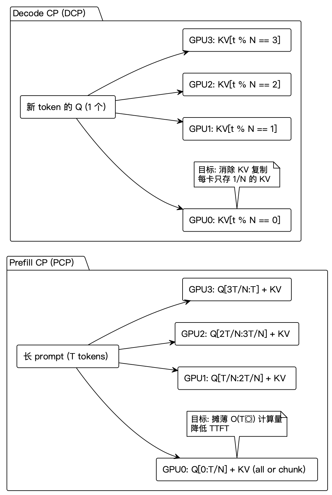
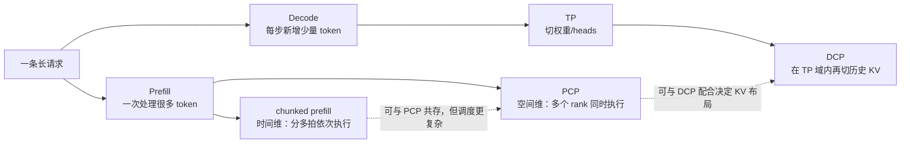
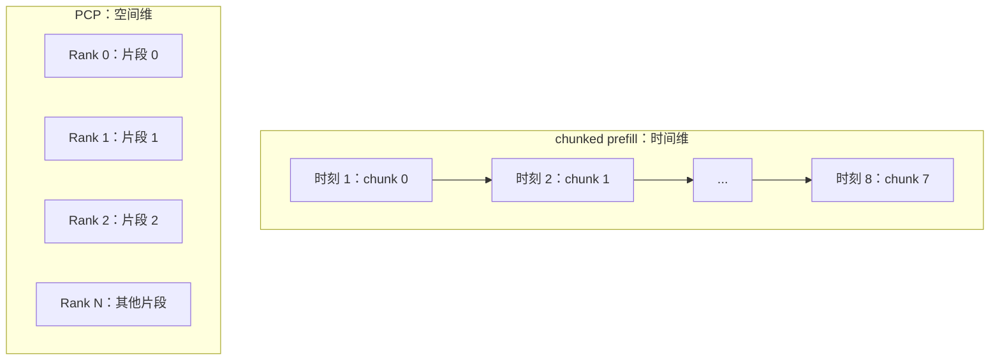
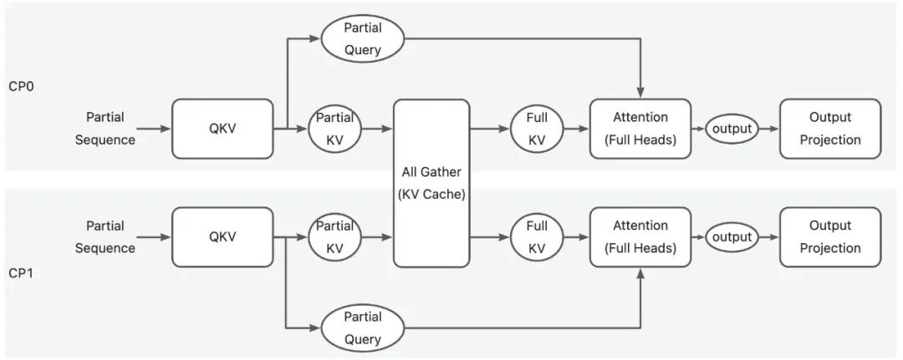
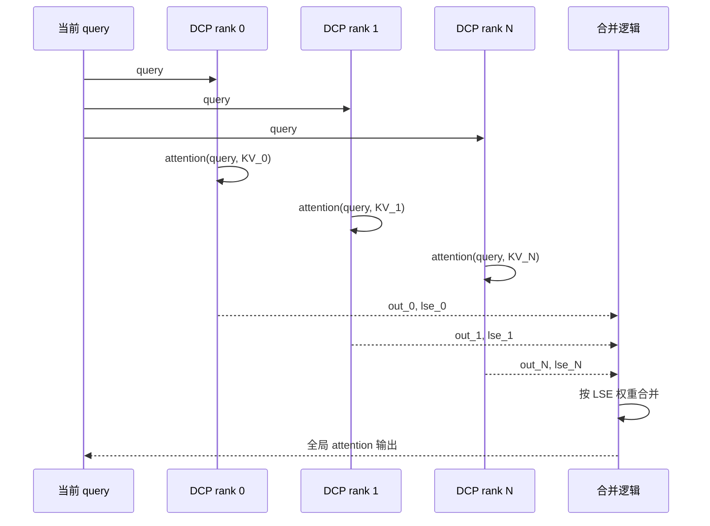
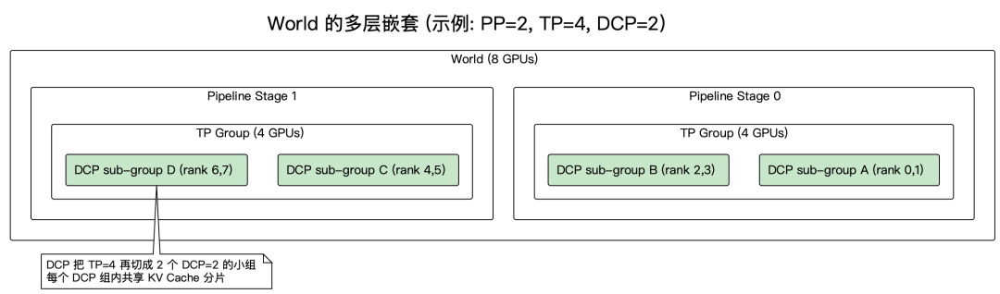

# Context Parallel、PCP 与 DCP 总体学习文档

本文面向第一次接触推理并行的同学，先回答一个最容易把人绕晕的问题：

> PCP 是不是只在 prefill 用，DCP 是不是只在 decode 用？

答案是：**不是按阶段硬切。** PCP 和 DCP 的名字来自它们最主要的优化目标，但两者都可能参与 prefill 或 decode。理解它们时，应该先看“切了什么、资源从哪里来、要解决什么瓶颈”，而不是只看名称里的 Prefill 和 Decode。

本文是基于多篇第三方文章及用户补充对话整理的学习笔记，没有对当前 vLLM、SGLang 源码做逐行复核，也没有复现实验。文中的 PR 状态、参数约束和性能数字都应以所用版本的官方文档与源码为准。

## 0. 阅读基线与范围

### 资料基线

| 资料 | 作者 | 发布时间 | 在本文中的作用 |
| --- | --- | --- | --- |
| [LLM推理优化-vLLM CP并行](https://mp.weixin.qq.com/s/qZj8ni7rvydTW7joVYdMFw) | elrond-g | 2026-04-21 | vLLM DCP 的执行顺序、KV 交错分片、通信方式和并行组 |
| [vllm并行策略之CP (Context Parallel)](https://zhuanlan.zhihu.com/p/2019809858040378281) | 梦初 | 页面发布时间未稳定取得 | CP、PCP、DCP 的整体脉络 |
| [vllm并行策略之DCP(Decode Context Parallel)](https://mp.weixin.qq.com/s/e0oLOQx3gPQ9oPD-vJE0Pg) | 梦初 | 2026-06-07 | 上一篇内容的转载入口；页面标题与正文主线不完全一致 |
| [vLLM/SGLang 为什么都在关注 CP？](https://zhuanlan.zhihu.com/p/2058562670782108307) | 非标编程 | 页面发布时间未稳定取得 | 为什么 CP 不只是“让 KV Cache 放得下” |
| [vLLM 为什么要做 CP？](https://mp.weixin.qq.com/s/XOoMA9QfEEXYYZAtIdD3hA) | 非标准化程序员 | 2026-07-10 | 上一篇内容的转载入口及 PCP 数据流图 |
| 用户补充的 Dallas 与作者对话 | Dallas、非标编程-作者 | 未提供 | 澄清 PCP、DCP 与 chunked prefill 的关系 |

| 项目 | 内容 |
| --- | --- |
| 资料类型 | 技术文章、图文资料、作者答疑 |
| 读取时间 | 2026-07-27 |
| 整理范围 | 推理阶段的 Context Parallel、PCP、DCP 及其与 TP、DP、chunked prefill 的关系 |
| 不展开内容 | 训练阶段完整 SP/CP 体系、具体通信内核实现、某个版本的源码审计 |
| 验证边界 | 只做资料交叉整理；未验证文章中的 PR 状态、默认值和 benchmark |

### 怎么读本文

建议按下面的顺序建立心智模型：

1. 先区分 prefill 和 decode 的瓶颈。
2. 再看 PCP 与 DCP 分别切什么维度。
3. 最后理解它们为什么能在同一次推理中共存。

### 术语速查

| 术语 | 人话解释 | 主要目标 |
| --- | --- | --- |
| CP | Context Parallel，沿上下文或 token 维度把注意力工作拆到多张卡 | 给长上下文增加并行度 |
| PCP | Prefill Context Parallel，让一条长 prompt 的 token 片段在多个 rank 上并行 prefill | 降低长 prompt 的 TTFT |
| DCP | Decode Context Parallel，在 TP 域内把历史 KV 按序列维切开 | 降低 KV 冗余存储和 decode 访存 |
| TP | Tensor Parallel，把一层里的权重、head 或矩阵切到多张卡 | 提供权重带宽与算力并行 |
| DP | Data Parallel，多份模型副本分别处理不同请求 | 提升系统吞吐 |
| chunked prefill | 把一个长 prompt 切成多个 chunk，按多个调度步依次执行 | 降低单步峰值并改善调度公平性 |
| LSE | Log-Sum-Exp，合并多个局部 attention 结果时携带的归一化统计量 | 保持分片 softmax 的数学等价性 |
| TTFT | Time To First Token，从发起请求到收到第一个 token 的时间 | prefill 延迟的重要指标 |
| TPOT | Time Per Output Token，decode 阶段每生成一个 token 的平均时间 | decode 延迟的重要指标 |

---

## 1. 先建立整体地图

### 人话版

长上下文推理有两个很不一样的阶段：

- **Prefill** 一次处理很多 prompt token，矩阵规模大，通常更偏计算密集。
- **Decode** 每步只新增很少 token，却要反复读取整段历史 KV，通常更偏显存带宽密集。

PCP 和 DCP 都在“上下文维度”做文章，但用力点不同：

- PCP 把当前请求的 token 工作分给更多并行 rank，重点是让一次 prefill 更快完成。
- DCP 把已经积累的历史 KV 分散保存，让每个 rank 只读其中一部分，重点是消除 TP 域内的重复 KV。



**图意解读**

- 上半部分的 DCP 把同一条历史 KV 序列按 token 位置分给多个 rank；新的 query 需要和所有局部 KV 分片分别计算，再合并结果。
- 下半部分的 PCP 把长 prompt 的 query/token 区间分给多个 rank，让多个片段同时向前计算。
- 图里使用“prefill CP”和“decode CP”强调主要收益场景，不代表两种机制只能在对应阶段出现。
- 这张图是原文的概念图，不应把其中的具体切片公式当作所有模型、所有后端都固定采用的内存布局。

### 总览图



### 一张表抓住核心差别

| 机制 | 切分对象 | 时间还是空间 | 是否增加单请求同时使用的资源 | 首要收益 |
| --- | --- | --- | --- | --- |
| chunked prefill | prompt token chunk | 时间维 | 通常不增加 | 降低峰值、让调度更灵活 |
| PCP | 当前请求的 query/token 区间 | 空间维 | 是 | 降低长 prompt TTFT |
| DCP | 历史 KV 的序列区间 | 空间维，通常复用 TP rank | 通常不新增 GPU | 降低 KV 复制和 decode 访存 |
| DP | 请求集合 | 空间维 | 单请求通常不增加 | 提升多请求吞吐 |

---

## 2. 为什么长上下文会逼出 CP

### 人话版

“模型放不下”只是分布式推理的一个问题。即使权重已经能靠 TP、PP 放下，长上下文仍会带来两个新瓶颈：

1. prefill 的注意力计算随序列增长迅速变大，一条请求可能长时间占住一组 GPU；
2. decode 每步都要读取越来越长的 KV，TP 在 KV head 数较少时还可能保存多份重复数据。

因此 CP 的价值不只是扩容，也包括给**单条请求**更多并行资源。

### Prefill：更像“算不过来”

在 dense causal attention 的简化模型下，长 prompt 的注意力工作量会随着序列长度快速增长。PCP 把 query 行切开以后，每个 rank 只负责部分 query，但仍要看到这些 query 所需的 key/value。

资料中给出的直觉是：

- TP 主要沿 head/隐藏维切分；
- PCP 主要沿序列维切分；
- 当单请求已经长到单个 DP replica 的 prefill 很慢时，可以临时让它跨多个并行副本使用更多计算资源。

这里的“跨 DP 维度”是资料里的实现心智模型，不等于任意 DP 部署都能自动变成 PCP；是否支持取决于引擎的进程组、KV 布局和调度实现。

### Decode：更像“读不动了”

decode 的每一步 query 很短，但历史 KV 很长。假设 TP 有 8 个 rank，而模型的 KV head 很少，朴素 TP 可能让多个 rank 持有相同 KV。结果是：

- 显存被重复 KV 占用；
- 每一步都从多张卡重复读取同样的历史；
- 加大 TP 不一定继续降低 KV 访存压力。

DCP 让这 8 个 rank 不再各存一份完整历史，而是每个 rank 只存一部分 token 对应的 KV，再合并局部 attention。

### 与其他并行方式的边界

| 并行方式 | 给单请求增加了什么 | 对长上下文的直接作用 |
| --- | --- | --- |
| TP | 更多权重带宽和矩阵并行 | 能加速层内计算，但 KV head 少时会出现复制 |
| PP | 把不同层放到不同 stage | 解决模型容量；同一时刻一条 microbatch 仍逐 stage 流动 |
| DP | 更多模型副本 | 提升总吞吐；通常不加速单请求 |
| EP | 把不同专家分散到 rank | 解决 MoE 专家容量和计算；对单请求资源是否增加取决于拓扑 |
| CP | 沿 token/context 维增加并行 | 直接针对长 prefill 或长历史 KV |

资料中的通信量公式只能作为方向性直觉。真实成本还受模型结构、attention backend、网络拓扑、数据类型、融合内核和 batch 形状影响，不能只凭一个符号表达式选型。

---

## 3. PCP 和 DCP 不是按阶段硬切

这是用户补充对话里最重要的澄清。

### Dallas 的疑问

疑问可以压缩成三句：

1. PCP 的 P 是 Prefill，所以它是不是只在 prefill 开？
2. DCP 的 D 是 Decode，所以它是不是只在 decode 开？
3. vLLM 默认有 chunked prefill，PCP、DCP 和它会不会互相替代？

### 作者答复的核心

作者的回答不是“哪个阶段开哪个开关”，而是“它们解决什么问题”：

- PCP 给一条请求更多空间并行资源，让它跨更多 rank 计算。
- DCP 消除 TP 域内的 KV 冗余存储与访存。
- 在 prefill 中，DCP 仍可决定 KV 怎样分片保存；只开 PCP 不代表 KV 一定已经去重。
- chunked prefill 和 PCP 都会拆请求，但一个按时间依次执行，一个按空间并行执行。

### 用二维表看就不容易误解

| 阶段 | PCP 可能做什么 | DCP 可能做什么 |
| --- | --- | --- |
| Prefill | 把长 prompt 的 query/token 区间分给多个 PCP rank，并行降低 TTFT | 按 DCP 布局写入 KV；某些实现还会重组或收集上下文 KV 参与 attention |
| Decode | 是否保留 PCP 维取决于实现；可能合并输出，也可能产生冗余计算 | 每个 DCP rank 读取自己的历史 KV，计算局部 attention，再用 LSE 合并 |

结论是：

> “Prefill Context Parallel”和“Decode Context Parallel”更像是主要优化目标的名字，而不是两个互斥的阶段开关。

### chunked prefill 与 PCP 的根本差别

假设 prompt 有 8 个 chunk：



- chunked prefill 让一个请求分多次进入调度器。忽略排队和内核形状变化时，它不会凭空增加单请求的同时算力。
- PCP 让多个 rank 同时处理一条请求，理论上能直接缩短单请求 prefill。
- 两者可以共存：一个超长请求先被调度成若干 chunk，每个 chunk 内部再用 PCP；但缓存边界、padding、CUDA Graph 和调度状态会更复杂。

想继续理解 chunked prefill 的显存与 block 边界，可读 [vLLM Chunked Prefill 与 Block Size 学习文档](../../vllm/runtime/vLLM%20Chunked%20Prefill%20与%20Block%20Size%20学习文档.md)。

---

## 4. PCP 的核心数据流

### 人话版

PCP 最直观的一种实现是：

1. 每个 rank 拿到不同的 query/token 片段；
2. 各 rank 先产生局部 Q、K、V；
3. 把 K/V 收集成每个 rank 都能访问的完整上下文；
4. 每个 rank 用自己的局部 Q 对完整 K/V 做 attention；
5. 各 rank 保留自己负责的输出片段。



**图意解读**

- 两个 CP rank 都只持有一段输入序列，因此先得到局部 Q/K/V。
- 中间的 `All Gather (KV Cache)` 让每个 rank 都拿到完整 K/V。
- attention 仍由各 rank 独立完成，但每个 rank 只计算自己的 query 行。
- 这条路径容易理解，代价是 K/V 通信和完整 KV 可见性；更激进的方案会继续把 KV 分片并使用 ring/P2P。

### 为什么 causal attention 需要负载均衡

因果 mask 下，越靠后的 query 能看到越长的历史：

- 连续切分时，前段 rank 工作少，后段 rank 工作多；
- 条带交错可以把早晚 token 打散；
- zigzag 可以把序列头尾配成一组，让每个 rank 的可见区域总量更接近。

这说明 PCP 不只是“把 token 数均分”。真正需要均衡的是**有效 attention 计算量**。

---

## 5. DCP 的核心数据流

### 人话版

DCP 把一条长历史拆成多个 KV 分区。每个 rank 用同一个 query 只看自己的那段历史，然后把局部结果合成全局结果。



DCP 能节省 KV，但并没有让通信消失。它把“重复读取完整 KV”的成本，换成了：

- query 或 head 分片的收集；
- 局部 `out` 与 `LSE` 的交换；
- 最终的 reduce-scatter、all-to-all 或等价合并。

因此 DCP 是否更快取决于“节省的 HBM 访存”能否覆盖“新增的 collective 与合并内核”。

---

## 6. 并行组怎么嵌套

资料给出的一个典型约束是：

```text
TP size 必须能被 DCP size 整除
```

因为 DCP 通常复用 TP 已经占用的 GPU，不额外申请一组卡，而是在 TP group 内再划子组。



**图意解读**

- 最外层是 world，先按 PP stage 分段。
- 每个 PP stage 内有自己的 TP group。
- DCP 再把 TP group 划成若干子组；图中 `TP=4, DCP=2`，每个 DCP 子组有两个 rank。
- DCP 不是独立于 TP 的新 world size 乘数；PCP 在资料所述方案中则可能扩展 world size。具体维度顺序仍要看引擎版本。

### 一个配置例子

假设：

```text
PP = 2
TP = 8
DCP = 4
PCP = 2
```

可以先形成这样的心智模型：

- 两个 PP stage 各负责一段模型层；
- 每个 stage 内有 8 个 TP rank；
- 这 8 个 TP rank 按 DCP=4 划分上下文/KV 工作；
- PCP=2 让一条长 prefill 请求跨两个序列并行副本。

不要直接用这几个数推导启动进程数。不同文章对应不同时间点的实现，PCP 是否纳入 `world_size`、DCP 如何复用 TP 都要以当前版本的配置校验为准。

---

## 7. 怎么选择

### 决策表

| 现象 | 优先检查 | 可能的方向 |
| --- | --- | --- |
| 超长 prompt TTFT 很高，单请求算不满整个集群 | prefill kernel、单请求可用 rank 数 | PCP |
| decode 时 KV 占用随 TP 扩大而重复增长 | KV head 数、TP/DCP 布局 | DCP |
| 长 prompt 阻塞短请求 | 调度步、chunk 大小 | chunked prefill |
| 模型权重单机放不下 | 权重容量和跨节点拓扑 | TP + PP |
| 多请求总吞吐不足但单请求延迟可接受 | 请求并发和副本数 | DP |

### PCP 更适合什么

- prompt 很长，prefill 占主要延迟；
- 有空闲 DP/PCP 资源可以临时服务一条请求；
- attention backend 支持所需的序列切分与负载均衡；
- K/V all-gather 或 ring 通信没有压垮网络。

### DCP 更适合什么

- TP size 大于有效 KV 并行度，KV 出现复制；
- decode 明显受 HBM 访存限制；
- 上下文足够长，节省 KV 读取的收益大于 collective 成本；
- 模型和 attention backend 支持局部结果加 LSE 合并。

### 可能不划算的情况

- 上下文很短，通信固定开销占主导；
- rank 间网络慢或 collective 不稳定；
- 单请求很少但 PP/PCP stage 很多，流水线气泡明显；
- 内核因为切分得到过小矩阵，GPU 利用率下降；
- 为兼容 prefix cache、chunked prefill 或 CUDA Graph 引入大量 padding 与重排。

---

## 8. 常见误解

### 误解一：PCP 就是 chunked prefill

不是。前者是空间并行，后者主要是时间切片。

### 误解二：DCP 会增加 GPU 数

资料中的 vLLM DCP 复用 TP rank，并不把 DCP 当作额外 world-size 维度。它改变的是 TP 域里的 KV 和 attention 分工。

### 误解三：DCP 只影响 decode

不是。它的主要收益在 decode，但 prefill 写 KV 时就必须遵守 DCP 布局，部分模型还要在 prefill 中重组上下文 KV。

### 误解四：PCP 一定线性加速

不是。K/V 通信、因果负载不均、padding、kernel 形状和调度开销都会降低收益。

### 误解五：LSE 合并意味着“绝对零误差”

在精确算术中，LSE 加权能恢复与全量 softmax 等价的结果；在浮点实现中仍可能有正常的舍入差异、归约顺序差异和内核误差。不能把“数学等价”写成所有硬件上逐 bit 相同。

---

## 9. 推荐阅读顺序

1. 本文：先建立 CP、PCP、DCP 的总地图。
2. [PCP 长上下文 Prefill 并行学习文档](./PCP%20长上下文%20Prefill%20并行学习文档.md)：继续看两种 KV 策略、因果负载均衡和引擎方案。
3. [vLLM DCP KV Cache 去重与 LSE 合并学习文档](../../vllm/parallelism/vLLM%20DCP%20KV%20Cache%20去重与%20LSE%20合并学习文档.md)：继续看 KV 分片、局部 attention 和 LSE 合并。
4. [vLLM Chunked Prefill 与 Block Size 学习文档](../../vllm/runtime/vLLM%20Chunked%20Prefill%20与%20Block%20Size%20学习文档.md)：理解时间切片、调度预算和 block 粒度。

---

## 10. 一句话总结

**chunked prefill 是把长请求分多拍，PCP 是让一条请求同时用更多 rank，DCP 是让 TP rank 不再重复保存和读取同一份历史 KV；三者可以共存，但解决的不是同一个问题。**

## 11. 参考与延伸

- [LLM推理优化-vLLM CP并行](https://mp.weixin.qq.com/s/qZj8ni7rvydTW7joVYdMFw)
- [vllm并行策略之CP (Context Parallel)](https://zhuanlan.zhihu.com/p/2019809858040378281)
- [vllm并行策略之DCP(Decode Context Parallel)](https://mp.weixin.qq.com/s/e0oLOQx3gPQ9oPD-vJE0Pg)
- [vLLM/SGLang 为什么都在关注 CP？](https://zhuanlan.zhihu.com/p/2058562670782108307)
- [vLLM 为什么要做 CP？](https://mp.weixin.qq.com/s/XOoMA9QfEEXYYZAtIdD3hA)

本文是基于上述图文和用户提供对话的二次整理。涉及当前参数、PR 合入状态、后端支持矩阵时，请回到对应版本的官方源码和文档确认。
