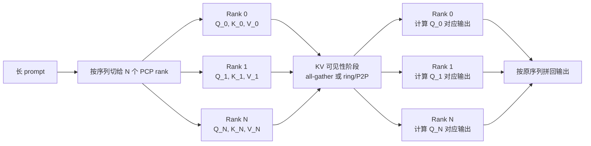
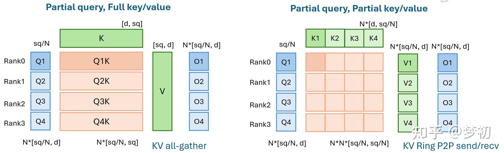
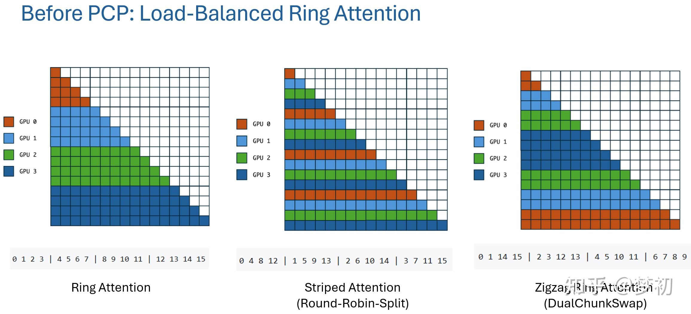
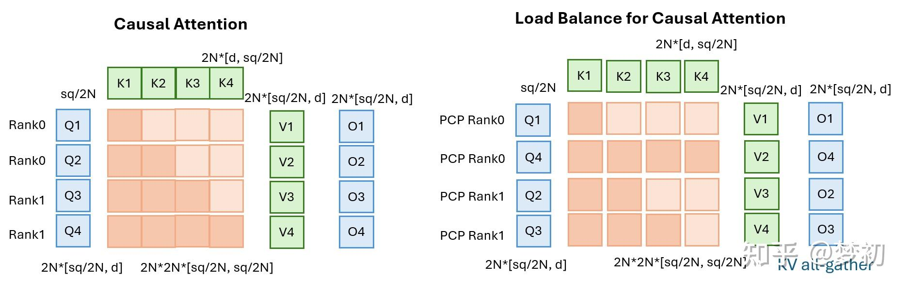
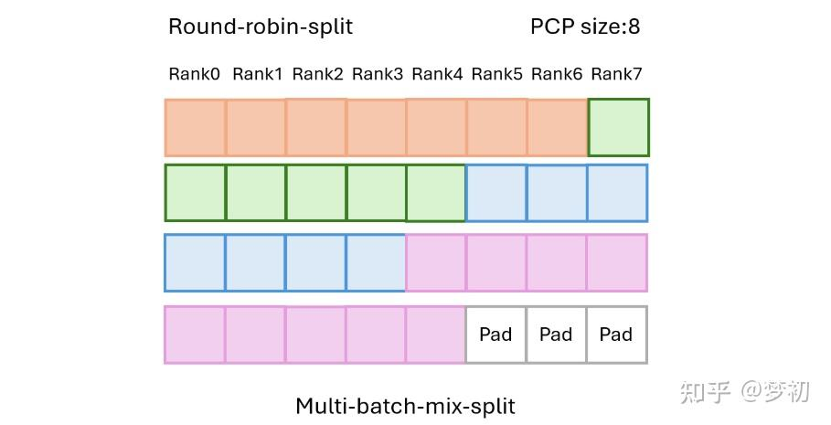
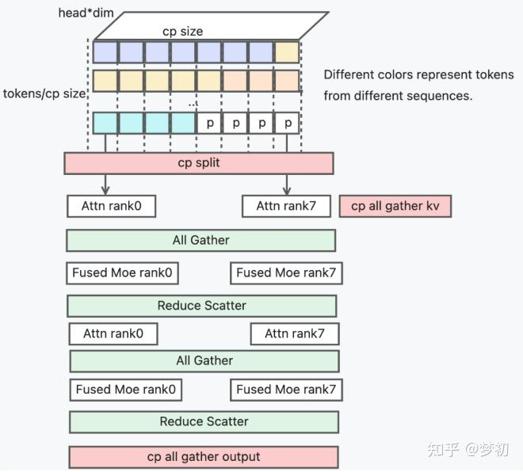
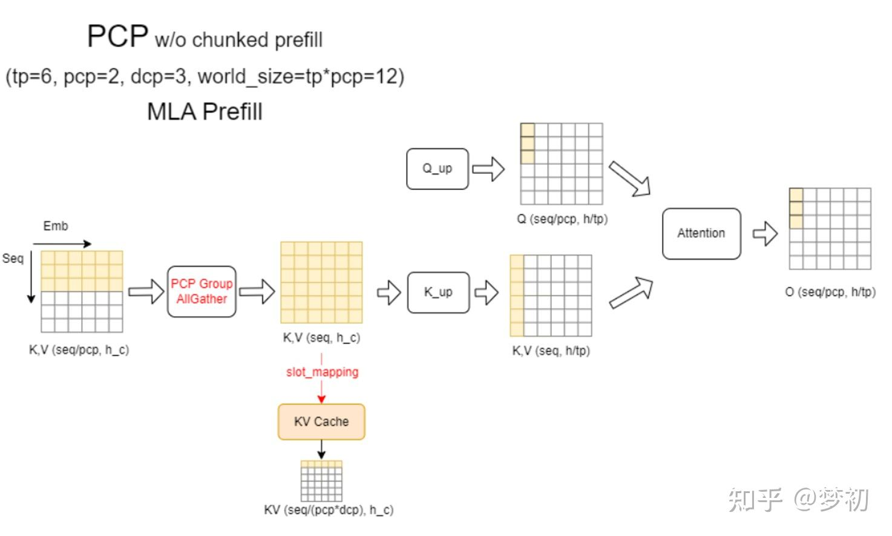
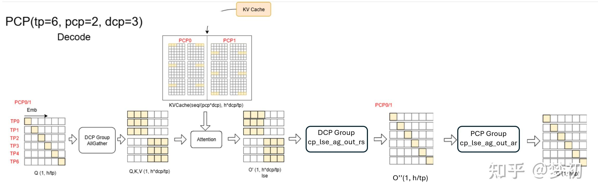
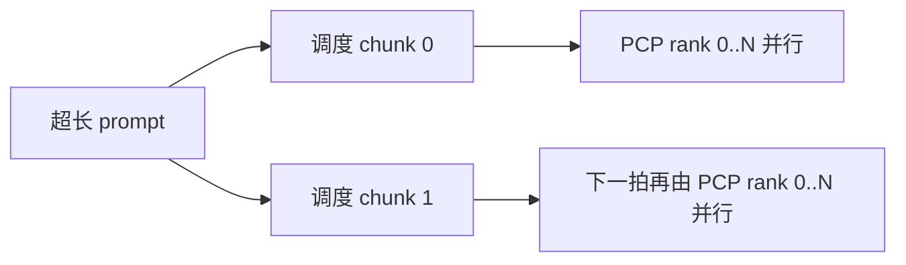

# PCP 长上下文 Prefill 并行学习文档

本文面向第一次了解 Prefill Context Parallel 的同学，回答四个问题：

1. PCP 为什么能降低长 prompt 的 TTFT？
2. “局部 Q、完整 KV”和“局部 Q、局部 KV”有什么区别？
3. causal attention 为什么不能只按 token 数平均切？
4. SGLang 已落地方案和 vLLM 方案讨论分别在解决什么工程问题？

本文是第三方资料整理，不是当前 SGLang 或 vLLM 源码审计。原文涉及的 PR、RFC、支持矩阵和性能数字具有时间敏感性，本文只保留其设计思路，不把当时状态写成当前事实。

## 0. 阅读基线与范围

| 项目 | 内容 |
| --- | --- |
| 原文标题 | 推理并行之PCP (Prefill Context Parallel) |
| 原文链接 | [https://zhuanlan.zhihu.com/p/2020174181589890682](https://zhuanlan.zhihu.com/p/2020174181589890682) |
| 作者 | 梦初 |
| 发布时间 | 页面发布时间未稳定取得 |
| 读取时间 | 2026-07-27 |
| 资料类型 | 技术文章、方案与 PR 脉络整理 |
| 整理范围 | PCP 计算策略、causal 负载均衡、single-batch/multi-batch、SGLang 与 vLLM 方案边界 |
| 不展开内容 | DCP 的完整 LSE 通信实现、训练 Ring Attention、具体 PR 的当前合入状态 |
| 验证边界 | 仅基于原文整理；没有逐行核对当前 SGLang/vLLM 源码，也没有复现实验 |

### 怎么读本文

先记住一句话：

> PCP 不是把一条长请求排成更多调度步，而是让它在同一时间使用更多 rank。

然后按“Q 怎么切、KV 怎么给、结果怎么收”去看每个方案。

### 术语速查

| 术语 | 人话解释 | 本文重点 |
| --- | --- | --- |
| PCP | 沿 prompt 序列维切分 prefill attention | 给单条长请求更多并行算力 |
| CP rank | 负责一段 query/token 的并行进程 | 每个 rank 的输入与输出边界 |
| partial Q | 每个 rank 只计算部分 query 行 | PCP 的基本切法 |
| full KV | 每个 rank 都能访问完整 key/value | 实现简单，但通信与存储更大 |
| partial KV | 每个 rank 只保存或持有部分 key/value | 更省显存，但需要 ring/P2P 与结果合并 |
| stripe | 按 token 位置轮转分配 | 打散 causal 负载 |
| zigzag | 把序列头尾片段配对分配 | 兼顾连续块和 causal 负载 |
| single-batch | 一次只切一条长序列 | 形状与调度相对简单 |
| multi-batch | 同时混合多条序列再分给 rank | 需要 padding、边界和映射管理 |
| DSA | Dynamic Sparse Attention，资料中用于讨论稀疏 attention 的 PCP 路径 | 稀疏索引会改变最佳切分方式 |

---

## 1. 先建立整体地图

### 人话版

假设一条 prompt 有 1M token，只让一个并行副本做 prefill，会有两个问题：

- attention 计算量太大，TTFT 很高；
- 其他副本即使空闲，也不能帮这条请求。

PCP 的想法是把 query 行分给多个 rank。每个 rank 只负责自己的 query 区间，但为了正确 attention，它必须看到这些 query 所需要的历史 K/V。


**图意解读**

- 输入序列先在 CP0、CP1 之间切开，各 rank 产生局部 Q/K/V。
- Q 始终留在本 rank；局部 K/V 通过 all-gather 形成完整 KV。
- 每个 rank 对完整 KV 计算自己负责的 query 行，因此输出天然还是序列分片。
- 控制权在并行调度和切分映射；数据面的主要额外成本是 K/V 收集。

### 总览图



### PCP 真正切的是什么

PCP 通常切的是 attention 的 query/token 维，而不是简单地把模型层切开：

| 对象 | 是否切分 | 原因 |
| --- | --- | --- |
| 当前 prompt 的 Q | 是 | 每个 rank 只计算一段 query 行 |
| K/V | 可以完整，也可以继续切 | 决定通信、显存与内核复杂度 |
| 模型层 | PCP 本身不负责 | 层切分属于 PP |
| 权重/head | 可能同时被 TP 切 | PCP 常与 TP 组合 |
| 请求 | 仍是一条逻辑请求 | 多个 rank 必须共享一致的序列边界和完成状态 |

---

## 2. 两种 attention 计算策略



**图意解读**

- 左侧是 `partial Q + full KV`：每个 rank 的 Q 很小，但 K/V 在 rank 间 all-gather 后完整可见。
- 右侧是 `partial Q + partial KV`：Q、K、V 都分片，K/V 通过 ring P2P 轮转，每个 rank 分阶段累积 attention。
- 左侧控制流简单、容易复用现有 attention kernel；右侧显存更省，但需要维护局部 softmax 状态和通信时序。
- 图中的 `N *` 形状是资料给出的抽象示意，实际张量还会受 batch、head、TP 和 backend 布局影响。

### 2.1 局部 Q、完整 KV

#### 人话版

每个人只做一部分题，但每个人都拿到完整参考资料。

#### 机制拆解

1. 按序列切分输入。
2. 每个 PCP rank 计算自己的局部 Q/K/V。
3. all-gather K/V，使每个 rank 都能看到完整上下文。
4. 每个 rank 用局部 Q 对完整 K/V 做 attention。
5. 保留本 rank 的局部输出。

#### 优点

- 容易复用标准 FlashAttention/varlen attention；
- 不需要跨多轮 ring 维护局部 softmax；
- prefix cache 和 chunked prefill 的语义更容易衔接；
- 调试时容易验证每个 rank 的 query/output 对应关系。

#### 代价

- K/V 通信量随序列增长；
- 每个 rank 需要暂时看到完整 KV；
- decode 若沿用相同布局，可能产生重复 KV 或冗余 attention；
- 当 PCP 很大时，all-gather 可能成为主瓶颈。

### 2.2 局部 Q、局部 KV

#### 人话版

每个人只拿一部分题和一部分参考资料，参考资料沿环传递；每看完一份，就更新一次局部答案统计。

#### 机制拆解

1. Q/K/V 都按序列分片。
2. 本 rank 先对本地 KV 做 attention。
3. KV 分片沿 ring/P2P 传给下一个 rank。
4. 每轮得到局部输出和 softmax 统计。
5. 所有所需 KV 分片走完后，得到最终输出。

#### 优点

- 不要求所有 rank 同时持有完整 KV；
- 更适合极长上下文；
- 有机会用通信和计算重叠隐藏 P2P 成本。

#### 代价

- 要处理 causal mask 在不同分片间的可见性；
- 需要在线 softmax/LSE 合并；
- ring 慢 rank 会拖住整环；
- prefix cache、chunked prefill、CUDA Graph 和变长 batch 的组合更复杂。

### 2.3 怎么选

| 条件 | 更偏向完整 KV | 更偏向局部 KV |
| --- | --- | --- |
| 上下文中等、网络快 | 是 | 未必值得 |
| 上下文极长、单卡放不下完整 KV | 不适合 | 是 |
| 需要快速落地和兼容现有 kernel | 是 | 否 |
| 有成熟 ring attention 内核 | 可以 | 是 |
| prefix cache/chunked prefill 组合复杂 | 相对容易 | 需要更强元数据管理 |

---

## 3. causal attention 为什么会负载不均

### 人话版

在 causal attention 中，第 1 个 token 只看自己，第 1000 个 token 能看前面约 1000 个 token。即使每张卡都分到相同数量的 query，后段 query 的计算也更重。

### 三种分法



**图意解读**

- 左图连续切分：GPU0 负责最早 token，工作最少；GPU3 负责最晚 token，工作最多。
- 中图 striped/round-robin：相邻 token 轮流落到不同 GPU，使每个 rank 都混合早晚位置。
- 右图 zigzag：把头部和尾部连续块配对，让各 rank 的可见三角形面积接近。
- 颜色均衡的是有效 attention 区域，不只是 token 个数。

### 3.1 连续切分

例如 16 个 token、4 个 rank：

```text
rank 0: 0  1  2  3
rank 1: 4  5  6  7
rank 2: 8  9 10 11
rank 3: 12 13 14 15
```

实现简单，内存连续，但 rank 3 的 causal 工作量明显大于 rank 0。

### 3.2 Striped / round-robin

```text
rank 0: 0 4 8 12
rank 1: 1 5 9 13
rank 2: 2 6 10 14
rank 3: 3 7 11 15
```

它把不同位置均匀打散，负载更平衡。代价是 token 不连续，dense attention kernel 可能需要 gather/scatter。

### 3.3 Zigzag / DualChunkSwap

```text
rank 0: 0 1 14 15
rank 1: 2 3 12 13
rank 2: 4 5 10 11
rank 3: 6 7  8  9
```

每个 rank 拿一段早期 token 和一段晚期 token。



**图意解读**

- 左侧连续切法中，同一个 rank 内两段 query 的 causal 区域差距很大。
- 右侧把前后位置配对后，每个 PCP rank 的总可见区域更接近。
- zigzag 保留较大的连续块，通常比逐 token stripe 更利于 dense attention kernel。
- 如果后端本来就是稀疏索引访问，stripe 的非连续性成本可能更低。

### 选择的本质

| attention 类型 | 资料中的倾向 | 原因 |
| --- | --- | --- |
| Dense causal attention | zigzag | 连续块更适合 varlen/FlashAttention，同时平衡三角形面积 |
| 稀疏 attention/DSA | stripe | 稀疏 top-k/indexer 本来就会做非连续 gather |
| 变长 multi-batch | round-robin + padding | 更容易把多条序列混合成 rank 等形状 |

这不是通用结论。最终还要看 kernel 是否要求连续、是否支持 ragged shape，以及通信前后有没有额外重排。

---

## 4. Single-batch 与 Multi-batch

### 4.1 Single-batch

一次只处理一条长序列，可以直接围绕该序列做 stripe 或 zigzag。

优点：

- 序列边界单一；
- causal mask 容易推导；
- 输出按映射拼回即可。

缺点：

- 只有一条请求时，某些 rank 可能拿不到足够大的矩阵；
- 序列长度不能整除 PCP size 时仍要 padding；
- 高并发调度器不能只靠 single-batch 路径。

### 4.2 Multi-batch

多条请求的 token 片段被混合分发到 PCP rank。每种颜色代表一条不同序列：



**图意解读**

- 每行是一条逻辑序列，列方向对应 PCP rank。
- 不同长度序列被 round-robin 分配后，最后一行不足的槽位用 padding 补齐。
- padding 不是语义 token；attention metadata 必须阻止它参与有效计算和 KV 写入。
- 等形状有利于 collective 和 CUDA Graph，但 padding 比例过高会浪费算力。

### Multi-batch 多出来的工程问题

| 问题 | 为什么出现 |
| --- | --- |
| padding | collective/CUDA Graph 常希望各 rank 形状一致 |
| 序列边界 | 混合后必须知道每个 token 属于哪条请求 |
| position | round-robin 后物理顺序与逻辑位置不同 |
| slot mapping | KV 写入位置必须对应原请求，而不是临时混合顺序 |
| 输出回排 | attention 输出要还原成调度器期望的请求顺序 |
| prefix cache | 命中前缀和新 token 可能落在不同 PCP rank |

---

## 5. SGLang 方案在原文中的两条路径

原文按当时的 PR 脉络整理了两类方案。下面只复述设计意图，不声明当前分支仍保持相同实现。

### 5.1 Single-batch：in-seq split

资料把它和 PR `#12065`、zigzag/DualChunkSwap 联系起来：

- 一条序列内部切分；
- 通过头尾配对平衡 causal attention；
- 适合长单请求；
- 重点是 dense attention 下的连续块和负载均衡。

### 5.2 Multi-batch：round-robin split

资料把它和 PR `#13959`、DSA 路径联系起来：

- 多条序列 token 混合分发；
- 用 round-robin/stripe 平衡 rank；
- 为等形状补 padding；
- KV Cache 在文章描述的方案中仍可能全量复制；
- decode 可能存在冗余 attention。



**图意解读**

- 顶部 token 先按 CP/PCP 切分，再进入各 rank 的 attention。
- `cp all gather kv` 表明此方案让 attention 看到完整 KV。
- attention 和 MoE 之间用 all-gather/reduce-scatter 改变 token 布局。
- 图中最重要的边界是：PCP 负责序列分工，MoE/EP 负责专家分工；两者之间需要显式布局转换，不能把它们视作同一个并行维。

### 5.3 PCP 与 MoE 的关系

原文讨论了两种思路：

- PCP 保持独立维度，attention 与 MoE 之间做布局转换；
- 某些实现把 PCP 资源折叠进 TP/EP 视图，让 MoE 使用更大的并行组。

无论哪种方式，关键问题都是：

1. attention 输出当前按什么维度分片；
2. router 的 token 是否在每个专家 rank 上可见；
3. dispatch 前是否需要 all-gather；
4. combine 后是否需要 reduce-scatter 回 PCP 布局。

---

## 6. vLLM 方案在原文中的状态边界

原文读取时，vLLM PCP 被描述为 PR/RFC 讨论，而不是可以无条件视作稳定默认功能。本文保留两条设计路线。

### 6.1 Full KV 路线

资料将 PR `#43917` 描述为：

- Q 沿 PCP 切分；
- K/V 对 PCP rank 全量可见；
- 更容易兼容 prefix cache 和 chunked prefill；
- prefill 路径简单；
- decode 可能重复持有 KV 或重复计算。

### 6.2 Split KV 路线

资料提到较早的 RFC/PR `#28988`、`#28723`、`#25749`、`#43809` 等，主线是让 PCP 与 DCP 协同：

- KV 在 `PCP × DCP` 维度继续切分；
- prefill 和 decode 共用更节省的 KV 布局；
- 需要跨组 LSE 合并；
- prefix cache、chunked prefill 和调度元数据更复杂。

### 6.3 MLA prefill 示例



**图意解读**

- 输入 K/V 先按 PCP 序列分片，随后在 PCP group 内 all-gather，恢复完整 prefill 上下文。
- Q 仍按 PCP rank 分片，因此每个 rank 只计算部分 query 输出。
- KV Cache 的最终布局又受 DCP 影响，图中标成 `seq/(pcp*dcp)`。
- 这说明 PCP 与 DCP 可以同时参与 prefill：PCP 决定谁算哪段 Q，DCP 决定 KV 怎样长期保存。
- 图是原文所讨论方案的示意，不等同于当前 vLLM 所有 MLA backend 的统一实现。

### 6.4 Decode 示例



**图意解读**

- 先在 DCP group 内收集 query/head 所需数据，并对局部 KV 做 attention。
- `cp_lse_ag_out_rs` 用 LSE 合并 DCP 局部结果。
- 随后 PCP group 还要把 PCP 维的输出合并回目标布局。
- 图直接证明“PCP 只存在于 prefill、DCP 只存在于 decode”这个理解过于简单；同一 forward 可以同时经过两类 group。
- 但这仍是资料中的方案图，是否已合入、函数名是否变化都要看目标版本。

---

## 7. PCP 与 chunked prefill

### 同样是“拆请求”，为什么不是一回事

假设一个 prompt 被分成四份：

| 机制 | 执行方式 | 单请求同时使用的 rank | 对单请求 TTFT 的直接影响 |
| --- | --- | --- | --- |
| chunked prefill | chunk 0、1、2、3 分四个调度步依次执行 | 通常不变 | 不保证加速；主要改善峰值与公平性 |
| PCP | 四份分别在 rank 0、1、2、3 同时执行 | 增加 | 有机会降低 TTFT |

### 两者可以共存



但共存会带来几个额外边界：

- chunk 边界是否与 PCP block 对齐；
- prefix cache 命中部分由哪个 rank 持有；
- 每个调度步的 token 数能否被 PCP size 均匀分配；
- padding 是否导致 CUDA Graph 形状爆炸；
- 前一个 chunk 写入的 KV，下一 chunk 如何按 PCP/DCP 布局读取。

---

## 8. 性能与容量怎么估

### 理想计算收益

如果一条长请求的 query 工作能平均切到 `P` 个 PCP rank，并且通信可完全隐藏，理论计算时间可能接近原来的 `1/P`。

现实中更接近：

```text
PCP 时间
= 局部 Q 计算
+ KV 收集或 ring 传输
+ 布局重排
+ padding 浪费
+ 输出合并
+ 最慢 rank 的拖尾
```

### 观察指标

| 指标 | 看到什么说明 PCP 可能有效 |
| --- | --- |
| TTFT | 随 PCP size 增大明显下降 |
| 每 rank attention 时间 | 接近均衡，没有尾 rank 明显更慢 |
| collective 时间 | 没有吃掉计算节省 |
| padding ratio | 保持较低 |
| HBM 峰值 | full KV 路线没有造成容量反弹 |
| GPU 利用率 | 每个 rank 的矩阵仍足够大 |

### 原文性能数字的边界

原文引用了若干 PR 的性能结果。它们依赖具体模型、GPU、序列长度、attention backend、PR 版本和测试脚本。本文不重复把这些数字当作通用结论；评估时应在目标部署上至少做：

1. PCP off/on 的同版本 A/B；
2. 多种 prompt length；
3. 单请求和并发请求；
4. TTFT、TPOT、吞吐和显存同时观察；
5. 校验输出正确性与 prefix cache 命中。

---

## 9. 小白排障地图

| 现象 | 可能原因 | 优先检查 |
| --- | --- | --- |
| PCP size 增大，TTFT 不降反升 | KV all-gather/ring 成为瓶颈 | collective 时间、网络拓扑 |
| 某个 rank 总是最慢 | causal 切分不均 | 连续/stripe/zigzag 映射 |
| CUDA Graph 频繁重捕获 | multi-batch 形状变化 | padding 桶、每 rank token 数 |
| 输出顺序错乱 | round-robin 后没有正确回排 | token-to-request、position map |
| prefix cache 命中后结果错误 | cached/new token 边界与 PCP 切分不一致 | slot mapping、命中长度对齐 |
| decode 显存仍按 PCP 复制 | 只有 PCP，没有 DCP KV 去重 | KV 实际布局、DCP group |
| 稀疏模型反而变慢 | 使用了不适合稀疏索引的连续重排 | DSA top-k gather 与 stripe 路径 |
| 短 prompt 变慢 | 固定通信开销大于计算收益 | 按长度设置启用阈值 |

### 三个调试问题

遇到 PCP 问题时，先回答：

1. 当前 rank 拿到的是哪些逻辑 token？
2. attention 时它能看到哪些 K/V？
3. 输出如何回到原请求和原 token 顺序？

这三问能覆盖大多数错误：切错、看错、拼错。

---

## 10. 一句话总结

**PCP 的本质是沿 query/token 维给一条长 prefill 请求增加空间并行；真正的工程难点不在“切成 N 份”，而在 KV 可见性、causal 负载均衡、multi-batch 元数据，以及与 DCP、prefix cache、chunked prefill 的共同布局。**

## 11. 参考与延伸

- [推理并行之PCP (Prefill Context Parallel)](https://zhuanlan.zhihu.com/p/2020174181589890682)
- [Context Parallel、PCP 与 DCP 总体学习文档](./Context%20Parallel、PCP%20与%20DCP%20总体学习文档.md)
- [vLLM DCP KV Cache 去重与 LSE 合并学习文档](../../vllm/parallelism/vLLM%20DCP%20KV%20Cache%20去重与%20LSE%20合并学习文档.md)
- [vLLM Chunked Prefill 与 Block Size 学习文档](../../vllm/runtime/vLLM%20Chunked%20Prefill%20与%20Block%20Size%20学习文档.md)

本文基于原文做二次理解和结构化整理。PR 编号与当时方案脉络来自原文，未对当前代码状态做源码级复核。
