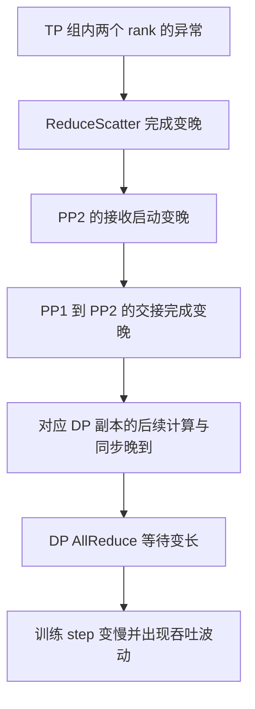
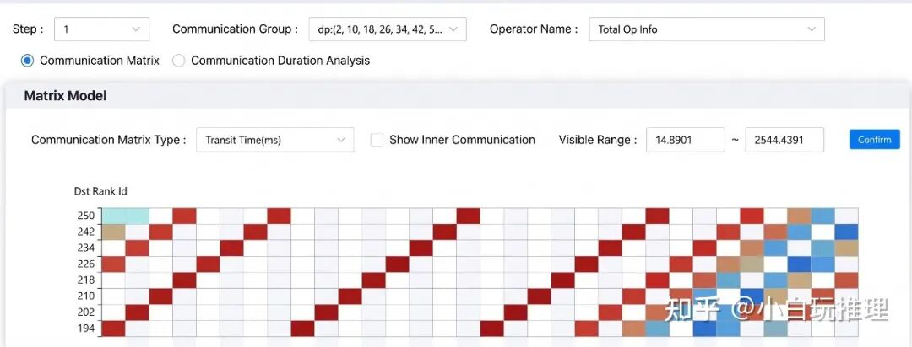
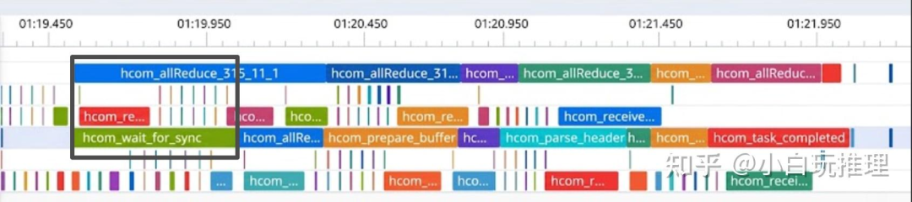
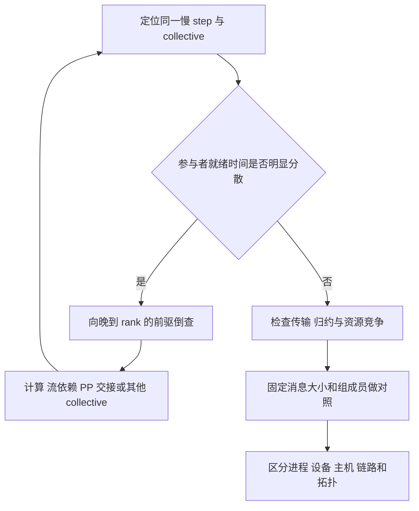

# 3D 并行训练的慢 Rank 定位与通信等待传播学习文档

一条 AllReduce 在时间线上很长，可能是它在等上游，而不是网络搬运本身变慢。本文从一个 8192 卡训练案例出发，学习如何沿计算依赖逆向定位首个异常，并区分 DP 副本、通信组、rank 与物理设备。

本文属于**第三方资料整理型学习资料**。案例结果来自作者报告；本文核对并行和 collective 的基本语义，补充教学推导与排障方法，没有访问原始集群、完整 trace 或复现实验。训练案例放在性能工程目录，是为了学习跨组件等待分析；梯度同步结论不能直接套用到推理 DP。

## 0. 阅读基线与范围

| 项目 | 内容 |
| --- | --- |
| 原文标题 | 训练infra踩坑：万卡集群为何变慢？ |
| 原文链接 | [公众号文章](https://mp.weixin.qq.com/s/2Y9W9U2fwgabKZjP8zkK8A) |
| 作者 | 小白玩推理；文末标注获作者授权发布 |
| 发布时间 | 2026-09-29 22:20:22，Asia/Shanghai |
| 读取时间 | 2026-10-08 |
| 原始来源入口 | [文末所列知乎文章](https://zhuanlan.zhihu.com/p/2082235555279120372)；本次该入口未成功读取，以完整公众号正文为案例依据 |
| 原文配置 | 8192 张计算卡，DP=64、TP=8、PP=16，MoE 训练；没有完整硬件、模型、软件版本或 EP 配置 |
| 本文范围 | 通信域映射、晚到 rank、TP→PP→DP 等待传播、证据与指标口径 |
| 一手复核 | NVIDIA Megatron Bridge 并行说明、NCCL collective 语义；用于核对通用概念，不证明原案例使用这些软件 |
| 配图 | 保留原文两张技术图，见[来源记录](../../images/training-stragglers/SOURCES.md) |

### 术语速查

| 术语 | 人话解释 | 需要辨认的边界 |
| --- | --- | --- |
| rank | 一次分布式任务中的进程编号 | 全局编号与通信组内编号不同；不是永久硬件 ID |
| TP | 多张卡共同计算一层中的张量运算 | 不是把不同层依次放到不同卡 |
| PP | 不同阶段承担不同层，按依赖传递激活或梯度 | 阶段等待可能由下游尚未就绪造成 |
| DP 副本 | 一套能够覆盖模型计算的数据并行副本 | 可以包含多张 TP×PP 卡 |
| DP 通信组 | 不同副本中承担对应模型分片的 ranks | 不等于一个完整模型副本 |
| collective | 多个 rank 按一致语义参与的集合通信 | 一条操作的耗时可含等待，不等于纯线速传输时间 |
| straggler | 在当前依赖链上拖慢其他参与者的进程 | 需要区分“晚到”与“传得慢” |
| exposed communication | 没能被有效计算覆盖、落在关键路径上的通信时间 | 不能直接用所有通信时长之和代替 |

## 1. 先给案例结论，再看证据强度

原文描述的排查路线是：整体吞吐波动 → DP 通信时间离散 → 某些 rank 晚启动 AllReduce → 对应副本的 PP1→PP2 交接延迟 → PP2 所在 TP 组的 ReduceScatter 异常。作者报告交叉打流后问题固定在该 TP 组的 rank 2/3，替换相应计算卡后恢复稳定。

这个案例支持“沿上游依赖定位慢点”的方法，但公开材料没有给出硬件错误码、完整对照矩阵或原始 trace，因此不能进一步断言是某种 GPU、网卡、链路或特定芯片错误。



**图意解读：** 整理者按原文叙述绘制的因果链；箭头代表依赖传播，不代表这里已经取得了每条边的运行证据。一个位置的等待可以传播到许多 rank，不能将各条长条的耗时相加作为额外墙钟延迟。

## 2. 8192 张卡如何同时属于三种通信关系

### 用坐标理解，不靠“横切、竖切”记忆

暂按原文给出的 DP×PP×TP 三维布局，给 rank 一个逻辑坐标 `(d,p,t)`：`0≤d<64`、`0≤p<16`、`0≤t<8`。这是教学坐标，不是原集群的实际 rank 排列。

| 固定坐标 | 改变坐标 | 得到什么 | 本例规模 |
| --- | --- | --- | --- |
| d、p | t | 同一个阶段的 TP 组 | 8 ranks；共 64×16=1024 组 |
| d、t | p | 对应张量分片跨阶段的 PP 组 | 16 ranks；共 64×8=512 组 |
| p、t | d | 对应模型分片跨副本的 DP 组 | 64 ranks；共 16×8=128 组 |
| d | p、t | 一套 DP 副本 | 16×8=128 ranks；共 64 套 |

所以 `64×16×8=8192`，一个 DP 副本有 128 个 rank，而一个 DP 通信组有 64 个 rank。组与副本是两种不同的集合，并不矛盾。

**纠正原文末尾的表述：** TP 切分层内张量计算，PP 切分模型层/阶段；原文把 PP 解释成 hidden 维度切分、TP 解释成不同层切分，二者写反。依据为 [Megatron Bridge Parallelisms Guide](https://docs.nvidia.com/nemo/megatron-bridge/latest/parallelisms.html)。

一个小例子：在 `DP=2、PP=2、TP=2` 的 8 卡教学拓扑中，`(0,1,0)` 的 TP 同伴是 `(0,1,1)`，PP 同伴是 `(0,0,0)`，DP 同伴是 `(1,1,0)`。同一个慢进程会通过不同边影响不同集合，不能只查一组网络连接。

原文未说明 EP、CP、分布式优化器和物理映射。真实 MoE 系统可能增加专家通信组或改变梯度同步方式；不能将上述三维模型当成所有现代训练的完整拓扑。

## 3. 为什么 DP 的带宽异常可能从 TP 开始

### 通信矩阵告诉你在哪里异常，还没告诉你原因



**图意解读：** 图中选择了 DP 通信组，展示的是 `Transit Time(ms)`，可见范围约为 14.89–2544.44 ms。它是耗时矩阵，不是直接显示 GB/s 的带宽图；颜色能帮助缩小异常路径，但完整图例与测量口径未提供。原文概括为约 15 ms～2.6 s，不宜据裁剪截图重建全网带宽。

测得 `有效带宽 = 数据量 / 总耗时` 时，总耗时若包含等其他 rank，就会出现“带宽下降”。排查应继续区分：

| 时间边界 | 可能包含的内容 | 可以检查什么 |
| --- | --- | --- |
| Host API 进入到返回 | 入队、参数准备、同步等待；异步 API 可能很快返回 | CPU trace 与调用方式 |
| GPU 上算子开始到结束 | 协议、等待、收发、归约及资源竞争 | GPU trace、通信子任务和依赖 |
| 参与者最晚就绪到 collective 完成 | 理想化的剩余服务时间；不一定全是网络传输 | 对齐同一 collective 的所有 rank |
| step 的关键路径 | 无法与有效计算重叠的依赖链 | step ID、microbatch ID、数据依赖 |

[NCCL collective 文档](https://docs.nvidia.com/deeplearning/nccl/user-guide/docs/usage/collectives.html)可用于学习 AllReduce、ReduceScatter 的语义；原图实际出现 `hcom_*`，不能将其当作 NCCL kernel 的截图，也不能套用 NCCL 特有的计时字段。

### 最长的条，可能属于最早到达的受害者



**图意解读：** 黑框内可见蓝色 `hcom_allReduce` 与绿色 `hcom_wait_for_sync`；右侧还有 prepare、receive、parse、task completed 等子任务。它提示“长算子内部存在同步等待”，但截图缺少完整 rank 标签和相关前驱，不能仅凭这一幅裁剪图独立确认 rank 2/3 是首因。

**教学模型：** 若各 rank 就绪时间是 `a_i`，最后参与者在 `A=max(a_i)` 就绪，之后还需时间 C 才完成，则早到 rank 的观测耗时可近似写成：

```text
D_i ≈ (A - a_i) + C
```

这只是用于说明晚到效应的简化模型；实际 collective 可以边等待边推进。假设两个进程在 0 ms 就绪，另一个在 80 ms 才就绪，此后还需 10 ms，那么前两个会看到约 90 ms，晚到者只看到约 10 ms。按“谁的 collective 最长”选坏卡，会选中等待者。

跨机器时间戳还需要时钟对齐或可关联的事件标记，否则不能把不同节点 trace 的横轴直接拼起来推导 80 ms。

## 4. 沿依赖倒查：从最终等待者找到第一个晚点

原文先观察到 DP 异常，而早期的 TP 聚合统计看似正常，后来才定位到具体 TP 组。二者不必矛盾：局部短暂异常可能在全局均值、采样间隔或不同时间窗口中被稀释。排查时应记录 group、rank、step 与统计窗口。

| 倒查步骤 | 本例观察 | 下一步需要的证据 |
| --- | --- | --- |
| 固定异常 step | 吞吐波动、通信暴露率增加 | 原始 step 时间、样本量、batch/token 口径 |
| 找到 DP 组与 collective | AllReduce 时间范围扩大 | 相同 group、序号、tensor 大小、数据类型 |
| 区分早到等待与晚启动 | 某些 rank 启动偏晚 | 各 rank 的前驱完成与通信起点 |
| 进入对应 DP 副本 | PP1 发送完成变晚 | 发送就绪、接收就绪和通信完成分开记录 |
| 进入 PP2 的前驱 | PP2 接收启动晚；其 TP ReduceScatter 过长 | 同组逐 rank 时间线，排除更早计算或资源竞争 |
| 检查物理关联 | 作者称 rank 2/3 在交叉打流中稳定异常 | rank→主机→设备→链路映射、交换变量与复测结果 |

这里的“TP ReduceScatter”是案例路径，不意味着 ReduceScatter 只属于 TP。带分片优化器的 DP 也可能使用 ReduceScatter 与 AllGather；看到算子名字后，仍需查它所属的 communicator。



**图意解读：** 整理者的诊断分支。就绪同步只能缩小范围，不能证明网络必坏；计算/内存资源争用仍可能拖慢通信 kernel。主动打流属于建议的后续实验，本文没有执行。

## 5. 换卡恢复意味着什么，哪些结论仍不能补写

原文报告重复打流与交叉验证后换卡恢复，这是重要的干预证据。但“换卡”可能同时改变设备状态、进程生命周期甚至连接路径；缺少完整交换记录时，不应补成某种硬件故障的确定诊断。

以下是建议的对照，均非本文已完成的操作：

- 保持物理设备不变，改变逻辑 rank 分配：看异常跟 rank 还是跟设备。
- 保持通信组与消息配置一致，交换设备或主机：看问题是否随组件移动。
- 单独检查计算、内存与通信表现：区分“上游未就绪”与“就绪后仍慢”。

恢复验收应覆盖长时间、多 step 的分位延迟、通信暴露、异常组尾部与任务吞吐。一次短测没有异常，不足以覆盖原文描述的偶发波动。

### 原文数值的使用边界

| 原文报告 | 本文保留的含义 | 不应直接推导 |
| --- | --- | --- |
| 波动率从 3.6% 到最高 22.18% | 作者观察到稳定性恶化 | 未定义公式，不能自动视为方差、变异系数或吞吐下降比例 |
| 通信暴露率增加 6 个百分点 | 作者采用的 overlap 指标恶化 | 不是通信总量增长 6%，也不保证 step 慢 6% |
| AllReduce 约 15 ms～2.6 s | 某次分析中的耗时跨度 | 不是相同 payload 的独立网络线速实测 |
| 恢复后“3M token/step” | 每步 token 量口径 | 缺少 step 秒数，不能换算为 token/s，也不能单独证明吞吐稳定 |

“点→线→面→体”适合表达影响范围扩大。延迟是否增加一个数量级取决于关键路径、流水线和重叠，不能作为通用倍率规律。

## 6. 自测与阅读路线

先读[并行方法导航](../parallelism/README.md)，理解切分对象，再用本文练习倒查；看推理系统 trace 时可继续读 [SGLang Torch Profiler 与 Trace](<../../sglang/performance-engineering/SGLang Torch Profiler 与 Trace 性能分析学习文档.md>)。

自测：一个 DP 组有 64 个 rank，是否表示每份模型只占 64 卡？不表示，本例每份是 TP×PP=128 卡。某 rank 的 AllReduce 最长，是否优先换它的卡？先找最晚就绪者及其上游。TP 聚合曲线正常，是否能排除 TP？不能，应查看异常时间窗口内的具体通信组和尾部。

核心方法是沿同一事件的依赖链回溯，把“谁在等待”和“谁首先变晚”分开。

## 7. 参考与延伸

- [训练infra踩坑：万卡集群为何变慢？](https://mp.weixin.qq.com/s/2Y9W9U2fwgabKZjP8zkK8A)：案例与两张原图。
- [Megatron Bridge Parallelisms Guide](https://docs.nvidia.com/nemo/megatron-bridge/latest/parallelisms.html)：TP、PP、DP 与其他并行维度；读取于 2026-10-08，网页随版本更新。
- [NCCL Collective Operations](https://docs.nvidia.com/deeplearning/nccl/user-guide/docs/usage/collectives.html)：核对集合通信语义，不代表原案例软件栈。
