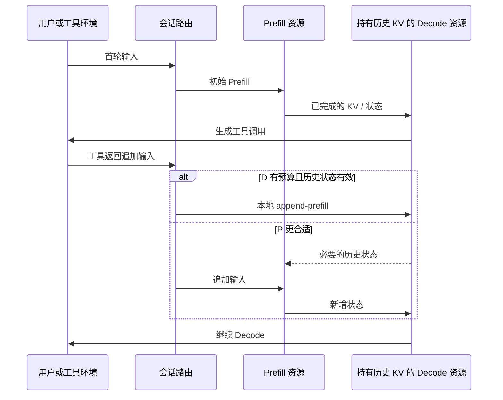
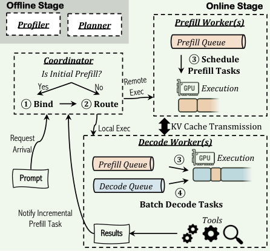
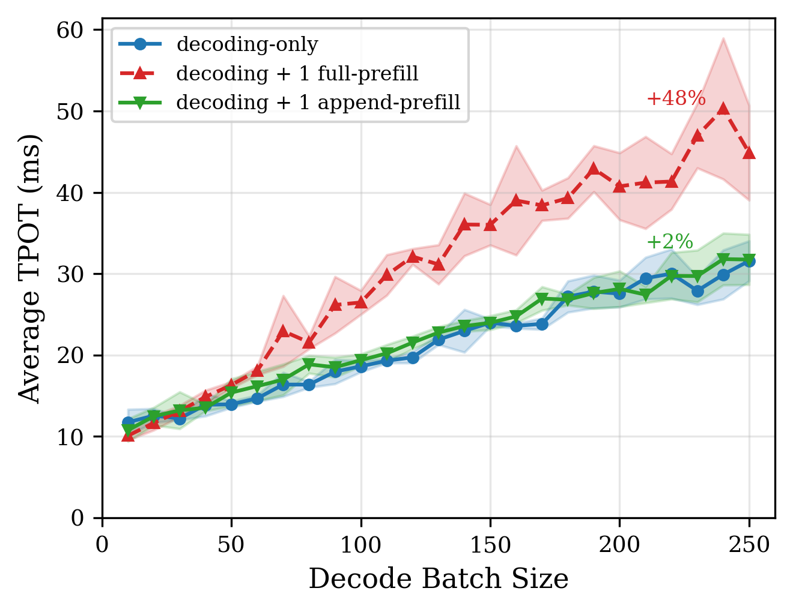
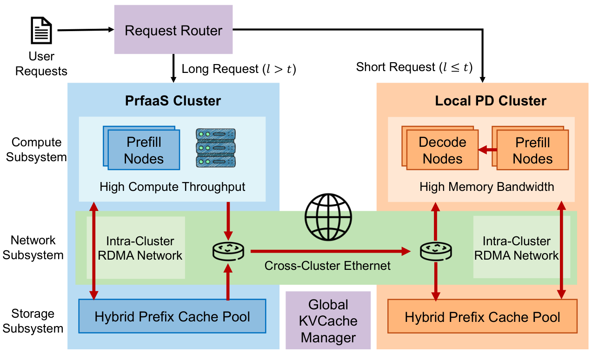
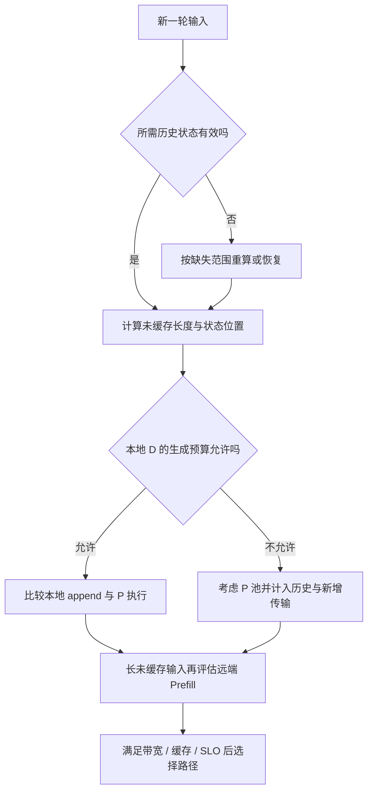

# 多轮 Agent 的 PD 路由与跨数据中心 Prefill 学习文档

一次 Agent 会话不是一条直线：模型生成工具调用，等待工具，再把工具结果作为新输入继续生成。上一轮 Decode 已经积累的历史 KV，恰好决定下一轮 Prefill 放在哪里更划算。

本文属于**第三方资料整理型学习文档**，比较 AMPD、PPD 与 PrfaaS。三者关注不同粒度的放置决策，不能拼成“所有第二轮请求留在 D、所有长请求跨机房”的固定规则。没有复现论文系统，也没有修改任何集群配置。

## 0. 阅读基线与范围

| 项目 | 内容 |
| --- | --- |
| 原文标题 | Agent 时代，PD 分离裂开三道缝：AMPD、PPD、PrfaaS 怎么补 |
| 原文链接 | [HyperAI 原文](https://mp.weixin.qq.com/s/iOudrmkN-4844Is9F3ZC6g) |
| 作者 / 机构 | HyperAI |
| 发布时间 / 读取时间 | 原文 2026-08-31 08:49:47，Asia/Shanghai；读取 2026-09-14 |
| 类型与方法 | 外部文章整理；进一步读取三篇论文 v1 的调度机制、系统图和评测条件 |
| 整理范围 | 首轮 / 追加 Prefill、历史状态局部性、TTFT 与 ITL 权衡、跨数据中心带宽预算 |
| 不展开 | 完整调度器实现、厂商服务可用性、跨地域合规与采购、论文实验复现 |
| 图片 | 原文无正文图片、技术 SVG 或背景图；补充三篇论文的关键原图，见[图片来源](../images/agent-pd-routing/SOURCES.md) |
| 查重 | 链接、标题和三篇论文编号未命中已有文章分析 |

| 论文 | 作者 / 机构 | 阅读锚点 |
| --- | --- | --- |
| [Efficient Multi-round LLM Inference over Disaggregated Serving](https://arxiv.org/html/2602.14516v1) | Wenhao He 等；东南大学、剑桥大学、北京大学、蚂蚁集团、上海交通大学 | AMPD，2026-02，v1；§3–5 与 §7 |
| [Not All Prefills Are Equal: PPD Disaggregation for Multi-turn LLM Serving](https://arxiv.org/html/2603.13358v1) | Zongze Li 等；芝加哥大学等 | PPD，2026-03，v1；§3–6 与附录 |
| [Prefill-as-a-Service: KVCache of Next-Generation Models Could Go Cross-Datacenter](https://arxiv.org/html/2604.15039v1) | Ruoyu Qin 等；Moonshot AI、清华大学 | PrfaaS，2026-04，v1；§2–4 |

| 术语 | 人话解释 |
| --- | --- |
| initial / full prefill | 没有可复用历史状态时，为完整输入建立状态 |
| incremental / append-prefill | 保留有效历史状态，仅为新追加 token 做 Prefill |
| locality | 所需历史状态就在准备执行的地方，可避免额外搬运或重算 |
| TTFT | 请求提交到首个输出 token 的时间；多轮要区分首轮与后续轮 |
| ITL / TPOT | 相邻输出 token 的延迟 / 每输出 token 时间，统计定义需固定 |
| SLO attainment | 请求满足指定延迟目标的比例 |
| uncached length | 扣除合法可复用前缀后，实际还要计算的输入长度 |

## 1. 从一条三轮会话理解问题



**图意解读：** 整理者的图强调历史状态通常已经在 D。远端分支是否传历史、传多少，取决于 P 是否已有合法缓存；不是每次必然传完整历史，也不是只传新增状态就永远够用。

**示例，非论文测量：** 第一轮有 16K 输入，模型输出 200 token 后调用工具，工具追加 300 token。下一轮若完整历史仍在 D，只需对新输入执行 append-prefill；如果缓存被淘汰、位置变化或上下文被重写，就不能按“只算 300 token”估计。

追加 Prefill 也不是 O(新 token 数) 的固定小任务。全注意力中新 Query 仍会读取历史 K/V，其开销与历史长度有关。因此需要同时记录历史长度与追加长度。

## 2. 三个系统各自决定哪一件事

| 系统 | 决策对象 | 主要输入 | 控制与数据的分工 |
| --- | --- | --- | --- |
| AMPD | Prefill 执行在哪、队列怎么排、P/D 如何部署 | TTFT / ITL 窗口统计、排队、模型性能估计 | coordinator 决策；worker 计算与传状态；离线 planner 选资源 |
| PPD | append-prefill 路由到 P 还是 D | TTFT / TPOT 目标、负载、初始 P/D 比例 | 动态路由调节本地执行比例；D 利用已有 KV |
| PrfaaS | 哪些未缓存长输入值得去远端 Prefill 集群 | 未命中长度、缓存位置、跨站带宽、各池容量 | 全局调度与元数据管理；远端产生状态、本地继续服务 |

共同点是把状态位置计入决策。差异在于 AMPD / PPD 主要处理多轮阶段干扰，PrfaaS 主要扩展长 Prefill 的部署范围。PrfaaS 不要求所有应用都是 Agent，不能只把它当成另一种第二轮本地化策略。

## 3. AMPD：将 SLO 余量变成路由依据



**图意解读：** 图左上离线 profiling / planning 形成时间模型和部署选择；在线 coordinator 观察 worker 状态并分配任务。图中的状态共享服务于调度，不表示它替代 NIC 或 GPU 搬运 KV。原图分辨率较小，可点击打开，并结合下方文字阅读。

### 3.1 先绑定历史状态的拥有者

论文让会话绑定一个 Decode worker，由它管理历史 KV 并承担后续 Decode。本地执行减少搬运，但会干扰正在生成的 batch；远端执行减轻 D 的计算干扰，但可能先读取历史，再把新增 KV 传回并合并。[AMPD §3](https://arxiv.org/html/2602.14516v1#S3)

### 3.2 决策不是永远选择最快空闲 GPU

论文先检查 P 侧 TTFT 是否有余量；P 普遍紧张时，再看对应 D 的 ITL 余量；双方都紧张时用性能模型比较本地与远端成本。还包含 Prefill 队列重排与离线部署规划，不能只提炼成一个本地 / 远端开关。[AMPD §4–5](https://arxiv.org/html/2602.14516v1#S4)

下面是整理者的成本分解，非论文算法逐行翻译：

```text
本地成本 = D 排队 + append 计算 + 对其他 Decode 的干扰代价
远端成本 = P 排队 + 必要历史传输 + append 计算 + 增量返回与安装
```

**算例：** 本地执行花 8 ms，远端排队和通信合计 20 ms，看似应选本地；但如果这 8 ms 会使同批大量请求越过 ITL SLO，远端可能更合适。优化对象是服务目标，不能只最小化当前请求耗时。

**排障提示：** 窗口平均值会滞后于突发负载。观测要保留各阶段分位数和决策时快照，避免“路由时不忙，真正执行时拥塞”被误判为成本公式错误。

## 4. PPD：D 可以处理追加输入，但没有万能比例

### 4.1 append 与 full prefill 的干扰不同



**图意解读：** 此图来自单张 H100、Llama-3.1-8B 的受控微基准，比较一项 full / append-prefill 与 Decode 并发时的 TPOT 变化。在 batch 200 的特定点，论文约为 48% 对 2% 的减速；四项 Prefill 并发的附录对照则约为 57% 对 21%。所以“追加 Prefill 几乎无干扰”不能泛化到更高并发。[PPD §4.1 与附录](https://arxiv.org/html/2603.13358v1#S4)

人话理解：复用历史状态减少了重复工作，但新 token 的 Attention 和其他层仍会抢占 GPU 时间、带宽与临时显存。

### 4.2 x 是可调比例，不是架构常量

设 x 表示追加 Prefill 在 D 本地执行的比例：

| x 的倾向 | 可能收益 | 可能代价 |
| --- | --- | --- |
| 接近 0 | D 更专注生成 | P 排队、历史状态读取和返回开销增加 |
| 接近 1 | 历史局部性好，减少远端路径 | 对 D 的生成时延和容量施压 |
| 动态改变 | 可随负载与 SLO 在两者之间取舍 | 需要估计、状态更新和稳定的控制策略 |

原文“第二轮起本就不该远程往返”过于绝对。论文明确没有单一静态 x 能同时在 TTFT、TPOT、吞吐各目标上占优，PPD 本身就是动态路由。

### 4.3 68% 的改善如何记录

论文主系统实验使用 4×H100 80GB、NVLink，主要模型 Llama-3.1-8B，并有其他模型验证；扫过负载、P/D 配置、到达率与路由比例。其后续轮 TTFT 改善是该实验范围的结果，不是任意多节点网络的保证。[PPD §4–6](https://arxiv.org/html/2603.13358v1#S5)

原文“历史重算最高占 99%”也不是一个通用权重常数。真实开销取决于历史与追加长度、缓存命中、注意力类型、引擎执行方式及当前 batch。

## 5. PrfaaS：带宽不是只看一条请求够不够



**图意解读：** 本地仍有 P、D，能独立处理不值得远端卸载的请求；远端 PrfaaS 提供额外长 Prefill 算力。跨站传输和集群内通信分属不同网络层级，不能把远端画成“所有 P 被迁走”。

### 5.1 小状态改变可行范围，调度决定是否真的划算

混合注意力让部分层只维护有限窗口或状态，减少需要搬运的数据。这里不能把所有紧凑状态都叫做“对普通 KV 做有损压缩”：其中有模型结构本身带来的状态缩减。滑窗缓存与线性注意力状态也不是同一种对象。[PrfaaS §2–3](https://arxiv.org/html/2604.15039v1#S3)

即使状态很小，远端排队、启动开销、RTT 与拥塞也可能让短请求得不偿失。路由阈值应使用未缓存长度，并同时考虑缓存亲和性。

### 5.2 一张简单预算表

定义有效状态产生速率：

```text
每实例状态速率 Φ = 每请求需传状态字节 / 每请求 Prefill 时间
远端吞吐上限 ≈ min(计算能力，跨站有效带宽 / 每请求传输字节)
```

这是稳态容量视角，不是单请求延迟保证。多个 Prefill 实例会叠加出口需求，突发流量还会形成队列。

**整理者例子：** 8 个实例各每秒生成 100 MiB 待传状态，合计 800 MiB/s，约 6.71 Gb/s。5 Gb/s 链路即使无协议损耗也跟不上。把每请求 Prefill 算得更快，反而可能更快堆积待传队列。

下面给出一个独立的卸载判断例子：本地排队与计算共 900 ms；远端排队 80 ms、计算 200 ms、传输与安装 120 ms，总计 400 ms，可能值得卸载。若缓存命中后本地只需 70 ms，同一个“总长度很长”的请求就未必值得远端处理。

### 5.3 hybrid cache 的命中必须同时覆盖所有状态组

full-attention KV 可以按前缀块匹配，线性状态往往代表某个完整前缀的累计结果；不能把较长前缀的最终状态任意截成较短状态。滑窗则要保证边界所需窗口仍然存在。

全局元数据说“某集群有前缀”还不够，目标要确认各组状态的有效边界、位置和可恢复性。为了传输尾部而暂存的 block，与供将来前缀命中的完整 block，也有不同的释放条件。

### 5.4 性能数字的三个基线

| 作者报告 | 比较对象 / 条件 | 本文采用方式 |
| --- | --- | --- |
| 吞吐提升 54%，P90 TTFT 降低 64% | 内部 1T 混合模型；32 H200 远端 + 64 H20 本地，对比 96 H20 | 保留同卡数但不同硬件成本的条件 |
| 吞吐提升 32% | 对比未做相应调度优化的朴素异构部署 | 不与上一行相加 |
| 同等成本约提升 15% | 论文自己的成本归一化 | 不当作当前报价或任何供应商承诺 |

案例跨集群连接约 100 Gb/s；文中平均出口约 13 Gb/s。平均值不代表高峰、尾延迟和全量生产稳定性，本文未获得独立运行证据。[PrfaaS §4](https://arxiv.org/html/2604.15039v1#S4)

## 6. 把三项研究变成诊断顺序



**图意解读：** 这是整理者的排查框架，不是三篇论文代码的拼接实现。每一步先判定状态与预算，再决定数据走向。

| 现象 | 优先检查 |
| --- | --- |
| 第二轮 TTFT 高、P 忙而 D 有余量 | 追加任务是否固定走 P，历史缓存是否仍在 D |
| 本地追加后所有生成请求卡顿 | D 侧预算、并发 append 数、历史长度、ITL 尾部 |
| 网络持续满载 | 聚合状态生成速率、重传、完整历史重复搬运、错误的卸载阈值 |
| 缓存命中率高但恢复仍很慢 | 命中在哪层 / 哪个集群，各状态组是否同时可恢复 |
| 同配置吞吐变好但用户体验变差 | 是否牺牲 TTFT / ITL 的尾部或失败率 |

## 7. 自测与延伸

- **D 已有历史 KV，还需要 Prefill 吗？** 新 token 仍需计算，并读取相关历史。
- **长请求一定适合跨站吗？** 要看未缓存长度、输出状态大小与有效带宽。
- **三个论文收益能叠乘吗？** 它们修改的决策和基线不同，组合必须另做实验。
- **保留 KV 只赚不亏吗？** 它占容量；工具等待时间、淘汰、后续轮命中收益需要共同计入。

相关资料：[LLM Prefill 与 Decode 阶段](<LLM Prefill 与 Decode 阶段源码学习文档.md>)、[Kimi K3 混合注意力缓存与 Mooncake 状态传输](<Kimi K3 混合注意力缓存与 Mooncake 状态传输学习文档.md>)、[Attention–FFN 分离的收益边界](<Attention-FFN 分离的收益边界与部署选型学习文档.md>)。

**一句话总结：** 多轮推理的放置单元应同时包含本轮新增计算、历史状态位置和其他请求的时延预算；跨机房只是这个判断在更大网络尺度上的延伸。
