# 大模型推理全链路优化学习文档

推理优化可以从一个问题开始：**一次请求为什么要等待，等待的是计算、数据、可用容量，还是其他请求？** 本文以 FlashTensor、Jenga、MixQ、FastDecode 和赤兔为例，把算子、内存、量化、异构调度与并行串起来。

这是第三方资料整理型学习文档。以演讲整理稿和原始幻灯片为主，补充作者项目与论文核对；没有运行这些系统或复现性能。本篇也作为本组 8 篇来源的阅读入口，逐项去向见第 9 节。

## 0. 阅读基线与范围

| 项目 | 内容 |
| --- | --- |
| 原文标题 | 大模型推理加速全链路：内存管理、编译优化、量化与并行策略 |
| 原文链接 | [InfoQ 演讲整理稿](https://mp.weixin.qq.com/s/K0njstjn1q5MMOnfU8ILIg) |
| 作者 / 机构 | 金煜阳博士，清华大学助理研究员；QCon 策划、InfoQ 发布，审核罗燕珊 |
| 发布时间 | 2026-08-19 |
| 读取时间 | 2026-09-09 |
| 资料类型 | QCon 2026 北京站演讲实录与幻灯片 |
| 整理范围 | 五个优化层次的机制、控制权、数据流、收益条件与相互影响 |
| 不展开内容 | 市场规模预测、全部硬件支持、当前版本部署教程、论文逐行推导 |
| 核对深度 | FlashTensor 作者 artifact、Jenga 与 FastDecode 论文摘要、MixQ 作者仓库、赤兔官方仓库；未做源码审计或实验 |
| 图片处理 | 原文 13 张图片中保留图 2–10 的 9 张技术幻灯片；品牌动画、装饰图标、会议推广海报不纳入。[原图与校验清单](../images/inference-full-stack/SOURCES.md) |

### 术语速查

| 术语 | 人话解释 | 不应混淆的东西 |
| --- | --- | --- |
| Prefill | 处理新输入，建立模型历史状态 | 前缀命中后并不需要重算全部历史 |
| Decode | 从已有状态继续生成 | 不代表所有模型、所有 batch 都只受带宽限制 |
| 算子融合 | 把多步计算合在更少的 kernel 中 | 不意味着融合越大越快 |
| PagedAttention | 用逻辑到物理页映射管理 KV | 减少碎片不等于删除历史信息 |
| 混合精度 | 不同数值部分采用不同精度 | 权重精度、激活精度、累加精度要分别看 |
| 算术强度 | 计算量与数据移动量的比例 | FLOPS 峰值本身不能代表实际执行效率 |
| 异构调度 | 将不同性质的计算安排到不同硬件 | “CPU 存 KV”与“CPU 算 Attention”不同 |
| SLO | 可接受的延迟等服务目标 | 不满足延迟的高吞吐未必有业务价值 |

## 1. 先建立整体地图

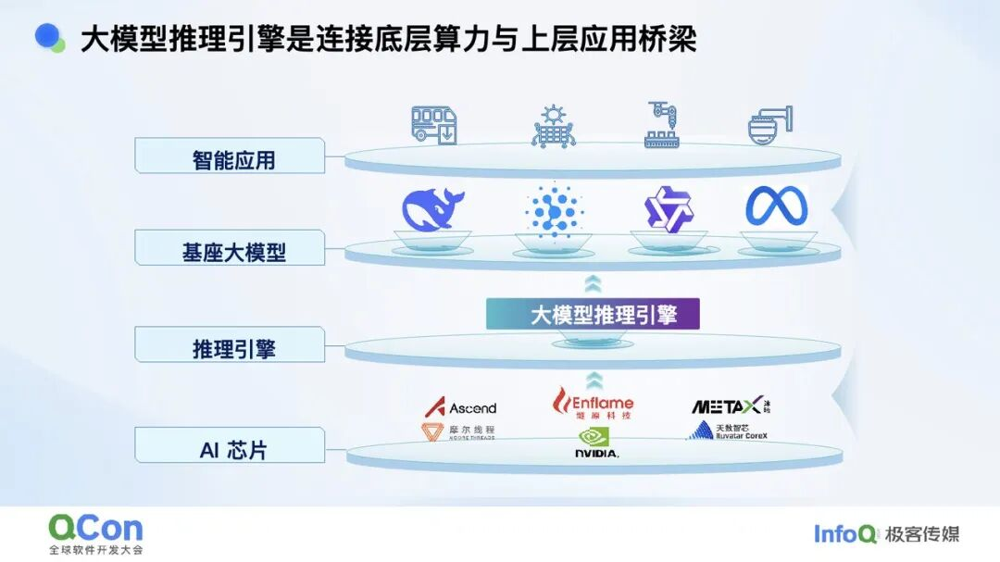

**图意解读：** 模型和应用位于上层，芯片位于下层，引擎负责把计算与状态管理映射到硬件。图中的厂商标识是演讲涉及的生态，不等于本文已经验证每个模型×硬件×功能组合。

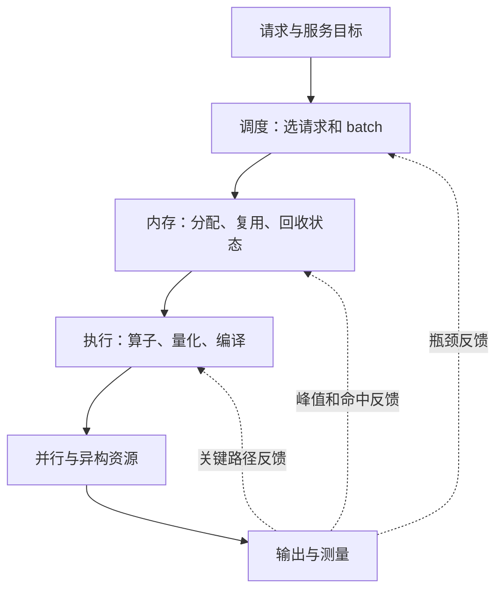

**图意解读：** 这是整理者画的反馈关系。并行和内存并非执行完才生效，它们共同决定运行方式；图用于说明优化应以请求级测量闭环。

例子：把某个 Attention kernel 加速 2 倍，如果它原来只占请求耗时的 30%，且其他部分不变、不考虑重叠，总加速也只有 `1/(0.7+0.3/2)≈1.18` 倍。这是教学算式，说明局部倍数不能直接写成端到端倍数。

## 2. FlashTensor：融合与并行之间的取舍

### 人话版

前一个算子写出的大张量，可能马上被下一个算子读走。把两者合起来可以少写一次显存，但若融合后并行度太低，GPU 又会闲着。

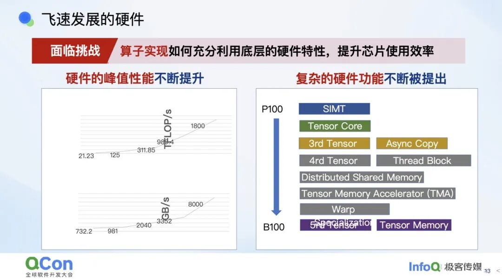

**图意解读：** 左边提示算力与带宽增长并不同步，右边展示越来越复杂的执行功能。它说明“同样的计算图在不同硬件上需要不同实现”，图中的峰值数字缺少统一精度口径，本文不把它整理成硬件选购对比。

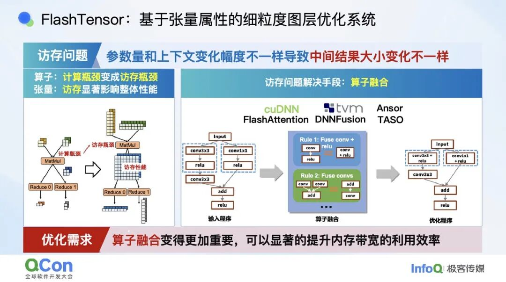

**图意解读：** 左侧强调输入维度变化会让中间结果从小变大，右侧是图变换与融合。图中的数据流和中间张量大小决定访存成本；算子名字相同，不代表所有形状下都由相同瓶颈主导。

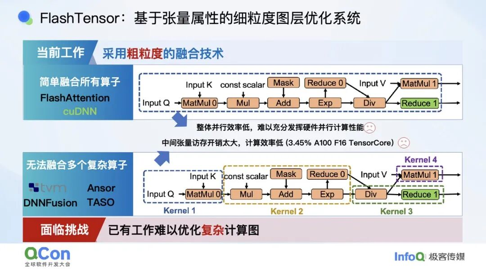

**图意解读：** 上方把大量算子包在一起，可能受到依赖关系限制；下方拆成多个 kernel，产生中间数据读写和启动开销。FlashTensor 的思路是更细地描述张量属性和依赖，再决定哪些计算一起做、哪些分开做。

### 为什么有时重算一点反而更快

整理者举例：一个小统计量被两条分支使用。单独算一次再写显存，节约了算术却增加写入、读取和同步；若各分支就地重复计算这个小量，可能减少整体等待。是否划算取决于依赖、张量大小和硬件，不能简单规定“绝不重算”。

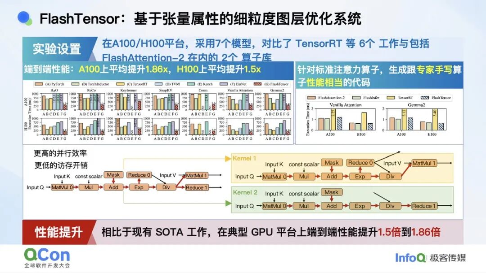

**图意解读：** 原幻灯片报告 A100/H100、7 个模型及多个基线，端到端平均提升分别约 1.86/1.5 倍；右侧还单列标准注意力 kernel。下方的变换说明，分成两个计算单元也可能同时改善并行度与中间存储。不要把 kernel 子图与左侧端到端结果当同一指标。

本次确认 [FlashTensor 作者 artifact](https://github.com/monellz/FlashTensor-AE) 对应 PPoPP 2025，提供端到端及 kernel 图的复现入口；没有执行其脚本。原文 A100 稀疏注意力“3.45% 效率”只属于特定案例，不能泛指所有未融合注意力。

## 3. Jenga：异构模型不能只靠一种页尺寸

### 人话版

普通分页缓解“每条请求必须占一整段连续空间”的问题。但如果不同层、不同 token 的状态大小和保留窗口都不一样，用同样的大格子仍会浪费空间。

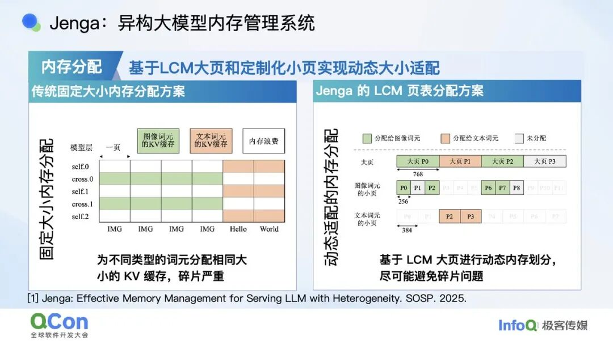

**图意解读：** 左边为图像和文本状态分配相同大小的格子，部分格子留空；右边用 LCM 大页承载不同小页。幻灯片示例的小页尺度为 256 和 384，大页为它们的最小公倍数 768。这里是比例/分配示例，不能据此给实际模型设置 byte page size。

机制分两层理解：

1. 物理层决定怎样减少不同尺寸对象造成的碎片。
2. 逻辑层按各层 token 依赖决定哪些状态仍有用、何时能淘汰。

只统一分配器，不会自动解决 KDA 检查点的合法恢复问题；只知道两个请求 token 相同，也不能忽略不同层是否仍拥有所需状态。

[Jenga 论文 v1](https://arxiv.org/abs/2503.18292v1) 的摘要报告最高 4.92 倍、平均 1.80 倍服务吞吐，区别于演讲里只强调最大值的读法。它是基于 vLLM 的研究评测，不是“当前 vLLM 所有模型都慢 4.92 倍”。[作者 artifact](https://github.com/heheda12345/Jenga-SOSP25-AE) 也明确区分演示实现和主线里的简化实现。

### 别把不同注意力名称互换

原文口语转写对 Full Attention、滑窗和线性状态有简化。学习时应区分：全历史注意力、只看有限窗口的注意力、把历史压进递推状态的机制，它们的依赖集合不同。分页管理可以服务这些对象，但不会让它们自动拥有相同的数学语义。

## 4. MixQ：低精度收益可能被离群值处理吃掉

### 人话版

大部分数值可以用低精度处理，少部分异常大的值需要保留更高精度。但如果为了照顾少数值而反复扫描、重排和启动小算子，省下的 GEMM 时间可能又被用完。

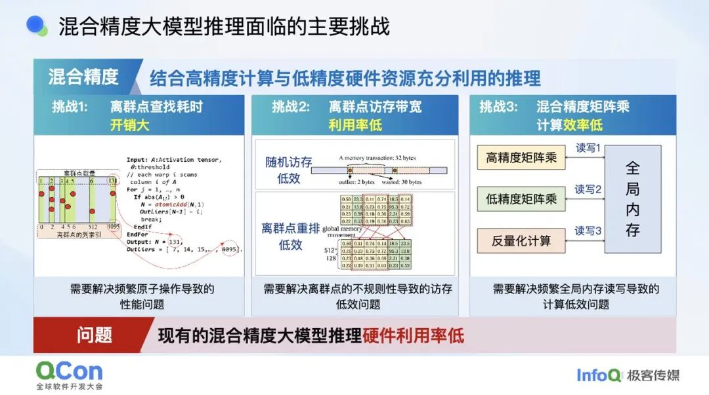

**图意解读：** 三栏分别是查找离群值、离散访存/重排、不同精度计算之间的反复读写。调度和数据布局位于性能关键处；“低精度 Tensor Core 很快”不足以推出整条量化路径快。

将一轮量化执行拆成下面几项，更容易排障：

```text
总成本 = 识别 / 预测离群值 + 数据组织 + 低精度主计算
       + 高精度修正 + 结果合并 + 启动 / 同步
```

这是整理者的成本分解，不是论文精确模型。[MixQ 作者仓库](https://github.com/Qcompiler/MIXQ) 对应动态离群值预测与混合精度 GEMM，同时区分 kernel 测量和集成后的文本生成。

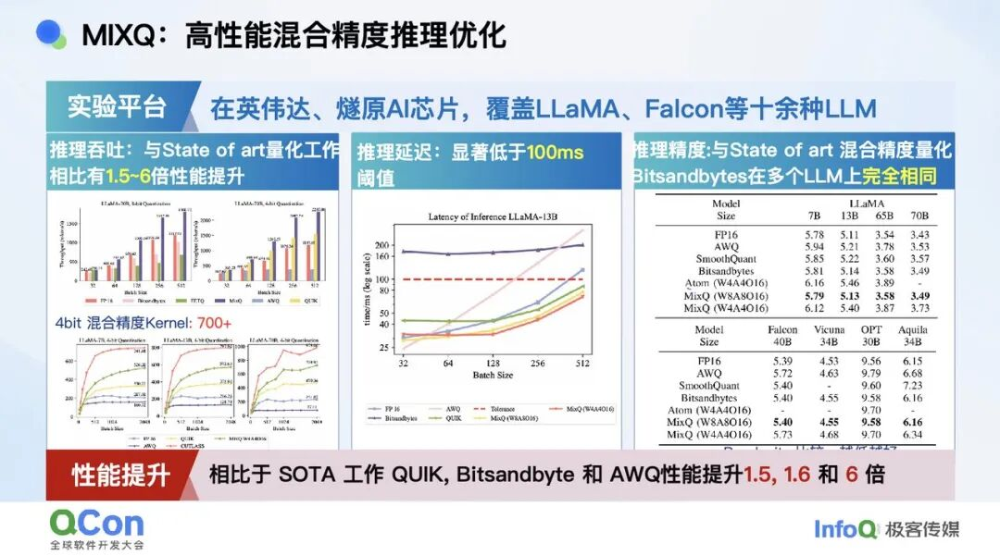

**图意解读：** 左侧比较不同 batch、精度和基线的速度，中间为延迟，右边为多个模型的质量表。1.5、1.6、6 倍对应不同对照，不能拼成一个统一收益。正文还提到燧原 S60 的端到端实验，但该截图不足以补全所有设置，本文不作独立硬件验证结论。

容量、质量、吞吐要同时记录。权重量化不能保证激活一定低精度执行，混合精度也不保证所有任务都零精度损失。

## 5. FastDecode：让 CPU 参与计算，而不仅是存储

### 人话版

如果 CPU 只负责存 KV，每一步 GPU 都可能等大块 KV 通过慢链路搬回来。另一种方式是把适合访存的计算也放在 CPU 侧，只交换相对小的查询与结果。

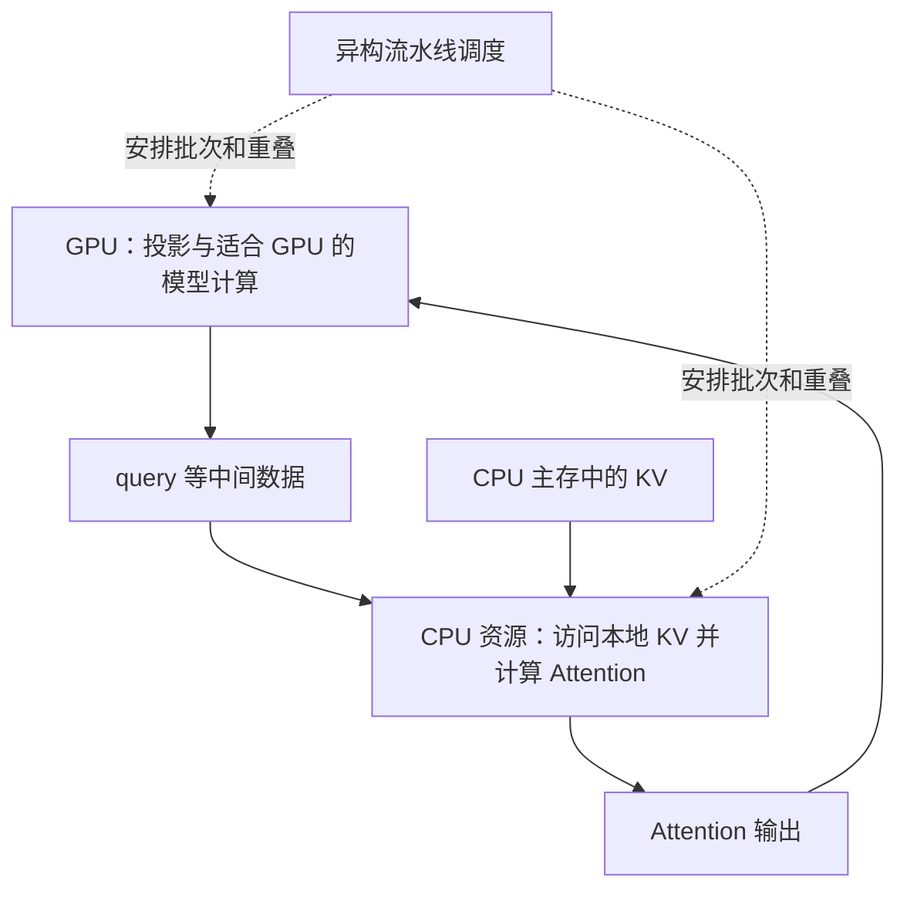

**图意解读：** 这是依据原文和论文摘要归纳的逻辑路径，不是具体线程图。容量与计算一起放置，减少把整段历史搬回 GPU 的需求；同时引入 CPU 算力、内存带宽、通信和调度成本。不能缩减为“任意一颗 CPU 加一张 GPU 就能更快”。

论文 [FastDecode v1](https://arxiv.org/abs/2403.11421v1) 明确讨论聚合多节点 CPU 资源，在相同 GPU 条件下报告相对 vLLM 的 1.88–5.04 倍吞吐。演讲称某些场景约 7 倍并提到 FastDecode Max，本次未获得与该数字对应的完整实验配置，因此不拿 v1 论文为它背书。

低延迟小 batch 与高吞吐大 batch 的最佳放置可能不同。应同时统计 GPU 数量之外的 CPU 节点数、主存和互连资源，避免只比较显卡数量。

## 6. 并行优化：按负载变化选择切分维度

### 人话版

长输入和长输出需要的资源不同，同一个模型里的 Attention 与 MoE 也不同。并行策略的选择是在计算、容量、通信和排队之间做取舍。

| 策略 | 切什么 | 主要新成本 |
| --- | --- | --- |
| TP | 一层内的张量/权重计算 | 层内集合通信 |
| PP | 模型层 | stage 传输、填充和排空气泡 |
| DP | 请求集合 | 多副本容量、请求分配与缓存局部性 |
| EP | 专家集合 | token dispatch/combine 与路由倾斜 |
| CP / DCP | token / 上下文工作或 KV 历史 | 局部结果合并与布局管理 |
| PD | Prefill 与 Decode 服务阶段 | 状态迁移和两端供需平衡 |

原文给出 DeepSeek 部署单元和并行组合的例子，用于说明“不同阶段、子模块可以采用不同策略”。本篇不将演讲中的 GPU 数量和 TP/DP/EP 乘积变成当前部署配方。

**整理者归纳：** 自适应切换也有成本：权重/KV 布局迁移、图重新准备、在途请求一致性与预热都可能出现。只有负载变化带来的长期收益覆盖切换成本，动态策略才有价值。

## 7. 赤兔：研究方法进入引擎还需要工程集成

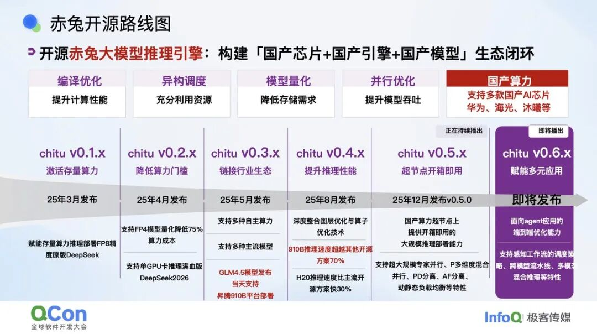

**图意解读：** 路线图把编译、异构调度、量化、并行和国产算力适配放在不同演进阶段。时间与“即将发布”属于演讲材料，不能作为 2026-09-09 的现行版本声明，也不能推断本文涉及的全部研究方法已经集成。

本次确认[赤兔官方仓库](https://github.com/thu-pacman/chitu)提供项目和部署文档入口，未运行或核验每种硬件后端。原文也明确说，异构模型内存管理等研究并非已经全部融入赤兔。

原文“一 CPU + 一 GPU 跑完整模型、吞吐约为另一套多卡方案一半”的案例，缺少本文可核对的精度、主存、上下文和到达负载。适合用来理解容量可行性与性能的取舍，不适合据此比较系统成本或采购硬件。文中“617B”的模型规模也不擅自纠正为另一数字，应等待对应模型与实验记录。

## 8. 小白排障地图

| 现象 | 从哪里开始看 | 可对照的机制 |
| --- | --- | --- |
| GPU 利用率低，但算子不慢 | CPU 发射空档、依赖与同步 | FlashTensor、CUDA Graph、关键路径 |
| 显存空闲却分配失败 | 分配粒度、对象类型、私有池容量 | Jenga、统一容量池 |
| 量化后模型装下了但更慢 | 离群值、重排、转换与后端选择 | MixQ |
| KV offload 后 TTFT/TPOT 抖动 | 传输放大、预取时机、链路排队 | OasisKV、SAC、FastDecode |
| 高缓存命中但 Prefill 仍重 | 匹配长度与合法状态边界差值 | KDA 检查点 |
| 多卡更多但延迟上升 | 集合通信、pipeline bubble、专家倾斜 | TP/PP/EP/CP |
| 版本升级后某个组合报错 | 请求 admission 与功能互斥 | Beam Search、fused-accept、HiCache |

这张表是整理者的调查路线，不是仅凭现象就能确定根因的规则。

## 9. 本组八篇来源的阅读去向

相近文章合并为一条机制主线；与现有资料重合的内容直接补进旧文。以下逐项保留原始标题与链接。

| 序号 | 原始资料 | 学习产物与处理重点 |
| --- | --- | --- |
| 1 | [SGLang 0.5.17：Kimi K3 原生 MXFP4 推理架构解析](https://mp.weixin.qq.com/s/rAEJBvwJVPt7eawrIW6kmQ) | [SGLang K3 协同优化](<../sglang/SGLang Kimi K3 推理协同优化学习文档.md>)：纠正 KDA、AttnRes、格式和客户端示例边界 |
| 2 | [Prefix Cache遇上KDA: 详解Mooncake+SGLang/vLLM/TokenSpeed应对Kimi K3挑战](https://mp.weixin.qq.com/s/Q4aCKh4ViMzQQwMpv8qOgg) | [K3 混合缓存与状态传输](<./Kimi K3 混合注意力缓存与 Mooncake 状态传输学习文档.md>)：与第 3 篇同源整合，不重复计作独立证据 |
| 3 | [当 Prefix Cache 遇见 KDA：Mooncake 如何 Day-0 支持 Kimi K3](https://mp.weixin.qq.com/s/Yxmt-Foq2D7b46sYOk7WAg) | 同上：主资料，保留 10 张原图，拆清检查点和传输职责 |
| 4 | [SGLang深度解读Kimi K3：KDA缓存、DSpark投机解码、DCP并行完整拆解](https://mp.weixin.qq.com/s/GUxqBQaH4ItRFQ37NfoYWg) | [SGLang K3 协同优化](<../sglang/SGLang Kimi K3 推理协同优化学习文档.md>)：6 张技术截图、投机提交、PP/DCP 与指标条件 |
| 5 | [SGLang v0.5.19 发布：Beam Search 落地，统一缓存与多模态推理持续优化](https://mp.weixin.qq.com/s/ecpKuo1Q_H9avsUBDjur_Q) | [v0.5.19 功能组合与升级边界](<../sglang/SGLang v0.5.19 功能组合与升级边界学习文档.md>)：默认值、互斥组合、压力行为与收益口径 |
| 6 | [KV Cache 和专家权重一起被赶出 HBM：近内存架构让推理吞吐翻 10 倍](https://mp.weixin.qq.com/s/n7pabHwC4LEjTrVKpYy6OQ) | [KV 与 MoE 权重分层内存](<./KV Cache 与 MoE 权重的分层内存学习文档.md>)：三篇论文分别核对，不泛化标题倍数 |
| 7 | [SGLang KV Cache演进：从RadixAttention到ShadowRadix，90万Token吞吐仅降10%](https://mp.weixin.qq.com/s/LudsqNrhZPjQwntQNeu6iQ) | [现有 KV Cache 技术主线](<../sglang/SGLang RadixAttention 与 HiCache KV Cache 技术主线学习文档.md>)：补充来源、演进维度和性能归因边界 |
| 8 | [大模型推理加速全链路：内存管理、编译优化、量化与并行策略](https://mp.weixin.qq.com/s/K0njstjn1q5MMOnfU8ILIg) | 本文：补出图片中的 Jenga、MixQ 名称，并连到一手论文/作者项目 |

建议顺序：先读本文建立地图，再读混合缓存和 SGLang K3，接着读分层内存，最后看版本组合限制。需要回到代码时，使用仓内各篇带固定 commit 的源码学习文档；本组资料没有把外部文章核对冒充成源码验证。
