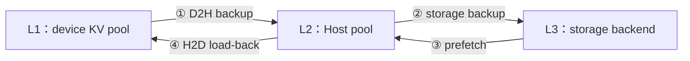
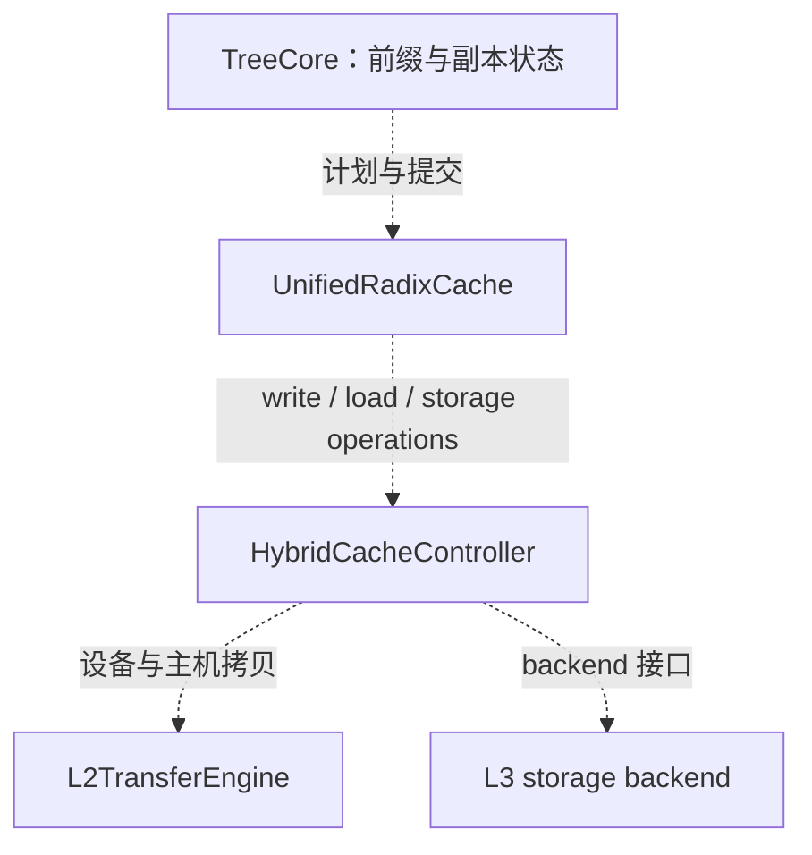
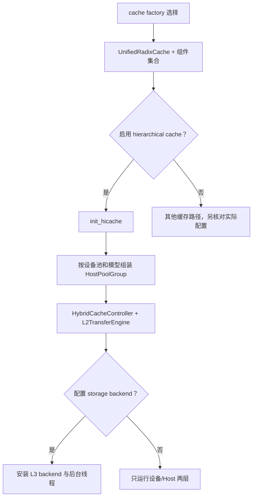
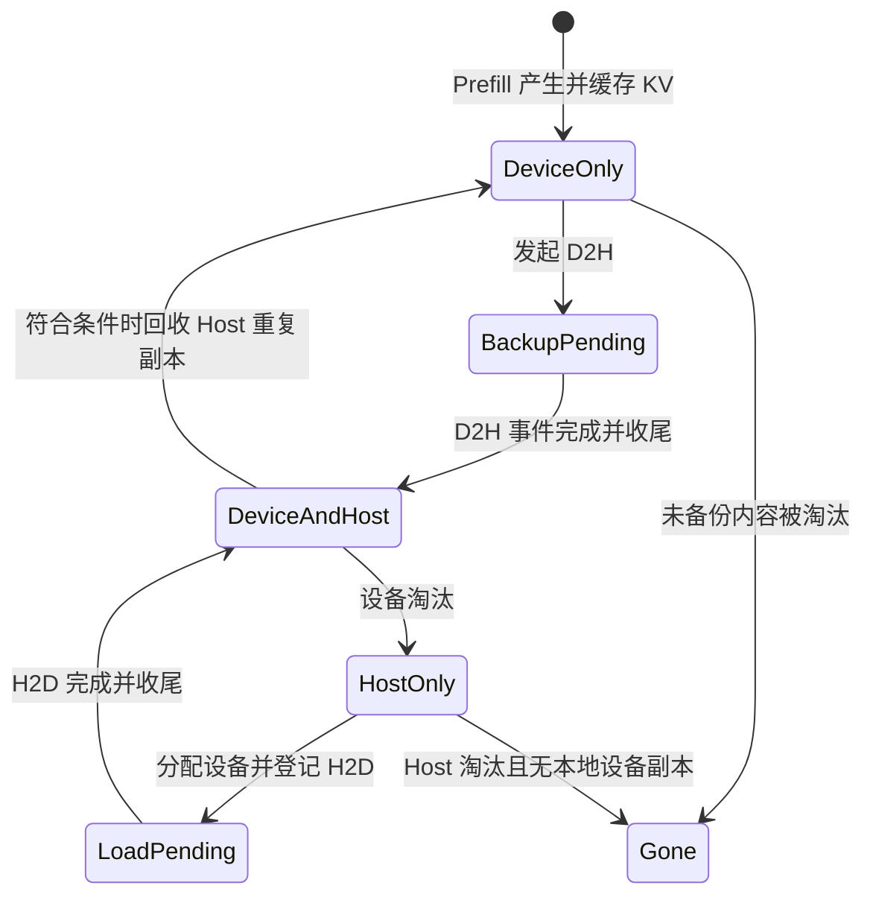
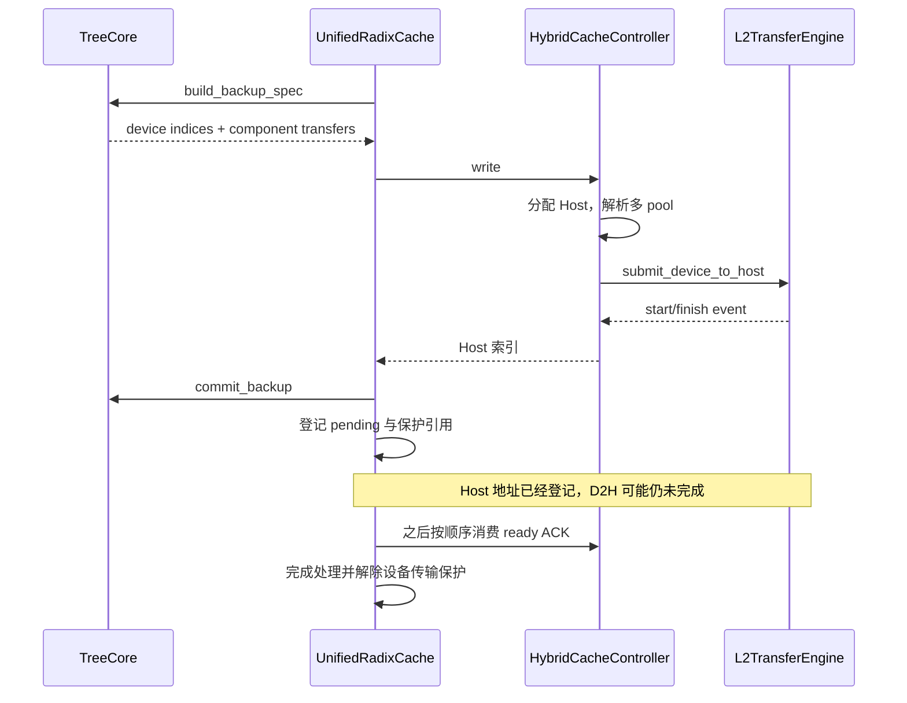
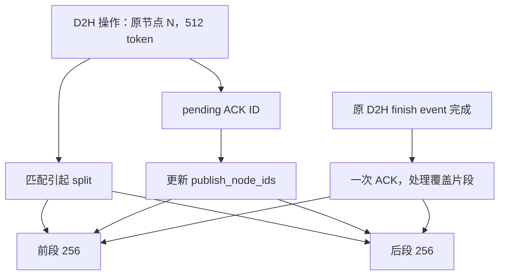
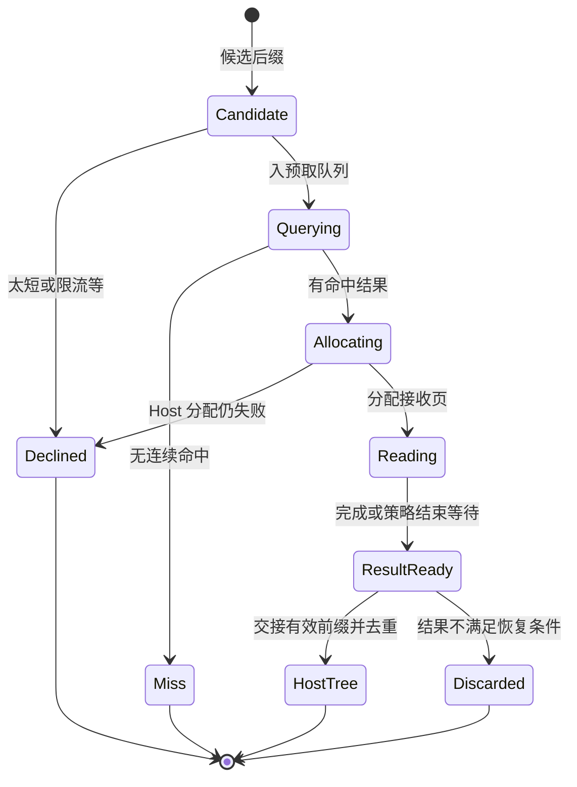
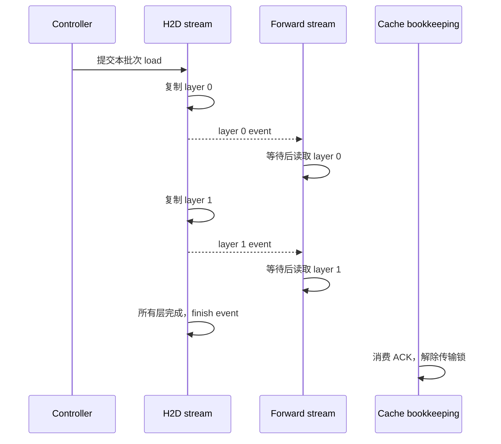
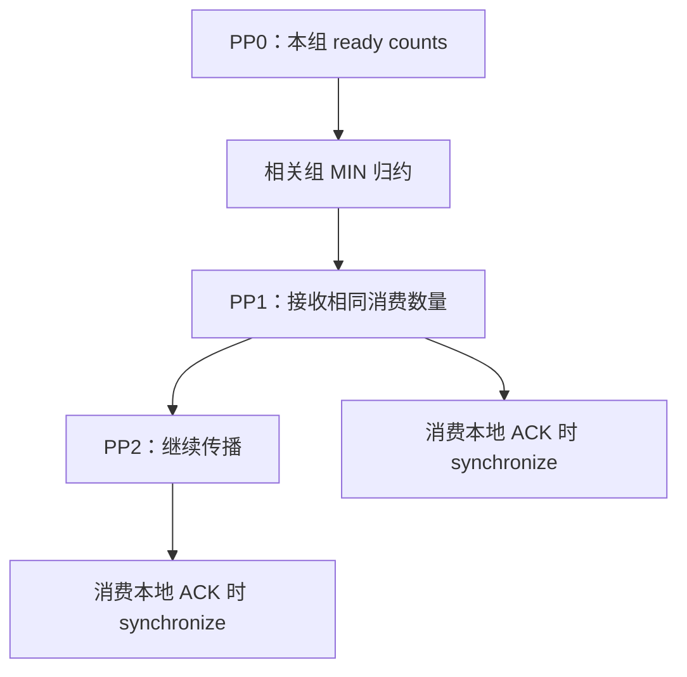
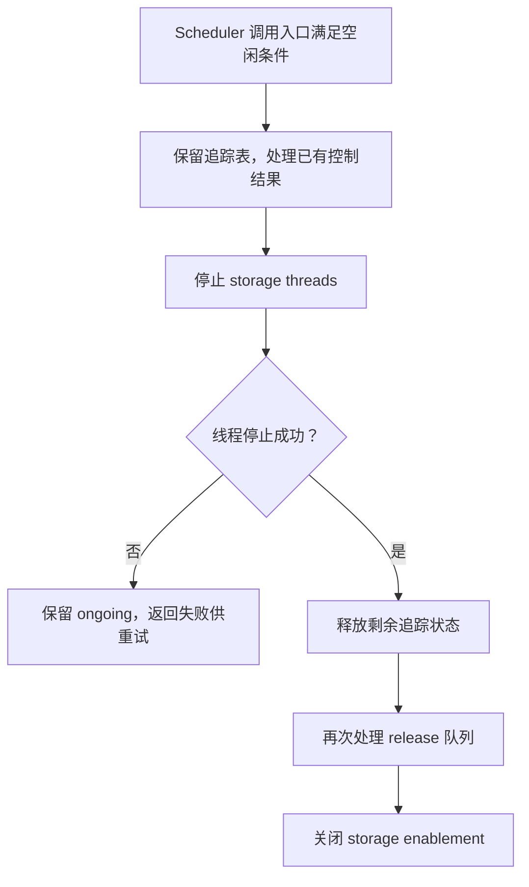

# HiCache 下 SGLang L1、L2、L3 与上传回载源码学习文档

本文是**源码分析型学习资料**，面向第一次读分层 KV cache 实现的同学。主线是：**一段 KV 如何从 GPU 留存到 Host、进一步写入外部存储，又怎样被下一条请求恢复到 GPU；这些过程中谁分配、谁搬运、谁等待、谁释放。**

HiCache 的标准 `cache` 模式包含一层真正由树管理的 Host KV 缓存。D2H 备份、L3 写入、L3 预取、H2D 回载是四种不同动作。节点存在、索引已经登记、传输提交成功、数据可读取和资源可以回收，也不是同一个时间点。

本文与 [HiCache 前缀命中源码学习文档](<HiCache 前缀命中源码学习文档.md>)组成两篇递进专题：前篇解释“能复用到哪里”，本篇解释“如何把数据送到那里并安全交接”。

## 0. 阅读基线与范围

| 项目 | 内容 |
| --- | --- |
| 项目上游 | [sgl-project/sglang](https://github.com/sgl-project/sglang) |
| 固定源码入口 | [固定源码快照](https://github.com/sgl-project/sglang/tree/72d5c5bb73cadd7ffbf5114e5f81e29d36b6c61a) |
| 分支 | 实际读取时为 `codex/main`，使用仓内已有官方开源 main 快照 |
| commit | `72d5c5bb73cadd7ffbf5114e5f81e29d36b6c61a` |
| 读取时间 | 2026-09-16 |
| 工作区状态 | 读取 worktree 干净；原 `muxi-main` 仓库和其既存未跟踪文件保持原状 |
| 操作边界 | 只读源码和静态文档检查；未运行模型、缓存实验、CUDA、RDMA 或外部存储服务 |
| 代表主线 | UnifiedRadixCache + Python UnifiedTreeCore + FULL attention，HiCache Host 模式为 `cache` |
| 扩展范围 | 同一快照的 HiRadixCache 对照、混合组件、buffer_only、TP/PP 同步和 L3 生命周期边界 |
| 不展开 | 各存储产品的内部一致性与网络协议、全部 GPU kernel、所有模型布局、生产故障完整证明 |
| 时效边界 | 固定版本说明，不声称是读取日最新官方实现 |

源码引用 `[Sxx]` 指向文末固定 commit 的文件和符号。流程图、状态图、数字例子、容量公式和排障推演均为整理者归纳；没有性能、精度或硬件并发安全的实测结论。

已有 [SGLang KV Pool、请求视图与 HiCache 工程学习文档](<SGLang KV Pool、请求视图与 HiCache 工程学习文档.md>)适合先建立概念；本篇进一步固定类、队列、事件和所有权交接。正文保留版本边界，避免把第三方旧命名当成当前快照唯一入口。

### 0.1 术语速查

| 术语 | 人话解释 | 本篇采用的语义 |
| --- | --- | --- |
| L1 | 模型手边的工作台 | 设备上的 KV pool |
| L2 | 主机上的缓存架 | `cache` 模式的 Host pool，能够保留副本 |
| L3 | 可选外部仓库 | 存储 backend；不预设一定是本地 SSD 或 RDMA |
| backup / D2H | 把设备 KV 备份到主机 | 不代表已经写入 L3 |
| storage backup | 把 Host 数据交给 L3 写任务 | 需要独立结果和 Host 引用保护 |
| prefetch | 提前把 L3 数据读到 Host | 尚未成为本请求可计算的设备前缀 |
| load-back / H2D | 把 Host 数据装回设备 | 分配、提交和逐层完成分开 |
| pool | 保存固定布局数据与槽位的容器 | KV 与辅助状态可以分属不同 pool |
| spec / transfer | 描述搬哪些槽位、什么数据 | 不拥有调度策略 |
| pending | 动作已登记，但生命周期未收尾 | 需要关联到完成事件或 ACK |
| demote | 保留 Host 副本并回收设备部分 | 与删除全部层级不同 |
| reclaim duplicate | 在符合条件时回收重复的 Host 副本 | 不能回收还在被传输访问的页 |

## 1. 先看三层数据，再看四个方向

### 1.1 人话版

设备显存最接近计算，但容量有限。Host 可以容纳更多可复用内容，却需要一次 H2D 才能给设备算子使用。L3 扩展了缓存来源和容量，通常又增加查找与搬运阶段。

同一逻辑前缀可能同时拥有设备和 Host 副本，也可能只留下 Host 或外部对象。层级是一种数据位置与管理关系，不是“每次请求都依次跑过三层”。





**图意解读：** 第一张图用四条实线表达数据方向；第二张图用虚线说明控制关系：树决定哪些缓存片段需要变化，cache 层执行动作并维护引用，controller 组织队列和分配，transfer engine 执行已解析的拷贝。L3 backend 不能仅凭能读写内存，就代替 Scheduler 决定请求是否入 batch。[S23]、[S35]、[S36]、[S46]

### 1.2 四个动作对照

| 动作 | 发起入口 | 主要源/目标 | 完成后仍可能要做什么 |
| --- | --- | --- | --- |
| D2H | cache backup action → controller.write | 设备 → Host | 清 pending、解除设备传输锁、可选继续 L3 写 |
| L3 写 | write_backup_storage → write_storage | Host → backend | 消费 backup 结果、解除 Host 操作引用 |
| L3 预取 | prefetch_from_storage → controller.prefetch | backend → Host | 同步可用前缀、纳入树或释放重复内容 |
| H2D | init_load_back → controller.load | Host →设备 | 启动批量传输、逐层等待、完成后解除传输锁 |

[S35]、[S39]、[S17]、[S21]

## 2. 从配置追到实际对象

### 2.1 默认选择链与 HiCache 组装

本快照的普通缓存选择链最终进入 `_create_unified_radix_cache`。它先按模型选择组件，再构造 UnifiedRadixCache；启用分层缓存时调用 `init_hicache`，并向 TP worker 注册 layer transfer counter。[S01]、[S02]

`init_hicache` 调用 `attach_hybrid_pool_to_unified_cache`，由实际设备 pool 与模型形状选择 Host pool、allocator 和传输组装策略。[S23]、[S58]



**图意解读：** 这是本篇主路径的组装关系。禁用 radix、纯 SWA、实验实现和外部 factory 等会改变入口；图不表达所有配置的完整优先级。

### 2.2 参数各控制哪个问题

| 参数 | 固定快照声明值或行为 | 主要影响 |
| --- | --- | --- |
| `enable_hierarchical_cache` | 默认 False | 是否安装 HiCache 主路径 |
| `hicache_host_memory_mode` | 默认 `cache`，也可 `buffer_only` | Host 常驻缓存还是中转 |
| `hicache_size` | 默认 0；显式 GB 大小覆盖 ratio | 主机容量配置 |
| `hicache_ratio` | 字段默认 None，由配置处理解析 | 相对设备池的 Host 规模 |
| `hicache_write_policy` | 默认 `write_through` | 什么时候提出设备备份 |
| `hicache_io_backend` | 声明默认 `kernel` | 设备与主机之间怎么搬 |
| `hicache_mem_layout` | 声明默认 `page_first` | 主机池数据排列 |
| `hicache_storage_backend` | 默认 None | 是否添加 L3 及其实现 |
| `hicache_storage_prefetch_policy` | 默认 `timeout` | 正在预取的请求何时可以结束等待 |
| `hicache_storage_backend_extra_config` | JSON 或配置文件入口 | backend 参数、预取阈值和超时等 |

这些是字段与解析入口的静态说明，最终值还受模式、模型、平台和容量校验影响，不是已验证可启动的部署配方。[S54]、[S55]、[S58]

### 2.3 三个名字相近但不同的选择

- **IO backend**：负责 L1↔Host 的传输实现。
- **storage backend**：负责 L3 对象访问。
- **radix cache backend / TreeCore**：负责树实现和缓存控制路径。

例如 storage backend 选择 Mooncake，并不表示树的前缀管理也移交给 Mooncake；Host cache 模式下，HiCache 仍然拥有缓存节点、回载和淘汰策略。

### 2.4 主路径的硬边界

| 条件 | 已读源码行为 | 阅读限制 |
| --- | --- | --- |
| `buffer_only` 搭配不支持的组件集合 | init_hicache 抛出 ValueError；此处仅支持 FULL/SWA 集合 | 不外推到 Mamba 状态交接 |
| Host 目标分配失败 | backup 可能返回 None | 不保证每段 KV 都有 L2 副本 |
| Full H2D 很短且无额外组件 | 受 load_back_threshold 限制 | 不等于 L3 查询失败 |
| 设备 quota 或容量不足 | 回载可以失败 | 不应提前把 Host 命中计成已加载 |
| 未配置 L3 | enable_storage 不成立 | L1/L2 仍可独立工作 |

[S23]、[S36]、[S21]

## 3. 核心对象与所有权

### 3.1 谁拥有数据，谁拥有动作

| 对象 | 主要职责 | 生命周期边界 |
| --- | --- | --- |
| TreeCore / node | 前缀、索引、组件状态、引用与淘汰计划 | 不直接跑后台存储 I/O |
| UnifiedRadixCache | 执行 tree action，登记 ongoing 和锁 | 连接树状态与异步结果 |
| Req / ScheduleBatch | 请求视图、本轮计算范围、consumer index | 请求结束不代表缓存副本清除 |
| HostPoolGroup | 多个主机 pool 的布局与槽位 | Full 与辅助 pool 分配可能一起失败 |
| HybridCacheController | 队列、传输组织、backend 访问、完成结果 | load 返回索引时可能尚未启动 H2D |
| L2TransferEngine | stream、事件和具体 D2H/H2D 拷贝 | 不决定请求准入或缓存淘汰 |
| StorageOperation | 一次外部写入的 Host 索引、keys 等 | 需保持源 Host 槽位有效 |
| PrefetchOperation | 一次查询/读取及其完成进度 | 取消后可能仍有后台任务收尾 |

[S11]、[S24]、[S40]、[S46]、[S49]

### 3.2 三张 ongoing 表连接开始与结束

| 表 | 典型关联 | 何时消费 |
| --- | --- | --- |
| `ongoing_write_through` | ACK ID → 锁节点、锁参数、待发布片段 | D2H 完成 ACK 被处理 |
| `ongoing_load_back` | 节点 → 设备传输锁与 Host anchor 锁 | H2D 完成 ACK 被处理 |
| `ongoing_backup` | storage operation ID → 节点与 Host 锁 | L3 写结果队列被处理 |
| `ongoing_prefetch` | RID → anchor、候选键、Host 索引和 operation | 读取结果交接、撤销或取消 |

这些表不等同于 running_batch，也不能在请求 finish 时不加区分地清空。后台动作可能仍持有其中的内存。[S13]、[S14]、[S39]、[S17]

### 3.3 概念状态图



**图意解读：** 这是教学状态，不是源码里的单个 enum。L3 是否有对象是另一个维度，不应画成一个排他的“L3 状态”：数据可同时在多层存在。`Gone` 只表示这张图跟踪的本地副本不再保留，不声明外部对象已删除。

## 4. D2H：上传到 Host 什么时候触发

### 4.1 人话版

每产生一段 KV，不一定立刻把它完整同步写入所有层级。源码先决定是否值得备份，再为主机分配位置，异步搬运，等完成后更新副本状态。

写策略控制的是提出备份的时机，不是三种不同物理存储。

| 策略 | 触发主线 | 读源码时要保留的条件 |
| --- | --- | --- |
| `write_through` | 初始化 threshold=1，插入相关计数检查提出备份 | 节点不能已淘汰、已 backup；chunked 检查可跳过 |
| `write_through_selective` | threshold=2，达到计数条件才提出备份 | hit_count 不等于严格的第几个用户请求 |
| `write_back` | hit-count 路径不触发，淘汰时可能提出备份 | Host 不足时存在放弃可重算缓存的分支 |

[S23]、[S30]、[S43]

### 4.2 从树的计划到设备拷贝

`_execute_and_commit_kv_backup` 按 action 中的节点顺序工作：[S35]

1. TreeCore 建立 backup spec，列出需要搬的 Full 设备索引和辅助组件。
2. 没有剩余传输的节点可以跳过；不是每次重访都重复拷贝。
3. cache 层检查 Host 可用量，必要时请求 Host 淘汰。
4. controller.write 分配 Full Host 索引并解析额外 pool 目标。
5. 任意必需分配失败时返回失败，并回收该阶段新分配的目标。
6. controller 将 CacheOperation 入 write_queue，启动 D2H。
7. 树登记 Host 索引，cache 层登记传输保护和 pending ID。

[S36]、[S37]



**图意解读：** Host 目标出现得比完成 ACK 早。这里的 `commit_backup` 是元数据登记，不是“外部存储已经持久化”的提交。

### 4.3 D2H 的 stream 等待是什么

`L2TransferEngine.submit_device_to_host` 先建立起始事件，让专用 device_to_host stream 等待，再逐个 transfer 调用 `backup_from_device_all_layer`，最后记录完成事件。[S46]

这使复制可以与其他工作异步组织，同时通过事件保留生产者/消费者顺序。完成时间由对应 stream 上的事件表达；CPU 函数返回只说明提交过程走到了返回点。

## 5. D2H ACK 与节点分裂：为什么需要片段追踪

### 5.1 ACK 不是一个裸布尔值

HiCacheAck 带有起止事件、node IDs 和计量信息。`writing_check` 按约定的 ready count 消费队首 ACK，并调用 `finish_event.synchronize()`，然后处理关联节点。[S37]、[S42]

`_finish_write_through_ack` 取出 pending 信息，完成树状态更新，解除对应设备传输锁；开启 L3 时，再对应该发布的片段提交 storage backup。[S38]

### 5.2 同一条异步操作可能覆盖后来分裂的多个节点

教学例子：

1. 节点 N 表示 `[0,512)`，正在 D2H。
2. 新请求只匹配到 256，N 分裂成前半段与后半段。
3. 原来那次 D2H 仍覆盖 512 token。
4. 完成 ACK 必须解除正确引用，并分别处理两个片段的副本状态和后续 L3 写入。

源码通过 `publish_node_ids` 和 `_replace_pending_write_through_node` 保持这种对应关系；不能只记“原节点现在还剩后半段”，否则前半段的后续处理会遗漏。[S12]、[S13]、[S38]



**图意解读：** 树拓扑会变化，正在进行的数据操作仍有原本的覆盖区间。学习异步缓存生命周期时，要同时记录“逻辑节点是谁”和“这次操作搬了哪些槽位”。

## 6. Host→L3：真正的外部上传

### 6.1 什么时候开始 L3 写入

标准 write-through 完成处理可以继续调用 `write_backup_storage`。该函数从树取得 storage backup spec，构造 Full 与 sidecar transfer，再通过 controller.write_storage 创建 StorageOperation、加入 backup_queue，并记录 `ongoing_backup` 与 Host 引用。[S38]、[S39]、[S40]

因此有两种不同的“备份完成”：

- D2H 完成：Host 副本已经完成相关设备复制。
- L3 写操作完成：外部 backend 已返回它定义的写结果，进入相应 ACK/结果处理。

后者的持久化、复制或故障保证还取决于 backend 协议，本篇没有复核每种存储系统内部语义。

### 6.2 L3 key 不应只理解成文件名

RadixKey 和页 hash 提供逻辑前缀身份；后续存储 backend 还可能编码模型、并行分片、pool 与布局信息。HiCache 通用层使用 hash 列表、token、prefix keys 和 PoolTransfer 组织读写。[S08]、[S57]、[S59]、[S56]

| 信息层 | 解决的问题 | 本篇验证范围 |
| --- | --- | --- |
| 本地 tree key | token 序列与请求 namespace 的查找隔离 | 已读 RadixKey 路径 |
| 页 hash 链 | 为连续 token 前缀构造可查询页身份 | 已读通用 hash/调用入口 |
| pool/sidecar 描述 | Full KV 与辅助状态怎样一起读写 | 已读 PoolTransfer 和 controller |
| backend 对象编码 | 模型、rank、布局怎样落到存储对象 | 必须按所选 backend 继续复核 |

不要从“两个对象 hash 一样”跳到“不同模型可以共用 KV”，也不要把部署命名空间混用造成的错误归为普通缓存 miss。

### 6.3 为什么有些 TP rank 跳过主 KV 上传

HybridCacheController 的 `_page_backup` 与 `should_backup` 区分复制型 MLA KV 和按 rank 分片的辅助状态。某些主 KV 可只由 TP0 写入，sidecar 却仍可能要求每个 rank 写。[S41]、[S63]

这不是一条“HiCache 的所有 L3 写操作都只在 rank0 执行”的通则。必须先识别 pool 类型和是否分片，再解释写入者数量。

### 6.4 Host 源数据何时可释放

L3 写操作仍引用 Host 槽位时，Host anchor 需要保护。结果进入 backup ACK 队列后，由 cache 层消费并解除操作持有的引用。[S19]、[S39]

请求结束只会改变请求的生命周期；并不能直接释放仍被 L3 写任务访问的 Host 页。反过来，L3 写完也不要求立刻删除常驻 L2 副本，两者由不同策略控制。

## 7. 淘汰：少一份副本还是整个前缀消失

### 7.1 设备淘汰的两条结果

TreeCore 的 `evict_device_leaf` 根据备份状态与 write_back 策略，可能只降级设备副本，也可能删除没有可保留备份的内容。[S43]

| 情况 | 可能结果 | 下次请求的路径 |
| --- | --- | --- |
| 有完成且受规则保护的 Host 副本 | 设备降级，Host 留存 | Host match → H2D |
| 没有 Host，write_back 可成功备份 | 先备份后降级 | 之后可从 Host 恢复 |
| 没有可保留 Host 且容量压力持续 | 丢弃可重算缓存 | 可能查询 L3，或重新 Prefill |
| 节点仍被请求或 I/O 引用 | 不应按普通可淘汰节点处理 | 等待相应引用结束 |

“write_back”也不等于永不丢缓存。`_drop_subtree_no_host` 是源码中明确存在的 Host 压力回退方向；这不损失模型权重或用户输入，代价是失去这份复用机会。[S70]

### 7.2 Host 淘汰也要检查引用与副本

`drive_host_eviction` 管理 Host 层的回收过程，Full 的重复副本和 Host-only 内容有不同状态约束。[S44]、[S45]

所谓可回收的重复 Host 副本，至少要区分：

- 设备和 Host 是否都存在。
- D2H 是否仍 pending。
- H2D 是否仍 pending。
- Host 是否被操作引用。
- 当前策略和树关系是否允许回收。

源码 `_is_settled_full_host_duplicate` 明确把未完成的 write/load pending 排除在已稳定重复副本条件之外；后续实际回收还要继续检查锁等约束。[S45]

### 7.3 三层容量不能简单相加成“可运行上下文”

GPU 执行时仍需要合法设备状态。Host 与 L3 扩展的是保留和恢复能力，不直接把一条设备 forward 需要的活跃 KV 容量变成三层容量之和。

排障应分别记录 device available、device evictable、device protected、Host available 和 I/O 占用。把“Host 还有空间”当成“本轮 GPU admission 必定能通过”，会跳过最关键的一层预算。

## 8. L3→Host：预取是一个有退出条件的状态机

### 8.1 从查询到可用结果

本篇 cache 模式中的主要顺序是：[S17]、[S18]、[S19]、[S20]

1. Scheduler 以本地匹配后的 anchor 发起候选后缀预取。
2. 缓存层检查页对齐、长度阈值、限流和 RID 去重。
3. controller 查询存储，得到连续可命中的页数。
4. 主调度线程按同步的查询结果分配 Host 接收位置；必要时缩短前缀或放弃。
5. 后台线程读取实际数据，并同步完成进度。
6. 预取结束后，结果纳入 Host 树；已被其他请求覆盖的重复部分被释放。
7. Scheduler 重新匹配请求，准备后续 admission。



**图意解读：** 这是 cache 模式的教学归纳。后台 I/O 的物理收尾与请求结束等待之间还有独立交接，不能把 `ResultReady` 理解成所有剩余异步任务已从系统消失。

### 8.2 三种等待策略

| 策略 | `_can_terminate_prefetch` 的已读含义 | 实际代价方向 |
| --- | --- | --- |
| `best_effort` | 允许结束这次等待，使用当前可交接结果 | 可能牺牲更多预取复用 |
| `wait_complete` | 不由该策略主动终止，等待 operation 自身结束 | 请求可能等待更久 |
| `timeout` | 按时间预算判断，跨 rank 协调停止判定 | 在等待与重算之间折中 |

[S47]、[S48]

默认解析给出的预取阈值为 256 token，超时基数为 1.0 秒，每 Ki token 增量为 0.25 秒；运行时还要经过页面换算和配置覆盖。这些是固定源码默认，不是服务 SLO 或推荐调参值。[S55]、[S23]

### 8.3 终止等待不等于后台任务已停止访问内存

`terminate_prefetch` 的实现先标记 operation 终止，文档注释明确说明后台任务结束后会发送 `completed_req=True` 的 PrefetchAck。[S49]

因此释放责任分两部分：

- 已完成且已交接的前缀：由树接管或按结果处理规则释放。
- 尚未交接或后台仍需处理的部分：沿完成 ACK 和 release 队列收尾。

把整个 Host 分配区间在 mark_terminate 之后立即 free，会绕过源码设计的异步生命周期边界。本文只解释源码职责，没有执行取消竞态实验。

## 9. Host→GPU：回载不是一条同步 memcpy

### 9.1 四个步骤

1. **准备保护**：`load_back` 保护 Host anchor 和设备路径，组件准备相应恢复状态。
2. **分配与登记**：`_load_back_transfers` 检查阈值/quota，分配设备索引，提交树状态并登记 ongoing。
3. **批量启动**：Scheduler 在形成 batch 后调用 `ready_to_load_host_cache`；controller 合并 load_queue 并产生 consumer index。
4. **可读与退役**：模型按层等待对应事件；cache 的 loading_check 在完成 ACK 后释放本次传输引用。

[S64]、[S21]、[S22]、[S24]、[S25]、[S14]

### 9.2 哪些失败会返回到调度器

| 条件 | 已读行为 | 后续解释 |
| --- | --- | --- |
| 没有 controller | load_back 返回 False | 不能按已启用 HiCache 路径解释 |
| Full 片段过短且无组件传输 | 拒绝本次回载 | 可以保留设备前缀并重算尾部 |
| 超出 quota | 拒绝，并解除准备阶段引用 | 不能把预估 Host hit 当作已加载 |
| GPU 分配失败 | 尝试符合策略的淘汰，仍不足则返回 False | 请求可能推迟或改变本轮计算范围 |
| 额外 pool 分配失败 | controller 撤销本阶段分配 | 不能只因 Full 有槽位就提交混合恢复 |
| 成功返回索引 | 树/请求获得目标索引 | 后面仍要等待层事件 |

[S21]、[S24]

### 9.3 load_queue 里的操作不等于 ScheduleBatch

CacheOperation 描述 Host 与 device 索引、node IDs 和多 pool transfer。controller 可以合并多次 load，形成一个实际传输批次。[S25]

ScheduleBatch 则描述模型这次执行哪些请求。两者通过 `hicache_consumer_index` 联系，但不能用 RID 直接代替 consumer index，也不能把一个 ACK 当成单个请求的完整生命周期结束。

## 10. 逐层事件、重叠执行与资源退役

### 10.1 为什么按层通知

H2D transfer engine 按 layer 遍历，完成该层相关 pool 的加载后回调 `on_layer_done`。模型读取 KV 的路径使用 LayerDoneCounter 等待对应层。[S46]、[S27]、[S69]



**图意解读：** 图中并行排列表示存在按层组织依赖的能力，不是量化的重叠性能承诺。真实重叠收益取决于模型、pool、stream、平台与调度条件。

### 10.2 槽位复用为什么还要 fence

`HiCacheController.start_loading` 检查可选 `load_fence_stream`，让 H2D stream 等待该 stream。源码注释说明：重叠调度下，回收的页可能仍被 forward 线程写入，需要在加载前加执行屏障。[S25]

因此同一个槽位编号再次出现在 allocator 返回值里，只说明它被重新分配，不能自动证明旧设备写入已经退役。锁和 allocator 管地址生命周期，stream/event 管实际设备访问顺序，两者要同时闭环。

### 10.3 completion 的三个层级

| 完成点 | 可以说什么 | 还不能说什么 |
| --- | --- | --- |
| load 函数返回 | 目标已分配，传输进入准备队列 | 所有层已复制完 |
| 对应 layer event 满足 | 本批次该层可按依赖读取 | 全部传输锁已经解除 |
| finish ACK 被消费并处理 | 本次传输引用按源码收尾 | 请求自身也结束了 |

LayerDoneCounter 的 producer 槽循环复用前，源码断言上一轮对应 finish event 已就绪。这是事件槽生命周期的一部分；不能把这个局部条件扩展成整个 P/D 通信的退役保证。[S27]

## 11. TP/PP 同步：传播什么，等待什么

### 11.1 先看前台 ready counts

`_sync_hicache_ready_counts` 在 PP0 统计队首连续完成 ACK，以及若干存储结果队列的可消费数量；通过 `_all_reduce` 归约并传播。[S34]

`_all_reduce` 的具体结构是：PP0 先在 attention CP/TP 等相关组上归约，然后 `_pp_sync` 逐 stage 发送结果。非 PP0 不独立用本地速度决定本轮消费多少。[S33]、[S67]



**图意解读：** 归约消费数量和等待本地设备完成，是两步不同动作。后续 stage 的复制慢时，仍可能在本地 ACK 同步处等待；图不表达所有 PP stage 的 finish event 先做一个全局 MIN。

### 11.2 再看后台 prefetch 完成同步

`prefetch_sync_thread_func` 与 `_reduce_prefetch_ack` 是另一条同步路径，按配置的 completion sync groups 对 completed_tokens 做 MIN，协调连续可用的预取结果。[S50]

不要把前台 ready count、后台 completed token 数和 PP 的 RID 共识写成一个统一投票协议。

| 同步内容 | 单位 | 后续消费 |
| --- | --- | --- |
| write/load ready count | ACK 个数 | 顺序消费本地完成记录 |
| storage queue size | 结果/释放项个数 | 前台处理对象与内存交接 |
| prefetch completed tokens | 连续可用 token 数 | 结果插入或请求恢复 |
| 预取 timeout 判定 | 是否结束等待 | 请求推进与预取收尾 |
| PP RID 集合 | 请求标识 | P/D 队列迁移，与上述 I/O 条件不同 |

### 11.3 不同 rank 的重复副本回收顺序

源码还把 `digest` 和 `-digest` 放入归约数据，检查 write-back duplicate reclaim 的选择是否一致。[S34]、[S14]

这可以帮助发现某类状态分歧，不是任意分布式错误的通用检测器；断言通过也不能替代 GPU 正确性或端到端推理验证。

### 11.4 P/D 与 PP 的定位

- HiCache 回载影响本 stage 的设备前缀恢复和本轮可运行性。
- PP proxy 负责跨模型层传递中间激活。
- P/D transfer 把 Prefill 的 KV 交给 Decode。

三者会在 Scheduler 生命周期中相遇，但各自拥有不同对象与完成条件。深入 PP 见 [SGLang PP 共识机制源码学习文档](<SGLang PP 共识机制源码学习文档.md>)；历史内部分支文档中的补充节会单独标注这份官方快照，避免混合版本。

## 12. buffer_only、混合组件与 HiRadixCache 对照

### 12.1 Host 是缓存还是临时中转

| 模式 | 数据路径 | Host 生命周期 |
| --- | --- | --- |
| 本篇 `cache` | L1↔常驻 Host，可选 Host↔L3 | 挂在树上，受缓存引用与淘汰规则管理 |
| `buffer_only` | L1↔临时 Host↔L3 | 操作或请求暂存，交接后释放 |
| external linker | 独立外部加载/卸载路径 | 不采用本篇常驻 L2 管理链 |

在 buffer_only 中，D2H 写意图和预取结果分派到 BufferModePipeline，不能复用本篇“Host insert 后重匹配”的完整叙述。[S23]、[S35]、[S20]、[S22]

### 12.2 混合组件不是一块 Full KV 的不同名字

PoolTransfer 显式表达 pool name、索引、keys、命中策略和关联节点。SWA/Mamba/sidecar 的存储长度、可恢复边界和所有者可能不同。[S56]、[S31]

一个 Full 页存在，并不证明当前请求需要的所有辅助状态也存在。备份、预取、H2D 三个方向都要检查必需组件结果；不能只画一根“KV buffer”箭头后省掉这些契约。

### 12.3 为什么同时保留 HiRadixCache 阅读入口

源码中 HiRadixCache 仍展示基于 TreeNode 的匹配、备份与回载实现，适合对照旧资料；本篇主路径采用 Unified 的 NodeId、TreeCore 和组件动作，避免把旧路径写成默认类。[S32]、[S01]

二者可迁移的理解是“树与物理池分离、命中与回载分离、引用与事件分离”；不能迁移的部分是未经核对的函数签名、模型支持范围和具体同步条件。

## 13. 取消、detach 与失败收尾

### 13.1 请求取消时先找谁还拥有内存

`release_aborted_request` 和 `revoke_pending_prefetch` 处理请求关联的预取与计量状态；后台仍在访问的页继续沿 controller 的终止、ACK 和 release 队列交接。[S60]、[S61]、[S49]

排查时按以下对象逐一问：

1. 请求是否还拥有设备视图与锁？
2. ongoing prefetch 是否还持有 anchor 或 Host 分配？
3. operation 是否已标记终止？
4. 后台任务是否发出最后完成记录？
5. 已交接部分是否进入树，未交接部分是否归还 pool？

这里列的是源码阅读清单，不是在线执行脚本，也不声称所有后端取消时序已经实验验证。

### 13.2 detach 的先后顺序为何重要

StorageAttachment.detach 的注释和实现给出明确顺序：[S51]

1. 调用者先确保没有运行或排队请求。
2. 保留 bookkeeping 时，先排空可处理的控制队列。
3. 停止后台 storage threads。
4. 线程停止后，再释放残留 prefetch/backup 追踪状态。
5. 再排空释放队列，把页真正交回 pool 与 sidecar。



**图意解读：** 先删表再停线程，会使晚到 ACK 无法找到对应节点与锁。源码在停止阶段抛错时保留追踪关系，正是为了允许后续收尾和重试。

attach/detach 的 Scheduler 包装入口还有空闲和能力检查。本篇只静态分析这些条件，没有发起管理 API 调用，也不把它描述成任意负载下的无条件零停机切换。[S53]、[S52]

## 14. 两个贯穿生命周期的例子

### 14.1 重复长前缀：先热写，再降级，再恢复

设一个 FULL 前缀有 1,024 token，page_size=16，资源足够，采用 write-through，L3 已配置。以下为教学推演：

| 时间 | 事件 | L1 | L2 | L3 与保护 |
| --- | --- | --- | --- | --- |
| T0 | Prefill 后插入树 | 已有 KV | 无 | 可能提出 backup |
| T1 | D2H 提交 | 源受传输保护 | 分配目标，尚需完成 | 暂不能等同于外部写完成 |
| T2 | D2H ACK 收尾 | 可保留 | 有完成副本 | 提交 L3 write，Host 受操作保护 |
| T3 | L3 write 结果处理 | 可保留 | 可保留 | 解除此写操作 Host 引用 |
| T4 | GPU 压力触发设备降级 | 此副本被回收 | 仍可匹配 | L3 对象可能也存在 |
| T5 | 新请求匹配并通过预算 | 分配新目标 | H2D 源受保护 | 无须假定旧 GPU 槽位仍有效 |
| T6 | 逐层回载后计算 | 按事件读取 | 可保留副本 | finish 后解除传输保护 |

“同一逻辑前缀再次命中”不要求同一物理 GPU 地址。请求视图把逻辑位置和本次有效槽位重新连起来。

### 14.2 外部存在但本次没获益

设查询报告 1,024 token 连续命中，但随后：

1. Host 只分配到 768 token 的完整页。
2. 实际读取只完成前 512 token。
3. 另一个请求已插入其中 256 token，本次新插入部分只有 256。
4. admission 时设备压力让 H2D 未成功。

这四个数字描述四个阶段。不能拿最初 1,024 作为最终“本请求免算 token 数”，也不能因为最终没使用就断言 L3 从未命中。具体实现还记录绝对区间来处理 L2/L3 来源归因；应检查最终请求实际恢复的交集。[S19]、[S20]、[S07]

## 15. 容量与性能：先分账，再比较

### 15.1 容量估算的人话版

对于普通未压缩 MHA 的单个 stage/rank，可用下面的教学量纲帮助思考：

```text
每 token KV 字节 ≈ 本 stage 层数 × 本 rank KV heads × head_dim × 2(K、V) × dtype_bytes
某次传输字节 ≈ 实际传输 token 数 × 每 token KV 字节
```

MLA、量化、SWA、Mamba、sidecar、padding 和 pool 布局会改变这个公式；真实容量优先读 pool 的大小与统计。公式用于理解维度，不是本篇测量结果。

### 15.2 分层命中可能节省什么、增加什么

| 因素 | 可能节省 | 可能增加 |
| --- | --- | --- |
| L1 命中 | 历史前缀重算 | 常驻设备占用 |
| L2 命中 | 被淘汰前缀的重算 | H2D 与设备恢复空间 |
| L3 命中 | 更大范围复用、减少重复 Prefill | 查询、外部读取、Host 分配、H2D |
| write-through | 提前形成可恢复副本 | D2H 带宽和后台上传压力 |
| write-back | 避免部分不必要备份 | 淘汰时等待与 Host 压力 |
| selective | 减少较冷内容上传 | 新内容可能尚无备份 |

是否改善 TTFT，取决于省下的计算是否超过查询、排队、搬运与协调代价。这里不提供通用加速倍数，也不从源码推出某一参数最优。

### 15.3 建议观测口径

把请求时间线至少拆成：等待调度、等待 L3 预取、H2D、剩余 Prefill、首 token 输出。再分开记录查询命中页数、读取完成量、Host 新插入量、实际回载量和最终使用区间。

D2H/H2D 的事件计时与队列等待不是同一指标；HiCacheAck 的起止事件可以描述传输执行区间，但不能直接解释请求从进入系统到首 token 的全部时间。[S37]、[S25]、[S42]、[S14]

## 16. 排障地图

| 现象 | 优先查看 | 可能卡住的交接 |
| --- | --- | --- |
| 没有 D2H | write policy、chunked、hit_count、是否已有 backup | [S30]、[S35] 触发条件 |
| Host 有索引但不能确认有效副本 | pending ID、ack_write_queue、finish_event | [S13]、[S42] 完成登记 |
| D2H 完了却没有 L3 对象 | enable_storage、backup spec、backend 结果 | [S38]、[S39]、[S41] 外部上传 |
| GPU 压力时缓存突然丢失 | Host 可用量、write-back fallback | [S43]、[S44] 淘汰与丢弃 |
| 查询有命中但读不到全部页 | allocation 长度、GET 完成、组件结果 | [S18]、[S19]、[S20] 预取缩短 |
| 有 Host hit 但前缀没增长 | threshold、quota、new_indices | [S21]、[S22] H2D 准备 |
| 回载后输出异常 | consumer index、layer event、load fence | [S25]、[S26]、[S27] 设备访问顺序 |
| Host 页长期不释放 | ongoing_backup/prefetch、host locks、release 队列 | [S19]、[S39]、[S61] 所有权收尾 |
| PP 后续 stage 等待 | 相同 ACK 顺序与 count、本地 finish event | [S33]、[S34] 同步与完成 |
| detach 失败后仍有操作 | 线程停止结果、ongoing 是否保留 | [S51] 可重试的生命周期 |

表中的方向是静态排查地图，需要结合目标版本日志和硬件证据核实。不要只凭一个命中率或健康检查就判断链路已正确完成。

## 17. 阅读路线与自测

### 17.1 推荐源码顺序

1. [S01]、[S02]、[S23]、[S58]：看缓存类、组件和 Host controller 如何装起来。
2. [S30]、[S35]、[S36]、[S37]：看一次 D2H 从触发到提交。
3. [S13]、[S38]、[S42]：看 pending、split 和完成 ACK。
4. [S39]、[S40]、[S41]、[S19]：看 L3 写入与 Host 引用释放。
5. [S43]、[S44]、[S45]：看两层副本和淘汰条件。
6. [S17]、[S18]、[S20]、[S47]、[S49]：看预取、部分结果和终止。
7. [S21]、[S24]、[S25]、[S46]、[S14]：看 H2D、逐层事件和传输退役。
8. [S33]、[S34]、[S50]、[S51]：最后加入并行同步与后台线程生命周期。

### 17.2 自测问题与答案

| 问题 | 参考答案 |
| --- | --- |
| write-through 完成一次 D2H，能说对象已经写入 L3 吗？ | 不能，L3 是后续独立 storage operation |
| L1 淘汰后树节点是否一定删除？ | 不一定，合法 Host 副本可以继续承载前缀 |
| mark_terminate 后可以 free 整个预取缓冲吗？ | 不能，仍须区分已交接与后台未退役部分 |
| controller.load 返回设备索引是否等于 H2D 完成？ | 不等于，它先分配并入队，start_loading 才启动批量传输 |
| 所有层 finish 后，还需要 loading_check 吗？ | 需要，用于消费完成记录并解除传输引用等状态 |
| 所有 TP rank 都必须上传相同 Full KV 吗？ | 取决于是否复制/分片及 pool 类型，辅助状态可能不同 |
| Host 还有空闲能否证明请求可以 admission？ | 不能，设备、计算和其他组件预算独立存在 |

## 18. 一句话总结

HiCache 用树状态决定“保留哪段 KV”，用 controller 和 backend 决定“怎样搬”，用引用与事件决定“何时能读、何时能回收”；四种传输方向必须分别追踪到生命周期结束。

## 19. 固定源码索引

下面每个锚点均定位到本篇固定 commit 的实际符号；图与数值例子为整理者教学推演。验证覆盖静态源码和文档关系，没有硬件运行结论。

| 锚点 | 文件与符号 | 固定版本 |
| --- | --- | --- |
| S01 | `python/sglang/srt/mem_cache/registry.py::default_radix_cache_factory` | [L80](https://github.com/sgl-project/sglang/blob/72d5c5bb73cadd7ffbf5114e5f81e29d36b6c61a/python/sglang/srt/mem_cache/registry.py#L80) |
| S02 | `python/sglang/srt/mem_cache/registry.py::_create_unified_radix_cache` | [L149](https://github.com/sgl-project/sglang/blob/72d5c5bb73cadd7ffbf5114e5f81e29d36b6c61a/python/sglang/srt/mem_cache/registry.py#L149) |
| S07 | `python/sglang/srt/managers/schedule_policy.py::PrefillAdder.add_one_req` | [L1271](https://github.com/sgl-project/sglang/blob/72d5c5bb73cadd7ffbf5114e5f81e29d36b6c61a/python/sglang/srt/managers/schedule_policy.py#L1271) |
| S08 | `python/sglang/srt/mem_cache/radix_cache.py::RadixKey.child_key_at` | [L229](https://github.com/sgl-project/sglang/blob/72d5c5bb73cadd7ffbf5114e5f81e29d36b6c61a/python/sglang/srt/mem_cache/radix_cache.py#L229) |
| S11 | `python/sglang/srt/mem_cache/unified_cache/unified_tree_core.py::UnifiedTreeNode` | [L109](https://github.com/sgl-project/sglang/blob/72d5c5bb73cadd7ffbf5114e5f81e29d36b6c61a/python/sglang/srt/mem_cache/unified_cache/unified_tree_core.py#L109) |
| S12 | `python/sglang/srt/mem_cache/unified_cache/unified_tree_core.py::UnifiedTreeCore._split_node` | [L1178](https://github.com/sgl-project/sglang/blob/72d5c5bb73cadd7ffbf5114e5f81e29d36b6c61a/python/sglang/srt/mem_cache/unified_cache/unified_tree_core.py#L1178) |
| S13 | `python/sglang/srt/mem_cache/unified_radix_cache.py::UnifiedRadixCache._track_write_through_node` | [L1416](https://github.com/sgl-project/sglang/blob/72d5c5bb73cadd7ffbf5114e5f81e29d36b6c61a/python/sglang/srt/mem_cache/unified_radix_cache.py#L1416) |
| S14 | `python/sglang/srt/mem_cache/unified_radix_cache.py::UnifiedRadixCache.loading_check` | [L2855](https://github.com/sgl-project/sglang/blob/72d5c5bb73cadd7ffbf5114e5f81e29d36b6c61a/python/sglang/srt/mem_cache/unified_radix_cache.py#L2855) |
| S17 | `python/sglang/srt/mem_cache/unified_radix_cache.py::UnifiedRadixCache.prefetch_from_storage` | [L1715](https://github.com/sgl-project/sglang/blob/72d5c5bb73cadd7ffbf5114e5f81e29d36b6c61a/python/sglang/srt/mem_cache/unified_radix_cache.py#L1715) |
| S18 | `python/sglang/srt/mem_cache/hybrid_cache/hybrid_cache_controller.py::HybridCacheController._storage_hit_query` | [L578](https://github.com/sgl-project/sglang/blob/72d5c5bb73cadd7ffbf5114e5f81e29d36b6c61a/python/sglang/srt/mem_cache/hybrid_cache/hybrid_cache_controller.py#L578) |
| S19 | `python/sglang/srt/mem_cache/unified_radix_cache.py::UnifiedRadixCache._drain_storage_control_queues_impl` | [L2383](https://github.com/sgl-project/sglang/blob/72d5c5bb73cadd7ffbf5114e5f81e29d36b6c61a/python/sglang/srt/mem_cache/unified_radix_cache.py#L2383) |
| S20 | `python/sglang/srt/mem_cache/unified_radix_cache.py::UnifiedRadixCache._handle_prefetch_result` | [L1918](https://github.com/sgl-project/sglang/blob/72d5c5bb73cadd7ffbf5114e5f81e29d36b6c61a/python/sglang/srt/mem_cache/unified_radix_cache.py#L1918) |
| S21 | `python/sglang/srt/mem_cache/unified_radix_cache.py::UnifiedRadixCache._load_back_transfers` | [L1509](https://github.com/sgl-project/sglang/blob/72d5c5bb73cadd7ffbf5114e5f81e29d36b6c61a/python/sglang/srt/mem_cache/unified_radix_cache.py#L1509) |
| S22 | `python/sglang/srt/mem_cache/unified_radix_cache.py::UnifiedRadixCache.init_load_back` | [L2910](https://github.com/sgl-project/sglang/blob/72d5c5bb73cadd7ffbf5114e5f81e29d36b6c61a/python/sglang/srt/mem_cache/unified_radix_cache.py#L2910) |
| S23 | `python/sglang/srt/mem_cache/unified_radix_cache.py::UnifiedRadixCache.init_hicache` | [L379](https://github.com/sgl-project/sglang/blob/72d5c5bb73cadd7ffbf5114e5f81e29d36b6c61a/python/sglang/srt/mem_cache/unified_radix_cache.py#L379) |
| S24 | `python/sglang/srt/mem_cache/hybrid_cache/hybrid_cache_controller.py::HybridCacheController.load` | [L500](https://github.com/sgl-project/sglang/blob/72d5c5bb73cadd7ffbf5114e5f81e29d36b6c61a/python/sglang/srt/mem_cache/hybrid_cache/hybrid_cache_controller.py#L500) |
| S25 | `python/sglang/srt/managers/cache_controller.py::HiCacheController.start_loading` | [L914](https://github.com/sgl-project/sglang/blob/72d5c5bb73cadd7ffbf5114e5f81e29d36b6c61a/python/sglang/srt/managers/cache_controller.py#L914) |
| S26 | `python/sglang/srt/managers/tp_worker.py::TpModelWorker.set_hicache_consumer` | [L535](https://github.com/sgl-project/sglang/blob/72d5c5bb73cadd7ffbf5114e5f81e29d36b6c61a/python/sglang/srt/managers/tp_worker.py#L535) |
| S27 | `python/sglang/srt/managers/cache_controller.py::LayerDoneCounter` | [L71](https://github.com/sgl-project/sglang/blob/72d5c5bb73cadd7ffbf5114e5f81e29d36b6c61a/python/sglang/srt/managers/cache_controller.py#L71) |
| S30 | `python/sglang/srt/mem_cache/unified_cache/unified_tree_core.py::UnifiedTreeCore._inc_hit_count_and_check` | [L914](https://github.com/sgl-project/sglang/blob/72d5c5bb73cadd7ffbf5114e5f81e29d36b6c61a/python/sglang/srt/mem_cache/unified_cache/unified_tree_core.py#L914) |
| S31 | `python/sglang/srt/mem_cache/unified_cache/components/mamba_component.py::MambaComponent.create_match_validator` | [L142](https://github.com/sgl-project/sglang/blob/72d5c5bb73cadd7ffbf5114e5f81e29d36b6c61a/python/sglang/srt/mem_cache/unified_cache/components/mamba_component.py#L142) |
| S32 | `python/sglang/srt/mem_cache/hiradix_cache.py::HiRadixCache.match_prefix` | [L1734](https://github.com/sgl-project/sglang/blob/72d5c5bb73cadd7ffbf5114e5f81e29d36b6c61a/python/sglang/srt/mem_cache/hiradix_cache.py#L1734) |
| S33 | `python/sglang/srt/mem_cache/unified_radix_cache.py::UnifiedRadixCache._all_reduce` | [L303](https://github.com/sgl-project/sglang/blob/72d5c5bb73cadd7ffbf5114e5f81e29d36b6c61a/python/sglang/srt/mem_cache/unified_radix_cache.py#L303) |
| S34 | `python/sglang/srt/mem_cache/unified_radix_cache.py::UnifiedRadixCache._sync_hicache_ready_counts` | [L2741](https://github.com/sgl-project/sglang/blob/72d5c5bb73cadd7ffbf5114e5f81e29d36b6c61a/python/sglang/srt/mem_cache/unified_radix_cache.py#L2741) |
| S35 | `python/sglang/srt/mem_cache/unified_radix_cache.py::UnifiedRadixCache._execute_and_commit_kv_backup` | [L1346](https://github.com/sgl-project/sglang/blob/72d5c5bb73cadd7ffbf5114e5f81e29d36b6c61a/python/sglang/srt/mem_cache/unified_radix_cache.py#L1346) |
| S36 | `python/sglang/srt/mem_cache/hybrid_cache/hybrid_cache_controller.py::HybridCacheController.write` | [L309](https://github.com/sgl-project/sglang/blob/72d5c5bb73cadd7ffbf5114e5f81e29d36b6c61a/python/sglang/srt/mem_cache/hybrid_cache/hybrid_cache_controller.py#L309) |
| S37 | `python/sglang/srt/managers/cache_controller.py::HiCacheController.start_writing` | [L802](https://github.com/sgl-project/sglang/blob/72d5c5bb73cadd7ffbf5114e5f81e29d36b6c61a/python/sglang/srt/managers/cache_controller.py#L802) |
| S38 | `python/sglang/srt/mem_cache/unified_radix_cache.py::UnifiedRadixCache._finish_write_through_ack` | [L1455](https://github.com/sgl-project/sglang/blob/72d5c5bb73cadd7ffbf5114e5f81e29d36b6c61a/python/sglang/srt/mem_cache/unified_radix_cache.py#L1455) |
| S39 | `python/sglang/srt/mem_cache/unified_radix_cache.py::UnifiedRadixCache.write_backup_storage` | [L1627](https://github.com/sgl-project/sglang/blob/72d5c5bb73cadd7ffbf5114e5f81e29d36b6c61a/python/sglang/srt/mem_cache/unified_radix_cache.py#L1627) |
| S40 | `python/sglang/srt/mem_cache/hybrid_cache/hybrid_cache_controller.py::HybridCacheController.write_storage` | [L560](https://github.com/sgl-project/sglang/blob/72d5c5bb73cadd7ffbf5114e5f81e29d36b6c61a/python/sglang/srt/mem_cache/hybrid_cache/hybrid_cache_controller.py#L560) |
| S41 | `python/sglang/srt/mem_cache/hybrid_cache/hybrid_cache_controller.py::HybridCacheController._page_backup` | [L678](https://github.com/sgl-project/sglang/blob/72d5c5bb73cadd7ffbf5114e5f81e29d36b6c61a/python/sglang/srt/mem_cache/hybrid_cache/hybrid_cache_controller.py#L678) |
| S42 | `python/sglang/srt/mem_cache/unified_radix_cache.py::UnifiedRadixCache.writing_check` | [L2798](https://github.com/sgl-project/sglang/blob/72d5c5bb73cadd7ffbf5114e5f81e29d36b6c61a/python/sglang/srt/mem_cache/unified_radix_cache.py#L2798) |
| S43 | `python/sglang/srt/mem_cache/unified_cache/unified_tree_core.py::UnifiedTreeCore.evict_device_leaf` | [L1369](https://github.com/sgl-project/sglang/blob/72d5c5bb73cadd7ffbf5114e5f81e29d36b6c61a/python/sglang/srt/mem_cache/unified_cache/unified_tree_core.py#L1369) |
| S44 | `python/sglang/srt/mem_cache/unified_cache/unified_tree_core.py::UnifiedTreeCore.drive_host_eviction` | [L1490](https://github.com/sgl-project/sglang/blob/72d5c5bb73cadd7ffbf5114e5f81e29d36b6c61a/python/sglang/srt/mem_cache/unified_cache/unified_tree_core.py#L1490) |
| S45 | `python/sglang/srt/mem_cache/unified_cache/unified_tree_core.py::UnifiedTreeCore._is_settled_full_host_duplicate` | [L1291](https://github.com/sgl-project/sglang/blob/72d5c5bb73cadd7ffbf5114e5f81e29d36b6c61a/python/sglang/srt/mem_cache/unified_cache/unified_tree_core.py#L1291) |
| S46 | `python/sglang/srt/mem_cache/l2_transfer.py::L2TransferEngine` | [L49](https://github.com/sgl-project/sglang/blob/72d5c5bb73cadd7ffbf5114e5f81e29d36b6c61a/python/sglang/srt/mem_cache/l2_transfer.py#L49) |
| S47 | `python/sglang/srt/mem_cache/unified_radix_cache.py::UnifiedRadixCache._can_terminate_prefetch` | [L1872](https://github.com/sgl-project/sglang/blob/72d5c5bb73cadd7ffbf5114e5f81e29d36b6c61a/python/sglang/srt/mem_cache/unified_radix_cache.py#L1872) |
| S48 | `python/sglang/srt/mem_cache/unified_radix_cache.py::UnifiedRadixCache.check_prefetch_progress` | [L1896](https://github.com/sgl-project/sglang/blob/72d5c5bb73cadd7ffbf5114e5f81e29d36b6c61a/python/sglang/srt/mem_cache/unified_radix_cache.py#L1896) |
| S49 | `python/sglang/srt/managers/cache_controller.py::HiCacheController.terminate_prefetch` | [L980](https://github.com/sgl-project/sglang/blob/72d5c5bb73cadd7ffbf5114e5f81e29d36b6c61a/python/sglang/srt/managers/cache_controller.py#L980) |
| S50 | `python/sglang/srt/managers/cache_controller.py::HiCacheController._reduce_prefetch_ack` | [L1307](https://github.com/sgl-project/sglang/blob/72d5c5bb73cadd7ffbf5114e5f81e29d36b6c61a/python/sglang/srt/managers/cache_controller.py#L1307) |
| S51 | `python/sglang/srt/mem_cache/unified_cache/storage_attachment.py::StorageAttachment.detach` | [L142](https://github.com/sgl-project/sglang/blob/72d5c5bb73cadd7ffbf5114e5f81e29d36b6c61a/python/sglang/srt/mem_cache/unified_cache/storage_attachment.py#L142) |
| S52 | `python/sglang/srt/mem_cache/unified_cache/storage_attachment.py::StorageAttachment.attach` | [L45](https://github.com/sgl-project/sglang/blob/72d5c5bb73cadd7ffbf5114e5f81e29d36b6c61a/python/sglang/srt/mem_cache/unified_cache/storage_attachment.py#L45) |
| S53 | `python/sglang/srt/managers/scheduler.py::Scheduler.attach_hicache_storage_wrapped` | [L4832](https://github.com/sgl-project/sglang/blob/72d5c5bb73cadd7ffbf5114e5f81e29d36b6c61a/python/sglang/srt/managers/scheduler.py#L4832) |
| S54 | `python/sglang/srt/arg_groups/fields/memory.py::Memory` | [L28](https://github.com/sgl-project/sglang/blob/72d5c5bb73cadd7ffbf5114e5f81e29d36b6c61a/python/sglang/srt/arg_groups/fields/memory.py#L28) |
| S55 | `python/sglang/srt/mem_cache/hybrid_cache/hybrid_cache_controller.py::HybridCacheController.parse_storage_backend_extra_config` | [L181](https://github.com/sgl-project/sglang/blob/72d5c5bb73cadd7ffbf5114e5f81e29d36b6c61a/python/sglang/srt/mem_cache/hybrid_cache/hybrid_cache_controller.py#L181) |
| S56 | `python/sglang/srt/mem_cache/hicache_storage.py::PoolTransfer` | [L98](https://github.com/sgl-project/sglang/blob/72d5c5bb73cadd7ffbf5114e5f81e29d36b6c61a/python/sglang/srt/mem_cache/hicache_storage.py#L98) |
| S57 | `python/sglang/srt/mem_cache/utils.py::get_hash_str` | [L114](https://github.com/sgl-project/sglang/blob/72d5c5bb73cadd7ffbf5114e5f81e29d36b6c61a/python/sglang/srt/mem_cache/utils.py#L114) |
| S58 | `python/sglang/srt/mem_cache/hybrid_cache/hybrid_pool_assembler.py::attach_hybrid_pool_to_unified_cache` | [L1812](https://github.com/sgl-project/sglang/blob/72d5c5bb73cadd7ffbf5114e5f81e29d36b6c61a/python/sglang/srt/mem_cache/hybrid_cache/hybrid_pool_assembler.py#L1812) |
| S59 | `python/sglang/srt/mem_cache/unified_cache/unified_tree_core.py::UnifiedTreeCore.build_storage_backup_spec` | [L2002](https://github.com/sgl-project/sglang/blob/72d5c5bb73cadd7ffbf5114e5f81e29d36b6c61a/python/sglang/srt/mem_cache/unified_cache/unified_tree_core.py#L2002) |
| S60 | `python/sglang/srt/mem_cache/unified_radix_cache.py::UnifiedRadixCache.release_aborted_request` | [L2262](https://github.com/sgl-project/sglang/blob/72d5c5bb73cadd7ffbf5114e5f81e29d36b6c61a/python/sglang/srt/mem_cache/unified_radix_cache.py#L2262) |
| S61 | `python/sglang/srt/mem_cache/unified_radix_cache.py::UnifiedRadixCache.revoke_pending_prefetch` | [L2350](https://github.com/sgl-project/sglang/blob/72d5c5bb73cadd7ffbf5114e5f81e29d36b6c61a/python/sglang/srt/mem_cache/unified_radix_cache.py#L2350) |
| S63 | `python/sglang/srt/mem_cache/hybrid_cache/hybrid_cache_controller.py::HybridCacheController.should_backup` | [L717](https://github.com/sgl-project/sglang/blob/72d5c5bb73cadd7ffbf5114e5f81e29d36b6c61a/python/sglang/srt/mem_cache/hybrid_cache/hybrid_cache_controller.py#L717) |
| S64 | `python/sglang/srt/mem_cache/unified_radix_cache.py::UnifiedRadixCache.load_back` | [L1472](https://github.com/sgl-project/sglang/blob/72d5c5bb73cadd7ffbf5114e5f81e29d36b6c61a/python/sglang/srt/mem_cache/unified_radix_cache.py#L1472) |
| S67 | `python/sglang/srt/mem_cache/unified_radix_cache.py::UnifiedRadixCache._pp_sync` | [L316](https://github.com/sgl-project/sglang/blob/72d5c5bb73cadd7ffbf5114e5f81e29d36b6c61a/python/sglang/srt/mem_cache/unified_radix_cache.py#L316) |
| S69 | `python/sglang/srt/managers/cache_controller.py::LayerLoadingEvent` | [L53](https://github.com/sgl-project/sglang/blob/72d5c5bb73cadd7ffbf5114e5f81e29d36b6c61a/python/sglang/srt/managers/cache_controller.py#L53) |
| S70 | `python/sglang/srt/mem_cache/unified_radix_cache.py::UnifiedRadixCache._drop_subtree_no_host` | [L698](https://github.com/sgl-project/sglang/blob/72d5c5bb73cadd7ffbf5114e5f81e29d36b6c61a/python/sglang/srt/mem_cache/unified_radix_cache.py#L698) |

[S01]: https://github.com/sgl-project/sglang/blob/72d5c5bb73cadd7ffbf5114e5f81e29d36b6c61a/python/sglang/srt/mem_cache/registry.py#L80
[S02]: https://github.com/sgl-project/sglang/blob/72d5c5bb73cadd7ffbf5114e5f81e29d36b6c61a/python/sglang/srt/mem_cache/registry.py#L149
[S07]: https://github.com/sgl-project/sglang/blob/72d5c5bb73cadd7ffbf5114e5f81e29d36b6c61a/python/sglang/srt/managers/schedule_policy.py#L1271
[S08]: https://github.com/sgl-project/sglang/blob/72d5c5bb73cadd7ffbf5114e5f81e29d36b6c61a/python/sglang/srt/mem_cache/radix_cache.py#L229
[S11]: https://github.com/sgl-project/sglang/blob/72d5c5bb73cadd7ffbf5114e5f81e29d36b6c61a/python/sglang/srt/mem_cache/unified_cache/unified_tree_core.py#L109
[S12]: https://github.com/sgl-project/sglang/blob/72d5c5bb73cadd7ffbf5114e5f81e29d36b6c61a/python/sglang/srt/mem_cache/unified_cache/unified_tree_core.py#L1178
[S13]: https://github.com/sgl-project/sglang/blob/72d5c5bb73cadd7ffbf5114e5f81e29d36b6c61a/python/sglang/srt/mem_cache/unified_radix_cache.py#L1416
[S14]: https://github.com/sgl-project/sglang/blob/72d5c5bb73cadd7ffbf5114e5f81e29d36b6c61a/python/sglang/srt/mem_cache/unified_radix_cache.py#L2855
[S17]: https://github.com/sgl-project/sglang/blob/72d5c5bb73cadd7ffbf5114e5f81e29d36b6c61a/python/sglang/srt/mem_cache/unified_radix_cache.py#L1715
[S18]: https://github.com/sgl-project/sglang/blob/72d5c5bb73cadd7ffbf5114e5f81e29d36b6c61a/python/sglang/srt/mem_cache/hybrid_cache/hybrid_cache_controller.py#L578
[S19]: https://github.com/sgl-project/sglang/blob/72d5c5bb73cadd7ffbf5114e5f81e29d36b6c61a/python/sglang/srt/mem_cache/unified_radix_cache.py#L2383
[S20]: https://github.com/sgl-project/sglang/blob/72d5c5bb73cadd7ffbf5114e5f81e29d36b6c61a/python/sglang/srt/mem_cache/unified_radix_cache.py#L1918
[S21]: https://github.com/sgl-project/sglang/blob/72d5c5bb73cadd7ffbf5114e5f81e29d36b6c61a/python/sglang/srt/mem_cache/unified_radix_cache.py#L1509
[S22]: https://github.com/sgl-project/sglang/blob/72d5c5bb73cadd7ffbf5114e5f81e29d36b6c61a/python/sglang/srt/mem_cache/unified_radix_cache.py#L2910
[S23]: https://github.com/sgl-project/sglang/blob/72d5c5bb73cadd7ffbf5114e5f81e29d36b6c61a/python/sglang/srt/mem_cache/unified_radix_cache.py#L379
[S24]: https://github.com/sgl-project/sglang/blob/72d5c5bb73cadd7ffbf5114e5f81e29d36b6c61a/python/sglang/srt/mem_cache/hybrid_cache/hybrid_cache_controller.py#L500
[S25]: https://github.com/sgl-project/sglang/blob/72d5c5bb73cadd7ffbf5114e5f81e29d36b6c61a/python/sglang/srt/managers/cache_controller.py#L914
[S26]: https://github.com/sgl-project/sglang/blob/72d5c5bb73cadd7ffbf5114e5f81e29d36b6c61a/python/sglang/srt/managers/tp_worker.py#L535
[S27]: https://github.com/sgl-project/sglang/blob/72d5c5bb73cadd7ffbf5114e5f81e29d36b6c61a/python/sglang/srt/managers/cache_controller.py#L71
[S30]: https://github.com/sgl-project/sglang/blob/72d5c5bb73cadd7ffbf5114e5f81e29d36b6c61a/python/sglang/srt/mem_cache/unified_cache/unified_tree_core.py#L914
[S31]: https://github.com/sgl-project/sglang/blob/72d5c5bb73cadd7ffbf5114e5f81e29d36b6c61a/python/sglang/srt/mem_cache/unified_cache/components/mamba_component.py#L142
[S32]: https://github.com/sgl-project/sglang/blob/72d5c5bb73cadd7ffbf5114e5f81e29d36b6c61a/python/sglang/srt/mem_cache/hiradix_cache.py#L1734
[S33]: https://github.com/sgl-project/sglang/blob/72d5c5bb73cadd7ffbf5114e5f81e29d36b6c61a/python/sglang/srt/mem_cache/unified_radix_cache.py#L303
[S34]: https://github.com/sgl-project/sglang/blob/72d5c5bb73cadd7ffbf5114e5f81e29d36b6c61a/python/sglang/srt/mem_cache/unified_radix_cache.py#L2741
[S35]: https://github.com/sgl-project/sglang/blob/72d5c5bb73cadd7ffbf5114e5f81e29d36b6c61a/python/sglang/srt/mem_cache/unified_radix_cache.py#L1346
[S36]: https://github.com/sgl-project/sglang/blob/72d5c5bb73cadd7ffbf5114e5f81e29d36b6c61a/python/sglang/srt/mem_cache/hybrid_cache/hybrid_cache_controller.py#L309
[S37]: https://github.com/sgl-project/sglang/blob/72d5c5bb73cadd7ffbf5114e5f81e29d36b6c61a/python/sglang/srt/managers/cache_controller.py#L802
[S38]: https://github.com/sgl-project/sglang/blob/72d5c5bb73cadd7ffbf5114e5f81e29d36b6c61a/python/sglang/srt/mem_cache/unified_radix_cache.py#L1455
[S39]: https://github.com/sgl-project/sglang/blob/72d5c5bb73cadd7ffbf5114e5f81e29d36b6c61a/python/sglang/srt/mem_cache/unified_radix_cache.py#L1627
[S40]: https://github.com/sgl-project/sglang/blob/72d5c5bb73cadd7ffbf5114e5f81e29d36b6c61a/python/sglang/srt/mem_cache/hybrid_cache/hybrid_cache_controller.py#L560
[S41]: https://github.com/sgl-project/sglang/blob/72d5c5bb73cadd7ffbf5114e5f81e29d36b6c61a/python/sglang/srt/mem_cache/hybrid_cache/hybrid_cache_controller.py#L678
[S42]: https://github.com/sgl-project/sglang/blob/72d5c5bb73cadd7ffbf5114e5f81e29d36b6c61a/python/sglang/srt/mem_cache/unified_radix_cache.py#L2798
[S43]: https://github.com/sgl-project/sglang/blob/72d5c5bb73cadd7ffbf5114e5f81e29d36b6c61a/python/sglang/srt/mem_cache/unified_cache/unified_tree_core.py#L1369
[S44]: https://github.com/sgl-project/sglang/blob/72d5c5bb73cadd7ffbf5114e5f81e29d36b6c61a/python/sglang/srt/mem_cache/unified_cache/unified_tree_core.py#L1490
[S45]: https://github.com/sgl-project/sglang/blob/72d5c5bb73cadd7ffbf5114e5f81e29d36b6c61a/python/sglang/srt/mem_cache/unified_cache/unified_tree_core.py#L1291
[S46]: https://github.com/sgl-project/sglang/blob/72d5c5bb73cadd7ffbf5114e5f81e29d36b6c61a/python/sglang/srt/mem_cache/l2_transfer.py#L49
[S47]: https://github.com/sgl-project/sglang/blob/72d5c5bb73cadd7ffbf5114e5f81e29d36b6c61a/python/sglang/srt/mem_cache/unified_radix_cache.py#L1872
[S48]: https://github.com/sgl-project/sglang/blob/72d5c5bb73cadd7ffbf5114e5f81e29d36b6c61a/python/sglang/srt/mem_cache/unified_radix_cache.py#L1896
[S49]: https://github.com/sgl-project/sglang/blob/72d5c5bb73cadd7ffbf5114e5f81e29d36b6c61a/python/sglang/srt/managers/cache_controller.py#L980
[S50]: https://github.com/sgl-project/sglang/blob/72d5c5bb73cadd7ffbf5114e5f81e29d36b6c61a/python/sglang/srt/managers/cache_controller.py#L1307
[S51]: https://github.com/sgl-project/sglang/blob/72d5c5bb73cadd7ffbf5114e5f81e29d36b6c61a/python/sglang/srt/mem_cache/unified_cache/storage_attachment.py#L142
[S52]: https://github.com/sgl-project/sglang/blob/72d5c5bb73cadd7ffbf5114e5f81e29d36b6c61a/python/sglang/srt/mem_cache/unified_cache/storage_attachment.py#L45
[S53]: https://github.com/sgl-project/sglang/blob/72d5c5bb73cadd7ffbf5114e5f81e29d36b6c61a/python/sglang/srt/managers/scheduler.py#L4832
[S54]: https://github.com/sgl-project/sglang/blob/72d5c5bb73cadd7ffbf5114e5f81e29d36b6c61a/python/sglang/srt/arg_groups/fields/memory.py#L28
[S55]: https://github.com/sgl-project/sglang/blob/72d5c5bb73cadd7ffbf5114e5f81e29d36b6c61a/python/sglang/srt/mem_cache/hybrid_cache/hybrid_cache_controller.py#L181
[S56]: https://github.com/sgl-project/sglang/blob/72d5c5bb73cadd7ffbf5114e5f81e29d36b6c61a/python/sglang/srt/mem_cache/hicache_storage.py#L98
[S57]: https://github.com/sgl-project/sglang/blob/72d5c5bb73cadd7ffbf5114e5f81e29d36b6c61a/python/sglang/srt/mem_cache/utils.py#L114
[S58]: https://github.com/sgl-project/sglang/blob/72d5c5bb73cadd7ffbf5114e5f81e29d36b6c61a/python/sglang/srt/mem_cache/hybrid_cache/hybrid_pool_assembler.py#L1812
[S59]: https://github.com/sgl-project/sglang/blob/72d5c5bb73cadd7ffbf5114e5f81e29d36b6c61a/python/sglang/srt/mem_cache/unified_cache/unified_tree_core.py#L2002
[S60]: https://github.com/sgl-project/sglang/blob/72d5c5bb73cadd7ffbf5114e5f81e29d36b6c61a/python/sglang/srt/mem_cache/unified_radix_cache.py#L2262
[S61]: https://github.com/sgl-project/sglang/blob/72d5c5bb73cadd7ffbf5114e5f81e29d36b6c61a/python/sglang/srt/mem_cache/unified_radix_cache.py#L2350
[S63]: https://github.com/sgl-project/sglang/blob/72d5c5bb73cadd7ffbf5114e5f81e29d36b6c61a/python/sglang/srt/mem_cache/hybrid_cache/hybrid_cache_controller.py#L717
[S64]: https://github.com/sgl-project/sglang/blob/72d5c5bb73cadd7ffbf5114e5f81e29d36b6c61a/python/sglang/srt/mem_cache/unified_radix_cache.py#L1472
[S67]: https://github.com/sgl-project/sglang/blob/72d5c5bb73cadd7ffbf5114e5f81e29d36b6c61a/python/sglang/srt/mem_cache/unified_radix_cache.py#L316
[S69]: https://github.com/sgl-project/sglang/blob/72d5c5bb73cadd7ffbf5114e5f81e29d36b6c61a/python/sglang/srt/managers/cache_controller.py#L53
[S70]: https://github.com/sgl-project/sglang/blob/72d5c5bb73cadd7ffbf5114e5f81e29d36b6c61a/python/sglang/srt/mem_cache/unified_radix_cache.py#L698
