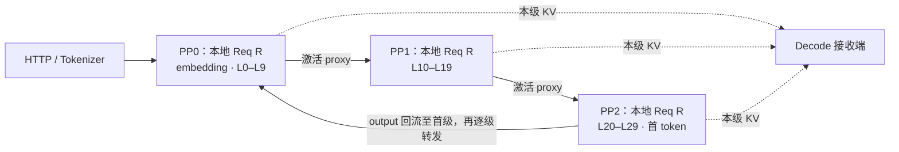
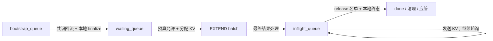

# PD Prefill PP=3 请求生命周期源码学习文档

本文是源码分析型学习资料，跟随一条请求 R，从 Prefill 服务接入到本地资源释放。交互入口：[请求生命周期](../pages/sglang/pd-prefill-lifecycle/index.html)。

## 0. 阅读基线与范围

| 项目 | 内容 |
| --- | --- |
| 源码仓库 | [sgl-project/sglang](https://github.com/sgl-project/sglang) |
| 分支 | `main` |
| commit | [`279339f113b79af84f27fd3ac92d0a13bd3f4cbd`](https://github.com/sgl-project/sglang/tree/279339f113b79af84f27fd3ac92d0a13bd3f4cbd) |
| 读取时间 | 2026-09-17 |
| 工作区状态 | SGLang 与 Wiki 开始时均干净；只在 Wiki 新增学习资料与页面 |
| 操作边界 | 只读源码分析；页面构建与交互验证；未启动 SGLang，未做 GPU/NCCL/Mooncake 运行实验 |
| 主线 | CUDA、PD Prefill、PP=3、TP=CP=DP=1、pp_async_batch_depth=0；普通 Llama 类 FULL attention 生成请求；以 Mooncake 说明传输提交 |
| 示例假设 | 正文以单请求成功路径为主；交互可配置 1–4 条等长请求、输入长度、共享 chunk 预算、请求容量与页大小，支持正常、等待和部分失败。默认 12 token / chunk 预算 4 / 页大小 2。FCFS、P/D 冷缓存，其他内存预算充足 |
| 不展开 | 外部路由选址、Decode 后续生成；关闭 HiCache/L3/staging、投机解码、乐观 Prefill、约束采样等分支 |

PP loop 页面与本页现已统一到 `279339f113`。两者分别采用 HiCache host-hit 场景与关闭 HiCache 的冷缓存场景，不能直接照搬示例 loop 编号、耗时或缓存步骤。下文是源码事实与显式示例假设的因果整理，不是运行观察或性能时间线。

### 术语速查

| 术语 | 人话解释 |
| --- | --- |
| P / D | Prefill 服务实例 / Decode 服务实例；PP0–PP2 都属于 P |
| R / rid | 一条请求及其标识；每级各有本地 Req |
| B / slot | 某次执行的 batch / 循环复用的状态槽位；都不能等同于请求 |
| bootstrap_room | 后端用于关联这次 P/D 传输的标识 |
| proxy | 让下一级继续模型计算的中间激活 |
| output | 末级采样结果等回流信息 |
| KV / metadata | 本级 prompt 各层的键值缓存 / 首 token 等交接信息 |
| inflight | 已处理最终 Prefill 结果，仍需跟踪传输与收尾的请求集合 |

## 1. 先建立整体地图

三个流水级各有调度器、请求状态、KV pool 和 sender。用 30 层示意：PP0 执行 embedding 与 L0–L9，PP1 执行 L10–L19，PP2 执行 L20–L29 与输出头。实际分层由模型与 PP 配置决定，三个级可以位于不同设备或机器。

图意：激活沿模型层向前，KV 各自交给 Decode，结果绕环传播；PP2 不收集全模型 KV 再统一发送。控制名单（bootstrap/release）另有独立通道与状态，不与图中的激活或 KV 混为一谈。

### 如何操控流水线图

主播放器现在由参数驱动。上方数据操作图展示当前输入如何变化，下方平面流水线同时高亮负责的模块；两者共用播放时钟。完整 token 序列、请求边界、本轮范围、KV 累积和每级状态都来自同一份动作快照。仍保留 12 个机制阶段作为源码阅读索引，动作数量由配置生成，不等同于 loop 次数。

- **先选示例或修改参数**：支持单块、三块、多请求组批、握手失败、取消、握手等待、混合传输终态和本地复查等待。修改参数后点击“生成流程”；选预设会直接生成。
- **切块与组批是主流程动作**：先显示共享 token 预算和候选请求，再标出每条完整序列的前缀 / 新增 / 尾部，最后把新增 IDs 按请求边界装入 batch。关闭切块时也展示“选择完整剩余序列 → 组 batch”，不伪造一次切分。
- **首批详细，后续整段**：默认详细展示第一批；后续每个 batch（单请求时就是一个 chunk）合并成一段，自动跑完整个内部流程。段内可以暂停、前后单步或拖动；最后一块包含终态共识和清理。可改为展开全部批次。多请求时一批可同时包含不同请求的最终块与中间块。
- **主流程与段内进度分开**：主进度选择阅读步骤；段内进度检查压缩片段里的具体操作。反向跳转恢复相应快照，不继承未来状态。播放速度仅影响阅读节奏。
- **点击组件**：暂停播放、查看职责，并可定位到该模块的下一次操作。下方源码阶段随当前动作切换。
- **复制参数链接**：链接保存所有参数、各级失败集合及当前动作；`#step-...` 章节入口仍保留。页面进入后台会暂停；系统减少动态效果时关闭装饰运动，保留数据状态。

实色描边表示当前操作，浅色表示访问过。请求资源是否仍占用，要看每级请求状态，而不是模块底色。各级分别发送 KV；PP0 发送不以三级都处理完结果为前提。末尾 Decode 模块只是交接边界，不增加“等 P 全部释放后才能生成”的屏障。

### 参数含义与共享预算

| 参数 | 教学含义 | 源码边界 |
| --- | --- | --- |
| 请求数量 / input token length | 1–4 条等长请求，每条 1–48 token | 预设整数 IDs，不是真实 tokenizer 编码；所有请求预先到达 |
| chunk-size | 整个 batch 的 chunk token 预算，0 表示关闭切块 | 对应 `chunked_prefill_size` 的教学规模；非零值必须能被 `page_size` 整除 |
| batch-size | 一批最多接纳多少条请求 | 表示 `prefill_max_requests` 一类准入容量，其他请求槽与内存约束假设足够；不是 TP/PP 数量 |
| KV 页大小 | 1、2 或 4 token / 页 | 普通 CUDA 路径按页向上计费，非最终发送取整页；这里使用逻辑位置，不伪造物理页索引 |
| 每级失败集合 | 可在 PP0、PP1、PP2 选择不同请求子集 | 影响准入、计算请求集合或局部传输终态，不能只改显示颜色 |
| 等待位置 | 指定某级的某条请求暂未就绪 | 后续条件改变是显式教学假设，不是对真实等待耗时的估计 |

例如 3 条请求各 6 token、chunk 预算 8、batch 容量 2、页大小 2：B1 选择 R0[0:6] + R1[0:2]；B2 先续算 R1[2:6]，再选 R2[0:4]；B3 续算 R2[4:6]。不能把预算 8 当成每条请求各享有 8。

另一个页计费例子：两条请求各 3 token、预算 6、页大小 2。第一条完整 3 token 计费 4，剩余预算 2 只能给第二条选择 2 token。容量为 2 不代表两条都能完整计算。

源码锚点：[`_get_new_batch_prefill_raw` 的 continuation 优先与选批](https://github.com/sgl-project/sglang/blob/279339f113b79af84f27fd3ac92d0a13bd3f4cbd/python/sglang/srt/managers/scheduler.py#L3857)、[`add_chunked_req`](https://github.com/sgl-project/sglang/blob/279339f113b79af84f27fd3ac92d0a13bd3f4cbd/python/sglang/srt/managers/schedule_policy.py#L950)、[`_select_prefill_admission`](https://github.com/sgl-project/sglang/blob/279339f113b79af84f27fd3ac92d0a13bd3f4cbd/python/sglang/srt/managers/schedule_policy.py#L1278)、[`prepare_for_extend`](https://github.com/sgl-project/sglang/blob/279339f113b79af84f27fd3ac92d0a13bd3f4cbd/python/sglang/srt/managers/schedule_batch.py#L2678)、[chunk 与页大小的参数校验](https://github.com/sgl-project/sglang/blob/279339f113b79af84f27fd3ac92d0a13bd3f4cbd/python/sglang/srt/arg_groups/validation_hook.py#L131)。本模型忽略 HiCache、回撤、SWA/Mamba、显存不足、调度延迟和请求到达时序，不用这些教学数值预测真实 batch 序列。

### 用部分失败观察三个不同门槛

1. **bootstrap 准入**：各级 `WaitingForInput` 的 good 求交，Failed 的 bad 求并。本地 `FINISH_ABORT` 也从 good 移除并加入 bad，即使 sender 仍报告就绪。预设 PP0 坏 R0、PP1 坏 R1、PP2 无失败，会得到 bad={R0,R1}，只有 R2 计算。返回的 bad 让各级清理对应请求。[共识与取消源码](https://github.com/sgl-project/sglang/blob/279339f113b79af84f27fd3ac92d0a13bd3f4cbd/python/sglang/srt/managers/scheduler_pp_mixin.py#L593)
2. **传输终态共识**：先在每级收集 Success 或 Failed，再跨 PP 求交。混合例子中，R0 在 PP1 Failed、在 PP2 Transferring，因此暂不进入共同名单；R1 在 PP2 Failed、其他级 Success，已经可以收尾。动画先收尾 R1、保留 R0 的引用，再在剩余级到终态后重做共识。[终态集合源码](https://github.com/sgl-project/sglang/blob/279339f113b79af84f27fd3ac92d0a13bd3f4cbd/python/sglang/srt/managers/scheduler_pp_mixin.py#L635)
3. **名单回流后的本地复查**：请求在 release 名单中，本地当前 poll 仍为瞬态时必须留下，不能释放 KV / metadata。Success 分支清理并调用 sender.clear；Failed 分支调用 `handle_inflight_transfer_failure`，释放引用并中止，不能将它显示为成功，也不虚构该分支调用 sender.clear。[本地复查与清理](https://github.com/sgl-project/sglang/blob/279339f113b79af84f27fd3ac92d0a13bd3f4cbd/python/sglang/srt/disaggregation/prefill.py#L991)、[失败处理](https://github.com/sgl-project/sglang/blob/279339f113b79af84f27fd3ac92d0a13bd3f4cbd/python/sglang/srt/disaggregation/prefill.py#L1082)

终态交集传的是 rid，不是统一成功/失败结论。因此同一个 rid 可以在本级成功分支、另一级失败分支收尾。本页的总览“交接异常”是对演示中各级记录的归纳，不代表源码里存在一个相同名称的全局状态或模拟了 Decode 的失败传播。释放的是请求对 KV 的引用，不表示缓存中的物理字节已清空。

### 图的实现与验证边界

`scenario-engine.js` 负责参数校验、选批、分块和每请求 × 每 PP 的状态转换；每个原子动作保存前后快照。重复步骤压缩只改变展示分组，不删掉计算、通信或清理动作。`player.js` 管理一个播放时钟、两个进度控制和 URL；`operation-lab.js` 从同一个快照渲染当前数据变化；静态 HTML 保留拓扑、12 阶段说明和源码锚点。

`node scripts/test_prefill_lifecycle.cjs` 检查具体切分结果、共享预算、连续区间、压缩/展开等价性、局部失败与等待、资源引用、本地复查保护和反向跳转。`scripts/test_prefill_lifecycle_browser.cjs` 另用真实 Chromium 检查参数生成、链接恢复、自动播放、段内控制、窄屏布局和减少动态效果。验证对象是教学引擎与网页，没有运行 SGLang / GPU / NCCL / Mooncake；动作顺序是符合所讲依赖的线性阅读顺序，不是完整并发调度模拟器。浏览器测试需要 Playwright、Chromium 和本地静态服务；默认地址为 `http://127.0.0.1:8765/sglang/pd-prefill-lifecycle/`，可用 `PREFILL_TEST_URL` 覆盖。

### 三块示例：从同一序列切出不同区间

交互默认采用完整 12-token 序列，教学预算为每块 4 token、KV 页大小为 2。ID 是预设数据，不是某个 tokenizer 的真实编码，也不是实际部署参数建议。分块与 PP 分层是两个维度：每个 chunk 都依次经过 PP0–PP2，每一级只保存自己层的 KV。

| 轮次 | 已有前缀 | 本次 `extend_range` | 尚未计算的尾部 | 本轮后的本级 KV |
| --- | --- | --- | --- | --- |
| 1 | `[0, 0)` | `[0, 4)` | `[4, 12)` | `[0, 4)` |
| 2 | `[0, 4)` | `[4, 8)` | `[8, 12)` | `[0, 8)` |
| 3 | `[0, 8)` | `[8, 12)` | 空 | `[0, 12)` |

切块不删除 `origin_input_ids`，也不创建三个独立请求。`PrefillAdder.add_chunked_req` 根据预算决定新增区间，已有前缀通过 `prefix_indices` 和 KV 参与注意力。本例中间块的发送边界恰好页对齐；一般情况下非最终块会将不完整的尾页延后。中间块结果不向请求追加有效首 token，也不执行最终 inflight 清理。最终块才处理有效 t₀、附带最终 metadata，并进入全请求的终态与释放流程。

| 图中操作 | 固定基线的源码入口 |
| --- | --- |
| 后续块预算与区间 | `managers/schedule_policy.py::PrefillAdder.add_chunked_req`，约 950–1000 行 |
| 首次截断或完整准入 | `managers/schedule_policy.py`，约 1106–1154 行 |
| 中间块结果处理 | `disaggregation/prefill.py`，约 898–954 行 |
| 保留 / 缓存未完成请求与中间块发送时机 | `disaggregation/prefill.py::process_prefill_chunk`，1210 行起 |
| 页边界、发送游标和最终 metadata | `disaggregation/prefill.py::_send_kv_chunk`，1311 行起 |

交互将这些依赖展开为一种便于阅读的顺序。实际 PP loop 可以交错推进不同块；非 overlap 路径在后续 `process_prefill_chunk` 发送中间块，overlap 路径在中间块结果处理时发送，图中不把两者合并成固定的运行调用栈。

## 2. 一条 R 的 12 个关键步骤

粒度按请求的状态变化或跨级交接切分：保留三个级各自的前向，合并批内张量整理等细项。编号是阅读顺序，不是 12 次 loop。步骤 8–9 在每级本地衔接，没有全局统一开始 KV 发送的屏障。

### 01. 接入请求，保留 PD 配对信息

从 Prefill 服务入口开始：把输入变成 token IDs，并让调度器知道这条请求要和哪一次 Decode 接收配对。

以普通 Python HTTP /generate 路径为例，TokenizerManager 处理输入，生成 TokenizedGenerateReqInput，再发送给 scheduler。请求中保留 rid、input_ids、采样参数，以及 bootstrap_host / port / room。

这里把请求记作 R。rid 用于调度与 PP 名单；bootstrap_room 用于传输后端关联 P/D 两侧的这次交接。外部路由器如何选择 P/D 实例不在本页展开，假设已提供合法配对信息。

**状态变化：** HTTP 输入 → TokenizedGenerateReqInput。

**推进条件：** 请求已经送入 Prefill 的调度入口；此时尚未分配本次前向的 KV 页。

**数据 / 控制路径：** 请求对象：HTTP → TokenizerManager → PP0。

**源码锚点：**

| 行为 | 源码 |
| --- | --- |
| generate_request | [`entrypoints/http_server.py:911`](https://github.com/sgl-project/sglang/blob/279339f113b79af84f27fd3ac92d0a13bd3f4cbd/python/sglang/srt/entrypoints/http_server.py#L911) |
| TokenizedGenerateReqInput 的构造 | [`managers/tokenizer_manager.py:1414`](https://github.com/sgl-project/sglang/blob/279339f113b79af84f27fd3ac92d0a13bd3f4cbd/python/sglang/srt/managers/tokenizer_manager.py#L1414) |
| _send_one_request | [`managers/tokenizer_manager.py:1592`](https://github.com/sgl-project/sglang/blob/279339f113b79af84f27fd3ac92d0a13bd3f4cbd/python/sglang/srt/managers/tokenizer_manager.py#L1592) |

### 02. 三级各自建 Req，进入 bootstrap 队列

同一条 R 沿流水线传播，各级建立自己的请求对象和 KV sender。三个流水级共享请求标识，各自管理本地资源。

PP0 从前端收请求；PP1、PP2 从上一级接收请求对象。每级 ingest_requests → handle_generate_request 构造本地 Req；PP loop 在本地迭代后部转发 recv_reqs。

Prefill 模式的 _add_request_to_queue 把 R 加入 disagg_prefill_bootstrap_queue。create_sender 绑定 bootstrap_room 和 pp_rank；pending_bootstrap=True。本地 max_new_tokens 被设为 1，用于 Prefill 侧预算估算，后续长文本生成交给 Decode。

**状态变化：** 每级：新建 Req → bootstrap_queue。

**推进条件：** 等待 Decode 侧目的 KV 索引等握手信息就绪；创建 sender 本身不代表可以计算或发送。

**数据 / 控制路径：** 请求复制：PP0 → PP1 → PP2；三个本地 bootstrap_queue。

**源码锚点：**

| 行为 | 源码 |
| --- | --- |
| _pull_raw_reqs | [`managers/scheduler_components/request_receiver.py:121`](https://github.com/sgl-project/sglang/blob/279339f113b79af84f27fd3ac92d0a13bd3f4cbd/python/sglang/srt/managers/scheduler_components/request_receiver.py#L121) |
| ingest_requests | [`managers/scheduler.py:2064`](https://github.com/sgl-project/sglang/blob/279339f113b79af84f27fd3ac92d0a13bd3f4cbd/python/sglang/srt/managers/scheduler.py#L2064) |
| handle_generate_request | [`managers/scheduler.py:2740`](https://github.com/sgl-project/sglang/blob/279339f113b79af84f27fd3ac92d0a13bd3f4cbd/python/sglang/srt/managers/scheduler.py#L2740) |
| _add_request_to_queue | [`managers/scheduler.py:3233`](https://github.com/sgl-project/sglang/blob/279339f113b79af84f27fd3ac92d0a13bd3f4cbd/python/sglang/srt/managers/scheduler.py#L3233) |
| create_sender / add / _process_req | [`disaggregation/prefill.py:358`](https://github.com/sgl-project/sglang/blob/279339f113b79af84f27fd3ac92d0a13bd3f4cbd/python/sglang/srt/disaggregation/prefill.py#L358) |

### 03. bootstrap 共识回流，才能进入待调度队列

一个级握手完成还不够：三个级必须对“R 可以继续”达成一致，再各自把 R 放进 waiting_queue。

每级轮询 sender。成功候选 WaitingForInput 沿 PP0 → PP1 → PP2 求交集；Failed 名单求并集，主动中止也被并入 bad 名单。末级把结论送回 PP0，再沿流水线转发。

process_bootstrapped_queue 使用返回的 good/bad 名单调用 pop_bootstrapped。正常路径还要分配 metadata 槽，读取 Decode 已有前缀长度，初始化 sender 的页数与发送起点，再将 R 加入 waiting_queue。该回流发生在本次选批之后，R 只能由后续选批使用。

**状态变化：** bootstrap_queue → waiting_queue；pending_bootstrap=False。

**推进条件：** R 在 good 共识中，且本地 finalize_bootstrap 成功；metadata 不足时仍需等待。

**数据 / 控制路径：** 候选 PP0 → PP1 → PP2 ｜结论 PP2 → PP0 → PP1 → PP2。

**源码锚点：**

| 行为 | 源码 |
| --- | --- |
| process_bootstrapped_queue | [`managers/scheduler_pp_mixin.py:573`](https://github.com/sgl-project/sglang/blob/279339f113b79af84f27fd3ac92d0a13bd3f4cbd/python/sglang/srt/managers/scheduler_pp_mixin.py#L573) |
| _pp_pd_get_bootstrapped_ids | [`managers/scheduler_pp_mixin.py:593`](https://github.com/sgl-project/sglang/blob/279339f113b79af84f27fd3ac92d0a13bd3f4cbd/python/sglang/srt/managers/scheduler_pp_mixin.py#L593) |
| _pp_pd_send_consensus_bootstrapped_ids | [`managers/scheduler_pp_mixin.py:660`](https://github.com/sgl-project/sglang/blob/279339f113b79af84f27fd3ac92d0a13bd3f4cbd/python/sglang/srt/managers/scheduler_pp_mixin.py#L660) |
| finalize_bootstrap | [`disaggregation/prefill.py:395`](https://github.com/sgl-project/sglang/blob/279339f113b79af84f27fd3ac92d0a13bd3f4cbd/python/sglang/srt/disaggregation/prefill.py#L395) |
| 回流在选批之后处理 | [`managers/scheduler_pp_mixin.py:304`](https://github.com/sgl-project/sglang/blob/279339f113b79af84f27fd3ac92d0a13bd3f4cbd/python/sglang/srt/managers/scheduler_pp_mixin.py#L304) |

### 04. 选入 Prefill batch，准备输入和 KV 写入位置

准入之后，R 仍需等 token 预算和可用显存。被选中时，各级准备执行同一请求所需的本地 batch。

get_new_batch_prefill 检查 waiting_queue。init_next_round_input 匹配前缀并确定待算范围，PrefillAdder 根据 token、请求槽位和 chunk 预算选入 R。本例设 P/D 都无前缀命中，prompt 能在一个 chunk 内完成。

R 被移出 waiting_queue，进入 ScheduleBatch；prepare_for_extend 设置 EXTEND 模式，整理输入、长度信息，并通过 alloc_for_extend 分配请求槽和 KV 位置（out_cache_loc）。PP loop 将本地 batch 放入 mbs[mb_id]。图中将这份单请求 batch 记作 B。

**状态变化：** waiting_queue → B（EXTEND）；获得本地请求槽与 KV 位置。

**推进条件：** 资源预算允许，当前本地 batch 已准备；PP1/PP2 还要等上游激活。

**数据 / 控制路径：** 每级本地：waiting_queue → PrefillAdder → ScheduleBatch → mbs[slot]。

**源码锚点：**

| 行为 | 源码 |
| --- | --- |
| _get_new_batch_prefill_raw | [`managers/scheduler.py:3797`](https://github.com/sgl-project/sglang/blob/279339f113b79af84f27fd3ac92d0a13bd3f4cbd/python/sglang/srt/managers/scheduler.py#L3797) |
| init_next_round_input / add_one_req | [`managers/scheduler.py:3959`](https://github.com/sgl-project/sglang/blob/279339f113b79af84f27fd3ac92d0a13bd3f4cbd/python/sglang/srt/managers/scheduler.py#L3959) |
| ScheduleBatch.init_new / prepare_for_extend | [`managers/scheduler.py:4037`](https://github.com/sgl-project/sglang/blob/279339f113b79af84f27fd3ac92d0a13bd3f4cbd/python/sglang/srt/managers/scheduler.py#L4037) |
| prepare_for_extend | [`managers/schedule_batch.py:2678`](https://github.com/sgl-project/sglang/blob/279339f113b79af84f27fd3ac92d0a13bd3f4cbd/python/sglang/srt/managers/schedule_batch.py#L2678) |

### 05. PP0：嵌入输入，计算第一段层

第一段流水级从 token IDs 开始，把 prompt 变成中间激活，同时写下自己负责的层的 KV。

以支持 PP 的 LlamaModel 为例，首级执行 embedding，再运行本级 [start_layer, end_layer) 内的层。本例用 30 层示意，PP0 负责 L0–L9；层数只是讲解用的配置假设。attention 后端将本级 KV 写入前面分配的位置。

_pp_launch_batch 在 forward stream 上等待 schedule stream，然后提交 run_batch 并记录 launch_event。非末级返回 PPProxyTensors（例如 hidden_states、residual）；发送前让调度流等待 launch_event，再提交 proxy 发送。CPU 提交完成不等于 GPU 已执行完成。

**状态变化：** B：本级前向已提交；L0–L9 的 KV 随计算产生。

**推进条件：** 发送流满足本次前向事件依赖后，激活才可交给 PP1。KV 仍由 PP0 持有。

**数据 / 控制路径：** 激活：PP0 ── hidden_states / residual ──→ PP1。

**源码锚点：**

| 行为 | 源码 |
| --- | --- |
| LlamaModel.forward | [`models/llama.py:426`](https://github.com/sgl-project/sglang/blob/279339f113b79af84f27fd3ac92d0a13bd3f4cbd/python/sglang/srt/models/llama.py#L426) |
| 本级 KV 写入示例 | [`layers/attention/flashinfer_backend.py:1338`](https://github.com/sgl-project/sglang/blob/279339f113b79af84f27fd3ac92d0a13bd3f4cbd/python/sglang/srt/layers/attention/flashinfer_backend.py#L1338) |
| _pp_launch_batch | [`managers/scheduler_pp_mixin.py:1221`](https://github.com/sgl-project/sglang/blob/279339f113b79af84f27fd3ac92d0a13bd3f4cbd/python/sglang/srt/managers/scheduler_pp_mixin.py#L1221) |
| 等待 launch_event 后发送 proxy | [`managers/scheduler_pp_mixin.py:337`](https://github.com/sgl-project/sglang/blob/279339f113b79af84f27fd3ac92d0a13bd3f4cbd/python/sglang/srt/managers/scheduler_pp_mixin.py#L337) |

### 06. PP1：接住激活，计算中间段层

中间级从上游隐藏状态继续计算；它不会重新执行 embedding，也不会把上一级的 KV 搬来再算。

_pp_recv_proxy_tensors 接收上一级的 proxy；LlamaModel.forward 从中取出 hidden_states 与 residual。PP1 计算 L10–L19，并将这些层的 KV 写在自己的 KV pool。

本级前向同样通过 _pp_launch_batch 提交。结果仍是中间激活，发送给 PP2；PP0 的 KV 留在 PP0，PP1 的 KV 留在 PP1。PP0 此时可推进其他 batch 的工作，具体交错取决于 loop 和通信依赖。

**状态变化：** B：中间层计算；各级 KV 按层分别持有。

**推进条件：** PP1 必须先收到 B 对应的上游激活，且本地输入与资源已准备。

**数据 / 控制路径：** 激活：PP0 → PP1 ── hidden_states / residual ──→ PP2。

**源码锚点：**

| 行为 | 源码 |
| --- | --- |
| _pp_recv_proxy_tensors | [`managers/scheduler_pp_mixin.py:858`](https://github.com/sgl-project/sglang/blob/279339f113b79af84f27fd3ac92d0a13bd3f4cbd/python/sglang/srt/managers/scheduler_pp_mixin.py#L858) |
| 非首级读取 proxy 与逐层前向 | [`models/llama.py:432`](https://github.com/sgl-project/sglang/blob/279339f113b79af84f27fd3ac92d0a13bd3f4cbd/python/sglang/srt/models/llama.py#L432) |
| _pp_launch_batch | [`managers/scheduler_pp_mixin.py:1221`](https://github.com/sgl-project/sglang/blob/279339f113b79af84f27fd3ac92d0a13bd3f4cbd/python/sglang/srt/managers/scheduler_pp_mixin.py#L1221) |

### 07. PP2：计算最后一段层，采样首 token

末级完成 prompt 的最后一段计算，得到用于采样的 logits，并产生第一个输出 token t₀。

PP2 接收 PP1 激活，计算 L20–L29，完成末级归一化与输出头。普通生成路径由 TpModelWorker 在末级调用 model_runner.sample 得到 next_token_ids；PP0/PP1 走中间激活返回路径。

_pp_launch_batch 将末级的 event 和输出字典放进 last_rank_comm_queue，等待 PP output 通道发送。此时 prompt 的 KV 已分布在三个级上；t₀ 是采样结果，本次 prompt 前向还没有计算 t₀ 自身的 KV。

**状态变化：** 末级输出：next_token_ids=t₀；排入 last_rank_comm_queue。

**推进条件：** 末级前向和采样满足事件依赖后，结果可以回流；请求仍未完成 KV 交接。

**数据 / 控制路径：** 末级输出：PP2 → last_rank_comm_queue → output 通道。

**源码锚点：**

| 行为 | 源码 |
| --- | --- |
| 末级 norm | [`models/llama.py:451`](https://github.com/sgl-project/sglang/blob/279339f113b79af84f27fd3ac92d0a13bd3f4cbd/python/sglang/srt/models/llama.py#L451) |
| 末级 logits_processor | [`models/llama.py:583`](https://github.com/sgl-project/sglang/blob/279339f113b79af84f27fd3ac92d0a13bd3f4cbd/python/sglang/srt/models/llama.py#L583) |
| 末级前向与 sample | [`managers/tp_worker.py:627`](https://github.com/sgl-project/sglang/blob/279339f113b79af84f27fd3ac92d0a13bd3f4cbd/python/sglang/srt/managers/tp_worker.py#L627) |
| event 与 last_rank_comm_queue | [`managers/scheduler_pp_mixin.py:1247`](https://github.com/sgl-project/sglang/blob/279339f113b79af84f27fd3ac92d0a13bd3f4cbd/python/sglang/srt/managers/scheduler_pp_mixin.py#L1247) |

### 08. 结果绕回三级，匹配原来的 batch

首 token 要回到各级的本地请求状态里。结果走环形回流，各级据此处理先前那份 B。

CUDA 路径中，PP2 发送末级输出给 PP0；非末级转发上一轮保存的 pp_outputs，因此结果继续 PP0 → PP1 → PP2。各级接收输出，准备 GenerationBatchResult，安排必要的 D2H，并在 CPU 处理前等待 d2h_event。

PP=3、depth=0 时环长为 3。当前前向用 mbs[mb_id]，结果处理用 mbs[(mb_id+1)%3]：两者属于不同槽位。R 不会在每次本地循环都从接入走到释放。只有单条 R 时，也需要后续空计算迭代把结果和控制消息排空。

**状态变化：** 回流结果 + 旧 batch B → 本地结果处理。

**推进条件：** 目标槽位存在、对应 output 已接收，且 D2H 事件已完成。

**数据 / 控制路径：** 结果：PP2 → PP0 → PP1 → PP2；不是按 2 → 1 → 0 倒传。

**源码锚点：**

| 行为 | 源码 |
| --- | --- |
| mb_id / next_mb_id 与处理顺序 | [`managers/scheduler_pp_mixin.py:223`](https://github.com/sgl-project/sglang/blob/279339f113b79af84f27fd3ac92d0a13bd3f4cbd/python/sglang/srt/managers/scheduler_pp_mixin.py#L223) |
| init_pp_loop_state | [`managers/scheduler_pp_mixin.py:553`](https://github.com/sgl-project/sglang/blob/279339f113b79af84f27fd3ac92d0a13bd3f4cbd/python/sglang/srt/managers/scheduler_pp_mixin.py#L553) |
| _pp_send_output_to_next_stage | [`managers/scheduler_pp_mixin.py:983`](https://github.com/sgl-project/sglang/blob/279339f113b79af84f27fd3ac92d0a13bd3f4cbd/python/sglang/srt/managers/scheduler_pp_mixin.py#L983) |
| 接收 output、copy stream 与 d2h_event | [`managers/scheduler_pp_mixin.py:1072`](https://github.com/sgl-project/sglang/blob/279339f113b79af84f27fd3ac92d0a13bd3f4cbd/python/sglang/srt/managers/scheduler_pp_mixin.py#L1072) |
| 等待 D2H 后处理旧 batch | [`managers/scheduler_pp_mixin.py:315`](https://github.com/sgl-project/sglang/blob/279339f113b79af84f27fd3ac92d0a13bd3f4cbd/python/sglang/srt/managers/scheduler_pp_mixin.py#L315) |

### 09. 进入 inflight，各级向 Decode 提交本级 KV

每级处理完自己的最终 Prefill 结果，就开始交接自己持有的 KV。KV 数据直接去 Decode 的目标内存。

process_batch_result_disagg_prefill 将 t₀ 追加到本地 req.output_ids，维护未完成请求的缓存引用，再把 R 加入 disagg_prefill_inflight_queue，随后调用 send_kv_chunk(last_chunk=True)。这是每级自己的先后关系，不要求等三级都处理完结果才一起发送。

最终块先将首 token 等信息写入 metadata buffer，再把请求 token 索引转成传输页索引，调用 sender.send。以 Mooncake 为例，send 将任务加入传输队列，后台搬运本级层的 KV。send 返回后继续轮询；PP2 不需要先汇总全模型 KV。

**状态变化：** 每级：B 最终结果 → inflight_queue → sender.send。

**推进条件：** 本级最终结果已处理且 bootstrap 完成；发送中的 KV 与 metadata 必须继续保留。

**数据 / 控制路径：** KV：PP0 ↘ D ｜ PP1 → D ｜ PP2 ↗ D；按接收端层映射写入。

**源码锚点：**

| 行为 | 源码 |
| --- | --- |
| 追加首 token、进入 inflight、send_kv_chunk | [`disaggregation/prefill.py:840`](https://github.com/sgl-project/sglang/blob/279339f113b79af84f27fd3ac92d0a13bd3f4cbd/python/sglang/srt/disaggregation/prefill.py#L840) |
| _send_kv_chunk | [`disaggregation/prefill.py:1311`](https://github.com/sgl-project/sglang/blob/279339f113b79af84f27fd3ac92d0a13bd3f4cbd/python/sglang/srt/disaggregation/prefill.py#L1311) |
| 页索引转换与 sender.send | [`disaggregation/prefill.py:1484`](https://github.com/sgl-project/sglang/blob/279339f113b79af84f27fd3ac92d0a13bd3f4cbd/python/sglang/srt/disaggregation/prefill.py#L1484) |
| MetadataBuffers.set_buf | [`disaggregation/utils.py:499`](https://github.com/sgl-project/sglang/blob/279339f113b79af84f27fd3ac92d0a13bd3f4cbd/python/sglang/srt/disaggregation/utils.py#L499) |
| MooncakeKVSender.send | [`disaggregation/mooncake/conn.py:2528`](https://github.com/sgl-project/sglang/blob/279339f113b79af84f27fd3ac92d0a13bd3f4cbd/python/sglang/srt/disaggregation/mooncake/conn.py#L2528) |

### 10. 轮询传输终态，沿 PP 汇合名单

传输任务提交后，调度器继续工作。只有各级都报告传输已到终态，R 才能进入释放候选名单。

每轮 _pp_pd_get_prefill_transferred_ids 轮询 inflight 请求的 sender。先在级内做 attention CP/TP 状态归约，再沿 PP0 → PP1 → PP2 对终态请求 ID 求交集。本例 TP=CP=1，所以重点是三级 PP 的共识。

源码终态集合包括 Success 和 Failed。主线假设都 Success；若 PP0、PP2 已终态而 PP1 仍在传输，R 不会出现在最终交集中。等待期间仍需保留源 KV，不能因为本级 forward 或 send 已返回就释放。

**状态变化：** inflight_queue 中保留 R；终态 ID 逐级求交。

**推进条件：** R 同时存在于三个级的终态候选集合，才能成为释放候选。

**数据 / 控制路径：** 终态名单：T₀ → T₀ ∩ T₁ → T₀ ∩ T₁ ∩ T₂。

**源码锚点：**

| 行为 | 源码 |
| --- | --- |
| _pp_pd_get_prefill_transferred_ids | [`managers/scheduler_pp_mixin.py:635`](https://github.com/sgl-project/sglang/blob/279339f113b79af84f27fd3ac92d0a13bd3f4cbd/python/sglang/srt/managers/scheduler_pp_mixin.py#L635) |
| get_rids | [`managers/scheduler_pp_mixin.py:1261`](https://github.com/sgl-project/sglang/blob/279339f113b79af84f27fd3ac92d0a13bd3f4cbd/python/sglang/srt/managers/scheduler_pp_mixin.py#L1261) |
| MooncakeKVSender.poll | [`disaggregation/mooncake/conn.py:2562`](https://github.com/sgl-project/sglang/blob/279339f113b79af84f27fd3ac92d0a13bd3f4cbd/python/sglang/srt/disaggregation/mooncake/conn.py#L2562) |

### 11. release 名单回流，各级再次检查本地状态

全局释放结论也要送回各级。收到名单是清理门槛，各级仍需确认自己的 sender 已处于终态。

末级把终态交集作为 release_rids 送回 PP0，再经 PP1 传回 PP2。PP loop 用返回的 next_release_rids 调用 process_disagg_prefill_inflight_queue。bootstrap、output 与 release 都在循环中推进，但各有消息和状态。

本地处理函数再次轮询 sender。R 不在名单内就留在 undone_reqs；即使在名单内，本地尚非 Success/Failed，也继续等待。本地成功才进入正常清理；失败走 handle_inflight_transfer_failure，不会被解释成成功交接。

**状态变化：** release_rids 中的 R + 本地终态 → 可收尾。

**推进条件：** 共识名单包含 R，同时本地 poll 已确认终态。

**数据 / 控制路径：** 释放许可：PP2 → PP0 → PP1 → PP2；本地 poll 再把关。

**源码锚点：**

| 行为 | 源码 |
| --- | --- |
| _pp_pd_send_consensus_release_ids | [`managers/scheduler_pp_mixin.py:683`](https://github.com/sgl-project/sglang/blob/279339f113b79af84f27fd3ac92d0a13bd3f4cbd/python/sglang/srt/managers/scheduler_pp_mixin.py#L683) |
| process_disagg_prefill_inflight_queue 调用 | [`managers/scheduler_pp_mixin.py:325`](https://github.com/sgl-project/sglang/blob/279339f113b79af84f27fd3ac92d0a13bd3f4cbd/python/sglang/srt/managers/scheduler_pp_mixin.py#L325) |
| 名单过滤与本地终态复查 | [`disaggregation/prefill.py:971`](https://github.com/sgl-project/sglang/blob/279339f113b79af84f27fd3ac92d0a13bd3f4cbd/python/sglang/srt/disaggregation/prefill.py#L971) |

### 12. 释放请求占用，结束 Prefill 侧生命周期

成功交接后，各级解除 R 的本地资源占用，Prefill 服务返回自己的完成结果，Decode 继续后续生成。

成功分支设置 Prefill 侧 FINISH_LENGTH(length=0)，调用 release_kv_cache 和 tree_cache.finish(SUCCESS)，清理 sender，并将 R 加入 done_reqs。随后 stream_output 发送完成输出，归还 metadata 槽，更新 inflight 队列。PP 的对外输出由有效 IPC sender 发出，不会产生三份用户响应。

释放请求意味着归还请求槽、解除缓存锁或引用；可复用的 prompt KV 可能继续由前缀缓存管理。batch 的旧引用由后续过滤与槽位复用清理。Decode 使用收到的 prompt KV 与 t₀ 继续生成；本页终点仅是 Prefill 侧收尾，不是整段回答生成结束。

**状态变化：** inflight_queue → done_reqs → 移出；metadata 槽归还。

**推进条件：** 三个级分别完成本地清理，R 的 Prefill 生命周期结束；无需等待 Decode 生成全文。

**数据 / 控制路径：** P 侧完成输出 → 前端；D 侧持有 prompt KV + t₀，继续生成。

**源码锚点：**

| 行为 | 源码 |
| --- | --- |
| 成功释放与 sender.clear | [`disaggregation/prefill.py:1025`](https://github.com/sgl-project/sglang/blob/279339f113b79af84f27fd3ac92d0a13bd3f4cbd/python/sglang/srt/disaggregation/prefill.py#L1025) |
| stream_output、metadata 归还与队列更新 | [`disaggregation/prefill.py:1066`](https://github.com/sgl-project/sglang/blob/279339f113b79af84f27fd3ac92d0a13bd3f4cbd/python/sglang/srt/disaggregation/prefill.py#L1066) |
| release_kv_cache | [`mem_cache/common.py:254`](https://github.com/sgl-project/sglang/blob/279339f113b79af84f27fd3ac92d0a13bd3f4cbd/python/sglang/srt/mem_cache/common.py#L254) |
| 旧 batch 过滤 | [`disaggregation/prefill.py:1242`](https://github.com/sgl-project/sglang/blob/279339f113b79af84f27fd3ac92d0a13bd3f4cbd/python/sglang/srt/disaggregation/prefill.py#L1242) |
| 有效 IPC 输出通道 | [`managers/scheduler_components/ipc_channels.py:36`](https://github.com/sgl-project/sglang/blob/279339f113b79af84f27fd3ac92d0a13bd3f4cbd/python/sglang/srt/managers/scheduler_components/ipc_channels.py#L36) |

## 3. 状态与完成边界

图意：这是每个 rank 的本地请求轨迹；各 rank 的对象独立，通过消息对齐进度。forward 完成只表示计算结束，sender Success 只说明本级传输终态，Prefill 收尾还要等待 PP 共识。done 也不等于 Decode 全文生成结束。

PP=3、depth=0 时槽环长为 3。`mb_id` 指当前前向槽，`(mb_id+1)%3` 指旧结果处理槽。一次循环可以给一个 batch 提交前向，同时处理另一份 batch 的结果或某条请求的释放。请求、batch 和槽位需要分别追踪。

## 4. 分支与排障地图

| 变化或现象 | 应如何调整主线 / 去哪里看 |
| --- | --- |
| 长 prompt / chunked prefill | 重复准备块、三级前向与对应结果处理；中间块可发送已完成 KV，尾部不足一页延后；最终块才走首 token 和最终交接。见 `prefill.py::process_prefill_chunk` 与 `process_batch_result_disagg_prefill` |
| P 侧前缀命中 | `init_next_round_input` 缩短待计算范围；启用 HiCache 时另需缓存事件与回载，不能将回载当成所有请求的必经阶段 |
| D 侧前缀命中 | `finalize_bootstrap` 读 decode_prefix_len 设置 start_send_idx，缩短待传范围；与 P 侧命中是两件事 |
| 停在 bootstrap_queue | 检查握手、目的 KV 索引、good/bad 名单与 metadata 容量；`create_sender` 不等于就绪 |
| 停在 waiting_queue | 检查 PrefillAdder、token 预算、请求槽和 KV 容量 |
| 已前向却未提交 KV | 检查回流 output 的 batch 槽位、D2H 事件及最终结果处理 |
| inflight 不下降 | 检查 sender.poll、终态交集、release 回流和本地复查；没有名单不能只凭本级成功释放 |
| 失败或取消 | bootstrap bad 求并含已中止请求；传输终态交集含 Failed，走失败清理。终态共识不等于全部传输成功 |
| 乐观 Prefill | 可在握手完成前计算，随后等待、重试或重新排队；本主线关闭该分支 |

这份材料的终点是 P 侧不再持有 R 的活跃请求资源。前缀缓存仍可保存 prompt KV；Decode 接续生成的状态机需要另行阅读。
