# PD 分离下的 PP 源码学习文档

本文面向第一次读 SGLang PP 源码的同学，只研究 **PD 分离场景下的 PP 行为**。非 PD 分离时 `scheduler.py` 会走 `event_loop_pp()`，本篇只作为对照提一句，不展开。

## 0. 阅读基线与范围

**源码基线**

| 项目 | 内容 |
| --- | --- |
| 源码目录 | `/Users/mac/Documents/Documents/工作/sglang` |
| 分支 | `muxi-main` |
| commit | `b9087a034bf2a7cb8bfc71fc29763ba2c57f4e56` |
| 读取时间 | 2026-07-15 |
| 工作区状态 | 只读源码，未修改 SGLang。读取时存在未跟踪文件：`docs_new/`、`mainline_diffs.txt`、`reverted_diffs.txt`、`scripts/playground/pd_pp_mtp/`、`scripts/run_prefill_pp_mtp_forward_unit_tests.sh`、`upstream_diffs.txt`、`working_notes/` |

**2026-09-16 独立补充基线：** 第 11.5 节及其图单独采用官方开源 `72d5c5bb73cadd7ffbf5114e5f81e29d36b6c61a`，实际读取目录 `/Users/mac/Documents/Documents/工作/sglang-source-study`，分支 `codex/main`，读取 worktree 干净，只读未实验。它不改变本文其余章节的历史 `muxi-main` 基线。

**产物假设**

产物以一份主 Markdown 学习文档为核心，图用 Mermaid 内嵌，或在需要更复杂视觉表达时额外生成 PNG/SVG。本版先使用 Mermaid，保持文档可直接阅读和 diff。

**怎么读本文**

每章尽量按四件事展开：

1. 先讲人话：先把源码行为翻译成普通语言。
2. 再贴关键源码：只摘最能说明分支和数据流的片段。
3. 再画流程图：用 Mermaid 把控制流和数据流连起来。
4. 最后给例子或比喻：把抽象的 rank、stage、KV transfer 拉回到具体场景。

**术语速查**

| 术语 | 人话解释 | 主要源码 |
| --- | --- | --- |
| PD 分离 | Prefill 集群负责吃 prompt 和产 KV，Decode 集群负责后续逐 token decode | `disaggregation/common/conn.py`、`scheduler.py` |
| PP | Pipeline Parallel，把模型层按 stage 切开，一条请求像流水线一样经过 PP0、PP1、... | `distributed/parallel_state.py`、`scheduler_pp_mixin.py` |
| TP | Tensor Parallel，同一个 PP stage 内切 tensor 算子 | `distributed/parallel_state.py` |
| CP | Context Parallel，把长上下文 token/层状态再切 | `models/deepseek_v2.py`、`disaggregation/prefill.py`、`disaggregation/common/conn.py` |
| DP | Data Parallel，多组并行处理不同请求 | `scheduler.py`、`parallel_state.py` |
| MTP/spec | speculative decoding 的 draft/target 叠加逻辑 | `scheduler.py`、`scheduler_pp_mixin.py` |
| rid | request id，PP consensus 里所有 stage 对齐请求状态的钥匙 | `scheduler_pp_mixin.py` |
| bootstrap room | PD KV transfer 的房间号，decode 和 prefill 用它对齐一次请求的 KV 传输 | `disaggregation/common/conn.py` |
| proxy tensor | 非最后 PP rank 传给下一 stage 的隐藏状态封装 | `forward_batch_info.py` |

---

## 1. 先建立整体地图

### 人话版

PD 分离下，系统不是一组 GPU 从头到尾完成所有事，而是拆成两座工厂：

- Prefill 工厂：拿到 prompt，跑 prefill，生成每层 KV cache。
- Decode 工厂：拿到 Prefill 工厂传来的 KV cache，再一轮轮生成新 token。

PP 又把每座工厂内部拆成流水线工位：

- PP0 通常负责 embedding 和前几层。
- 中间 PP stage 负责自己那段 transformer layers。
- 最后 PP stage 负责 norm/lm_head、采样结果，以及把输出传回前面的 stage 做后处理。

所以 PD 分离 + PP 的重点是两条线同时存在：

- **控制流**：request、bootstrap 完成、transfer 完成、release 等小消息。
- **数据流**：模型隐藏状态 proxy tensor 在 PP stage 之间传，KV cache 在 Prefill 和 Decode 集群之间传。

更准确地说，这里其实有三类东西：

| 名字 | 它是什么 | 生命周期 | 走向 |
| --- | --- | --- | --- |
| proxy tensor | 当前 microbatch 跑完某个 PP stage 后得到的中间激活，比如 `hidden_states`、`residual` | 很短，只服务这次 forward，下一 stage 用完就继续往后算 | 同一个集群内部，PP0 -> PP1 -> ... -> PPlast |
| KV cache | attention 为历史 token 保存的 key/value 记忆，每层都有自己的 KV | 比 proxy tensor 长，通常跟随请求存在，decode 后续每步都会用 | PD 分离时，从 Prefill 对应 PP stage 传到 Decode 对应 PP stage |
| 控制流 | 请求和状态消息，比如哪些 rid bootstrap ready、哪些 rid KV transfer done、哪些 rid 要 release | 贯穿请求调度全过程 | 在 PP stages 之间传递并做共识，也在 Prefill/Decode 的 KV handshake 中使用 |

proxy tensor 和 KV cache 的关系容易混：它们通常在同一次模型 forward 里一起产生或被使用，但不是同一个东西。以一层 transformer 为例，输入 hidden states 进入 attention 后，这一层会把当前 token 的 K/V 写入 KV cache，同时输出新的 hidden states 给下一层。PP 切层以后，“下一层”可能在下一个 PP stage 上，所以 hidden states 要被包装成 `PPProxyTensors` 继续往下传；而 KV cache 留给请求后续 decode 使用，在 PD 分离场景下还要从 Prefill 传到 Decode。

小例子：

- Prefill PP0 跑 layers 0-7：生成 layers 0-7 的 KV cache，同时输出 layer 7 之后的 `hidden_states`。
- 这个 `hidden_states` 作为 proxy tensor 发给 Prefill PP1，让 PP1 继续跑 layers 8-15。
- Prefill PP0 自己负责把 layers 0-7 的 KV cache 传给 Decode PP0；Prefill PP1 负责把 layers 8-15 的 KV cache 传给 Decode PP1。
- Decode 开始跑时，每个 Decode PP stage 用自己收到的 KV cache 做 attention，同时也用 proxy tensor 把当前 token 的 hidden states 传给下一个 Decode PP stage。

控制流做的事情则更像“调度签字单”：

- 把新 request 从 PP0 转发到后面的 PP stage，保证每个 stage 都知道这批请求。
- Prefill 侧检查 bootstrap：Decode 是否已经为这个请求准备好接收 KV。
- Prefill 侧检查 transfer：每个 Prefill PP stage 的 KV 是否都传完。
- Decode 侧检查 prealloc/transfer：KV 位置是否预分配，Prefill 传来的 KV 是否都到齐。
- 对这些状态做 PP 共识：成功取交集，失败取并集，避免某一个 stage 提前放行。
- release 请求：所有 stage 都确认后，Prefill 才释放 inflight 状态，Decode 才把请求放进 waiting queue 开始 decode。

### 源码锚点

| 行为 | 源码入口 |
| --- | --- |
| 根据 PD mode 选择 PP event loop | `python/sglang/srt/managers/scheduler.py::run_scheduler_process` |
| Prefill PP 主循环 | `python/sglang/srt/managers/scheduler_pp_mixin.py::event_loop_pp_disagg_prefill` |
| Decode PP 主循环 | `python/sglang/srt/managers/scheduler_pp_mixin.py::event_loop_pp_disagg_decode` |
| KV 传输公共 rank mapping | `python/sglang/srt/disaggregation/common/conn.py::CommonKVManager._resolve_rank_mapping` |
| Prefill 端 bootstrap 注册 | `python/sglang/srt/disaggregation/common/conn.py::CommonKVBootstrapServer` |

关键路由逻辑如下：

```python
# python/sglang/srt/managers/scheduler.py
elif disaggregation_mode == DisaggregationMode.PREFILL:
    if server_args.pp_size > 1:
        scheduler.event_loop_pp_disagg_prefill()
    ...
elif disaggregation_mode == DisaggregationMode.DECODE:
    if server_args.pp_size > 1:
        scheduler.event_loop_pp_disagg_decode()
```

### 总览图

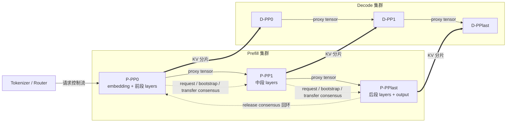

### 例子

可以把一次请求想成一张工单：

- 工单先进 Prefill 工厂 PP0，PP0 盖章后传给 PP1。
- 每个 PP stage 都只加工自己负责的模型层。
- Prefill 每个 stage 都要把自己负责层的 KV 发给 Decode 对应 stage。
- Decode 只有确认 KV 到齐，才把这张工单放入 decode waiting queue。

---

## 2. 启动参数和硬约束

### 人话版

PP 不是只打开 `--pp-size` 就完事。源码里会自动关掉一些调度能力，并且对 speculative/MTP 有很强限制。原因是 PP 要让多个 stage 以同一套 microbatch 节奏前进，如果叠加 overlap schedule、mixed chunk 等机制，控制面会很容易失去一致性。

### 源码锚点

| 参数或约束 | 源码 |
| --- | --- |
| `pp_size`、`pp_max_micro_batch_size`、`pp_async_batch_depth` dataclass 字段 | `server_args.py::ServerArgs` |
| CLI 参数 `--pipeline-parallel-size/--pp-size` | `server_args.py::add_cli_args` |
| PP 自动关闭 overlap schedule | `server_args.py::_handle_pipeline_parallelism` |
| PP 与 mixed chunk/speculative 的 assert | `server_args.py::check_server_args` |

关键字段：

```python
# python/sglang/srt/server_args.py
tp_size: int = 1
pp_size: int = 1
pp_max_micro_batch_size: Optional[int] = None
pp_async_batch_depth: int = 0
```

打开 PP 后，源码直接关闭 overlap schedule：

```python
# python/sglang/srt/server_args.py
def _handle_pipeline_parallelism(self):
    if self.pp_size > 1:
        self.disable_overlap_schedule = True
        logger.warning(
            "Pipeline parallelism is incompatible with overlap schedule."
        )
```

启动检查里的硬约束：

```python
# python/sglang/srt/server_args.py
if self.pp_size > 1:
    assert self.disable_overlap_schedule, (
        "Pipeline parallelism is not compatible with overlap schedule"
    )
    assert not self.enable_mixed_chunk, (
        "Pipeline parallelism is not compatible with mixed chunked prefill."
    )
    if self.speculative_algorithm is not None:
        assert self.disaggregation_mode == "prefill", (
            "PP + speculative decoding is only supported in disaggregated prefill mode"
        )
        assert self.speculative_algorithm in {"EAGLE", "EAGLE3", "NEXTN"}
```

还有一个额外边界：DFLASH speculative 明确要求 `pp_size == 1`，所以不进入本文主线。

### 参数关系图

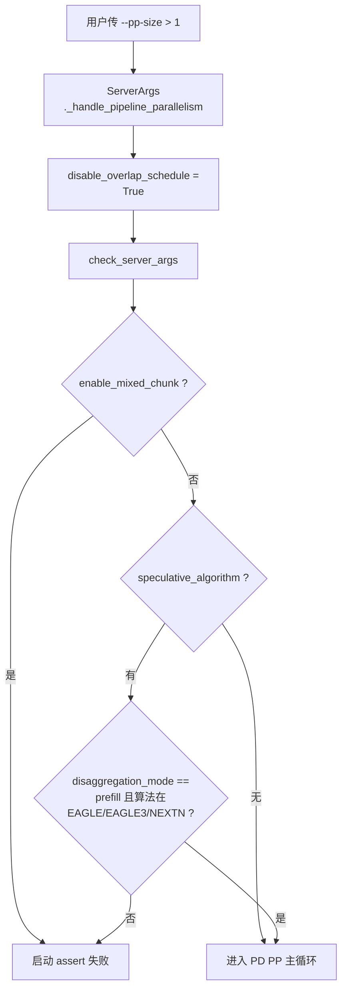

### 例子

如果你启动 Decode 服务时带了 `--pp-size 4 --speculative-algorithm EAGLE`，源码会拒绝，因为 PP+spec 只支持 `disaggregation_mode == "prefill"`。这不是文档猜测，是 `check_server_args()` 里的 assert。

---

## 3. PP rank 是怎么编队的

### 人话版

PP 和 TP 是两种方向的切法：

- TP group：同一个 PP stage 内，大家一起切一个算子。
- PP group：跨 PP stage 串起来，像流水线上的不同工位。

例如 `tp_size=2, pp_size=4`，世界里有 8 个 rank。TP group 是 `[0,1]`、`[2,3]`、`[4,5]`、`[6,7]`，每组代表一个 stage 内的 TP 并行。PP group 是 `[0,2,4,6]` 和 `[1,3,5,7]`，每条链代表同一个 TP 分片在不同 PP stage 上一路流动。

### 源码锚点

`parallel_state.py::initialize_model_parallel()` 里构建 PP group：

```python
# python/sglang/srt/distributed/parallel_state.py
num_pipeline_model_parallel_groups = world_size // pipeline_model_parallel_size
group_ranks = []
for pp_group_idx in range(num_pipeline_model_parallel_groups):
    ranks = list(
        range(pp_group_idx, world_size, num_pipeline_model_parallel_groups)
    )
    group_ranks.append(ranks)

_PP = init_model_parallel_group(
    group_ranks,
    get_world_group().local_rank,
    backend,
    use_custom_allreduce=False,
    group_name="pp",
    recovered_rank=recovered_rank,
)
```

源码还提供这些查询函数：

```python
def get_pp_group() -> GroupCoordinator:
    assert _PP is not None, "pipeline model parallel group is not initialized"
    return _PP

def get_pipeline_model_parallel_world_size():
    return get_pp_group().world_size

def get_pipeline_model_parallel_rank():
    return get_pp_group().rank_in_group
```

### rank 编组图

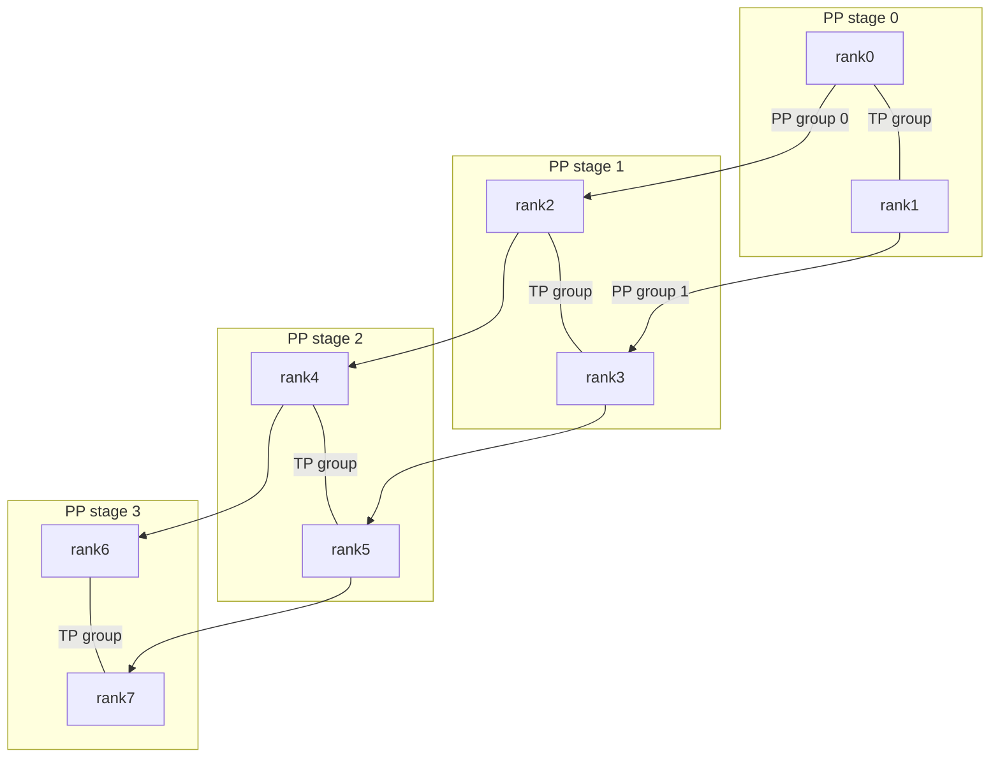

图里横向短线表示 **同一个 PP stage 内的 TP group 成员关系**，也就是这些 rank 会在同一段模型层里通过 TP collective 协作计算。它不是 request、proxy tensor、KV cache 的 PP 传输方向，也不是一次具体的点对点发送。纵向箭头才表示 **PP group**，即隐藏状态和控制消息沿着 pipeline stage 往后走的方向。

### 为什么 TP collective 后，PP 还是分开往下传

TP collective 的作用是让同一个 PP stage 内的 TP ranks 一起把本 stage 的 tensor-parallel 算子算对；它并不表示这两个 rank 从此合成一个 rank，也不表示 PP 发送时要先把所有 TP 分片拼成一份完整 hidden states 再发。

源码里的 PP tensor 发送发生在 `self.pp_group` 上：

```python
# python/sglang/srt/managers/scheduler_pp_mixin.py
self.pp_group.send_tensor_dict(
    tensor_dict=tensor_dict,
    all_gather_group=(
        self.attn_tp_group if self.require_attn_tp_allgather else None
    ),
    async_send=async_send,
)
```

也就是说，主要通信方向仍然是 PP group：`rank0 -> rank2 -> rank4 -> rank6`、`rank1 -> rank3 -> rank5 -> rank7`。`all_gather_group` 只是可选的 TP 维度补充，用来在需要时让接收侧恢复它期望的 tensor 形状。

`GroupCoordinator.send_tensor_dict()` 里能看到这个优化：如果传入了 `all_gather_group`，发送端只发当前 TP rank 对应的 slice，接收端再在 TP group 内 all-gather 回原形状。

```python
# python/sglang/srt/distributed/parallel_state.py
if all_gather_group is not None and tensor.numel() % all_gather_size == 0:
    tensor = tensor.reshape(all_gather_size, -1)[all_gather_rank]

# recv 侧
if use_all_gather:
    tensor = all_gather_group.all_gather(tensor, dim=0)
    tensor = tensor.reshape(orig_shape)
```

这样设计的好处是保留 TP 分片编号：上一 stage 的 TP rank 0 把自己这条分片链交给下一 stage 的 TP rank 0，TP rank 1 也交给下一 stage 的 TP rank 1。否则就要在每个 PP 边界做一次“全量 gather -> 发送 -> 再切分”，通信量更大，布局也更复杂。

### 比喻

TP 是一个工位上两个人同时拧同一个零件，PP 是零件从第一个工位传到第四个工位。PP 的消息传递只沿着工位链走，不会在同一个工位的 TP rank 之间乱传。

---

## 4. 模型层如何被切给不同 PP stage

### 人话版

模型代码也必须配合 PP。调度器只负责“让 microbatch 按 stage 前进”，但真正决定“这一段 rank 负责哪些层”的，是模型初始化和 forward：

- first PP rank 创建 embedding，把 `input_ids` 变成第一份 `hidden_states`。
- 中间 PP rank 没有 embedding，也没有最终 `lm_head`，只接收上一 stage 的 `PPProxyTensors`。
- last PP rank 才执行最后的 norm、`lm_head`、logits processor，生成 `next_token_ids` 或 spec 输出。
- 每个 stage 只实例化自己负责的层；不属于自己的层用 `PPMissingLayer` 占位，保持 layer index 仍然可读。

本节优先用 GLM5 举例。当前源码里 GLM5 的架构名是 `GlmMoeDsaForCausalLM`：类定义放在 `models/glm4_moe.py` 文件末尾，但它继承的是 `DeepseekV2ForCausalLM`，实际 PP forward 骨架主要在 `models/deepseek_v2.py`。所以读 GLM5 时，不要被文件名里的 `glm4` 误导。

### 源码锚点

层切分工具仍是公共的 `utils/common.py::make_layers()`：

```python
# python/sglang/srt/utils/common.py
start_layer, end_layer = get_pp_indices(num_hidden_layers, pp_rank, pp_size)
modules = torch.nn.ModuleList(
    [PPMissingLayer(return_tuple=return_tuple) for _ in range(start_layer)]
    + get_offloader().wrap_modules(
        (
            layer_fn(idx=idx, prefix=add_prefix(idx, prefix))
            for idx in range(start_layer, end_layer)
        ),
        **(offloader_kwargs or {}),
    )
    + [
        PPMissingLayer(return_tuple=return_tuple)
        for _ in range(end_layer, num_hidden_layers)
    ]
)
return modules, start_layer, end_layer
```

`PPMissingLayer` 的作用很像“空座位”：它不算真实层，但让 `self.layers[i]` 的编号仍和全局模型层号一致。

```python
# python/sglang/srt/layers/utils/common.py
class PPMissingLayer(torch.nn.Identity):
    ...
```

proxy tensor 是很薄的 dict 包装。它不关心模型语义，只负责把上一 stage 产出的中间张量按 key 交给下一 stage。

```python
# python/sglang/srt/model_executor/forward_batch_info.py
class PPProxyTensors:
    tensors: Dict[str, torch.Tensor]

    def __getitem__(self, key: str):
        return self.tensors[key]
```

GLM5 的入口类很短，它把自己接到 DeepSeek/DSA 的通用实现上：

```python
# python/sglang/srt/models/glm4_moe.py
class GlmMoeDsaForCausalLM(DeepseekV2ForCausalLM):
    def determine_num_fused_shared_experts(self):
        super().determine_num_fused_shared_experts("GlmMoeDsaForCausalLM")
```

真正的 PP 初始化在 `DeepseekV2Model`。这段对 GLM5 也生效：

```python
# python/sglang/srt/models/deepseek_v2.py
class DeepseekV2Model(nn.Module):
    def __init__(...):
        self.pp_group = get_pp_group()
        self.use_nsa = is_deepseek_nsa(config)

        if self.pp_group.is_first_rank:
            self.embed_tokens = VocabParallelEmbedding(
                config.vocab_size,
                config.hidden_size,
                use_attn_tp_group=is_dp_attention_enabled(),
            )
        else:
            self.embed_tokens = PPMissingLayer()

        self.layers, self.start_layer, self.end_layer = make_layers(
            config.num_hidden_layers,
            lambda idx, prefix: DeepseekV2DecoderLayer(...),
            pp_rank=self.pp_group.rank_in_group,
            pp_size=self.pp_group.world_size,
            prefix=add_prefix("layers", prefix),
        )

        if self.pp_group.is_last_rank:
            self.norm = RMSNorm(config.hidden_size, eps=config.rms_norm_eps)
        else:
            self.norm = PPMissingLayer(return_tuple=True)
```

GLM5 的 forward 里除了 `hidden_states/residual`，还可能带 `topk_indices`。这是 NSA/DSA 的关键：某些层会复用前面 stage 算出的 sparse index，因此 PP proxy 不能只传隐藏状态。

```python
# python/sglang/srt/models/deepseek_v2.py
def forward(..., pp_proxy_tensors=None):
    if self.pp_group.is_first_rank:
        hidden_states = self.embed_tokens(input_ids)
        residual = None
    else:
        assert pp_proxy_tensors is not None
        hidden_states = pp_proxy_tensors["hidden_states"]
        residual = pp_proxy_tensors["residual"]
        topk_indices = pp_proxy_tensors.tensors.get("topk_indices")

    for i in range(normal_start_layer, normal_end_layer):
        layer = self.layers[i]
        hidden_states, residual, topk_indices = layer(
            positions,
            hidden_states,
            forward_batch,
            residual,
            ...,
            prev_topk_indices=topk_indices,
        )

    if not self.pp_group.is_last_rank:
        proxy_tensors = {
            "hidden_states": hidden_states,
            "residual": residual,
        }
        if self.use_nsa and nsa_layer_skips_topk(...):
            proxy_tensors["topk_indices"] = topk_indices
        return PPProxyTensors(proxy_tensors)
    else:
        hidden_states, _ = self.norm(hidden_states, residual)
```

最后的 `DeepseekV2ForCausalLM` 只有在 last rank 才真正产出 logits。GLM5 继承它，所以也遵循这个行为：

```python
# python/sglang/srt/models/deepseek_v2.py
hidden_states = self.model(
    input_ids, positions, forward_batch, input_embeds, pp_proxy_tensors
)

if self.pp_group.is_last_rank:
    return self.logits_processor(
        input_ids, hidden_states, self.lm_head, forward_batch, aux_hidden_states
    )
else:
    return hidden_states
```

其他普通 decoder-only 模型也遵循同一套 PP 套路：first rank 做 embedding，中间 stage 传 `hidden_states/residual`，last rank 才做 norm 和输出头；本文后面涉及模型细节时默认以 GLM5 为主例。
这意味着读 GLM5 NSA/DSA 的 PP 行为时要同时看两层：`GlmMoeDsaForCausalLM` 这个 GLM5 入口，以及 `DeepseekV2Model/DeepseekV2ForCausalLM` 共享路径里的 topk index、compressed MLA、state cache 处理。

### 层切分图

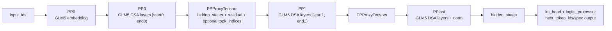

### 例子

假设 GLM5 DSA 有 64 层，`pp_size=4`。PP0 可能负责第 0 到 15 层，并创建 embedding；PP1/PP2 只负责中间层；PP3 负责最后一段层和 norm/logits。PP0 到 PP3 传的是“当前请求这次 forward 的隐藏状态接力棒”，必要时还带 NSA 的 `topk_indices`；这不是 KV cache。KV cache 是每层 attention 在 forward 过程中写入的历史记忆，会另走 PD 的 KV transfer 传给 decode 集群。

---

## 5. KVPoll 状态与 Queue 状态机

### 人话版

在进入 Prefill/Decode 的 PP loop 之前，先把一个核心事实记牢：PD 分离下的 PP 不是靠一个队列从头跑到尾，而是靠 **KVPoll 状态 + 多个 queue** 一步步推进。

可以把每个请求想成一张工单：

1. Decode 先准备收货位置。
2. Prefill 确认收货位置已经准备好。
3. Prefill 跑模型并发送 KV。
4. Decode 确认 KV 和 metadata 都收齐。
5. 两边通过 PP consensus 放行这张工单。

`KVPoll` 就是这张工单在 KV 通道上的状态码。queue 是调度器用来承载“当前卡在哪一步”的容器。`WaitingForInput` 最容易误解：它不是“模型 waiting queue”，而是 receiver 视角的“我准备好等输入了”。在 Prefill 侧 poll 到它时，意思是 decode 已经把接收端目的地址和 metadata 入口发过来了。

### 源码锚点

`KVPoll` 定义很小，但它贯穿 bootstrap、prealloc、transfer、release：

```python
# python/sglang/srt/disaggregation/base/conn.py
class KVPoll:
    Failed = 0
    Bootstrapping = 1
    WaitingForInput = 2
    Transferring = 3
    Success = 4
```

Prefill 和 Decode 文件顶部的注释已经把两边的 request life cycle 写得很直白：

```python
# python/sglang/srt/disaggregation/prefill.py
"""
Life cycle of a request in the prefill server

1. Bootstrap Queue
2. Waiting Queue
3. Inflight Queue
"""
```

```python
# python/sglang/srt/disaggregation/decode.py
"""
Life cycle of a request in the decode server

1. PreallocQueue
2. TransferQueue
3. WaitingQueue
4. RunningBatch
"""
```

### KVPoll 状态表

| 状态 | 小白解释 | 常见出现位置 | 下一步通常是什么 |
| --- | --- | --- | --- |
| `Bootstrapping` | 还在握手，双方还没把路由和目的地址对齐 | `PrefillBootstrapQueue.pop_bootstrapped()`、`DecodePreallocQueue._update_handshake_waiters()` | 继续 poll |
| `WaitingForInput` | receiver 已经准备好，等 sender 输入 | Decode receiver `init()` 后本地标记；Prefill sender poll 到后进入 bootstrap ready | Decode 做 prealloc/send_metadata；Prefill 进入 waiting queue |
| `Transferring` | KV/state/metadata 正在传 | Prefill inflight queue、Decode transfer queue | 继续 poll |
| `Success` | 本地或聚合后的 transfer 已完成 | `process_disagg_prefill_inflight_queue()`、`DecodeTransferQueue.pop_transferred()` | 进入 release consensus 或 waiting queue |
| `Failed` | 握手或传输失败 | 各种 poll 失败分支 | abort request、释放 KV/metadata、stream error |

这里要特别注意两个视角：

- Decode 本地的 `CommonKVReceiver.init()` 会把 receiver 状态设成 `WaitingForInput`，意思是“我已经解析到 prefill rank mapping，并准备好接收 metadata”。
- Prefill 侧的 sender poll 到 `WaitingForInput`，才表示 decode 后续通过 `send_metadata()` 把 page indices、state indices、metadata buffer index、`decode_prefix_len` 等目的信息送到了 prefill bootstrap 通道。

```python
# python/sglang/srt/disaggregation/common/conn.py
def init(self, prefill_dp_rank: int):
    self.prefill_info = self.kv_mgr.prefill_info_table[self.bootstrap_addr]
    self.target_tp_ranks = self.prefill_info.target_tp_ranks
    self.target_cp_ranks = self.prefill_info.target_cp_ranks
    self.target_pp_ranks = self.prefill_info.target_pp_ranks
    self.required_prefill_response_num = (
        self.prefill_info.required_prefill_response_num
    )
    self._setup_bootstrap_infos()
    self.kv_mgr.update_status(self.bootstrap_room, KVPoll.WaitingForInput)
```

### Prefill queue 状态机

Prefill 侧的主线是：先等 bootstrap，再进入普通 prefill waiting queue，forward 后进入 inflight transfer，最后 release 和清理。

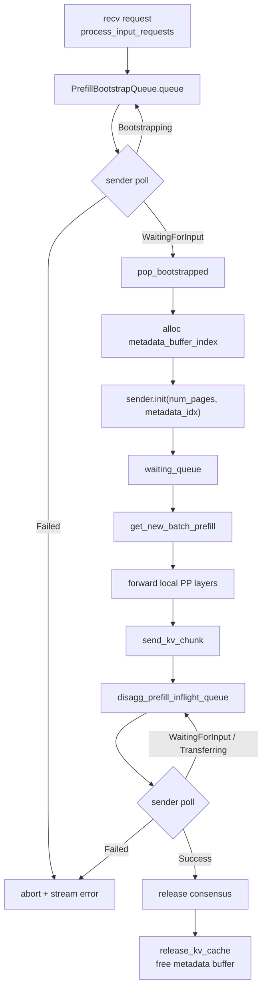

关键源码入口：

```python
# python/sglang/srt/disaggregation/prefill.py
class PrefillBootstrapQueue:
    def add(self, req: Req, num_kv_heads: int) -> None: ...
    def pop_bootstrapped(...): ...

def process_disagg_prefill_inflight_queue(...): ...
```

`PrefillBootstrapQueue.add()` 创建当前 PP stage 自己的 sender；`pop_bootstrapped()` 在 poll 到 `WaitingForInput` 后分配 metadata buffer、计算 `decode_prefix_len`、调用 sender `init()`；`process_disagg_prefill_inflight_queue()` 在 forward 后持续 poll sender，成功后释放本地 prefill KV 和 metadata buffer。

### Decode queue 状态机

Decode 侧的主线是：先创建 receiver，再 prealloc decode 侧 KV/page/metadata 位置，然后等 Prefill 写入，最后放进 decode waiting/running。

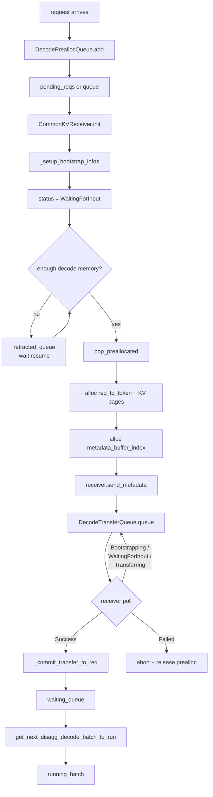

关键源码入口：

```python
# python/sglang/srt/disaggregation/decode.py
class DecodePreallocQueue:
    def add(self, req: Req, is_retracted: bool = False) -> None: ...
    def pop_preallocated(...): ...

class DecodeTransferQueue:
    def pop_transferred(...): ...
```

`DecodePreallocQueue.add()` 创建 receiver；`pop_preallocated()` 负责真正分配 decode 侧 `req_to_token_pool`、KV page 和 metadata buffer，并通过 `send_metadata()` 告诉 prefill 往哪里写；`DecodeTransferQueue.pop_transferred()` 在 receiver `Success` 后读取 metadata buffer，把 output token、cached token、spec/logprob 信息提交回 `Req`。

### queue 速查表

| queue / 容器 | 所在侧 | 进入条件 | 退出条件 | 关键方法 |
| --- | --- | --- | --- | --- |
| `PrefillBootstrapQueue.queue` | Prefill | `process_input_requests()` 收到请求后调用 `add()` | sender poll 到 `WaitingForInput` 或 `Failed` | `add()`、`pop_bootstrapped()` |
| `waiting_queue` | Prefill | bootstrap consensus 后 `process_bootstrapped_queue()` 放入 | `get_new_batch_prefill()` 取出组成 batch | `process_bootstrapped_queue()`、`get_new_batch_prefill()` |
| `disagg_prefill_inflight_queue` | Prefill | prefill forward 完成并调用 `send_kv_chunk()` | transfer release 后清理 | `process_batch_result_prefill()`、`process_disagg_prefill_inflight_queue()` |
| `DecodePreallocQueue.pending_reqs` | Decode | receiver 还没解析出 prefill dp rank 或 parallel info | `_resolve_pending_reqs()` 成功后 init receiver | `_resolve_pending_reqs()`、`_ensure_prefill_info()` |
| `DecodePreallocQueue.queue` | Decode | receiver 已创建，等待 prealloc 或 handshake ready | `pop_preallocated()` 成功后移到 transfer queue | `add()`、`pop_preallocated()` |
| `DecodePreallocQueue.retracted_queue` | Decode | 显存压力或预分配资源不足时撤回 | `resume_retracted_reqs()` 放回 waiting | `process_retract_queue()`、`resume_retracted_reqs()` |
| `DecodeTransferQueue.queue` | Decode | decode 已经 `send_metadata()`，等待 prefill 写 KV | receiver `Success` 后提交 metadata 并移入 waiting | `extend()`、`pop_transferred()` |
| `waiting_queue` | Decode | KV 和 metadata 都收齐，release consensus 通过 | `get_next_disagg_decode_batch_to_run()` 取出 | `process_decode_transfer_queue()` |
| `running_batch` | Decode | decode waiting queue 取出后进入实际 decode | token 生成结束、abort 或被调度回收 | `get_next_disagg_decode_batch_to_run()` |

### PP 下为什么还要 consensus

上面的 queue 状态都是“某个 rank 或某个 stage 看到的本地状态”。PP 下一个请求要跨多个 stage 才算完整，所以 SGLang 会把 rid 列表沿 PP stage 传一圈：

- ready/success 取交集：所有 stage 都 ready 才能继续。
- failed 取并集：任何 stage 失败都要失败。

这也是第 6、7 章里反复出现 `_pp_pd_get_bootstrapped_ids()`、`_pp_pd_get_prealloc_ids()`、`_pp_pd_get_*_transferred_ids()` 的原因。

### 小例子

假设 `pp_size=2`，`rid=A` 在 Prefill PP0 已经 poll 到 `WaitingForInput`，但 PP1 还在 `Bootstrapping`。这时 PP0 不能独自把 `A` 放进 prefill batch，因为 PP1 还没有 decode 侧目的地址。只有 PP0 和 PP1 都报 ready，`A` 才会通过 bootstrap consensus，进入两个 stage 的 `waiting_queue`，随后才能跑完整条 GLM5 forward。

---

## 6. PD Prefill 下的 PP 调度循环

### 人话版

Prefill PP 主循环要同时照看两条线：

1. **模型执行线**：接收 request，把 request 沿 PP stage 转发；每个 stage 跑自己那段 GLM5 DSA 层，并把 proxy tensor 传给下一 stage。
2. **KV 传输线**：等待 decode 先准备好接收地址；prefill 每个 PP stage 把自己负责层的 KV/state 发过去；所有 stage 都传完后再 release。

它不是一个简单的 `batch = get_batch(); run(batch)`。因为每个 PP stage 都有自己的 KV sender 状态，如果某个 stage 的 KV 还没有传完，decode 不能开始。也就是说，模型 forward 完成只是“算完了”，KV transfer release 才是“decode 真的能接着生成了”。

为了小白好理解，可以把“每个 microbatch 在每个 PP stage 里的一轮处理”拆成三段：

| 讲解视角 | 它在做什么 | 典型源码入口 |
| --- | --- | --- |
| `preprocess` | 收 request、poll bootstrap、poll transfer、准备本轮 batch、接收上一 stage 的 proxy、顺手处理前一轮 output | `event_loop_pp_disagg_prefill()`、`_pp_pd_get_bootstrapped_ids()`、`_pp_pd_get_prefill_transferred_ids()`、`_pp_commit_send_output_work_and_preprocess_output_tensors()` |
| `process` | 真正跑当前 PP stage 的 forward；GLM5 场景下就是跑本 stage 的 `DeepseekV2DecoderLayer` 切片 | `_pp_launch_batch()`、`run_batch()` |
| `postprocess` | 非 last stage 发送 proxy；last stage 暂存 output；推进 bootstrap consensus、release consensus 和 KV release | `_pp_send_dict_to_next_stage()`、`_pp_process_batch_result()`、`process_disagg_prefill_inflight_queue()` |

注意，这三个词是阅读文档里的分段方法，不是源码里严格同名的三个大函数。源码实际把它们交错在一个 `for mb_id in range(self.pp_loop_size)` 里，是为了减少 PP 空泡和 CPU/GPU 等待。

### 先把关键词讲清楚

| 概念 | 小白解释 | Prefill 侧看见它时意味着什么 |
| --- | --- | --- |
| `request` | 一条用户请求的调度对象，里面有 `rid`、输入 token、采样参数、`bootstrap_host`、`bootstrap_room` 等 | PP0 从 tokenizer/RPC 收到，后续 PP stage 从前一 stage 收到同一个请求控制对象 |
| `rid` | request id，可以理解成工单号 | PP 共识时传的是 rid 列表，而不是整条请求 |
| `bootstrap_room` | 一次 P/D KV 传输的房间号，decode 和 prefill 靠它对齐同一次请求 | Prefill sender 用它找到 decode 准备好的目的地址、metadata buffer 和 transfer 状态 |
| `bootstrap` | KV transfer 的握手阶段，不是 KV 数据本身 | decode 已经创建 receiver、查到 prefill rank、把目的 page indices 和 metadata buffer index 发过来后，prefill 才能开始真正发 KV |
| `WaitingForInput` | `KVPoll` 状态之一，名字从 receiver 角度看是“我已准备好，等 prefill 输入” | Prefill poll 到这个状态后，说明该请求可以进入 waiting queue 参加 prefill forward |
| `metadata_buffer_index` | decode 给 prefill 的一小块结果/元数据写入位置 | prefill 最后会把 next token、cached tokens、logprob/spec hidden states、bootstrap room 等写进这块 buffer |
| `decode_prefix_len` | decode 侧 radix cache 已命中的前缀长度 | prefill 只需要传 `origin_input_len - decode_prefix_len` 这一段增量 KV |
| `transfer` | 真正把 KV/cache/state/metadata 从 prefill 写到 decode 的阶段 | 每个 PP stage 只发送自己负责层的 KV/state |
| `inflight_queue` | prefill 侧已经开始 transfer、还没确认完成的请求队列 | `process_disagg_prefill_inflight_queue()` 会持续 poll 它 |
| `release` | 所有 PP stage 都确认 transfer 结束后的放行信号 | release 后 prefill 清理 inflight 状态，decode 才能把请求放进 waiting queue 开始 decode |

最重要的一句：**bootstrap 不传 KV；bootstrap 是在告诉 prefill“decode 已经把收货地址准备好了，你可以按这些地址发 KV”。**

### 源码锚点

核心入口：

```python
# python/sglang/srt/managers/scheduler_pp_mixin.py
def event_loop_pp_disagg_prefill(self):
    self.init_pp_loop_state()
    ...
    while True:
        for mb_id in range(self.pp_loop_size):
            recv_reqs = self.recv_requests()
            self.process_input_requests(recv_reqs)

            bootstrapped_rids = self._pp_pd_get_bootstrapped_ids()
            transferred_rids = self._pp_pd_get_prefill_transferred_ids()

            self.process_prefill_chunk()
            batch = self.get_new_batch_prefill()
            ...
            if self.cur_batch:
                pp_proxy_tensors = self._pp_recv_proxy_tensors()
                result, self.launch_event = self._pp_launch_batch(...)

            ...
            self.process_bootstrapped_queue(bootstrap_data)
            self.process_disagg_prefill_inflight_queue(next_release_rids)
```

如果按三段式重新标注，上面这段循环可以读成：

```python
# python/sglang/srt/managers/scheduler_pp_mixin.py
# preprocess: 控制面 + batch 准备
recv_reqs = self.recv_requests()
self.process_input_requests(recv_reqs)
bootstrapped_rids = self._pp_pd_get_bootstrapped_ids()
transferred_rids = self._pp_pd_get_prefill_transferred_ids()
self.process_prefill_chunk()
batch = self.get_new_batch_prefill()
pp_proxy_tensors = self._pp_recv_proxy_tensors()

# process: 本 stage forward
result, self.launch_event = self._pp_launch_batch(
    mb_id, pp_proxy_tensors, self.mb_metadata, self.last_rank_comm_queue
)

# postprocess: output/proxy/consensus/release
self._pp_send_dict_to_next_stage(..., msg_type="proxy")
self.process_bootstrapped_queue(bootstrap_data)
self.process_disagg_prefill_inflight_queue(next_release_rids)
```

请求接收在 `scheduler.py::recv_requests()` 里已经兼容 PP：

```python
# python/sglang/srt/managers/scheduler.py
if self.pp_rank == 0:
    recv_req = self.recv_from_tokenizer.recv_pyobj(zmq.NOBLOCK)
else:
    recv_reqs = point_to_point_pyobj(
        [],
        self.pp_rank * self.tp_size + dp_offset,
        self.world_group.cpu_group,
        (self.pp_rank - 1) * self.tp_size + dp_offset,
        self.pp_rank * self.tp_size + dp_offset,
    )
```

控制面发送用 Python object：

```python
# python/sglang/srt/managers/scheduler_pp_mixin.py
def _pp_send_pyobj_to_next_stage(self, data, async_send=False):
    if self.attn_tp_rank == 0 and self.attn_cp_rank == 0:
        p2p_work = point_to_point_pyobj(
            data,
            self.pp_rank * self.tp_size + dp_offset,
            self.world_group.cpu_group,
            self.pp_rank * self.tp_size + dp_offset,
            ((self.pp_rank + 1) % self.pp_size) * self.tp_size + dp_offset,
            async_send=async_send,
        )
```

数据面发送用 tensor dict，并打上消息类型：

```python
# python/sglang/srt/managers/scheduler_pp_mixin.py
def _pp_send_dict_to_next_stage(self, tensor_dict, async_send=True, msg_type="default"):
    tensor_dict["__msg_type__"] = msg_type
    return self.pp_group.send_tensor_dict(
        tensor_dict=tensor_dict,
        all_gather_group=(
            self.attn_tp_group if self.require_attn_tp_allgather else None
        ),
        async_send=async_send,
    )

def _pp_recv_proxy_tensors(self):
    if not self.pp_group.is_first_rank:
        return PPProxyTensors(
            self._pp_recv_typed_dict(expected_kind="proxy", ...)
        )
```

last PP stage 的 output 不是直接回 tokenizer，而是先转成 tensor dict，再沿 PP ring 回到前面 stage 做统一后处理：

```python
# python/sglang/srt/managers/scheduler_pp_mixin.py
def _pp_launch_batch(...):
    result = self.run_batch(self.cur_batch, pp_proxy_tensors)
    if self.pp_group.is_last_rank:
        last_rank_comm_queue.append(
            (
                event,
                PPProxyTensors(
                    self._pp_prepare_tensor_dict(result, self.cur_batch)
                ),
            )
        )

def _pp_prep_batch_result(...):
    batch.output_ids = pp_outputs["next_token_ids"]
    ...
    output_result = GenerationBatchResult(
        next_token_ids=pp_outputs["next_token_ids"],
        ...
    )
```

### `preprocess` 的完整时间线

#### 1. request 是怎么进 PP stage 的

PP0 从 tokenizer/RPC 收到请求；非 PP0 从前一个 PP stage 收到请求 pyobj。这样所有 PP stage 都能知道同一批 rid 的控制信息。这个阶段走的是控制面，不是 KV 数据面。

在 prefill disagg 模式下，`process_input_requests()` 会把请求放进 `disagg_prefill_bootstrap_queue`。放进去时会创建本 PP stage 自己的 KV sender：

```python
# python/sglang/srt/disaggregation/prefill.py
def add(self, req: Req, num_kv_heads: int) -> None:
    kv_sender_class = get_kv_class(backend, KVClassType.SENDER)
    dest_tp_ranks = [self.tp_rank]
    req.disagg_kv_sender = kv_sender_class(
        mgr=self.kv_manager,
        bootstrap_addr=f"{req.bootstrap_host}:{self.bootstrap_port}",
        bootstrap_room=req.bootstrap_room,
        dest_tp_ranks=dest_tp_ranks,
        pp_rank=self.pp_rank,
    )
    self.queue.append(req)
```

这里的重点是 `pp_rank=self.pp_rank`：PP0、PP1、PPlast 都会各自创建 sender。后面不是“某一个 stage 代发全部 KV”，而是每个 stage 发送自己负责层的 KV/state。

#### 2. bootstrap 是什么时候 ready 的

Prefill 侧每轮都会 poll `disagg_prefill_bootstrap_queue.queue`。PP0 先看自己本地哪些 rid 已经 `WaitingForInput`，然后把 `[good_rids, bad_rids]` 传给 PP1；PP1 和自己的本地状态合并；最后一个 PP stage 得到全 stage 共识。

```python
# python/sglang/srt/managers/scheduler_pp_mixin.py
def _pp_pd_get_bootstrapped_ids(self):
    if self.pp_group.is_first_rank:
        good_bootstrapped_rids, bad_bootstrapped_rids = self.get_rids(
            self.disagg_prefill_bootstrap_queue.queue,
            True,
            [KVPoll.WaitingForInput],
            [KVPoll.Failed],
        )
    else:
        prev_good, prev_bad = self._pp_recv_pyobj_from_prev_stage()
        curr_good, curr_bad = self.get_rids(...)
        good_bootstrapped_rids = list(set(prev_good) & set(curr_good))
        bad_bootstrapped_rids = list(set(prev_bad) | set(curr_bad))
    return [good_bootstrapped_rids, bad_bootstrapped_rids]
```

为什么 good 要取交集？因为只有每个 PP stage 都 ready，这个请求才真的能跑完整条 pipeline。为什么 bad 要取并集？因为任意一个 stage 失败，这个请求都不能假装成功。

`WaitingForInput` 从哪里来？这里要分清两侧视角：

- Decode 本地的 `CommonKVReceiver.init()` 会先查 prefill rank mapping、建 bootstrap infos，并把 decode 侧 room 标成 `WaitingForInput`，意思是“receiver 已经建好，接下来可以做 prealloc/send_metadata”。
- Prefill 侧的 sender 初始多半还是 `Bootstrapping`；只有 decode 后续 `send_metadata()` 把 page indices、state indices、metadata buffer index、`decode_prefix_len` 等信息发到 prefill bootstrap socket 后，prefill 侧 poll 才能看到可继续的状态。

```python
# python/sglang/srt/disaggregation/common/conn.py
def init(self, prefill_dp_rank: int):
    self.prefill_info = self.kv_mgr.prefill_info_table[self.bootstrap_addr]
    self.target_tp_ranks = self.prefill_info.target_tp_ranks
    self.target_cp_ranks = self.prefill_info.target_cp_ranks
    self.target_pp_ranks = self.prefill_info.target_pp_ranks
    self.required_prefill_response_num = (
        self.prefill_info.required_prefill_response_num
    )
    self._setup_bootstrap_infos()
    self.kv_mgr.update_status(self.bootstrap_room, KVPoll.WaitingForInput)
```

所以，`_pp_pd_get_bootstrapped_ids()` 里的 `KVPoll.WaitingForInput` 对 prefill 来说，含义是“decode 的收货地址和元数据入口已经通过 bootstrap 通道到了，可以把这个 rid 放进 prefill waiting queue”。

#### 3. bootstrap ready 后，request 怎么进入 waiting queue

共识结果绕回后，每个 PP stage 调 `process_bootstrapped_queue()`。它会再次从 `PrefillBootstrapQueue.pop_bootstrapped()` 里把对应 rid 取出来，初始化 sender，并把请求放到 `waiting_queue`。

```python
# python/sglang/srt/managers/scheduler_pp_mixin.py
def process_bootstrapped_queue(self, bootstrapped_rids):
    good_rids, bad_rids = bootstrapped_rids
    good_reqs, failed_reqs = (
        self.disagg_prefill_bootstrap_queue.pop_bootstrapped(
            return_failed_reqs=True,
            rids_to_check=good_rids + bad_rids,
        )
    )
    self.waiting_queue.extend(good_reqs)
```

`pop_bootstrapped()` 做的关键动作有三个：

1. poll sender，确认 decode 已经 `WaitingForInput`。
2. 分配 `metadata_buffer_index`，准备后面写 output metadata。
3. 读取 `decode_prefix_len`，算出只需要发送多少增量 KV page，然后 `req.disagg_kv_sender.init(...)`。

```python
# python/sglang/srt/disaggregation/prefill.py
decode_prefix_len = req.disagg_kv_sender.pop_decode_prefix_len()
req.start_send_idx = decode_prefix_len
num_kv_indices_to_send = num_kv_indices - decode_prefix_len
num_pages = kv_to_page_num(num_kv_indices_to_send, self.token_to_kv_pool.page_size)
req.disagg_kv_sender.init(num_pages, req.metadata_buffer_index)
```

这就是 prefill 侧真正“知道该发哪些 KV、写到哪个 metadata buffer”的时刻。

#### 4. batch 和 proxy tensor 怎么准备

bootstrap 完成的请求进入 `waiting_queue` 后，普通 prefill 调度逻辑会把它们组成 batch：

```python
# python/sglang/srt/managers/scheduler_pp_mixin.py
self.process_prefill_chunk()
batch = self.get_new_batch_prefill()
batch = self.maybe_prepare_mlp_sync_batch(batch)
self.mbs[mb_id] = batch
```

如果当前 stage 不是 first PP rank，还要从上一 stage 收到 `PPProxyTensors`。在 GLM5 DSA 场景里，它通常承载 `hidden_states`、`residual`，以及需要跨层继续传递的 `topk_indices`。

```python
# python/sglang/srt/managers/scheduler_pp_mixin.py
if self.cur_batch:
    pp_proxy_tensors = self._pp_recv_proxy_tensors()
```

#### 5. transfer poll 为什么也放在 preprocess

同一个循环还会 poll 已经在传输中的请求：

```python
# python/sglang/srt/managers/scheduler_pp_mixin.py
transferred_rids = self._pp_pd_get_prefill_transferred_ids()
```

这一步看的不是“当前要跑的 batch”，而是“前面已经 forward 完、KV 已经开始发的请求”。所以它会和下一轮 batch 准备交错在一起，减少空等。

### `process` 的完整时间线

`process` 的核心就是 `_pp_launch_batch()`。它调用 `run_batch()`，只跑当前 PP stage 拥有的模型层。

```python
# python/sglang/srt/managers/scheduler_pp_mixin.py
result, self.launch_event = self._pp_launch_batch(
    mb_id,
    pp_proxy_tensors,
    self.mb_metadata,
    self.last_rank_comm_queue,
)
```

放到 GLM5 DSA 的模型切层里看：

- PP0 是 first rank，拿 input ids 做 embedding，跑自己负责的前半层。
- 中间 PP rank 从 proxy tensor 里取 `hidden_states/residual/topk_indices`，只跑自己的层。
- 最后一个 PP rank 跑最后几层、norm/lm_head/logits/spec payload。

`_pp_launch_batch()` 对 last rank 还有一个特别动作：last rank 的输出不会直接“本地结束”，而是被转成 tensor dict 放进 `last_rank_comm_queue`，后面再沿 PP ring 回传，保证统一后处理。

### `postprocess` 的完整时间线

#### 1. 非 last stage 发送 proxy tensor

当前 stage forward 结束后，如果不是最后一个 PP stage，就把中间激活发给下一 stage。这里发的是模型隐藏状态，不是 KV cache。KV cache 在每个 stage 自己的 `token_to_kv_pool` 里，后面由 disagg KV sender 发给 decode。

```python
# python/sglang/srt/managers/scheduler_pp_mixin.py
self.send_proxy_work = self._pp_send_dict_to_next_stage(
    result.pp_hidden_states_proxy_tensors.tensors,
    async_send=True,
    msg_type="proxy",
)
```

#### 2. KV transfer 在哪里被推进

Prefill forward 结束后，请求会进入 `disagg_prefill_inflight_queue`，KV sender 开始或继续发送本 stage 的 KV/state/metadata。PP loop 每轮会 poll 这些 sender：

```python
# python/sglang/srt/disaggregation/prefill.py
def process_disagg_prefill_inflight_queue(self, rids_to_check=None):
    polls = poll_and_all_reduce_attn_cp_tp_group(
        [req.disagg_kv_sender for req in self.disagg_prefill_inflight_queue],
        self.attn_cp_cpu_group,
        self.attn_tp_cpu_group,
    )
```

`poll_and_all_reduce_attn_cp_tp_group()` 说明这里不只是单卡看自己，它会在 attention CP/TP 组里聚合状态，避免一个 TP/CP rank 还没传完时另一个 rank 误以为完成。

#### 3. release 为什么必须做 PP 共识

每个 PP stage 只持有自己那段层的 KV。PP0 transfer 完成，只能说明 PP0 的层到了；PP1/PPlast 不一定到了。所以 `_pp_pd_get_prefill_transferred_ids()` 会沿 PP stage 取交集：

```python
# python/sglang/srt/managers/scheduler_pp_mixin.py
def _pp_pd_get_prefill_transferred_ids(self):
    if self.pp_group.is_first_rank:
        transferred_rids = self.get_rids(
            self.disagg_prefill_inflight_queue,
            True,
            [KVPoll.Success, KVPoll.Failed],
        )
    else:
        prev_transferred_rids = self._pp_recv_pyobj_from_prev_stage()
        curr_transferred_rids = self.get_rids(...)
        transferred_rids = list(set(prev_transferred_rids) & set(curr_transferred_rids))
    return transferred_rids
```

最后一个 PP stage 得到“全 stage 都完成”的 rid 后，把 release rids 绕回 PP0；各 stage 再用 `process_disagg_prefill_inflight_queue(next_release_rids)` 清理对应 inflight 请求。

### Prefill 三段式流程图

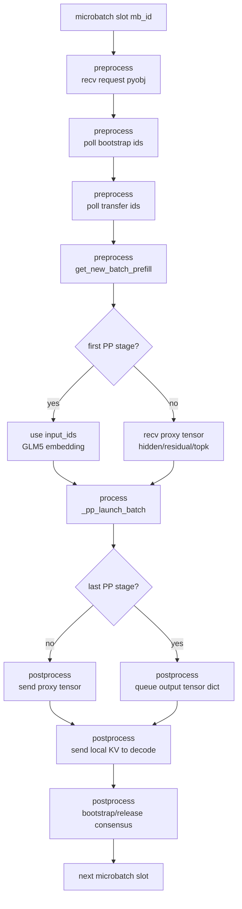

### 单个请求在 Prefill PP stage 内的一生

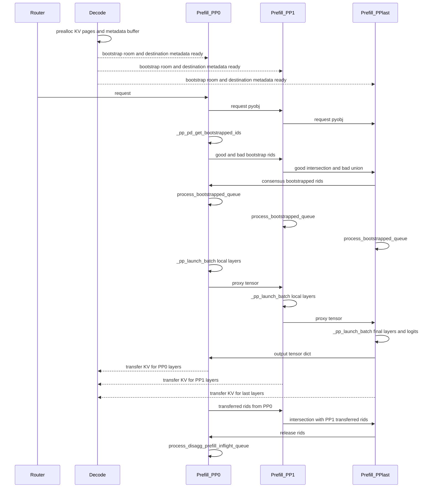

### 一个 microbatch slot 的生命周期

| 阶段 | 变量或队列 | 含义 |
| --- | --- | --- |
| preprocess | `recv_reqs` | PP0 从 tokenizer/RPC 收，后续 PP 从前一 stage 收 |
| preprocess | `bmbs[mb_id]`、`consensus_bootstrapped_rids` | 哪些请求的 decode 侧 prealloc/连接已经 ready |
| preprocess | `transferred_rids`、`tmbs[mb_id]` | 之前已经开始 transfer 的请求里，哪些在本 stage 已经完成 |
| preprocess | `self.mbs[mb_id]`、`pp_proxy_tensors` | 当前 stage 要跑的 batch，以及上一 stage 交来的中间激活 |
| process | `_pp_launch_batch()`、`result` | 当前 stage 跑自己那段 GLM5/DSA 层 |
| postprocess | `last_rank_comm_queue`、`_pp_prepare_tensor_dict()` | PPlast 产生 next token/logprob/spec payload 后传回 |
| postprocess | `send_bootstrapped_work`、`send_transfer_work`、`send_release_work` | 控制面 rid 列表沿 PP ring 流动，形成全 stage 共识 |
| postprocess | `release_rids` | 所有 PP stage 的 KV transfer 都完成后才能 release |

### 比喻

Prefill PP 像一条生产线。bootstrap 是仓库先贴好收货地址；process 是每个工位加工自己的零件；transfer 是每个工位把自己负责的零件发仓库；release 是所有工位都签了“已发货”后，整张工单才放行。

---

## 7. PD Decode 下的 PP 调度循环

### 人话版

Decode PP 主循环和 Prefill 很像，但它站在收货方视角：**我有没有给 prefill 准备好写入地址？我需要的 PP/TP/CP KV 都收齐了吗？收齐后能不能把请求放进 decode waiting queue？**

Decode 侧的核心状态有五个：

| 概念 | 小白解释 | Decode 侧具体动作 |
| --- | --- | --- |
| `retract` | 正在 prealloc 或等待 transfer 的请求如果因为显存压力要撤回，需要所有 PP stage 同步 | `_pp_pd_get_retract_ids()` 和 `process_retract_queue()` 把撤回请求恢复或清理 |
| `prealloc` | 先占好 decode 侧 KV cache 和 metadata 位置 | 分配 `req_to_token_pool`、KV page、`metadata_buffer_index`，然后把 page indices 通过 receiver 发给 prefill |
| `bootstrap` | decode 创建 receiver，并拿到 prefill 端各 rank 的连接信息 | `CommonKVReceiver.init()` 调 `_setup_bootstrap_infos()`，查询 prefill bootstrap server |
| `transfer` | prefill 正在把 KV/state/metadata 写入 decode 指定的位置 | `DecodeTransferQueue.pop_transferred()` 持续 poll receiver 状态 |
| `release` | 全部 PP stage 都确认 transfer 完成 | `process_decode_transfer_queue()` 把请求移入 `waiting_queue`，decode 可以真正开始 |

一句话串起来：**decode 先造好停车位，告诉 prefill 每辆车停哪里；prefill 停完所有 PP stage 的车后，decode 才放行这条请求去 decode。**

### 源码锚点

```python
# python/sglang/srt/managers/scheduler_pp_mixin.py
def event_loop_pp_disagg_decode(self):
    self.init_pp_loop_state()
    ...
    while True:
        for mb_id in range(self.pp_loop_size):
            recv_reqs = self.recv_requests()
            self.process_input_requests(recv_reqs)

            retract_rids = self._pp_pd_get_retract_ids(mb_id)
            prealloc_rids = self._pp_pd_get_prealloc_ids()
            transferred_rids = self._pp_pd_get_decode_transferred_ids()

            batch = self.get_next_disagg_decode_batch_to_run()
            ...
            self.process_retract_queue(next_consensus_retract_rids)
            self.process_prealloc_queue(next_consensus_prealloc_rids)
            self.process_decode_transfer_queue(next_release_rids)
```

Decode transfer 完成的共识函数：

```python
# python/sglang/srt/managers/scheduler_pp_mixin.py
def _pp_pd_get_decode_transferred_ids(self):
    if self.pp_group.is_first_rank:
        transferred_rids = self.get_rids(
            self.disagg_decode_transfer_queue.queue,
            False,
            [KVPoll.Success, KVPoll.Failed],
        )
    else:
        prev_transferred_rids = self._pp_recv_pyobj_from_prev_stage()
        curr_transferred_rids = self.get_rids(
            self.disagg_decode_transfer_queue.queue,
            False,
            [KVPoll.Success, KVPoll.Failed],
        )
        transferred_rids = list(
            set(prev_transferred_rids) & set(curr_transferred_rids)
        )
```

### `preprocess` 的完整时间线

#### 1. request 进入 decode prealloc queue

Decode 收到请求后，会创建 `DecodeRequest` 和 KV receiver。这里还没有真正分配完整 KV 位置，只是把请求放进 prealloc 队列，并尽量解析 prefill dp rank。

```python
# python/sglang/srt/disaggregation/decode.py
def add(self, req: Req, is_retracted: bool = False) -> None:
    if is_retracted:
        self.retracted_queue.append(req)
    else:
        decode_req = self._create_receiver_and_enqueue(req)
        prefill_dp_rank = self._resolve_prefill_dp_rank(req)
        if prefill_dp_rank is not None:
            decode_req.kv_receiver.init(prefill_dp_rank)
```

`kv_receiver.init()` 做的是 bootstrap 连接准备：

```python
# python/sglang/srt/disaggregation/common/conn.py
def init(self, prefill_dp_rank: int):
    self.target_tp_ranks = self.prefill_info.target_tp_ranks
    self.target_cp_ranks = self.prefill_info.target_cp_ranks
    self.target_pp_ranks = self.prefill_info.target_pp_ranks
    self.required_prefill_response_num = (
        self.prefill_info.required_prefill_response_num
    )
    self._setup_bootstrap_infos()
    self.kv_mgr.update_status(self.bootstrap_room, KVPoll.WaitingForInput)
```

`_setup_bootstrap_infos()` 会按 `target_cp_ranks`、`target_tp_ranks`、`target_pp_ranks` 去 prefill bootstrap server 查询每个目标 rank 的连接信息。这里拿到的是“向哪些 prefill rank 建 transfer 连接”的路由表。

#### 2. prealloc 为什么必须先发生

Prefill 不能随便把 KV 写到 decode，它必须知道 decode 侧具体写入位置。`pop_preallocated()` 会在 decode 侧做这些事情：

1. 检查还有没有 `req_to_token_pool`、KV pool、metadata buffer 空间。
2. 如果 decode radix cache 命中了前缀，计算 `prefix_len`，只为增量部分分配。
3. 调 `_pre_alloc()` 占好 KV page。
4. 把 page indices、state indices、metadata buffer index 发给 prefill。

```python
# python/sglang/srt/disaggregation/decode.py
dst_kv_indices = self._pre_alloc(decode_req.req, prefix_indices, prefix_len)
decode_req.metadata_buffer_index = (
    self.req_to_metadata_buffer_idx_allocator.alloc()
)
page_indices = kv_to_page_indices(kv_indices, page_size)
decode_req.kv_receiver.send_metadata(
    page_indices,
    decode_req.metadata_buffer_index,
    state_indices,
    decode_prefix_len=prefix_len,
)
```

这就是“prealloc”的真正含义：不是简单地说“我准备好了”，而是 decode 真的把 KV 页、请求 token 映射、metadata buffer 都占好了，并把这些地址发给 prefill。

#### 3. prealloc 也要做 PP 共识

Decode PP 中每个 stage 都要有自己的 KV 接收状态。PP0 先拿本地 good/bad prealloc rid，后续 PP stage 和自己的状态合并：

```python
# python/sglang/srt/managers/scheduler_pp_mixin.py
def _pp_pd_get_prealloc_ids(self):
    if self.pp_group.is_first_rank:
        good_prealloc_rids, bad_prealloc_rids = self.get_rids(
            self.disagg_decode_prealloc_queue.queue,
            False,
            [KVPoll.WaitingForInput],
            [KVPoll.Failed],
        )
    else:
        prev_good, prev_bad = self._pp_recv_pyobj_from_prev_stage()
        curr_good, curr_bad = self.get_rids(...)
        good_prealloc_rids = list(set(prev_good) & set(curr_good))
        bad_prealloc_rids = list(set(prev_bad) | set(curr_bad))
    return [good_prealloc_rids, bad_prealloc_rids]
```

共识结果绕回来后，`process_prealloc_queue()` 才会真正把成功请求推进 `disagg_decode_transfer_queue`：

```python
# python/sglang/srt/managers/scheduler_pp_mixin.py
def process_prealloc_queue(self, prealloc_rids):
    good_rids, bad_rids = prealloc_rids
    good_reqs, failed_reqs = self.disagg_decode_prealloc_queue.pop_preallocated(
        rids_to_check=good_rids + bad_rids,
    )
    self.disagg_decode_transfer_queue.extend(good_reqs)
```

所以 prealloc 的时间线是：

```text
request arrives
  -> create receiver
  -> receiver queries prefill bootstrap infos
  -> decode local receiver status becomes WaitingForInput
  -> PP stages reach prealloc consensus
  -> decode allocates pages and metadata buffer
  -> send_metadata tells prefill where to write
  -> prefill sender can leave Bootstrapping and be polled as ready
  -> request enters disagg_decode_transfer_queue
```

### `process` 的完整时间线

Decode 本身也有 PP forward，只是要等请求真正进入 `waiting_queue` 后才会被 `get_next_disagg_decode_batch_to_run()` 取出来。对已经可以跑的 decode batch，流程和 Prefill 类似：

```python
# python/sglang/srt/managers/scheduler_pp_mixin.py
batch = self.get_next_disagg_decode_batch_to_run()
if self.cur_batch and not self.cur_batch.forward_mode.is_prebuilt():
    pp_proxy_tensors = self._pp_recv_proxy_tensors()
result, self.launch_event = self._pp_launch_batch(...)
```

这里有个 decode 特有的小分支：如果 `forward_mode.is_prebuilt()`，说明 batch 可能已经预构建，不需要普通 proxy tensor 接收路径；源码会跳过 `_pp_recv_proxy_tensors()` 和部分结果后处理。

### `postprocess` 的完整时间线

#### 1. transfer 完成如何被发现

Decode transfer queue 会 poll 每个 request 的 receiver。只有 receiver 报 `KVPoll.Success`，才说明 prefill 已经把 KV/state/metadata 写到 decode 指定位置。

```python
# python/sglang/srt/disaggregation/decode.py
def pop_transferred(self, rids_to_check=None) -> List[Req]:
    polls = poll_and_all_reduce(
        [dr.kv_receiver for dr in self.queue],
        self.gloo_group,
    )
    ...
    if poll == KVPoll.Success:
        done = self._commit_transfer_to_req(decode_req)
```

`_commit_transfer_to_req()` 会从 metadata buffer 里读回 prefill 写入的结果，例如 output token、cached tokens、logprob/spec 信息，并校验 `bootstrap_room` 防止串房间：

```python
# python/sglang/srt/disaggregation/decode.py
(
    output_id,
    cached_tokens,
    output_token_logprobs_val,
    ...
    output_bootstrap_room,
) = self.metadata_buffers.get_buf(idx)
actual_room = output_bootstrap_room[0].item()
expected_room = decode_req.req.bootstrap_room
```

#### 2. release 后请求如何开始 decode

release rids 绕回后，`process_decode_transfer_queue()` 会把这些 rid 对应的请求从 transfer queue 取出，放入 `waiting_queue`：

```python
# python/sglang/srt/managers/scheduler_pp_mixin.py
def process_decode_transfer_queue(self, release_rids):
    released_reqs = self.disagg_decode_transfer_queue.pop_transferred(release_rids)
    self.waiting_queue.extend(released_reqs)
```

到这里，请求才真正完成了“从 prefill 集群迁移上下文到 decode 集群”的动作。下一轮 decode scheduler 取 batch 时，它才有资格参加 decode forward。

### Decode 流程图

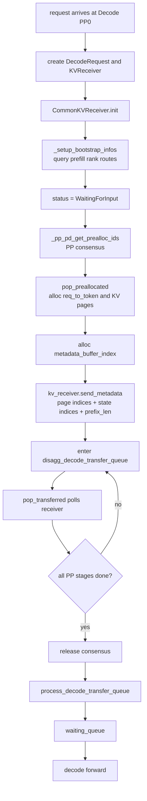

### Decode 侧 bootstrap / prealloc / transfer 时序图

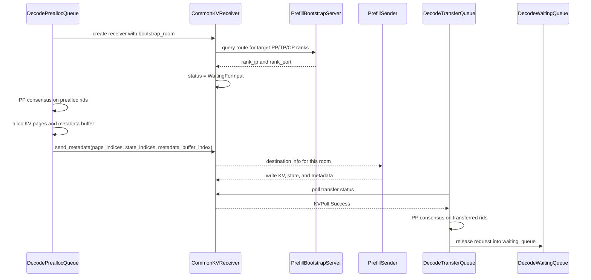

### 例子

如果 Decode `pp_size=4`，一次请求需要 PP0、PP1、PP2、PP3 对应层的 KV 都到齐。只要 PP2 还没收到，它就不能进入 decode waiting queue。否则后续跑到 PP2 时会发现自己没有那几层的 KV。

---

## 8. 控制流共识机制

### 人话版

PP 下最容易卡住的就是“每个 stage 看到的请求状态不一样”。源码用一个简单的规则解决：

- 成功类状态取交集：只有每个 PP stage 都说 ready，才算 ready。
- 失败类状态取并集：只要任意 PP stage 说失败，就整体失败。

可以理解成每个 PP stage 都要签字。通过要全员签字，拒绝只要一票否决。

### 源码锚点

Prefill bootstrap：

```python
# python/sglang/srt/managers/scheduler_pp_mixin.py
def _pp_pd_get_bootstrapped_ids(self):
    if self.pp_group.is_first_rank:
        good_bootstrapped_rids, bad_bootstrapped_rids = self.get_rids(...)
    else:
        prev_good, prev_bad = self._pp_recv_pyobj_from_prev_stage()
        curr_good, curr_bad = self.get_rids(...)
        good_bootstrapped_rids = list(set(prev_good) & set(curr_good))
        bad_bootstrapped_rids = list(set(prev_bad) | set(curr_bad))
    return [good_bootstrapped_rids, bad_bootstrapped_rids]
```

Decode prealloc：

```python
# python/sglang/srt/managers/scheduler_pp_mixin.py
def _pp_pd_get_prealloc_ids(self):
    if self.pp_group.is_first_rank:
        good_prealloc_rids, bad_prealloc_rids = self.get_rids(...)
    else:
        prev_good, prev_bad = self._pp_recv_pyobj_from_prev_stage()
        curr_good, curr_bad = self.get_rids(...)
        good_prealloc_rids = list(set(prev_good) & set(curr_good))
        bad_prealloc_rids = list(set(prev_bad) | set(curr_bad))
```

Decode transfer：

```python
transferred_rids = list(
    set(prev_transferred_rids) & set(curr_transferred_rids)
)
```

### 共识图

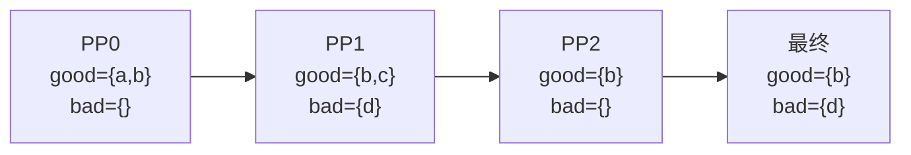

### 例子

假设请求 `rid=a` 的 KV 在 PP0 到了，但 PP1 还没到。PP0 会说 `a` good，PP1 不会说 `a` good。交集之后 `a` 不会 release。这样 decode 不会提前跑到缺 KV 的 stage。

---

## 9. KV 传输和 PP rank mapping

### 人话版

PD 分离真正的数据搬运是 KV cache。Prefill 每个 PP stage 只拥有自己那段层的 KV，因此 Decode 该找哪个 Prefill PP stage，必须由源码做 rank mapping。

源码允许两种 PP 拓扑：

| Prefill pp_size | Decode pp_size | 行为 |
| --- | --- | --- |
| N | N | Decode PPi 只连 Prefill PPi |
| N | 1 | Decode 单 stage 汇总所有 Prefill PP stages |
| N | 其他 | assert 失败 |

### 源码锚点

`CommonKVManager._resolve_rank_mapping()` 里的 PP 约束：

```python
# python/sglang/srt/disaggregation/common/conn.py
# PP rank mapping - decode pp size should be equal to prefill pp size or 1
assert self.pp_size == info.pp_size or self.pp_size == 1, (
    f"Decode pp size ({self.pp_size}) should be equal to prefill pp size ({info.pp_size}) or 1",
)
if info.pp_size == self.pp_size:
    target_pp_ranks = [self.pp_rank]
else:
    target_pp_ranks = list(range(info.pp_size))
    required_prefill_response_num *= info.pp_size // self.pp_size
```

Decode 会把映射结果记到 receiver 上：

```python
# python/sglang/srt/disaggregation/common/conn.py
self.target_tp_ranks = self.prefill_info.target_tp_ranks
self.target_cp_ranks = self.prefill_info.target_cp_ranks
self.target_pp_ranks = self.prefill_info.target_pp_ranks
self.required_prefill_response_num = (
    self.prefill_info.required_prefill_response_num
)

self.kv_mgr.required_prefill_response_num_table[self.bootstrap_room] = (
    self.required_prefill_response_num
)
```

bootstrap server 以 DP/CP/TP/PP 四维注册 prefill rank：

```python
# python/sglang/srt/disaggregation/common/conn.py
class CommonKVBootstrapServer(BaseKVBootstrapServer):
    ...
    self.prefill_port_table: Dict[
        int, Dict[int, Dict[int, Dict[int, PrefillRankInfo]]]
    ] = {}

def _is_ready(self) -> bool:
    expected = self.dp_size * self.attn_cp_size * self.attn_tp_size * self.pp_size
    return self._registered_count >= expected
```

KV 指针会按 PP 拥有的层切：

```python
# python/sglang/srt/disaggregation/common/conn.py
def get_mla_kv_ptrs_with_pp(...):
    ...

def get_non_mla_kv_ptrs_with_pp(...):
    ...
```

对普通 K/V cache，是按 `prefill_start_layer/end_layer` 切 K/V 指针；对 MLA/DeepSeek V4，源码会进入 MLA 相关切片逻辑，compressed MLA 还要按 section/compression ratio 找真实指针范围。

### 合法拓扑 1：Prefill PP=N，Decode PP=N

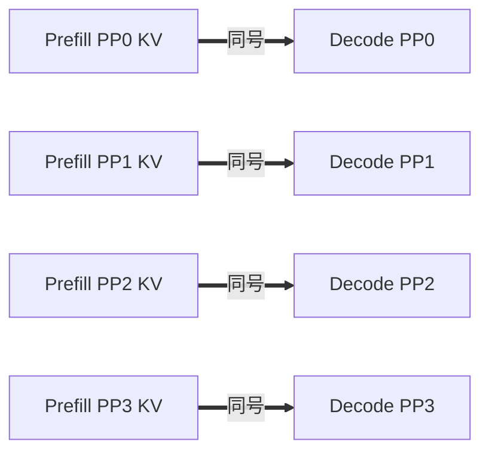

### 合法拓扑 2：Prefill PP=N，Decode PP=1

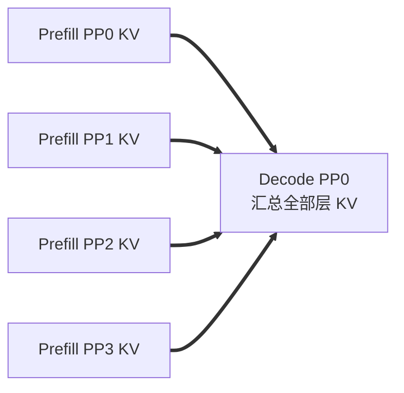

### 比喻

Prefill PP0 只生产第 0 段层的 KV，PP1 只生产第 1 段层的 KV。Decode 如果也有 4 个 PP stage，就每个 stage 找同号工厂拿货。如果 Decode 只有 1 个 stage，那它要把四个工厂的货全收齐。

---

## 10. KV 后端速查：Mooncake / NIXL / Ascend

### 人话版

PP 负责回答“哪个 PP stage 拥有哪些层的 KV”，KV 后端负责回答“这些 KV 怎么搬到 decode”。这一章只做速查，复杂叠加行为放到第 11 章展开。

| 后端 | PP 下最重要的事 | 本文怎么用它 |
| --- | --- | --- |
| Mooncake | target KV、draft KV、GLM5 NSA FP8 wire 都在这里真正发包 | 第 11 章展开 GLM5 NSA/DSA 和 MTP 时会引用它 |
| NIXL | 按 `pp_rank` 追踪每个 chunk/state 是否到齐 | 排障时用它判断“哪个 PP stage 没到” |
| Ascend | 有 PP 分支，按 PP 切层后的 KV 指针走后端传输 | 只做支持边界说明，不作为主线 |

### 源码锚点

Mooncake 的 `_send_kv_cache()` 会区分 target/draft，并根据当前 PP stage 的 `prefill_start_layer` 发送本 stage 拥有的层：

```python
# python/sglang/srt/disaggregation/mooncake/conn.py
prefill_start_layer = (
    self.kv_args.prefill_start_layer
    if is_target
    else getattr(self.kv_args, "draft_prefill_start_layer", 0)
)
```

NIXL 的状态对象直接按 PP rank 记账：

```python
# python/sglang/srt/disaggregation/nixl/conn.py
class TransferStatus:
    received_kvs_per_pp: Dict[int, Set[int]]
    expected_kvs_per_pp: Dict[int, int]
    num_pp_ranks_expected: Optional[int]
    received_state_per_pp: Set[int]
```

Ascend 分支里也识别 PP：

```python
# python/sglang/srt/disaggregation/ascend/conn.py
if self.pp_size > 1:
    if self.is_mla_backend:
        src_kv_ptrs, sliced_dst_kv_ptrs, layers_current_pp_stage = (
            self.get_mla_kv_ptrs_with_pp(...)
        )
```

### 后端关系图

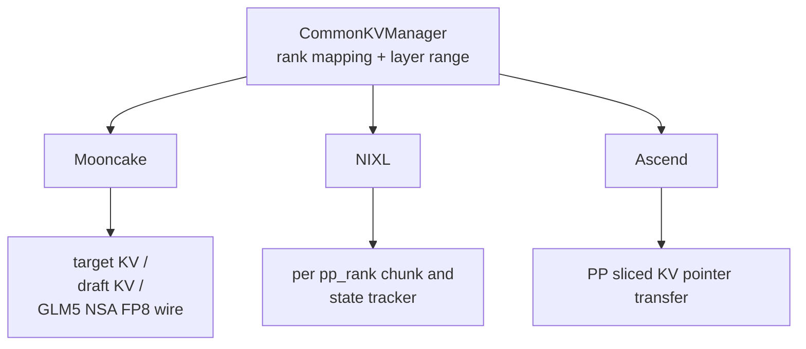

---

## 11. 叠加 MTP、GLM5 NSA/DSA、CP 时发生什么

### 11.1 GLM5 DSA/NSA 如何改变 PP proxy

#### 人话版

普通模型跨 PP stage 只传 `hidden_states/residual`。GLM5 DSA/NSA 多一件事：某些 sparse attention 层需要复用 `topk_indices`。如果一个需要复用 topk 的层刚好落在下一个 PP stage，那么上一个 PP stage 必须把 `topk_indices` 一起塞进 `PPProxyTensors`。

所以 GLM5 下的 proxy tensor 更像“隐藏状态 + 残差 + 稀疏索引通行证”。少了隐藏状态，下一 stage 没法继续算；少了 `topk_indices`，NSA 层可能不知道该看哪些稀疏位置。

#### 源码锚点

启动参数会把 `GlmMoeDsaForCausalLM` 放进 DSA/NSA 分支。注释也明确把它归到 GLM5：

```python
# python/sglang/srt/server_args.py
if model_arch in [
    "DeepseekV3ForCausalLM",
    "DeepseekV32ForCausalLM",
    # ... other DSA-capable architectures ...
    "GlmMoeDsaForCausalLM",
]:
    if is_deepseek_nsa(hf_config):  # DeepSeek 3.2/GLM 5
        if model_arch == "GlmMoeDsaForCausalLM" and is_blackwell_supported():
            envs.SGLANG_NSA_PREFILL_DENSE_ATTN_KV_LEN_THRESHOLD.set(0)
        if self.is_attention_backend_not_set():
            self.attention_backend = "nsa"
```

GLM5 的模型入口继承 `DeepseekV2ForCausalLM`，所以 PP forward 使用 `DeepseekV2Model`：

```python
# python/sglang/srt/models/glm4_moe.py
class GlmMoeDsaForCausalLM(DeepseekV2ForCausalLM):
    def determine_num_fused_shared_experts(self):
        super().determine_num_fused_shared_experts("GlmMoeDsaForCausalLM")
```

`DeepseekV2Model.forward()` 在非 first PP rank 接收 `topk_indices`，在非 last PP rank 需要时继续传下去：

```python
# python/sglang/srt/models/deepseek_v2.py
hidden_states = pp_proxy_tensors["hidden_states"]
residual = pp_proxy_tensors["residual"]
topk_indices = pp_proxy_tensors.tensors.get("topk_indices")

...

if not self.pp_group.is_last_rank:
    proxy_tensors = {
        "hidden_states": hidden_states,
        "residual": residual,
    }
    if self.use_nsa and nsa_layer_skips_topk(...):
        proxy_tensors["topk_indices"] = topk_indices
    return PPProxyTensors(proxy_tensors)
```

#### indexer/topk 数据方向：只有前传，没有下一层回传

这里最容易混淆的是两个名字都带 `topk` 的对象：

| 名字 | 属于哪条线 | 含义 | 方向 |
| --- | --- | --- | --- |
| `topk_indices` | GLM5 NSA/DSA 模型 forward | indexer 选出的 sparse attention 索引，告诉后续 NSA 层看哪些稀疏位置 | 层 N 到层 N+1；跨 PP 时从上一 PP stage 到下一 PP stage |
| `topk_p/topk_index` | MTP/EAGLE speculative | draft/spec 用的候选 token 概率和 token id | PPlast 回到 PP0 做后处理，再随 P->D metadata 到 Decode |

GLM5 NSA/DSA 的 `topk_indices` 不是 draft token，也不是 Decode 回传给 Prefill 的信息。它是在 target 模型 forward 过程中由当前层的 indexer 算出来，或者由 `skip_topk` 层复用上一层已经算好的索引。

```python
# python/sglang/srt/models/deepseek_common/attention_forward_methods/forward_mla.py
if not self.skip_topk or (self.is_nextn and prev_topk_indices is None):
    topk_indices = self.indexer(
        x=hidden_states,
        q_lora=q_lora,
        positions=positions,
        forward_batch=forward_batch,
        layer_id=self.layer_id,
    )
else:
    topk_indices = maybe_capture_indexer_topk(
        self.layer_id, prev_topk_indices
    )
```

回到 `DeepseekV2Model.forward()`，每层 forward 的返回值会把 `topk_indices` 交给下一层的 `prev_topk_indices`。如果 PP 切层刚好把“产生 topk 的层”和“复用 topk 的层”切到两个 stage，上一 stage 就把它放进 `PPProxyTensors`，下一 stage 在 preprocess/forward 开始时取出来。

```python
# python/sglang/srt/models/deepseek_v2.py
hidden_states, residual, topk_indices = layer(
    positions,
    hidden_states,
    forward_batch,
    residual,
    zero_allocator,
    gemm_output_zero_allocator,
    llama_4_scaling,
    prev_topk_indices=topk_indices,
)
```

所以它不是“下一层算完再回传给上一层，上一层等这个结果继续算”。真实执行顺序更像接力赛：上一层或上一 PP stage 把索引棒交出去，下一层拿着继续跑。上一层 forward 已经结束，不再等待下一层回传。

`indexer_topk_output` 是另一件事：它是 state capturer 在 forward 结束后把 indexer topk 捕获出来，供返回/诊断/后处理使用，不改变 PP stage 间的计算依赖方向。

```python
# python/sglang/srt/state_capturer/indexer_topk.py
def maybe_capture_indexer_topk(layer_id: int, topk_indices: Optional[torch.Tensor]):
    if topk_indices is None:
        return None
    if (cap := get_global_indexer_capturer()) is not None:
        cap.capture(layer_id=layer_id, topk_indices=topk_indices)
    return topk_indices
```

#### 图

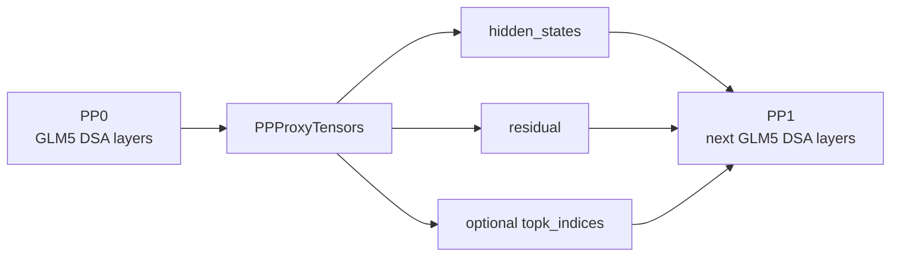

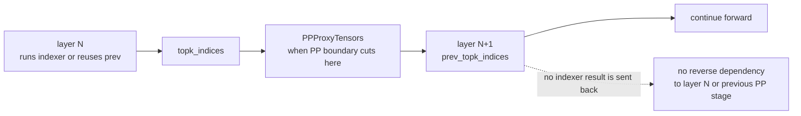

#### 小例子

假设第 15 层算出了 NSA sparse topk，第 16 层会复用这个 topk，而 `pp_size=2` 时 PP0 负责 0-15 层、PP1 负责 16-31 层。那 PP0 不能只传 `hidden_states/residual`，还要把 `topk_indices` 放进 proxy，否则 PP1 的第 16 层会缺少“该看哪些稀疏位置”的索引。

### 11.2 MTP / speculative 和 GLM5 PP

#### 人话版

PP+MTP/spec 在源码里有两个关键限制：

- 启动限制：PP+spec 只支持 PD prefill，算法只放开 EAGLE/EAGLE3/NEXTN。
- 运行限制：在 prefill PP+MTP 下，非 last PP rank 不初始化 draft worker；只有 last PP rank 拥有完整 target hidden states，适合产生 draft/spec 所需输出。

对 GLM5 来说，可以把它理解成：前面的 PP stage 只是在 target 模型里“加工半成品”，不能单独做 draft 判断；最后一个 PP stage 拿到完整隐藏状态后，才有资格把 `next_token_ids`、spec topk、spec hidden states 打包回前面 stage。

#### 源码锚点

`scheduler.py::maybe_init_draft_worker()` 会跳过非 last PP rank：

```python
# python/sglang/srt/managers/scheduler.py
skip_prefill_pp_mtp_draft = (
    self.server_args.disaggregation_mode == "prefill"
    and self.server_args.pp_size > 1
    and model_has_mtp_layers
    and not get_pp_group().is_last_rank
)
if skip_prefill_pp_mtp_draft:
    self.draft_worker = None
    return
```

GLM5 继承的 `DeepseekV2ForCausalLM` 支持 EAGLE3 捕获辅助 hidden states，而且只在 last PP rank 生效：

```python
# python/sglang/srt/models/deepseek_v2.py
def set_eagle3_layers_to_capture(self, layer_ids=None):
    if not self.pp_group.is_last_rank:
        return

    self.capture_aux_hidden_states = True
    self.model.layers_to_capture = [val + 1 for val in layer_ids]
```

last PP stage 的 spec 输出会被塞进 PP output tensor dict：

```python
# python/sglang/srt/managers/scheduler_pp_mixin.py
tensor_dict.update(
    {
        "spec_topk_p": topk_p,
        "spec_topk_index": topk_index,
        "spec_hidden_states": hidden_states,
    }
)
```

前面的 stage 收到 output 后重建 `EagleDraftInput`，让 scheduler 后处理能继续走 spec 路径：

```python
# python/sglang/srt/managers/scheduler_pp_mixin.py
batch.spec_info = EagleDraftInput(
    topk_p=output_tensors["spec_topk_p"],
    topk_index=output_tensors["spec_topk_index"],
    hidden_states=output_tensors["spec_hidden_states"],
    bonus_tokens=output_tensors["next_token_ids"],
)
```

KV 侧也有同样的“last PP rank 才发 draft KV”规则：

```python
# python/sglang/srt/disaggregation/prefill.py
def _should_send_draft_kv(self) -> bool:
    if self.draft_token_to_kv_pool is None:
        return False
    if self.pp_size <= 1:
        return True
    return self.pp_rank == self.pp_size - 1
```

#### 为什么在 Prefill 阶段做 MTP？

简单说：Prefill 本来就要把长 prompt 跑完一次 target model。到了 last PP rank，完整 hidden states、logits、`next_token_ids` 都已经在手边了，这时顺手生成 MTP/spec 需要的 `topk_p/topk_index/hidden_states`，再随 P->D metadata 一起交给 Decode，Decode 收齐 KV 后就能马上组装 `EagleDraftInput` 继续 speculative decode。

如果不在 Prefill 做这件事，Decode 接手后还要额外等待或重复准备 draft seed。源码里的路径正是这样串起来的：`maybe_init_draft_worker()` 只让合适的 PP rank 初始化 draft worker，`_pp_prepare_tensor_dict()` 把 last PP rank 的 spec payload 放进 PP output，`process_batch_result_disagg_prefill()` 把 payload 写到 `Req`，最后 Decode 在 `decode_schedule_batch_mixin.py` 里把这些字段组装成 `EagleDraftInput`。

#### MTP 是否涉及 Decode 向 Prefill 回传？

涉及一条 **Decode -> Prefill 的控制/metadata 通道**，但它传的不是 draft 计算结果。把 MTP 叠加 PP/PD 后的数据方向拆开看会清楚很多：

| 方向 | 数据 | 目的 | 是否是 draft 结果回传 |
| --- | --- | --- | --- |
| Decode -> Prefill | KV page indices、state indices、`metadata_buffer_index`、`decode_prefix_len` | 告诉 Prefill：KV/state/spec metadata 应该写到 Decode 的哪里 | 否 |
| PPlast -> PP0 | `next_token_ids`、`spec_topk_p`、`spec_topk_index`、`spec_hidden_states` | 让 Prefill PP0 统一执行 batch result 后处理、写 P->D metadata | 是 PP 内部 output 回流，不是 D->P |
| Prefill -> Decode | target KV、可选 draft KV、state pages、aux metadata | 把 prefill 产物交给 decode 继续生成 | 否，是 P->D transfer |
| Decode 本地 | `EagleDraftInput` | Decode 收齐 metadata 后本地准备 speculative decode | 不回 Prefill |

Decode 侧的 prealloc 会先给请求分配接收位置，再通过 `send_metadata()` 把“目的地址”发给 Prefill。这里的 `metadata_buffer_index` 可以理解成 Decode 留给 Prefill 写回结果的一张回执格子。

```python
# python/sglang/srt/disaggregation/decode.py
decode_req.metadata_buffer_index = (
    self.req_to_metadata_buffer_idx_allocator.alloc()
)
page_indices = kv_to_page_indices(kv_indices, page_size)
decode_req.kv_receiver.send_metadata(
    page_indices,
    decode_req.metadata_buffer_index,
    state_indices,
    decode_prefix_len=prefix_len,
)
```

PPlast 算完完整 target hidden 后，会把 speculative payload 放进 PP output tensor dict。这个 output 是 PP 内部从 last stage 回到前面 stage 的结果回流，由 `_pp_send_output_to_next_stage()` 沿 PP group 发送 `msg_type="output"`，目的是让非 last stage 也能得到同一个 batch 的最终输出并进入统一后处理。

```python
# python/sglang/srt/managers/scheduler_pp_mixin.py
tensor_dict.update(
    {
        "spec_topk_p": topk_p,
        "spec_topk_index": topk_index,
        "spec_hidden_states": hidden_states,
    }
)
```

Prefill 后处理会把这些 spec 字段挂到 `Req`，然后和 KV transfer 的最后一段一起写到 Decode 预留的 metadata buffer。

```python
# python/sglang/srt/disaggregation/prefill.py
req.output_topk_p = batch.spec_info.topk_p[i]
req.output_topk_index = batch.spec_info.topk_index[i]
req.hidden_states_tensor = batch.spec_info.hidden_states[i].cpu().clone()
self.send_kv_chunk(req, last_chunk=True)
```

Decode 收到后，不会把 draft 结果再发回 Prefill，而是在 Decode 本地把 `Req` 里的 `output_topk_p/output_topk_index/hidden_states_tensor` 组装成下一步要用的 `EagleDraftInput`。

```python
# python/sglang/srt/disaggregation/decode_schedule_batch_mixin.py
spec_info = EagleDraftInput(
    topk_p=topk_p,
    topk_index=topk_index,
    hidden_states=hidden_states,
    bonus_tokens=self.output_ids,
    new_seq_lens=self.seq_lens,
)
```

#### 图

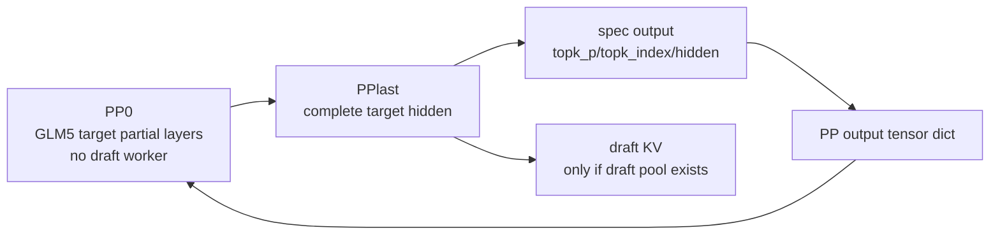

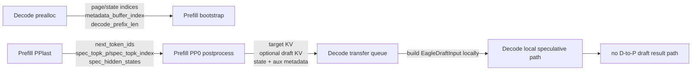

#### 小例子

如果 `pp_size=2`，PP0 只算 GLM5 的前半段 DSA 层。此时 PP0 手里的 hidden states 还不是完整模型输出，它不能独立判断 draft token。PP1 跑完后半段、norm 和 logits 后，才把 spec 信息随 `output` 类型 tensor dict 送回 PP0，PP0 再统一执行 batch result 后处理。

### 11.3 GLM5 NSA FP8 wire：main MLA pages 和 state pages

#### 人话版

GLM5 DSA/NSA 的 KV 传输不只是“复制一块 KV cache”。在异构 PD 场景下，prefill 侧可能是 C500/MACA 这类后端，decode 侧可能期待 TRTLLM/FP8 格式。Mooncake 传输前要先把 GLM5 NSA 的数据打包成 decode 侧能读的 wire format。

这里有两类东西：

- main MLA pages：attention 主 KV 内容，按 page 和层传。
- NSA state pages：NSA indexer/state 内容，告诉 decode sparse index 相关状态。

小白可以把它想成搬家：main MLA pages 是书本本身，NSA state pages 是书架目录。书搬过去了但目录没搬，decode 仍然可能不知道怎么快速查。

#### 源码锚点

Mooncake manager 根据环境变量开启 GLM NSA FP8 wire pack：

```python
# python/sglang/srt/disaggregation/mooncake/conn.py
self.enable_glm_nsa_fp8_wire_pack = (
    envs.SGLANG_DISAGG_GLM_NSA_FP8_WIRE_PACK.get()
)
if self.enable_glm_nsa_fp8_wire_pack:
    self._normalize_glm_nsa_fp8_state_args()
```

wire format 的页面尺寸和 item length 在公共 helper 中定义：

```python
# python/sglang/srt/disaggregation/common/glm_nsa_fp8_wire.py
PAGE_SIZE = 64
MLA_NOPE_DIM = 512
MLA_ROPE_DIM = 64
NSA_INDEX_DIM = 128
MAIN_MLA_TRTLLM_TARGET_ITEM_LEN = PAGE_SIZE * MAIN_MLA_TRTLLM_TARGET_TOKEN_BYTES
NSA_INDEX_TARGET_ITEM_LEN = PAGE_SIZE * (NSA_INDEX_DIM + NSA_INDEX_SCALE_BYTES)
```

发送 main MLA pages 时，Mooncake 会按当前 PP stage 的 layer range 取源层、目标层，再打包：

```python
# python/sglang/srt/disaggregation/mooncake/conn.py
_, dst_layer_ptrs, layers_current_pp_stage = self.get_mla_kv_ptrs_with_pp(
    src_kv_ptrs,
    dst_kv_ptrs,
    start_layer=prefill_start_layer,
)
active_layer_ids = [
    layer_id
    for layer_id in range(layers_current_pp_stage)
    if int(src_item_lens[layer_id]) > 0
]
```

真正发送时，GLM5 NSA FP8 分支优先走 `send_glm_nsa_fp8_main_packed()`：

```python
# python/sglang/srt/disaggregation/mooncake/conn.py
if self.enable_glm_nsa_fp8_wire_pack and is_mla_backend and state_type == "nsa":
    ret = self.send_glm_nsa_fp8_main_packed(
        req.mooncake_session_id,
        prefill_indices,
        dst_data_ptrs,
        chunked_dst_kv_indice,
        dst_kv_item_len,
        prefill_start_layer,
        room=req.room,
    )
    return ret, False
```

NSA state 也有独立的 packed 发送路径：

```python
# python/sglang/srt/disaggregation/mooncake/conn.py
if self.enable_glm_nsa_fp8_wire_pack and state_type == "nsa":
    ret = self.send_glm_nsa_fp8_state_packed(
        req,
        src_state_indices,
        dst_state_data_ptrs,
        dst_state_item_lens,
        dst_state_indices,
        prefill_start_layer=prefill_start_layer,
    )
```

#### 图

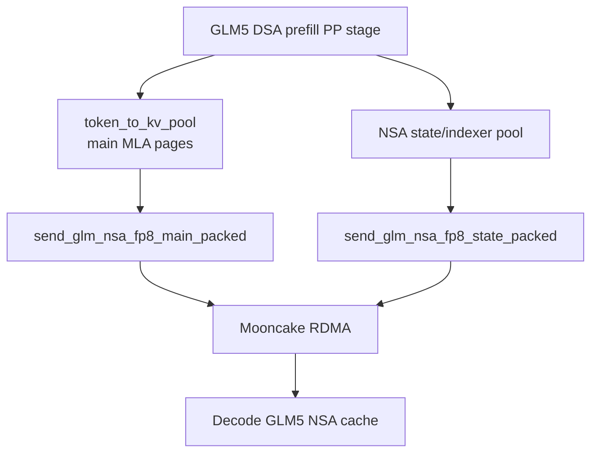

#### 小例子

如果 PP0 负责第 0-31 层，PP1 负责第 32-63 层，那么 PP0 的 `prefill_start_layer=0`，PP1 的 `prefill_start_layer=32`。GLM5 NSA FP8 wire pack 会用这个 start layer 去对齐“源层号”和“decode 侧目标层号”。一旦 layer range 或 item length 对不上，源码会抛出类似 `GLM NSA FP8 wire main target layer mismatch` 的错误。

### 11.4 CP / layer split 如何改变 KV 连接

#### 人话版

CP 是 Context Parallel，把长上下文相关的 attention/cache 工作再切给多个 attention CP rank。普通情况下，为了省连接，可以只让 prefill CP rank 0 参与 transfer；但 GLM5 NSA/DSA 的 `enable_nsa_cache_layer_split` 打开后，每个 CP rank 可能只保留一部分 layer/state shard，decode 必须连接所有相关 CP rank。否则 decode 看到的 KV 就像一本书缺了几章。

把 PP/TP/CP 放在一起看：

- **PP** 切模型层。PP0 负责前半层，PP1 负责后半层；跨 PP stage 传的是 proxy tensor。
- **TP** 切同一层里的张量/头。同一个 PP stage 内的 TP ranks 会做 TP collective。
- **CP** 在长上下文/NSA state 场景下继续切 cache/state。layer split 打开后，每个 CP rank 持有不同 layer/state 子集。

因此，PP/TP/CP 的协调不是一个平面通信，而是三件事同时发生：同 stage 内 TP collective、跨 stage proxy tensor、P/D 之间按 PP/CP shard 等待 KV transfer。

#### 源码锚点

Prefill KV manager 初始化时，如果打开 `enable_nsa_cache_layer_split`，会把 layer shard 写进 `token_to_kv_pool`：

```python
# python/sglang/srt/disaggregation/prefill.py
if getattr(self.scheduler.server_args, "enable_nsa_cache_layer_split", False):
    layer_shard_size = get_attention_cp_size()
    layer_shard_rank = get_attention_cp_rank()
    layer_shard_enabled = layer_shard_size > 1
    self.token_to_kv_pool.layer_shard_enabled = layer_shard_enabled
    self.token_to_kv_pool.layer_shard_rank = layer_shard_rank
    self.token_to_kv_pool.layer_shard_size = layer_shard_size
```

同一个初始化过程会保留 PP stage 的层范围，并对不属于本 CP rank 的层填零长度洞：

```python
# python/sglang/srt/disaggregation/prefill.py
kv_args.prefill_start_layer = self.token_to_kv_pool.start_layer
kv_args.prefill_end_layer = getattr(self.token_to_kv_pool, "end_layer", None)

layer_split_keep_mask = make_layer_split_mask(
    local_layer_num,
    layer_shard_rank,
    layer_shard_size,
    start_layer=kv_args.prefill_start_layer,
)
kv_data_ptrs, kv_data_lens, kv_item_lens = apply_layer_split_holes(
    kv_data_ptrs,
    kv_data_lens,
    kv_item_lens,
    layer_split_keep_mask,
)
```

这个 keep mask 的含义是：本 CP rank 拥有的 layer/state 保留真实长度，不拥有的 layer/state 仍保留位置，但长度填成 0。这样 wire protocol 仍然是按 PP stage 的连续 layer 范围描述，不会因为 CP 切层导致 decode 侧找不到 layer 编号。

`CommonKVManager` 会把 layer split 记下来。打开后，prefill 端不会把非 0 CP rank 当 dummy：

```python
# python/sglang/srt/disaggregation/common/conn.py
self.layer_split = bool(
    getattr(server_args, "enable_nsa_cache_layer_split", False)
)
self.is_dummy_cp_rank = (
    not self.enable_all_cp_ranks_for_transfer
    and not self.layer_split
    and self.attn_cp_size > 1
    and self.attn_cp_rank != 0
)
```

Decode 侧连接 prefill ranks 时，如果 layer split 打开，就不能只连一个 CP rank，而要增加 expected response 数量。这里的 `required_prefill_response_num` 是 decode 判定“这个 room 的 KV 是否全部到齐”的关键计数：

```python
# python/sglang/srt/disaggregation/common/conn.py
if not self.enable_all_cp_ranks_for_transfer and not getattr(info, "layer_split", False):
    target_cp_ranks = target_cp_ranks[:1]
else:
    required_prefill_response_num *= info.attn_cp_size // self.attn_cp_size
```

#### PP / TP / CP 协调图

下面固定一个例子：`pp_size=2`、`tp_size=2`、prefill `attn_cp_size=2`、decode `attn_cp_size=1`。

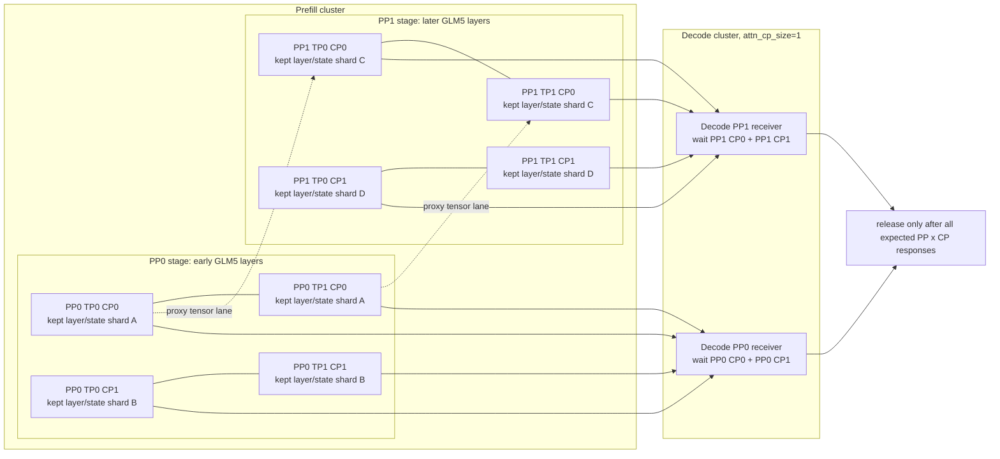

图里有三种线：

| 线 | 代表什么 | 它为什么存在 |
| --- | --- | --- |
| PP stage 内的实线横连 | 同一个 PP stage、同一个 CP shard 下的 TP collective | TP ranks 共同完成同一层的张量并行计算 |
| PP0 到 PP1 的虚线 | proxy tensor lane | PP0 把 `hidden_states/residual/topk_indices` 交给 PP1 继续跑后半层 |
| Prefill 到 Decode 的实线 | KV/state transfer | 每个 PP/CP shard 把自己拥有的 KV/state 写到 decode 预分配位置 |

#### 这个特性如何节省显存

不开 layer split 时，一个 prefill CP rank 往往要持有本 PP stage 的完整 local layer KV/state 视图；为了 transfer 简化，非 CP0 还可能被当成 dummy，不参与真实发送。这样连接少，但每张卡承受的 GLM5 NSA/DSA cache/state 压力更集中。

打开 `enable_nsa_cache_layer_split` 后，源码做了两件事：

1. `make_layer_split_mask(local_layer_num, layer_shard_rank, layer_shard_size, start_layer=...)` 决定当前 CP rank 保留哪些 layer/state。
2. `apply_layer_split_holes(...)` 把不属于当前 CP rank 的条目变成 0 长度洞。

效果是：每个 CP rank 只为自己拥有的 layer/state shard 保留真实 KV/state 存储和发送负担。对 GLM5 NSA/DSA 这种 state/KV 结构更复杂的模型，单卡上同时压着的 layer/state 数量下降，所以 **per-GPU 显存压力会下降**。

但这个节省不是免费午餐：

- 集群整体要表达的上下文信息没有凭空消失，只是分散到了多个 CP rank。
- Decode 侧不能只等 CP0，需要等待 PP x CP 的完整响应集合。
- `required_prefill_response_num` 会变大，P/D transfer 的连接、状态追踪和超时排障会更复杂。

#### 小例子

`pp_size=2`、prefill `attn_cp_size=2`、decode `attn_cp_size=1`、layer split 打开时，一个请求至少要等 PP0-CP0、PP0-CP1、PP1-CP0、PP1-CP1 四类 layer/state shard 的响应。少一路，decode 都不能说“KV 已经齐了”。换来的收益是每个 prefill CP rank 不再背完整层范围的 KV/state 压力，而是只背自己那一份。

### 11.5 HiCache：前缀恢复与 PP 协调的独立补充

**本节使用 2026-09-16 读取的官方快照 `72d5c5bb73`，不是上述历史内部分支的同名功能追溯。** 基线与实际源码目录见本文开头，详细锚点见以下两篇专题。

#### 人话版

每个 PP stage 执行自己那部分模型层，HiCache 可以为该 stage 恢复可复用的 KV。它影响“本轮前缀是否可用、什么时候能够读取”，但不会把 Host 回载事件变成 P/D sender 的传输完成状态，也不会替代 proxy tensor。

#### 机制拆解与源码锚点

| 步骤 | 官方固定源码入口 | 生命周期含义 |
| --- | --- | --- |
| 请求匹配 | `Req.init_next_round_input` → `UnifiedTreeCore.match_prefix` | 分开返回设备索引与可恢复 Host 边界 |
| 候选准入 | `PrefillAdder.add_one_req` → `UnifiedRadixCache.init_load_back` | 先检查预算，回载后用实际索引重算输入 |
| 发起 H2D | `UnifiedRadixCache.ready_to_load_host_cache` → `HiCacheController.start_loading` | batch 关联对应 consumer index |
| 本层可读 | `LayerDoneCounter.wait_until` | 当前层读取等待对应复制事件 |
| 有序收尾 | `UnifiedRadixCache._all_reduce/_pp_sync`、`loading_check` | 首 stage 传播消费决策，本地完成后解除传输保护 |

```mermaid
flowchart TD
    M["本 stage 的前缀匹配"] --> A["预算通过，准备 Host→设备回载"]
    A --> E["batch consumer 与逐层可读事件"]
    E --> F["本 stage forward"]
    F --> P["proxy tensor 进入下一 stage"]
    F --> K["本 stage 产生的 KV 进入独立 PD transfer 路径"]
    C["PP0 的 HiCache 消费数量"] -. "逐 stage 传播" .-> L["本地 ACK 完成等待与引用收尾"]
```

**图意解读：** 这张补充图单独表达固定官方快照中的职责关系。HiCache 负责恢复与引用保护，proxy 负责中间激活，PD transfer 负责跨 P/D 传输；三条线的完成条件分别核对。不能从一个 HiCache ACK 推导 Decode 已经收到完整 KV。

#### 例子与排障提示

假设 PP0 本轮决定消费 2 个 H2D ACK，PP1 收到同样数量，但 PP1 的第二个 finish event 尚未完成。PP1 仍要等待本地 event，再解除对应传输引用。传播“2”协调的是消费顺序和数量，不证明两站的复制耗时一样。

- [HiCache 前缀命中源码学习文档](<HiCache 前缀命中源码学习文档.md>) — 从请求键、页对齐和树匹配走到回载后的实际设备前缀。
- [HiCache 下 SGLang L1、L2、L3 与上传回载源码学习文档](<HiCache 下 SGLang L1、L2、L3 与上传回载源码学习文档.md>) — 逐步追踪 D2H、L3 上传/预取、H2D、事件和资源释放。

### 叠加行为总图

```mermaid
flowchart TD
    A["PD Prefill PP loop"] --> B["GLM5 proxy<br/>hidden/residual/topk"]
    A --> C["KV transfer consensus"]
    A --> D["MTP/spec payload<br/>last PP rank"]
    A --> E["GLM5 NSA FP8 wire<br/>main MLA + state"]
    A --> F["CP layer split<br/>all needed CP ranks"]
    C --> H["Decode waits until complete"]
    D --> H
    E --> H
    F --> H
```

---

## 12. 核心对象生命周期

### 人话版

前面章节已经把流程拆成了调度、PP proxy、KV transfer。真正读源码时，最容易迷路的是：同一个概念会在 Prefill、Decode、PP stage、KV 后端之间换名字或换容器。这里把关键对象按“什么时候创建、什么时候开始干活、什么时候跨边界通信、什么时候释放”统一串起来。

你可以把一次 PD 分离 PP 请求拆成三条生命线：

- 控制流对象：`Req`、`rid`、`bootstrap_room`、`release_rids`，负责让所有 PP stage 对同一张工单达成共识。
- 模型中间态对象：`ScheduleBatch`、microbatch slot、`PPProxyTensors`、last rank output tensor dict，负责让 GLM5 forward 跨 PP stage 接起来。
- KV/cache metadata 对象：KV sender/receiver、`metadata_buffer_index`、page indices、state indices、KV pool，负责把 prefill 产生的上下文搬到 decode。

### 生命周期速查表

| 对象 | 什么时候创建 | 什么时候 work | 什么时候跨边界 | 什么时候释放 |
| --- | --- | --- | --- | --- |
| `request/Req` | tokenizer/router 发来后由 scheduler 接收 | 进入 bootstrap/prealloc/waiting/batch | PP0 通过 pyobj 转发给后续 PP stage | 请求完成、abort、或从 running batch 移除 |
| `rid` | `Req` 自带 | PP consensus 只传 rid 列表 | 沿 PP stage 传 good/bad/transferred/release 列表 | 随请求生命周期结束 |
| `bootstrap_room` | PD 请求初始化时绑定 | sender/receiver 用它查同一个 transfer room | Decode/Prefill bootstrap server、KV backend 都用它对齐 | sender/receiver clear 后不再使用 |
| KV sender | Prefill `PrefillBootstrapQueue.add()` | poll bootstrap、`init()`、`send()`、poll transfer | 向 Decode 指定目的地址写 KV/state/metadata | `process_disagg_prefill_inflight_queue()` 成功/失败后 clear |
| KV receiver | Decode `DecodePreallocQueue.add()` | `init()` 查路由、`send_metadata()` 给 prefill、poll transfer | 向 Prefill 发送 page/state/metadata 目的信息 | `DecodeTransferQueue._commit_transfer_to_req()` 后 clear |
| `metadata_buffer_index` | Prefill/Decode 各自 allocator 分配 | Prefill 写 next token/cache/spec/logprob；Decode 读回并提交到 `Req` | 通过 `send_metadata()` 告诉 Prefill 写哪个 buffer | Prefill release 后 free；Decode pop transferred 后 free |
| `ScheduleBatch` | waiting queue 被 scheduler 取出 | `_pp_launch_batch()` 跑本 PP stage 层切片 | 非 first stage 接收 proxy，last stage 回传 output | batch result 后处理完成后被下一轮复用/丢弃 |
| `PPProxyTensors` | 模型非 last PP stage forward 返回 | 承载 `hidden_states/residual/topk_indices` | `_pp_send_dict_to_next_stage(..., msg_type="proxy")` | 下一 stage forward 消费后自然释放 |
| NSA `topk_indices` | GLM5 NSA/DSA 当前层 indexer 产生，或 `skip_topk` 层复用上一层 | 作为下一层的 `prev_topk_indices`，让 sparse attention 知道看哪些位置 | 跨 PP 切层时随 `PPProxyTensors` 从上一 stage 单向前传到下一 stage | 下一层/下一 stage forward 消费后随临时 tensor 生命周期结束；capturer 输出单独 finalize |
| MTP spec payload / `EagleDraftInput` | PPlast 拥有完整 target hidden 后产生 `topk_p/topk_index/hidden_states` | PP0 后处理写入 `Req` 和 metadata；Decode 读回后本地组装 `EagleDraftInput` | PPlast -> PP0 是 PP output 回流；Prefill -> Decode 是 aux metadata transfer | Prefill metadata 写完并 release；Decode commit 到 `Req` 后释放 metadata buffer |
| KV transfer | Prefill forward 后 `send_kv_chunk()` 启动 | backend 搬 KV pages、state pages、metadata | Prefill 到 Decode，按 PP/TP/CP rank mapping | sender/receiver poll `Success` 后 release |
| `release_rids` | transferred rids 达成 PP consensus 后产生 | 放行 Prefill inflight 和 Decode transfer | last PP stage 绕回 first stage，再沿 loop 生效 | 对应 queue pop/cleanup 后结束 |

### request / Req：控制流工单

`Req` 是调度器真正搬来搬去的请求对象。PP0 从 tokenizer/RPC 收，非 PP0 从前一 PP stage 收。它里面有 `rid`、输入 token、采样参数，以及 PD transfer 需要的 `bootstrap_host/bootstrap_port/bootstrap_room`。

源码上，PP request 转发走 Python object，不是 tensor，也不是 KV：

```python
# python/sglang/srt/managers/scheduler.py
if self.pp_rank == 0:
    recv_req = self.recv_from_tokenizer.recv_pyobj(zmq.NOBLOCK)
else:
    recv_reqs = point_to_point_pyobj(
        [],
        self.pp_rank * self.tp_size + dp_offset,
        self.world_group.cpu_group,
        (self.pp_rank - 1) * self.tp_size + dp_offset,
        self.pp_rank * self.tp_size + dp_offset,
    )
```

进入 PD prefill 后，`Req` 会先被塞进 `PrefillBootstrapQueue.queue`。进入 PD decode 后，`Req` 会被包装成 `DecodeRequest`，再放进 `DecodePreallocQueue`。

```python
# python/sglang/srt/disaggregation/decode.py
@dataclass
class DecodeRequest:
    req: Req
    kv_receiver: CommonKVReceiver
    waiting_for_input: bool = False
    metadata_buffer_index: int = -1
```

小白理解：`Req` 是工单本体，`rid` 是工单号，后面 PP 共识只传工单号，是为了轻量同步“哪些工单可以推进”。

### bootstrap_room：P/D 对齐同一间房

`bootstrap_room` 是 Prefill sender 和 Decode receiver 对齐同一次 transfer 的房间号。没有它，decode 写好的目的地址和 prefill 准备发送的 KV 就无法匹配。

Prefill 侧创建 sender 时会带上 room 和当前 `pp_rank`：

```python
# python/sglang/srt/disaggregation/prefill.py
req.disagg_kv_sender = kv_sender_class(
    mgr=self.kv_manager,
    bootstrap_addr=f"{req.bootstrap_host}:{self.bootstrap_port}",
    bootstrap_room=req.bootstrap_room,
    dest_tp_ranks=dest_tp_ranks,
    pp_rank=self.pp_rank,
)
```

Decode 侧 receiver 初始化时也围绕同一个 room 建 bootstrap infos：

```python
# python/sglang/srt/disaggregation/common/conn.py
def init(self, prefill_dp_rank: int):
    self._setup_bootstrap_infos()
    self.kv_mgr.update_status(self.bootstrap_room, KVPoll.WaitingForInput)
```

到 metadata 提交阶段，Decode 还会校验写回来的 `output_bootstrap_room`，防止 metadata buffer 串房间：

```python
# python/sglang/srt/disaggregation/decode.py
actual_room = output_bootstrap_room[0].item()
expected_room = decode_req.req.bootstrap_room
if actual_room != expected_room:
    prepare_abort(...)
```

### KV sender / receiver：真正搬 KV 的两端

KV sender 属于 Prefill，KV receiver 属于 Decode。它们不是模型层，也不是 request 本身，而是 PD transfer 的连接对象。

Decode receiver 的第一阶段是查路由：我要从哪些 prefill PP/TP/CP rank 收数据。第二阶段是 `send_metadata()`：我已经分配好了 decode 侧 KV page 和 metadata buffer，你可以按这些地址写。

```python
# python/sglang/srt/disaggregation/base/conn.py
class BaseKVReceiver(ABC):
    def init(self, prefill_dp_rank: int):
        """Resolve bootstrap metadata and mark the receiver ready for transfer metadata."""

    def send_metadata(
        self,
        kv_indices: npt.NDArray[np.int32],
        aux_index: Optional[int] = None,
        state_indices: Optional[List] = None,
        decode_prefix_len: Optional[int] = None,
    ):
        """Notify the prefill server about the kv indices, aux index, and state_indices."""
```

Prefill sender 在 `pop_bootstrapped()` 里拿到这些信息后才 `init()`，此时它知道要传多少 page、metadata 写到哪里：

```python
# python/sglang/srt/disaggregation/prefill.py
decode_prefix_len = req.disagg_kv_sender.pop_decode_prefix_len()
req.start_send_idx = decode_prefix_len
num_kv_indices_to_send = num_kv_indices - decode_prefix_len
num_pages = kv_to_page_num(num_kv_indices_to_send, self.token_to_kv_pool.page_size)
req.disagg_kv_sender.init(num_pages, req.metadata_buffer_index)
```

小白理解：receiver 先把“收货地址”写给 sender，sender 才能在 forward 后把 KV 包裹寄过去。

### metadata_buffer_index：小块结果回写区

`metadata_buffer_index` 不是 KV cache 本体，它更像每个请求的一张结果回执。Prefill 会把 next token、cached token、logprob、spec topk/hidden states、`bootstrap_room` 等小块 metadata 写进去；Decode 在 transfer success 后读出来，合并回 `Req`。

Decode prealloc 时分配 metadata buffer 并发给 Prefill：

```python
# python/sglang/srt/disaggregation/decode.py
decode_req.metadata_buffer_index = (
    self.req_to_metadata_buffer_idx_allocator.alloc()
)
decode_req.kv_receiver.send_metadata(
    page_indices,
    decode_req.metadata_buffer_index,
    state_indices,
    decode_prefix_len=prefix_len,
)
```

Prefill transfer 完成后释放自己的 metadata index：

```python
# python/sglang/srt/disaggregation/prefill.py
for req in done_reqs:
    release_req_to_metadata_buffer(
        req, self.req_to_metadata_buffer_idx_allocator
    )
```

Decode 读完并提交后也释放 index：

```python
# python/sglang/srt/disaggregation/decode.py
idx = self.queue[i].metadata_buffer_index
assert idx != -1
self.req_to_metadata_buffer_idx_allocator.free(idx)
```

### batch / microbatch slot：PP loop 的执行载体

`ScheduleBatch` 是真正拿去跑模型的 batch；microbatch slot 是 PP loop 为了异步 pipeline 准备的槽位。一个 slot 会经历：准备 batch、接收 proxy、launch forward、回收 output、推进 release。

```python
# python/sglang/srt/managers/scheduler_pp_mixin.py
batch = self.get_new_batch_prefill()
self.mbs[mb_id] = batch
...
result, self.launch_event = self._pp_launch_batch(
    mb_id, pp_proxy_tensors, self.mb_metadata, self.last_rank_comm_queue
)
```

`_pp_launch_batch()` 里真正调用 `run_batch()`。last PP rank 会把输出暂存到 `last_rank_comm_queue`，等后续 output tensor dict 回传给前面 stage 做统一后处理：

```python
# python/sglang/srt/managers/scheduler_pp_mixin.py
result = self.run_batch(self.cur_batch, pp_proxy_tensors)
if self.pp_group.is_last_rank:
    last_rank_comm_queue.append(
        (
            event,
            PPProxyTensors(
                self._pp_prepare_tensor_dict(result, self.cur_batch)
            ),
        )
    )
```

### PPProxyTensors：模型隐藏状态接力棒

`PPProxyTensors` 只服务模型 forward。它不是 KV cache，也不负责 P/D 传输。非 last PP stage forward 后，把下一 stage 继续算所需的中间激活打包进去。GLM5 DSA 场景里，它可能包含：

- `hidden_states`
- `residual`
- `topk_indices`

发送时用 tensor dict，并标记 `msg_type="proxy"`：

```python
# python/sglang/srt/managers/scheduler_pp_mixin.py
self.send_proxy_work = self._pp_send_dict_to_next_stage(
    result.pp_hidden_states_proxy_tensors.tensors,
    async_send=True,
    msg_type="proxy",
)
```

接收时只接收 proxy 类型，避免和 last rank output tensor dict 混在一起：

```python
# python/sglang/srt/managers/scheduler_pp_mixin.py
def _pp_recv_proxy_tensors(self):
    if not self.pp_group.is_first_rank:
        return PPProxyTensors(
            self._pp_recv_typed_dict(expected_kind="proxy", ...)
        )
```

### KV transfer 与 release_rids：数据到齐后的放行

KV transfer 的启动点在 Prefill forward 后。请求被放入 `disagg_prefill_inflight_queue`，sender 开始或继续把本 PP stage 的 KV/state/metadata 发给 Decode。

```python
# python/sglang/srt/disaggregation/prefill.py
self.disagg_prefill_inflight_queue.append(req)
self.send_kv_chunk(req, last_chunk=True)
```

Prefill inflight queue 持续 poll。成功后释放 prefill 侧 KV cache、清理 sender、释放 metadata buffer，并 stream 完成结果：

```python
# python/sglang/srt/disaggregation/prefill.py
elif poll == KVPoll.Success:
    release_kv_cache(req, self.tree_cache)
    if hasattr(req.disagg_kv_sender, "clear"):
        req.disagg_kv_sender.clear()
    done_reqs.append(req)
```

Decode transfer queue 也持续 poll receiver。成功后 `_commit_transfer_to_req()` 读取 metadata buffer，把 output token 和缓存统计等提交回 request：

```python
# python/sglang/srt/disaggregation/decode.py
if poll == KVPoll.Success:
    should_remove = self._commit_transfer_to_req(decode_req)
    if should_remove:
        transferred_reqs.append(decode_req.req)
```

但在 PP 下，单个 stage 成功还不够。`release_rids` 必须是所有 PP stage 都完成后的共识结果：

```python
# python/sglang/srt/managers/scheduler_pp_mixin.py
def _pp_pd_get_decode_transferred_ids(self):
    if self.pp_group.is_first_rank:
        transferred_rids = self.get_rids(...)
    else:
        prev_transferred_rids = self._pp_recv_pyobj_from_prev_stage()
        curr_transferred_rids = self.get_rids(...)
        transferred_rids = list(
            set(prev_transferred_rids) & set(curr_transferred_rids)
        )
```

小白理解：一个请求的 KV 不是一个包，而是多个 PP stage、可能再乘 TP/CP shard 的一组包。release 就是“所有必须到的包都到了”的签字。

### 对象生命周期泳道图

```mermaid
flowchart TB
    subgraph Control["控制流 lane"]
        C1["Req enters PP0"]
        C2["request pyobj to all PP stages"]
        C3["bootstrap/prealloc rid consensus"]
        C4["transferred rid consensus"]
        C5["release_rids"]
    end

    subgraph Proxy["proxy tensor lane"]
        P1["ScheduleBatch in microbatch slot"]
        P2["PP0 runs local GLM5 layers"]
        P3["PPProxyTensors<br/>hidden/residual/topk"]
        P4["PPlast output tensor dict"]
    end

    subgraph KV["KV/cache metadata lane"]
        K1["Decode alloc KV pages"]
        K2["Decode alloc metadata_buffer_index"]
        K3["receiver.send_metadata"]
        K4["Prefill sender.init"]
        K5["send_kv_chunk"]
        K6["receiver poll Success"]
        K7["clear sender/receiver<br/>free metadata"]
    end

    C1 --> C2 --> C3 --> C4 --> C5
    C3 --> P1
    P1 --> P2 --> P3 --> P4
    K1 --> K2 --> K3 --> K4 --> K5 --> K6 --> K7
    K3 -. "makes bootstrap ready" .-> C3
    P4 -. "writes metadata payload" .-> K5
    K6 -. "enables transferred consensus" .-> C4
    C5 -. "releases queue entries" .-> K7
```

### 例子

`rid=A` 的 `Req` 先走控制流，确保每个 PP stage 都知道这张工单；Decode 先给 `A` 分配 KV page 和 `metadata_buffer_index`，再通过 receiver 把这些目的信息送到 Prefill。Prefill PP0 跑前半层后把 `hidden_states/residual/topk_indices` 作为 `PPProxyTensors` 给 PP1，同时 PP0 自己的 KV 留在本地 KV pool 等待发送。PP1 跑完后产生 output metadata。最后 PP0/PP1 各自把自己层的 KV 发到 Decode，两个 stage 都 poll 到 success 后，`release_rids` 才能放行 `A` 进入 Decode waiting queue。

---

## 13. 一个请求的 E2E PP 行为 walkthrough

### 场景设定

为了把前面的模块串起来，假设有一个请求 `rid=A`，拓扑换成更接近 PP+CP+MTP 叠加时的复杂形态：

- 模型：GLM5 DSA/NSA，架构入口 `GlmMoeDsaForCausalLM`。
- Prefill 集群：`pp_size=4`、`tp_size=2`、`attn_cp_size=4`，开启 `enable_nsa_cache_layer_split=True`，并开启 MTP/spec。
- Decode 集群：`pp_size=1`、`tp_size=2`、`attn_cp_size=1`。这里 Decode 不开 PP，但仍有 TP；Decode CP 固定为 1 是 `_resolve_rank_mapping()` 里的源码约束。
- 只看 PD 分离，不展开非 PD PP。

Decode 不开 PP 后，Decode 侧不会再有 PP proxy tensor，也不会走 `event_loop_pp_disagg_decode()` 里的 PP consensus；Decode 主要走普通 PD decode 的 `DecodePreallocQueue -> DecodeTransferQueue -> waiting_queue`。Prefill 侧仍然开 PP，所以 request、bootstrap consensus、proxy tensor、last-rank output 回流、release consensus 都还在。

### Rank 拓扑图

这张图只画 `rid=A` 在 KV transfer 层面的连接关系。因为 Decode `pp_size=1`，每个 Decode TP rank 都要收集 Prefill 的全部 4 个 PP stage；因为 Prefill NSA CP=4 且开启 layer split，每个 PP stage 又被 4 个 CP rank 拆成 layer/state shard。

```mermaid
flowchart LR
    subgraph P["Prefill: pp_size=4, tp_size=2, nsa_cp=4"]
        P0T0["PP0 TP0<br/>CP0..CP3"]
        P1T0["PP1 TP0<br/>CP0..CP3"]
        P2T0["PP2 TP0<br/>CP0..CP3"]
        P3T0["PP3 TP0<br/>CP0..CP3"]
        P0T1["PP0 TP1<br/>CP0..CP3"]
        P1T1["PP1 TP1<br/>CP0..CP3"]
        P2T1["PP2 TP1<br/>CP0..CP3"]
        P3T1["PP3 TP1<br/>CP0..CP3"]
    end

    subgraph D["Decode: pp_size=1, tp_size=2, cp=1"]
        D0["Decode PP0 TP0<br/>waits 4 PP x 4 CP = 16 responses"]
        D1["Decode PP0 TP1<br/>waits 4 PP x 4 CP = 16 responses"]
    end

    P0T0 --> D0
    P1T0 --> D0
    P2T0 --> D0
    P3T0 --> D0
    P0T1 --> D1
    P1T1 --> D1
    P2T1 --> D1
    P3T1 --> D1
```

这里的 `16 responses` 来自 `common/conn.py::_resolve_rank_mapping()`：TP size 相同，所以 TP 不放大；Decode `pp_size=1` 而 Prefill `pp_size=4`，所以目标 PP rank 是 `[0,1,2,3]`；Decode `attn_cp_size=1` 而 Prefill `attn_cp_size=4`，且 layer split 打开，所以目标 CP rank 是 `[0,1,2,3]`。因此每个 Decode TP rank 要等 `4 * 4 = 16` 个 Prefill rank 的完成通知。

### 一条请求的时间线

下面表格里，同一个“阶段号”下的 Prefill 行和 Decode 行表示可以异步发生；不是严格的一条 CPU 顺序线。

| 阶段 | Prefill 侧行为 | Decode 侧行为 | 触发机制和作用 |
| --- | --- | --- | --- |
| 1 | Router/tokenizer 把带 `bootstrap_room` 的 `rid=A` 发到 Prefill PP0。PP0 的 `recv_requests()` 收到 request pyobj。 | Router/tokenizer 也把同一个带 `bootstrap_room` 的请求发到 Decode scheduler。 | `TokenizedGenerateReqInput.bootstrap_room` 是 P/D 两边认同的“房间号”。Prefill 没有它会拒绝真实 PD 请求。 |
| 2 | PP0 调用 `_pp_send_pyobj_to_next_stage()`，把 request pyobj 沿 PP0 -> PP1 -> PP2 -> PP3 传下去。每个 PP stage 都把 `Req` 加入 `PrefillBootstrapQueue`。 | Decode 的 `handle_generate_request()` 构造 `Req`，`_add_request_to_queue()` 看到 `DisaggregationMode.DECODE`，把它放进 `DecodePreallocQueue.add()`。 | Decode 知道要为 `rid=A` prealloc，不是靠 Prefill 通知，而是因为 Decode 自己也收到了同一个请求和同一个 `bootstrap_room`。 |
| 3 | 各 PP stage 通过 `_pp_pd_get_bootstrapped_ids()` poll bootstrap room，等待 Decode 侧把接收地址准备好。 | `DecodePreallocQueue` 创建 `kv_receiver`，解析 Prefill parallel info 和 rank mapping；`CommonKVReceiver.init()` 根据 `bootstrap_room`、Prefill DP/TP/CP/PP 信息建立 bootstrap 连接。 | bootstrap 阶段不传 KV，只是在 P/D 之间对齐“谁给谁写、写到哪里”。 |
| 4 | Prefill 还不能把 `rid=A` 放入真正 forward batch，直到所有 PP stage 对 bootstrapped rid 达成 consensus。 | `pop_preallocated()` 分配 Decode 侧接收资源：`req_to_token_pool`、KV pages、NSA state indices、`metadata_buffer_index`，然后 `send_metadata()` 把 page/state indices、metadata buffer index、`decode_prefix_len` 发给 Prefill。 | prealloc 的作用是先在 Decode 侧占坑。Prefill 后面算完 KV，才知道应该 RDMA/写入 Decode 的哪批 page 和哪格 metadata buffer。 |
| 5 | PP bootstrap consensus 成功后，`process_bootstrapped_queue()` 把 `rid=A` 推入 Prefill waiting queue；调度器组 microbatch。 | Decode 请求进入 `DecodeTransferQueue`，开始等待 Prefill 写 KV/state/spec metadata。 | 此后 P/D 两边进入异步：Prefill 忙 forward 和传输，Decode 忙 poll transfer 状态。 |
| 6 | PP0 process：跑 GLM5 embedding 和自己负责的前段 DSA/NSA 层；layer split 下，本 PP stage 内的 CP0..CP3 只保留各自拥有的 layer/state shard。 | Decode poll 仍可能看到 `WaitingForInput` 或 `Transferring`。 | `make_layer_split_mask()` 和 `apply_layer_split_holes()` 让每个 CP rank 只持有一部分 NSA KV/state，省的是单卡显存。 |
| 7 | PP0 -> PP1 -> PP2 -> PP3 单向传 `PPProxyTensors(hidden_states/residual/topk_indices)`；每个 stage 继续跑自己的层切片。 | Decode 继续等待 16 路 Prefill response。 | `topk_indices` 是 GLM5 NSA/DSA 层间前传数据，不是 Decode 回传。 |
| 8 | PP3 是 last PP rank，跑完后段层、norm/logits，得到 `next_token_ids`；MTP/spec 需要的 `spec_topk_p/spec_topk_index/spec_hidden_states` 也在这里产生。 | Decode 还不执行 speculative decode，因为 target KV、NSA state 和 spec metadata 尚未都 commit。 | 只有 last PP rank 有完整 target hidden，所以非 last PP rank 会 skip draft worker。 |
| 9 | PP3 的 output tensor dict 沿 PP group 回流到前面 stage；PP0 统一执行 batch result postprocess，把 spec payload 挂到 `Req`。 | Decode transfer queue 持续 poll。 | 这是 PP 内部 output 回流，不是 Decode -> Prefill 回传。 |
| 10 | Prefill 每个 PP stage 按自己负责的层发送 target KV；CP layer split 下，每个 CP rank 发送自己拥有的 layer/state shard。PP3 在满足条件时还会发送 draft KV/state。 | Mooncake/后端 decode manager 用 `prefill_response_tracker[bootstrap_room]` 统计完成通知。 | Decode `pp_size=1` 会收全部 4 个 Prefill PP stage；layer split 会要求收全部 4 个 CP shard。 |
| 11 | Prefill transfer 完成后，各 PP stage 进入 transferred/release consensus；成功 rid 取交集，失败 rid 取并集。 | 当 `prefill_response_tracker` 数量达到 `required_prefill_response_num_table`，room 才被标成 `KVPoll.Success`。 | 在本例每个 Decode TP rank 的 `required_prefill_response_num` 是 16。 |
| 12 | Prefill release `rid=A` 相关发送端状态和本地临时对象。 | `DecodeTransferQueue._commit_transfer_to_req()` 读取 metadata buffer；只有 `output_bootstrap_room` 等于 `rid=A` 的 room，才 clear `kv_receiver`，释放 `metadata_buffer_index`，并把 `Req` 放入 `waiting_queue` 开始 decode。 | 即使 poll 到 Success，如果 metadata 还没写好或 room 不匹配，也不会把请求当成可 decode。 |

再补一个容易踩坑的小点：layer split 和 MTP 叠加时，draft KV/state 不是 16 路都发。`prefill.py::_should_send_draft_kv()` 先要求 last PP rank；随后 layer split 分支还会要求 `layer_shard_rank == layer_shard_size - 1`。所以在这个例子里，draft KV/state 是 PP3 上满足最后 layer shard 条件的路径发送，target KV/state 才是每个 PP stage、每个 CP shard 都要参与。

关键源码链可以这样记：

```python
# python/sglang/srt/managers/scheduler.py
elif self.disaggregation_mode == DisaggregationMode.DECODE:
    self.disagg_decode_prealloc_queue.add(req, is_retracted=is_retracted)
```

```python
# python/sglang/srt/disaggregation/decode.py
decode_req.metadata_buffer_index = (
    self.req_to_metadata_buffer_idx_allocator.alloc()
)
decode_req.kv_receiver.send_metadata(
    page_indices,
    decode_req.metadata_buffer_index,
    state_indices,
    decode_prefix_len=prefix_len,
)
```

```python
# python/sglang/srt/disaggregation/mooncake/conn.py
if arrived_response_num == expected_response_num:
    self.update_status(bootstrap_room, KVPoll.Success)
```

### 同一个请求下三条 topk / 回传线

`rid=A` 里会同时出现几个看起来都像“回传”的动作，但它们不是一回事：

| 线 | 方向 | 内容 | 读代码时看哪里 |
| --- | --- | --- | --- |
| indexer `topk_indices` | PP0 -> PP1 -> PP2 -> PP3 | GLM5 NSA/DSA sparse index，给下一层/下一 stage 继续 forward | `DeepseekV2Model.forward()`、`forward_mla.py` |
| spec `topk_p/topk_index` | PPlast -> PP0，再 Prefill -> Decode | MTP/EAGLE 候选 token 概率、token id、hidden states | `_pp_prepare_tensor_dict()`、`process_batch_result_disagg_prefill()`、`decode_schedule_batch_mixin.py` |
| bootstrap metadata | Decode -> Prefill | Decode 预分配好的 KV page/state indices、metadata buffer、prefix len | `DecodePreallocQueue.pop_preallocated()`、`send_metadata()` |

所以如果你在 PP+CP+MTP 场景里问“有没有 D 向 P 回传”，答案要拆开说：**有 Decode 到 Prefill 的 bootstrap/prealloc metadata，但不是 draft 计算结果；draft/spec 相关结果主要是 PPlast 到 PP0 的 PP 内部 output 回流，以及 Prefill 到 Decode 的 metadata/KV transfer。**

### E2E 时序图

```mermaid
sequenceDiagram
    participant R as Router
    participant P0 as Prefill_PP0
    participant P1 as Prefill_PP1
    participant P2 as Prefill_PP2
    participant P3 as Prefill_PP3
    participant D as Decode_PP0_only

    par Decode receives the same rid
        R->>D: rid A request with bootstrap_room
        D->>D: handle_generate_request creates Req
        D->>D: DecodePreallocQueue.add creates kv_receiver
    and Prefill receives rid
        R->>P0: rid A request with bootstrap_room
        P0->>P1: request pyobj
        P1->>P2: request pyobj
        P2->>P3: request pyobj
    end

    par Decode prealloc/bootstrap
        D->>D: allocate req slot, KV pages, NSA state, metadata buffer
        D-->>P0: send_metadata for PP0 CP0..CP3
        D-->>P1: send_metadata for PP1 CP0..CP3
        D-->>P2: send_metadata for PP2 CP0..CP3
        D-->>P3: send_metadata for PP3 CP0..CP3
    and Prefill bootstrap poll
        P0->>P0: poll WaitingForInput
        P1->>P1: poll WaitingForInput
        P2->>P2: poll WaitingForInput
        P3->>P3: poll WaitingForInput
        P0->>P1: bootstrapped rid report
        P1->>P2: bootstrapped rid report
        P2->>P3: bootstrapped rid report
        P3->>P0: consensus bootstrapped rid
    end

    P0->>P0: GLM5 embedding and early layers
    P0->>P1: proxy hidden/residual/topk_indices
    P1->>P2: proxy hidden/residual/topk_indices
    P2->>P3: proxy hidden/residual/topk_indices
    P3->>P3: final layers, logits, MTP spec payload
    P3->>P0: output tensor dict next_token/spec

    par KV/state/spec transfer
        P0-->>D: target KV/state shards from CP0..CP3
        P1-->>D: target KV/state shards from CP0..CP3
        P2-->>D: target KV/state shards from CP0..CP3
        P3-->>D: target KV/state plus optional draft KV/state and aux metadata
    and Decode transfer poll
        D->>D: wait required_prefill_response_num = 16 per TP rank
        D->>D: verify output_bootstrap_room in metadata buffer
    end

    P0->>P3: transferred/release consensus
    D->>D: clear kv_receiver and enter decode waiting_queue
```

### 三条线总览

```mermaid
flowchart TD
    A["rid A"] --> C1["控制流<br/>request/bootstrap/transfer/release"]
    A --> C2["模型中间态<br/>proxy tensor"]
    A --> C3["KV/state/spec metadata<br/>PP x CP shards"]

    C1 --> C1a["same request with bootstrap_room<br/>enters P and D"]
    C1 --> C1b["Prefill PP consensus<br/>bootstrap and release"]
    C1 --> C1c["Decode prealloc<br/>then transfer poll"]

    C2 --> C2a["PP0 hidden/residual/topk_indices"]
    C2a --> C2b["PP1 continues"]
    C2b --> C2c["PP2 continues"]
    C2c --> C2d["PP3 logits and MTP output"]

    C3 --> C3a["Decode TP0 waits<br/>PP0..PP3 x CP0..CP3"]
    C3 --> C3b["Decode TP1 waits<br/>PP0..PP3 x CP0..CP3"]
    C3a --> C3c["metadata room matched<br/>enter waiting_queue"]
    C3b --> C3c
```

### 这个例子想让你记住什么

PP 的整体架构不是一条线，而是三条线一起走：

- 控制流决定请求什么时候能进入、什么时候能 release。
- proxy tensor 决定模型 forward 能不能跨 stage 接上。
- KV cache 决定 decode 集群什么时候能开始接手。

GLM5 DSA/NSA + CP layer split + MTP 只是让这三条线更丰富：proxy 里多 `topk_indices`，KV 里多 NSA state 和 CP layer shard，metadata 里多 spec payload，Mooncake 里可能多 FP8 wire pack。但主干仍然是这三条线。

---

## 14. 小白排障地图

### 人话版

PD 分离下 PP 出问题时，不要先猜网络或 CUDA。先判断卡在三类位置：

1. 启动参数被 assert 拦住。
2. PP 控制面 consensus 没达成。
3. KV 数据面某些 PP/TP/CP rank 没到齐。

### 现象反查表

| 现象 | 优先看哪里 | 关键源码或关键词 |
| --- | --- | --- |
| 一启动就报 PP 不兼容 overlap/mixed chunk | `server_args.py::check_server_args` | `Pipeline parallelism is not compatible` |
| PP+spec 启动失败 | `server_args.py::check_server_args` | `PP + speculative decoding is only supported in disaggregated prefill mode` |
| Decode 一直等 KV | `common/conn.py::_resolve_rank_mapping`、后端 conn | `required_prefill_response_num_table`、`KVPoll.WaitingForInput` |
| bootstrap 一直不 ready | `CommonKVBootstrapServer`、`CommonKVReceiver._setup_bootstrap_infos` | `target_pp_ranks`、`bootstrap_room` |
| 某个请求没有 release | `scheduler_pp_mixin.py::_pp_pd_get_prefill_transferred_ids` 或 `_pp_pd_get_decode_transferred_ids` | 成功取交集，检查哪个 PP stage 没把 rid 放入 transferred |
| proxy tensor shape 不对 | 模型 forward 与 `PPProxyTensors` | GLM5 看 `hidden_states/residual/topk_indices` 是否齐 |
| last PP rank 有输出但前面 stage 后处理异常 | `_pp_prepare_tensor_dict()`、`_pp_prep_batch_result()` | `__msg_type__=output`、`next_token_ids`、logprob/spec fields |
| MTP draft KV 缺失 | `scheduler.py::maybe_init_draft_worker`、`mooncake/conn.py::_send_kv_cache` | 非 last PP rank 会 skip draft worker；Mooncake 区分 target/draft ptr |
| NIXL 收到部分 chunk 但不完成 | `nixl/conn.py::TransferStatus` | `received_kvs_per_pp`、`expected_kvs_per_pp`、`num_pp_ranks_expected` |
| GLM5 NSA FP8 wire 报 layer/item mismatch | `mooncake/conn.py::send_glm_nsa_fp8_main_packed` | `prefill_start_layer`、`dst_kv_item_len`、active layer ids |

### 排障流程图

```mermaid
flowchart TD
    A["PD PP 出问题"] --> B{"启动阶段失败？"}
    B -- "是" --> C["看 server_args.py 的 PP assert"]
    B -- "否" --> D{"请求没进 batch？"}
    D -- "是" --> E["看 bootstrap/prealloc consensus"]
    D -- "否" --> F{"Decode 等 KV？"}
    F -- "是" --> G["看 rank mapping + backend transfer status"]
    F -- "否" --> H{"forward/output 异常？"}
    H -- "是" --> I["看 PPProxyTensors 与 __msg_type__"]
    H -- "否" --> J["看 MTP/GLM5 NSA/CP 叠加分支"]
```

### 最小定位口诀

- 启动错：先看 `server_args.py`。
- 请求不动：看 PP consensus，成功取交集，失败取并集。
- Decode 不跑：看 KV 是否每个需要的 PP rank 都到齐。
- shape 错：GLM5 先看 `PPProxyTensors` 里的 `hidden_states/residual/topk_indices`。
- MTP 错：先确认是否在 PD prefill + last PP rank 产生 draft/spec 信息。
- GLM5 NSA wire 错：先看 `prefill_start_layer`、layer split keep mask、main/state item length。

---

## 15. 源码阅读路线

如果你想从源码重新走一遍，建议按这个顺序：

1. `python/sglang/srt/server_args.py`
   先看 `pp_size` 参数、`_handle_pipeline_parallelism()`、`check_server_args()`。
2. `python/sglang/srt/distributed/parallel_state.py`
   看 `initialize_model_parallel()` 怎么组 TP/PP group。
3. `python/sglang/srt/utils/common.py` 与 `python/sglang/srt/layers/utils/common.py`
   看 `make_layers()`、`PPMissingLayer`。
4. `python/sglang/srt/models/glm4_moe.py`
   只看 GLM5 入口 `GlmMoeDsaForCausalLM`，注意它继承 `DeepseekV2ForCausalLM`。
5. `python/sglang/srt/models/deepseek_v2.py`
   看 GLM5 DSA 实际复用的 PP forward、`topk_indices` proxy、EAGLE3 capture。
6. `python/sglang/srt/managers/scheduler.py`
   看 PD mode 如何选择 PP event loop，以及 `recv_requests()` 如何让非 PP0 从前一 stage 收请求。
7. `python/sglang/srt/managers/scheduler_pp_mixin.py`
   精读 `event_loop_pp_disagg_prefill()` 和 `event_loop_pp_disagg_decode()`。
8. `python/sglang/srt/disaggregation/common/conn.py`
   看 `CommonKVBootstrapServer`、`CommonKVManager._resolve_rank_mapping()`、KV ptr slicing。
9. `python/sglang/srt/disaggregation/mooncake/conn.py`
   看 GLM5 NSA FP8 wire、Mooncake target/draft KV 发送和完成通知。
10. `python/sglang/srt/disaggregation/nixl/conn.py`
    看 NIXL 如何按 `pp_rank` 追踪 chunk/state。

---

## 16. 一句话总结

PD 分离下的 PP，不只是“模型层切成多段”。它同时要求 **调度 microbatch 对齐、控制消息全 stage 达成共识、KV transfer 按 PP/TP/CP rank 正确映射、模型 forward 用 proxy tensor 串起 stage**。放到 GLM5 DSA 场景里，还要额外盯住 `topk_indices`、NSA state、CP layer split 和 FP8 wire pack。读源码时抓住控制流、proxy tensor、KV cache 这三条线，就不会被 MTP、GLM5 NSA、Mooncake、NIXL 这些叠加分支绕晕。
