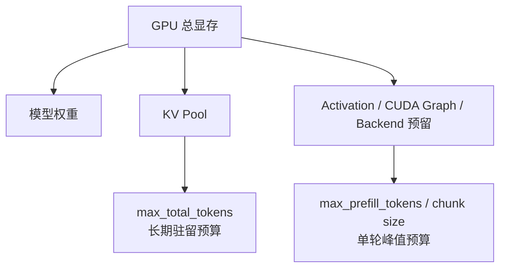
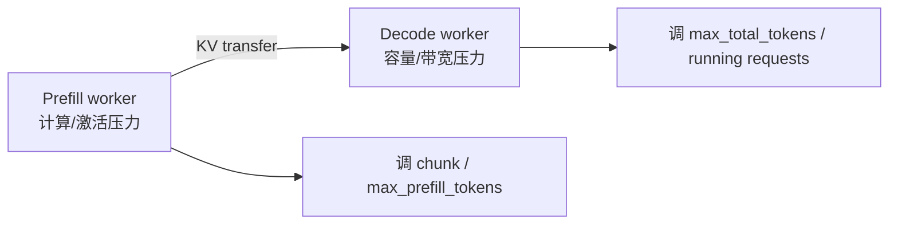

# SGLang Chunked Prefill 与调度器显存预算学习文档

本文面向第一次调 SGLang 长上下文服务的同学，把两个经常分开讨论的问题放到一起：

1. 长 prompt 为什么要切成多个 Prefill chunk？
2. `mem_fraction_static`、`max_total_tokens`、`max_running_requests`、`max_prefill_tokens` 和 `chunked_prefill_size` 分别限制什么？

核心结论是：Chunked Prefill 管单轮计算时间片，KV token capacity 管请求能否长期驻留。减小 chunk 可以降低一次 Prefill 的峰值和阻塞，但不会让已经生成的 KV 消失。

本文是第三方资料整理型学习资料，不是当前 SGLang 源码审计或容量承诺。

## 0. 阅读基线与范围

| 项目 | 内容 |
| --- | --- |
| 原文一 | 《SGLang Chunked Prefill — 原理与代码实现》 |
| 链接 | https://mp.weixin.qq.com/s/od6pBMeNMPVlaQyTgTsbAQ |
| 作者/机构 | AI 原力注入 |
| 发布时间 | 2026-06-13 |
| 原文二 | 《SGLang推理优化-Scheduler 内存和核心参数估算》 |
| 链接 | https://mp.weixin.qq.com/s/UqUroTBI5Hliheck6QRufg |
| 作者/机构 | LLM高性能计算 |
| 发布时间 | 2026-06-10 |
| 读取时间 | 2026-07-25 |
| 整理范围 | Chunked Prefill 生命周期、KV 容量估算、核心调度参数、PD 两侧调参 |
| 不展开内容 | 当前源码逐行复核、DSV4 精确 pool 实现证明、自动调参脚本交付 |
| 验证边界 | 公式用于估算；最终容量以目标版本启动日志和压力测试为准 |

### 怎么读本文

1. 第 1～4 节看一条长请求怎样跨轮推进。
2. 第 5～7 节建立显存与 KV 容量公式。
3. 第 8、9 节分清五个核心参数。
4. 第 10～12 节用于部署与排障。

### 术语速查

| 术语 | 人话解释 |
| --- | --- |
| `fill_ids` | 当前请求用于建立本轮输入视图的完整 token 序列 |
| `prefix_indices` | 已命中、无需本轮重算的 KV slots |
| `extend_input_len` | 本轮真正需要新 Prefill 的 token 数 |
| `chunked_req` | 尚未完成全部 Prefill 的长请求 |
| `max_total_tokens` | GPU KV pool 可容纳的 token/slot 总容量 |
| `max_running_requests` | 允许处于运行态的请求数上限 |
| `max_prefill_tokens` | 一轮 EXTEND batch 的总输入 token 预算 |
| `chunked_prefill_size` | 单个长请求本轮最多 Prefill 的 token 片段 |
| `mem_fraction_static` | 权重与 KV 等静态占用希望覆盖的显存比例 |
| Live tokens | 活跃请求当前必须保留 KV 的 token 数 |

## 1. 先建立两条预算线



人话版：

- `max_total_tokens` 像仓库总容量，决定同时能保存多少请求历史。
- `chunked_prefill_size` 像一次搬运的车容量，决定长 prompt 每趟搬多少。
- 车变小能降低每趟拥堵，但货最终仍要进仓库。

## 2. Chunked Prefill 的请求生命周期

### 2.1 原始动画


**图意解读：** 动画展示长 Prefill 被拆成多轮 EXTEND，并在轮次边界重新参与调度。图中队列变化属于控制面；每个 chunk 对应的数据面仍是正常模型 forward 和 KV 写入。动画用于理解时间片，不保证当前版本一定以相同顺序混合 Decode。

### 2.2 四个关键字段

| 字段 | 本轮前 | 截断后 | 下一轮 |
| --- | --- | --- | --- |
| `fill_ids` | 完整输入 + 已有输出 | 只保留到本 chunk 末尾的工作视图 | 重新恢复完整序列 |
| `prefix_indices` | Radix/HiCache 命中 | 保持已命中的 slots | 加上前一 chunk 已缓存部分 |
| `extend_input_len` | 所有未算 token | 不超过 chunk 额度 | 重新计算剩余量 |
| chunk 状态 | 未完成 | 标记仍需继续 | 最后 chunk 后清零 |

### 2.3 一个 20K 未命中的例子

假设：

```text
已命中前缀 = 100K
未计算后缀 = 20K
chunked_prefill_size = 8192
```

| 轮次 | 本轮 `extend_input_len` | 累计完成 | 剩余 |
| --- | ---: | ---: | ---: |
| 1 | 8192 | 8192 | 11808 |
| 2 | 8192 | 16384 | 3616 |
| 3 | 3616 | 20000 | 0 |

每轮只为新增部分运行 Prefill；前面已经完成的 100K + chunk 会通过前缀索引供下一轮读取。

## 3. 为什么 chunk 间要 stash 和重新匹配

### 3.1 Stash 的作用

前一 chunk 已经写入 GPU KV，但如果不把“token 序列 -> slots”登记回缓存索引，下一轮就不知道它是可复用前缀。

抽象过程：

```text
chunk N forward 完成
-> 把已完成 token 与 KV slots 插入/更新 tree cache
-> 下一轮恢复完整 fill_ids
-> 再 match_prefix
-> 只对剩余后缀 EXTEND
```

### 3.2 为什么中间 chunk 不给用户输出

Prefill 中间 chunk 的任务是补齐 prompt 历史，不代表完整 prompt 已经处理完。若把中间采样结果追加为输出：

- 后续 `fill_ids` 会混入并非用户可见的 token；
- 最终生成语义错误；
- 流式客户端会提前看到无效结果。

只有最后一个 chunk 完成后，请求才具备进入正常 Decode 的条件。

### 3.3 调度顺序的版本边界

原文分析的代码路径表现为 Prefill-first，且存在 `chunked_req` 时会优先使它继续，从而让多个 chunk 连续执行；新到达短请求仍可能被打包进后续 EXTEND batch。

不要把它泛化为：

```text
chunk1 -> decode -> chunk2 -> decode
```

新版本可能有 mixed chunk、prefill delayer 或其他策略。稳定结论只有：

> 切 chunk 把一次不可抢占的长 forward 变成多个可重新做调度决策的边界。

## 4. `PrefillAdder` 在决定什么

### 4.1 不是简单截断

它同时要满足：

```text
本轮总 Prefill token 预算
单请求 chunk 预算
KV 可分配 slots
request pool slots
running batch 的未来 Decode 预留
page 对齐与特殊模型约束
```

### 4.2 新请求和续传请求不同

| 路径 | 目标 |
| --- | --- |
| 新请求 `add_one_req` | 判断能否接纳；必要时把它变成新的 chunked request |
| 续传 `add_chunked_req` | 优先推进已经开始的长请求，避免状态长期悬挂 |

续传请求若完全受普通 waiting 顺序影响，可能长期持有前缀资源却无法完成 Prefill。

### 4.3 page 对齐

若 KV allocator 以 page 管理，非最终 chunk 通常要落在合法 page 边界。对齐减少：

- 半页状态；
- hash/共享边界不稳定；
- 回收与 I/O 的复杂度。

最后一段是否可部分页、怎样记录有效长度，依赖目标后端。

## 5. 从 GPU 显存推到 KV Token Capacity


**图意解读：** 图把模型权重、运行时预留、KV pool 和调度参数放在同一张容量表里。它的价值是展示计算顺序，不是给出适用于所有模型的固定比例；真正的权威值来自模型加载后的显存 profile 和初始化日志。

### 5.1 第一层近似

```text
post_model_free
= 模型加载后、KV pool 初始化前的每卡剩余显存

dynamic_reserve
= 激活 + CUDA Graph + backend 临时 buffer + 安全边界

kv_budget
= post_model_free - dynamic_reserve

max_total_tokens
≈ floor(kv_budget / bytes_per_token / page_size) * page_size
```

### 5.2 `mem_fraction_static` 的直觉

原文给出的 profile 思路可写为：

```text
kv_available
≈ post_model_free
  - pre_model_free * (1 - mem_fraction_static)
```

`1 - mem_fraction_static` 相当于留给动态计算的比例。提高它会：

- 增大 KV pool；
- 提高潜在并发；
- 压缩 activation/CUDA Graph 的安全空间；
- 增加 Prefill 或某些 backend OOM 风险。

### 5.3 为什么不能只看 `nvidia-smi` 空闲

部分显存可能必须留给：

- 最大 Prefill chunk 的中间激活；
- CUDA Graph capture/replay buffer；
- NCCL/通信；
- Attention/MoE workspace；
- allocator metadata 与碎片；
- 框架异步流水线。

把启动前看见的空闲显存全部塞进 KV，服务第一条长请求时就可能 OOM。

## 6. 每 token KV 字节数

### 6.1 MHA/GQA

粗略公式：

```text
bytes_per_token_per_gpu
≈ num_layers
  × num_kv_heads_per_gpu
  × (k_head_dim + v_head_dim)
  × kv_dtype_bytes

num_kv_heads_per_gpu
≈ num_kv_heads / attention_tp_size
```

若 K/V 维度相同，就是常见的：

```text
num_layers × num_kv_heads_per_gpu × 2 × head_dim × dtype_bytes
```

### 6.2 MLA

MLA 缓存压缩 latent 与 RoPE 相关部分，原文给出的近似是：

```text
bytes_per_token_per_gpu
≈ (kv_lora_rank + qk_rope_head_dim)
  × num_layers
  × kv_dtype_bytes
```

这说明“模型参数更大”不必然意味着“每 token KV 更大”；Attention 结构才是关键。

### 6.3 DSV4/混合稀疏状态

DeepSeek V4/R1 W8A8 一类后端可能同时维护：

- full/SWA KV；
- 不同压缩比例的 KV pool；
- indexer KV；
- ring/state buffers；
- 不同层组的不同容量。

此时不能用一个简单 `(K+V) × layers` 公式。原文提供了按 pool 折算 full-token capacity 的复杂模型，但它高度依赖当时的：

```text
backend 实现
模型 config
page_size
压缩比例
ring size
speculative mode
```

本文不把其中示例默认值写成通用配置。最稳妥的做法是用目标 commit 的 pool configurator 和启动日志反校准。

## 7. `max_total_tokens` 与 `max_running_requests`

### 7.1 前者是物理容量，后者是逻辑护栏

```text
max_total_tokens:
  所有活跃/受保护 KV slots 的容量上限

max_running_requests:
  Scheduler 最多允许多少请求处于运行集合
```

请求数相同，长度不同，KV 压力可以相差几十倍。因此请求上限不能替代 token 容量。

### 7.2 业务并发估算

```text
business_capacity
≈ max_total_tokens / avg_live_tokens_per_request
```

例如：

```text
max_total_tokens = 760K
平均 live tokens = 4096
理论均值容量 ≈ 185 requests
```

生产上还要为 P95/P99 长请求、page 浪费、缓存保留和突发留安全边界。

### 7.3 为什么框架解析出的请求上限可能很大

框架内部默认值往往是对象池/调度结构的上限估计，不代表业务能让每个请求都长期占 4K、16K 或 128K KV。应取：

```text
建议 running 上限
= min(
    框架 resolved 上限,
    KV 业务容量,
    目标并发,
    latency SLO 下的压测上限
  )
```

## 8. 五个参数各管什么

| 参数 | 约束对象 | 调大可能带来 | 调大可能付出 |
| --- | --- | --- | --- |
| `mem_fraction_static` | 权重 + KV 静态预算 | 更多 KV 容量 | 动态 OOM 风险 |
| `max_total_tokens` | KV token pool | 更多 live tokens | 若超过 profile 会被限制或 OOM |
| `max_running_requests` | 活跃请求数量 | 更高并发上限 | retract、ITL 抖动 |
| `max_prefill_tokens` | 一轮所有 EXTEND token | Prefill 吞吐 | 单轮阻塞与激活峰值 |
| `chunked_prefill_size` | 单长请求一轮 token | 少轮次、长请求吞吐 | Decode 干扰、激活峰值 |

### 8.1 一个容易混淆的关系

假设：

```text
max_prefill_tokens = 16384
chunked_prefill_size = 4096
```

一轮可以：

- 放 4 个各 4096-token 的 chunk；
- 放 1 个 4096-token 长 chunk + 多个短请求；
- 因 KV/请求槽位不足而只放更少。

`max_prefill_tokens` 是 batch 总预算，`chunked_prefill_size` 是单请求上限。

## 9. 原文 Chunk Benchmark 的边界

原文报告的条件：

```text
模型：Qwen3.5-122B-A10B
硬件：8 × H100
HiCache：write_through
请求数：1600
比较：chunk 8192 vs 16384
```

原文结果：

| 指标 | 8192 | 16384 | 原文变化 |
| --- | ---: | ---: | ---: |
| Prefill batch 数 | 2214 | 1785 | -19.4% |
| 整体 TPS | 19589 | 22314 | +13.9% |
| 运行时间 | 106 min | 91 min | -14.2% |
| TPOT P50 | 19.6 ms | 19.9 ms | +1.5% |

可以从中学习的机制是：

> 大 chunk 减少分段和调度次数，在该离线/高负载配置中提高吞吐，同时让单次 Prefill 更长。

不能泛化为“把 chunk 翻倍总能提升 14%”。模型、请求长度、GPU、HiCache I/O、并发和 TTFT/ITL SLO 都会改变结果。

## 10. PD 分离时两侧为什么不同

### 10.1 Prefill worker

更关注：

- 长 prompt activation 峰值；
- chunk 大小与 TTFT；
- 单轮 Prefill token；
- KV 传输前的 staging。

调参通常更保守地给动态显存留余量。

### 10.2 Decode worker

更关注：

- 最大 live KV；
- running 请求数；
- ITL；
- 长生成尾部；
- 接收 KV 后的持续驻留。

Decode 侧可能愿意把更高比例显存给 KV，但仍需保留 CUDA Graph、Attention/MoE workspace。



具体比例不能从一篇文章复制；应分别 profile 两种角色。

## 11. 与 HiCache 的协同

Chunked Prefill 每完成一段，就可能把它登记为下一轮可命中的本地前缀。HiCache 再把这个索引扩展到 L2/L3：

```text
第 N 轮前:
  命中历史前缀 + chunk 1..N-1

第 N 轮:
  只为 chunk N 分配 L1 slots 并计算

第 N 轮后:
  将新完成部分写入缓存索引
  按策略备份到 L2/L3
```

注意：

- Load-back 必须在 forward 需要数据前完成。
- L2/L3 命中减少重算，但搬运也占带宽和时间。
- `write_through` 的 I/O 可能改变 chunk benchmark。

HiCache 详情见：

- [SGLang KV Pool、请求视图与 HiCache 工程学习文档](SGLang%20KV%20Pool、请求视图与%20HiCache%20工程学习文档.md)
- [Mooncake 与 SGLang HiCache 学习文档](Mooncake%20与%20SGLang%20HiCache%20学习文档.md)

## 12. 调参和排障地图

### 12.1 建议顺序

1. 固定模型、dtype、Attention backend 和并行方式。
2. 从启动日志取得模型加载后剩余显存。
3. 确认实际 `max_total_num_tokens` 和 page size。
4. 用真实 live-token 分布估算运行并发。
5. 再调 `max_prefill_tokens` 与 chunk。
6. 压测 TTFT、ITL、吞吐、OOM、retract 和 HiCache I/O。

### 12.2 现象反查

| 现象 | 优先检查 | 调整方向 |
| --- | --- | --- |
| Prefill OOM | activation 峰值、静态比例、CUDA Graph | 降 chunk、降 prefill budget、降静态比例 |
| Decode 容量不足 | KV token capacity、live-token 尾部 | 增 KV 预算或降 running |
| 频繁 retract | running 上限、平均/尾部长度 | 降并发、留更多 KV |
| Decode ITL 尖峰 | 是否与大 Prefill 同步 | 降 chunk 或用 PD |
| 长 prompt 吞吐低 | Prefill batch 数、GPU 利用率 | 显存允许时增 chunk |
| `max_total_tokens` 比估算低 | 权重实际占用、backend buffer、page 对齐 | 用启动 profile 重算 |
| HiCache 命中仍慢 | L2/L3 带宽、prefetch wait | 区分命中与数据 ready |

## 13. 常见误解

### 误解一：Chunked Prefill 节省最终 KV 容量

它主要降低单轮计算峰值。完整 prompt 的 KV 最终仍需保存，除非另有稀疏、压缩或 offload。

### 误解二：`max_running_requests` 就是并发能力

它是请求数量护栏。真正容量由 live-token 分布和 `max_total_tokens` 决定。

### 误解三：`mem_fraction_static` 越高越好

它会挤压 activation/CUDA Graph/通信 workspace。启动成功不代表长 Prefill 不会 OOM。

### 误解四：文章中的 DSV4 公式适用于所有版本

复杂 pool 的字段、默认 page size 和压缩比例会变。必须以目标实现为准。

## 14. 一句话总结

SGLang Chunked Prefill 用跨轮状态把长 prompt 切成可调度时间片；显存容量则由权重、动态预留、每 token KV 字节数和 page 对齐共同决定。先算 KV token capacity，再定运行并发，最后用 TTFT/ITL 与吞吐共同选择 chunk。

## 15. 参考与延伸

- 《SGLang Chunked Prefill — 原理与代码实现》：https://mp.weixin.qq.com/s/od6pBMeNMPVlaQyTgTsbAQ
- 《SGLang推理优化-Scheduler 内存和核心参数估算》：https://mp.weixin.qq.com/s/UqUroTBI5Hliheck6QRufg
- [SGLang 调度器请求生命周期与重叠调度学习文档](SGLang%20调度器请求生命周期与重叠调度学习文档.md)

原文提到的估算脚本不在本仓库，本篇也未生成或验证该脚本。所有数值仅作估算起点。
