# SGLang GLM-5.2 NVFP4 推理优化案例学习文档

本文面向已经理解 Prefill/Decode 和基础 Scheduler、希望学习“一个模型从 day-0 能跑到生产级性能”优化方法的同学。它不把 500+ TPS 当成结论，而是把原文拆成五类可迁移问题：

1. Runtime 调度气泡；
2. Speculative Decode 的重复状态；
3. 稀疏 Attention TopK 的算法复杂度；
4. 小 kernel 启动与访存开销；
5. 小 batch GEMM 的流水线选择。

本文是第三方资料整理型学习资料，不是 SGLang/GLM-5.2 源码审计或性能复现。

## 0. 阅读基线与范围

| 项目 | 内容 |
| --- | --- |
| 原文标题 | 《SGLang优化GLM-5.2 NVFP4推理: 两周从能跑到 500+TPS》 |
| 原文链接 | https://mp.weixin.qq.com/s/Y80ouDQaT8VW1O3tM09qSw |
| 作者/机构 | AI圈的9527 |
| 发布时间 | 2026-07-16 |
| 读取时间 | 2026-07-25 |
| 资料类型 | 性能优化案例图文 |
| 原文目标版本 | 原文图注称 `v0.5.15.post1`；本文未在官方 release/tag 中核验 |
| 整理范围 | Spec V2、IndexShare MTP、TopK-V2、Indexer Prologue Fusion、BF16 GEMM、Pareto 评估 |
| 不展开内容 | 其他推理框架、完整 GLM 架构、kernel 源码和数值验证 |
| 验证边界 | 所有性能数字均为原文报告，只适用于原文模型、硬件、batch 和上下文条件 |

### 怎么读本文

1. 第 1 节先看优化分层。
2. 第 2～6 节按“气泡 -> 重复工作 -> 算法 -> launch -> GEMM”阅读。
3. 第 7 节只学习 Pareto 读法，不外推绝对 TPS。
4. 第 8、9 节把案例转化成可执行方法。

### 术语速查

| 术语 | 人话解释 |
| --- | --- |
| NVFP4 | Blackwell 面向低精度矩阵计算的 4-bit 浮点格式 |
| DSA | 带索引器的稀疏 Attention 路径，只选部分历史 KV |
| Indexer | 给历史位置打分并选 TopK 的模块 |
| MTP | Multi-Token Prediction，用 draft steps 猜多个 token |
| Accept length | 一次 speculative verify 实际接受的连续 token 数 |
| IndexShare | 多个 MTP draft steps 复用 DSA TopK 索引 |
| Spec V2 | 原文所述的异步/重叠投机解码运行时 |
| CTA cluster | 多个 CUDA thread blocks 协同完成一个长行选择 |
| Prologue fusion | 把 Attention/Indexer 前置小算子融合 |
| Pareto curve | 在延迟与吞吐之间不能同时再改善的配置边界 |

## 1. 先看全局：性能不是一个 kernel 的功劳

### 1.1 原文性能总览

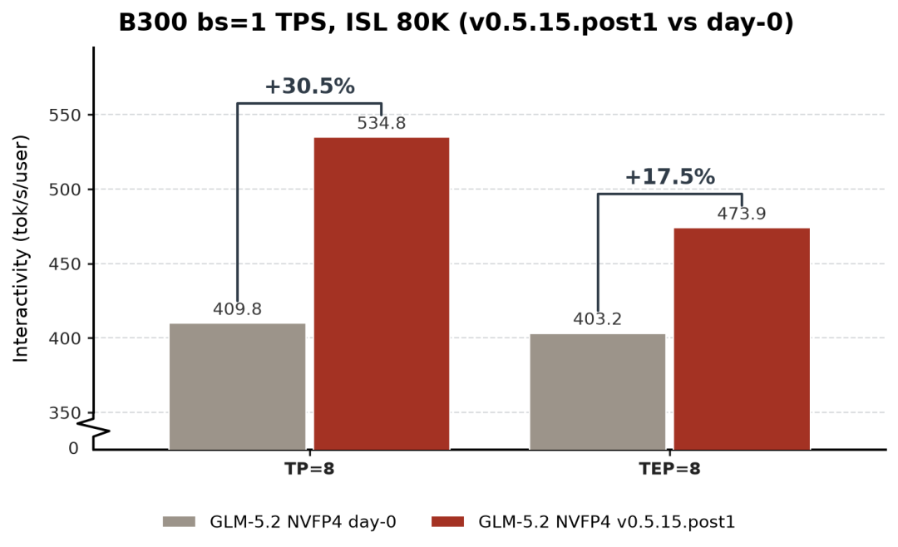

**图意解读：** 图比较原文所称 day-0 与后续版本在不同硬件/并发点上的交互性。它是最终结果视图，无法单独证明每项优化的因果贡献；横纵轴、模型版本、请求分布和缓存状态必须与原文实验一起理解。

### 1.2 五层优化地图

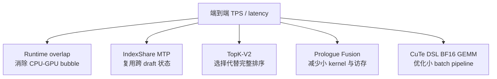

这五层分别作用于：

| 层 | 浪费来源 |
| --- | --- |
| Runtime | CPU 准备、同步、H2D/D2H 让 GPU 等待 |
| 算法状态 | 每个 draft step 重算相同 TopK |
| TopK 算法 | 为得到 K 个元素做过多排序/扫描 |
| Kernel 图 | 多个小算子反复读写和 launch |
| GEMM | 通用库在特定小形状上流水线不够激进 |

## 2. Spec V2：先把迭代间气泡消掉

### 2.1 优化前

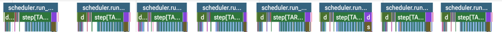

**图意解读：** 时间线中相邻 `run_batch` 之间存在可见空档，表示 GPU kernel 链未连续衔接。空档可能来自 CPU plan、同步读取、metadata H2D 或采样依赖；仅凭空白不能判断是哪一行代码，需要结合 CPU/CUDA trace。

### 2.2 优化后

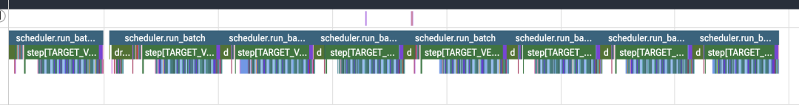

**图意解读：** 优化后相邻迭代更紧密，说明下一步 plan 与当前 forward 的重叠更充分。它体现“开销被覆盖”，不代表 KV 分配、metadata 准备或采样本身不再存在。

### 2.3 原文描述的关键修复

要让 overlap 真正成立，不只是在 Python 中异步调用：

- DSA draft-extend 路径需要可 CUDA Graph 化；
- 移除会强制 D2H 的 `seq_lens_cpu` 依赖；
- 去掉残余 H2D 同步；
- 融合 `_apply_cuda_graph_metadata` 一类零散 eager metadata 操作；
- 正确安排 plan stream 与 forward stream 的依赖。

### 2.4 时序直觉

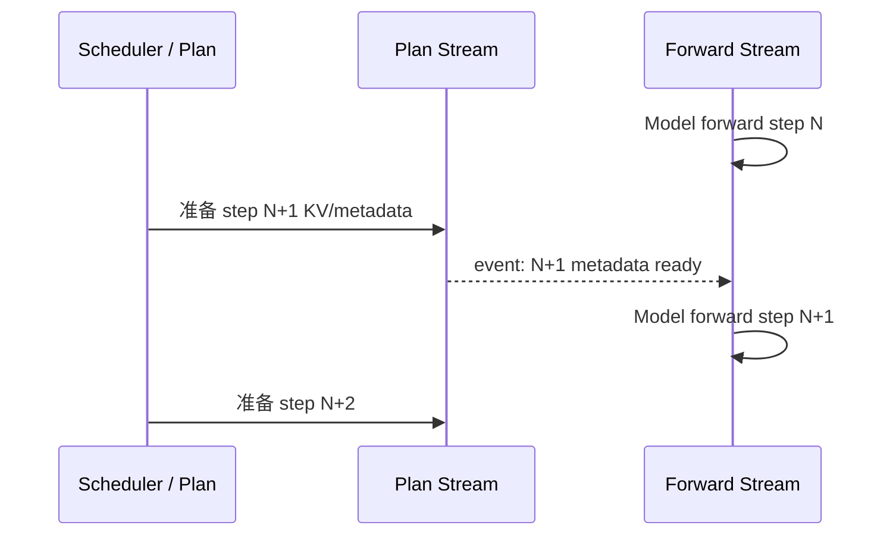

只要某个 shape 或 token 必须同步回 CPU 才能规划 N+1，流水线就会被打断。

### 2.5 原文结果边界

原文把这一组运行时修复与约 `11%` 端到端 TPS 提升关联。这个数字不能拆成“只打开 Spec V2 就有 11%”，因为它包含多个同步与 CUDA Graph 修复。

## 3. IndexShare MTP：不要在 draft step 间重复选历史

### 3.1 背景

DSA Indexer 为当前 query 对历史 KV 位置打分，选择 TopK 位置供稀疏 Attention。MTP 会连续运行多个 draft steps。

若每个 draft step 都重新对同一长历史做 TopK：

```text
draft 0: score + TopK
draft 1: score + TopK
draft 2: score + TopK
...
```

长上下文下 Indexer 可能吞掉投机解码收益。

### 3.2 IndexShare 的核心

```text
draft step 0:
  计算 TopK indices
  保存

draft step 1..N:
  复用同一批 indices
  跳过重复 Indexer TopK
```

这要求模型架构本身定义并允许这种复用，不能对任意 DSA/MTP 模型自行套用。

### 3.3 为什么需要 relay buffer

原文描述 TopK seed 来自上一 `run_batch` 迭代的 draft-extend，而 Spec V2 让各阶段异步执行。若只把 seed 放在普通 CPU 对象：

- 下一迭代可能读取过早；
- buffer 可能被复用覆盖；
- batch 重排后 request 对应关系可能丢失。

Relay buffer 是跨迭代依赖契约：

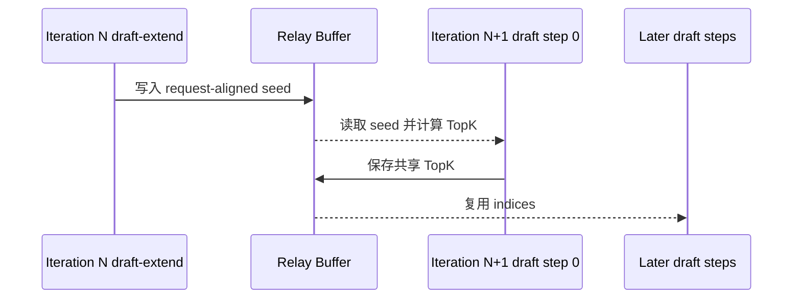

它要带 request identity、有效长度和生命周期 event，而不只是一个裸 tensor。

### 3.4 原文结果边界

原文称长上下文下 draft step 开销最多约降 `1.9x`，且不影响输出质量。这里的“最多”绑定：

- GLM-5.2 的 IndexShare 语义；
- 特定上下文长度；
- 特定 MTP 接受长度；
- 原文 kernel 与硬件。

## 4. TopK-V2：把排序改成选择

### 4.1 问题

Indexer 只需要最高的 K 个位置，不关心这 K 个元素的完整全序。若先对全部 N 个 score 排序：

```text
需要的信息：集合 TopK
实际工作：得到 N 个元素的完整顺序
```

这是过度计算。

### 4.2 长行的 Cluster 路径

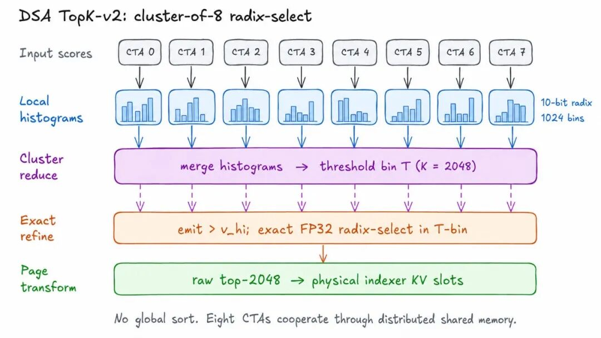

**图意解读：** 长 score row 被切给 8 个 CTAs，各自构建粗粒度直方图；cluster 归约后定位“第 K 大元素所在的 bin”。高于阈值 bin 的值直接输出，边界 bin 再做精确 FP32 选择，最后把逻辑位置映射成物理 indexer KV slots。它避免了全量排序。

抽象步骤：

1. 按位置把长 row 分给多个 CTA。
2. 每个 CTA 扫描本地 scores 并建立 10-bit histogram。
3. 合并 1024 个 bins 的计数。
4. 从高分到低分累计，找到包含第 K 个元素的边界 bin。
5. 边界以上元素必选。
6. 只对边界候选做精确选择。
7. 融合 page-table transform。

### 4.3 为什么粗直方图不破坏最终精度

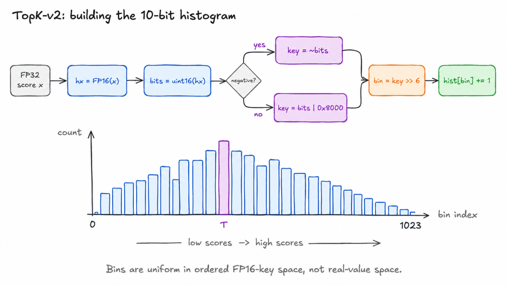

**图意解读：** 原图先把 score 映射为保持数值次序的无符号 key，再取高 10 bits 放入 1024 个 bins。粗 histogram 只定位边界区域，不直接决定边界内最终名次；精确 FP32 refinement 负责选出剩余名额。

这是两阶段算法：

```text
粗选：快速缩小候选范围
精选：在小范围内保证最终 TopK 正确
```

如果直接用 FP16 round 后的 bin 顺序作为最终结果，边界相近 scores 可能选错。

### 4.4 短行与中行

原文称 TopK-V2 对短/中行使用：

- register-resident；
- 单 CTA streaming；

对长行才进入 8-CTA cluster。Router/plan 根据本 batch 序列长度分布选择 cutoff，并可在多个 DSA layers 复用工作计划。

### 4.5 Kernel benchmark

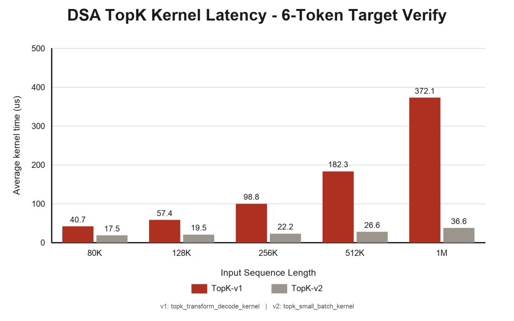

**图意解读：** 曲线显示原文环境中上下文越长，TopK-V2 相对优势越大，符合“线性扫描 + 小边界精化”比旧路径扩展更好的预期。该图测的是 TopK 与 page transform 融合 kernel，不是完整模型 TPS。

原文报告：

| ISL | V1 | V2 | 原文加速 |
| ---: | ---: | ---: | ---: |
| 80K | 40.7 µs | 17.5 µs | 2.33x |
| 1M | 372.1 µs | 36.6 µs | 10.17x |

条件还包括 target verify、batch size 1、6 draft tokens。不能把 10.17x 写成端到端模型加速。

## 5. Indexer Prologue Fusion：少读写、少启动

### 5.1 融合前后

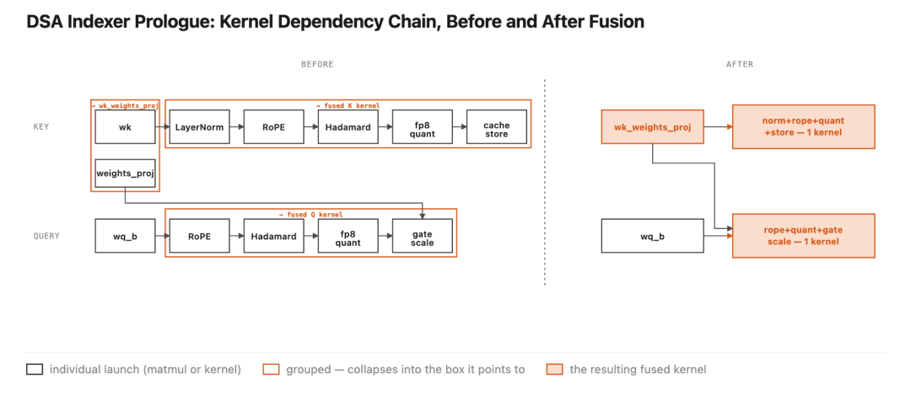

**图意解读：** 图把多个 projection、reshape/scale/gate 类小 kernel 合并成更少的生产者/消费者。原文重点是 `wk` 与 `weights_proj` 融合，以及 query/key tail 的组合；中间 tensor 不再多次写回 HBM，kernel 数从 12 降到 4。

### 5.2 为什么小 batch 更受益

小 batch Decode 中：

- 每个 GEMM/elementwise 工作量小；
- 固定 launch latency 占比高；
- 中间 tensor 的 HBM 往返相对昂贵；
- GPU 很难用大计算把开销摊薄。

融合把：

```text
launch A -> 写中间结果
launch B -> 读中间结果 -> 写
launch C -> 再读
```

变成一个或少数 kernel 内的数据流水。

### 5.3 原文结果

- batch size 1：Decode throughput 约 `+8%`；
- batch size 128：约 `+5%`。

这些是原文端到端观察，不能简单相加到其他优化百分比上；同一瓶颈被多个优化覆盖时，收益不是线性叠加。

## 6. BF16 GEMM：量化模型里仍有高精度热点

### 6.1 为什么 NVFP4 模型还有 BF16

原文说明，为保精度：

- 部分 routed experts 使用 NVFP4；
- Attention projections 和 shared expert MLP 仍可能使用 BF16。

因此只优化 NVFP4 GEMM 并不完整。

### 6.2 CuTe DSL 路径的设计直觉

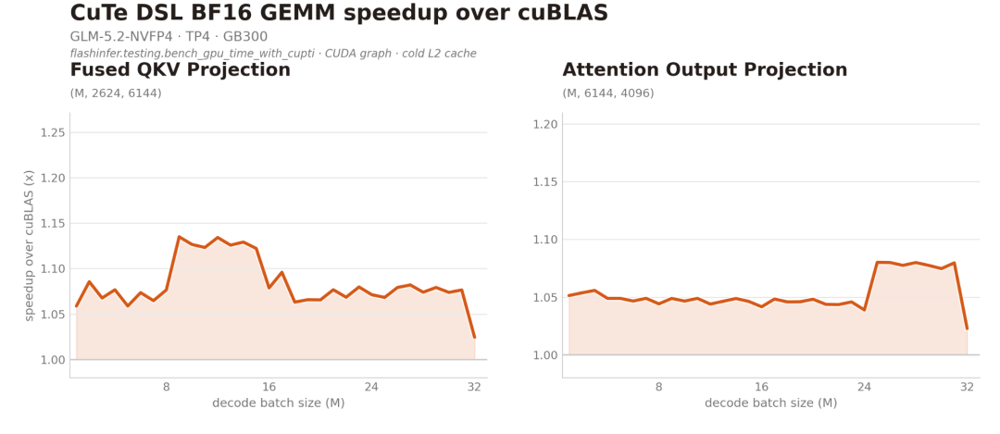

**图意解读：** 图按 batch/矩阵形状比较特制 GEMM 与通用 cuBLAS。优势主要集中在 Decode 小 batch，随着形状变化可能缩小或消失。它说明应按真实 shape 调 kernel，而不是替换所有 BF16 GEMM。

原文将收益归因于更激进的加载流水：

- 多个 tiles 同时在传输途中；
- 大量使用 shared memory 做多 stage buffering；
- 在 memory-latency-bound 的小形状中减少等待。

代价包括：

- shared memory 占用可能限制 occupancy；
- 对 shape、架构和 dtype 高度专用；
- 大 batch/计算密集形状上通用库可能更好；
- 需要 autotune 或可靠 dispatch。

### 6.3 原文结果

原文报告：

- fused QKV：平均约 `1.08x`，峰值 `1.13x`；
- `o_proj`：平均约 `1.05x`，峰值 `1.08x`；
- batch size 1 端到端 Decode：约 `+4%`。

这些数字只属于图中 shapes 和 Blackwell 环境。

## 7. 读懂最终 Pareto，而不是只盯 500+

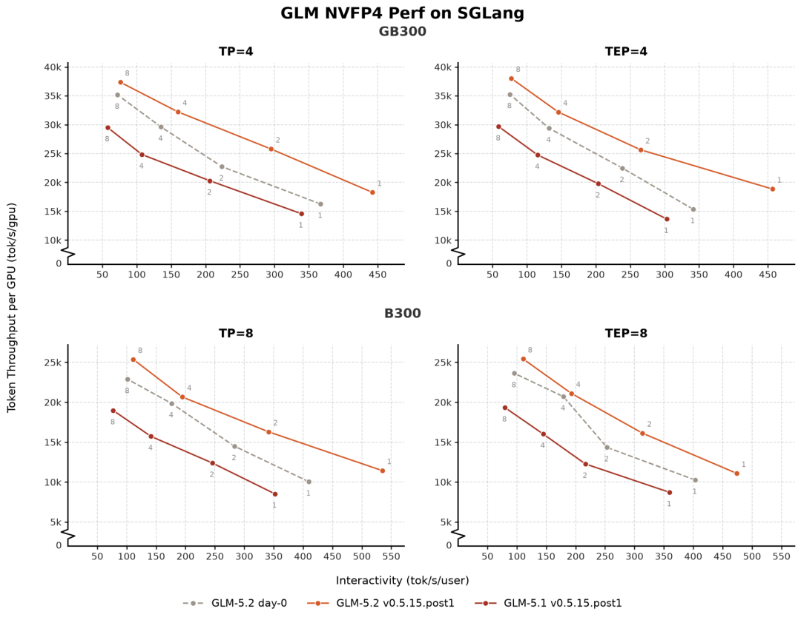

**图意解读：** 每个点代表一种并发/配置，横纵轴共同表达单用户交互速度与总吞吐。真正有意义的是新曲线是否整体把旧曲线向外推，而不是某一个最大 TPS 点。高缓存命中、低并发的最优点不能代表高并发在线流量。

### 7.1 原文总体报告

原文称：

- GLM-5.2 相比 GLM-5.1，在相同 SGLang 版本上每 GPU 交互性约提升 `1.3x～1.4x`；
- 相对 day-0，每用户交互性提升 `18%～34%`；
- 8×B300、batch size 1 达到 `500+ TPS`；
- batch size 8 峰值吞吐提高 `6%～11%`。

### 7.2 必须附带的边界

原文明确主要关注：

```text
低并发
高 Prefix Cache 命中
GLM-5.2 NVFP4
4×GB300 / 8×B300 等 Blackwell 环境
OpenHands workload
```

“500+ TPS”更接近单用户/低并发交互速度，而不是任意并发下的总 output throughput。

### 7.3 架构升级与软件优化要分开

GLM-5.2 相对 GLM-5.1 的收益来自模型架构（IndexShare、MTP 等）和软件共同作用；day-0 到优化版本才更接近软件栈变化。把两段收益相乘并归功于 SGLang，会重复计算。

## 8. 可迁移的优化方法

### 8.1 第一阶段：先保证正确

- 模型能加载和生成；
- 与参考实现做 token/logits 对齐；
- 覆盖短/长上下文；
- 覆盖 Prefix Cache、MTP 接受/拒绝；
- 确认量化 scale 与 KV dtype。

### 8.2 第二阶段：用 profiler 分类浪费

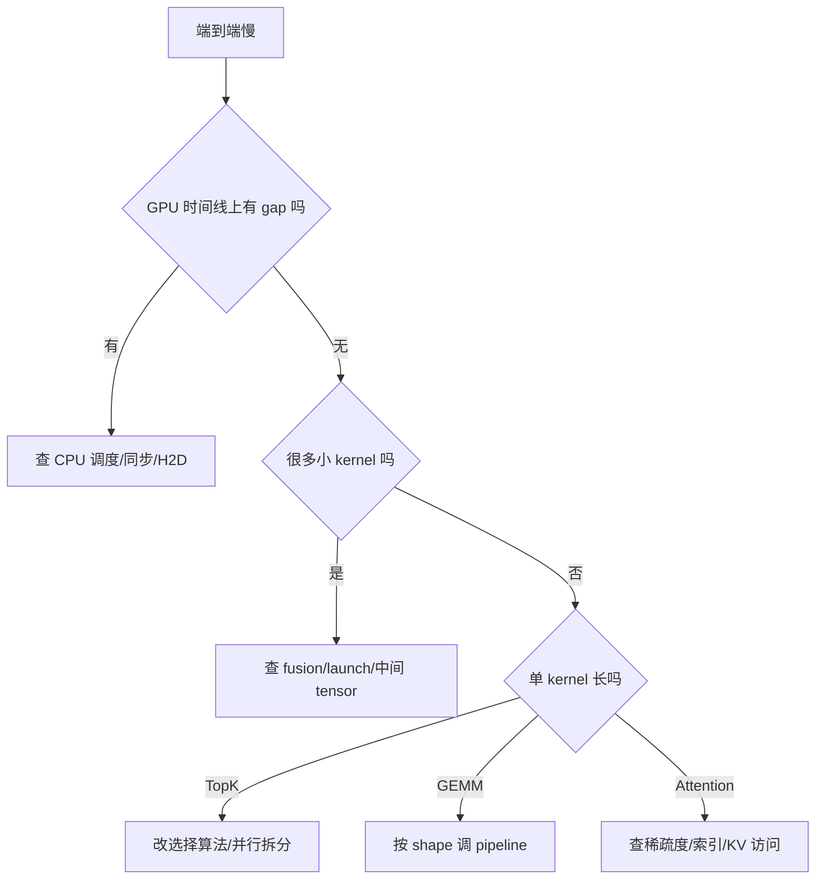

### 8.3 第三阶段：每层做消融

建议至少保留：

```text
Baseline
+ Spec V2 runtime fixes
+ IndexShare
+ TopK-V2
+ Prologue Fusion
+ BF16 GEMM backend
```

每步同时记录正确性、kernel latency、端到端 TPS、TTFT/ITL 和显存。

### 8.4 第四阶段：重新画 Pareto

单个 batch size 的胜利可能只是把成本移到别处。至少覆盖：

- batch 1、低并发；
- 中并发；
- 高并发；
- 冷/热 Prefix Cache；
- 短/80K/更长上下文；
- MTP 不同接受率。

## 9. 复现实验清单

原文没有在本文可见内容中给出一键复现脚本。复现至少要补齐：

| 类别 | 必需信息 |
| --- | --- |
| 版本 | SGLang commit/tag、kernel commit、容器 |
| 模型 | 精确 checkpoint、quant config、MTP/IndexShare 开关 |
| 硬件 | B300/GB300 数量、互联、驱动/CUDA |
| 拓扑 | TP/DP/EP/PD、batch 定义 |
| Workload | OpenHands 版本、输入/输出长度、并发、缓存预热 |
| 指标 | TPS 是单用户还是总吞吐、TTFT/ITL、统计区间 |
| Profiler | warmup、capture 范围、CUDA Graph 状态 |

若缺少这些信息，应把数字当作案例观察，而不是可承诺 SLO。

## 10. 常见误解

### 误解一：TopK kernel 快 10x，所以模型快 10x

TopK 只是整条 Decode 路径的一部分。Amdahl 定律决定端到端收益受其原始占比限制。

### 误解二：所有百分比可以相加

多个优化可能覆盖同一 bubble 或改变后续占比，组合收益需要实际测量。

### 误解三：NVFP4 意味着所有层都是 4-bit

量化方案常保留 Attention projection、shared expert 等 BF16 热点。

### 误解四：Overlap 开关能自动消除气泡

任何 D2H shape 依赖、H2D metadata、非 graph 路径都可能重新暴露同步。

### 误解五：高 Prefix Cache 结果代表冷流量

冷启动要重新 Prefill，瓶颈和 Pareto 会完全不同。

## 11. 排障地图

| 现象 | 优先检查 |
| --- | --- |
| `run_batch` 间仍有 gap | CPU trace、D2H/H2D、CUDA Event、graph break |
| MTP 开启反而慢 | 接受长度、Indexer 重算、draft overhead |
| TopK-V2 数值不一致 | 边界 bin、FP32 refinement、NaN/tie |
| 长上下文加速不明显 | TopK 是否原本是瓶颈、实际 ISL |
| Fusion 后 occupancy 下降 | register/shared memory、CTA 数 |
| CuTe GEMM 某些 batch 回退 | dispatch 阈值、shape、autotune |
| 500 TPS 无法复现 | cache 状态、TPS 口径、硬件/commit |

## 12. 一句话总结

这个案例真正可迁移的不是 500+ TPS，而是优化顺序：先用 profiler 消除跨迭代同步，再复用模型允许复用的状态，把 TopK 从完整排序降为阈值选择，融合小 kernel，最后只为确实占比高的 BF16 shapes 定制 GEMM。

## 13. 参考与延伸

- 《SGLang优化GLM-5.2 NVFP4推理: 两周从能跑到 500+TPS》：https://mp.weixin.qq.com/s/Y80ouDQaT8VW1O3tM09qSw
- [SGLang 调度器请求生命周期与重叠调度学习文档](SGLang%20调度器请求生命周期与重叠调度学习文档.md)

本文没有复现原文 benchmark，也没有核验原文所称版本 tag。所有图表和数字均保留原文条件，不作跨模型、跨硬件泛化。
