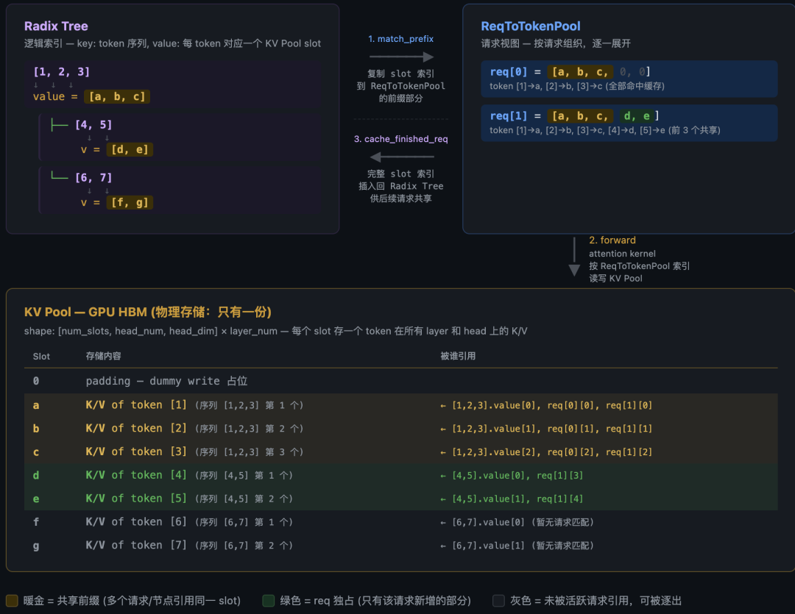
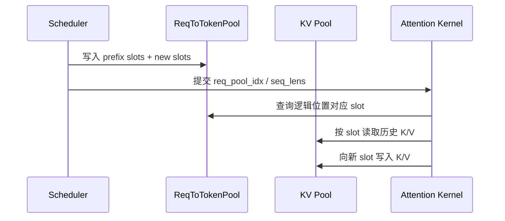
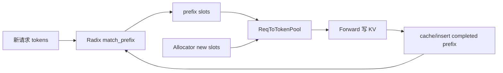
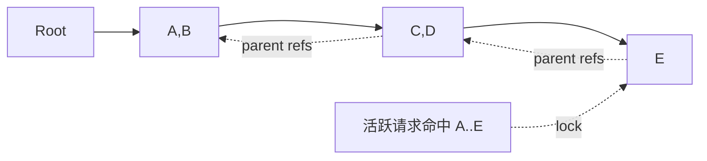
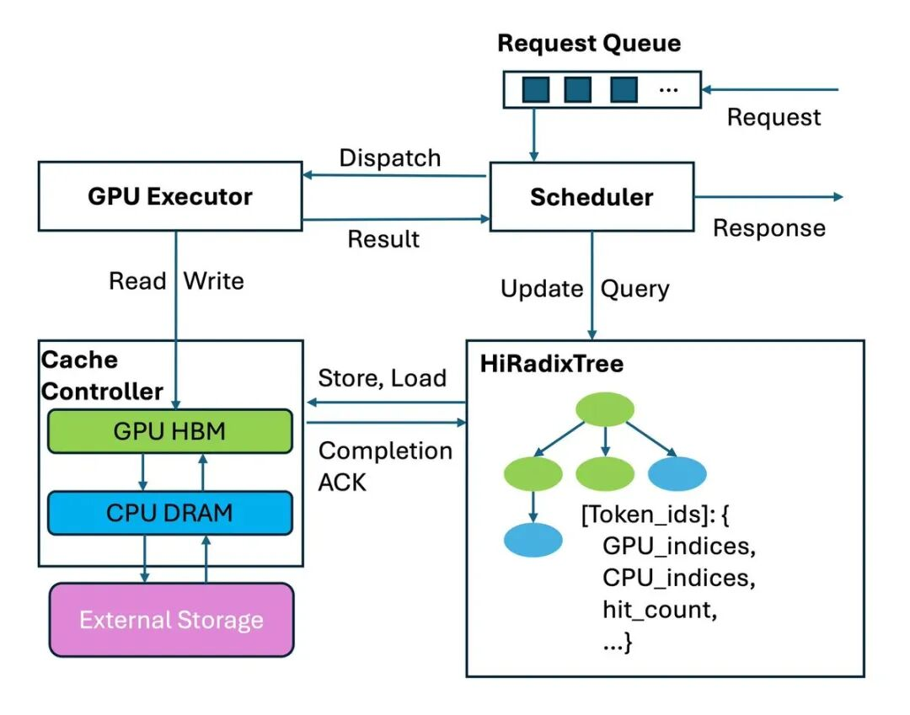
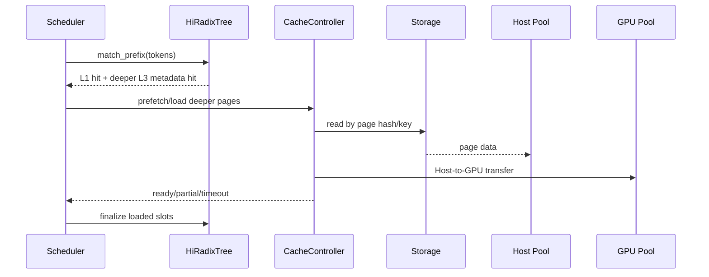

# SGLang KV Pool、请求视图与 HiCache 工程学习文档

本文面向第一次系统理解 SGLang KV 管理的同学，重点拆开四个经常被混在一起的概念：

1. **KV Pool**：GPU 中真正存 K/V tensor 的物理池。
2. **ReqToTokenPool**：某个活跃请求的逻辑 token 到物理 slot 的临时视图。
3. **Radix Tree**：跨请求复用前缀的长期索引。
4. **HiCache**：把可复用 KV 从 GPU L1 扩展到 Host L2 与外部 L3 的分层系统。

本文不重复讲 Radix Tree 的节点分裂算法；相关内容通过链接跳转。

本文是第三方资料整理型学习资料，不是目标版本源码审计。

## 0. 阅读基线与范围

| 项目 | 内容 |
| --- | --- |
| 原文一 | 《SGLang KV Pool 管理：物理存储、Radix Tree 索引与请求视图》 |
| 链接 | https://mp.weixin.qq.com/s/IPGPelW_JFXiYzpTA0M-tw |
| 作者/机构 | AI 原力注入 |
| 发布时间 | 2026-07-24 |
| 原文二 | 《零拷贝 + 前缀树 + 热插拔：SGLang HiCache 工程实现全链路分析》 |
| 链接 | https://mp.weixin.qq.com/s/Dhge0hHH0aK4TLSFTmz0aQ |
| 作者/机构 | AI 原力注入 |
| 发布时间 | 2026-05-07 |
| 原文二上游 | https://forceinjection.github.io/09_inference_system/kv_cache/02_systems/hicache/hicache_deep_dive.html |
| 读取时间 | 2026-07-25 |
| 整理范围 | 物理 KV、请求映射、Radix 索引、引用保护、page、HiCache 读写与控制面 |
| 不展开内容 | RadixAttention 命中算法细节、具体 L3 后端源码 |
| 验证边界 | 基于第三方源码解读整理；参数默认值、后端支持和热插拔约束需在目标版本复核 |

### 怎么读本文

1. 第 1～3 节先记住“三张表”：长期索引、请求视图、物理数据。
2. 第 4～6 节走一遍匹配、分配、forward、回收。
3. 第 7 节再引入 HiCache L1/L2/L3。
4. 第 8～11 节理解 I/O、布局和工程边界。

### 术语速查

| 术语 | 人话解释 |
| --- | --- |
| Slot | KV Pool 中一个 token 对应的物理位置编号 |
| Page | 若干连续 slots 组成的分配/I/O 单元 |
| KV Pool | 每层 K/V tensor 的预分配物理存储 |
| Allocator | 维护哪些 slots/pages 空闲 |
| ReqToTokenPool | `[request, logical_position] -> physical_slot` 映射 |
| Radix Tree | `[token sequence] -> slots` 的共享前缀索引 |
| `lock_ref` | 活跃请求对缓存节点的保护引用 |
| Eviction | 删除可淘汰索引并归还其物理资源 |
| HiRadixCache | 带 L1/L2/L3 状态的分层前缀索引/控制接口 |
| L1 | GPU HBM 中模型可直接使用的 KV |
| L2 | Host DRAM 中的 KV 副本/回载层 |
| L3 | NVMe 或分布式/远端 KV 存储后端 |

## 1. 先建立三张表



**图意解读：** 原图把三个结构放在同一张图里：Radix Tree 按可共享 token 前缀组织 slot 索引；ReqToTokenPool 为每个活跃请求拼接命中 slots 与新分配 slots；KV Pool 保存真实 K/V。数据控制形成一个循环，但三者不拥有同一种生命周期。

### 1.1 最小例子

假设 KV Pool 中已有：

```text
slot 10 -> token A 的 KV
slot 11 -> token B 的 KV
```

新请求 token 是 `[A, B, C, D]`：

1. Radix Tree 命中 `[A,B] -> [10,11]`。
2. Allocator 为 C、D 分配 `[7,42]`。
3. ReqToTokenPool 的该请求行变成 `[10,11,7,42]`。
4. Attention 按这一行读取历史，并把 C、D 的 KV 写到 7、42。
5. 完成后可把 `[A,B,C,D] -> [10,11,7,42]` 登记回树。

物理 slots 不连续，但请求逻辑序列连续。

### 1.2 三种所有权

| 结构 | 持有什么 | 不持有什么 |
| --- | --- | --- |
| Radix Tree | token 段、slot 索引、引用/淘汰元数据 | K/V tensor 本体 |
| ReqToTokenPool | 活跃请求的一行 slot 映射 | 跨请求长期缓存策略 |
| KV Pool | K/V tensor | token 内容语义和请求优先级 |

## 2. KV Pool：物理数据面

### 2.1 “一块池”是逻辑说法

实现上通常按层维护 K/V buffers，但它们共享统一的 slot 编号空间。给定 slot `i`，每层都能定位该 token 的 K/V。

MHA 可近似为：

```text
k_buffer[layer][slot, kv_head, head_dim]
v_buffer[layer][slot, kv_head, v_head_dim]
```

MLA 可能存 latent KV，DSA/混合模型还会有 indexer 或状态 pool。上层仍尽量通过统一 allocator/slot 契约管理。

### 2.2 为什么预分配

- 避免每 token 调用通用 GPU allocator；
- 地址和 shape 稳定，便于 CUDA Graph；
- 可用 slots 可直接计数；
- 请求只需维护整数索引；
- 淘汰只需把 slots 归还 free list。

### 2.3 Slot 0/填充位置

很多实现会保留 dummy/padding slots，防止无效位置写到真实请求数据。不能用“pool tensor 长度”直接等同于可用 token 数，需看 allocator 暴露的容量。

## 3. ReqToTokenPool：活跃请求的页表

### 3.1 二维视图

```text
req_to_token[req_pool_idx, logical_token_position] = physical_slot
```

例如：

```text
R1: [10, 11,  7, 42]
R2: [10, 11,  7, 19, 20]
R3: [31,  4, 55]
```

R1/R2 共享 `[10,11,7]`，后缀各自分配。

### 3.2 为什么它是临时的

请求结束后，其 `req_pool_idx` 可以归还给另一请求。长期缓存关系不能只保存在这行中，否则行复用后共享前缀会丢失。

因此：

- ReqToTokenPool 服务“当前正在跑的请求”；
- Radix Tree 服务“未来可能复用的前缀”。

### 3.3 Attention 怎样使用



Scheduler 创建映射，kernel 消费映射；“能读取 pool”不等于 kernel 拥有回收策略。

## 4. Radix Tree：长期共享索引

### 4.1 它保存什么

一个节点可以抽象为：

```text
key: 该节点覆盖的一段 token
value: 对应 physical slots
children/parent: 前缀分支
lock_ref: 活跃引用保护
last_access_time/frequency: 淘汰信息
host_value/hash_value: HiCache 分层元数据（如启用）
```

### 4.2 Match 与 Insert 的循环



### 4.3 不重复展开命中算法

child key、压缩节点分裂、任意 token 边界匹配已经在：

- [SGLang RadixAttention 前缀缓存命中定义学习文档](SGLang%20RadixAttention%20前缀缓存命中定义学习文档.md)
- [SGLang RadixAttention 与 HiCache KV Cache 技术主线学习文档](SGLang%20RadixAttention%20与%20HiCache%20KV%20Cache%20技术主线学习文档.md)

本篇只需要记住：Radix Tree 返回的不是 KV tensor，而是一段可复用 slots。

## 5. `lock_ref`：活跃请求为什么不会被驱逐

### 5.1 活跃 KV 的两部分

| 部分 | 保护方式 |
| --- | --- |
| 共享前缀 slots | 对命中路径增加 `lock_ref` |
| 本请求新分配 slots | 不在 allocator free list 中，由请求持有 |

Eviction 只能选择未被活跃请求保护的缓存节点。

### 5.2 引用沿祖先链

如果请求命中深层节点，它也依赖从根到该节点的全部前缀。因而引用保护通常沿 parent 链传播。



### 5.3 Unlock 不等于立即释放

请求结束时引用归零，节点只是变成 **evictable**。若 GPU 仍有空间，冷 KV 可以留在 L1 供后续命中；只有 allocator 需要空间时才真正逐出。

这解释了“请求结束后显存没有立刻下降”。

## 6. 分配、淘汰与回写的时序

### 6.1 Prefill/Extend

```text
match prefix
-> lock matched nodes
-> 计算未命中 token
-> allocator 尝试分配
-> 不足则 evict 未锁节点
-> 填 ReqToTokenPool
-> forward
-> 将已完成 KV 插入/更新 Radix Tree
```

不能在 KV 尚未写完时把新前缀公开为可命中，否则其他请求会读到未完成数据。

### 6.2 Decode

每轮为每个活跃请求追加 slot/page 尾部位置。空间不足时，先淘汰冷缓存；仍不足则 Scheduler 可能 retract 部分请求。

### 6.3 重复 slot 的处理

并发请求可能在计算后发现某段前缀已经由另一请求插入。正确实现需要：

- 保留树中唯一共享映射；
- 释放本请求新算但已重复的 slots；
- 更新请求视图和引用；
- 避免双重释放。

这是“缓存 insert”比普通字典写入复杂的地方。

## 7. Page Size 如何贯穿全栈

### 7.1 Page 是管理原子，不是模型 token

```text
page_size = 4

page 0: slots [0,1,2,3]
page 1: slots [4,5,6,7]
...
```

Page 可能同时影响：

- allocator 分配/回收；
- 前缀可稳定 hash 的边界；
- Radix child key；
- Host/L3 I/O；
- 内存布局；
- Chunked Prefill 对齐。

### 7.2 Page 大小的取舍

| 小 page | 大 page |
| --- | --- |
| 命中和分配更细 | metadata 少、批量 I/O 更高效 |
| 尾部浪费小 | 尾部内部碎片更大 |
| 更多 hash/索引项 | 更适合远端 page 传输 |
| allocator 操作多 | 粗粒度淘汰 |

不存在只看一个指标的最优 page size。

### 7.3 模型/后端约束

某些 layout、硬件或 Attention backend 对 page size 有倍数要求；混合 SWA、Mamba、DSA 的 pool 也可能使用特殊 allocator。文章中的典型值不能直接抄到其他模型。

## 8. HiCache：把物理 KV 扩展成 L1/L2/L3



**图意解读：** Scheduler 和 HiRadixTree 构成控制面：匹配某段前缀在哪一层、决定是否等待。Cache Controller 与 GPU/Host/Storage 执行数据传输。模型 forward 只能直接消费 L1 GPU KV；L2/L3 命中必须先 load back，不能把“远端存在”误当作“GPU ready”。

### 8.1 三层语义

| 层 | 介质 | 能否被 Attention 直接用 | 主要作用 |
| --- | --- | --- | --- |
| L1 | GPU HBM | 能 | 当前计算和热点 |
| L2 | Host DRAM | 不能 | 较快回载、写缓冲 |
| L3 | NVMe/远端分布式存储 | 不能 | 更大容量、跨实例共享 |

### 8.2 HiRadixTree 的额外状态

普通 Radix Tree 主要关心 L1 slots；HiCache 还要记录：

```text
该节点是否有 host copy
是否有 L3 object/hash
是否正在 loading/writing
哪些 L1/L2 值已被 evict
本次 match 的连续可用长度
```

因此，Prefix Match 结果要区分：

- 元数据命中长度；
- L1 已就绪长度；
- L2/L3 可发现长度；
- admission 前实际 load 完成长度。

## 9. 读取链路：发现不等于可用

### 9.1 L3 -> L2 -> L1



### 9.2 三种预取策略

原文给出的抽象策略：

| 策略 | 做法 | 倾向 |
| --- | --- | --- |
| `best_effort` | 到调度截止点就用已经 ready 的部分 | 低 TTFT |
| `wait_complete` | 等目标历史全部回载 | 最大化命中、减少重算 |
| `timeout` | 按基础 + 长度预算等待 | 在两者间折中 |

这些名称和默认阈值需要在目标版本复核。

### 9.3 TP 共识

一个 TP group 的每个 rank 都必须拥有其 shard 对应的同一逻辑前缀长度。若某个 rank 只发现/加载到较短位置，整个组应按最短可用长度推进，常见抽象是 `all_reduce(min)`。

否则不同 rank 会对 sequence length 和 Attention 范围产生分歧。

## 10. 写入链路：何时备份

### 10.1 三种策略

| 策略 | 触发 | 优点 | 代价 |
| --- | --- | --- | --- |
| `write_through` | 数据生成后尽快写下层 | L3 新鲜、跨实例早可见 | 持续 I/O |
| `write_through_selective` | 只备份满足热度/策略的数据 | 控制带宽 | 需要准确选择 |
| `write_back` | L1/L2 被逐出时再写 | 写放大较小 | 首次驱逐延迟、此前无远端副本 |

### 10.2 写入不等于释放

```text
L1 写出一个 L2/L3 副本
!= L1 slot 立即 free
```

只有缓存策略决定该节点可淘汰，且引用为零，allocator 才能回收 L1。备份和驱逐是两个事件。

### 10.3 内容寻址

L3 常以 page token/hash 作为 key：

- 相同前缀页可以去重；
- 元数据先发现 object 是否存在；
- 读取时按 hash 定位；
- hash 契约必须包含足以区分模型、并行布局和内容的信息。

跨 TP 规模共享还要保证 shard/layout 兼容，不能只因 token 相同就直接复用字节。

## 11. Host Layout 与“零拷贝”的边界

### 11.1 为什么 GPU 布局不一定适合 I/O

模型计算偏好按 layer/head 访问；远端存储偏好把一个 page 的全部层数据作为连续对象传输。若 Host 中仍完全 layer-first，一次 page I/O 可能需要许多小片段 gather。

### 11.2 Page-first

原文介绍：

- `page_first`：同一 page 的层数据在 Host 侧更集中，配合 kernel I/O。
- `page_first_direct`：面向直接 page 访问，配合 direct 后端。
- `page_head` 等其他布局：在 head/layer 访问之间做不同取舍。

### 11.3 “零拷贝”应怎样理解

通常指减少中间重排、让后端直接读写注册的 page buffer，不表示：

- 网络和 PCIe 没有传输；
- GPU 与 CPU 使用同一物理内存；
- 任意 layout 都能直接发送；
- 完全没有同步、pin/register 或 metadata 开销。

布局、I/O backend、page size 和 TP shard 必须一起配置。

## 12. 控制面：热插拔为什么要屏障

原文描述 HiCache 可以在运行时 attach/detach L3 backend。安全切换至少要确保：

1. 没有 batch 正在引用旧 backend 的异步 I/O。
2. 没有等待请求将依据旧元数据 admission。
3. 后台 write/prefetch 已完成或被可靠取消。
4. 多 rank/多 replica 对 backend 状态达成一致。

因此“HTTP 调一个接口”只是入口，真正关键是 Scheduler idle barrier 和控制消息共识。

在目标版本未确认前，不应把热插拔当作无条件零停机能力。

## 13. HiCache 与 Mooncake 后端的职责边界

### 13.1 HiCache

本文中的 HiCache 指：

```text
L1 GPU KV
<-> L2 Host Pool
<-> 可选 L3 Storage Backend
```

原文以 HiRadixCache、Cache Controller、Host Pool 和 storage backend 解释分层路径。2026-09-16 补充的官方源码 `72d5c5bb73` 普通默认路径采用 UnifiedRadixCache、TreeCore 和 HybridCacheController，不能直接把旧类名当作当前快照唯一实现。

### 13.2 Mooncake 作为 HiCache L3

Mooncake 可以是 HiCache 的一个外部存储/传输后端。此时：

- HiCache 仍拥有 L1/L2/L3 调度策略；
- Mooncake 提供 L3 object/transfer 能力；

见 [Mooncake 与 SGLang HiCache 学习文档](Mooncake%20与%20SGLang%20HiCache%20学习文档.md)。

### 13.3 固定源码中的 HiCache：匹配、搬运和释放分开

2026-09-16 补充，采用官方快照 `72d5c5bb73`，完整读取目录与验证边界见下列专题；不改变本文原有第三方资料基线。

| 关注的问题 | 源码主线 | 对应学习资料 |
| --- | --- | --- |
| 哪段前缀能复用 | Req → RadixKey → TreeCore validators → MatchResult | [HiCache 前缀命中源码学习文档](<HiCache 前缀命中源码学习文档.md>) |
| Host 命中如何进入 GPU | PrefillAdder → init_load_back → load_queue → 逐层事件 | [HiCache 下 SGLang L1、L2、L3 与上传回载源码学习文档](<HiCache 下 SGLang L1、L2、L3 与上传回载源码学习文档.md>) 第 9～10 节 |
| 副本何时可回收 | pending/ongoing → ACK → 引用解除 → 淘汰 | 同上第 5、7、13 节 |

例如 `host_hit_length=512` 只是匹配时的恢复需求；若设备预算或分配使回载失败，调度器仍须按实际设备索引重新计算剩余输入。Host 和 L3 扩大复用来源，不直接替设备提供 forward 的活跃空间。

## 14. 排障地图

| 现象 | 先区分 | 可能边界 |
| --- | --- | --- |
| Prefix hit 高但 TTFT 仍高 | metadata hit 还是 L1 ready | L2/L3 load 慢 |
| GPU pool 很快耗尽 | active slots 还是缓存 slots | 引用未释放、淘汰不及时 |
| 请求结束显存不降 | unlock 还是 evict | 冷 KV 仍留作 L1 cache |
| L3 中有 object 但没命中 | token/hash、模型/TP/layout 契约 | 命名空间不兼容 |
| load 后 TP hang/不一致 | 各 rank ready 长度 | 缺少 min 共识或失败传播 |
| `write_through` 降吞吐 | GPU->Host、Host->L3 带宽 | I/O 与计算争用 |
| direct backend 报 layout 错 | Host layout 与 I/O backend | `page_first_direct` 契约 |
| attach/detach 卡住 | 队列、后台 I/O、rank barrier | 并非真正 idle |

## 15. 一句话总结

SGLang 的 KV 主线是：Radix Tree 保存可共享前缀的 slot 索引，ReqToTokenPool 为活跃请求拼出逻辑序列，KV Pool 保存真实张量；`lock_ref` 与 allocator 保证生命周期。HiCache 再把这套索引和数据流扩展到 Host L2 与外部 L3，但远端命中必须先回载到 L1 才能参与 forward。

## 16. 参考与延伸

- 《SGLang KV Pool 管理：物理存储、Radix Tree 索引与请求视图》：https://mp.weixin.qq.com/s/IPGPelW_JFXiYzpTA0M-tw
- 《零拷贝 + 前缀树 + 热插拔：SGLang HiCache 工程实现全链路分析》：https://mp.weixin.qq.com/s/Dhge0hHH0aK4TLSFTmz0aQ
- 原文二上游：https://forceinjection.github.io/09_inference_system/kv_cache/02_systems/hicache/hicache_deep_dive.html

本文基于上述资料整理。参数名、默认值、后端兼容和热插拔行为均应在目标 SGLang 版本复核。
