# SGLang Pipeline Parallel 模式学习文档

本文面向第一次了解 SGLang Pipeline Parallel 的同学，按“进程拓扑 -> rank 编队 -> 层切分 -> 请求流水 -> 通信量”梳理一篇第三方源码解读文章。

仓库里已经有一份基于指定 SGLang commit 逐行整理的 [PD 分离下的 PP 源码学习文档](./PD%20分离下的%20PP%20源码学习文档.md)。两份文档的边界不同：

- 本文：整理第三方文章中的普通 PP 模式、图示和作者分析；
- 既有文档：针对固定源码基线，研究 PD 分离下的 PP 控制流与 KV 传输。

原文引用了 SGLang 源码，但本文没有重新核对当前分支。因此限制条件、函数路径和通信行为必须以目标版本源码为准。

## 0. 阅读基线与范围

| 项目 | 内容 |
| --- | --- |
| 原文标题 | SGLang 的 PP 模式浅析 |
| 原文链接 | [https://mp.weixin.qq.com/s/HrFY_uz4U5GFRNo0U2E40A](https://mp.weixin.qq.com/s/HrFY_uz4U5GFRNo0U2E40A) |
| 作者 | 吴银光 |
| 发布时间 | 2025-10-26 |
| 读取时间 | 2026-07-27 |
| 资料类型 | 基于源码阅读的第三方技术文章 |
| 整理范围 | SGLang 普通 PP+TP 的进程拓扑、启动、通信组、层切分、调度和通信量 |
| 不展开内容 | PD 分离的完整 PP 共识、HiCache 完整实现、当前 muxi-main 源码差异；第 12.1 节另列固定官方快照的缓存协调入口 |
| 验证边界 | 未复核当前 SGLang 源码，未运行文章启动命令，未复现通信量和性能实验 |

### 怎么读本文

先区分三个“rank”：

| 名称 | 人话解释 |
| --- | --- |
| GPU/global rank | 整个分布式 world 中唯一的进程编号 |
| TP rank | 同一个 PP stage 内，负责某个 tensor 分片的位置 |
| PP rank | 负责一段模型层的流水线 stage |

再区分三类流动对象：

| 对象 | 走向 | 生命周期 |
| --- | --- | --- |
| 请求与控制信息 | 入口 -> 各 PP stage | 跟随调度 step |
| hidden state | PP stage N -> N+1 | 当前 forward |
| KV Cache | 留在负责该层的 stage | 整个请求的多轮 decode |

### 术语速查

| 术语 | 人话解释 | 原文源码锚点 |
| --- | --- | --- |
| PP | 按模型层切成多个流水 stage | `event_loop_pp`、`get_pp_indices` |
| TP | 同一 stage 内切 tensor/head | `initialize_model_parallel` |
| PP group | 不同 stage 中相同 TP 位置组成的链 | 分布式通信初始化 |
| TP group | 同一 stage 内共同计算的一组 rank | 分布式通信初始化 |
| `mbs` | 当前循环要执行的 microbatch 槽位数组 | PP event loop |
| `last_mbs` | 上一轮 microbatch 状态 | PP event loop |
| `running_mbs` | 仍要持续 decode 的请求状态 | PP event loop |
| next token feedback | 最后 stage 产生 token，再让前面 stage 知道下一轮输入/完成状态 | PP 调度环 |
| pipeline bubble | stage 因没有可执行 microbatch 而空转 | 请求并发与槽位调度 |

---

## 1. 先建立进程视角的整体地图

### 人话版

以 `PP=2, TP=N` 为例：

- HTTP/tokenizer 负责接请求和把文本变成 token；
- Detokenizer 把输出 token 变回文本；
- PP rank 0 负责前段模型层；
- PP rank 1 负责后段模型层；
- 每个 PP rank 内又有 N 个 TP rank。

入口通常只直接和首个 PP stage 的主 TP rank 交互。请求进入 stage 后，先在本 stage 的 TP group 内广播；模型计算完成后，hidden state 沿 PP group 发到下一 stage。

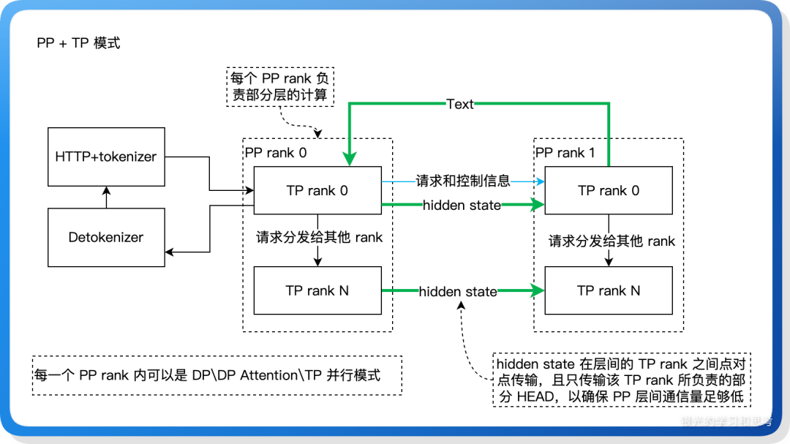

**图意解读**

- 左侧 HTTP/tokenizer 与 Detokenizer 是服务入口和输出转换进程。
- 每个虚线框代表一个 PP rank，也就是一个 TP group。
- 蓝线是请求和控制信息，通常由各 stage 的 TP rank 0 负责。
- 绿线是 hidden state 数据面，相同 TP 位置跨 stage 点对点传输。
- 图中最后 stage 把 text/token 结果回到首 stage/输出端；控制回路与 hidden state 前向链方向不同。

### 总览图

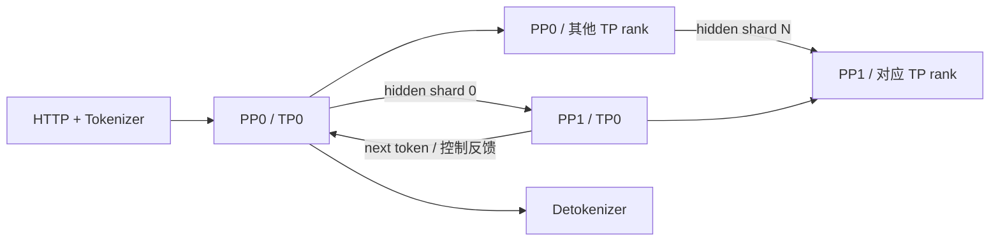

### 为什么 hidden state 不直接全量跨节点

原文描述的优化是：

1. 每个 TP rank 只把自己负责的 hidden state 分片发给下一 PP stage 的对应 TP rank；
2. 接收侧再在本地 TP group 内 all-gather；
3. 把高成本的全量恢复尽量留在节点内高速互联；
4. 跨节点只传 `1/TP` 左右的分片。

是否真的使用这一布局、哪些张量需要 all-gather，应在目标版本检查 `send_tensor_dict`、`recv_tensor_dict` 和模型输入布局。

---

## 2. 启动参数与原文限制

### 2.1 单机示例

原文示例：

```bash
python3 -m sglang.launch_server \
  --model-path /path/to/model \
  --port 30000 \
  --tp 2 \
  --pp 4
```

概念上：

- `--tp`：每个 PP rank 内有多少 TP rank；
- `--pp`：有多少 PP stage。

### 2.2 多机示例

原文给出的多机参数包括：

```text
--dist-init-addr
--nnodes
--node-rank
NCCL_SOCKET_IFNAME
```

这些参数和环境变量高度依赖 SGLang/NCCL 版本及网络环境。不要直接照抄文章中的 IP、bond 名或 `NCCL_IB_GID_INDEX`；应根据：

- `ip addr`；
- RDMA device；
- 容器网络；
- 集群调度器；
- 当前 `launch_server --help`；

确定真实值。

### 2.3 原文列出的限制

文章读取时总结了：

- `pp_size * tp_size` 与节点/GPU 布局要能合法分配；
- 模型层数必须足以让每个 PP rank 至少承担一层；
- PP 与 overlap、speculative、mixed chunk 等功能存在组合限制。

这些是**原文对应版本的限制**，不能直接当成当前 SGLang 的永久约束。仓库里的固定 commit 源码分析显示，不同模式下限制还会细分，例如 PD prefill 与普通 PP 的 speculative 支持边界不同。

### 配置检查清单

```text
总 GPU 数是否等于预期 world size
每个节点实际分到哪些 PP rank
每个 PP rank 内 TP rank 是否完整
模型层数能否按 PP 切分
首尾 stage 的 embedding/lm_head 是否放得下
当前版本是否禁用 overlap/mixed chunk/spec
```

---

## 3. 启动时怎样分配 GPU 和 rank

### 3.1 启动流程

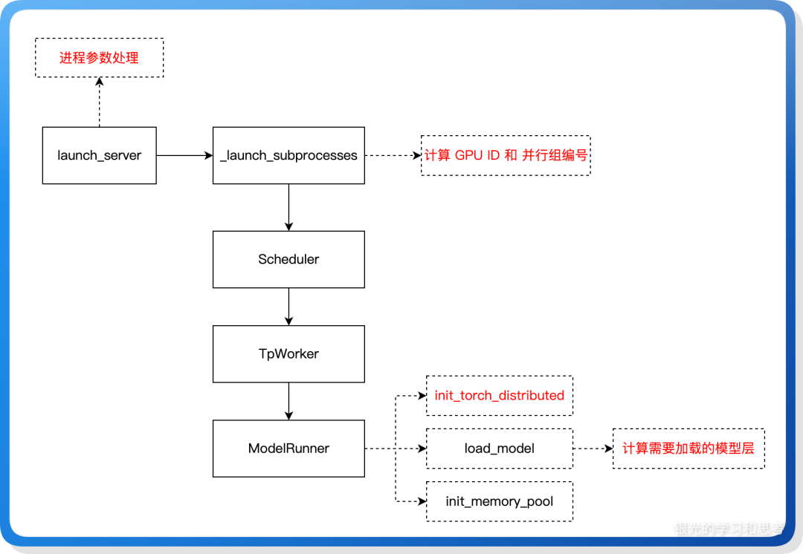

**图意解读**

- `launch_server` 先处理服务和分布式参数。
- `_launch_subprocesses` 计算 GPU ID、TP rank、PP rank 并拉起 Scheduler 进程。
- Scheduler 内部创建 `TpWorker`，后者初始化 `ModelRunner`。
- `ModelRunner` 建通信组、加载本 stage 的模型层、初始化内存池。
- 控制权从服务进程逐层下沉到 GPU worker；模型权重和 KV pool 真正属于 worker 侧。

### 3.2 原文的 GPU ID 计算

原文摘录的思路是：

1. 先计算一个 TP group 跨多少节点；
2. 求当前节点负责的 TP rank 区间；
3. 求当前节点负责的 PP rank 区间；
4. 双层遍历 `pp_rank` 和 `tp_rank`；
5. 根据 base GPU id 和步长选择本地设备。

复杂度来自两种部署：

- 一个节点包含多个完整 PP stage；
- 一个 PP stage 跨多个节点。

### 3.3 不要混淆 GPU ID 与 global rank

| 标识 | 范围 | 用途 |
| --- | --- | --- |
| local GPU ID | 单节点 | 选择 `cuda:N` |
| global rank | 整个 world | 初始化 torch distributed |
| TP rank | TP group 内 | tensor 分片与 collective |
| PP rank | PP 维度内 | 层分片与 stage 判断 |

原文给出的一个 global rank 心智公式是：

```text
global_rank = pp_rank * tp_size + tp_rank
```

它成立于特定 rank 排列。加入 DP、EP、PCP 等维度后，实际 flatten 顺序可能变化，不能脱离进程组初始化代码硬套。

---

## 4. TP group 与 PP group 怎样交叉

以 `TP=4, PP=2` 为例：

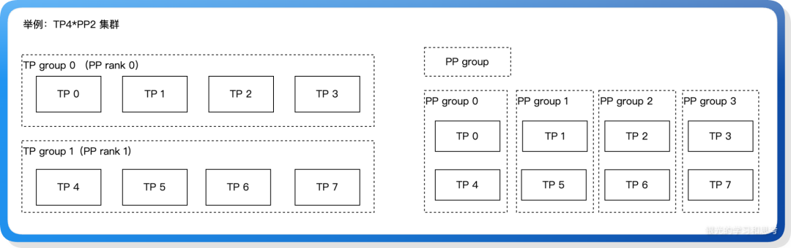

**图意解读**

- 左侧两行分别是 PP rank 0 和 PP rank 1，各自包含一个 TP4 group。
- 右侧四列是四个 PP group：`[TP0,TP4]`、`[TP1,TP5]` 等。
- TP group 用于同一模型层内的张量并行 collective。
- PP group 用于相同 TP 分片位置在相邻 stage 间传 hidden state。

### 通信组表

| 组 | 示例 | 主要通信 |
| --- | --- | --- |
| world group | `[0..7]` | 初始化、全局控制 |
| TP group 0 | `[0,1,2,3]` | all-reduce/all-gather |
| TP group 1 | `[4,5,6,7]` | all-reduce/all-gather |
| PP group 0 | `[0,4]` | P2P hidden state |
| PP group 1 | `[1,5]` | P2P hidden state |

### MoE 组是另一回事

原文还提到 MoE EP/local TP 组。理解时不要把它们混入普通 PP：

- PP group 按层串联；
- TP group 在一层内协作；
- EP group 按专家 owner 交换 token。

一个 rank 可以同时属于多个通信组，但每个组的 collective 顺序必须在成员间一致。

---

## 5. 每个 PP rank 加载哪些层

### 原文源码锚点

```text
sglang/python/sglang/srt/distributed/utils.py::get_pp_indices
```

原文整理了两种方式：

### 5.1 自定义分层

通过环境变量指定每个 stage 的层数：

```bash
export SGLANG_PP_LAYER_PARTITION="2,8"
```

概念上表示：

```text
PP0: 2 层
PP1: 8 层
```

使用前必须确认：

- 当前版本是否保留该环境变量；
- 数字个数是否等于 PP size；
- 总和是否等于模型层数；
- 首尾额外模块怎样计入显存和时间。

### 5.2 默认均衡分层

文章描述为：

- 模型层按 PP size 均分；
- 余数放到特定 stage；
- 每个 PP rank 至少一层。

“层数均衡”只是起点。MoE、lm_head、跨模态模块、不同 layer type 都可能让每层耗时不同。

### 排障例子

若 `PP=4`，只有 Stage 3 利用率 100%，其他 stage 经常等：

1. 看 Stage 3 是否多持有 lm_head；
2. 看后段是否包含更重的 MoE 层；
3. 测每 stage forward 时间；
4. 再考虑自定义 layer partition。

---

## 6. 为什么推理 PP 需要 next token 回传

### 人话版

训练 forward 一路到最后就结束。LLM decode 不一样：

1. 最后 stage 生成 token `D0`；
2. 下一轮要把 `D0` 作为新输入送回第一 stage；
3. 每个 stage 还要保留本地 KV Cache；
4. 请求结束时，每个 stage 都要知道何时释放状态。

因此流水线不只是向前传 hidden state，还要有一条 token/控制反馈回路。

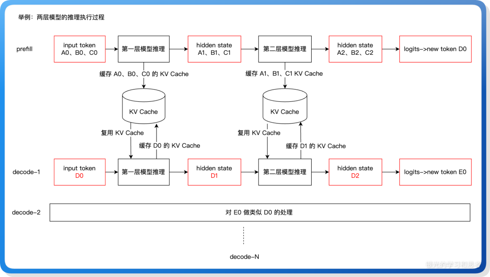

**图意解读**

- Prefill 经过两段模型层，每段把自己负责层的 A/B/C token KV 写入本地缓存。
- 最后层产生新 token `D0`。
- Decode-1 从 `D0` 重新进入第一层，同时两段模型都复用各自缓存的 A/B/C KV。
- 第一段生成新的 hidden state 传给第二段；两段又分别追加 D0 对应 KV。
- KV Cache 不沿 PP 链每轮搬运，它跟负责该层的 stage 共存。

### 回传路径

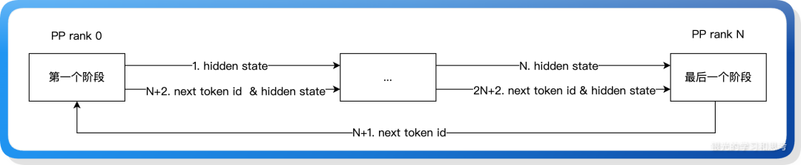

**图意解读**

- hidden state 从 PP rank 0 向最后 rank 前进。
- 最后 rank 产生 next token id，再反馈给首 stage。
- 下一轮 hidden state 可以携带上轮 token/控制状态继续向前。
- 这条回路让各 stage 最终知道请求是否完成，也解释了推理 PP 与普通单向流水线的差异。

### 为什么不一定直接广播给所有 stage

原文给出的解释是：

- 正常未结束 token 主要由首 stage 用来启动下一轮；
- 后续 stage 会随流水线推进收到所需请求状态；
- 每步广播会制造额外同步和通信热点；
- 点对点局部传播更符合流水线节奏。

这是作者对设计的解释。是否所有完成状态都只靠 next token 传播，应查看目标版本请求控制消息。

---

## 7. 一次生成 token 的关键顺序

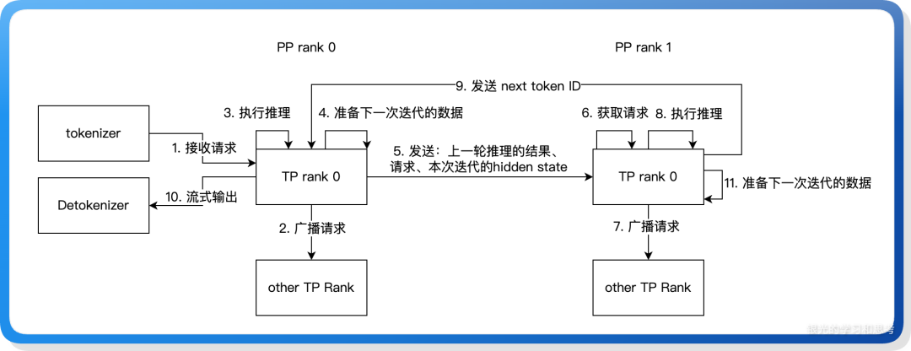

**图意解读**

- PP0 的 TP rank 0 从 tokenizer 收请求，再向本 TP group 广播。
- PP0 运行本地层后，把请求、上轮状态和本轮 hidden state 发送给 PP1。
- PP1 的 TP rank 0 接收后广播，运行后段层并生成 next token。
- next token 回到 PP0，同时 detokenizer 输出文本。
- 图把“获取请求”也当作推进信号：即使没有新 prefill，请求流水线仍要能继续 decode。

### 原文强调的三个顺序点

1. 各 stage 在本轮计算后，再准备上游结果作为下一轮输入；
2. 非首 stage 的接收可能是阻塞点，因此上游需要发送空/控制消息维持节拍；
3. 最后 PP rank 采用与其他 rank 不同的 send/recv 顺序，避免环形等待。

### 避免死锁

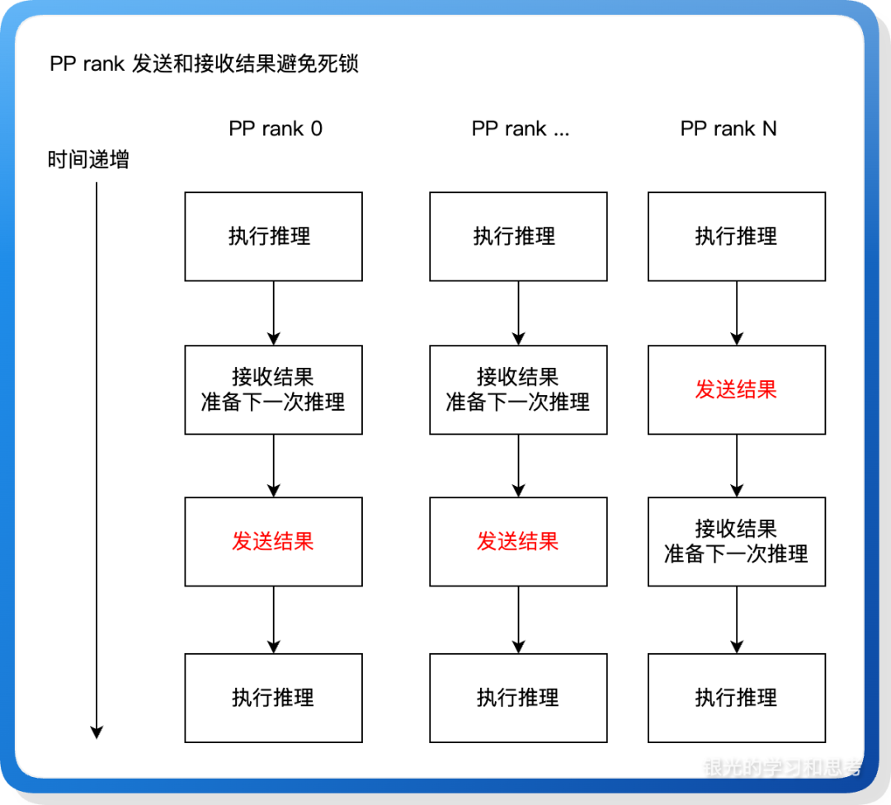

**图意解读**

- 中间 stage 通常先接收上游结果，再向下游发送。
- 最后 stage 因为还要把结果反馈到首 stage，发送/接收顺序需要打破循环等待。
- 红字突出每个 stage 何时先 send。
- 这张图表达的是“必须有一个 rank 改变顺序以断开等待环”，具体实现还可能使用非阻塞通信或批量 handle。

### 死锁的最小模型

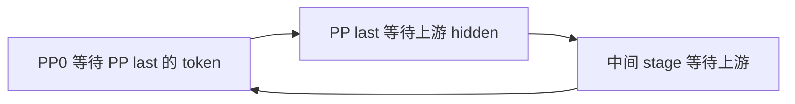

要打破环，可以：

- 让某个端点先发送；
- 使用非阻塞 `isend/irecv` 并统一 wait 顺序；
- 发送空控制帧保证接收端被唤醒；
- 将控制流和数据流分开。

---

## 8. 连续批处理怎样塞进 PP

### 人话版

decode 每次只算少量 token，单个请求无法填满 GPU。连续批处理会把：

- 已经在 decode 的旧请求；
- 刚完成 prefill、准备 decode 的新请求；

合并成一个 batch。

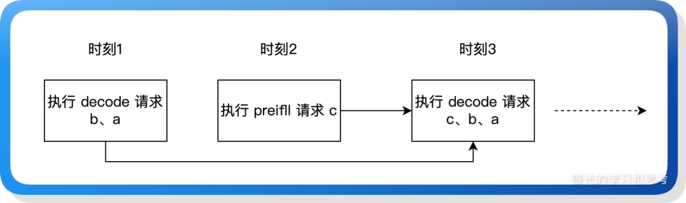

**图意解读**

- 时刻 1 执行旧请求 a、b 的 decode。
- 时刻 2 新请求 c 完成 prefill。
- 时刻 3 c 与 a、b 一起进入 decode batch。
- 在 PP 中，只有当这些请求恰好到达同一个 stage/槽位且状态兼容时，才能安全合并。

### 三个 microbatch 数组

原文把 PP event loop 的关键状态归纳为：

| 状态 | 含义 |
| --- | --- |
| `mbs` | 当前槽位即将运行的 microbatch |
| `last_mbs` | 上轮同槽位的 microbatch |
| `running_mbs` | 需要继续 decode 的历史请求 |

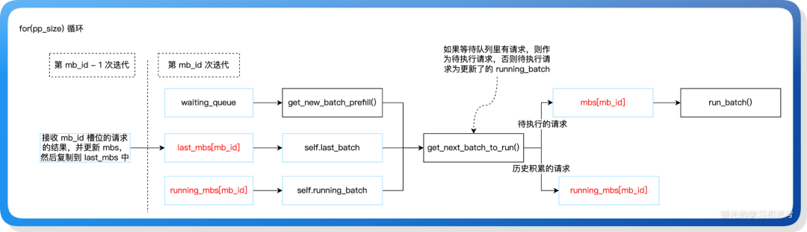

**图意解读**

- 外层按 `pp_size` 循环 microbatch 槽位。
- 接收某槽位上轮结果后，先更新 `last_mbs`。
- `get_new_batch_prefill()` 提供新请求，`running_mbs` 提供历史 decode 请求。
- `get_next_batch_to_run()` 决定当前 `mbs[mb_id]`，运行后继续保留未结束请求。
- 数组长度与 PP size 对齐，是为了让不同 stage 对同一个槽位保持通信节奏。

### 为什么用数组槽位

一条请求从 Stage 0 到 Stage N 需要多个时刻。给每个在途 microbatch 固定槽位，可以让各 stage 知道：

- 当前收的是哪个历史批次；
- 哪些请求可与 running batch 合并；
- 下游应该收到哪个 shape；
- next token 回来后更新哪个槽位。

代价是调度自由度下降。

---

## 9. 原文对槽位调度的反思

原文不只描述代码，也提出了改进猜想。这些内容属于**作者分析**，不是源码已确认缺陷。

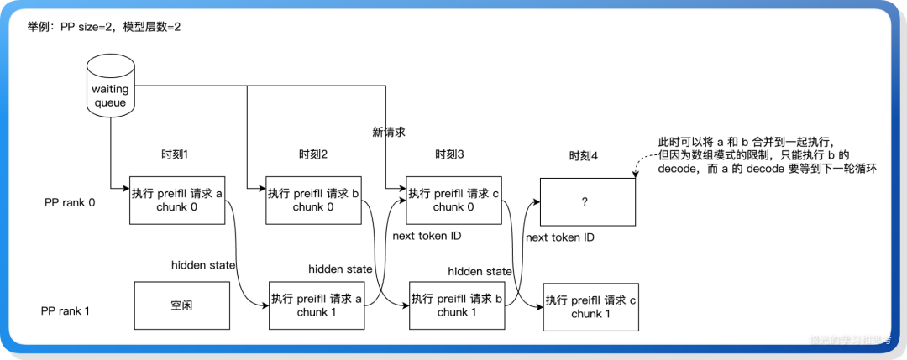

**图意解读**

- `PP=2` 时，请求 a、b、c 依次在两个 stage 流动。
- 到时刻 4，a 的 decode 已可能具备执行条件，但固定槽位只允许 b 进入当前组合。
- 作者认为如果去掉槽位限制、改用按请求状态驱动的调度，可能更早合并 a 与 b。
- 但更自由的调度也要解决跨 stage shape、一致性、反压和通信匹配，不能只把数组替换成字典。

### 作者提出的几个疑问

1. `mbs` 与 `last_mbs` 是否能合并；
2. 固定 `pp_size` 槽位是否限制连续批处理；
3. 是否向后续 stage 发送了过多请求字段；
4. send/recv 代码分散在不同文件，增加理解成本。

### 整理者归纳

槽位设计的价值是把复杂并发约束变成固定节拍；代价是牺牲部分调度自由。评价它是否“冗余”，需要同时测量：

- 更自由调度能增加多少 batch 合并；
- 元数据和控制消息增加多少；
- CUDA Graph shape 是否更碎；
- 跨 stage 是否仍能无死锁；
- 取消、抢占和 OOM 回退怎样传播。

---

## 10. 通信量推导怎样读

原文比较了一个简化例子：

```text
模型层数 = 64
GPU 数 = 8
序列长度 = 10
方案 A = PP2 × TP4
方案 B = TP8
```

按“每层两次 all-reduce、ring collective 近似、首尾 stage 当作中间 stage”等假设，文章得到：

| 配置 | PP rank 间通信 | TP rank 间通信 | 总通信量 | 相对 TP8 |
| --- | ---: | ---: | ---: | ---: |
| PP2TP4 | 20 个 hidden-state 单位 | 1920 | 1940 | 约 43% |
| TP8 | 0 | 4480 | 4480 | 100% |

### 为什么会下降

文章的直觉是：

- PP2TP4 中每张卡只负责 32 层，层内 TP collective 次数减半；
- TP 从 8 降到 4，每次 collective 的参与规模也变小；
- PP stage 间只额外传少量 hidden state；
- attention/FFN 输出投影后，TP all-reduce 张量仍是 hidden-state 维，不随本 rank head 数增大。

### 不能泛化的地方

这个推导省略或简化了：

- 首尾 stage 与中间 stage 差异；
- 实际 collective 算法；
- send/recv 是否与 TP all-gather 融合；
- batch、dtype、padding；
- 网络分层和竞争；
- MoE、MLA、量化结构；
- kernel 时间和流水线气泡。

所以它只能说明：

> 用 PP 降低跨节点 TP 规模，可能显著减少 collective 通信量。

不能据此断言 PP2TP4 一定比 TP8 快。

---

## 11. PP 与 TP 的适用边界

### 原文的理论判断

PP 可能：

- 降低单卡 TP collective 量；
- 把高频 TP 通信留在节点内；
- 支持单个 TP group 放不下的超大模型；
- 通过更粗矩阵提高某些 kernel 效率。

### 原文的实测观察

文章同时指出，在其测试条件下：

- TTFT、TPOT 可能变差；
- 吞吐没有因通信下降而提升；
- pipeline bubble 浪费算力；
- 某些 overlap/spec 功能不可用。

这组结果只适用于原文硬件、模型、版本和并发。没有完整 benchmark 配置时，不应外推。

### 选择表

| 场景 | 更偏 TP | 更偏 PP |
| --- | --- | --- |
| 单节点高速互联 | 是 | 可选 |
| 单请求低延迟优先 | 通常是 | stage 多时不利 |
| 模型跨节点放不下 | 不够 | 是 |
| 跨节点网络较弱 | 大 TP 风险高 | PP 可降低跨节点频率 |
| 请求并发高 | TP/DP | PP 更容易填满 |
| 层耗时严重不均 | TP 简单 | PP 需要定制分层 |

---

## 12. 小白排障地图

| 现象 | 可能原因 | 优先检查 |
| --- | --- | --- |
| 启动时 rank 数不对 | 节点、TP、PP 分配不合法 | global/TP/PP rank 表 |
| 某节点找不到 GPU | local GPU ID/base/step 错 | `CUDA_VISIBLE_DEVICES`、本地编号 |
| 初始化通信 hang | 不同进程创建 group 顺序不一致 | world/TP/PP group 成员 |
| 某 stage OOM | 层或首尾模块不均 | layer partition、lm_head |
| 后续 stage 一直阻塞 | 上游未发数据或空控制帧 | send/recv 顺序 |
| 生成一个 token 后卡住 | next token feedback 未回到首 stage | last rank 回传路径 |
| hidden state shape 不一致 | TP 分片与接收侧 all-gather 不匹配 | key/shape/dtype |
| decode 请求无法合并 | microbatch 槽位不同 | `mbs/last_mbs/running_mbs` |
| GPU 利用率周期性掉零 | pipeline bubble 或 stage 不平衡 | stage timeline |
| PP 比 TP 慢很多 | 并发不足、跨节点慢、功能被禁用 | microbatch 数、网络、启动日志 |

### 源码核对路线

若要把本文升级为固定版本源码分析，建议依次查：

```text
launch_server / Engine 子进程创建
-> Scheduler PP event loop
-> initialize_model_parallel
-> get_pp_indices
-> ModelRunner/TpWorker forward
-> send_tensor_dict / recv_tensor_dict
-> mbs / last_mbs / running_mbs 更新
-> last stage sampled token 回传
```

每一步都要记录 commit、分支和工作区状态。

---

### 12.1 HiCache 的 PP 同步入口：先区分计数传播与本地完成

**2026-09-16 独立源码补充：** 本节依据官方 `72d5c5bb73`；不把这一版本行为归给原文使用的旧版 SGLang。实际读取目录和只读边界见下面两篇专题。

HiCache 的 `_all_reduce` 在 PP0 的 attention 相关组上先归约，再通过 `_pp_sync` 沿 PP 传播结果。对于 write/load ACK，各 stage 按同样数量和顺序消费，但仍需等待自己的 finish event。接到消费数量不等于本 stage 的设备传输已经结束。

这与 PP 传 hidden states、尾 stage 回传 token 是不同通路：缓存协调处理可复用数据的就绪与生命周期，proxy 通路处理本轮模型中间结果。

- [HiCache 前缀命中源码学习文档](<HiCache 前缀命中源码学习文档.md>) — 从请求键、页对齐和树匹配走到回载后的实际设备前缀。
- [HiCache 下 SGLang L1、L2、L3 与上传回载源码学习文档](<HiCache 下 SGLang L1、L2、L3 与上传回载源码学习文档.md>) — 逐步追踪 D2H、L3 上传/预取、H2D、事件和资源释放。

## 13. 一句话总结

**SGLang PP 把模型层分给多个 TP group，用 PP group 传 hidden-state 分片，并用 next-token 反馈和固定 microbatch 槽位维持多轮 decode；它能降低大 TP 的通信与容量压力，但会引入气泡、stage 平衡和复杂控制状态。**

## 14. 参考与延伸

- [SGLang 的 PP 模式浅析](https://mp.weixin.qq.com/s/HrFY_uz4U5GFRNo0U2E40A)
- [PD 分离下的 PP 源码学习文档](./PD%20分离下的%20PP%20源码学习文档.md)
- [vLLM Pipeline Parallel 流水线并行学习文档](../vllm/vLLM%20Pipeline%20Parallel%20流水线并行学习文档.md)

本文是对原文图文和作者分析的二次整理，不代表当前 SGLang 主干行为。原文中的源码锚点、限制和通信量结论应在目标版本重新验证。
