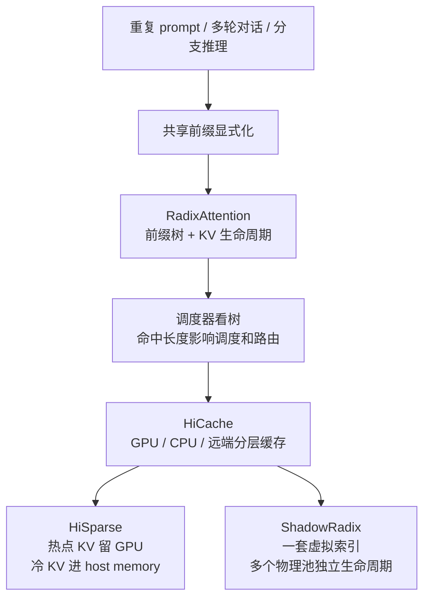
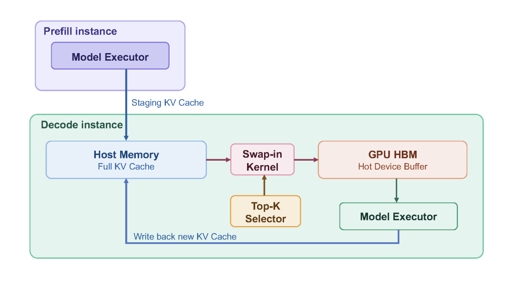
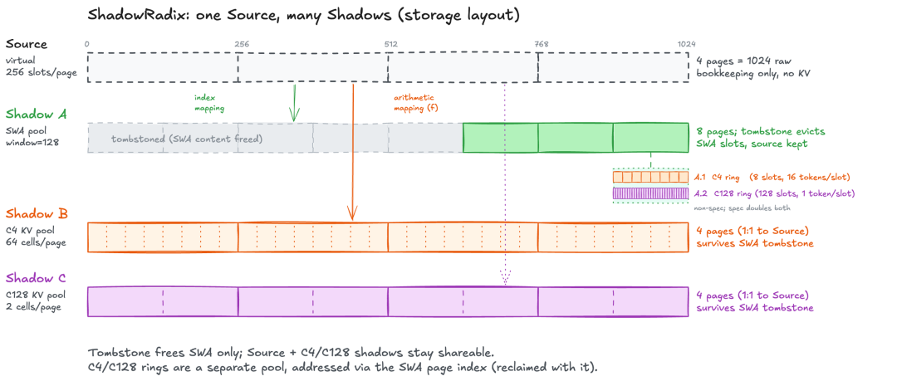

# SGLang RadixAttention 与 HiCache KV Cache 技术主线学习文档

本文面向第一次了解 SGLang KV Cache 演进线的同学，整理原文《SGLang 如何管理 KV Cache：从 RadixAttention 到 HiCache 的底层技术主线》的图文内容。本文是第三方资料整理型学习笔记，只基于原文和配图做结构化归纳，不做 SGLang 源码级复核。

## 0. 阅读基线与范围

| 项目 | 内容 |
| --- | --- |
| 原文标题 | SGLang 如何管理 KV Cache：从 RadixAttention 到 HiCache 的底层技术主线 |
| 原文链接 | <https://mp.weixin.qq.com/s/BakRqb-l2IhHeQFc5TCp1Q> |
| 作者 | Lychee & Ethan |
| 读取时间 | 2026-07-17 |
| 整理范围 | RadixAttention、调度器如何利用前缀树、HiCache、HiSparse、ShadowRadix |
| 不展开内容 | 不做源码级复核；不展开 Mooncake backend 细节，相关内容见已有 Mooncake x SGLang 文档 |

**术语速查**

| 术语 | 人话解释 | 在本文中的重点 |
| --- | --- | --- |
| KV Cache | 模型为历史 token 保存的 key/value 状态 | 避免每次请求都重算共享前缀 |
| 共享前缀 | 多个请求开头相同的一段 token | SGLang 把它当成系统资产管理 |
| RadixAttention | 用 radix tree 组织共享前缀和 KV 生命周期 | SGLang KV 管理的第一条主线 |
| HiCache | GPU、CPU、远端存储的分层 KV cache | 把“是否命中”扩展成“在哪一层命中” |
| HiSparse | 稀疏注意力下的层级显存管理 | 只把热点 KV 留在 GPU |
| ShadowRadix | 多个物理存储池共享一套虚拟前缀索引 | 为复杂注意力路径做生命周期隔离 |
| TTFT | Time To First Token，首 token 延迟 | 前缀复用最直观影响的指标 |

---

## 1. 先建立整体地图

### 人话版

SGLang 的 KV Cache 主线可以用一句话概括：先把“共享前缀”变成系统能看见、能调度、能迁移、能淘汰的资产，再围绕它扩展存储层级和模型结构支持。

这条线大致分四步：

1. RadixAttention 把共享前缀组织成一棵会生长的树。
2. 调度器开始“看树说话”，把命中长度纳入请求优先级和路由。
3. HiCache 把树节点的位置从 GPU 扩展到 CPU 和远端存储。
4. HiSparse 与 ShadowRadix 处理更长上下文和更复杂注意力结构下的显存压力。

### 总览图



### 例子

如果很多请求都以同一个长 system prompt 开头，传统做法像每个请求都重新抄一遍讲义；SGLang 的做法是先把这段讲义挂到一棵前缀树上，后续请求沿树找到已经算过的 KV，再只计算新增后缀。

---

## 2. RadixAttention：把共享前缀变成一棵树

### 人话版

RadixAttention 的核心不是 attention kernel，而是缓存组织方式。它不把 KV 看成每个请求私有的一张草稿纸，而是把多个请求共享的前缀折叠进一棵 radix tree。

树上的节点不只是“某段文本”的索引，还绑定了这段 token 对应 KV 的状态：它是否仍在缓存里、有没有被锁住、最近有没有被访问、淘汰时优先级如何。

### RadixAttention 操作图


### 图意解读

这张图展示了 RadixAttention 的几个关键动作：

- 新请求进入时，会沿已有分支匹配共享前缀。
- 如果新请求只和已有节点共享前半段，树会把共享边界切出来。
- 新增 suffix 会作为新节点挂到树上。
- 被淘汰的节点会从可复用路径中移除，但树结构仍服务后续匹配。

图里真正重要的是“共享边界会被动态显式化”。系统不是只有完整 prompt 命中才受益，而是能把越来越细的共享前缀变成可复用节点。

### 机制拆解

| 设计点 | 作用 |
| --- | --- |
| 命名空间隔离 | 相同 token 前缀在不同租户、adapter 或隔离空间下不能串用 |
| 动态切割 | 命中到已有节点中间时，把共享部分切成新节点 |
| 增量插入 | 复用已有路径，只为新增后缀创建节点 |
| 生命周期状态 | 节点既表示前缀，也承载锁定、访问和淘汰信息 |

### 小例子

两条请求：

```text
请求 A: system prompt + 问题 1
请求 B: system prompt + 问题 2
```

RadixAttention 不会为两条请求各自保存一份完整 system prompt。它会把 system prompt 作为共享路径保留，问题 1 和问题 2 分别成为分叉后的后缀。

---

## 3. 调度器也学会了看树

### 人话版

只把前缀放进树还不够。真正有价值的是调度器能看到这棵树，并把命中长度变成调度依据。

等待队列中的请求会先去树上匹配自己命中了多少前缀。命中越长，prefill 需要做的重复计算越少；多个请求共享路径越多，就越适合被凑到一起批量处理。

### 机制拆解

| 调度问题 | 前缀树能提供的信息 |
| --- | --- |
| 哪个请求更值得先跑 | 命中长的请求可能更快进入 decode |
| 哪些请求适合一起 batch | 共享路径高度重叠的请求更容易复用 |
| 多机时发到哪里 | 发到更可能已有该前缀的 worker |
| 资源是否该保留 | 高频共享前缀比一次性后缀更值得留 |

### 排障提示

如果系统宣称开启了 prefix cache，但 TTFT 没有下降，先不要只看 GPU kernel。应该确认：

- 请求之间是否真的有共享前缀。
- 共享前缀是否落在同一命名空间。
- 调度器是否能看到命中长度。
- 请求是否被路由到已有前缀的 worker。

---

## 4. HiCache：从 GPU 桌面扩展到书架和仓库

### 人话版

RadixAttention 主要把 KV 保存在 GPU 显存里。GPU 快，但容量小。HiCache 做的是把缓存层级扩展出去：GPU 像桌面，CPU host memory 像旁边书架，远端存储像仓库。

树节点从“有没有缓存”升级为“这段前缀在哪一层”。命中后，系统要决定从哪一层取回、是否值得等待、prefill 后的新 KV 要写回哪一层。

### HiCache 控制流图


### 图意解读

图里有三条线：

- Scheduler 从 Request Queue 取请求，并查询/更新 HiRadixTree。
- GPU Executor 执行模型，并通过 Cache Controller 读写 KV。
- Cache Controller 在 GPU HBM、CPU DRAM 和 External Storage 之间做 store/load。

这说明 HiCache 不是简单把缓存“搬远一点”。它仍然以共享前缀树为控制中心，只是每个节点多了分层存放和跨层恢复的能力。

### 机制拆解

| 层级 | 人话解释 | 主要收益 | 主要代价 |
| --- | --- | --- | --- |
| GPU HBM | 桌面上摊开的书 | attention 直接使用，最快 | 容量最小 |
| CPU DRAM | 旁边书架 | 容量更大，适合保留中热前缀 | 需要搬回 GPU |
| External Storage | 远处仓库 | 跨实例、长周期保留 | 查询和取回延迟更高 |

### 边界说明

原文提到一些实际部署收益数字，例如 TTFT 下降和吞吐提升。这些数字要和具体模型、负载、硬件、并发条件一起理解，不能泛化成“打开 HiCache 必然提升固定倍数”。

---

## 5. HiSparse：只把热点 KV 留在 GPU

### 人话版

稀疏注意力不需要每个历史 token 在每一步都参与计算。很多 KV 只是占着显存，但当前 decode 步并不活跃。

HiSparse 的思路是：GPU 上只保留热点 KV，把不活跃 KV 推到 host memory；需要时再拉回来。

### HiSparse 图



### 图意解读

这张图里，decode instance 有三块关键区域：

- Host Memory 保存完整 KV Cache。
- GPU HBM 只保留 hot device buffer。
- Top-K Selector 决定哪些条目需要 swap-in 到 GPU。

Prefill instance 生成 staging KV Cache 后交给 decode。Decode 在运行中把新 KV 写回 host memory，同时根据稀疏注意力需要把热点条目拉回 GPU。

### 机制拆解

HiSparse 的重点不是“把 KV 放到 CPU”这么简单，而是把判断缺失、选择淘汰、更新地址映射和触发搬运压到更靠近计算的路径里，减少频繁同步。

### 适用窗口

HiSparse 更像高并发长上下文压力下的突破口：

- 高并发、长上下文、GPU 显存紧张时更容易受益。
- 低并发或访问不够稀疏时，I/O 开销可能盖过收益。
- 性能图或吞吐数字必须和原文给定并发、模型、上下文条件一起引用。

---

## 6. ShadowRadix：一棵虚拟树，多个物理池

### 人话版

更复杂的注意力结构可能让同一个 token 同时对应多条 KV 路径：有的保留最近原始 token，有的保留压缩后的稀疏检索状态，有的保留更粗粒度的全局状态。

如果这些路径强行共用同一个物理生命周期，就会互相误伤：某一路径淘汰了条目，另一路径可能还需要它。

ShadowRadix 的思路是：上层仍然用一棵统一的虚拟前缀索引做匹配，但底下映射到多个独立物理存储池。每个池自己决定保留和淘汰。

### ShadowRadix 图



### 图意解读

图上方的 Source 是统一虚拟坐标轴；下面的 Shadow A、B、C 是不同物理布局：

- Shadow A 有滑窗相关的 tombstone 和 ring。
- Shadow B、C 保持不同压缩比例或不同 page/cell 布局。
- 虚拟 source 不直接等于某个物理池，而是被映射到多个 shadow。

重点是生命周期隔离：一个物理池释放了自己的条目，不应该把其他池还需要的前缀一起清掉。

### 小例子

可以把 ShadowRadix 想成一本书有三种笔记：

- 原文摘抄。
- 章节摘要。
- 全书索引。

三种笔记都对应同一本书的同一段内容，但它们的保存粒度和淘汰规则不一样。ShadowRadix 让它们共享“是哪段内容”的虚拟坐标，却各自管理物理存储。

---

## 7. 一句话总结

SGLang KV Cache 的主线不是单个缓存技巧，而是一套围绕共享前缀建立的 runtime 哲学：RadixAttention 让共享前缀变成树，HiCache 让树节点跨层流动，HiSparse 让热点 KV 留在 GPU，ShadowRadix 让复杂注意力路径共享索引但隔离生命周期。

## 8. 参考与延伸

- 原文：<https://mp.weixin.qq.com/s/BakRqb-l2IhHeQFc5TCp1Q>
- 原文作者：Lychee & Ethan
- 本文图片来自原文页面，已下载到 `../images/sglang-kv-cache-mainline/`。
- 本文基于原文整理，未做 SGLang 源码级复核；用于生产决策前需要再对照当前源码和实际负载验证。
