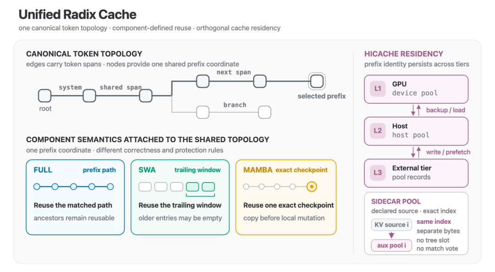
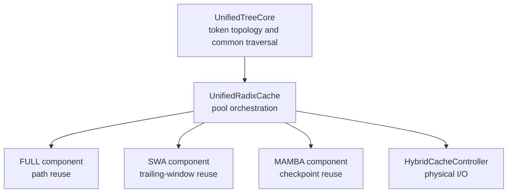
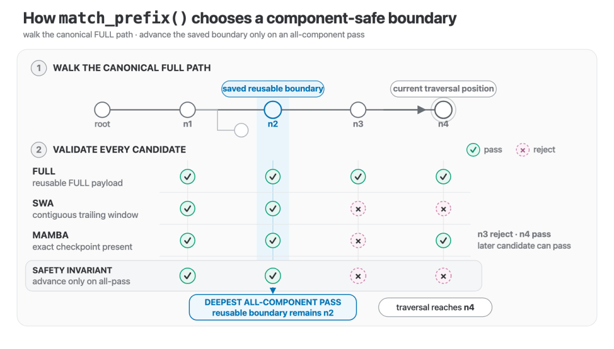
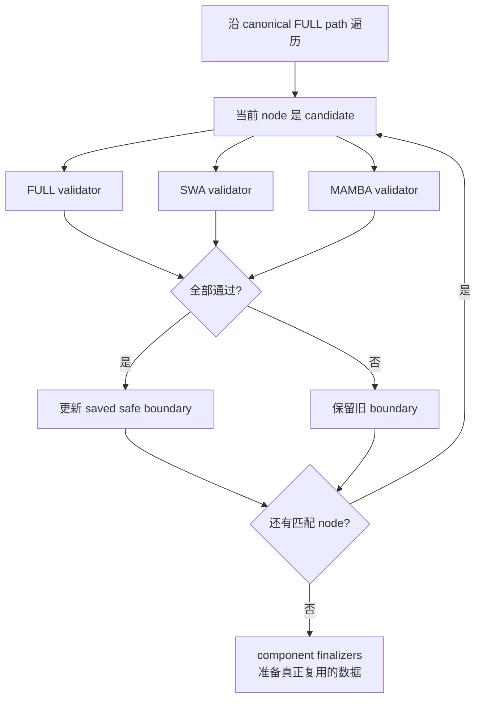
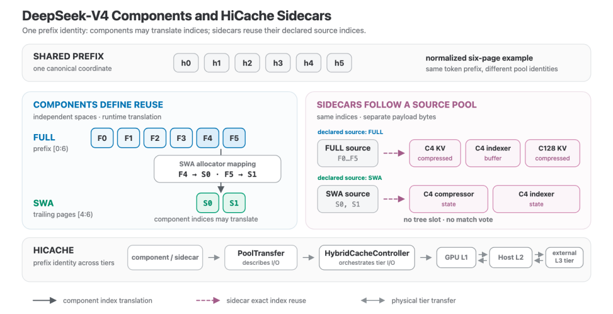
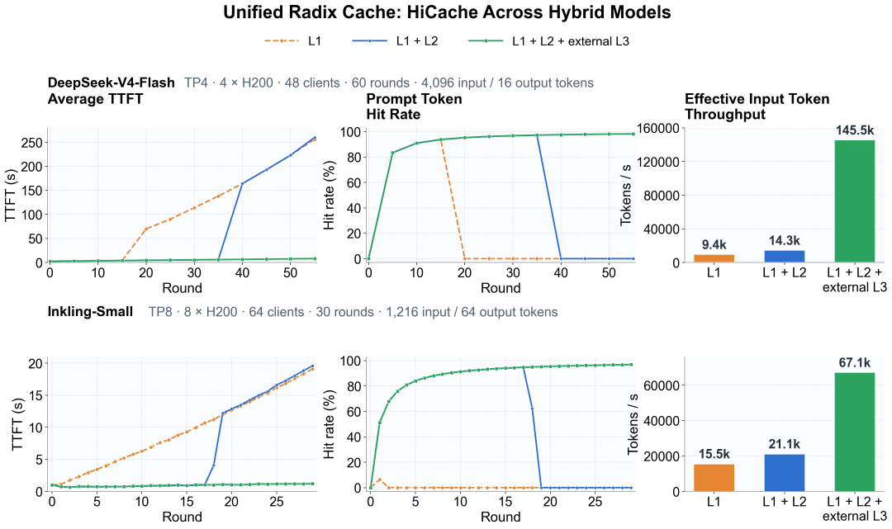
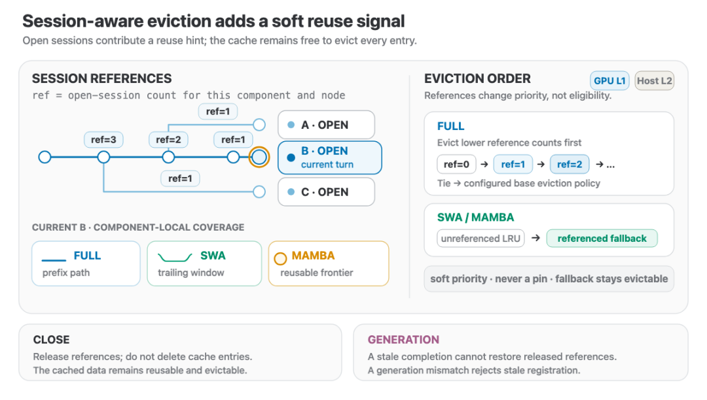
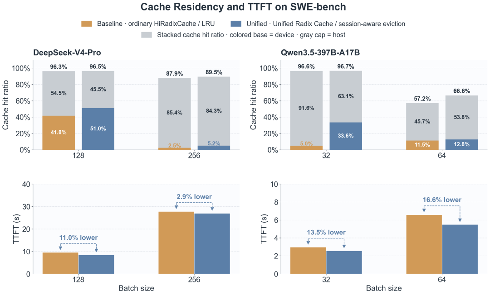
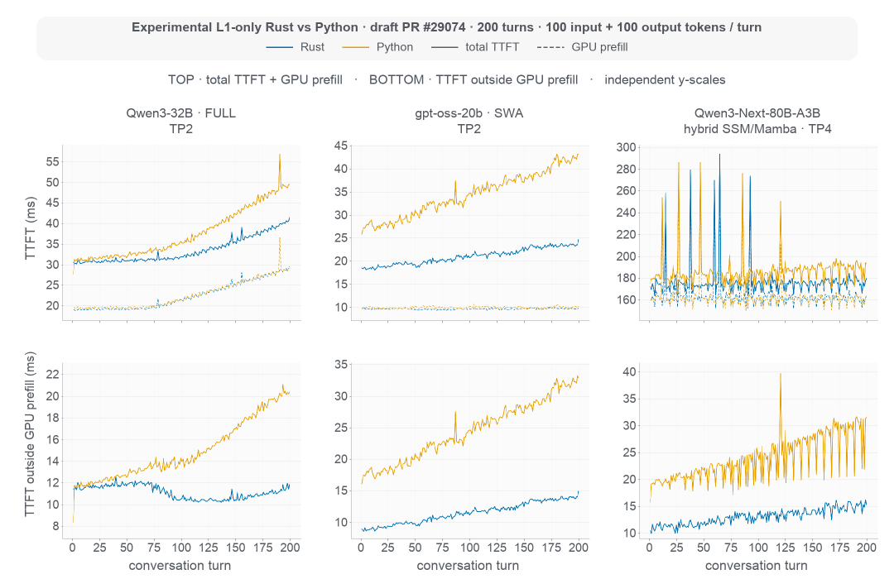
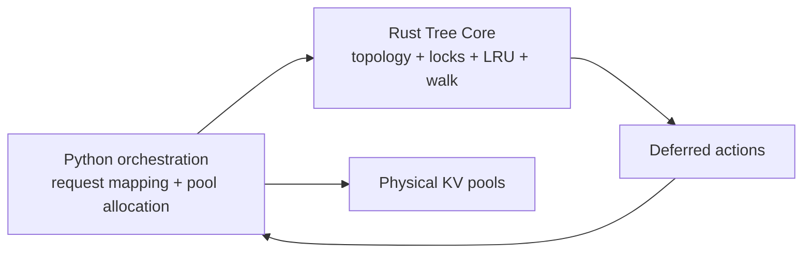

# SGLang Unified Radix Cache 学习文档

本文面向已经理解普通 Prefix Cache 和 Radix Tree、但第一次接触 Hybrid Model 缓存的人。核心问题是：Full Attention KV、Sliding Window KV 和 recurrent state 共享同一段 token 前缀，却没有相同的可复用边界，SGLang 如何避免为每种模型组合再造一套缓存树。

本文是第三方资料整理型学习资料。中文公众号文章已与 LMSYS 官方原文交叉核对，但本文不做 SGLang 源码审计或 benchmark 复现。

## 0. 阅读基线与范围

| 项目 | 内容 |
| --- | --- |
| 原文标题 | 《SGLang 团队推出新架构：Unified Radix Cache 统一混合模型的 Prefix Caching！》 |
| 原文链接 | <https://mp.weixin.qq.com/s/MgRzOhCdzxPTboAs8m6-iw> |
| 作者/机构 | 卡工 |
| 发布时间 | 2026-08-12 |
| 官方原文 | [Unified Radix Cache: One Tree for Hybrid Model Prefix Caching](https://www.lmsys.org/blog/2026-08-11-unified-radix-cache) |
| 官方作者 | Zhangheng Huang、Ke Bao、Yi Zhang、Jialin Ouyang、Sicheng Pan |
| 读取时间 | 2026-08-25 |
| 资料类型 | 架构解读 |
| 整理范围 | 统一 token topology、TreeComponent、复用边界投票、HiCache、sidecar、session-aware eviction、Rust Tree Core |
| 不展开内容 | 当前源码文件级实现、启动参数的版本兼容矩阵、完整 benchmark 复现 |
| 验证边界 | 架构、函数名与性能条件对照官方文章；性能数字均为官方原文报告，不泛化到其他模型和负载 |

### 术语速查

| 术语 | 人话解释 | 容易混淆的点 |
| --- | --- | --- |
| Prefix identity | “这段 token 前缀是谁” | 不等于所有状态都能复用到该边界 |
| Reuse validity | 某类状态在这个边界是否仍正确 | 由各 component 自己判断 |
| Residency | payload 当前在 GPU、Host 还是外部存储 | 不改变前缀身份和复用规则 |
| FULL | Full Attention KV component | 复用完整匹配路径 |
| SWA | Sliding Window Attention component | 只要求末尾连续窗口 |
| MAMBA | recurrent checkpoint component | 只在精确 frontier checkpoint 复用 |
| Anchor | 定义复用语义或索引空间的 component | 会参与边界和生命周期 |
| Sidecar | 跟随某个 source pool 的辅助 payload | 不参与 match 投票，不新增 tree slot |
| Tombstone | payload 已空但树坐标仍保留 | 其他 component 可能仍依赖该 node |

## 1. 先建立三层心智模型

Unified Radix Cache 最重要的拆分是：身份、正确性和存放位置不是一回事。

```text
Prefix identity: 共同的 token topology
Reuse validity:  FULL / SWA / MAMBA 各自判断
Residency:       GPU L1 / Host L2 / External L3
```



**图意解读：** 上半部分只有一棵 canonical token topology。FULL、SWA 和 MAMBA 把各自语义挂到相同 prefix coordinate 上；右侧 HiCache 只决定 payload 驻留层。Sidecar 复用 source pool 的索引，但不改变树行为。

### 为什么 Hybrid Model 打破普通前缀命中

假设请求前缀匹配到 1000 tokens：

- FULL KV 可以复用完整 1000-token path；
- SWA 层如果窗口是 256，只需要末尾连续 256 个 slots 正确；
- recurrent state 可能只在第 896 token 有一个可用 checkpoint；
- 某个压缩 KV 或 Indexer buffer 可能跟随 FULL/SWA 的 page index，但不定义新边界。

如果强迫所有状态共用“1000”或“896”一个边界，要么丢掉本可复用的 FULL/SWA，要么错误复用无 checkpoint 的 recurrent state。

## 2. 从 Cache Class Matrix 到一棵树加 Components

### 旧问题：组合爆炸

若为每个组合写一个专用 cache class：

```text
FullCache
FullSwaCache
FullMambaCache
FullSwaMambaCache
FullSwaMambaHiCache
...
```

matching、split、insert、lock、evict 会被重复实现。每加一种状态或存储层，组合数量继续增长。

### 新结构



`UnifiedTreeCore` 负责公共树状态机；`UnifiedRadixCache` 协调 memory pool；每个 `TreeComponent` 只实现不同的正确性和生命周期规则。新模型能表达为已有 component 组合时，不再需要新树。

## 3. 三种复用语义

| Component | 可复用条件 | 锁定范围 | 复用前动作 |
| --- | --- | --- | --- |
| FULL | 共享 prefix path 上 KV 有效 | ancestor path | 复用对应 KV positions |
| SWA | candidate 末尾有连续 window | trailing window | 允许更早 slot 是 tombstone |
| MAMBA | frontier 有精确 recurrent checkpoint | 单个 checkpoint/frontier | 复制到请求私有 slot 后再修改 |

### 为什么 recurrent state 要 copy-on-reuse

FULL KV 对历史 token 通常是只读的；多个请求可以共享同一段前缀。Recurrent state 会继续被后续 token 原地演化。如果两个请求直接修改同一个共享 checkpoint，会互相污染。因此复用时先复制成请求私有状态，再从该 checkpoint 分叉。

可以把它理解成：FULL KV 更像只读页共享，MAMBA checkpoint 更像 copy-on-write 起点。

## 4. `match_prefix()`：遍历深度不等于安全复用深度



**图意解读：** Tree Core 可以沿 FULL path 走到 `n4`，但只有 `n1`、`n2` 被所有 active components 接受，因此保存的最深安全边界是 `n2`。`n3` 被拒绝后仍继续遍历，因为某个 component 可能在更后面的 node 再次满足自己的局部条件；最终边界仍要求 all-pass。

### 控制流



这里有两个边界：

1. **Traversal boundary**：token path 最远走到哪里。
2. **Reusable boundary**：所有 component 都能正确复用到哪里。

把两者混为一谈，会在 Hybrid Model 上造成错误命中。

## 5. Component hooks 覆盖整棵树生命周期

| 生命周期 | Component 决定什么 |
| --- | --- |
| Match | validator 是否接受 candidate；finalizer 如何准备选中 payload |
| Split | Radix Node 切分时 component data 如何重分配 |
| Insert | overlap 如何更新、哪些 pool indices 归该 component |
| Lock | 保护整条 path、trailing window 还是单 checkpoint |
| Evict | 哪些 device/host payload 先回收，node 是否还能保留 |

### Tombstone 为什么必要

删除某个 component 的 payload 不一定要删 node：

```text
node N
  FULL payload: present
  SWA payload:  evicted -> tombstone
  MAMBA state:  present
```

N 仍然是 FULL/MAMBA 的 prefix coordinate。若 SWA 恢复或重新写入，可以重新挂回同一 identity。树节点因此不是某个具体 pool slot 的同义词。

## 6. Component、Anchor 与 Sidecar



**图意解读：** FULL 和 SWA 有不同复用边界和独立 index space，因此是 components。压缩 KV、indexer buffer、compressor state 跟随已有 FULL 或 SWA page index，不参与边界投票，因此注册为 sidecar。底部 HiCache 按 component/sidecar 描述执行跨层 I/O。

### 判断规则

问一个 physical pool 是否需要 component，可用两问：

1. 它是否定义新的“什么时候能复用”？
2. 它是否需要独立参与 matching、locking 或 eviction correctness？

若答案都是否，它更可能是 sidecar：保存独立字节，但跟随某个 source pool 的精确索引和迁移。

### 所有权边界

| 对象 | 拥有什么 | 不拥有什么 |
| --- | --- | --- |
| Tree Core | prefix topology、遍历与公共状态机 | 物理 KV 分配 |
| Component | 复用/锁定/淘汰语义 | 整个缓存控制器 |
| Sidecar | 自己的 payload | 新复用边界 |
| HybridCacheController | tier 间物理 I/O | prefix correctness 规则 |

## 7. HiCache：位置变化，身份不变

Component 决定“能不能复用”，HiCache 决定“数据在哪”。payload 从 GPU L1 移到 Host L2 或 external L3 时，prefix identity 和 component rule 不应改变。

### 多轮实验



**图意解读：** 两组实验分别使用 DeepSeek-V4-Flash（4×H200、TP4、48 clients、60 rounds、每轮 4096 input + 16 output）和 Inkling-Small（8×H200、TP8、64 clients、30 rounds、每轮 1216 input + 64 output）。L1/L2 容量到顶后命中率下降，external L3 继续保留增长的会话前缀。上下两行模型、GPU 数和请求形状不同，只能在各自行内比较 tiers。

官方原文报告：

| Workload | L3 后期命中 | TTFT | Effective input throughput |
| --- | ---: | ---: | ---: |
| DeepSeek-V4-Flash | 约 98% | 低于 9 s | 145.5K tokens/s |
| Inkling-Small | 96.8% | 1.23 s | 67.1K tokens/s |

`effective input-token throughput` 的分子使用完整 prompt 长度，包含已经命中的 prefix tokens，因此衡量的是 prefix reuse 下系统推进请求的速度，不是纯 Prefill FLOP throughput。

## 8. Session-aware eviction：引用是软信号，不是 pin

普通 LRU 只知道最近是否访问，不知道某个 prefix 属于仍活跃、下一轮很可能继续使用的 Agent session。



**图意解读：** session reference 为 FULL path、SWA trailing window 和 MAMBA frontier 提供不同覆盖范围。被 reference 的 entry 降低淘汰优先级，但必要时仍能被淘汰；关闭 session 只释放 retention signal，不立即删除仍可复用的数据。

### 为什么需要 generation 和 closed-session tombstone

若 session 已 close/reopen，旧请求随后才完成，它不能把旧 reference 注册回来。generation 区分新旧 session 生命周期，有限 tombstone 记住刚关闭的世代，避免迟到完成事件复活过期保留信号。

### SWE-bench 结果边界



**图意解读：** 上半部堆叠 device/host hit，下半部比较 TTFT。实验同时从普通 HiRadixCache/LRU 切到 Unified Radix Cache/session-aware eviction，因此不是只改变 eviction policy 的独立 ablation。原文报告不同模型/批量点 TTFT 下降 2.9%～16.6%，只能在图中给定条件下理解。

## 9. Rust Tree Core：让状态机可替换，不移动 pool 所有权

随着 prefix 变长，tree traversal、lock bookkeeping、LRU update 和 eviction scan 会进入 scheduler critical path。Unified Radix Cache 先把 tree state machine 与 pool orchestration 分开，才有条件替换 Tree Core 实现。



**图意解读：** 实验性 Rust prototype 只支持 L1，负责拓扑、component lock、intrusive LRU 和遍历；Python 仍拥有 request-token mapping 与物理 KV 分配。底部 `TTFT - GPU prefill interval` 还包含调度、同步、采样、detokenize 和 transport，不能直接叫“CPU 时间”。

官方 prototype 报告 SWA workload 在全部 200 turns 上 TTFT 下降 38%，最后 25 turns 下降 42%；FULL 和 Hybrid SSM 收益更小。它说明长树 bookkeeping 可能成为瓶颈，不证明任意模型换 Rust 都会得到同样收益。

### 所有权边界



Rust 返回 deferred actions，再由 Python 应用到实际 pool。这能保持“树状态机可替换”，同时避免两种语言同时拥有物理 KV 生命周期。

## 10. 小白排障地图

| 现象 | 优先检查 |
| --- | --- |
| FULL 前缀很长，Hybrid 模型却只命中一部分 | 哪个 component validator 拒绝了更深 boundary |
| SWA payload 淘汰后树节点仍存在 | 是否是其他 component anchor 或 tombstone，未必是泄漏 |
| recurrent state 复用后分支互相污染 | checkpoint 是否先复制到请求私有 slot |
| sidecar 数据与主 KV 错位 | declared source pool 和 index translation 是否一致 |
| L3 命中高但 TTFT 仍高 | 回载延迟、prefetch 时机、带宽与排队 |
| session close 后内存没立刻下降 | close 释放的是软引用，不是强制删除 cache entry |
| Rust residual 降了但 TTFT 变化小 | GPU forward 是否仍占主导，residual 不是纯 CPU 时间 |

## 11. 一句话总结

Unified Radix Cache 用一棵 token tree 统一 prefix identity，再让 FULL、SWA、MAMBA components 分别决定复用、锁定和淘汰语义；HiCache 只改变 payload 驻留层，sidecar 只跟随已有索引，这样 Hybrid Model 能组合新状态而不再复制整套缓存树。

## 12. 参考与延伸

- 中文整理：<https://mp.weixin.qq.com/s/MgRzOhCdzxPTboAs8m6-iw>
- LMSYS 官方原文：<https://www.lmsys.org/blog/2026-08-11-unified-radix-cache>
- Unified Radix Cache roadmap：<https://github.com/sgl-project/sglang/issues/20415>
- Agentic KV Caching roadmap：<https://github.com/sgl-project/sglang/issues/21846>
- [SGLang RadixAttention 与 HiCache KV Cache 技术主线学习文档](SGLang%20RadixAttention%20与%20HiCache%20KV%20Cache%20技术主线学习文档.md)
- [SGLang KV Pool、请求视图与 HiCache 工程学习文档](SGLang%20KV%20Pool、请求视图与%20HiCache%20工程学习文档.md)
