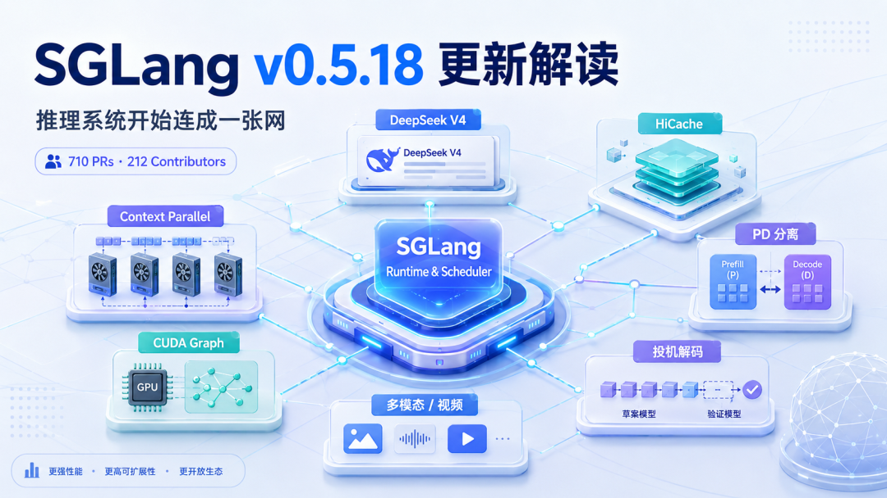
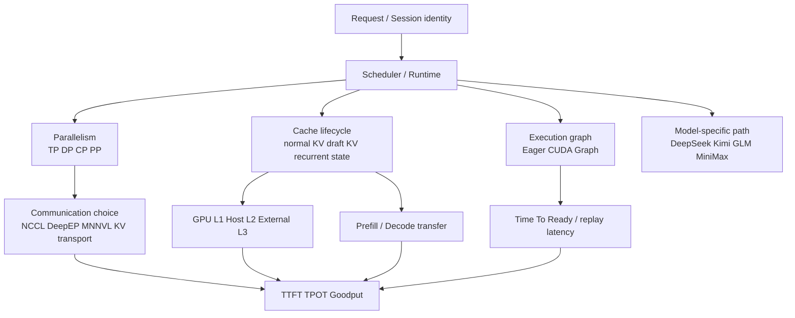
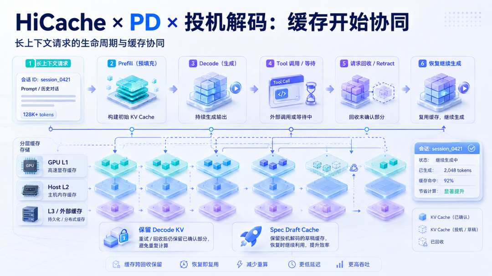
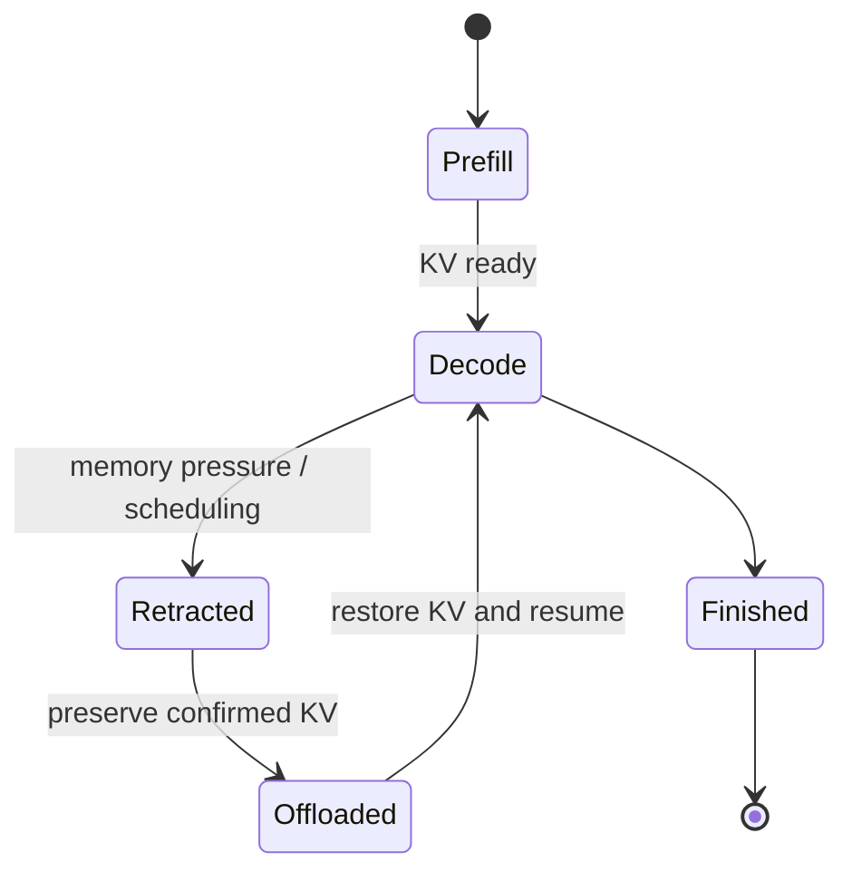
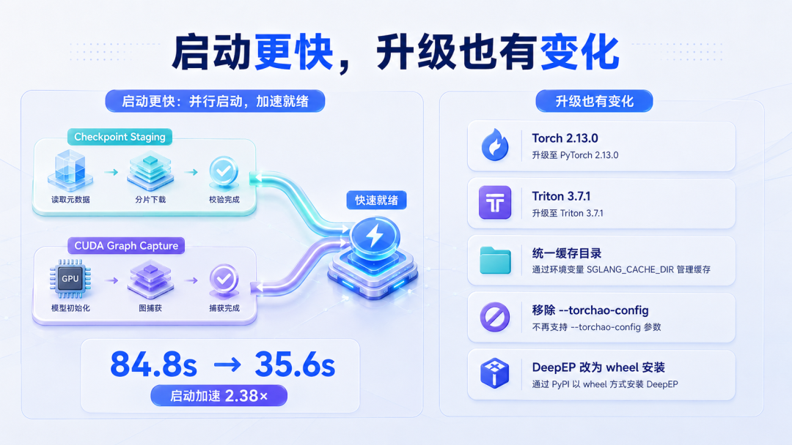

# SGLang v0.5.18 推理系统协同演进学习文档

本文面向已经知道 Prefill、Decode、KV Cache 和基本并行方式，希望理解 SGLang 版本演进主线的同学。它不逐条复述 710 个 PR，而是回答一个更有迁移价值的问题：为什么通信、长上下文、分层缓存、投机解码、CUDA Graph 和模型启动必须开始协同设计。

本文是第三方资料整理型学习资料，不是 SGLang v0.5.18 的源码审计或性能复现。

## 0. 阅读基线与范围

| 项目 | 内容 |
| --- | --- |
| 原文标题 | 《SGLang v0.5.18 发布：710 个 PR 之后，推理系统开始“连成一张网”》 |
| 原文链接 | <https://mp.weixin.qq.com/s/fZTmpDH9Hok42SwBExXitA> |
| 作者/机构 | 张量叙事 |
| 发布时间 | 2026-08-25 |
| 读取时间 | 2026-08-25 |
| 资料类型 | 版本发布解读 |
| 官方核对 | [SGLang v0.5.18 release](https://github.com/sgl-project/sglang/releases/tag/v0.5.18)，release commit `71de97b` |
| 整理范围 | 通信、CP、HiCache、PD、投机解码、启动、CUDA Graph、模型与硬件生态的协同关系 |
| 不展开内容 | 逐 PR 源码、完整模型清单、参数兼容矩阵、生产性能复现 |
| 验证边界 | 版本数量、关键功能和原文引用的官方 benchmark 已对照 release；本文未运行 v0.5.18，也未逐 PR 审计 |

### 术语速查

| 术语 | 人话解释 | 本文关注点 |
| --- | --- | --- |
| TP/DP/CP/PP | 分别沿张量、请求、上下文、模型层切分工作 | 并行方式会改变通信和状态归属 |
| PD 分离 | Prefill 与 Decode 放在不同 worker 池 | KV 必须跨池传输并保持生命周期一致 |
| HiCache | GPU、Host、外部存储组成的分层 KV Cache | 请求暂停后，KV 是否还能恢复 |
| Speculative Decode | draft 先猜、target 批量验证 | 不只多一条模型路径，还多出 draft KV 生命周期 |
| CUDA Graph | 录制并整体回放 GPU 工作 | 减少 CPU 逐 kernel 启动的空隙 |
| Time To Ready | 实例从启动到可接流量的时间 | 扩容和故障恢复的关键指标 |

## 1. 先建立整体地图

### 人话版

早期推理优化常把每个问题单独处理：通信走 NCCL、长输入加 Context Parallel、显存不够做 KV Offload、Decode 慢就做投机解码、kernel launch 多就开 CUDA Graph。

到了复杂 Agent 和超长上下文场景，这些模块不能再各管一段：

- 请求等待 Tool 时，调度器要决定它是否退出 GPU；
- 退出后，普通 KV、draft KV 和 recurrent state 要放到哪里；
- 请求回来时，Router 要知道状态在哪个节点和存储层；
- CP、DP Attention、PD 和 TP 会共同决定数据在哪些 rank 之间移动；
- CUDA Graph 又要求输入 shape、地址和图外动态区域遵守稳定契约。

因此 v0.5.18 的重点不是“多了多少开关”，而是这些能力开始共享请求身份、缓存生命周期、通信路径和运行时状态。



**图意解读：** 这张原文整理图把 SGLang Runtime/Scheduler 放在中心，周围连接 CP、DeepSeek V4 通信、HiCache、PD、投机解码、CUDA Graph 和多模态。它适合表达版本主线，但不是源码模块图；图中的连线表示能力需要协同，不代表所有数据都直接穿过同一个中心对象。

### 协同关系图



## 2. 通信优化：不再把所有跨卡操作都交给同一条路

### 2.1 TP LMHead 从 AllGather + Scatter 改为 All-to-All

原文和官方 release 都报告：在 Pure DP Attention 场景下，TP LMHead 将原来的 AllGather 加 Scatter 合并为一次 All-to-All。DeepSeek-V4-Pro、B200 的 release 数据为：

| 指标 | 优化前 | 优化后 |
| --- | ---: | ---: |
| LMHead 时间 | 320 μs | 169 μs |
| TPOT | 36.97 ms | 35.67 ms |

这里要看两层收益：LMHead 局部延迟接近减半，但端到端 TPOT 只改善约 1.3 ms。Decode 会反复执行，局部小收益才会在长输出和高并发下累计；不能把“LMHead 接近 2 倍”写成“模型端到端 2 倍”。

### 2.2 FlashInfer MNNVL Pure AllReduce

一些未融合 AllReduce 过去会回退到 NCCL。v0.5.18 可以复用 FlashInfer MNNVL workspace 完成 pure allreduce。官方结果绑定于 DeepSeek-V4-Flash、TP4、Blackwell 和小 batch Decode，最高吞吐提升约 6.9%。

这说明通信选择正在从：

```text
跨 GPU -> NCCL
```

变成：

```text
先判断数据类型、拓扑和阶段
    -> Attention / MoE / TP / KV transfer
    -> NCCL / DeepEP / MNNVL / NIXL / Mooncake 等具体路径
```

### 2.3 Context Parallel V2

CP 把同一请求的长上下文沿 token 维度拆到多张 GPU。它不只解决“1M context 能否装下”，还要解决 Prefill 计算时间和跨 rank 合并成本。

需要避免一个误解：CP 不会免费把 500K token 平均切完就结束。Attention 仍要正确处理跨分片依赖，通信、负载均衡、padding 和后端兼容性都会影响最终收益。v0.5.18 对 DeepSeek V4 增加 CP V2 策略，具体可用范围仍应以目标模型和部署参数实测。

## 3. HiCache、PD 与投机解码：缓存变成请求状态系统



**图意解读：** 原图用一条长上下文 Agent 请求串起 Prefill、Decode、Tool 等待、retraction 和恢复，并画出 GPU L1、Host L2、外部 L3。它表达的是“状态应跨调度阶段保留”的设计意图，不代表每次 Tool 调用都会自动发生三层迁移，也不代表原图中的命中率是通用结果。

### 3.1 为什么 retraction 后保留 Decode KV 很重要

假设请求有 200K 输入，已经生成 500 tokens，随后因为显存压力被撤回。如果连已确认 KV 都释放，重新调度时可能要再次承担长 Prefill。

更合理的生命周期是：



v0.5.18 中与 HiCache 结合的修复强调：retraction 不应等于无条件丢失 Decode KV。可以把它类比成进程换出/换入，但要记住类比边界：GPU KV、Host/L3 数据和请求控制状态仍由不同对象管理，并不是一个真正的操作系统进程镜像。

### 3.2 投机解码不再只有 token 接受率

投机解码现在会产生额外状态：

| 状态 | 谁产生 | 谁消费 | 生命周期风险 |
| --- | --- | --- | --- |
| draft tokens | Draft Model | Target Verify | 接受或拒绝后结束 |
| draft KV | Draft 路径 | 后续 draft steps | 与 normal KV 不能混用 |
| target KV | Target 路径 | 后续 Decode | 只保留已确认前缀 |
| recurrent/Mamba state | 混合模型层 | 后续 step | 可能要求精确 checkpoint |

v0.5.18 将 MTP、EAGLE、DSpark 等 draft cache 更深地接入 HiCache、DP Attention 和 DCP。此时性能排障不能只看 accept length，还要看 draft 状态是否重复计算、是否错误迁移、是否与请求重排对齐。

### 3.3 静默 KV 损坏比 Crash 更难排查

release 包含 DeepSeek V4 在 speculative draft tokens 大于 4 时的 silent KV corruption 修复。静默损坏可能返回 HTTP 200，却表现为回答后段漂移或同输入结果异常不稳定。

生产验证至少应包含：

- 不同 draft token 数量的 A/B；
- 多轮长上下文；
- 输出质量或 token 一致性检查；
- KV 命中、恢复与 retraction 场景；
- 不只检查进程是否存活。

## 4. 启动和 CUDA Graph：不仅优化单次 forward



**图意解读：** 左侧展示 checkpoint staging 与 CUDA Graph capture 的重叠，右侧汇总依赖和缓存目录变化。启动时间数字来自 Qwen3-32B/H100 的 release 条件，不能外推到任意模型、存储或图捕获配置。

### 4.1 Time To Ready 成为生产指标

`--startup-weight-load-mode overlap` 让 checkpoint pages 从存储 staging 时尽量并行捕获 CUDA Graph。官方给出的 Qwen3-32B/H100 数据是 84.8 s 降至 35.6 s，相对 plain default 为 2.38×；与带 prefetch 的串行基线相比，release 另给出 8.6%～11.7% 的改善。

这两个对比基线不同，不能混为一个数字。Time To Ready 直接影响：

- 扩容追赶突发流量；
- 滚动升级窗口；
- Spot/故障恢复；
- 热备容量成本。

### 4.2 CUDA Graph 从规则 Decode 走向动态 Prefill

Decode 每请求每步通常只有一个 token，较容易按 batch size 捕获。Prefill 同时受总 token 数、请求数、Attention metadata 和动态通信影响，更难完整捕获。

v0.5.18 延续 Piecewise/Breakable CUDA Graph 主线，把图安全区域和动态区域组合起来，并扩展 MLA、Kimi、CP 等场景。详细机制见仓库中的 [SGLang Breakable CUDA Graph 与 Prefill 捕获学习文档](SGLang%20Breakable%20CUDA%20Graph%20与%20Prefill%20捕获学习文档.md)。

## 5. 模型和硬件边界继续扩展

### 5.1 模型专用路径是常态

复杂模型已经不能只靠一套通用 Transformer kernel 获得最佳性能。release 同时涉及 DeepSeek、Kimi、MiniMax、GLM 等专用路径，例如：

- MiniMax M3 的 TRT-LLM/NVFP4 MoE 路径；
- GLM-5.2 在 PP 下只持有本 stage 的 MoE 权重；
- Kimi K3 在 MI355X 上的专用 MLA kernel 调优；
- DeepSeek V4 的通信、CP 和 speculative 修复。

因此“框架支持模型”至少要拆成三档：能加载、结果正确、目标硬件上有生产性能。

### 5.2 AMD 从兼容走向专项优化

`--quantization quark_mxfp4` 支持加载 ModelOpt/Quark NVFP4 checkpoint 并在加载期转为 AMD 的 MXFP4 路径，避免保留完整高精度权重副本。release 还报告 Kimi K3 在 MI355X 上的吞吐、ITL 和长上下文收益。

这些结果分别绑定模型、并发、输入长度和硬件；正确读法是“AMD 已进入专项 kernel 优化范围”，不是“任意模型切到 AMD 都会获得相同倍数”。

### 5.3 Serving 边界扩展到多模态和 Diffusion

v0.5.18 增加多模态自回归、图像和视频 Diffusion 模型。更重要的系统问题随之出现：不同模型的输入预处理、图捕获 signature、缓存结构和迭代循环并不相同。所谓统一 Serving Runtime，应统一生命周期和调度接口，而不是假设所有模型都有相同 forward。

## 6. 升级前的操作清单

原文根据 release 汇总了几项基础变化：PyTorch 2.13、Triton 3.7.1、TorchVision 0.28.0、TorchCodec 0.15.0；AOT kernel 随栈重建；kernel cache 统一到 `SGLANG_CACHE_DIR`；`--torchao-config` 被移除；DeepEP 转向 wheel 安装。

建议按下面顺序升级：

1. 新建镜像，不在旧环境中原地 `pip install -U`。
2. 固定模型、量化格式、CUDA/ROCm 与所有 kernel 依赖版本。
3. 检查旧 kernel cache volume 是否仍挂到正确目录。
4. 先做输出正确性与长上下文/投机解码测试。
5. 再做 TTFT、TPOT、Goodput 和 Time To Ready 对比。
6. 若使用 PD/HiCache，单独验证 KV transfer、retraction 和恢复，不以 HTTP 200 代替数据面证据。
7. 灰度时保留可快速回退的旧镜像和流量入口。

## 7. 小白排障地图

| 现象 | 优先排查 |
| --- | --- |
| 升级后第一次启动明显变慢 | kernel cache 目录迁移、AOT/JIT 是否重新构建 |
| 单 kernel 变快但 TPOT 几乎不动 | 该 kernel 在端到端占比、batch 与通信是否成为新瓶颈 |
| Agent 恢复后重新 Prefill | retraction 是否保留 KV、HiCache 回载是否完成 |
| Speculative 服务不崩但质量漂移 | draft token 数、KV 对齐、目标版本是否含 corruption 修复 |
| 开启 CP 后收益不明显 | 上下文长度是否足够、跨 rank 通信、padding 与后端支持 |
| 扩容仍追不上流量 | 权重 staging、图捕获、RDMA 注册和健康检查分别耗时多少 |

## 8. 一句话总结

SGLang v0.5.18 的主线不是单点 kernel 再快几个百分点，而是让并行、通信、缓存、PD、投机解码、CUDA Graph 和模型启动围绕同一条请求生命周期协同；生产价值最终要用正确性、TTFT、TPOT、Goodput 和 Time To Ready 一起验证。

## 9. 参考与延伸

- 原文：<https://mp.weixin.qq.com/s/fZTmpDH9Hok42SwBExXitA>
- 官方 release：<https://github.com/sgl-project/sglang/releases/tag/v0.5.18>
- [SGLang RadixAttention 与 HiCache KV Cache 技术主线学习文档](SGLang%20RadixAttention%20与%20HiCache%20KV%20Cache%20技术主线学习文档.md)
- [SGLang 数据并行、负载均衡与专家并行边界学习文档](SGLang%20数据并行、负载均衡与专家并行边界学习文档.md)
- [Context Parallel、PCP 与 DCP 总体学习文档](../llm-inference/Context%20Parallel、PCP%20与%20DCP%20总体学习文档.md)
