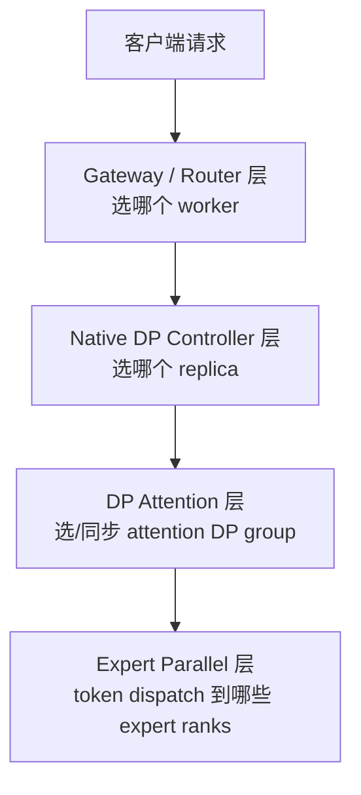
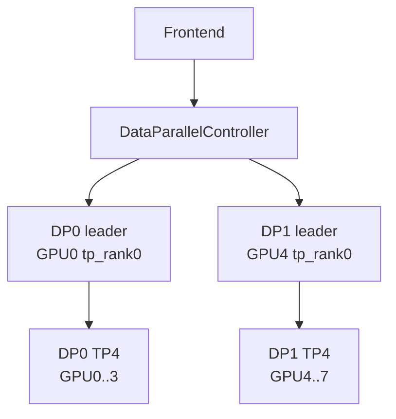
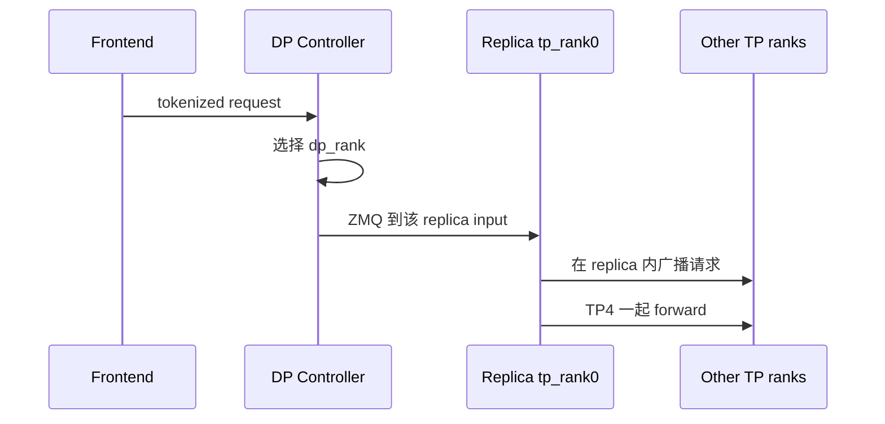
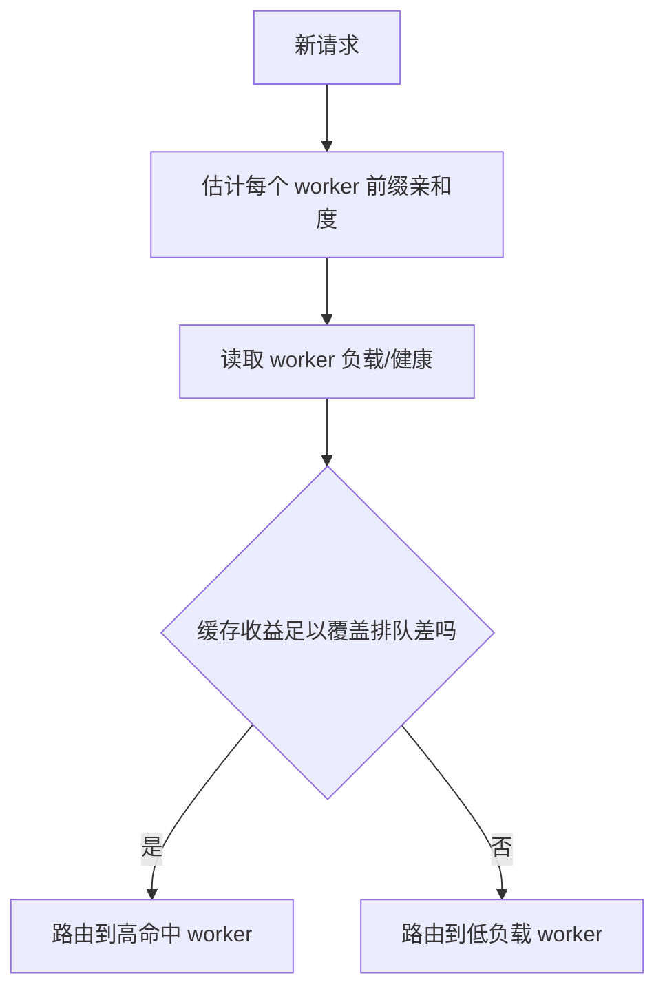
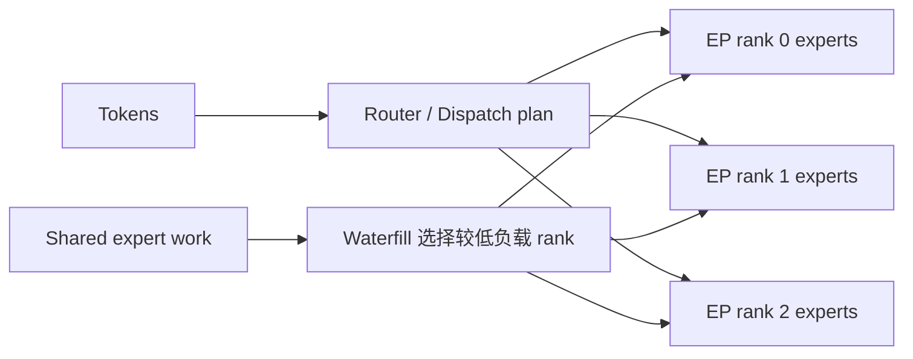

# SGLang 数据并行、负载均衡与专家并行边界学习文档

本文面向第一次接触 SGLang 多副本和 MoE 调度的同学，重点解决四个名称相近、作用层次完全不同的问题：

1. Native DP 怎样把请求分给多个完整模型副本？
2. SGLang Model Gateway 怎样在多个独立 worker 之间路由？
3. DP Attention 为什么不是“多复制几份模型”？
4. Expert Parallel、EPLB 与 DeepEP Waterfill 到底在平衡什么？

第二篇来源文章包含多处与 SGLang 官方资料不一致、甚至配置内部矛盾的说法。本文保留它作为“如何辨别技术文章”的案例，不把其中的 Waterfill/LPLB 解释和性能数字写成事实。

本文是第三方资料整理型学习资料，不是当前 SGLang 源码审计。

## 0. 阅读基线与范围

### 0.1 主要来源

| 原文 | 作者/机构 | 发布时间 | 链接 |
| --- | --- | --- | --- |
| 《SGLang推理优化-DP并行》 | LLM高性能计算 | 2026-06-07 | https://mp.weixin.qq.com/s/v_HtrClpzieWBKhUMKsYNA |
| 《SGLang 0.5.14底层调度更新:Waterfill与LPLB让DeepSeek-V4吞吐提升5倍》 | MindLynx开源探索 | 2026-06-28 | https://mp.weixin.qq.com/s/6Q4LTf_-3jHnJTKkqtTYHg |

### 0.2 官方交叉核验

| 材料 | 用途 |
| --- | --- |
| [SGLang Server Arguments](https://github.com/sgl-project/sglang/blob/main/docs/advanced_features/server_arguments.md) | 核验 Waterfill/EPLB 参数与语义 |
| [SGLang Expert Parallelism](https://github.com/sgl-project/sglang/blob/main/docs/advanced_features/expert_parallelism.md) | 核验 EPLB 的目标与启用方式 |
| [SGLang Model Gateway](https://github.com/sgl-project/sglang/blob/main/docs/advanced_features/sgl_model_gateway.md) | 核验 worker 路由策略 |
| [SGLang Releases](https://github.com/sgl-project/sglang/releases) | 核验公开版本 |

| 项目 | 内容 |
| --- | --- |
| 读取时间 | 2026-07-25 |
| 整理范围 | Native DP、Gateway 路由、DP Attention 边界、EP/EPLB/Waterfill |
| 不展开内容 | 每种 collective 的 kernel、Kubernetes 部署、跨版本参数兼容 |
| 验证边界 | Native DP 细节主要来自第三方源码梳理；官方核验只用于纠正明显冲突，未运行集群实验 |

### 0.3 术语速查

| 术语 | 人话解释 |
| --- | --- |
| Replica | 一套可以独立处理请求的完整模型副本 |
| TP | 一条请求的模型计算分散到多张卡 |
| DP | 多个副本处理不同请求 |
| Native DP | 一个 SGLang server 进程树内部启动多个 replica |
| SMG | SGLang Model Gateway，外部 Router 管理独立 worker servers |
| DP Attention | Attention 按 DP group 切分，但其他层仍处在更大的并行 world |
| EP | 不同 rank 放置不同 MoE experts |
| EPLB | Expert Parallelism Load Balancer，基于专家负载重新放置/复制专家 |
| DeepEP | 面向 MoE dispatch/combine 的通信后端 |
| Waterfill | 官方参数中的 DeepEP shared-expert dispatch 策略 |

## 1. 先建立四层负载地图



不是每个部署都会同时使用四层。最重要的是分清它们平衡的对象：

| 层次 | 平衡对象 | 代价 |
| --- | --- | --- |
| Gateway | 请求/前缀在独立服务之间的分布 | HTTP/gRPC、跨进程运维 |
| Native DP | 请求在同一 server 的完整副本间分布 | 权重和 KV 按副本复制 |
| DP Attention | Attention token workload | 需要跨 group 元数据/hidden state 同步 |
| EP/EPLB | MoE token 在 experts/ranks 上的分布 | all-to-all、专家迁移/复制 |

把 EP 的专家热点问题叫作“请求负载均衡”，或把 Gateway cache-aware 路由叫作“模型内部 EPLB”，都会导致错误配置。

## 2. Native DP：多个完整 TP 副本

### 2.1 `dp=2, tp=4` 的拓扑

单机 8 卡、无 PP：

```text
DP replica 0:
  GPU 0,1,2,3
  一个独立 TP4 world
  tp_rank = 0..3

DP replica 1:
  GPU 4,5,6,7
  另一个独立 TP4 world
  tp_rank = 0..3
```

两个 replica 的 `tp_rank` 都从 0 开始，因为它们属于不同 process group。



### 2.2 总卡数

普通副本式 DP 的近似关系：

```text
total_gpus = dp_size × tp_size × pp_size
```

`--dp 2` 不会自动推断“每个副本用剩余 4 卡”；如果 TP 默认是 1，它可能只是两个单卡副本。并行参数要显式设计。

### 2.3 复制了什么

每个 replica 独立拥有：

- 一套 TP 分片后的模型权重；
- 自己的 KV Cache；
- 自己的请求状态；
- 自己的 TP collectives。

DP0 和 DP1 不会在每个模型 forward 里互相做 TP all-reduce。副本隔离带来简单性，也带来权重/KV 复制成本。

## 3. Native DP 的控制与通信路径

### 3.1 Controller 启动每个副本

来源文章梳理的主线是：

```text
DataParallelController
-> 按 dp_rank 创建独立 PortArgs
-> 为每个 replica 选择不同 base_gpu_id
-> 启动一套 TP scheduler processes
-> 保存 controller -> replica 的 ZMQ PUSH socket
```

共享与独立边界可理解为：

| 通道/资源 | 是否按 replica 独立 |
| --- | --- |
| Scheduler input IPC | 独立 |
| TP/NCCL rendezvous port/world | 独立 |
| GPU 范围 | 独立 |
| Tokenizer/Detokenizer 上层路径 | 可共享 |

### 3.2 只有 group leader 接外部请求

抽象路径：



非 leader rank 不需要各自从前端收一遍请求，但仍运行对应 scheduler/worker 逻辑并参与 collective。

### 3.3 内置路由策略

来源文章列出的 Native DP 方法包括：

- round-robin；
- total requests；
- total tokens；
- follow bootstrap room；
- 显式 `routed_dp_rank`。

这些策略主要看副本负载或外部指定，不等同于完整的 prefix cache-aware Gateway。

## 4. Native DP 的收益与限制

### 4.1 收益

- Replica 可独立忙闲；
- TP collective 限制在单个 replica；
- 一个 replica 的请求不会要求另一个 replica 同步进入普通 forward；
- 适合用更多模型副本扩展吞吐。

### 4.2 代价

```text
权重显存 × dp_size
KV Cache 各自隔离
相同前缀落到不同 replica 会重复计算
单个请求最多使用一个 replica 内的 TP/PP 资源
```

### 4.3 多机边界

来源文章引用当时代码中的限制：普通 Native DP 在 `dp_size > 1` 且多机、又未启用 DP Attention 时会被拒绝。这个约束可能随版本变化，但体现了一个设计事实：

> 把多机 worker 管理、健康检查和路由塞进一个本地进程树，会迅速变复杂。

多机请求级扩展更适合由 Gateway 管理独立 workers。

## 5. SGLang Model Gateway：把副本提升为服务

### 5.1 形态差异

```text
Native DP:
  一个 launch_server
  -> 内部 Controller
  -> 多个 replica
  -> ZMQ IPC

SMG:
  一个独立 Router
  -> 多个独立 SGLang worker servers
  -> HTTP/gRPC
```

### 5.2 为什么更适合生产路由

独立 worker 可以：

- 单独启动、重启、扩缩容；
- 跨机器/Pod；
- 独立做健康检查和熔断；
- 由 Router 维护 registry；
- 按模型、worker type、PD role 组织。

### 5.3 Cache-aware 与负载的折中

官方 Gateway 文档列出 `random`、`round_robin`、`power_of_two`、`cache_aware`、`bucket` 等策略。Cache-aware 的核心矛盾是：

```text
把相似前缀送到已有缓存的 worker
vs
把请求送到当前更空闲的 worker
```

一个 worker 即使命中很长前缀，如果队列严重拥塞，也可能不如冷缓存但空闲的 worker。



## 6. DP Attention：不是完整模型副本

### 6.1 普通 DP

```text
dp2 + tp4
= 两个互相独立的 TP4 模型副本
```

### 6.2 DP Attention

抽象上：

```text
更大的全局 TP/并行 world
-> Attention token 按 DP groups 切分
-> MLP/MoE 前后需要同步 token 数和 hidden states
```

因此 idle attention group 也可能需要进入某些 collective，避免其他 rank 等不到。

### 6.3 比较

| 维度 | 普通 Native DP | DP Attention |
| --- | --- | --- |
| 模型权重 | 每个 replica 一套 | 更大并行 world 内协作 |
| 请求 | 路由到一个完整副本 | 路由到 attention DP group |
| 跨 DP 同步 | 普通 forward 无 | 需要 token/hidden state 协调 |
| KV | 每个副本独立 | 按 attention group 特殊组织 |
| 空闲影响 | 其他副本可完全 idle | 某些 collective 仍需参与 |

不能用普通 DP 的“两个 TP4 world”心智模型解释 DP Attention。

## 7. Expert Parallel 与 EPLB

### 7.1 EP 平衡的是 token-to-expert 工作

MoE 每个 token 只激活少数 experts。若热门 expert 都在同一 rank：

- 该 rank 收到更多 token；
- all-to-all 后出现 straggler；
- 其他 ranks 等待；
- 整层 latency 由最慢 rank 决定。

### 7.2 EPLB 做什么

SGLang 官方 Expert Parallelism 文档描述 EPLB：

1. 记录 expert activation/负载统计。
2. 计算更好的 expert placement。
3. 必要时放置 redundant expert。
4. 周期性 rebalance，降低 rank 间计算时间方差。

官方入口是 `--enable-eplb` 及配套 `--eplb-*` 参数。

它不是简单修改模型 gate，把本应去 Expert A 的 token 随意改送 Expert B。那样会改变模型函数和输出。负载均衡通常通过**物理放置/副本映射**保持逻辑 expert 语义。

## 8. DeepEP Waterfill 的官方语义

截至本文读取时，官方 Server Arguments 将其描述为：

- 参数：`--enable-deepep-waterfill`；
- 面向 DeepEP；
- 把 shared expert 作为额外 routed expert 调度到负载较低的 EP rank；
- 支持特定 DeepSeek V3/R1 与 `EP >= 2` 场景；
- 关联 `deepep` all-to-all backend 和 shared-expert fusion。

它在解决 **MoE dispatch 的 rank 负载**，不是把 KV 显存划成“水位区”来塞长短请求。



## 9. 对第二篇来源的事实核验

### 9.1 为什么必须降级为“待验证说法”

| 原文说法 | 官方/内部一致性检查 | 本文处理 |
| --- | --- | --- |
| `--waterfill-mode auto` | 官方参数表使用 `--enable-deepep-waterfill` | 不作为有效命令 |
| `--lplb-mode auto` | 官方文档是 EPLB 与 `--enable-eplb` | 视为未证实名称 |
| `--schedule-policy waterfill` | 官方调度策略资料未显示该 KV/请求策略 | 不作为 Scheduler 事实 |
| Waterfill 解决显存碎片，把长短请求塞入“水位区” | 官方 Waterfill 语义是 DeepEP shared-expert dispatch | 判定为概念错位 |
| LPLB 动态把 Expert A 的 token 改送 Expert B | 可能改变模型语义；官方 EPLB 讲 expert placement/replication | 不采信 |
| 单台 A100 80GB 运行 336B FP8 模型 | 仅 FP8 权重约 336 GB，未说明 TP/offload，配置自相矛盾 | benchmark 无法据文复现 |
| SGLang 0.5.14 已发布 | 读取时官方 Releases 未找到该公开 tag，显示的最新稳定条目较早 | 版本状态未证实 |
| 吞吐 `1850 -> 8852 tokens/s` | 缺少仓库 commit、并行拓扑、脚本和日志 | 不进入性能结论 |

### 9.2 能从这篇文章学到什么

不是它给出的机制，而是核验方法：

1. 参数名是否能在官方 CLI 文档或源码中找到？
2. 模型权重是否装得进文章声称的硬件？
3. 优化是否会改变模型数学语义？
4. 版本 tag 是否公开存在？
5. benchmark 是否给出模型、拓扑、输入输出分布和脚本？

任何一项冲突，都应先降级为假设。

## 10. 该怎样选择扩展层次

| 需求 | 更匹配的层次 |
| --- | --- |
| 单机有足够显存，想多副本增吞吐 | Native DP 或多个独立 workers |
| 多机/Pod、需要故障隔离与缓存路由 | SMG |
| MLA/特定模型要扩展 Attention 并行 | DP Attention |
| 大规模 MoE expert 计算不均 | EP + EPLB |
| DeepEP shared expert dispatch 不均 | 在官方支持矩阵内评估 Waterfill |

可能组合，但每多一层都会增加观测和故障边界。

## 11. 压测方法

### 11.1 请求级 DP/SMG

记录：

- 每 worker 请求数与 live tokens；
- 队列时间；
- prefix hit rate；
- 路由转移次数；
- TTFT/ITL/goodput；
- worker 故障时重试和尾延迟。

### 11.2 DP Attention/EP

记录：

- 每 rank token 数；
- all-to-all bytes/latency；
- max/mean expert load；
- straggler rank；
- collective wait；
- EPLB rebalance 成本；
- 模型输出一致性。

### 11.3 不要混合指标

`tokens/s` 可能是：

- 总输入吞吐；
- 总输出吞吐；
- 单用户生成速度；
- 满足 SLO 的 goodput。

第二篇来源用一个数字同时讲“吞吐和延迟改善”，但未给清晰口径，这正是不可复现的典型信号。

## 12. 排障地图

| 现象 | 先看哪层 | 可能原因 |
| --- | --- | --- |
| 一个 replica 很忙、另一个空 | Native DP/Router | 路由策略或显式 rank 绑定 |
| 相同前缀仍重复 Prefill | Gateway | 请求落到不同 KV 隔离域 |
| 跨机 Native DP 启动被拒 | 部署形态 | 目标版本限制，考虑 SMG |
| DP Attention collective hang | rank/group | idle group 未参与同步、元数据不一致 |
| MoE 某 rank 拖慢整层 | EP | expert hotspot、placement、all-to-all |
| 开 EPLB 后短测无收益 | EP 统计窗口 | 负载不稳定或 rebalance 成本占比高 |
| Waterfill 参数不存在 | 版本/名称 | 文章命令错误或版本不匹配 |
| benchmark 好得不合理 | 测试条件 | 模型装载、量化、拓扑或指标口径缺失 |

## 13. 一句话总结

Native DP 在完整模型副本之间分请求，SMG 在独立服务之间做生产级路由，DP Attention 在模型内部切 Attention 工作，EP/EPLB/DeepEP Waterfill 平衡 MoE expert dispatch。它们不在同一层；先确定要平衡的对象，再谈参数和性能。

## 14. 参考与延伸

- 《SGLang推理优化-DP并行》：https://mp.weixin.qq.com/s/v_HtrClpzieWBKhUMKsYNA
- 《SGLang 0.5.14底层调度更新:Waterfill与LPLB让DeepSeek-V4吞吐提升5倍》：https://mp.weixin.qq.com/s/6Q4LTf_-3jHnJTKkqtTYHg
- [SGLang Server Arguments](https://github.com/sgl-project/sglang/blob/main/docs/advanced_features/server_arguments.md)
- [SGLang Expert Parallelism](https://github.com/sgl-project/sglang/blob/main/docs/advanced_features/expert_parallelism.md)
- [SGLang Model Gateway](https://github.com/sgl-project/sglang/blob/main/docs/advanced_features/sgl_model_gateway.md)
- [SGLang Releases](https://github.com/sgl-project/sglang/releases)

本文未复现任何并行 benchmark。对第二篇来源的纠正以读取日可见的官方资料和基本容量一致性为依据。
