# SGLang 调度器请求生命周期与重叠调度学习文档

本文面向第一次读 SGLang Scheduler 的同学，围绕一个问题展开：

> 一个请求从进入 `waiting_queue`，到完成 Prefill、参与 Decode、流式输出并释放资源，中间经历了哪些对象和状态？

本文把三篇 Scheduler 分析合并成一条主线，避免分别复述。它是第三方资料整理型学习资料，2026-09-09 补充官方固定版本的静态抽查；历史文章中的字段和调用形式仍需与目标版本区分。先建立全局地图可读[调度机制总览与学习路线](<./SGLang 调度机制总览与学习路线.md>)。

## 0. 阅读基线与范围

### 0.1 来源

| 原文 | 作者/机构 | 发布时间 | 链接 |
| --- | --- | --- | --- |
| 《小进探索sglang：sglang中的scheduler调度原理和代码解析》 | lil2j / 小进在学大模型 | 2025-12-08 | https://mp.weixin.qq.com/s/baB0ozQrVuaqZrTphSCUvg |
| 《从 KV Cache 到 Zero Overhead Scheduling，一文读懂 SGLang 的调度巧思》 | 智猩猩AI（转载，页面署名“关注AI Infra”）；原作者 Chayenne Zhao | 2026-01-12 | https://mp.weixin.qq.com/s/-O5W_4CGD0XJMAtHckn3nw |
| 《SGLang推理优化-调度器核心ScheduleBatch》 | kason_zhang / LLM高性能计算 | 2026-06-05 | https://mp.weixin.qq.com/s/e--Z3OKzilcZuJFoi7Hizg |

| 项目 | 内容 |
| --- | --- |
| 读取时间 | 初次整理 2026-07-25；本次完整重读 2026-09-09 |
| 整理范围 | 生成请求主循环、请求与 batch 状态、Prefill/Decode admission、资源回收、Overlap Scheduling |
| 不展开内容 | PP event loop、DP Attention 的 rank 细节、Speculative Decoding 内部算法、PD 分离传输 |
| 验证边界 | 第三方资料交叉整理，附固定 commit 静态抽查；未运行服务、性能测试或并发正确性实验 |

第二篇页面标注[知乎原始文章](https://zhuanlan.zhihu.com/p/1992587332189197731)。转载和原文属于一组来源，不能算作两份独立证据。原先引用的《SGLang Overview：设计哲学与关键机制》不再作为本文的技术依据；本次来源筛选和排除理由见总览文档。

**静态抽查基线：** 官方 `sgl-project/sglang` commit `6e312af8c25ccedd1dcd2583358be038ab4875b0`，读取日 2026-09-09。读取固定版文件的临时副本，没有检出分支或修改本地 SGLang 仓库；实际读取目录和工作区边界见[总览基线](<./SGLang 调度机制总览与学习路线.md>)第 0.3 节。本文仍保留历史主线伪代码，用来说明行为；具体签名变化见第 12 节。

配图均来自三篇原文，已逐张检查。保留的原图、SHA256 和未采用图像的原因见[配图记录](../images/sglang-scheduler/SOURCES.md)。没有采用含错误分支或严重文字错误的三张原图。

### 0.2 怎么读本文

1. 第 1～3 节先分清“请求状态”和“执行数据”。
2. 第 4～7 节按 Normal Scheduler 走一遍。
3. 第 8 节再看 Overlap 为什么需要 future token。
4. KV Pool、RadixAttention 和 HiCache 只在第 9 节说明接口，细节跳转到专项文档。

### 0.3 术语速查

| 术语 | 人话解释 |
| --- | --- |
| `Req` | Scheduler 眼里的一条请求及其当前进度 |
| `waiting_queue` | 还需要 Prefill/Extend，或被 retract 后等待重入的请求 |
| `running_batch` | 已完成 Prefill、可继续 Decode 的请求集合 |
| `chunked_req` | 长 Prompt 做了一部分、但还不能进入普通 Decode 的请求 |
| `new_batch` | 当前轮新构造的 EXTEND/Prefill batch |
| `last_batch` | 上一轮提交执行的 batch；Overlap 下不代表 CPU 已完成收尾 |
| `cur_batch` | 当前轮选择并执行的 batch |
| `ScheduleBatch` | Scheduler 管理的批状态和调度元数据，字段可引用 CPU/GPU tensor |
| EXTEND | 新 Prefill、缓存后缀计算或 Chunked Prefill 的 forward mode |
| DECODE | 活跃请求每个继续生成一个 token 的 forward mode |
| Admission | 判断一个请求是否能安全进入本轮 |
| Retract | KV 不够时，把部分 Decode 请求撤回等待队列 |
| Overlap | GPU 跑当前批时，CPU 准备/收尾其他批 |

## 1. 先建立整体地图

### 1.1 Scheduler 不是一个排序函数

Scheduler 同时负责：

1. 接收并分类控制消息与生成请求。
2. 维护请求生命周期。
3. 做前缀匹配和 KV 资源 admission。
4. 构造模型执行需要的 batch metadata。
5. 接收采样结果，推进、结束或撤回请求。

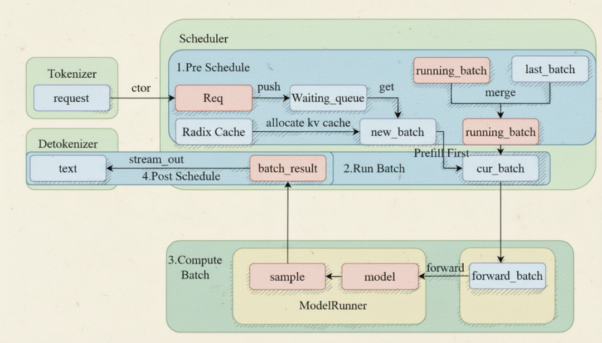

**图意解读：** 图把输入处理、等待队列、Prefill/Decode batch、模型执行和输出连在一起。Scheduler 拥有控制权，决定下一轮的请求集合；GPU worker 拥有实际 forward 数据面。图中部分高级分支是概念汇总，不应当用来推断当前源码中每个模块都在同一进程。

### 1.2 从组件看端到端

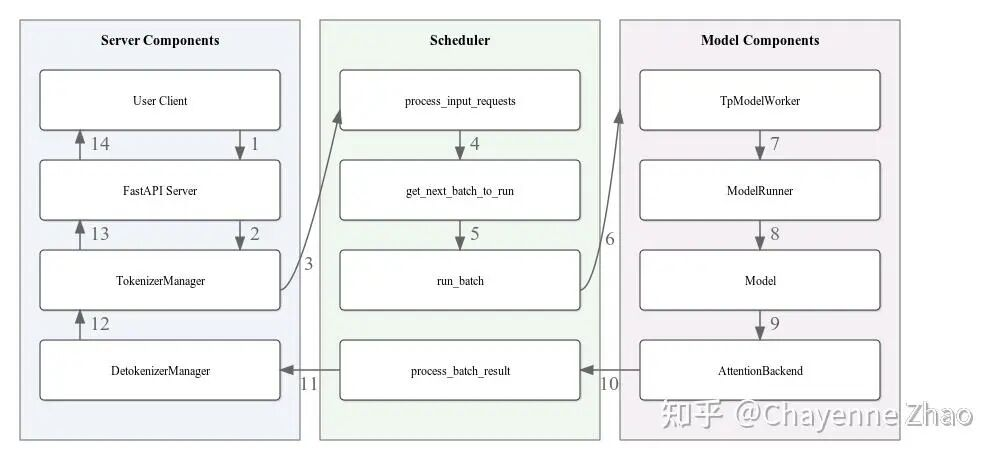

**图意解读：** 前端完成协议、tokenization 和流式连接；Scheduler 进程维护队列与内存映射；模型 worker/runner 执行 GPU 计算。ZMQ/IPC 传递控制对象和结果，但大张量、KV 所有权仍由执行与内存池一侧管理。图用于拆职责，不代表跨版本完全相同的进程数。

### 1.3 最小主线

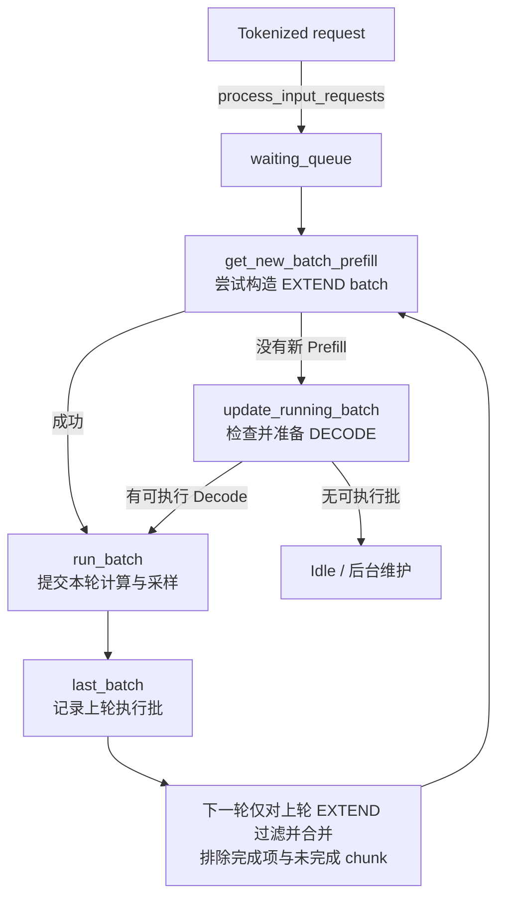

最重要的一点是：**EXTEND 执行完不会在同一行代码里立即变成 DECODE。** 它通常先成为 `last_batch`，下一轮调度开头再经过过滤并入 `running_batch`。

## 2. 两组概念必须拆开

### 2.1 请求状态对象

| 对象 | 它回答的问题 | 生命周期 |
| --- | --- | --- |
| `waiting_queue` | 哪些请求还在等 Prefill admission | 可多次进入 |
| `chunked_req` | 哪个长请求正在分段 Prefill | 跨多个 EXTEND 轮次 |
| `running_batch` | 哪些请求可以继续 Decode | 直到完成或 retract |
| `last_batch` | 上一轮执行了什么 | 每轮替换 |
| `cur_batch` | 本轮将执行什么 | 一轮内有效 |

这些名字描述的是控制状态，不一定是五份互相独立的数据副本。

### 2.2 四层 batch 数据

综合原文，可以把执行数据看成逐层降级的视图：

| 数据结构 | 主要管理者 | 包含什么 | 为什么存在 |
| --- | --- | --- | --- |
| `ScheduleBatch` | Scheduler | `Req`、长度、pool index、采样配置、forward mode | 做 CPU 侧调度决策 |
| `ModelWorkerBatch` | Worker 接口 | forward 所需的紧凑字段 | 隔离接口和字段依赖，不意味着独立进程 |
| `ForwardBatch` | Model Runner | GPU tensor、positions、Attention metadata | 直接喂给模型和 kernel |
| `GenerationBatchResult` | Worker -> Scheduler | token、logits/采样信息、异步同步对象 | 推进请求状态 |

这是历史文章介绍的对象地图，不是“每层必有一次 IPC”的传输图，也不代表所有字段始终零拷贝。固定版 `ForwardBatch.init_new()` 既接收已有 tensor，也为部分 metadata 构造 tensor 并执行设备拷贝。Scheduler 在 CPU 上执行 Python 控制逻辑，但持有的 tensor 可以在 GPU 上。

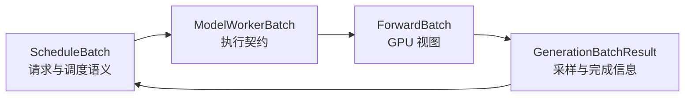

### 2.3 为什么不能只跟一个 `batch`

同一个请求可能：

- 作为 `new_batch` 的成员执行 EXTEND；
- 下一轮通过 `last_batch` 合入 `running_batch`；
- `running_batch` 经 `prepare_for_decode()` 后又成为 `cur_batch`；
- 在 Overlap 模式下，结果还在异步队列中，而 CPU 已准备下一批。

只看局部变量名，很容易误判对象生命周期。读源码时要始终问：

```text
这是“请求集合的控制状态”，
还是“这一次 forward 的执行快照”？
```

## 3. Normal Event Loop：先学串行版本

### 3.1 五步循环

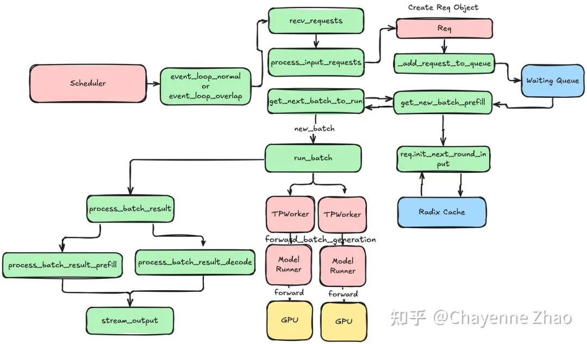

**图意解读：** 图按接收、处理、选批、执行、后处理展开 Normal Event Loop。它最适合学习因果关系：只有上一轮结果处理完，下一轮决策才开始。Overlap 会改变时间上的重叠，但不会取消这些逻辑阶段。

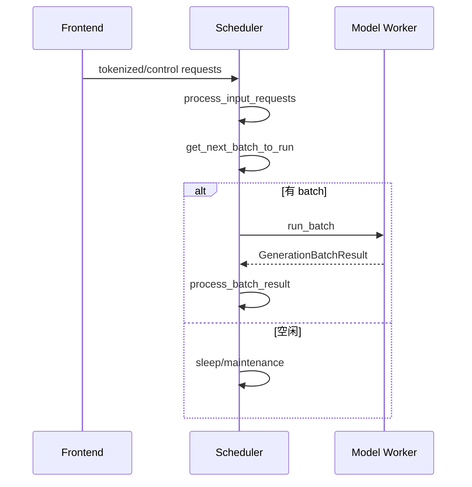

### 3.2 输入处理

`recv_requests()` 与 `process_input_requests()` 在第三方文章的代码基线中承担：

- 从前端通道接收对象；
- 按请求类型分派；
- 为生成请求构建 `Req`；
- 校验长度、采样或 grammar 等前置条件；
- 放入 `waiting_queue` 或对应特殊队列；
- 处理 abort、flush、update weights 等控制消息。

重点是：并非所有输入都会变成模型 batch；Scheduler 同时也是控制消息的串行化边界。

### 3.3 结果处理

`process_batch_result()` 抽象上要做：

1. 拿到当前请求的采样 token。
2. 更新 `output_ids`、logprob、流式状态。
3. 检查 EOS、长度上限、stop string/grammar。
4. 对完成请求缓存或释放 KV。
5. 对未完成请求保留其 Decode 状态。
6. 向 detokenizer/frontend 发输出或结束信号。

这一步之后，执行结果才真正转化为下一轮调度状态。

## 4. `get_next_batch_to_run()` 的五个阶段

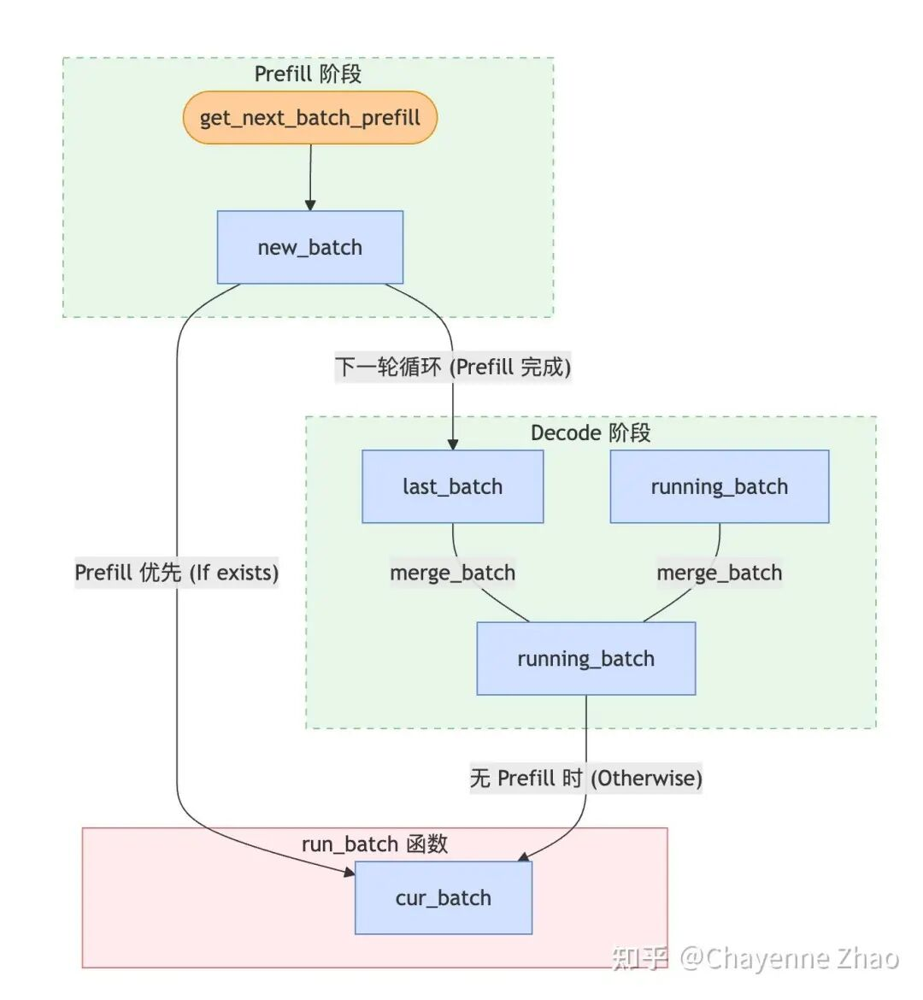

**图意解读：** 图展示了 Prefill batch 在完成后并入 Decode 集合，以及新 Prefill 优先于普通 Decode 的主线。`last_batch` 是两个阶段之间的交接点；未完成的 `chunked_req` 必须被排除，不能提前当成普通 Decode 请求。

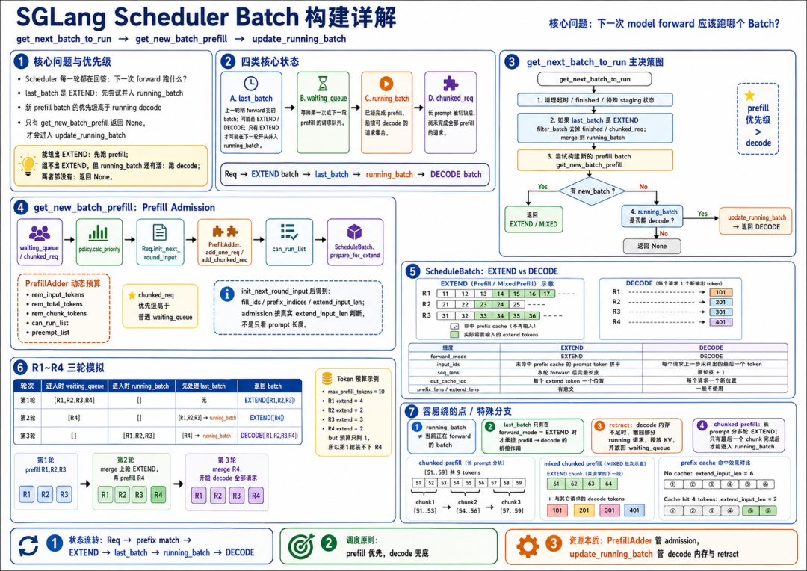

**图意解读：** 这张图细化了 `get_next_batch_to_run -> get_new_batch_prefill/update_running_batch` 的分支。左边主要是 EXTEND admission，右边主要是 Decode 内存检查和 retract。它是文章对特定源码状态的总结图，特殊模式的实际分支可能更多。

### 4.1 阶段一：收尾特殊状态

可能包括：

- 把上一段 Chunked Prefill 的已完成部分写入前缀缓存；
- 处理 staging/DLLM/HiSparse 等特定状态；
- 计算哪些请求本轮不能并入普通 Decode。

这些逻辑的共同目的，是先让跨轮状态收敛，再改变 batch 所属集合。

### 4.2 阶段二：EXTEND `last_batch` 合入 `running_batch`

抽象伪代码：

```text
if last_batch is EXTEND:
    filter finished / prefill-only / unfinished chunked requests
    if anything remains:
        running_batch.merge(last_batch)
```

为什么只有 EXTEND 需要 merge？

- 上一轮 EXTEND 的请求此前还不在普通 Decode 集合中。
- 上一轮 DECODE 本来就是 `running_batch` 的推进快照，重复 merge 会复制请求。

### 4.3 阶段三：优先尝试新 Prefill

```text
new_batch = get_new_batch_prefill()
if new_batch is not None:
    return new_batch
```

原文所分析的主线是 Prefill-first：只要能安全构造 EXTEND batch，本轮就选择它。这里的“优先”仍受 batch full、请求槽位、KV 预算、prefill delayer 和特殊模式约束。

**不要把 Prefill-first 叫作 FCFS。** 前者决定 Prefill 和 Decode 哪个阶段先执行；后者决定等待请求的尝试顺序。选择 FCFS 时仍可能 Prefill-first，选择 LPM 时也仍需做资源 admission。

### 4.4 阶段四：没有 Prefill 才推进 Decode

```text
if running_batch not empty:
    running_batch = update_running_batch(running_batch)
    return running_batch if not empty else None
```

`update_running_batch()` 不是简单改一个枚举；它会过滤、检查下一 token 的 KV 空间、必要时 retract，再准备 DECODE metadata。

### 4.5 阶段五：没有工作

若两条路径都没有 batch，返回 `None`，event loop 进入 idle 处理。正确的 idle 行为还要避免让异步写回、控制消息或 watchdog 饿死。

## 5. Prefill Admission：`waiting_queue` 如何变成 EXTEND

### 5.1 先按策略排序

`SchedulePolicy` 可能依据：

- FCFS；
- 最长前缀命中；
- 优先级；
- 请求剩余长度或其他策略。

排序只决定“先尝试谁”，不保证一定 admission。

固定版 `server_args.py` 的策略声明默认是 `fcfs`。显式选择 `lpm` 时，`SchedulePolicy._determine_active_policy()` 在等待队列大于 128 的分支退回 FCFS；这个条件不能反推默认策略是 LPM，也不能只凭注释给整个算法标注 `O(n²)`。模型专用钩子、优先级功能和最终配置仍需分别检查。

### 5.2 每个请求先重新建立输入视图

`Req.init_next_round_input()` 一类逻辑通常会：

```text
fill_ids = origin_input_ids + output_ids
prefix_indices = tree_cache.match_prefix(fill_ids)
extend_input_len = len(fill_ids) - len(prefix_indices)
```

被 retract 的请求带着 `output_ids` 回来后，也可以重新匹配已经保留在 Radix Tree 的前缀。

### 5.3 `PrefillAdder` 管四种余量

可把它理解成一个动态装箱器：

| 余量 | 问题 |
| --- | --- |
| Request slots | 还能接纳几条请求 |
| Input token budget | 本轮还能处理多少 prefill token |
| KV capacity | 除去 running 请求未来需求后还能分多少 slots |
| Chunk budget | 本轮还剩多少 chunk 额度，各请求从同一余量扣减 |

还可能检查：

- LoRA 组合能否同批；
- grammar 是否已准备；
- 多模态输入预算；
- preemption 是否允许；
- HiCache load 是否已完成。

固定版 `PrefillAdder.rem_chunk_tokens` 是 adder 的共享余量，并非给每条请求重新发一份额度；mixed Decode 也可先消耗其中一部分。数值例子见[Chunk 预算专题](<./SGLang Chunked Prefill 与调度器显存预算学习文档.md>)第 8.1 节。

### 5.4 `prepare_for_extend()` 是 admission 落地

它不只是“构造 tensor”，还会把决策落到内存：

1. 为请求申请 `req_pool_idx`。
2. 把命中的 prefix slots 填入请求视图。
3. 为未命中的 token 分配新 KV slots/pages。
4. 更新序列长度、positions、采样位置。
5. 把 forward mode 设为 EXTEND。

在此之前是“计划能不能跑”，之后是“资源已经为本轮保留”。

## 6. Decode Admission：`running_batch` 如何继续一步

### 6.1 先过滤完成请求

从 batch 中移除：

- 已遇到 EOS/stop；
- 已达到长度限制；
- 已 abort；
- 特殊模式下不再参与普通 Decode 的请求。

必须同步过滤 `req_pool_indices`、`seq_lens`、sampling metadata 等所有并行字段。

### 6.2 检查下一步 KV

普通 Decode 每个活跃请求通常至少需要一个新 token 的 KV 写入位置：

```text
required_slots ≈ active_batch_size
```

Speculative Decoding、Mamba/Hybrid state、page 尾部和并行模式会让公式更复杂。

### 6.3 不够就 retract

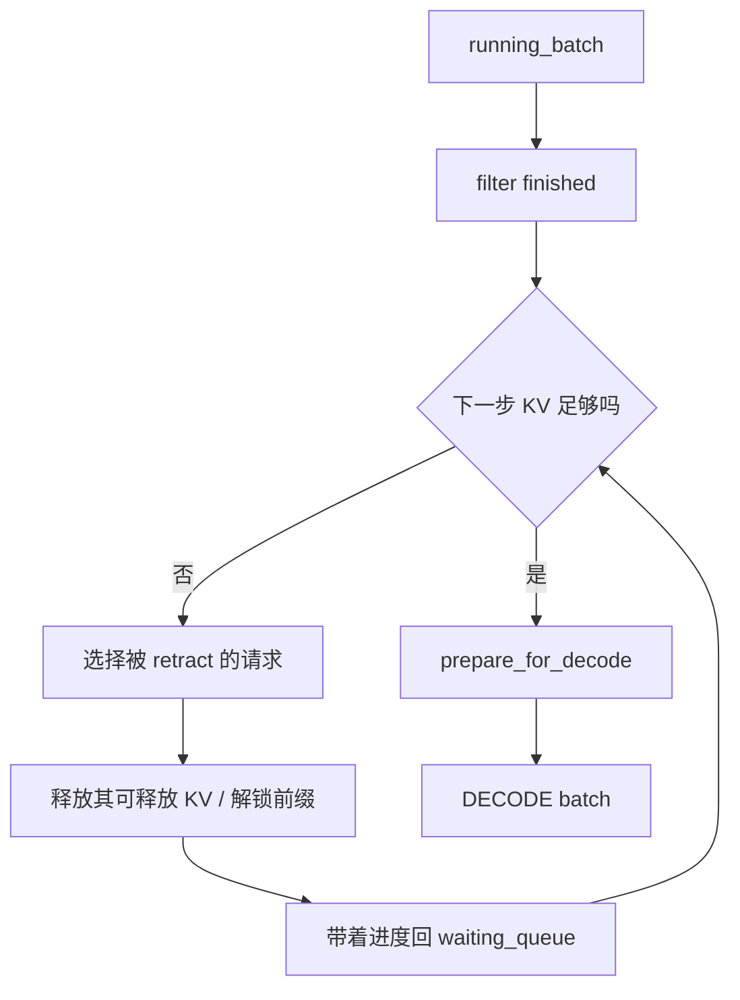

Retract 不等于请求失败。它保留逻辑进度，释放部分物理资源，稍后再通过 Prefix Match + EXTEND 恢复。

### 6.4 `prepare_for_decode()`

与 EXTEND 的大段分配不同，它通常：

- 为每个请求的下一 token 申请位置；
- 更新请求视图末尾；
- 构造当前位置、sequence length 和 Attention metadata；
- 把 forward mode 设为 DECODE。

## 7. 四个请求走三轮

假设：

```text
max_prefill_tokens = 10
R1 未命中 4 tokens
R2 未命中 3 tokens
R3 未命中 2 tokens
R4 未命中 2 tokens
初始 running_batch 为空
```

### 第 1 轮

`PrefillAdder` 依次接纳：

```text
R1: 10 -> 6
R2:  6 -> 3
R3:  3 -> 1
R4 需要 2，放不下
```

返回 `EXTEND([R1,R2,R3])`，R4 留在 `waiting_queue`。

### 第 2 轮

上一轮 batch 成为 `last_batch`。若 R1/R2/R3 未在 Prefill 采样时直接结束：

```text
running_batch = [R1,R2,R3]
```

但 waiting 中还有 R4，且资源允许，Scheduler 仍可能优先返回：

```text
EXTEND([R4])
```

R1/R2/R3 本轮不 Decode。

### 第 3 轮

R4 从 EXTEND 合入：

```text
running_batch = [R1,R2,R3,R4]
waiting_queue = []
```

此时无法构造新 Prefill，才调用 `update_running_batch()` 并返回 DECODE。

这个例子解释了：

- `last_batch` 为什么存在；
- `running_batch` 为什么可能有请求却暂时不执行；
- Prefill-first 为什么会影响 ITL；
- `max_prefill_tokens` 为什么不只是显存参数。

例子假定只有所列 input budget 起约束，KV、请求槽位和未来输出预算均够用，chunk 额度未进一步截断，并关闭 mixed。它是说明控制流的抽象装箱，不是可照抄的配置实验。

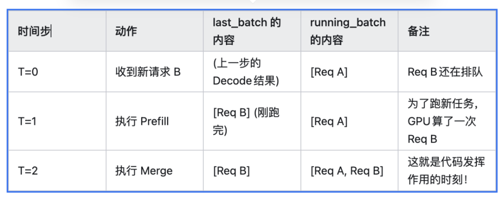

**图意解读：** 原图用 A 已在运行、B 刚到达的情形展示 `last_batch` 的交接作用。表中“Prefill 完成”和“合入 running”是两个边界。普通生成中 B 通常在最终 Prefill 时已有首 token，后续第一次 Decode 生成的是再下一个 token；不采用原文相邻文字中将其记作首 token 的说法。

## 8. Overlap Scheduling：怎样隐藏 CPU Bubble

### 8.1 Normal 模式的同步链

```text
GPU forward N
-> 等 token 回 CPU
-> CPU postprocess N
-> CPU prepare N+1
-> GPU forward N+1
```

如果 Decode forward 很短，CPU 上的同步、Python 对象处理、内存分配和 grammar mask 会形成明显空档。

### 8.2 理想重叠

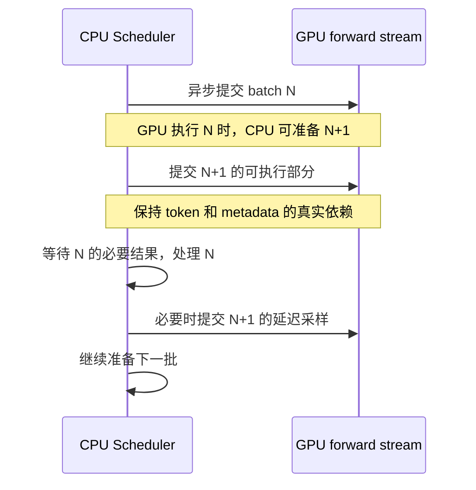

**图意解读：** 这是整理者画的逻辑顺序，不是测量时间线。CPU 发出命令不等于 GPU 已完成；普通采样和依赖 grammar 的延迟采样路径也不能混为一谈。

一个抽象 event loop 是：

```text
1. 构造并异步提交 batch N+1
2. 把 (batch, result handle) 放入 result_queue
3. 处理 batch N 的结果
4. 在正确依赖点启动/完成 N+1 的采样
5. 推进 last_batch
```

### 8.3 难点：下一批依赖当前输出

Decode N+1 的输入 token 正是 N 的采样结果。如果每次都先把 token 拷回 CPU，再组下一批，就无法真正重叠。

原文描述的思路包括：

- `future_indices`：下一批先引用 GPU future map 中尚未回传的 token 位置；
- `copy_done`/CUDA Event：CPU 真正读取 token 前再同步；
- delayed sample：在满足 mask/metadata 依赖的时机启动采样；
- result queue：区分已经发射与已经后处理的 batch。

### 8.4 为什么“零开销”不是字面零

Overlap 只能隐藏落在 GPU forward 窗口内的 CPU 工作。以下情况仍会暴露：

- CPU 工作比 GPU forward 更长；
- 需要同步读取 token 或 shape；
- batch 很小，GPU 单步太短；
- Python GC/日志/grammar 产生突发；
- H2D/D2H 或 CUDA Event 依赖错误；
- 特殊 backend 不支持异步路径。

所以应通过 profiler 看迭代间 gap，而不是只看开关是否启用。

### 8.5 SGLang 固定版怎样表达这些依赖

[官方 v0.4 介绍](https://www.lmsys.org/blog/2024-12-04-sglang-v0-4/#zero-overhead-batch-scheduler)明确将其解释为 CPU 调度与 GPU 计算的重叠，并提到 future token 和 CUDA event。CPU 仍执行调度；“零开销”描述的是关键路径上尽量看不到调度气泡。

在本次固定版中可找到如下锚点：

| 行为 | 固定源码锚点 | 读代码时关注什么 |
| --- | --- | --- |
| 建立 schedule stream | [`Scheduler` 事件循环入口](https://github.com/sgl-project/sglang/blob/6e312af8c25ccedd1dcd2583358be038ab4875b0/python/sglang/srt/managers/scheduler.py#L1870) | 与 `forward_stream` 分离，避免无关顺序阻塞 |
| 先提交当前批，再处理前批 | [`event_loop_overlap`](https://github.com/sgl-project/sglang/blob/6e312af8c25ccedd1dcd2583358be038ab4875b0/python/sglang/srt/managers/scheduler.py#L1944) | `result_queue.append((batch.copy(), batch_result))` 保存执行快照 |
| 输入 token 在设备侧接力 | [`resolve_forward_inputs` 与结果 relay 调用](https://github.com/sgl-project/sglang/blob/6e312af8c25ccedd1dcd2583358be038ab4875b0/python/sglang/srt/managers/scheduler.py#L4340) | 下一轮取得真实 token 前，生产者必须已写好对应 future 状态 |
| CPU 读取结果前等待 | [`BatchResultProcessor.process_batch_result_prefill`](https://github.com/sgl-project/sglang/blob/6e312af8c25ccedd1dcd2583358be038ab4875b0/python/sglang/srt/managers/scheduler_components/batch_result_processor.py#L253) | 相关路径先同步 `copy_done`，再读取 CPU 输出 |
| 部分批次不重叠 | [`is_disable_overlap_for_batch`](https://github.com/sgl-project/sglang/blob/6e312af8c25ccedd1dcd2583358be038ab4875b0/python/sglang/srt/managers/scheduler.py#L2021) | 连续 Prefill、grammar/spec 等条件会改变同步位置 |
| 防止后写覆盖前读 | [`_apply_war_barrier`](https://github.com/sgl-project/sglang/blob/6e312af8c25ccedd1dcd2583358be038ab4875b0/python/sglang/srt/managers/scheduler.py#L1892) | 让 schedule stream 的后续写等待必要 shared-read event，或退回等待 forward stream |

`batch.copy()` 解决的是执行批元数据被下一轮改写的问题，不能当作深拷贝全部 GPU 内存的证明。stream wait 约束设备命令顺序，也不会把其间的 Python EOS 判断“搬到 GPU 上”。

### 8.6 一条 EOS 请求暴露的生命周期问题

假设 N 的结果是 EOS，但 CPU 尚未读取它，N+1 的某些工作已经提交。这时应分别问：

1. **逻辑状态**：请求是否已被标记结束，是否还会对外输出？
2. **批元数据**：已经发射的执行快照里是否仍有该请求？
3. **物理资源**：GPU 是否仍会读写请求映射或 KV slots？
4. **回收资格**：哪一个事件或同步边界保证后续复用不会覆盖在途访问？

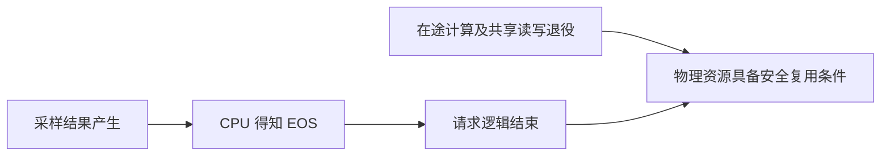

**图意解读：** 两条条件共同决定可回收性；这是一张生命周期检查图，不表示源码里只有一个统一“退役”函数。上述静态锚点证明实现显式处理依赖，不能代替对所有 backend、abort、快速 slot 复用场景的运行验证。

### 8.7 怎样验证 Overlap 是否有效

建议在相同模型、硬件、后端、请求长度、缓存状态和负载协议下比较启用与关闭 Overlap，检查最终生效配置，完成预热并重复运行。本文没有执行该对照。

| 观察 | 可能说明 | 还不能证明 |
| --- | --- | --- |
| 批间 GPU gap 缩短，完成吞吐提高 | 关键路径中的等待减少 | CPU 消耗已归零 |
| GPU gap 仍大，CPU 调度段更长 | CPU 工作超出可隐藏窗口 | 再加 stream 必然有效 |
| 平均 TPOT 改善、尾部 ITL 变差 | 平均值掩盖了部分请求停顿 | 用户体验整体改善 |
| 关闭 Overlap 后故障消失 | 并发顺序或生命周期值得重点排查 | 已定位到某个确定的根因 |

填充与排空阶段没有完整重叠窗口；小 batch、grammar、同步拷贝和 backend 差异也会影响收益。性能结果必须附测试条件。

## 9. Scheduler 与 KV 三种结构的接口

本篇只保留接口关系：

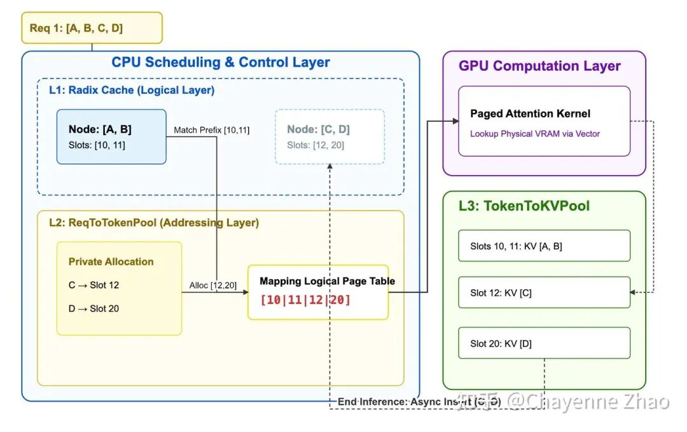

**图意解读：** 原图中已命中的 A/B 对应 slots 10/11，新计算 C/D 分配到 slots 12/20；请求视图把它们拼成逻辑连续的序列。图内 L1/L2/L3 是作者对三个抽象层的编号，**不是 HiCache 的 GPU/Host/外部存储三级**。树保存可复用前缀与位置关系，request pool 保存寻址视图，KV pool 保存真实张量。图中“插入”箭头不能解释为任意时刻都可发布尚未完成计算的 KV。

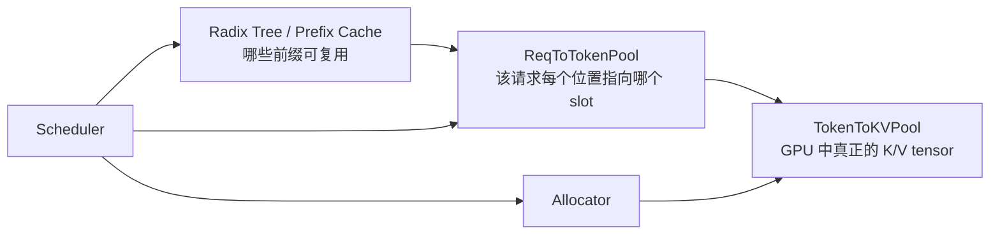

- Prefix Cache 决定能复用哪些历史 slots。
- Request view 把共享前缀和本轮新 slots 拼成逻辑序列。
- KV Pool 保存真实张量。
- Scheduler 拥有 admission 和生命周期策略，不执行 Attention 数据搬运本身。

详细见：

- [SGLang KV Pool、请求视图与 HiCache 工程学习文档](SGLang%20KV%20Pool、请求视图与%20HiCache%20工程学习文档.md)
- [SGLang RadixAttention 前缀缓存命中定义学习文档](SGLang%20RadixAttention%20前缀缓存命中定义学习文档.md)

## 10. 特殊能力应放在哪里理解

| 能力 | 对主线的影响 | 建议 |
| --- | --- | --- |
| Chunked Prefill | 增加跨轮 `chunked_req` 状态 | 读专项文档 |
| HiCache | Prefix Match 后可能先 load L2/L3 | 读 HiCache 文档 |
| Speculative Decoding | 一轮可能 draft/verify 多 token | 需要专门 batch/result 状态 |
| PP | 同一 batch 跨 stage/microbatch | 读 PP 源码文档 |
| DP Attention | 请求路由和 rank 同步改变 | 不从单 Scheduler 图外推 |
| Grammar | mask 准备可能阻塞或重叠 | 关注 grammar queue/async ready |

相关源码型资料：

- [PD 分离下的 PP 源码学习文档](PD%20分离下的%20PP%20源码学习文档.md)

## 11. 小白排障地图

| 现象 | 先看状态 | 再看机制 |
| --- | --- | --- |
| 请求一直没首 token | `waiting_queue`、prefix load、EXTEND budget | admission、长 prefill、grammar |
| `running_batch` 有请求却没 Decode | 是否持续有 `new_batch` | Prefill-first |
| 请求反复回等待队列 | retract 计数、KV free slots | live tokens 超容量 |
| Chunked 请求不输出 | `is_chunked/chunked_req` | 中间 chunk 本来不产生用户 token |
| GPU step 间有空档 | result queue、CUDA event、CPU timeline | Overlap 未覆盖同步 |
| 完成请求后显存不立刻下降 | Radix Cache 引用/缓存保留 | 缓存与 active ownership 不同 |
| 多 rank 状态不一致 | 请求广播、collective、特殊模式 | 不要假设只有一个 Scheduler 进程 |

## 12. 源码阅读路线

**固定版与历史文章的差异：** 本次官方 commit 中，`get_next_batch_to_run(running_batch, last_batch)` 返回 `NextBatchPlan`，event loop 从 `plan.running_batch` 和 `plan.batch_to_run` 取值。旧文中直接返回 batch 的伪代码只表达控制流，不是当前可执行 API。请求接收已可在 `scheduler_components/request_receiver.py` 阅读，结果处理在 `scheduler_components/batch_result_processor.py`，不能仅凭旧 mixin 文件名查找失败就判断功能消失。

在目标 SGLang commit 上建议按职责搜索，而不是照搬文章行号：

1. `scheduler.py`：event loop、`get_next_batch_to_run`、Prefill/Decode 分支。
2. `schedule_batch.py`：`Req`、`ScheduleBatch`、`prepare_for_extend/decode`。
3. `schedule_policy.py`：`SchedulePolicy`、`PrefillAdder`。
4. output processor mixin：Prefill/Decode 结果如何推进请求。
5. `mem_cache/`：Radix Tree、request pool、KV allocator。
6. overlap worker/client：future token、result queue 和 CUDA 同步。

每看一个函数都回答：

```text
它改变了哪一个请求状态？
它预留/释放了什么资源？
它产生的是控制信息，还是 GPU 数据？
这个变化何时对下一轮可见？
```

## 13. 一句话总结

SGLang Scheduler 的主线是一个受 KV 预算约束的请求状态机：EXTEND 从等待队列接纳请求，执行后经 `last_batch` 合入 `running_batch`；DECODE 每轮检查空间并推进，资源不足时 retract；Overlap 只改变这些阶段在时间上的交叠，不改变它们的因果关系。

## 14. 参考与延伸

- 《小进探索sglang：sglang中的scheduler调度原理和代码解析》：https://mp.weixin.qq.com/s/baB0ozQrVuaqZrTphSCUvg
- 《从 KV Cache 到 Zero Overhead Scheduling，一文读懂 SGLang 的调度巧思》转载：https://mp.weixin.qq.com/s/-O5W_4CGD0XJMAtHckn3nw
- 同文原始链接：https://zhuanlan.zhihu.com/p/1992587332189197731?share_code=XlfqtsjMrMgv&utm_psn=2064184295120548792
- 《SGLang推理优化-调度器核心ScheduleBatch》：https://mp.weixin.qq.com/s/e--Z3OKzilcZuJFoi7Hizg
- [调度机制总览与学习路线](<./SGLang 调度机制总览与学习路线.md>)：来源筛选、官方基线和八条资料去向。
- [固定版 ForwardBatch](https://github.com/sgl-project/sglang/blob/6e312af8c25ccedd1dcd2583358be038ab4875b0/python/sglang/srt/model_executor/forward_batch_info.py#L748)：区分字段复用与设备拷贝。

本文以第三方资料为主，附有限官方静态抽查；第 8 节的同步与对象生命周期说明不构成 GPU 并发正确性的测试报告。
