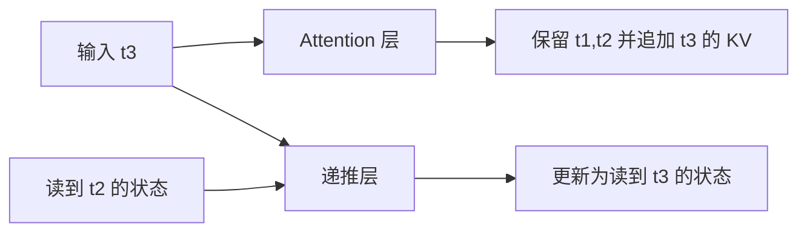
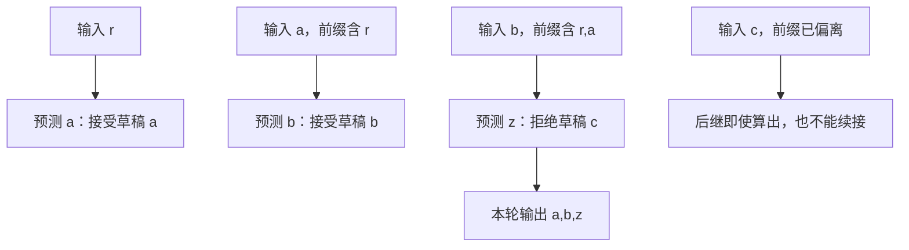
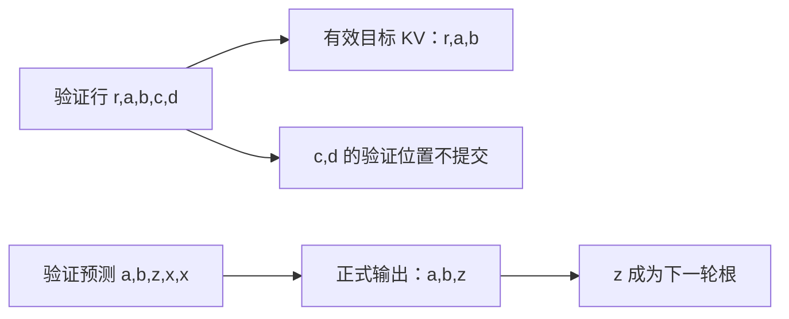
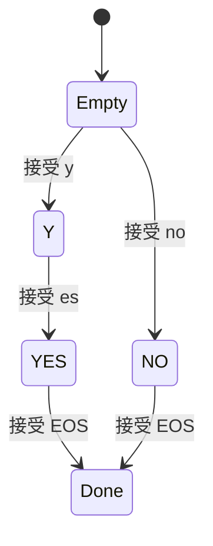

# SGLang 模型状态与高级生成机制学习文档

本文沿历史状态、候选验证和规则进度三条线，解释生成 token 时哪些对象会变化。配套 [Pages 交互课程](https://asher-xunzhang.github.io/ai-infra-wiki/sglang/advanced-generation/) 可逐步观察状态增长、草稿拒绝和词表过滤。先修为 [KV 与生成过程](<../runtime/SGLang 推理全景学习指南.md>)、[请求运行时](<../runtime/README.md>)和[并行分工](<../parallelism/README.md>)。

## 0. 阅读基线与范围

| 项目 | 内容 |
| --- | --- |
| 文档类型 | 源码分析型学习资料 |
| 源码仓库 | https://github.com/sgl-project/sglang |
| 分支 | 公开上游 main 固定快照，不声明为最新 main |
| commit | `279339f113b79af84f27fd3ac92d0a13bd3f4cbd` |
| 读取时间 | 2026-09-23 |
| 工作区状态 | 从本地已有 Git 对象只读分析；检出分支与分析快照不同，原有未跟踪文件保留 |
| 操作边界 | 未启动服务、下载权重、运行 SGLang 或 GPU kernel |
| 主线 | Attention / 递推状态差异；EAGLE 风格单链贪心验证；XGrammar 普通约束生成 |
| 教学边界 | 小词表、数值递推、候选字母、固定分歧位置都是教学假设，不是模型结果或性能数据 |

已有源码课程继续保留各自版本，本文不将历史实现改称同一版本。这里的“提交”指有效输出、KV 与相关状态生效的过程，不暗示存在统一处理一切的 `commit()` 函数。

| 名称 | 要区分的对象 |
| --- | --- |
| token 历史 | 按位置保留的 K/V，或 MLA 的 latent 等表示 |
| 活动状态 | 递推层当前的 conv / temporal 等状态，可被下一步覆盖 |
| 草稿候选 | 尚待目标模型验证的 token，不是正式输出 |
| 验证行 | 给定合法前缀后计算的一行预测；并行计算仍受因果关系约束 |
| bonus | 本轮额外补出的 token；拒绝时纠正分歧，全接受时多前进一步 |
| matcher | 某请求已经走到的规则位置；不同请求不能共享这份进度 |

## 1. 模型结构决定历史以什么形式保存

### 按 token 增加记录，或更新活动状态

普通 Attention 池按 `loc` 将本轮 K/V 写入对应位置；在本课无窗口裁剪、无压缩的对照中，前缀变长就增加有效历史位置。[K/V 写入][kv]。

递推层则持有 conv 与 temporal 等状态。当前状态承载已经处理过的前缀；不能把一个状态槽简单解释为某一个 token 的 K/V。[MambaPool.State][state]。

图意：这是两类层的状态更新对照，不表示任意模型都同时包含它们。Qwen3.5 的 decoder layer 类型映射包含 Attention 与 linear_attention 两种类型；混合结构按层选择，既有 token 缓存又有递推状态。[层类型映射][hybrid]。

### 用四个输入观察回退

仅为观察覆盖与恢复，采用教学式 `s_new = 0.5 × s_old + x`，初始 s=0，依次输入 `[2,3,1,4]`，状态为 `[2,4,3,5.5]`。这不是 GDN、KDA 或 Mamba 的计算公式，也不声称其状态是一个标量。

在 t2 保存检查点 s=4。处理完 t4 后，若要回到 t2：Attention 的有效前缀回到两个位置；递推活动状态必须恢复到对应检查点，或按实现重放到该前缀。只删掉 token 标签而继续使用 s=5.5 会混入被撤销的后缀。

源码中的 `copy_from` 会复制 conv / temporal 状态，并对 ReplaySSM checkpoint 具有额外约束；不能随便复制一个未 flush 的活动槽。[状态复制][copy]。投机后的状态提交还包含接受位置 scatter、ReplaySSM 或 fused-accept 等不同路径；本页不把全部实现画成同一种恢复操作。[投机状态提交][stateCommit]。

**边界：** 固定形状的活动状态不等于整个模型内存恒定。层数、并发请求、checkpoint、候选中间状态和混合 Attention 缓存都可能增加空间；示意槽位只表达保存方式，不表示真实字节比例。

### MLA 与稀疏读取是另外的选择轴

MLA 池仍有 token 位置维度，存储维度包含 latent 与位置相关部分，而不是把所有历史合成一个递推状态。[MLA 池][mla]。稀疏注意力则涉及本轮读哪些历史位置；“本轮没有读取”不自动等于“已经从存储删除”。更完整的模型比较见[MLA、稀疏注意力与混合状态模型](<../source-study/09-model-specialization/04-MLA稀疏注意力与混合状态模型.md>)，保留该文独立源码基线。

## 2. 投机：一次验证多行，只提交正确路径

### 根节点、草稿和预测之间错开一位

本节限定单请求、topk=1 的链、贪心验证、不启用 grammar / penalty / Overlap，也不触发 EOS、长度截断和模拟接受长度。已有输出末尾是 r，其目标 KV 尚未计算；草稿提出 `[a,b,c,d]`。[draft][draft]、[验证输入构造][build]。

验证输入是 `[r,a,b,c,d]`。目标模型并行计算五行，但第 i 行的后继预测仍以对应合法前缀为条件；候选不能彼此忽略因果关系。[目标验证总控][verify]。

图意：例子中接受了 2 个草稿，但输出了 3 个 token。若第一个候选就不同，本轮只补出 z；若四个全部一致，则输出 a、b、c、d、z。三种情况均可在交互页切换。

贪心路径先对目标 logits 做 argmax，再由验证器沿候选路径寻找匹配；单链在首个分歧处停止接受，不能跳过 c 保留 d。验证器最后写入该接受边界的目标预测，`eagle_sample` 返回长度时使用 `num_correct_drafts + 1`。[验证采样][accept]、[贪心验证 kernel][greedy]。

### 输出、KV、分配范围分别记账

对于接受 a、b 的例子，本轮正式输出是 `[a,b,z]`；本轮新增的有效目标 KV 对应 `[r,a,b]`。两者长度都是 3，内容却不同：r 已经在上一轮输出，z 刚被预测，还没有作为输入生成自身的目标 K/V。

图意：投机确实可能计算最终不会使用的 KV。有效前缀与物理分配不是同一个长度；未接受位置可能仍在预留空间中，不能把它们无效直接画成整页立即释放。树分支还需要索引选择与整理，不能照搬本课连续链的布局。[结果与 new_seq_lens][verify]。

混合模型还需将递推状态推进到相同接受边界，不能让 Attention 只保留 a、b，而递推状态却留在处理完 c、d 的位置。[状态提交][stateCommit]。

### 为什么不保证必然更快

接受更多候选可减少部分目标模型的串行轮次，但草稿计算、额外验证位置、通信和状态整理也有成本。图里的等长步骤不代表相同时间，不能从 5 个方框推导加速比。

EAGLE、MTP、DFlash、Ngram 等路径的候选来源和组合条件不同。随机采样还需要目标与提议分布对应的接受 / 拒绝规则，不等同于逐 token 相等判断。继续阅读 [EAGLE 与 MTP](<../source-study/08-advanced-generation/04-EAGLE与MTP的源码主线.md>)、[其他候选路径](<../source-study/08-advanced-generation/05-DFlashNgram与自适应投机.md>)、[Overlap 与组合约束](<../source-study/08-advanced-generation/06-投机中的OverlapKV与组合约束.md>)。

## 3. 约束生成：规则筛选，模型在合法项中选择

目标语言只有 yes 或 no，教学词表为 `y / es / no / ! / EOS`。token 可以含多个字符；yes 在这个词表下由 y、es 两个 token 拼成，no 是一个 token。真实 tokenizer 的划分可以完全不同。

模型给出 logits 后，规则根据本请求当前前缀生成下一 token mask。禁止项被屏蔽；在本课贪心示例中，从剩余合法项中选最大分数。[生成 bitmask][grammar]、[应用 mask][mask]、[采样][sample]。

图意：初始允许 y 或 no，不允许 es、! 或 EOS。已输出 y 后，只允许 es；形成完整 yes 或 no 后，才允许 EOS。即使 ! 的原始分数最高，也不能破坏当前规则。

交互中蓝条表示原始 logits，非法项应用 mask 后退到 −∞；绿色标出实际选中的 token。每次接受后都推进 matcher，再基于新前缀计算下一轮 mask。[accept_token][advance]。数值是 logits，不是归一化概率。

### 编译模板可以复用，匹配进度不能共享

XGrammar 的 `copy()` 用同一编译上下文创建新的 matcher。[copy][grammarCopy]。若 R1 已输出 y，R2 仍应从空前缀开始，不能继承 R1 的“下一步只允许 es”。规则复用与请求状态隔离是两个不同问题。

本文只演示普通约束生成，没有把投机树上的临时 grammar 推进与 rollback 简化成这里的单链操作。约束保证的是给定规则下的形式，不保证回答内容真实。完整编译、缓存、队列与分支状态见[结构化输出与 Grammar 状态](<../source-study/08-advanced-generation/01-结构化输出与Grammar状态.md>)。

## 4. 按模型特性继续

- [MoE 专家分工交互](https://asher-xunzhang.github.io/ai-infra-wiki/sglang/parallelism/)：把 token 路由与 Attention 历史保存分开理解。
- [量化格式与计算路径](<../source-study/09-model-specialization/02-量化格式与计算路径.md>)：区分权重、激活、KV 格式及实际计算路径。
- [MultiLoRA 加载、调度与隔离](<../source-study/09-model-specialization/03-MultiLoRA加载调度与隔离.md>)：区分共享基座和请求选择的适配器。
- [图像、视频、音频处理链路](<../source-study/09-model-specialization/05-图像视频音频输入的处理链路.md>)：从输入处理、特征与 token 对齐进入模型执行。

以上是独立阅读分支，不表示每个模型都能同时启用所有特性。

## 5. 自测与源码定位

先预测再操作：第一个草稿失败时，输出数与有效目标 KV 数分别是多少？接受 a、b 后，z 的 KV 在哪里？回到 t2 时能否继续使用 t4 的递推状态？为什么 no 路径能直接绕过 y？

下面固定链接分别对应各行为，便于从图回到源码。

- [set_kv_buffer · `mem_cache/memory_pool.py` L2526][kv]
- [MambaPool · `mem_cache/memory_pool.py` L382][state]
- [copy_from · `mem_cache/memory_pool.py` L1020][copy]
- [Qwen3_5ForCausalLM · `models/qwen3_5.py` L1550][hybrid]
- [update_mamba_state_after_mtp_verify · `layers/attention/hybrid_linear_attn_backend.py` L1340][stateCommit]
- [draft · `speculative/eagle_worker_v2.py` L596][draft]
- [build_eagle_verify_input · `speculative/eagle_worker_common.py` L316][build]
- [run_eagle_verify · `speculative/eagle_worker_common.py` L461][verify]
- [eagle_sample · `speculative/eagle_utils.py` L724][accept]
- [fill_vocab_mask · `constrained/xgrammar_backend.py` L118][grammar]
- [apply_vocab_mask · `constrained/xgrammar_backend.py` L125][mask]
- [accept_token · `constrained/xgrammar_backend.py` L92][advance]
- [copy · `constrained/xgrammar_backend.py` L144][grammarCopy]
- [forward · `layers/sampler.py` L139][sample]

[kv]: https://github.com/sgl-project/sglang/blob/279339f113b79af84f27fd3ac92d0a13bd3f4cbd/python/sglang/srt/mem_cache/memory_pool.py#L2526
[state]: https://github.com/sgl-project/sglang/blob/279339f113b79af84f27fd3ac92d0a13bd3f4cbd/python/sglang/srt/mem_cache/memory_pool.py#L382
[copy]: https://github.com/sgl-project/sglang/blob/279339f113b79af84f27fd3ac92d0a13bd3f4cbd/python/sglang/srt/mem_cache/memory_pool.py#L1020
[hybrid]: https://github.com/sgl-project/sglang/blob/279339f113b79af84f27fd3ac92d0a13bd3f4cbd/python/sglang/srt/models/qwen3_5.py#L1550
[stateCommit]: https://github.com/sgl-project/sglang/blob/279339f113b79af84f27fd3ac92d0a13bd3f4cbd/python/sglang/srt/layers/attention/hybrid_linear_attn_backend.py#L1340
[draft]: https://github.com/sgl-project/sglang/blob/279339f113b79af84f27fd3ac92d0a13bd3f4cbd/python/sglang/srt/speculative/eagle_worker_v2.py#L596
[build]: https://github.com/sgl-project/sglang/blob/279339f113b79af84f27fd3ac92d0a13bd3f4cbd/python/sglang/srt/speculative/eagle_worker_common.py#L316
[verify]: https://github.com/sgl-project/sglang/blob/279339f113b79af84f27fd3ac92d0a13bd3f4cbd/python/sglang/srt/speculative/eagle_worker_common.py#L461
[accept]: https://github.com/sgl-project/sglang/blob/279339f113b79af84f27fd3ac92d0a13bd3f4cbd/python/sglang/srt/speculative/eagle_utils.py#L724
[grammar]: https://github.com/sgl-project/sglang/blob/279339f113b79af84f27fd3ac92d0a13bd3f4cbd/python/sglang/srt/constrained/xgrammar_backend.py#L118
[mask]: https://github.com/sgl-project/sglang/blob/279339f113b79af84f27fd3ac92d0a13bd3f4cbd/python/sglang/srt/constrained/xgrammar_backend.py#L125
[advance]: https://github.com/sgl-project/sglang/blob/279339f113b79af84f27fd3ac92d0a13bd3f4cbd/python/sglang/srt/constrained/xgrammar_backend.py#L92
[grammarCopy]: https://github.com/sgl-project/sglang/blob/279339f113b79af84f27fd3ac92d0a13bd3f4cbd/python/sglang/srt/constrained/xgrammar_backend.py#L144
[sample]: https://github.com/sgl-project/sglang/blob/279339f113b79af84f27fd3ac92d0a13bd3f4cbd/python/sglang/srt/layers/sampler.py#L139
[mla]: https://github.com/sgl-project/sglang/blob/279339f113b79af84f27fd3ac92d0a13bd3f4cbd/python/sglang/srt/mem_cache/memory_pool.py#L4328
[greedy]: https://github.com/sgl-project/sglang/blob/279339f113b79af84f27fd3ac92d0a13bd3f4cbd/python/sglang/kernels/aot/csrc/speculative/eagle_utils.cu#L272
