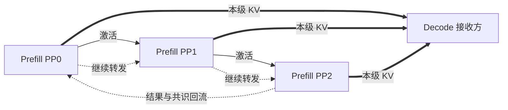
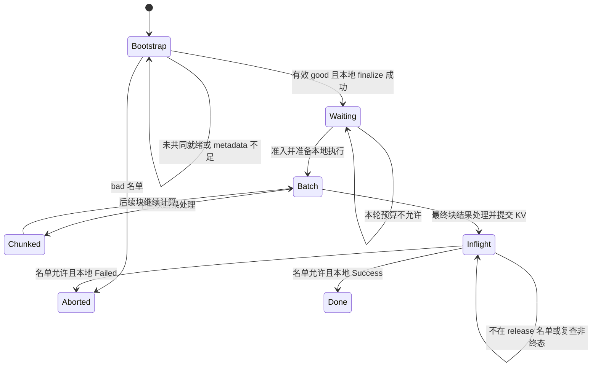
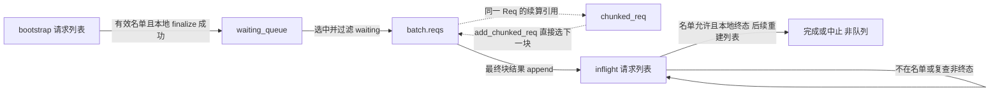

# PD Prefill 数据流状态机

本文是源码分析型学习资料，配合[数据流状态机交互页](https://asher-xunzhang.github.io/ai-infra-wiki/sglang/pd-dataflow/)阅读。先选一个场景，再按步骤观察各 PP 级的请求位置、最近一次 poll、KV 所有权和 metadata 槽。页面是源码机制的因果走读，不是实际运行 trace，也不用于估算吞吐或延迟。

## 0. 阅读基线与范围

| 项目 | 内容 |
| --- | --- |
| 源码仓库 | [sgl-project/sglang](https://github.com/sgl-project/sglang)；下文源码路径相对 `python/sglang/srt/` |
| 公开基线 | `main`，本地学习检出分支 `codex/main` 与已更新的 `upstream/main` 相同 |
| commit | `882577451e764a515df2a386a055012e8f075a16` |
| 读取时间 | 2026-09-17 |
| 源码工作区 | 学习检出目录干净；只读，没有切换分支或修改源码；相邻私有分支工作区未用于本页结论 |
| 操作边界 | 静态源码阅读、教学模型断言、页面交互检查；没有启动 SGLang，没有 GPU/NCCL/RDMA/Mooncake 运行验证 |
| 基本配置 | CUDA、普通 FULL attention、PP=3、depth=0；单请求 R0，输入 12 token，page size=4，无前缀命中，Decode 已有前缀长度=0 |
| 关闭的路径 | 普通 overlap、HiCache、staging、乐观 Prefill、投机、logprob、Mamba/DSA 等额外状态和早发缓存前缀 |
| 场景差异 | 分块场景按 4 token 分三块；“中间块跳过结果通信”显式开启 `SGLANG_PP_SKIP_PURE_CHUNKED_OUTPUT_COMM`，其它场景关闭 |

旧调度页固定 `279339f113b79af84f27fd3ac92d0a13bd3f4cbd`。该提交是新基线的祖先，向前相差 44 个提交；其中涉及 `scheduler_pp_mixin.py` 或 `prefill.py` 的提交只有 `25ce8063f7`（PP 与 EAGLE/MTP 兼容）。这是这两个文件的路径限定统计，不表示其余提交都不会影响推理。新页面独立固定新基线，不将旧页面的行号改称当前源码。

### 术语速查

| 术语 | 人话解释 |
| --- | --- |
| PP0 / PP1 / PP2 | 都是 Prefill 内部的流水级，每级拥有本地 Req、模型层和 KV |
| Decode | 接收 KV 的另一服务角色，不是 PP3 |
| batch | 一次执行的请求集合；不等于请求队列或全局轮次 |
| chunked_req | 仍有输入待算的请求引用；可在后续 batch 续算 |
| poll | 最近一次对传输状态的采样；页面不把每一次 send 自动映射为状态变化 |
| good / bad | 握手共同就绪 / 失败或取消的请求名单 |
| release | 对共同终态请求的收尾筛选名单；不是物理 DMA 退役证明 |
| 已提交边界 | `start_send_idx` 已前移到的位置；不代表 Decode 已接收 |

## 1. 先把四条通路分开

### 人话版

激活把“这部分层算出的中间结果”交给下一层；KV 把“以后 Decode 会用到的历史”交给另一服务；结果回流让各级处理对应 batch；控制消息负责对齐请求名单。这四条通路不能合成一个“数据已经传完”的状态。



**图意解读：** 三个 Prefill 级发送各自模型层的 KV，KV 不沿激活箭头依次经过所有 PP 级。结果与共识虽然都有环形路线，载荷与触发条件仍不同；交互页分别标注控制、激活、结果和 KV，当前步骤只点亮相关通路。图中的连线不承诺实际同时发生。

## 2. 请求位置与资源状态是两套信息



**图意解读：** 这是本页场景的教学状态，不是源码里一个同名枚举。Bootstrap、Waiting、Inflight 对应不同队列；Batch 是执行容器，Chunked 是续算关系。更复杂的运行中取消、重试、乐观 Prefill 等路径没有被这张简图穷举。

页面同时显示 metadata 槽、请求 KV 所有权和有效首 token：

- 进入 waiting_queue 前可能已经持有 metadata，但本例尚未为计算分配 KV。
- 前向与发送期间持有请求 KV；已提交部分不会因此自动释放。
- 中间块不追加有效首 token，也不会把整个请求当作完成。
- 成功收尾依次释放请求 KV 所有权、调用缓存 `finish(SUCCESS)`、清理 sender，随后归还 metadata 并移出 inflight。物理页可能仍由前缀缓存管理。

### 2.1 源码的状态机就是 queue 吗？

不是。queue 归属是调度状态的一部分；`pending_bootstrap`、`finished_reason`、`disagg_kv_sender.poll()`、KV 所有权、metadata 槽、batch 和续算引用共同决定能否前进。源码没有一个等同于本页教学阶段的单一 `state` 枚举。比如 `finalize_bootstrap` 已清除 pending 并分配 metadata，而 `pop_bootstrapped` 还未在函数尾重建列表时，请求仍在 bootstrap 列表里；同一个队列中字段已经变化。

[队列流转交互面板](https://asher-xunzhang.github.io/ai-infra-wiki/sglang/pd-dataflow/#queue-lab)默认跟随上方情景，但独立播放更细的容器操作。可选择本地 PP 级、单步、重播、跳到操作，并点击容器查看职责。飞行标签表达本步关系；卡片保持操作后的成员快照，减少等待动画结束才能读说明的负担。多个 R0 标签指向本级同一个 Req，并非多份请求。

| 源码容器 / 字段 | 实际含义 | 主要变化 |
| --- | --- | --- |
| `disagg_prefill_bootstrap_queue.queue` | PrefillBootstrapQueue 内部请求列表 | `add` 追加；`pop_bootstrapped` 过滤成功或失败条目 |
| `waiting_queue` | 等待选批的 Req 列表，不保证严格 FIFO | `extend(good_reqs)`；过滤掉 `can_run_set` 中选中的请求 |
| `ScheduleBatch.reqs` | 一次执行的 Req 引用集合 | `init_new(can_run_list, ...)`；后续 `filter_batch` 移除已完成或续算条目 |
| `scheduler.chunked_req` | 单个续算 Req 引用，不是队列 | 选批保留未算完者；最后一块 `add_chunked_req` 返回 None |
| `disagg_prefill_inflight_queue` | 最终块处理后待传输收尾的请求列表 | `append(req)`；处理终态后重建为 `undone_reqs` |
| `disagg_prefill_pending_chunk_rids` | 已发中间块但未结束分块的 rid 集合 | 中间块 send 后 add；最终块 send 后 discard；异常路径也须清理 |
| `mbs / last_mbs` | PP 微批槽中的 batch 引用 | 槽可继续引用旧 batch；不是 Req 必须逐站经过的 queue |
| `last_rank_comm_queue`、`send_*_work`、tensor inbox | 事件、通信任务或消息的容器 | 不画成请求队列，避免把控制与数据通信误当作 Req 入队 |



**图意解读：** 箭头表达准入或引用关系，不意味着所有容器互斥。`inflight.append(req)` 后，旧 `batch.reqs` 仍可保留同一个 Req，直到后续过滤。普通分块清理旧 batch 引用时，`chunked_req` 仍保留，KV 也仍持有；下一块直接通过 adder 选入，**不会每块都先回 waiting_queue**。最后一块选入时可以清空续算指针，但 Req 仍在执行 batch 内。

**真正回队的另一条路径：** 启用乐观 Prefill 时，`optimistic_release_and_requeue` 会释放 KV、重置请求，并根据尝试次数插入 waiting 或追加回 bootstrap。这是另一配置下的重试机制；本页关闭乐观模式，仅提供源码入口，不混入普通分块动画。

**源码锚点（均固定本页 commit）：**

| 行为 | 位置 |
| --- | --- |
| bootstrap 入队与过滤 | `disaggregation/prefill.py::PrefillBootstrapQueue.add / pop_bootstrapped` |
| waiting 入队 | `managers/scheduler_pp_mixin.py::process_bootstrapped_queue`，L605–623 |
| waiting 过滤、设置续算引用、构建 batch | `managers/scheduler.py::_get_new_batch_prefill_raw`，L4025–4060 |
| 续算直接选入及最后一块清空指针 | `managers/schedule_policy.py::add_chunked_req`，L950–1000 |
| 最终块进入 inflight | `disaggregation/prefill.py`，L860 |
| inflight 保留未完成者并重建列表 | `disaggregation/prefill.py::process_disagg_prefill_inflight_queue`，L972–1080 |
| 旧 batch 的引用过滤 | `disaggregation/prefill.py::process_prefill_chunk`，L1210–1251；`managers/schedule_batch.py::filter_batch`，L3571 |
| pending rid 集合与乐观回队 | `disaggregation/prefill.py`，L1508–1551 |

面板按本地 R0 的因果顺序归并步骤，不复现循环的逐条语句或跨级时钟。显示的 0 / 1 只统计示例请求；非全服务队列长度。静态断言覆盖三种 PP 级、十二种情景中的保留条件、并存引用、续算和清理次序，不构成设备运行证明。

## 3. 三道容易混淆的门

### 3.1 握手共识与本地准入

`_pp_pd_get_bootstrapped_ids` 按级内采样，沿 PP 求 good 交集和 bad 并集。取消请求从 good 移除并加入 bad，即使 `sender.abort()` 没把 poll 变成 Failed。

名单回流后，`pop_bootstrapped` 使用权威 good/bad 映射状态。good 不保证立即出队：`finalize_bootstrap` 必须取得 metadata 槽，再读取 Decode 前缀长度、初始化 sender。`process_bootstrapped_queue` 继续转发的是实际出队成功/失败名单。

**例子：** 三个 poll 都为 WaitingForInput，但 PP0 没空闲 metadata 槽。R0 仍在 PP0 bootstrap_queue，本轮实际准入 good 不含 R0，下游不能把原始 good 当成已完成的本地准入。页面在后续步骤显式假设槽位可用，再重新求名单，不用“等一会儿必然成功”代替资源条件。

### 3.2 选批、计算完成与结果可处理

`_select_prefill_admission` 可以返回 NO_TOKEN；`_commit_prefill_admission` 才提交选批的准入与记账。进入 waiting_queue 不代表已进入 batch。

`_pp_launch_batch` 提交前向并记录设备事件，不是同步证明 GPU 完成。结果环收到对应 batch 的结果后，本地结果处理还要满足 D2H 事件。页面的“计算完成”帧代表事件约束满足后的概念快照；“结果等待”帧单独展示 CPU 的阻塞点。

### 3.3 终态交集与本地清理

```text
本地终态集合 = {rid | poll 为 Success 或 Failed}
共同终态集合 = PP0 终态集合 ∩ PP1 终态集合 ∩ PP2 终态集合
实际本地清理 = rid 在返回名单中，并且本地再次 poll 仍为终态
```

**例子：** PP0=Success、PP1=Failed、PP2=Transferring。共同集合为空，三个级保留请求。本例后来 PP2=Success，再次求交允许收尾；PP1 走失败分支，其余级可能走成功分支。不能把三个级都清理完描述成端到端成功。

release 复查场景来自源码防御分支：即使 rid 已在名单，本地瞬态仍放回 undone。它展示采样差异的处理，不声称真实后端必然存在 Success → Transferring 的合法状态逆转，也不把此机制当作 DMA 退役证明。

## 4. 分块时究竟少了什么、保留了什么

R0=[0,12)，拆为 B1=[0,4)、B2=[4,8)、B3=[8,12)。每级保留先前前缀 KV，后续 batch 继续写入新增部分。

| 步骤 | 中间块 | 最终块 |
| --- | --- | --- |
| 激活 | 仍沿 PP 前向 | 仍沿 PP 前向 |
| 结果处理 | 不追加有效首 token，维护续算 | 追加首 token，加入 inflight |
| KV 发送 | 本例在非 overlap 的 `process_prefill_chunk` 路径发送整页 | 结果处理中写 metadata 并发送剩余范围 |
| 请求所有权 | 保留 | 仍保留，直到满足收尾条件 |

`_send_kv_chunk` 对非最终块将尾部向下对齐到完整页。本例所有区间已对齐，未演示非整页、staging 网格、前缀早发、分段传输等额外路径。

当 `SGLANG_PP_SKIP_PURE_CHUNKED_OUTPUT_COMM` 开启且满足单请求 EXTEND、纯中间块、无 logprob 时，`_pp_make_skip_output_result` 使用本地占位结果，不发送对应 output。占位不是有效 token；激活与 KV 通路仍保留。最后一块仍走正常结果回流。

## 5. 如何使用交互页

1. 先播放“正常交接”，区分控制、激活、结果与 KV。
2. 用场景选择切换等待/失败条件，再从“跳至关键变化”定位阻塞点。
3. 点击 PP0/PP1/PP2，检查本级状态转换和字段前后变化。带 Δ 的字段是本步变化。
4. 对比分块场景中“已计算”和“已提交”两行 token；它们不是当前物理内存占用图。
5. 暂停、前后单步、拖动步骤条均可回看快照；当前场景、步骤和 PP 级可通过链接分享。

自动播放只是走读速度。等待后的恢复由预设外部条件变化推动，不是依据时钟模拟真实资源恢复。各级连续展开是一种阅读顺序，不表示三级同时进入同一步；本级结果处理后即可提交 KV，不等其他级统一处理完。

## 6. 源码锚点与验证

页面每一帧均链接固定提交中的源码。模型在 `pages/sglang/pd-dataflow/model.js`，界面不另写一套隐式状态。

| 机制 | 源码 |
| --- | --- |
| 握手交并集及取消 | [scheduler_pp_mixin.py:625](https://github.com/sgl-project/sglang/blob/882577451e764a515df2a386a055012e8f075a16/python/sglang/srt/managers/scheduler_pp_mixin.py#L625) |
| 权威名单映射 | [utils.py:52](https://github.com/sgl-project/sglang/blob/882577451e764a515df2a386a055012e8f075a16/python/sglang/srt/disaggregation/utils.py#L52) |
| metadata 与本地准入 | [prefill.py:395](https://github.com/sgl-project/sglang/blob/882577451e764a515df2a386a055012e8f075a16/python/sglang/srt/disaggregation/prefill.py#L395)、[prefill.py:450](https://github.com/sgl-project/sglang/blob/882577451e764a515df2a386a055012e8f075a16/python/sglang/srt/disaggregation/prefill.py#L450) |
| 选批与提交 | [schedule_policy.py:1267](https://github.com/sgl-project/sglang/blob/882577451e764a515df2a386a055012e8f075a16/python/sglang/srt/managers/schedule_policy.py#L1267)、[schedule_policy.py:1347](https://github.com/sgl-project/sglang/blob/882577451e764a515df2a386a055012e8f075a16/python/sglang/srt/managers/schedule_policy.py#L1347) |
| 设备前向与结果等待 | [scheduler_pp_mixin.py:1601](https://github.com/sgl-project/sglang/blob/882577451e764a515df2a386a055012e8f075a16/python/sglang/srt/managers/scheduler_pp_mixin.py#L1601)、[scheduler_pp_mixin.py:344](https://github.com/sgl-project/sglang/blob/882577451e764a515df2a386a055012e8f075a16/python/sglang/srt/managers/scheduler_pp_mixin.py#L344) |
| 中间块与最终块 | [prefill.py:800](https://github.com/sgl-project/sglang/blob/882577451e764a515df2a386a055012e8f075a16/python/sglang/srt/disaggregation/prefill.py#L800)、[prefill.py:1210](https://github.com/sgl-project/sglang/blob/882577451e764a515df2a386a055012e8f075a16/python/sglang/srt/disaggregation/prefill.py#L1210) |
| 发送区间与 metadata | [prefill.py:1311](https://github.com/sgl-project/sglang/blob/882577451e764a515df2a386a055012e8f075a16/python/sglang/srt/disaggregation/prefill.py#L1311) |
| 终态交集与本地复查 | [scheduler_pp_mixin.py:667](https://github.com/sgl-project/sglang/blob/882577451e764a515df2a386a055012e8f075a16/python/sglang/srt/managers/scheduler_pp_mixin.py#L667)、[prefill.py:972](https://github.com/sgl-project/sglang/blob/882577451e764a515df2a386a055012e8f075a16/python/sglang/srt/disaggregation/prefill.py#L972) |
| 纯中间块跳过结果通信 | [scheduler_pp_mixin.py:44](https://github.com/sgl-project/sglang/blob/882577451e764a515df2a386a055012e8f075a16/python/sglang/srt/managers/scheduler_pp_mixin.py#L44) |

运行 `node scripts/test_pd_dataflow.cjs` 检查全部场景的状态、区间、终态清理和资源保留不变量。设置 `SGLANG_SOURCE_ROOT` 为本地开源源码检出目录时，还会以 `git show` 只读校验全部固定提交的精确源码锚点，不要求切换当前分支。

这些检查验证教学模型与所引用代码位置，不替代 SGLang 运行验证。页面未模拟真实后端错误传播、网络延迟、底层传输完成与物理页复用安全性。
