# SGLang PP 共识机制源码学习文档

本文是**源码分析型学习资料**，面向第一次深入 Pipeline Parallel 调度器的读者。主线是：**各 PP stage 如何在请求状态异步变化的情况下，保持请求、microbatch、传输处理和资源生命周期的协调。**

先给出最重要的结论：SGLang 这里的“共识”是一组具体的调度协调机制。普通 PP 靠输入传播、相同调度逻辑和输出回环对齐；PD+PP 额外用 RID 集合协调队列迁移。不同队列使用不同规则，不能全部概括成“成功取交集、失败取并集”，也不能把收到共识名单等同于所有设备已经完成或所有 stage 已原子提交。

本文另于同日补入官方作者博客与社区讨论：计算原图见第 8.5 节，版本沿革、故障帖和未合并方案见第 15 节。网络补充不改变下列本地源码基线。

建议分三遍读：第一遍读第 1～3 节建立概念；第二遍读第 4～8 节跟着一条请求走；第三遍用第 9～13 节检查边界、排障和回到源码。

## 0. 阅读基线与范围

### 0.1 实际读取了哪个开源分支

| 项目 | 内容 |
| --- | --- |
| 项目上游 | [sgl-project/sglang](https://github.com/sgl-project/sglang) |
| 固定源码入口 | [固定源码快照](https://github.com/sgl-project/sglang/tree/72d5c5bb73cadd7ffbf5114e5f81e29d36b6c61a) |
| 官方开源 remote | `upstream` → `git@github.com:sgl-project/sglang.git` |
| 开源基线 | 本地已有 `upstream/main` 快照；不采用个人 fork 的 `origin/main` 或内部 `internalupstream/main` |
| 阅读工作区分支 | `codex/sglang-source-study-20260909` |
| 固定 commit | `72d5c5bb73cadd7ffbf5114e5f81e29d36b6c61a` |
| commit 时间 | 2026-09-09 16:33:39，Asia/Shanghai |
| 读取日期 | 2026-09-14 |
| 阅读工作区状态 | 开始读取时工作区干净，HEAD 与本地 `upstream/main` 相同 |
| 原仓库状态 | 保留 `muxi-main@e8d7e7fe004419902c04641e2ae2f4a973339c60` 及原有未跟踪文件；不切换、清理或覆盖 |
| Wiki 状态 | 开始时已有 README、其他学习资料和图片的改动；本次新增本文并补充 README 入口，保留既有内容 |
| 操作边界 | 只读本地固定源码及公开网页/PR，编写 Markdown、保存技术原图并做静态文档检查；未启动 SGLang、运行模型或进行 GPU/网络实验，未向 SGLang 源码仓提交或推送 |
| 时效边界 | 本次没有刷新远端分支，本文描述该本地开源快照，不声称是 2026-09-14 官方最新实现 |

本文放在 `sglang/`，与 [PD 分离下的 PP 源码学习文档](<PD 分离下的 PP 源码学习文档.md>)、[Pipeline Parallel 模式学习文档](<../parallelism/SGLang Pipeline Parallel 模式学习文档.md>)相邻。前者基于历史 `muxi-main`，后者主要整理第三方文章；本文独立核对开源固定版本，不把三个版本的实现混在一起。现有 [开源源码分阶段学习目录](../source-study/README.md)提供更完整的系统背景。

正文源码路径均相对于 **SGLang 仓库根目录**。文末源码索引提供文件、符号、行号和固定 commit 链接。

### 0.2 本文讲到哪里

覆盖普通 PP 的调度对齐、PP 内的 TP/CP 状态归约、Prefill bootstrap/transfer、Decode retract/prealloc/transfer、共识回传与二次过滤、microbatch 环形槽位、通信顺序和内存释放边界。另用两节区分 HiCache 的首 stage 决策传播与可选的 rank 分歧检测器。

不逐个分析模型层切分、全部 KV 后端协议、所有模型与并行组合，也不证明任意失败场景下的端到端容错。文中的集合例子、时序示意和排障推导是**依据源码的教学归纳**，不是运行日志或实验结果。比喻只用于解释对应关系；示例中人为设定的请求、资源状态和时间不代表真实实验。

### 0.3 术语速查

| 术语 | 人话解释 | 本文特别要区分的事情 |
| --- | --- | --- |
| PP stage / PP rank | 一段模型层对应的一组执行进程 | 一个 stage 内还可能有多个 TP、CP 参与者 |
| TP / attention TP | 同一层内协作计算的 tensor 分片 | 开启 DP attention 后，`tp_size` 不等于单个 attention shard 的 TP 数 |
| CP / attention CP | 同一 attention 工作的上下文分片 | stage 内 poll 要先沿 TP、再沿 CP 归约 |
| attention DP shard | 有自己请求队列的一组 attention 协作者 | 不同 DP shard 不应投票决定同一份请求名单 |
| RID | 请求标识 `rid` | 跨 PP stage 对齐“是哪条请求”；不要求本地 KV 槽号相同 |
| bootstrap room | P/D 传输的会话标识 | 用于连接和 metadata 验证；不等于 PP microbatch 编号 |
| `KVPoll` | sender/receiver 对连接或传输状态的观察 | 是状态编号，不能统一解释为“完成百分比” |
| microbatch 槽位 | event loop 保存一份 batch 状态的位置 | 槽位会循环使用，不是永久请求 ID |
| candidate | 沿 PP 正向传播、逐站合并的候选 RID 集合 | 还没有被每个 stage 实际消费 |
| consensus / release 名单 | 尾 stage 汇总后回到首 stage，再向后传播的名单 | 具体含义取决于队列；`release` 不总是“释放显存” |
| proxy tensor | 当前 forward 的中间激活 | 不是 KV cache，也不是状态投票消息 |
| output 回环 | 尾 stage 的 token 等结果回到各 stage | 让各 stage 使用同一份生成结果推进本地状态 |

### 0.4 动画阅读入口

第一次阅读，可以先看下面三张动画，再回到对应章节对照源码。每张约 17～19 秒，循环播放；需要慢慢看或不希望播放动画时，打开旁边的静态步骤图。

| 想先弄懂的问题 | 动画 | 静态版 / 正文 |
| --- | --- | --- |
| 各 stage 的意见怎样变成同一份候选名单？ | [逐站汇总 RID](../../images/sglang-pp-consensus/06-rid-consensus.gif) | [静态步骤](../../images/sglang-pp-consensus/06-rid-consensus-steps.png)；第 4.2 节 |
| 已在 good 里，为什么还没有开始跑？ | [准入与调度的几道门](../../images/sglang-pp-consensus/07-admission-gates.gif) | [静态步骤](../../images/sglang-pp-consensus/07-admission-gates-steps.png)；第 6.1 节 |
| 请求已经取消，KV 槽位为何仍被占用？ | [取消与延迟释放](../../images/sglang-pp-consensus/08-abort-deferred-release.gif) | [静态步骤](../../images/sglang-pp-consensus/08-abort-deferred-release-steps.png)；第 10.2 节 |

**动画范围：** 三张均为整理者根据本文固定源码绘制的教学示意，画面停顿是阅读节奏，没有计量意义。第一张只演正向候选归约；第二张跟踪单个 Prefill stage；第三张只演满足延迟释放条件后，由后端判安全再释放的路径。它们不替代原有 Mermaid、源码分支和作者实验图片。

## 1. 为什么 PP 需要共识

### 1.1 同一条请求，在不同 stage 上是不同的本地对象

以 `PP=3` 为例，请求 A 的模型执行要经过 PP0、PP1、PP2。每个 stage 有自己的 Scheduler、请求对象、队列和本地 KV 资源。RID 相同只是让大家知道自己在处理同一条业务请求，并不意味着共享同一块 Python 内存。

如果 PP0 认为下一批是 `[A, B]`，PP1 认为下一批只有 `[A]`，下游收到的 hidden states 就可能无法和本地 batch 的形状、顺序对应。如果 PP0 已经删除 A，而 PP2 还在计算 A 的层，后续结果和资源释放也可能失配。

PD 分离进一步放大了这个问题：不同 stage 的 sender/receiver 可以在不同时间握手成功、完成传输或发现失败。**本地 ready 不能直接推出整个 PP 流水线 ready。**

### 1.2 要对齐的其实有四层

| 层次 | 必须协调什么 | 主要机制 |
| --- | --- | --- |
| 输入 | 各 stage 看见哪些新请求和控制请求 | `ingest_requests()`、请求链式传播、本 stage 内广播 |
| 执行 | 每个槽位运行什么 batch、处理哪个输出 | 各 stage 的调度循环、槽位索引、proxy/output 顺序 |
| 队列迁移 | 哪些 RID 可以结束握手、进入传输、处理传输结果或恢复 | PD+PP 的集合归约与结果回传 |
| 生命周期 | 何时消费输出、更新状态、释放本地资源 | device event、队列处理函数及 KV 后端的完成/释放约定 |

源码主入口是 `scheduler.py::dispatch_event_loop`，[S01]。它按普通、Prefill、Decode 三种模式选择三个 PP event loop，而不是让所有模式都跑一套相同的共识步骤。

### 1.3 三类消息必须分开画

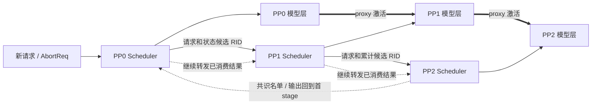

**图意解读：** 实线细箭头突出请求和状态的正向链，虚线表示返回结果的逻辑路线，粗箭头表示激活数据。控制名单与 output tensor 虽然都可能走“尾 → 首 → 后续 stage”，却使用不同封装和处理函数。P/D 之间的 KV 传输不画成这条 PP 激活链的一部分。

### 1.4 这里不是多数票，也不是 Raft/Paxos

这些 helper 没有选主、任期、复制日志、多数派提交或失联 stage 接管逻辑。PP0 是拓扑上的输入端，尾 stage 是这次集合汇总的最后一站，角色由流水线位置确定。

在需要全 stage ready 的路径中，只要一站尚未 ready，就不能因为其余两站同意而放行。整个机制仍依赖参与进程按协议顺序持续执行；Python 消息接收和 collective 都可能等待其他进程。这里要解决的是推理调度协调，不是允许少数模型 stage 消失后继续推理。

### 1.5 一个贯穿全文的比喻：三个工位与同一张订单

可以把 PP0、PP1、PP2 理解成依次加工一件产品的三个工位。一条请求 A 是订单 A，每站持有自己的订单记录，只负责产品的一部分工序。大家需要知道这一批加工哪些订单、按什么顺序，以及哪些订单已取消。

| 比喻中的对象 | 对应源码概念 | 帮助理解什么 |
| --- | --- | --- |
| 工位 | PP stage；站内还可能有 TP/CP 协作者 | 先协调站内状态，再协调站间状态 |
| 订单号 | RID | 各站用同一标识对齐请求，不要求本地对象地址相同 |
| 本批订单清单 | batch 的有序 RID | 同样是两件产品，`[A,B]` 与 `[B,A]` 也不能混用 |
| 向下一工位交接的半成品 | proxy tensor | 真正传递计算结果，与“可以处理谁”的控制名单分开 |
| 允许进入下一步的通知 | 某条队列的共识名单 | 通知的具体含义要看队列，不能直接理解成全部完工 |

**比喻的边界：** 三个工位负责不同模型层，不是三个人重复算同一道题后投多数票；KV cache 是模型后续计算需要的状态，不能简单等同于那件沿工位移动的“半成品”。后文仍按真实的 queue、poll 和 event 判断行为。

## 2. 普通 PP：输入相同、各自调度、共享输出

### 2.1 不是 PP0 每轮发送一个完整 ScheduleBatch

`event_loop_pp()` 的主线如下，[S02]：

1. 从 `running_mbs[mb_id]`、`last_mbs[mb_id]` 取出当前槽位的状态。
2. 调用 `ingest_requests()` 接收并处理新输入；非尾 stage 把收到的请求列表传给下一站。
3. **每个 stage 都调用** `get_next_batch_to_run()`，产生自己的 `ScheduleBatch`。
4. 非首 stage 接收当前 batch 对应的 proxy tensor，执行自己的模型层。
5. 从输出回环得到较早 batch 的结果，调用本地 `process_batch_result()`。

因此，维持相同的输入顺序、调度条件和状态推进顺序是正确性的前提。收到相同请求并不会自动证明任意本地资源状态下都能生成相同 batch。

**小例子：** 两站都保存 `[A, B]`，都拿到尾 stage 的下一 token `[x, y]`，就可以分别把 x 加到本地 A、y 加到本地 B。若一站自行重排成 `[B, A]`，即便 token 数量仍相同，也已经破坏请求与输出的对应关系。

### 2.2 请求怎么进入各 stage

`Scheduler.ingest_requests()` 把首 stage 上产生的 timeout abort 与外部输入一起交给 `SchedulerRequestReceiver`，[S03]、[S04]：

- PP0 的 attention TP0/CP0 从入口取请求。
- PP>0 的对应 leader 从前一个 PP stage 接收请求。
- 收到后在本地相关并行组广播，再交给 `process_input_requests()`。
- DP attention 下区分 work/control；work 在本 attention shard 内广播，control 的广播范围由配置决定。

这里同步的是输入事件。它不能替代 PD sender/receiver 状态投票，因为网络传输完成的时间并不包含在最初那份请求里。

### 2.3 输出为什么还要绕回来

尾 stage 通过 `_pp_launch_batch()` 记录完成 event，把 event 和输出放入 `last_rank_comm_queue`。`_pp_send_output_to_next_stage()` 按槽位节奏取出结果，尾 stage 发回 PP0，其他 stage 再转发已收到的输出。[S05]

输出包括 `next_token_ids`，还可带 logprob、采样辅助数据等；`_pp_prep_batch_result()` 把它们还原为本地 result，更新下一轮输入所需状态。对常规生成路径而言，各 stage 不是各自独立采样出一份答案再投票。

源码也有特殊分支：`PREBUILT` 跳过相应 proxy/output 处理；显式启用 `SGLANG_PP_SKIP_PURE_CHUNKED_OUTPUT_COMM` 时，满足“单请求 EXTEND、不是最后一个 prefill chunk、不返回 logprob”等条件可跳过真实 output 通信，构造占位结果。该环境变量在本基线默认关闭。不能把这类条件分支扩写成“每个 chunk 都必须回传真实 token”或“普通输出都可跳过”。[S02]、[S05]

## 3. PD+PP 共识的第一层：先在 stage 内归约

### 3.1 `get_rids()` 并非只读 leader 的 poll

`SchedulerPPMixin.get_rids()` 对队列中的 sender 或 receiver 调用 `poll_and_all_reduce_attn_cp_tp_group()`，得到 stage 内一致的状态序列，再按状态抽取 RID。[S06]、[S07]

顺序是：**本地 poll → attention TP MIN → attention CP MIN → 抽取 RID → 跨 PP 合并集合。**

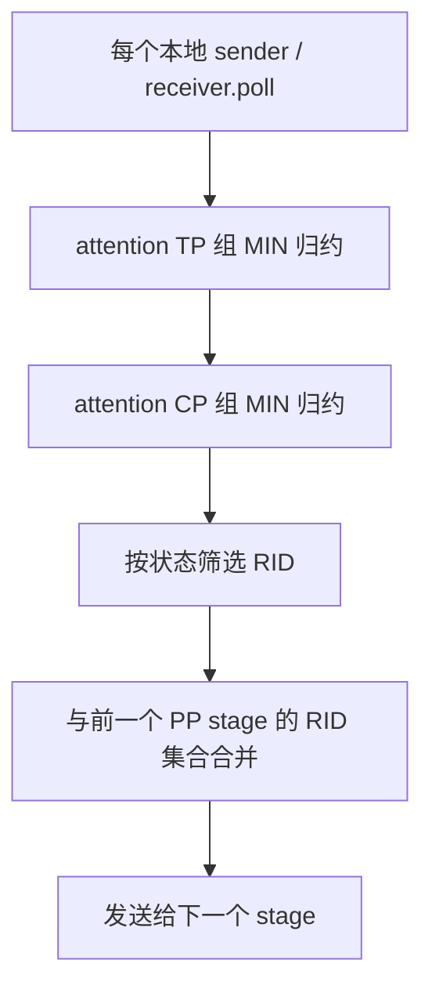

**图意解读：** TP/CP 归约处理的是按队列位置排列的状态数组，PP 集合处理的是 RID。前者要求参与归约的队列长度与请求顺序对应；后者不要求各 stage 的内存地址相同。不同 attention DP shard 不在这一步共享一份请求集合。

### 3.2 为什么是 MIN

`KVPoll` 在本基线中的值如下，[S08]：

| 状态 | 值 | 人话解释 |
| --- | ---: | --- |
| `Failed` | 0 | 后端报告失败 |
| `Bootstrapping` | 1 | 握手尚在进行 |
| `WaitingForInput` | 2 | 等待下一步输入；具体是 metadata 还是 KV 输入取决于 sender/receiver 阶段 |
| `Transferring` | 3 | 传输中 |
| `Success` | 4 | 后端报告成功 |

由编号可直接得到：`MIN(Success, Transferring)=Transferring`；`MIN(WaitingForInput, Failed)=Failed`。这把 stage 内某个参与者的落后或失败反映到公共状态中。

注意“层内归约”和“层间合并”的粒度不同。例如 TP 内 `[Failed, Transferring]` 归约为 Failed，这个 **stage** 随后会被列为 terminal；PP 集合不会再逐个保存其 TP 成员状态。因此，terminal 共识本身不能证明每个传输参与者的设备写入都已经退场，仍需后端完成/失败语义保证。

### 3.3 两个名字相似、工作完全不同的 helper

| helper | 实际工作 |
| --- | --- |
| `poll_and_all_reduce_attn_cp_tp_group` | 真正 poll，并调用分布式 MIN 归约 |
| `poll_and_all_reduce_pp` | 把**已有** good/bad RID 名单映射到本地 poll 数组；函数内没有新的 PP 通信，也不重新 poll |

后者的映射规则是：RID 在 bad 中 → Failed；否则在 good 中 → `ready_poll`；否则 → `None`。**bad 优先于 good。** 缺少任一共识名单会抛出 `ValueError`。[S09]

`None` 在这里是“这次名单没有覆盖该请求”，不是 Bootstrapping 或 Failed，也不表示可以释放。

**名单翻译例子：** 假设本地队列为 `[A,B,C]`，收到 good=`{A,B}`、bad=`{B}`，且 `ready_poll=WaitingForInput`。helper 只做下面的翻译，[S09]：

| 本地请求 | 翻译结果 | 原因 |
| --- | --- | --- |
| A | WaitingForInput | 只在 good 中 |
| B | Failed | 同时在两份名单里，bad 优先 |
| C | None | 本轮名单没有覆盖它 |

这里故意让 B 同时出现在两份输入中，演示冲突优先级，不表示正常候选归约一定产生这种重叠。可以把 helper 理解成“按通知单填写本地处理栏”；C 的空白栏不能自行填成成功。Prefill 如何进一步处理名单外的局部失败，见第 6.2 节。

这一设计的历史动机见 [PR #31869](https://github.com/sgl-project/sglang/pull/31869)：避免共识后再次 poll 导致局部决定改变。其合并版本和范围在第 15.2 节单独核对。

## 4. 五条队列路径，不是一个集合公式

### 4.1 总表

下面 `G_s`、`B_s`、`T_s`、`R_s` 都表示某一轮、某个 PP stage 的本地集合；包含前一节的 TP/CP 归约结果。

| 场景 | 本地候选条件 | 跨 PP 正向归约 | 回传后实际动作 |
| --- | --- | --- | --- |
| Prefill bootstrap | good=`WaitingForInput`，bad=`Failed`；本地 abort 加入 bad | good 交集，bad 并集 | `pop_bootstrapped()` 成功初始化 sender 后进入 waiting queue；失败走 bootstrap 清理 |
| Prefill transfer | sender 为 `Success` **或** `Failed` | terminal 交集 | 检查本地 poll 后处理成功/失败，结束 inflight 状态 |
| Decode retract | 当前 `mb_id` 对应的 retracted RID | RID 交集 | 有容量才恢复到 waiting queue |
| Decode prealloc | good=`WaitingForInput`，bad=`Failed`；本地 abort 加入 bad | good 交集，bad 并集 | 容量与资源检查通过后分配目标位置、发送 metadata，进入 transfer queue |
| Decode transfer | receiver 为 `Success` **或** `Failed` | terminal 交集 | 重新检查传输及本地附加条件；成功进入 waiting queue，失败走清理/延迟释放 |

对应 helper 集中在 `scheduler_pp_mixin.py`，[S10]、[S11]、[S12]、[S13]。

### 4.2 bootstrap/prealloc：全部 ready 才能进入 good

不考虑 abort 时，正向链等价于：

```text
G = G_0 ∩ G_1 ∩ ... ∩ G_(P-1)
B = B_0 ∪ B_1 ∪ ... ∪ B_(P-1)
```

每站还执行 `_route_aborts_to_bad()`：从 good 删除自己已标记 `FINISH_ABORT` 的 RID，并把它们加入 bad。它也能让还卡在 Bootstrapping、底层 `abort()` 未把 poll 改成 Failed 的请求进入失败传播路径。

**三 stage 例子：**

| stage | good | bad |
| --- | --- | --- |
| PP0 | A、B、C | D |
| PP1 | A、B | C |
| PP2 | A、C | E |

尾 stage 汇总得到 good=`{A}`，bad=`{C,D,E}`。B 未被判失败，但没有全 stage ready，继续等待。C 尽管在部分 stage ready，也会走 bad。

若 C 同时出现在某次输入的 good/bad 中，`poll_and_all_reduce_pp()` 的 bad 优先规则会将其映射为 Failed。不要仅凭“RID 在 good 中”判断最终分支。

**动画：一份候选名单怎样经过三个工位。**

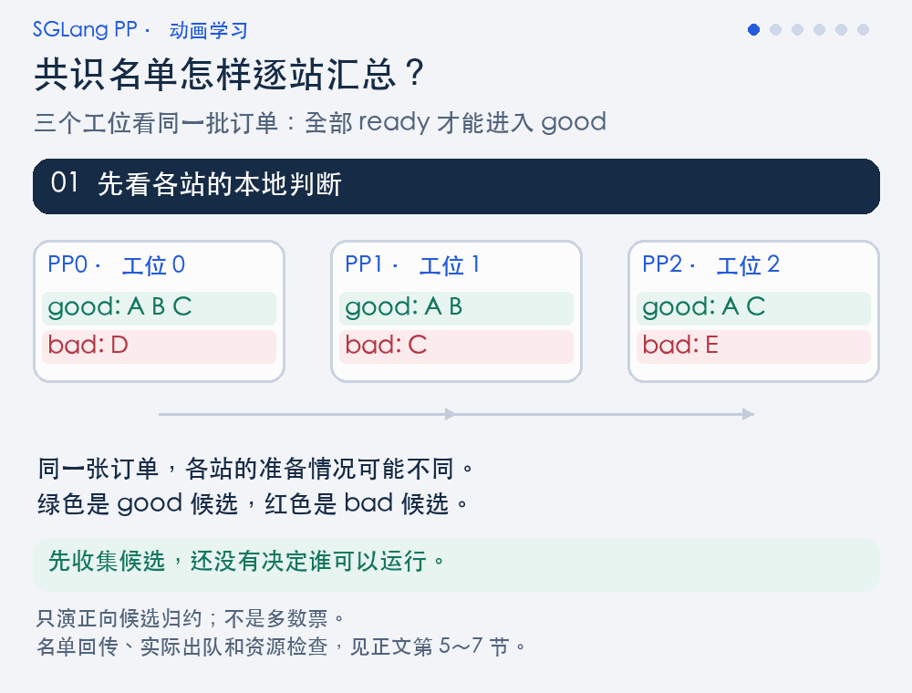

**图意解读：** 跟着蓝色“候选”标记移动，观察底部累计栏：good 逐步求交集，bad 逐步求并集。最后 A 在 good、B 继续等待、C/D/E 在 bad；终幕按请求类别展示结果，不再代表三个 stage。此时只完成正向汇总，还没有演示结果回传或各站实际出队。[S10]、[S11]、[S13]

<details>
<summary>不播放动画：展开静态步骤图</summary>


静态图逐行对应动画的六个状态；回传与名单消费继续阅读第 5 节。

</details>

### 4.3 transfer：大家都终结，不等于大家都成功

P、D 两端的 transfer helper 都先构造：

```text
T_s = {rid | stage s 归约后的 poll 属于 {Success, Failed}}
T = T_0 ∩ T_1 ∩ ... ∩ T_(P-1)
```

这份名单只带 RID，不带“哪个 stage 成功、哪个 stage 失败”的向量，也不计算一个全 PP 的统一 Success/Failed 值。

| 同一 RID 在 PP0 / PP1 / PP2 的状态 | 是否进 terminal 交集 | 可以得出的结论 |
| --- | --- | --- |
| Success / Success / Success | 是 | 本轮各 stage 的 poll 都终结且成功；仍有本地消费检查 |
| Success / Transferring / Success | 否 | 至少一站尚未终结 |
| Success / Failed / Success | 是 | 各站都终结，但结果并不全成功 |
| Failed / Transferring / Success | 否 | 这条路径不会仅凭一个 Failed 立即放行其余未终结 stage |

**比喻：三站都交回了处理报告。** 两站报告成功，一站报告失败，说明报告已经收齐，所以请求可进入 terminal 名单；这显然不等于三份报告都写着成功。如果还有一站仍在处理中，就连“报告收齐”也不成立。这个比喻只解释名单语义，不能把“交了报告”理解成底层所有设备写入已经停止。

**边界：** 统一失败传播还要追踪 sender/receiver 和后端错误通知。单看这两个 PP helper，不能宣称“任一 transfer 失败必然使所有 stage 在同一轮都执行失败分支”。

### 4.4 retract：先对齐恢复资格，再看能恢复多少

`_pp_pd_get_retract_ids(mb_id)` 遍历 Decode 的 `retracted_queue`，为尚未绑定槽位的请求写入 `retraction_mb_id`，只提取当前槽位的 RID，然后沿 PP 链求交集。[S12]

它协调的是**已经 retract 的请求如何恢复**，不是各 stage 对“现在撤回哪条 running request”进行多数票选择。恢复时 `resume_retracted_reqs()` 还检查请求池和 full/SWA KV 预算，执行 `_pre_alloc()` 与 `retraction_restore()`。[S14]

### 4.5 RID 集合一致，不代表列表顺序自动一致

这些 helper 多次使用 `list(set(...))`，集合运算保证的是成员关系，不承诺业务调度顺序。实际出队函数通常沿本地队列遍历，把共识 RID 当作筛选条件，再返回实际处理的请求。

因此，理解 batch 一致性时要同时检查**名单包含谁**与**队列按什么顺序消费**。共识也不要求 A 在所有 stage 上使用相同的 KV page 索引；各 stage 可以有自己的本地位置，但请求、token 顺序和层归属必须对应。

## 5. 共识如何绕一圈：汇总、回传、消费、继续转发

### 5.1 正向归约与返回传播是两段不同的链

以三个 stage 为例，某一逻辑轮的路线是：

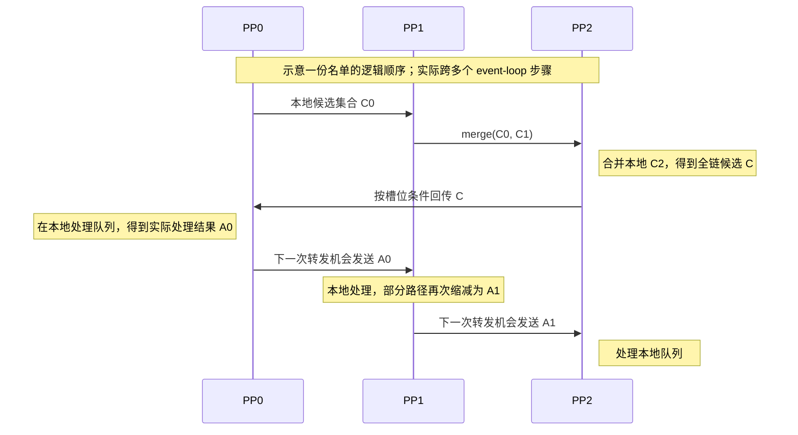

**图意解读：** 尾 stage 先完成候选汇总，再把名单发回首 stage。非尾 stage 转发的可能是“自己实际处理后的结果”，而不是最初名单的原样广播。图中 `C/A` 是教学符号，源码载荷仍是 RID 列表或 `[good, bad]`。

`_pp_pd_send_consensus_bootstrapped_ids()` 同时被 Prefill bootstrap、Decode retract 和 Decode prealloc 复用；名字包含 bootstrap 不代表它只用于 Prefill。transfer 使用 `_pp_pd_send_consensus_release_ids()`。[S15]

### 5.2 哪些路径会改写回传名单

| 消费函数 | 返回值及后续传播 |
| --- | --- |
| `process_bootstrapped_queue` | 返回实际出队的 `[good_rids, failed_rids]`，event loop 存起来继续传给下一站 |
| `process_retract_queue` | 返回真正恢复的 RID；未获资源者不在返回列表 |
| `process_prealloc_queue` | 返回真正预分配和失败处理的两份 RID 列表 |
| `process_decode_transfer_queue` | 返回成功转入 waiting queue 的 RID；未完成本地检查或失败的请求不在此列表 |
| `process_disagg_prefill_inflight_queue` | 返回本地 done 请求，但 **Prefill PP event loop 不用该返回值改写 release 名单**；继续保存收到的名单 |

这个不对称非常重要：不能写成“五条路径都原样广播”，也不能写成“五条路径都会用本地出队结果缩减返回名单”。[S10]～[S16]

### 5.3 不能把返回传播叫作全局原子提交

bootstrap/prealloc 的 good 是**状态资格**，不包含所有资源都已预留的承诺。比如 PP0 处理成功，PP1 因 metadata 或 KV 容量不足没有实际出队，PP1 的返回名单会减少。但在这些 helper 中，看不到自动撤销 PP0 先前动作的回滚轮，也看不到对所有 stage 的最终处理结果再次做原子提交投票。

因此，可以准确地说：源码采用“先归约状态，再沿链应用并传播结果”的协议。其端到端正确性依赖本地队列、容量策略、通信顺序和后端状态的配合，不能仅由集合公式推出。

**把资格与实际出队拆开看：** 假设 A 已进入 bootstrap good。PP0 消费名单时拿到了 metadata 槽位并完成 `finalize_bootstrap()`；PP1 消费时没有槽位，`finalize_bootstrap()` 返回 False，A 仍留在 PP1 的 bootstrap queue。[S16]

像两个工位都拿到了“订单材料检查通过”的通知，但其中一个工位暂时没有工作台。通知回答的是资格，实际开工还需要本地资源。源码在这类消费分支中允许返回名单反映实际处理结果；不能靠这份通知推导 PP0 的先前动作会自动撤销。这里是隔离单个条件的假设算例，不宣称生产环境必然形成这种资源组合。

**这是静态边界分析，不是已复现故障。** 若要判断异构 stage 容量、metadata 延迟、某站局部失败是否实际导致分歧，需要在指定配置下观察同一 RID 的完整环路。第 15.3 节补充了社区关于类似边界的故障报告；作者的报告与本次本地静态核对分别标注。

## 6. Prefill 侧：从握手到传输结束

### 6.1 bootstrap good 之后发生了什么

调用链：[S10]、[S16]。

```text
_pp_pd_get_bootstrapped_ids
  → bmbs[mb_id] 保存本轮累计状态
  → 尾 stage 汇总并回传 [good, bad]
  → process_bootstrapped_queue
  → PrefillBootstrapQueue.pop_bootstrapped
  → finalize_bootstrap
  → waiting_queue.extend(good_reqs)
```

`finalize_bootstrap()` 要分配 metadata buffer，读取 Decode prefix 长度，计算待传 KV 的 page 数，调用 sender `init()`，再清除 `pending_bootstrap`。没有 metadata 槽位时返回 False，请求继续留在 bootstrap queue。

因此，看到 WaitingForInput / good RID，既不代表 GPU 已执行 prefill，也不代表请求已经拿到完整推理所需的本地资源。

**动画：拿到开工通知，还要有工作台并排到班次。**

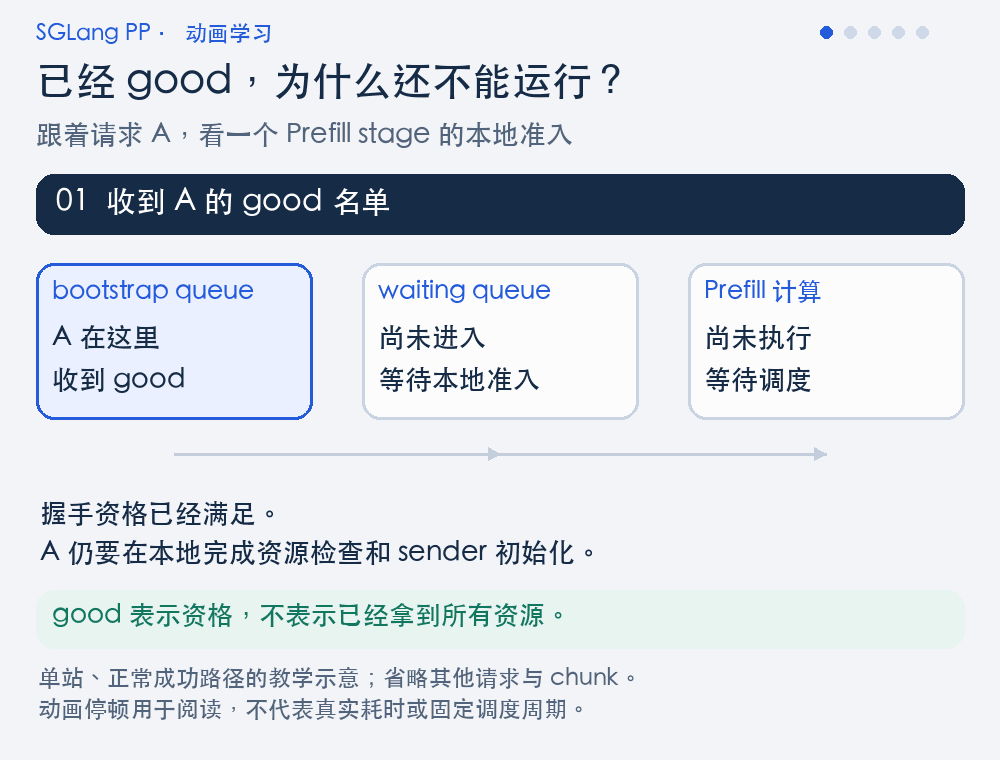

**图意解读：** A 先因 metadata 槽位不足留在 bootstrap queue；后续资源检查与初始化成功，才移入 waiting queue。蓝色 A 的移动表示逻辑位置变化：进入 waiting 后仍需后续调度选中，不能回填已经选好的当前 batch。这里只跟踪一个 stage，不表示所有 stage 在同一时刻完成迁移。[S10]、[S16]

<details>
<summary>不播放动画：展开静态步骤图</summary>

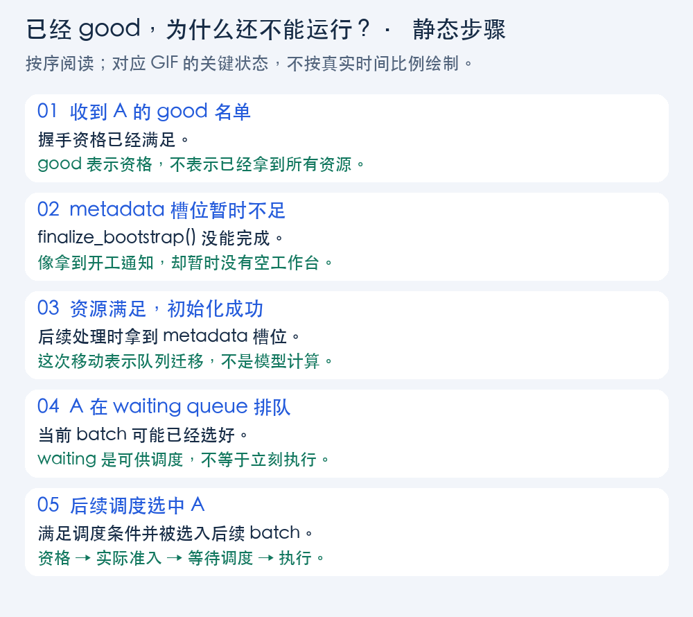

每一步分别回答资格、资源、队列和执行状态；动画中的“工作台”只类比本地准入资源。

</details>

### 6.2 一个容易漏读的例外：未被名单覆盖的本地失败

`pop_bootstrapped()` 在 PP 模式先用 `poll_and_all_reduce_pp()` 映射已有名单。对映射为 `None` 的 uncovered 请求，它还会额外 poll 并做本 stage 的 TP/CP 归约；若发现 Failed，会执行本地失败处理，并把失败 RID 放进实际返回的 failed 列表。

这条分支只补充 Failed，不把 uncovered 的本地 ready 提升为 good。它说明源码不是“所有本地状态都永远只能等下一次完整正向投票”；返回处理过程中也可能纳入新发现的失败。不要把 bootstrap 的这条逻辑自动套到 Decode prealloc，后者 `_update_handshake_waiters()` 的 PP 分支直接按提供的 good/bad 映射。[S16]、[S17]

### 6.3 Prefill event loop 的处理顺序

一次本地 `mb_id` 的主要顺序如下；深度相关的 output 位置留到第 8 节解释：

1. 接收新请求；计算 bootstrap 候选和 transfer terminal 候选，保存 `bmbs/tmbs`。
2. 处理 chunk 状态，调用 `get_new_batch_prefill()`，接收 proxy，启动当前 forward。
3. 发送应当返回或转发的 bootstrap/release 名单。
4. 接收 `next_mb_id` 对应的 bootstrap 名单并处理 bootstrap queue；接收 release 名单。
5. 对已有输出等待 `d2h_event`，处理 `next_mb_id` 的 batch result。
6. 调用 `process_disagg_prefill_inflight_queue(next_release_rids)`。
7. 非尾 stage 发送本轮新请求、bootstrap 候选、transfer 候选和 proxy；保存下一轮要转发的结果。

**注意：** 本轮才消费 bootstrap 共识、进入 waiting queue 的请求，不会被倒灌进第 2 步已经选好的当前 batch。状态会影响后续调度机会。[S10]

### 6.4 transfer release 到来时仍会重查本地状态

`process_disagg_prefill_inflight_queue(rids_to_check)` 重新 poll inflight sender，并按名单筛选，[S18]：

- 名单外的请求继续留在 inflight queue。
- 名单内但当前 poll 又不是 Success/Failed 的请求，源码记录一次警告并保留，避免直接崩溃。
- Success 路径释放请求持有的 KV/cache 引用、清理 sender、记录传输完成。
- Failed 路径调用 `handle_inflight_transfer_failure()`，处理错误并释放相关本地资源。
- done 请求随后进入输出处理，并按代码释放 metadata buffer。

这里的 release 主要协调 **Prefill inflight 状态何时可以处理和退场**。它既不是一条“KV 字节已经复制到所有 GPU”的直接证据，也不是 Decode 已经开始生成的确认。

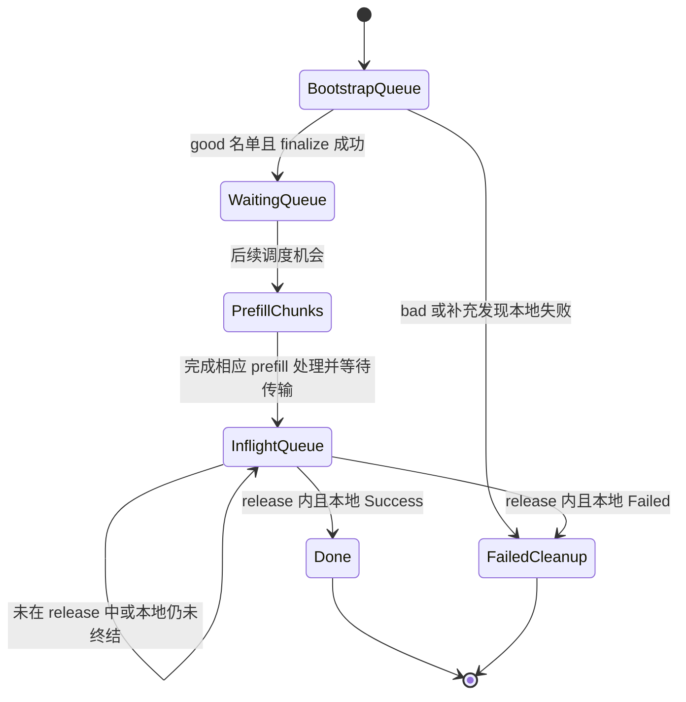

**图意解读：** 这是正常队列主线的整理图，chunk 的计算与 KV 发送可以存在交叠；图没有把它们画成全量 KV 必须在最后才开始发送。图中的状态是教学归类，不是新增的源码枚举，也不展开所有 abort/retry 分支。

## 7. Decode 侧：恢复优先、预分配、等待 KV 可用

### 7.1 retract 优先于接纳新请求

Decode 循环先处理 retract 共识，再处理 prealloc 共识。`process_prealloc_queue()` 明确检查 `retracted_queue`：只要还有 retracted 请求，就返回 `[[], []]`，这次不继续调用新请求的预分配处理。[S12]、[S13]

人话版：先尝试让已经服务到一半、因资源压力暂停的请求恢复，再把资源交给更多新请求。这个提前返回也意味着不能只看到 prealloc bad 名单就断言“本次调用一定已经完成失败清理”。

### 7.2 名字叫 prealloc IDs，但投票时还没有完成分配

`_pp_pd_get_prealloc_ids()` 读取的是 receiver 的 WaitingForInput/Failed 状态，而实际分配发生在共识回来后的 `pop_preallocated()`。[S13]、[S17]

按顺序看：

1. 用共识名单更新 handshake 状态，失败请求先处理。
2. 只在名单覆盖的请求中按本地队列顺序尝试分配；开启优先级调度时先排序。
3. 检查 request pool、metadata pool、full/SWA token 预算及相关功能的附加预算。
4. 准备目标 KV 位置和状态索引。
5. 若使用 staging，先注册该请求，再调用 receiver `send_metadata()`。
6. 真正完成这些动作的请求进入 `disagg_decode_transfer_queue`。

所以，prealloc good 的准确读法是“已具备尝试预分配的握手资格”，不是“各 stage 的目标 KV 槽位均已成功分配”。

### 7.3 Decode transfer 有两道不同的门

第一道门是 `_pp_pd_get_decode_transferred_ids()`：直接对 receiver poll 做 TP/CP 归约，跨 PP 求 terminal 交集。[S13]

第二道门在 `DecodeTransferQueue.pop_transferred()`：[S19]

- 普通路径 `_poll_with_metadata_gate()` 会把 metadata 尚未落地的 Success 降为 Transferring；启用 Decode HiCache 时还包装恢复状态。
- staging 路径 `_poll_with_staging()` 推进 scatter，并把未完成的 staging 降级为未完成状态；失败也会参与归约。
- 部分 HiCache 恢复未完成时继续等待。
- `_commit_transfer_to_req()` 校验 metadata 中的 `bootstrap_room`，读取首 token 等信息，建立可供调度使用的请求状态；不匹配可转为 abort。

**关键区别：第一道 PP terminal 采集没有把这些完整的 staging/metadata gate 一起纳入同一份跨 PP 投票。** 所以收到 release 名单后，第二道门仍可能挡住请求。

**两道门的请求例子：** 假设 A 在所有 Decode stage 的原始 receiver poll 都为 Success，因此进入 PP terminal 名单。但在某一站，本地 metadata 还不可用：普通路径的 metadata gate 将本次观察降为 Transferring，A 继续留在该站的 transfer queue。之后 metadata 到齐、room 校验及其他检查通过，才有条件提交并进入 waiting queue。[S13]、[S19]

可以理解成“货已送到收货区”与“核对运单并放入可使用的位置”两步。收到送达通知后仍要验收；同样，进入 waiting queue 后还要等待调度，不能倒推本轮已经执行了 Decode。

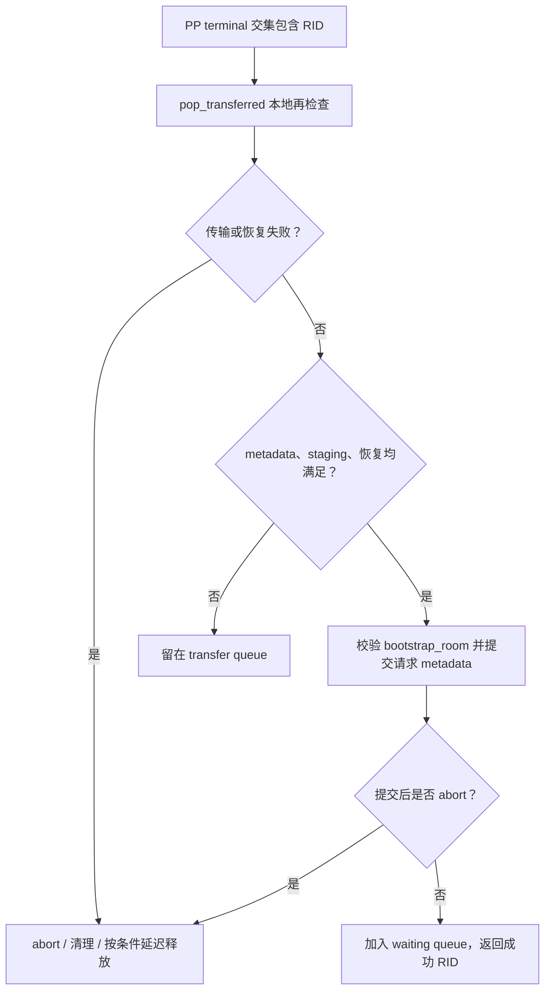

**图意解读：** PP release 是进入检查范围的许可；本地成功提交之后，才成为真正返回给后续 stage 的成功 RID。此图不表示这些检查已经被整合成一次所有 stage 的原子提交。

### 7.4 成功进入 waiting queue 也不等于立即执行 Decode

`process_decode_transfer_queue()` 把成功返回的请求追加到 `waiting_queue`，还可能调用 HiSparse 的 admission 处理。真正执行由后续 `get_next_disagg_decode_batch_to_run()` 决定。Decode 的 `PREBUILT` batch 有专门分支，不能把每次 batch 准备都理解为运行一次跨 PP 模型 forward。

### 7.5 一条完整 P/D 请求的共同视角

| 阶段 | Prefill 侧 | Decode 侧 | 共识在回答什么 |
| --- | --- | --- | --- |
| 连接准备 | sender 等待握手/目标信息 | receiver 获取连接信息 | 各自流水线的握手状态是否足够推进 |
| 目标准备 | 后续初始化 sender | prealloc good 后分配目标资源，发送 metadata | 可以尝试配置这条请求的传输了吗 |
| 执行与搬运 | 跑各自模型层，发送 KV | 接收 KV，并可能进行 staging scatter/缓存恢复 | 哪些 stage 已观察到传输终结 |
| Prefill 收尾 | 按 terminal release 处理 inflight | 可能仍在本地提交检查 | Prefill 能处理哪些 inflight 请求的结果 |
| Decode 接纳 | 不再承担后续逐 token Decode | 成功提交后进入 waiting，再被调度 | 哪些请求已在本地具备 Decode 使用条件 |

P 侧 PP 共识和 D 侧 PP 共识分别在各自的流水线内运行；两边通过 KV 后端连接，不是把所有 P/D stage 合成一个投票大环。

## 8. microbatch 槽位：如何避免把本轮与旧结果混在一起

### 8.1 三个索引先记清楚

`init_pp_loop_state()` 与三个 event loop 使用，[S02]、[S10]、[S12]：

```python
L = pp_size + pp_async_batch_depth
mb_id = 当前本地槽位
next_mb_id = (mb_id + 1) % L
next_first_rank_mb_id = (mb_id + pp_size) % L
```

| 变量 | 用途 |
| --- | --- |
| `mb_id` | 本地正在准备/启动的 batch 槽位，也是候选数组本次写入的位置 |
| `next_mb_id` | 本地本次要接收并消费较早 batch 输出/共识时使用的槽位 |
| `next_first_rank_mb_id` | 尾 stage 判断给首 stage 发送哪个时序位置的结果是否已具备条件 |
| `mbs` / `running_mbs` / `last_mbs` | 当前执行 batch、持续运行状态、上次处理状态 |
| `bmbs` / `pmbs` / `rmbs` / `tmbs` | 与槽位对应的 bootstrap/prealloc/retract/terminal 候选及通信存在性记录 |
| `last_rank_comm_queue` | 尾 stage 以 FIFO 保存 event 与输出；从队头取结果 |

尾 stage 的共识发送 helper 检查 `bmbs[next_first_rank_mb_id] is not None` 等条件，但发送的是传入的**当前累计候选**，不是简单发送 `bmbs[next_first_rank_mb_id]` 的旧内容。数组条件用于匹配流水线节奏，不能误读成随机取一格就广播。[S15]

### 8.2 `None` 和空名单为什么差别很大

- 槽位值是 `None`：尚无对应通信阶段的记录，接收侧可能跳过这次接收。
- 槽位值是 `[]` 或 `[[], []]`：这轮存在，只是没有符合条件的 RID；消息仍有协议意义。

`point_to_point_pyobj()` 对外层空列表发送长度为 0 的头；`[[], []]` 则是非空 Python 容器，会序列化发送。两者都能明确传递“这次收到的是空结果”。[S20]

**比喻：空信封也算收到一封信。** 对一个已有通信阶段，`[]` 像写着“本轮没有 RID”的空结果通知；`None` 则表示槽位尚无对应记录。如果接收侧把空结果也当成“这一封不用收”，下一封信就可能被当作当前这一封。这里只类比槽位与通信存在性，不是第 3.3 节“某个 RID 未被名单覆盖”的 `None`。

**排障例子：** 把源码中的 `if tmbs[next_mb_id] is not None` 改成 `if tmbs[next_mb_id]`，会让接收侧跳过合法的空结果。如果对端仍按原顺序发送，后续消息就可能错位。空 payload 不等于这次通信不存在。

### 8.3 深度 0 与深度 1 的算例

以下只演算**本地索引公式**，不是每个物理 stage 同时使用相同槽号的运行时间表。

| PP 大小 | async depth | L | mb_id | next_mb_id | next_first_rank_mb_id |
| ---: | ---: | ---: | ---: | ---: | ---: |
| 3 | 0 | 3 | 0 | 1 | 0 |
| 3 | 0 | 3 | 1 | 2 | 1 |
| 3 | 0 | 3 | 2 | 0 | 2 |
| 3 | 1 | 4 | 0 | 1 | 3 |
| 3 | 1 | 4 | 1 | 2 | 0 |
| 3 | 1 | 4 | 2 | 3 | 1 |
| 3 | 1 | 4 | 3 | 0 | 2 |

depth=0 时 `next_first_rank_mb_id == mb_id`；增加 depth 后，尾 stage 的发送目标位置与当前本地槽位拉开。`mb_id` 循环复用，因此排障时还要记录外层迭代/逻辑轮次，不能拿一个裸 `mb_id=0` 当唯一标识。

### 8.4 两种深度的 output 处理顺序不同

| 配置 | 当前 forward 与 output helper 的相对顺序 |
| --- | --- |
| `pp_async_batch_depth == 0` | 先 launch 当前 batch，再提交/收发并预处理较早输出 |
| `pp_async_batch_depth > 0` | 先提交/收发并预处理较早输出，再 launch 当前 batch |

两条路径随后才按需要等待 `d2h_event` 并处理较早 batch 的结果。源码说“异步发送”也不代表没有任何 CPU 等待：`_pp_commit_comm_work()` 会调用每个 work 的 `wait()`。

增加 depth 改变槽位数、输出缓冲与调度时序，不是更改 good/bad/terminal 的集合规则，也不能仅由静态代码推出它在特定 PP 拓扑下必然提高吞吐。

### 8.5 官方原图：理解计算气泡，再区分控制等待

Shangming Cai 的 [Pipeline Parallelism in SGLang: Scaling to Million-Token Contexts and Beyond](https://www.lmsys.org/blog/2026-01-15-chunked-pipeline/)（LMSYS，2026-01-15）介绍 chunked PP、异步通信与动态 chunk。下面保留四张技术原图，帮助阅读本节时间轴。

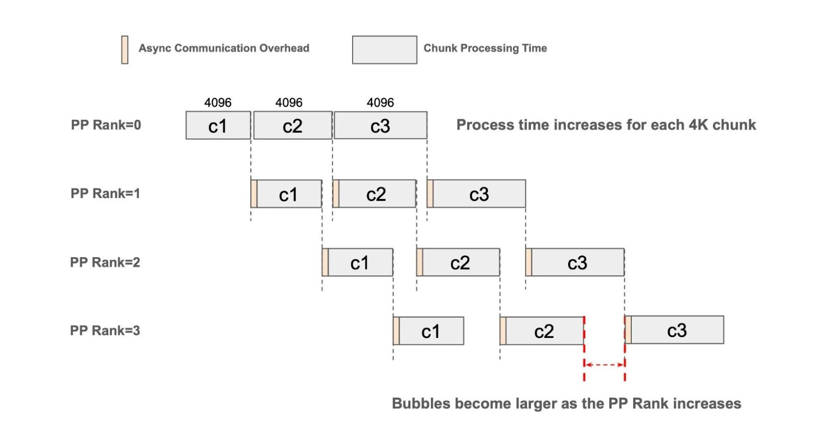

**图意解读：** 原文图 1。各 chunk 同为 4096 token，但后续计算块变长，下游等待扩大；相同 token 数并不等于相同耗时。[原图所在文章](https://www.lmsys.org/blog/2026-01-15-chunked-pipeline/)

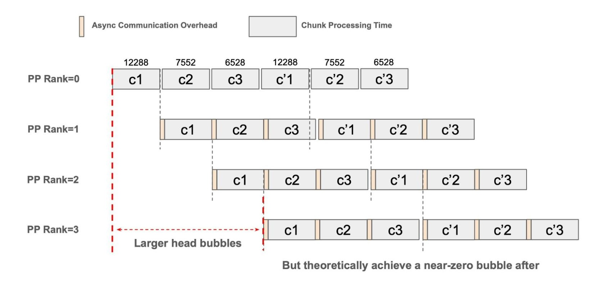

**图意解读：** 原文图 3。调整 chunk 大小来接近相同计算时长，突出稳态气泡的改善；图中仍有流水线启动等待。[原图所在文章](https://www.lmsys.org/blog/2026-01-15-chunked-pipeline/)

<details>
<summary>展开两张原始 profiler 截图，查看计算块与空隙</summary>

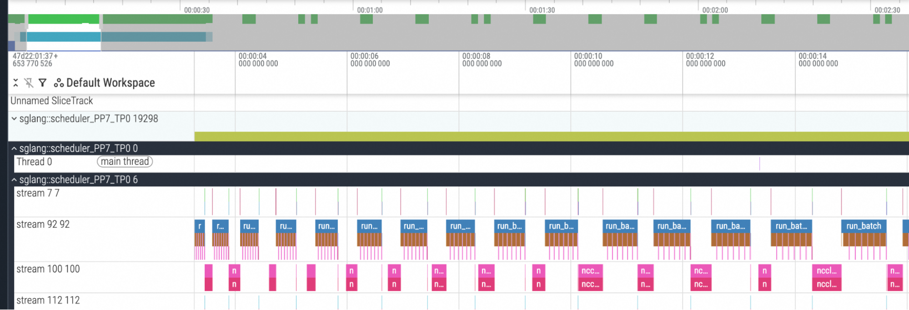

**图意解读：** 原文图 2，截图标签为 PP7/TP0，可观察执行块之间的空隙。[原图所在文章](https://www.lmsys.org/blog/2026-01-15-chunked-pipeline/)

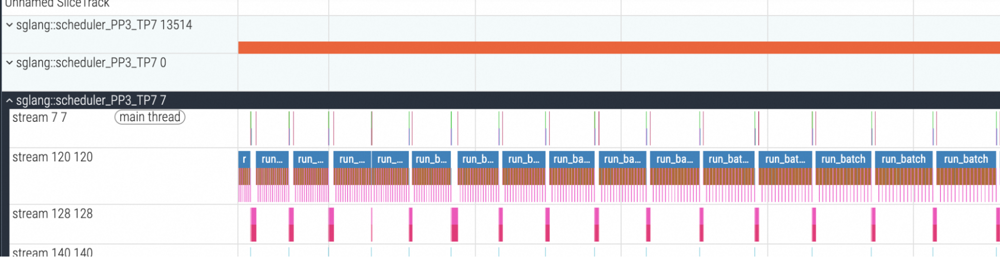

**图意解读：** 原文图 6，标签为 PP3/TP7，展示较紧密的执行时间线；两张 profile 的 rank 和窗口不同，不能按像素直接计算提速。[原图所在文章](https://www.lmsys.org/blog/2026-01-15-chunked-pipeline/)

</details>

窄屏查看细字时，可打开原图放大：[固定 chunk 示意](../../images/sglang-pp-consensus/01-fixed-chunk-bubbles.jpg)、[动态 chunk 示意](../../images/sglang-pp-consensus/02-dynamic-chunk-bubbles.jpg)、[固定 chunk profile](../../images/sglang-pp-consensus/03-fixed-chunk-profile.png)、[动态 chunk profile](../../images/sglang-pp-consensus/04-dynamic-chunk-profile.png)。

**与共识的联系属于本文基于源码的归纳：** [S10] 把 bootstrap、forward、output 与 release 放在同一个 event loop 中推进；控制消息到达与真正消费之间可能夹着其他工作。上面的图画的是计算安排，没有画 good/bad 名单、AbortReq 或 KV 释放，所以不能从“计算气泡变少”直接推出“共识等待消失”。直接讨论协议等待的社区证据见第 15.5～15.6 节。

## 9. 通信协议：谁发送、谁广播、靠什么匹配

### 9.1 控制面 leader 与 rank 偏移

PP Python 消息由本 stage 的 `attn_tp_rank==0 && attn_cp_rank==0` 发送/接收；接收后调用 `attn_cp_tp_broadcast_pyobj()`，让本 shard 的 TP×CP 参与者看到同一份对象。[S21]

源码使用：

```text
dp_offset = attn_dp_rank × attn_cp_size × attn_tp_size
当前 leader 的 global rank = pp_rank × tp_size + dp_offset
下一站 = ((pp_rank + 1) % pp_size) × tp_size + dp_offset
```

**例子：** `tp_size=8`、`attn_tp_size=2`、`attn_cp_size=2`、`attn_dp_rank=1` 时，offset=4；PP0、PP1 对应 leader 是 global rank 4、12。不能漏掉 CP 因子，也不能把所有 attention DP shard 的控制消息都送给 global rank 0。源码已有相关单元测试作为阅读入口，[T01]。

### 9.2 控制消息主要靠固定顺序匹配

`point_to_point_pyobj()` 通过 CPU group 发送长度头与序列化数据，异步发送 work 连同 tensor 引用一起保存，后续 wait 完成才清理。[S20]

这层 Python 共识消息没有独立的“bootstrap/prealloc/release + epoch + mb_id”统一信封；它主要依赖固定 peer、调用顺序和槽位上的 `None` 条件匹配。逻辑上已经有“本轮/下一轮”的区分，并不等于消息载荷中有显式唯一轮次编号。

| event loop | 非尾 stage 在循环末尾发送的正向 Python 消息顺序 |
| --- | --- |
| Prefill | request → bootstrap candidate → transfer candidate |
| Decode | request → retract candidate → prealloc candidate → transfer candidate |

返回共识在各自前面的阶段发送/接收，并按代码等待 work。不能只看上述三/四条消息就随意调整所有 send/recv 的位置。普通 PP 的 request 发送也比这两个 PD 循环更早，三种 loop 不能机械地互换顺序。

### 9.3 tensor 消息另有类型分流

proxy/output 的 tensor dict 由 `_pp_send_dict_to_next_stage()` 加入 `__msg_type__`。接收 `_pp_recv_typed_dict(expected_kind)` 遇到另一种类型，会先存入对应 inbox deque，再继续等期望类型。[S22]

这解决的是“等 proxy 时先收到 output”一类类型交错问题，不是完整的 request/slot/epoch 校验器。即使类型正确，同类型消息也仍需保持时序和 batch 对应。

此外，output helper 对 XPU 使用偶数 rank 先 send、奇数 rank 先 recv 的顺序；其他路径按其分支发送优先。源码理由是有些后端的异步发送表现可能近似阻塞，全环先发会互相等。该分支是后端特定逻辑，不应推广为所有设备的统一规则。[S05]

### 9.4 event、work、terminal 分别证明什么

| 证据 | 可以说明 | 不能直接说明 |
| --- | --- | --- |
| `P2PWork.work.wait()` 返回 | 对应通信 work 完成 | 请求所有状态已在远端消费、KV 全生命周期结束 |
| proxy 发送前等待 `launch_event` | 发送 stream 等待本地 forward 产出 | 对端已执行后续层或 P/D KV 已完成 |
| 处理输出前等待 `d2h_event` | 本地对应输出预处理/拷贝 event 已完成 | 整个 PP 环与所有 KV 后端操作都完成 |
| RID 在 terminal 交集 | 各 stage 本轮归约后的 poll 都属于终态 | 全成功、所有 metadata 已校验、所有在途写入已退休 |

**人话版：** 通信送达、GPU 计算完成、业务状态可推进、内存可复用，是四种不同的条件。排障时要问清正在等待或已经拿到的是哪一种。

## 10. Abort 与失败：逻辑退场和物理释放分开看

### 10.1 bootstrap/prealloc 上的 abort 如何进入共识

当这些队列里的请求已经标记 `FINISH_ABORT` 时，`_route_aborts_to_bad()` 把 RID 加入 bad 并移出 good。失败并集让一个 stage 观察到的 abort 能进入后续失败传播，不需要假定所有 sender/receiver 的可选 `abort()` 都已经把 poll 改成 Failed。[S11]

这个 helper 只扫描它被调用时所在的 bootstrap/prealloc 队列；不能由此推断 running、chunked、inflight、retracted 中的所有请求都已处理完 abort。跨 microbatch 的运行中请求清理另有实现和测试入口，[T02]、[T03]。

### 10.2 Decode 失败后可能暂时保留 KV

`DecodeTransferQueue.pop_transferred()` 的失败路径会报告 abort。满足延迟释放开关、后端能力以及 `abort_notified` 等条件时，它把请求移出普通 transfer queue，放入 `_deferred_releases`，暂时保留目标 KV 和 metadata 槽位。[S19]、[S23]

`process_decode_transfer_queue()` 每次调用都会先执行 `resolve_deferred_releases()`，不依赖这次是否有新的 release RID。resolver 调用后端 `is_abort_release_safe(room, required_acks)`；若未安全且未到 deadline，继续持有。

本基线还有明确的超时退路：超过 deadline，即便没有完整 drain 确认，也记录警告并调用本地释放。**这是本版本的可观察源码行为，不是“超时证明远端 DMA 已停止”。** 后端如何判定 release-safe、ACK 对应什么退休条件，必须继续沿具体后端追踪。

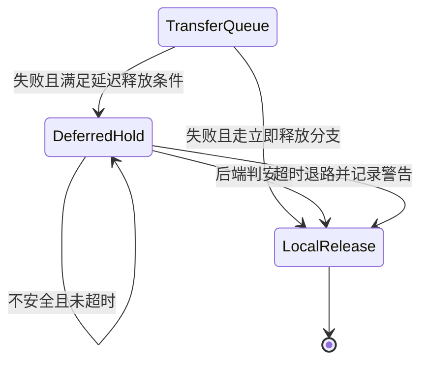

**图意解读：** 从业务队列移除与归还物理资源不是同一个时刻。末尾两个箭头虽然都通向本地释放，证据强度不同；不能把 deadline 分支写成 drain 成功。

**为什么取消订单后，还要暂时占着工作台？** 用一个假设的资源复用例子看风险：

1. 请求 A 正在把 KV 写入本地槽位 S，此时收到取消。
2. 如果仅凭“业务已取消”就把 S 分给新请求 B，而 A 的旧写入仍在途中，旧数据就可能覆盖 B 的内容。
3. 延迟释放把“从业务队列退场”与“槽位重新可分配”拆开，让释放时机还能参考后端安全条件。[S23]

这里 A、B、S 是教学符号，没有复现上述覆盖。对应到比喻，取消订单不会让已经移动中的机械臂瞬间停止；要判断工作台能否交给下一单，还得确认旧动作是否结束。源码的 deadline 是另一个释放分支，等待时间够长本身不证明旧写入已退场。

**动画：取消的是订单，还要检查旧写入是否已经退场。**

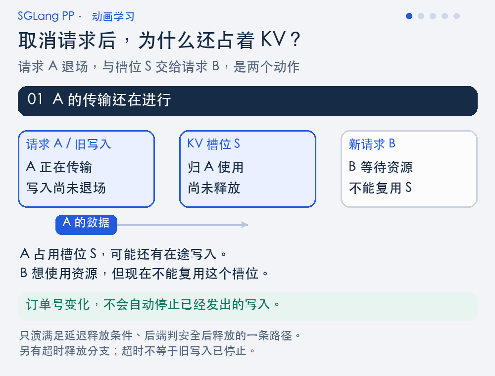

**图意解读：** A 被取消后，业务队列和 KV 槽位进入不同状态：普通 transfer queue 可以移除 A，延迟释放列表仍持有资源。本例在未安全且未到 deadline 时继续等待；后端报告 release-safe 后归还槽位，B 之后才有机会申请。蓝色“旧写入”只是帮助理解在途风险，不是实际传输采样；后端安全约定仍须单独核对。[S19]、[S23]

动画只演其中一条条件分支：本基线还存在立即释放和 deadline 退路，完整分支看上方 Mermaid。不能从动画中的等待时长推出物理写入已经停止，也不能把资源归还直接等同于 B 已获得该槽位。

<details>
<summary>不播放动画：展开静态步骤图</summary>


静态图把 A 的逻辑退场与槽位 S 的物理生命周期分开排列，便于对照源码条件。

</details>

### 10.3 本文能确认到什么程度

可以确认源码在哪些位置传播 RID、重新检查状态、等待 event、调用释放函数。不能只据这些调用就认定特定 GPU/MACA/NPU、RDMA、staging scatter 和快速槽位复用场景全部安全。本文没有执行硬件或传输实验，也没有把内部仓库的 abort 协议结论移植过来。

## 11. HiCache 的 PP 协调：首 stage 决策传播

读源码时还会遇到 HiCache 的 `_all_reduce()` 和 `_pp_sync()`。它们是另一种 PP 协调形式，不应与 PD 的 RID 交并集混为一谈。[S24]

### 11.1 名字叫 `_all_reduce`，PP 上实际是链式传播

`HiRadixCache._all_reduce(data, op)` 在 PP0 内做 attention 组归约，然后 `_pp_sync(data)` 让 PP1 接收 PP0 的值并转给 PP2，以此类推。PP 非首 stage 的本地初始值不是与 PP0 再求一次全 PP MIN/MAX。[S24]

以写回/加载 ACK 为例，PP0 确定本次消费多少个连续完成的 ACK；其他 stage 跟随相同计数。每个 stage 真正取出 ACK 时，仍对自己的 `finish_event.synchronize()`，再更新树节点/锁引用。[S25]

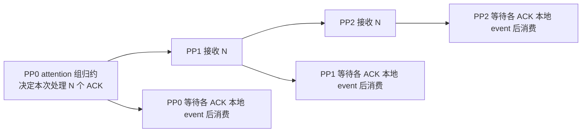

**图意解读：** 协调的是处理顺序和数量，不是假设每个 stage 的异步拷贝在同一时刻完成。接收首 stage 的决策与等待自己的设备工作完成，两步缺一不可。

### 11.2 时间判断也需要统一来源

`UnifiedRadixCache._can_terminate_prefetch()` 的 timeout 路径明确采用 PP0 的时间判断，再经归约/传播让后续 stage 跟随。[S26]

人话例子：PP0 在自己时钟上认为预取该停止了，如果 PP1 因启动时间不同继续等待，后续缓存命中长度和调度进度可能不一致。这里同步的是“这次是否停止”的决策，而不是让所有机器的墙钟变成一样。

### 11.3 同一基线下的完整缓存主线

2026-09-16 补充的两篇 HiCache 专题使用同一官方 commit `72d5c5bb73`，以普通默认 UnifiedRadixCache 路径为主，并对照 HiRadixCache。上述首 stage 决策传播也在 Unified 的 `_all_reduce/_pp_sync` 中逐项核对；后台 prefetch completed-token 同步则单独分析，避免与前台 ready-count 或 PD RID 名单混淆。

| 想继续追的问题 | 阅读入口 |
| --- | --- |
| 本地命中、Host 命中与 L3 结果怎样变成请求可用前缀 | [HiCache 前缀命中源码学习文档](<../kv-cache/HiCache 前缀命中源码学习文档.md>) 第 4～8 节 |
| ACK 如何更新 pending、锁和分裂后的节点片段 | [HiCache 下 SGLang L1、L2、L3 与上传回载源码学习文档](<../kv-cache/HiCache 下 SGLang L1、L2、L3 与上传回载源码学习文档.md>) 第 5 节 |
| ready count、completed tokens、timeout 与本地事件怎样协调 | 同上第 11 节 |
| 取消和 detach 为什么需要先后顺序 | 同上第 13 节 |

**边界提醒：** 前台 ACK 数量传播不能替代本地 event；后台预取完成量也不能替代 admission 的实际回载量。两篇专题均为静态源码分析，未验证 GPU/网络运行行为。原有 [RadixAttention 与 HiCache](<../kv-cache/SGLang RadixAttention 与 HiCache KV Cache 技术主线学习文档.md>)仍可作为概念导读。

## 12. `rank_consensus_checker`：检测分歧，不代替协议

### 12.1 它检查“大家是不是做了同样的事”

`SGLANG_ENABLE_RANK_CONSENSUS_CHECKER` 在本基线默认 False。开启后，`@rank_consensus` 可记录被标记函数的调用/返回顺序，并按 `same_params`、`same_results` 比较指定参数或返回值。[S27]

Scheduler 初始化时传入 attention CP、attention TP（或 fallback TP）以及 PP group；checker 创建独立 Gloo group，后台线程按各 rank 可共同消费的事件数量取出记录，计算摘要并比较。发现不一致时输出 divergence 日志，并调用 `os._exit(1)` 结束进程。[S27]、[S28]

| PD 共识 helper | rank consensus checker |
| --- | --- |
| 计算本轮哪些 RID 可以进入下一步 | 比较被记录的执行事件是否一致 |
| 是队列协议的一部分 | 是可选诊断功能 |
| 决定 good/bad/terminal/retract 集合 | 不替请求重新投票，不修复分歧 |
| 运行时推动正常请求前进 | 检测到分歧时终止进程 |

### 12.2 使用时的边界

- 它只检查显式装饰或 `assert_same()` 记录的点，不自动检查全部 Scheduler 状态。
- 记录必须来自 scheduler 线程；从其他线程交错写入会破坏跨 rank 的事件顺序，源码对此有限制。
- 它比较的是选定数据的表示与事件摘要，不是对每个 KV 字节或 tensor 元素做一致性证明。
- 启用检测有额外线程、通信和失败退出行为；本文只读源码，没有在服务上开启。

比如 `UnifiedRadixCache` 的 `_can_terminate_prefetch()` 标注 `same_results=True`，作用是确认最终停止决策一致；真正使决策一致的仍是函数内的归约与 PP0 传播逻辑。

## 13. 从现象回到源码：排障地图与阅读路线

### 13.1 不要先把所有等待都归因于“PP 共识慢”

| 现象 | 优先记录/核对 | 对应边界 |
| --- | --- | --- |
| Bootstrap 长期不进 waiting | 同一 RID 各 stage 的 TP/CP 归约 poll、good/bad、metadata 可用量、实际出队列表 | 没通过状态交集，还是 finalize 资源不足 |
| Decode prealloc good 但仍不分配 | retracted_queue、request/metadata pool、full/SWA 预算、实际返回 RID | 资格共识与真实资源分配 |
| transfer release 有 RID，但 Decode 不运行 | 本地 receiver、metadata room、staging 完成、HiCache restore、waiting queue | terminal 与数据可用/调度接纳 |
| 只有部分 stage 删除请求 | 正向候选、返回名单、各站消费返回值、后端失败传播 | 哪一站首次缩减名单或提前失败 |
| PP 挂在 `recv` / `wait` | 所有 stage 调用栈、消息方向/顺序、空名单、槽位和外层轮次 | 对端未到达还是协议调用错位 |
| batch 大小相同但输出归属不对 | batch 中有序 RID 列表、输出序号、slot、forward mode | 同数量不代表同请求顺序 |
| 开 depth 后才出现问题 | L、三个索引、last_rank_comm_queue、output helper 的前后位置 | 旧结果与当前槽位是否对应 |
| 请求已 abort 但 KV 仍占用 | 所在队列、deferred hold、后端 release-safe、deadline、本地 event | 逻辑结束与物理归还 |
| HiCache 完成数量不同或树状态分歧 | PP0 决策、各站 ACK 队列顺序、本地 event、checker 记录点 | 首站决策与本地完成顺序 |

对同一 RID 做排查时，建议在已有日志/trace 中对齐以下字段；若需加日志，另行在开发环境实施，不把本文当成已修改服务：

```text
源码 commit / 配置
pp_rank / attn_dp_rank / attn_cp_rank / attn_tp_rank
外层逻辑轮次 / mb_id / next_mb_id / next_first_rank_mb_id
rid / bootstrap_room / 所在队列 / forward_mode
本地 poll / stage 内归约后的 poll
收到的候选集合 / 合并后的集合 / 收到的返回名单 / 实际处理后返回名单
相关设备 event、通信 work、资源占用与释放状态
```

“全 stage”观察也应以对应的同一逻辑轮为单位，不要求抓到完全相同的墙钟时刻；反过来，不能把不同迭代中同一个 `mb_id` 的日志拼成一轮。

### 13.2 与本主题直接有关的启动约束

| 条件 | 本基线实际限制或行为 | 源码 |
| --- | --- | --- |
| PP>1 | 自动将普通 `disable_overlap_schedule` 设为 True；PP 自己仍可有异步 depth | [S29] |
| 非 NPU 的 PP+speculative | validation 要求 speculative algorithm 为 None | [S30] |
| NPU 的 PP+speculative | 仅允许规定的非 multi-layer EAGLE，且限定 Prefill；仍要求关闭普通 overlap | [S30] |
| PP+optimistic prefill | 校验中把 optimistic attempts 调整为 0 | [S31] |
| `pp_async_batch_depth` | 默认 0；不由“普通 overlap 已关闭”推断其必为 0 | [S32] |
| `pp_max_micro_batch_size` | 必须是正整数或 None | [S30] |

这只是阅读本协议所需的关键约束，不是完整兼容矩阵。特别是不要沿用其他分支或旧文章中“PP 必然关闭 mixed chunk”等结论；本开源快照包含对应输出输入衔接逻辑及 mixed-chunk 测试入口，实际组合仍需看完整参数解析与目标模型。[S05]、[T04]

### 13.3 推荐源码阅读顺序

1. 从 `dispatch_event_loop()` 确认正在研究的模式。
2. 先读普通 `event_loop_pp()`，找到 `mb_id`、batch 选择和 output 回环。
3. 读 `KVPoll`、`get_rids()`、TP/CP poll 归约，理解本地观察如何变成 stage 状态。
4. 对照第 4 节读五个 `_pp_pd_get_*_ids()`，逐个写出集合公式。
5. 读两个 `_pp_pd_send_consensus_*()`，确认返回路径和槽位条件。
6. 沿 `process_*_queue()` 进入 Prefill/Decode queue，标出资源检查、重新 poll、出队和返回名单。
7. 最后读 pyobj/tensor 通信、event 处理和后端释放入口；不要只停在“consensus”函数名上。
8. 如使用 HiCache，再读缓存的 `_all_reduce/_pp_sync` 和 checker 标记点。

### 13.4 自测题与答案

| 问题 | 答案 |
| --- | --- |
| PP3 中两站 ready、一站还在握手，可以按多数票放行吗？ | 不可以；bootstrap/prealloc good 要求交集 |
| transfer 在三站分别 Success、Failed、Success，会进入 terminal 名单吗？ | 会；但名单不代表全成功 |
| `poll_and_all_reduce_pp()` 会启动一次 PP all-reduce 吗？ | 不会，它只映射已有 good/bad 名单 |
| prealloc good 是不是已经拿到所有 KV page？ | 不是，真实分配在消费名单时发生 |
| `[]` 能不能因为“没请求”而跳过接收？ | 不能据此决定；要遵守槽位 `is not None` 和 peer 的发送协议 |
| release RID 已经回来，能不能立即释放所有 buffer？ | 不能泛化，要看角色、当前队列、本地状态和后端释放约定 |
| checker 开启就不用写 PP 共识逻辑了吗？ | 不，它只能在记录点检测分歧 |
| 所有返回名单经过每个 stage，会自动形成两阶段原子提交吗？ | 不会，源码没有由这些 helper 提供统一回滚和最终提交轮 |

## 14. 源码索引、验证记录与延伸

### 14.1 固定版本源码锚点

下面链接全部固定到 `72d5c5bb73cadd7ffbf5114e5f81e29d36b6c61a`，避免以后打开浮动 `main` 时行号和行为悄悄改变。表中的函数/类及起始行按本地源码核对。

| 标记 | 文件（相对 SGLang 根目录） | 符号与本地起始行 |
| --- | --- | --- |
| [S01] | `python/sglang/srt/managers/scheduler.py` | [`dispatch_event_loop` L5646](https://github.com/sgl-project/sglang/blob/72d5c5bb73cadd7ffbf5114e5f81e29d36b6c61a/python/sglang/srt/managers/scheduler.py#L5646) |
| [S02] | `python/sglang/srt/managers/scheduler_pp_mixin.py` | [`SchedulerPPMixin.event_loop_pp` L62](https://github.com/sgl-project/sglang/blob/72d5c5bb73cadd7ffbf5114e5f81e29d36b6c61a/python/sglang/srt/managers/scheduler_pp_mixin.py#L62)；[`SchedulerPPMixin.init_pp_loop_state` L551](https://github.com/sgl-project/sglang/blob/72d5c5bb73cadd7ffbf5114e5f81e29d36b6c61a/python/sglang/srt/managers/scheduler_pp_mixin.py#L551)；[`_pp_can_skip_output_comm` L43](https://github.com/sgl-project/sglang/blob/72d5c5bb73cadd7ffbf5114e5f81e29d36b6c61a/python/sglang/srt/managers/scheduler_pp_mixin.py#L43) |
| [S03] | `python/sglang/srt/managers/scheduler.py` | [`Scheduler.ingest_requests` L2050](https://github.com/sgl-project/sglang/blob/72d5c5bb73cadd7ffbf5114e5f81e29d36b6c61a/python/sglang/srt/managers/scheduler.py#L2050)；[`Scheduler.get_next_batch_to_run` L3499](https://github.com/sgl-project/sglang/blob/72d5c5bb73cadd7ffbf5114e5f81e29d36b6c61a/python/sglang/srt/managers/scheduler.py#L3499) |
| [S04] | `python/sglang/srt/managers/scheduler_components/request_receiver.py` | [`SchedulerRequestReceiver.recv_requests` L89](https://github.com/sgl-project/sglang/blob/72d5c5bb73cadd7ffbf5114e5f81e29d36b6c61a/python/sglang/srt/managers/scheduler_components/request_receiver.py#L89)；[`SchedulerRequestReceiver._pull_raw_reqs` L121](https://github.com/sgl-project/sglang/blob/72d5c5bb73cadd7ffbf5114e5f81e29d36b6c61a/python/sglang/srt/managers/scheduler_components/request_receiver.py#L121)；[`SchedulerRequestReceiver._broadcast_reqs_across_ranks` L170](https://github.com/sgl-project/sglang/blob/72d5c5bb73cadd7ffbf5114e5f81e29d36b6c61a/python/sglang/srt/managers/scheduler_components/request_receiver.py#L170) |
| [S05] | `python/sglang/srt/managers/scheduler_pp_mixin.py` | [`SchedulerPPMixin._pp_launch_batch` L1078](https://github.com/sgl-project/sglang/blob/72d5c5bb73cadd7ffbf5114e5f81e29d36b6c61a/python/sglang/srt/managers/scheduler_pp_mixin.py#L1078)；[`SchedulerPPMixin._pp_send_output_to_next_stage` L974](https://github.com/sgl-project/sglang/blob/72d5c5bb73cadd7ffbf5114e5f81e29d36b6c61a/python/sglang/srt/managers/scheduler_pp_mixin.py#L974)；[`SchedulerPPMixin._pp_send_recv_and_preprocess_output_tensors` L1009](https://github.com/sgl-project/sglang/blob/72d5c5bb73cadd7ffbf5114e5f81e29d36b6c61a/python/sglang/srt/managers/scheduler_pp_mixin.py#L1009)；[`SchedulerPPMixin._pp_prep_batch_result` L894](https://github.com/sgl-project/sglang/blob/72d5c5bb73cadd7ffbf5114e5f81e29d36b6c61a/python/sglang/srt/managers/scheduler_pp_mixin.py#L894) |
| [S06] | `python/sglang/srt/managers/scheduler_pp_mixin.py` | [`SchedulerPPMixin.get_rids` L1118](https://github.com/sgl-project/sglang/blob/72d5c5bb73cadd7ffbf5114e5f81e29d36b6c61a/python/sglang/srt/managers/scheduler_pp_mixin.py#L1118) |
| [S07] | `python/sglang/srt/disaggregation/utils.py` | [`poll_and_all_reduce_attn_cp_tp_group` L249](https://github.com/sgl-project/sglang/blob/72d5c5bb73cadd7ffbf5114e5f81e29d36b6c61a/python/sglang/srt/disaggregation/utils.py#L249)；[`_all_reduce_polls` L227](https://github.com/sgl-project/sglang/blob/72d5c5bb73cadd7ffbf5114e5f81e29d36b6c61a/python/sglang/srt/disaggregation/utils.py#L227)；[`poll_and_all_reduce` L234](https://github.com/sgl-project/sglang/blob/72d5c5bb73cadd7ffbf5114e5f81e29d36b6c61a/python/sglang/srt/disaggregation/utils.py#L234) |
| [S08] | `python/sglang/srt/disaggregation/base/conn.py` | [`KVPoll` L100](https://github.com/sgl-project/sglang/blob/72d5c5bb73cadd7ffbf5114e5f81e29d36b6c61a/python/sglang/srt/disaggregation/base/conn.py#L100) |
| [S09] | `python/sglang/srt/disaggregation/utils.py` | [`poll_and_all_reduce_pp` L52](https://github.com/sgl-project/sglang/blob/72d5c5bb73cadd7ffbf5114e5f81e29d36b6c61a/python/sglang/srt/disaggregation/utils.py#L52) |
| [S10] | `python/sglang/srt/managers/scheduler_pp_mixin.py` | [`SchedulerPPMixin.event_loop_pp_disagg_prefill` L170](https://github.com/sgl-project/sglang/blob/72d5c5bb73cadd7ffbf5114e5f81e29d36b6c61a/python/sglang/srt/managers/scheduler_pp_mixin.py#L170)；[`SchedulerPPMixin._pp_pd_get_bootstrapped_ids` L591](https://github.com/sgl-project/sglang/blob/72d5c5bb73cadd7ffbf5114e5f81e29d36b6c61a/python/sglang/srt/managers/scheduler_pp_mixin.py#L591)；[`SchedulerPPMixin.process_bootstrapped_queue` L571](https://github.com/sgl-project/sglang/blob/72d5c5bb73cadd7ffbf5114e5f81e29d36b6c61a/python/sglang/srt/managers/scheduler_pp_mixin.py#L571) |
| [S11] | `python/sglang/srt/managers/scheduler_pp_mixin.py` | [`SchedulerPPMixin._route_aborts_to_bad` L1197](https://github.com/sgl-project/sglang/blob/72d5c5bb73cadd7ffbf5114e5f81e29d36b6c61a/python/sglang/srt/managers/scheduler_pp_mixin.py#L1197)；[`SchedulerPPMixin._pp_pd_get_prefill_transferred_ids` L633](https://github.com/sgl-project/sglang/blob/72d5c5bb73cadd7ffbf5114e5f81e29d36b6c61a/python/sglang/srt/managers/scheduler_pp_mixin.py#L633) |
| [S12] | `python/sglang/srt/managers/scheduler_pp_mixin.py` | [`SchedulerPPMixin.event_loop_pp_disagg_decode` L355](https://github.com/sgl-project/sglang/blob/72d5c5bb73cadd7ffbf5114e5f81e29d36b6c61a/python/sglang/srt/managers/scheduler_pp_mixin.py#L355)；[`SchedulerPPMixin._pp_pd_get_retract_ids` L1140](https://github.com/sgl-project/sglang/blob/72d5c5bb73cadd7ffbf5114e5f81e29d36b6c61a/python/sglang/srt/managers/scheduler_pp_mixin.py#L1140)；[`SchedulerPPMixin.process_retract_queue` L1235](https://github.com/sgl-project/sglang/blob/72d5c5bb73cadd7ffbf5114e5f81e29d36b6c61a/python/sglang/srt/managers/scheduler_pp_mixin.py#L1235) |
| [S13] | `python/sglang/srt/managers/scheduler_pp_mixin.py` | [`SchedulerPPMixin._pp_pd_get_prealloc_ids` L1159](https://github.com/sgl-project/sglang/blob/72d5c5bb73cadd7ffbf5114e5f81e29d36b6c61a/python/sglang/srt/managers/scheduler_pp_mixin.py#L1159)；[`SchedulerPPMixin._pp_pd_get_decode_transferred_ids` L1210](https://github.com/sgl-project/sglang/blob/72d5c5bb73cadd7ffbf5114e5f81e29d36b6c61a/python/sglang/srt/managers/scheduler_pp_mixin.py#L1210)；[`SchedulerPPMixin.process_prealloc_queue` L1245](https://github.com/sgl-project/sglang/blob/72d5c5bb73cadd7ffbf5114e5f81e29d36b6c61a/python/sglang/srt/managers/scheduler_pp_mixin.py#L1245)；[`SchedulerPPMixin.process_decode_transfer_queue` L1266](https://github.com/sgl-project/sglang/blob/72d5c5bb73cadd7ffbf5114e5f81e29d36b6c61a/python/sglang/srt/managers/scheduler_pp_mixin.py#L1266) |
| [S14] | `python/sglang/srt/disaggregation/decode.py` | [`DecodePreallocQueue.resume_retracted_reqs` L816](https://github.com/sgl-project/sglang/blob/72d5c5bb73cadd7ffbf5114e5f81e29d36b6c61a/python/sglang/srt/disaggregation/decode.py#L816) |
| [S15] | `python/sglang/srt/managers/scheduler_pp_mixin.py` | [`SchedulerPPMixin._pp_pd_send_consensus_bootstrapped_ids` L658](https://github.com/sgl-project/sglang/blob/72d5c5bb73cadd7ffbf5114e5f81e29d36b6c61a/python/sglang/srt/managers/scheduler_pp_mixin.py#L658)；[`SchedulerPPMixin._pp_pd_send_consensus_release_ids` L681](https://github.com/sgl-project/sglang/blob/72d5c5bb73cadd7ffbf5114e5f81e29d36b6c61a/python/sglang/srt/managers/scheduler_pp_mixin.py#L681) |
| [S16] | `python/sglang/srt/disaggregation/prefill.py` | [`PrefillBootstrapQueue.pop_bootstrapped` L422](https://github.com/sgl-project/sglang/blob/72d5c5bb73cadd7ffbf5114e5f81e29d36b6c61a/python/sglang/srt/disaggregation/prefill.py#L422)；[`PrefillBootstrapQueue.finalize_bootstrap` L374](https://github.com/sgl-project/sglang/blob/72d5c5bb73cadd7ffbf5114e5f81e29d36b6c61a/python/sglang/srt/disaggregation/prefill.py#L374) |
| [S17] | `python/sglang/srt/disaggregation/decode.py` | [`DecodePreallocQueue.pop_preallocated` L1083](https://github.com/sgl-project/sglang/blob/72d5c5bb73cadd7ffbf5114e5f81e29d36b6c61a/python/sglang/srt/disaggregation/decode.py#L1083)；[`DecodePreallocQueue._update_handshake_waiters` L874](https://github.com/sgl-project/sglang/blob/72d5c5bb73cadd7ffbf5114e5f81e29d36b6c61a/python/sglang/srt/disaggregation/decode.py#L874) |
| [S18] | `python/sglang/srt/disaggregation/prefill.py` | [`SchedulerDisaggregationPrefillMixin.process_disagg_prefill_inflight_queue` L918](https://github.com/sgl-project/sglang/blob/72d5c5bb73cadd7ffbf5114e5f81e29d36b6c61a/python/sglang/srt/disaggregation/prefill.py#L918)；[`SchedulerDisaggregationPrefillMixin.handle_inflight_transfer_failure` L1025](https://github.com/sgl-project/sglang/blob/72d5c5bb73cadd7ffbf5114e5f81e29d36b6c61a/python/sglang/srt/disaggregation/prefill.py#L1025) |
| [S19] | `python/sglang/srt/disaggregation/decode.py` | [`DecodeTransferQueue.pop_transferred` L2292](https://github.com/sgl-project/sglang/blob/72d5c5bb73cadd7ffbf5114e5f81e29d36b6c61a/python/sglang/srt/disaggregation/decode.py#L2292)；[`DecodeTransferQueue._poll_with_metadata_gate` L2260](https://github.com/sgl-project/sglang/blob/72d5c5bb73cadd7ffbf5114e5f81e29d36b6c61a/python/sglang/srt/disaggregation/decode.py#L2260)；[`DecodeTransferQueue._poll_with_staging` L2273](https://github.com/sgl-project/sglang/blob/72d5c5bb73cadd7ffbf5114e5f81e29d36b6c61a/python/sglang/srt/disaggregation/decode.py#L2273)；[`DecodeTransferQueue._commit_transfer_to_req` L2092](https://github.com/sgl-project/sglang/blob/72d5c5bb73cadd7ffbf5114e5f81e29d36b6c61a/python/sglang/srt/disaggregation/decode.py#L2092) |
| [S20] | `python/sglang/srt/utils/common.py` | [`point_to_point_pyobj` L2518](https://github.com/sgl-project/sglang/blob/72d5c5bb73cadd7ffbf5114e5f81e29d36b6c61a/python/sglang/srt/utils/common.py#L2518) |
| [S21] | `python/sglang/srt/managers/scheduler_pp_mixin.py` | [`SchedulerPPMixin._pp_send_pyobj_to_next_stage` L733](https://github.com/sgl-project/sglang/blob/72d5c5bb73cadd7ffbf5114e5f81e29d36b6c61a/python/sglang/srt/managers/scheduler_pp_mixin.py#L733)；[`SchedulerPPMixin._pp_recv_pyobj_from_prev_stage` L749](https://github.com/sgl-project/sglang/blob/72d5c5bb73cadd7ffbf5114e5f81e29d36b6c61a/python/sglang/srt/managers/scheduler_pp_mixin.py#L749) |
| [S22] | `python/sglang/srt/managers/scheduler_pp_mixin.py` | [`SchedulerPPMixin._pp_send_dict_to_next_stage` L796](https://github.com/sgl-project/sglang/blob/72d5c5bb73cadd7ffbf5114e5f81e29d36b6c61a/python/sglang/srt/managers/scheduler_pp_mixin.py#L796)；[`SchedulerPPMixin._pp_recv_typed_dict` L819](https://github.com/sgl-project/sglang/blob/72d5c5bb73cadd7ffbf5114e5f81e29d36b6c61a/python/sglang/srt/managers/scheduler_pp_mixin.py#L819) |
| [S23] | `python/sglang/srt/disaggregation/decode.py` | [`DecodeTransferQueue._defer_release` L2429](https://github.com/sgl-project/sglang/blob/72d5c5bb73cadd7ffbf5114e5f81e29d36b6c61a/python/sglang/srt/disaggregation/decode.py#L2429)；[`DecodeTransferQueue.resolve_deferred_releases` L2453](https://github.com/sgl-project/sglang/blob/72d5c5bb73cadd7ffbf5114e5f81e29d36b6c61a/python/sglang/srt/disaggregation/decode.py#L2453)；[`DecodeTransferQueue._do_release` L2438](https://github.com/sgl-project/sglang/blob/72d5c5bb73cadd7ffbf5114e5f81e29d36b6c61a/python/sglang/srt/disaggregation/decode.py#L2438) |
| [S24] | `python/sglang/srt/mem_cache/hiradix_cache.py` | [`HiRadixCache._all_reduce` L239](https://github.com/sgl-project/sglang/blob/72d5c5bb73cadd7ffbf5114e5f81e29d36b6c61a/python/sglang/srt/mem_cache/hiradix_cache.py#L239)；[`HiRadixCache._pp_sync` L252](https://github.com/sgl-project/sglang/blob/72d5c5bb73cadd7ffbf5114e5f81e29d36b6c61a/python/sglang/srt/mem_cache/hiradix_cache.py#L252) |
| [S25] | `python/sglang/srt/mem_cache/hiradix_cache.py` | [`HiRadixCache._sync_hicache_ready_counts` L1017](https://github.com/sgl-project/sglang/blob/72d5c5bb73cadd7ffbf5114e5f81e29d36b6c61a/python/sglang/srt/mem_cache/hiradix_cache.py#L1017)；[`HiRadixCache.writing_check` L1044](https://github.com/sgl-project/sglang/blob/72d5c5bb73cadd7ffbf5114e5f81e29d36b6c61a/python/sglang/srt/mem_cache/hiradix_cache.py#L1044)；[`HiRadixCache.loading_check` L1098](https://github.com/sgl-project/sglang/blob/72d5c5bb73cadd7ffbf5114e5f81e29d36b6c61a/python/sglang/srt/mem_cache/hiradix_cache.py#L1098) |
| [S26] | `python/sglang/srt/mem_cache/unified_radix_cache.py` | [`UnifiedRadixCache._can_terminate_prefetch` L1872](https://github.com/sgl-project/sglang/blob/72d5c5bb73cadd7ffbf5114e5f81e29d36b6c61a/python/sglang/srt/mem_cache/unified_radix_cache.py#L1872)；[`UnifiedRadixCache._all_reduce` L303](https://github.com/sgl-project/sglang/blob/72d5c5bb73cadd7ffbf5114e5f81e29d36b6c61a/python/sglang/srt/mem_cache/unified_radix_cache.py#L303)；[`UnifiedRadixCache._pp_sync` L316](https://github.com/sgl-project/sglang/blob/72d5c5bb73cadd7ffbf5114e5f81e29d36b6c61a/python/sglang/srt/mem_cache/unified_radix_cache.py#L316) |
| [S27] | `python/sglang/srt/utils/rank_consensus_checker.py` | [`rank_consensus` L28](https://github.com/sgl-project/sglang/blob/72d5c5bb73cadd7ffbf5114e5f81e29d36b6c61a/python/sglang/srt/utils/rank_consensus_checker.py#L28)；[`configure` L282](https://github.com/sgl-project/sglang/blob/72d5c5bb73cadd7ffbf5114e5f81e29d36b6c61a/python/sglang/srt/utils/rank_consensus_checker.py#L282)；[`_worker_loop` L359](https://github.com/sgl-project/sglang/blob/72d5c5bb73cadd7ffbf5114e5f81e29d36b6c61a/python/sglang/srt/utils/rank_consensus_checker.py#L359)；[`_check_for_consensus` L405](https://github.com/sgl-project/sglang/blob/72d5c5bb73cadd7ffbf5114e5f81e29d36b6c61a/python/sglang/srt/utils/rank_consensus_checker.py#L405) |
| [S28] | `python/sglang/srt/managers/scheduler.py` | [`Scheduler.init_rank_consensus_checker` L2357](https://github.com/sgl-project/sglang/blob/72d5c5bb73cadd7ffbf5114e5f81e29d36b6c61a/python/sglang/srt/managers/scheduler.py#L2357) |
| [S29] | `python/sglang/srt/arg_groups/overrides.py` | [`_pipeline_parallel_overlap_disable` L1697](https://github.com/sgl-project/sglang/blob/72d5c5bb73cadd7ffbf5114e5f81e29d36b6c61a/python/sglang/srt/arg_groups/overrides.py#L1697) |
| [S30] | `python/sglang/srt/arg_groups/validation_hook.py` | [`check_server_args` L27](https://github.com/sgl-project/sglang/blob/72d5c5bb73cadd7ffbf5114e5f81e29d36b6c61a/python/sglang/srt/arg_groups/validation_hook.py#L27) |
| [S31] | `python/sglang/srt/arg_groups/serving_hook.py` | [`handle_other_validations` L453](https://github.com/sgl-project/sglang/blob/72d5c5bb73cadd7ffbf5114e5f81e29d36b6c61a/python/sglang/srt/arg_groups/serving_hook.py#L453) |
| [S32] | `python/sglang/srt/arg_groups/fields/parallel.py` | `pp_async_batch_depth` L76；`pp_size` / `pp_max_micro_batch_size` 同文件 |

### 14.2 已有测试能帮助读什么

本文**未执行**下列测试。列出它们是为了给后续验证提供真实入口，不以“仓库存在测试”代替“此配置已通过测试”。

| 标记 | 源码测试 | 阅读价值 |
| --- | --- | --- |
| [T01] | `test/registered/unit/managers/test_pp_cp_rank_offsets.py` | PP 控制消息的 TP/CP/DP rank 偏移 |
| [T02] | `test/manual/scheduler/test_scripted_pp_abort.py` | abort_all 涉及多个 running microbatch 槽位的场景 |
| [T03] | `test/registered/unit/disaggregation/test_prefill_abort_result_cleanup.py` | aborted Prefill result 的资源清理边界 |
| [T04] | `test/registered/pp/test_pp_single_node.py` | 普通 PP、DP attention、mixed chunk 等 GPU 集成测试入口 |
| [T05] | `test/registered/cpu/test_rank_consensus_checker.py` | checker 的事件与分歧检测机制 |
| [T06] | `test/registered/unit/disaggregation/test_deferred_decode_kv_release.py` | Decode 延迟释放路径 |
| [T07] | `test/registered/unit/mem_cache/test_hiradix_pp_sync_drain.py` | HiRadix PP 同步/处理路径 |

针对本文指出的资格/实际处理差异，后续端到端实验还应覆盖 PP2/PP3、不同 depth、单 stage 失败、AbortReq 延迟、metadata 延迟、staging 延迟、局部容量不足和槽位快速复用，并记录有序 RID 与资源生命周期。这样的实验需要独立的运行环境与验收条件，不属于本次静态整理结果。

### 14.3 本次文档检查

首次源码整理按固定版本检查了 68 个函数/类符号、107 处固定版本源码链接（含重复引用），核对五类集合规则、返回名单的对称/不对称行为和深度分支。网络补充继续沿用这些源码锚点，新增来源表、图片解释及明确标记的未合并提案。

补充后重新检查本地链接和图片路径、标题层级、源码引用与改动范围；8 张 Mermaid 图通过 Mermaid 10.9.3 语法解析和浏览器渲染。新增 5 张原图均放在顶层 `images/sglang-pp-consensus/`，并逐张检查图中内容。后续在同目录补入 3 张原创 GIF 与 3 张静态步骤图；GIF 帧序列、文字布局和循环播放另行核对。图片来源记录及动画 manifest 保留尺寸、时长和 SHA-256。

README 沿用首次整理新增的入口，本次没有再修改；本任务未改动其他主题文件，SGLang 源码工作区状态未变。检查期间仓库另有其他主题新增文件，本次保留这些并行变化。临时抓取、渲染和检查文件在仓库外。上述结果是文档与源码静态核对，不是 SGLang 运行测试。

读完后应能用一句完整的话解释这套机制：**SGLang 先在同一 stage 的 TP/CP 内对齐状态，再按队列语义沿 PP 合并 RID，把结果绕回各 stage 按顺序消费；真正运行与释放还要服从本地资源、设备 event 和传输后端的约束。**

## 15. 网络文章与社区讨论：实现为何演进、还有哪些边界

### 15.1 来源地图与阅读方式

本节于 **2026-09-14** 检索并读取官方仓库 PR/Issue 正文、相关评论和作者博客；状态按读取时记录，日期统一为 Asia/Shanghai。博客解释设计，PR 说明改动，Issue 提供发帖者报告的现象，三者证据性质不同。未合并 PR 的代码仅用于理解提案，没有应用到本地工作区。

| 标记 / 完整标题与来源 | 作者 / 发布日期 | 类型、读取时状态与用途 |
| --- | --- | --- |
| W01 · [Pipeline Parallelism in SGLang: Scaling to Million-Token Contexts and Beyond](https://www.lmsys.org/blog/2026-01-15-chunked-pipeline/) | Shangming Cai / 2026-01-15 | LMSYS 作者博客；流水线与动态 chunk 原图 |
| W02 · [\[PP\] Add pipeline parallelism](https://github.com/sgl-project/sglang/pull/5724) | Ying1123 / 2025-04-25 | PR，已合并；属于本地基线历史；普通 PP 起点 |
| W03 · [\[PD\] Support PD disaggregation with Prefill PP](https://github.com/sgl-project/sglang/pull/8846) | ShangmingCai / 2025-08-06 | PR，已合并；属于本地基线历史；Prefill PD+PP 起点 |
| W04 · [\[Roadmap\] Pipeline parallelism roadmap](https://github.com/sgl-project/sglang/issues/11857) | ShangmingCai / 2025-10-20 | Issue，Open；演进与功能入口 |
| W05 · [\[PD\] Add decode PP event loop for PD disaggregation](https://github.com/sgl-project/sglang/pull/14945) | bluecoffee8 / 2025-12-12 | PR，已合并；属于本地基线历史；Decode PP 起点 |
| W06 · [\[PD+PP\] Honor PP consensus for bootstrap and prealloc](https://github.com/sgl-project/sglang/pull/31869) | ziang663 / 2026-07-21 | PR，已合并；属于本地基线历史；尊重 bootstrap/prealloc 共识 |
| W07 · [\[Bug\] Mooncake Disaggregation + PP: Prefill Bootstrap Timeout causes AssertionError crash in pop_bootstrapped due to Decode KV Cache Saturation](https://github.com/sgl-project/sglang/issues/20485) | Sispheqgj / 2026-03-13 | Issue，Closed；不等于本基线已复现或验收；旧版本 timeout/断言案例 |
| W08 · [\[Bug\]\[PP\] PP disaggregated prefill hangs: bootstrap queue history diverges across stages under abort storms (RCA + fix series)](https://github.com/sgl-project/sglang/issues/34572) | AsterWang / 2026-08-12 | Issue，Open；取消压力下的队列分歧报告 |
| W09 · [\[PD\] PP prefill: ordered immutable bootstrap decisions with exactly-once apply](https://github.com/sgl-project/sglang/pull/34569) | AsterWang / 2026-08-12 | PR，Open、未合并；有序不可变决策提案 |
| W10 · [PP8 disaggregated prefill has a load-independent ~30 s TTFT floor on Kimi-K3](https://github.com/sgl-project/sglang/issues/34815) | edwardramsey / 2026-08-14 | Issue，Open；TTFT 与 bootstrap 延迟报告 |
| W11 · [\[PD\] PP prefill: fold HiCache prefetch readiness into the bootstrap consensus](https://github.com/sgl-project/sglang/pull/34568) | AsterWang / 2026-08-12 | PR，Open、未合并；HiCache readiness 提案 |
| W12 · [\[WIP\]\[PP+PD\] Fix #38206 Reduce bootstrap consensus latency](https://github.com/sgl-project/sglang/pull/38959) | stepinto / 2026-09-11 | PR，Open、未合并；异步汇聚 bootstrap 状态的 WIP |

**建议阅读顺序：** 先看 W01 原图理解流水线时间轴，再看 W06 理解为什么不能二次 poll；随后读 W08/W10 区分队列分歧与延迟问题，最后看 W09/W12 的两种改进方向。早期功能沿革用 W02～W05 定位即可。

### 15.2 四个已经进入本地基线的里程碑

这里同时核对 GitHub 的合并记录和本地 `git merge-base --is-ancestor <merge_commit> 72d5c5b…`，以下四项均为本地基线的祖先。只看 PR 显示 Closed 不足以确认已合并；也不能仅凭存在测试推断本次部署通过验收。

| 合并日期 | PR / merge commit | 对本文的阅读意义 |
| --- | --- | --- |
| 2025-05-01 | [W02](https://github.com/sgl-project/sglang/pull/5724) · `11383cec3c08e7912c4398838e33eafe529e1732` | 普通 PP 的基础入口，先理解第 2 节的调度与结果回环 |
| 2025-08-17 | [W03](https://github.com/sgl-project/sglang/pull/8846) · `384f8ab5ce2220caf00bb0815e08d33068ec5c06` | PD 分离加入 Prefill PP，握手和传输状态开始需要跨 stage 协调 |
| 2025-12-12 | [W05](https://github.com/sgl-project/sglang/pull/14945) · `8fa8d9d7e8e219e586f4a045e4649dfbac7bab04` | 加入 Decode PP event loop，不能拿早期“只支持 P 侧”的帖子描述本基线 |
| 2026-07-30 | [W06](https://github.com/sgl-project/sglang/pull/31869) · `eefb434d17bc62ef984a4cd96c4235d47455e9c3` | bootstrap/prealloc 对已覆盖 RID 消费共识状态；对应第 3.3、6、7 节 |

**W06 补充了设计动机：** 状态名单传回来后，如果再读一次本地 sender/receiver，期间到达的 abort 等变化可能让这一站改用不同结果。修复引入 `poll_and_all_reduce_pp()`，让已覆盖的 RID 服从传来的 good/bad，bad 优先。作者明确把 transfer 队列排除在该修复范围外。[PR #31869](https://github.com/sgl-project/sglang/pull/31869)

**本地核对后的补充：** 本基线仍有未被名单覆盖 RID 的局部失败处理，以及消费时的 metadata/KV 资源检查，[S16]、[S17]。因此，“尊重已覆盖 RID 的共识”不能扩大成“所有请求在所有队列里都不再读取本地状态”。W06 解释了一处修复的目的，第 5～7 节解释固定版本实际剩余的边界。

### 15.3 两篇故障帖：先分版本，再看队列历史

**历史案例 W07：bootstrap timeout 与断言。** 发帖者报告 Mooncake+PP 下 bootstrap 超时触发 `pop_bootstrapped` 断言；后续明确说明使用 MUSA、早于 v0.5.6 的旧镜像。它适合提醒读者核对“运行镜像里的真实代码”，不能当成本基线仍有同一断言故障的证据。[Issue #20485](https://github.com/sgl-project/sglang/issues/20485)、[作者版本澄清](https://github.com/sgl-project/sglang/issues/20485#issuecomment-4075970464)

**直接相关案例 W08：取消风暴下的 PP 队列历史分歧。** 作者报告 PP8/TP1 Prefill、Mooncake、L2 HiCache，在长输入、高共享前缀和大量取消请求下，部分 stage 不再产生下一批；不同 stage 的 bootstrap/waiting 数量及 P2P 等待位置不同，健康检查却仍可返回 200。作者将排查重点指向名单外局部失败、回传名单被改写、abort 与决策缺少共同顺序、good 后本地 finalize 失败。[Issue #34572](https://github.com/sgl-project/sglang/issues/34572)

这是**作者报告与根因分析**。本次没有重放该负载，也没有证明本地 `72d5c5b…` 在相同条件下必然复现；但其讨论对象与第 5.3、6.2 节的源码边界直接相接。

据此可建立下面这张**整理者排查表**，把源码边界转成可以收集的证据：

| 需要回答的问题 | 应对齐的证据 | 不能据此直接推出什么 |
| --- | --- | --- |
| 哪一站先改变 RID 名单？ | 同一逻辑轮、同一 RID 的候选、收到的名单、实际出队及发出名单 | 队列长度相同不代表请求和顺序相同 |
| abort 在决策前还是后被处理？ | 各 stage 的请求输入顺序、abort 处理点、名单消费点 | 墙钟先后本身不能建立统一逻辑顺序 |
| 为什么名单 good 却没有出队？ | metadata 分配、KV 容量、finalize 返回值、后端状态 | 不应把所有失败都归为网络慢 |
| 停顿是原因还是后果？ | 首次有序 RID 分歧、后续 batch/recv/event 等待 | 最后出现的 NCCL timeout 不必是最初故障 |
| 服务是否真正前进？ | 完成请求数、batch 序号、队列出入与设备工作推进 | `/health` 成功不等于流水线持续推进 |

### 15.4 未合并方案：把“候选名单”变成有序、不可改写的决策

W09 / PR #34569 在读取时仍 **Open、未合并**。固定阅读 head 为 `ef86cd4df017f1963f65732e37c09f8b381bb18f`；这是独立提案版本，不是本文前 14 节的源码基线。[提案正文](https://github.com/sgl-project/sglang/pull/34569)

人话版：让大家先汇总意见，再由 PP0 给决定编号；后面的 stage 处理同一张决定单，不能处理到一半把内容改掉。迟到的取消也要遵守这个编号顺序。

| 对照点 | 本地固定基线 | W09 提案目标 |
| --- | --- | --- |
| 共识载体 | good/bad RID 名单，返回时可能被实际处理结果缩减 | `PPBootstrapDecision(sequence, good_rids, bad_rids)` |
| 决策形成点 | 尾 stage 汇总，返回链逐站处理 | 候选回到 PP0 后冻结并编号，再原样传播 |
| 重复与乱序 | 这些 helper 没有提案中的 decision sequence 机制 | 重复决策不再应用；序号断档显式报错 |
| 局部失败 | 部分路径可能先局部出队或缩减名单 | 失败纳入待决策集合；准备工作前移，提交后失败不静默改名单 |
| 迟到 abort | 请求传播和本地处理与共识路径交织 | 为 abort 带上决策顺序约束，避免追溯改写旧决策 |

表中本地行为依据 [S10]、[S15]、[S16]；提案行为核对了固定 head 的 [`PPBootstrapDecision` 与调度代码](https://github.com/sgl-project/sglang/blob/ef86cd4df017f1963f65732e37c09f8b381bb18f/python/sglang/srt/managers/scheduler_pp_mixin.py)、[`AbortReq` 字段](https://github.com/sgl-project/sglang/blob/ef86cd4df017f1963f65732e37c09f8b381bb18f/python/sglang/srt/managers/io_struct.py)。

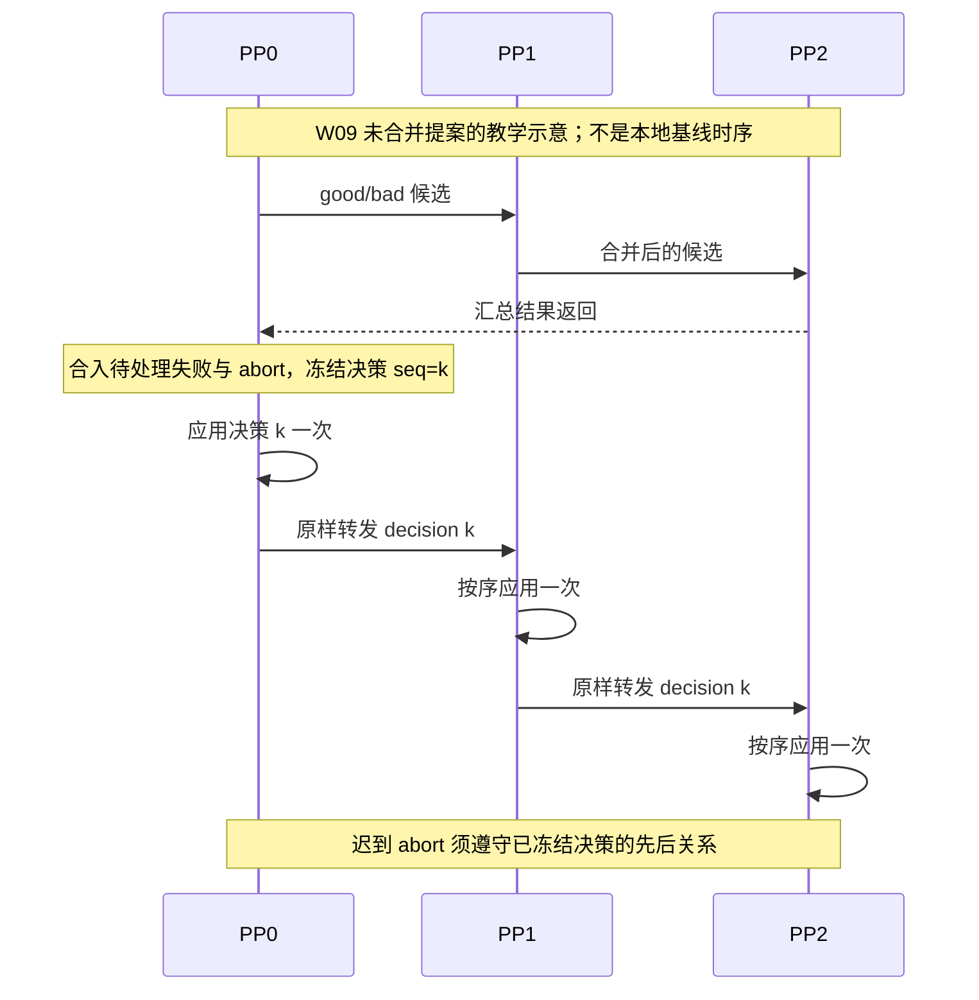

**图意解读：** 改进目标是各 stage 消费相同的决策历史。图省略 TP/CP、槽位以及张量工作；“应用一次”仅指该提案的 bootstrap 决策消费规则，不代表进程崩溃恢复、KV DMA 或端到端请求具有 exactly-once 保证，也没有由此产生多数派容错能力。

**迟到 abort 的编号例子（只解释 W09 提案）：** 假设 PP0 已冻结决策 7，其中 A 属于 good；这时 PP0 收到取消 A，并给该 abort 标上“在决策 7 之后处理”的顺序约束。若 PP1 还只应用到决策 6，就需要先把决策推进到 7，再处理这个取消，不能把已经冻结的决策 7 擅自改成另一份名单。

这个例子要说明的是：不同工位即使处理快慢不同，也按同一顺序记下“准入 A”和“取消 A”。**先应用 bootstrap 决策不等于必须先跑一次 A 的模型计算。** 编号约束的是该提案里的控制状态顺序，不能将它写成本地基线已具备的机制。

配套 W11 / [PR #34568](https://github.com/sgl-project/sglang/pull/34568) 同样未合并，提出把 HiCache prefetch readiness 纳入 bootstrap 的 good 候选过滤，减少 ready 条件彼此脱节。两项提案分别补“准入条件”和“决定之后的顺序”；不能把它们合写为本地已经启用的一套协议。

### 15.5 延迟案例：达成一致也可能很慢

W10 / [Issue #34815](https://github.com/sgl-project/sglang/issues/34815) 报告 Kimi-K3 的 PP8 Prefill 存在约 30 秒 TTFT 现象，并给出 bootstrap 等分段指标。作者使用两节点 B300、Mooncake 和分层缓存；其中 PP/TP 对比涉及不同 SGLang 版本、KV 精度/加速配置、Decode 并行配置和请求窗口。**这不是只改变 PP 的受控实验，不能从图表比例推出纯共识成本，也不能把标题里的约 30 秒当成所有 PP8 的固定下限。**

结合本地 event loop，[S10]、[S15]，更稳妥的教学理解是：RID 很少，只能说明控制消息载荷可能很小；消息何时被发送、接收和消费，仍取决于调度执行到了哪里。第 8.5 节的计算气泡图有助于理解时间轴，但无法单独测出共识耗时。

**一个只用于理解等待的时间例子：** 假设某站在 1 ms 时已经具备本地 ready 条件，但要到 100 ms 才执行下一次相关控制处理；即使发送这条 RID 消息只需 1 ms，在开始发送前也已经等了约 99 ms。像工位已经填好了通知，却要等到下一次交接才递出去。

这些数字是人为设定的教学值，不是 SGLang 实测或固定调度周期。它只说明“消息很小、传得很快”和“决定很快被消费”是两件事；不能再乘以 PP 大小就当成 TTFT 预测公式。

下面是**整理者给后续实验的分段方法**，不是一条可直接相加的源码公式；跨 stage 时间戳需校准，并检查各段是否重叠：

| 时间点 | 需要捕获的事件 | 可回答的问题 |
| --- | --- | --- |
| t0 | 请求进入当前 stage 的 bootstrap queue | 等待从哪里开始计时 |
| t1 | 最后一站具备本轮要求的本地 ready 条件 | 真正等待后端准备的时间有多长 |
| t2 | 候选汇总完成并返回首站 | ready 后花了多久才被协议观察到 |
| t3 | 对应 stage 消费最终名单并完成出队 | 返回传播与本地准入分别贡献多少 |
| t4 | 请求首次真正进入 Prefill batch | waiting queue 的排队是否被算进“共识慢” |
| t5 | 首 token 到客户端 | 还包含 Prefill 计算、P/D 传输、Decode 和响应路径 |

如果 t1 很早、t2/t3 很晚，才有依据重点研究协议推进节奏；如果 t1 本身很晚，应先追 metadata、缓存或后端握手。单看整体 TTFT 无法替代这些证据。

### 15.6 新近 WIP：异步汇总 bootstrap 状态，仍由 PP0 传播决定

W12 / [PR #38959](https://github.com/sgl-project/sglang/pull/38959) 创建于 2026-09-11，读取时 Open、未合并，标题标记 WIP；所读 head 为 `8242c4e1b014ad823330100bc8f0546bd712378b`。作者提出移除 Prefill bootstrap 原有的候选往返，改由 PP0 收集状态、决定名单，再通过 `pp_sync` 传播；其他共识流程仍保留，当前限定 Mooncake。

这里的 `PPConsensusStore` 不能按名字理解成“各进程共享一个 Python dict”。固定 head 的[实际实现](https://github.com/sgl-project/sglang/blob/8242c4e1b014ad823330100bc8f0546bd712378b/python/sglang/srt/disaggregation/pp_consensus_store.py)是各 rank 保存本地 map，非首 rank 用后台队列和 ZMQ PUSH 把更新复制到 PP0 的 PULL 接收端；PP0 的 `collect()` 读取各 rank 的已收到值。它把状态汇聚从逐站调度转发中拆出，仍需要状态到达、PP0 决策和决定传播。

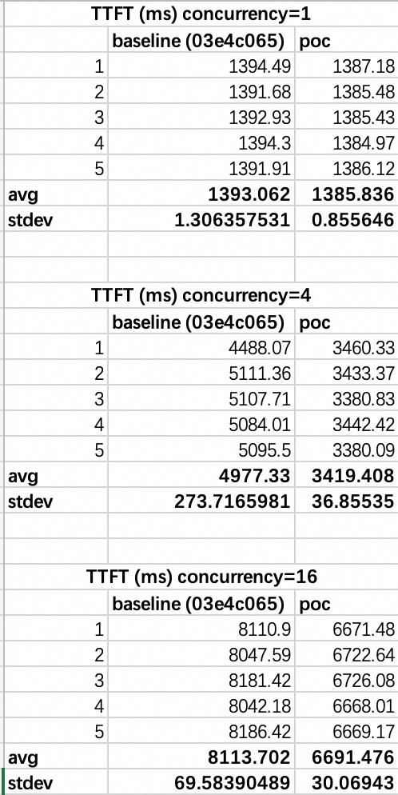

**图意解读：** 原图 baseline 标记 `03e4c065`。并发 1 两列接近，并发 4/16 的 POC 才明显下降；不能把作者概括的“一轮 Prefill”泛化到每个负载。实验为 DeepSeek-V4-Flash-0731，P=PP4/TP1、D=TP4、chunk 8192、Marlin、无 HiCache，输入 4096/输出 1、256 请求，每档重复 5 次。PR 正文未注明 GPU 型号，Accuracy Tests 为 N/A；本文未复现，也未证明图中 POC 恰好等于本次所读 head。[原帖与完整命令](https://github.com/sgl-project/sglang/pull/38959)

**与 W09 的区别是整理者归纳：** W09 主要约束“大家以什么顺序消费同一份决定”，W12 主要改变“首站如何更早拿到各站状态”。二者不能互相替代正确性验证；异步收集也仍需研究失败传播、请求标识复用、状态清理与生命周期。

### 15.7 如何把网上信息用回本文

| 网上看到的说法 | 回到本文应核对什么 |
| --- | --- |
| “PP 已支持某种 PD/并行组合” | 先核对发帖日期、合并 commit，再看第 13.2 节与实际启动参数 |
| “共识完成，所以可以出队” | 第 5～7 节：名单语义、实际处理、metadata/KV 和后端门槛 |
| “NCCL 卡住，所以是网络故障” | 第 13 节：是否更早出现有序 RID、队列或通信调用顺序分歧 |
| “动态 chunk 已消除 PP 气泡” | 第 8.5 节：计算示意不证明 bootstrap、transfer 和资源等待都消失 |
| “新 PR 解决了共识问题” | 第 15.4/15.6 节：是否合并、改变哪一段、作者测了什么、还有哪些边界 |

本次网络补充增加 **12 项一手来源、5 张原始技术图片和 1 张提案时序图**。图片保留原始字节、逐张检查可读内容，来源、原始地址、尺寸和 SHA-256 见 [图片来源记录](../../images/sglang-pp-consensus/SOURCES.md)。所有社区实验和现场现象均归属于发帖者；本次验收仍是文档与代码静态核对，没有改变本地 SGLang 实现或替任何 PR 做运行验收。


[S01]: https://github.com/sgl-project/sglang/blob/72d5c5bb73cadd7ffbf5114e5f81e29d36b6c61a/python/sglang/srt/managers/scheduler.py#L5646
[S02]: https://github.com/sgl-project/sglang/blob/72d5c5bb73cadd7ffbf5114e5f81e29d36b6c61a/python/sglang/srt/managers/scheduler_pp_mixin.py#L62
[S03]: https://github.com/sgl-project/sglang/blob/72d5c5bb73cadd7ffbf5114e5f81e29d36b6c61a/python/sglang/srt/managers/scheduler.py#L2050
[S04]: https://github.com/sgl-project/sglang/blob/72d5c5bb73cadd7ffbf5114e5f81e29d36b6c61a/python/sglang/srt/managers/scheduler_components/request_receiver.py#L89
[S05]: https://github.com/sgl-project/sglang/blob/72d5c5bb73cadd7ffbf5114e5f81e29d36b6c61a/python/sglang/srt/managers/scheduler_pp_mixin.py#L1078
[S06]: https://github.com/sgl-project/sglang/blob/72d5c5bb73cadd7ffbf5114e5f81e29d36b6c61a/python/sglang/srt/managers/scheduler_pp_mixin.py#L1118
[S07]: https://github.com/sgl-project/sglang/blob/72d5c5bb73cadd7ffbf5114e5f81e29d36b6c61a/python/sglang/srt/disaggregation/utils.py#L249
[S08]: https://github.com/sgl-project/sglang/blob/72d5c5bb73cadd7ffbf5114e5f81e29d36b6c61a/python/sglang/srt/disaggregation/base/conn.py#L100
[S09]: https://github.com/sgl-project/sglang/blob/72d5c5bb73cadd7ffbf5114e5f81e29d36b6c61a/python/sglang/srt/disaggregation/utils.py#L52
[S10]: https://github.com/sgl-project/sglang/blob/72d5c5bb73cadd7ffbf5114e5f81e29d36b6c61a/python/sglang/srt/managers/scheduler_pp_mixin.py#L170
[S11]: https://github.com/sgl-project/sglang/blob/72d5c5bb73cadd7ffbf5114e5f81e29d36b6c61a/python/sglang/srt/managers/scheduler_pp_mixin.py#L1197
[S12]: https://github.com/sgl-project/sglang/blob/72d5c5bb73cadd7ffbf5114e5f81e29d36b6c61a/python/sglang/srt/managers/scheduler_pp_mixin.py#L355
[S13]: https://github.com/sgl-project/sglang/blob/72d5c5bb73cadd7ffbf5114e5f81e29d36b6c61a/python/sglang/srt/managers/scheduler_pp_mixin.py#L1159
[S14]: https://github.com/sgl-project/sglang/blob/72d5c5bb73cadd7ffbf5114e5f81e29d36b6c61a/python/sglang/srt/disaggregation/decode.py#L816
[S15]: https://github.com/sgl-project/sglang/blob/72d5c5bb73cadd7ffbf5114e5f81e29d36b6c61a/python/sglang/srt/managers/scheduler_pp_mixin.py#L658
[S16]: https://github.com/sgl-project/sglang/blob/72d5c5bb73cadd7ffbf5114e5f81e29d36b6c61a/python/sglang/srt/disaggregation/prefill.py#L422
[S17]: https://github.com/sgl-project/sglang/blob/72d5c5bb73cadd7ffbf5114e5f81e29d36b6c61a/python/sglang/srt/disaggregation/decode.py#L1083
[S18]: https://github.com/sgl-project/sglang/blob/72d5c5bb73cadd7ffbf5114e5f81e29d36b6c61a/python/sglang/srt/disaggregation/prefill.py#L918
[S19]: https://github.com/sgl-project/sglang/blob/72d5c5bb73cadd7ffbf5114e5f81e29d36b6c61a/python/sglang/srt/disaggregation/decode.py#L2292
[S20]: https://github.com/sgl-project/sglang/blob/72d5c5bb73cadd7ffbf5114e5f81e29d36b6c61a/python/sglang/srt/utils/common.py#L2518
[S21]: https://github.com/sgl-project/sglang/blob/72d5c5bb73cadd7ffbf5114e5f81e29d36b6c61a/python/sglang/srt/managers/scheduler_pp_mixin.py#L733
[S22]: https://github.com/sgl-project/sglang/blob/72d5c5bb73cadd7ffbf5114e5f81e29d36b6c61a/python/sglang/srt/managers/scheduler_pp_mixin.py#L796
[S23]: https://github.com/sgl-project/sglang/blob/72d5c5bb73cadd7ffbf5114e5f81e29d36b6c61a/python/sglang/srt/disaggregation/decode.py#L2429
[S24]: https://github.com/sgl-project/sglang/blob/72d5c5bb73cadd7ffbf5114e5f81e29d36b6c61a/python/sglang/srt/mem_cache/hiradix_cache.py#L239
[S25]: https://github.com/sgl-project/sglang/blob/72d5c5bb73cadd7ffbf5114e5f81e29d36b6c61a/python/sglang/srt/mem_cache/hiradix_cache.py#L1017
[S26]: https://github.com/sgl-project/sglang/blob/72d5c5bb73cadd7ffbf5114e5f81e29d36b6c61a/python/sglang/srt/mem_cache/unified_radix_cache.py#L1872
[S27]: https://github.com/sgl-project/sglang/blob/72d5c5bb73cadd7ffbf5114e5f81e29d36b6c61a/python/sglang/srt/utils/rank_consensus_checker.py#L28
[S28]: https://github.com/sgl-project/sglang/blob/72d5c5bb73cadd7ffbf5114e5f81e29d36b6c61a/python/sglang/srt/managers/scheduler.py#L2357
[S29]: https://github.com/sgl-project/sglang/blob/72d5c5bb73cadd7ffbf5114e5f81e29d36b6c61a/python/sglang/srt/arg_groups/overrides.py#L1697
[S30]: https://github.com/sgl-project/sglang/blob/72d5c5bb73cadd7ffbf5114e5f81e29d36b6c61a/python/sglang/srt/arg_groups/validation_hook.py#L27
[S31]: https://github.com/sgl-project/sglang/blob/72d5c5bb73cadd7ffbf5114e5f81e29d36b6c61a/python/sglang/srt/arg_groups/serving_hook.py#L453
[S32]: https://github.com/sgl-project/sglang/blob/72d5c5bb73cadd7ffbf5114e5f81e29d36b6c61a/python/sglang/srt/arg_groups/fields/parallel.py#L76
[T01]: https://github.com/sgl-project/sglang/blob/72d5c5bb73cadd7ffbf5114e5f81e29d36b6c61a/test/registered/unit/managers/test_pp_cp_rank_offsets.py
[T02]: https://github.com/sgl-project/sglang/blob/72d5c5bb73cadd7ffbf5114e5f81e29d36b6c61a/test/manual/scheduler/test_scripted_pp_abort.py
[T03]: https://github.com/sgl-project/sglang/blob/72d5c5bb73cadd7ffbf5114e5f81e29d36b6c61a/test/registered/unit/disaggregation/test_prefill_abort_result_cleanup.py
[T04]: https://github.com/sgl-project/sglang/blob/72d5c5bb73cadd7ffbf5114e5f81e29d36b6c61a/test/registered/pp/test_pp_single_node.py
[T05]: https://github.com/sgl-project/sglang/blob/72d5c5bb73cadd7ffbf5114e5f81e29d36b6c61a/test/registered/cpu/test_rank_consensus_checker.py
[T06]: https://github.com/sgl-project/sglang/blob/72d5c5bb73cadd7ffbf5114e5f81e29d36b6c61a/test/registered/unit/disaggregation/test_deferred_decode_kv_release.py
[T07]: https://github.com/sgl-project/sglang/blob/72d5c5bb73cadd7ffbf5114e5f81e29d36b6c61a/test/registered/unit/mem_cache/test_hiradix_pp_sync_drain.py
