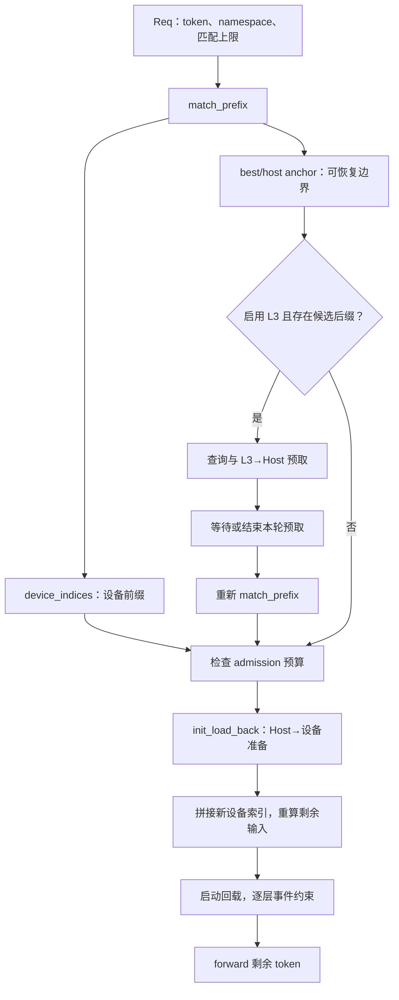
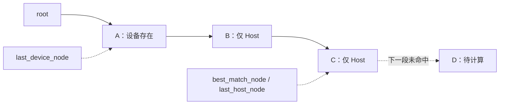
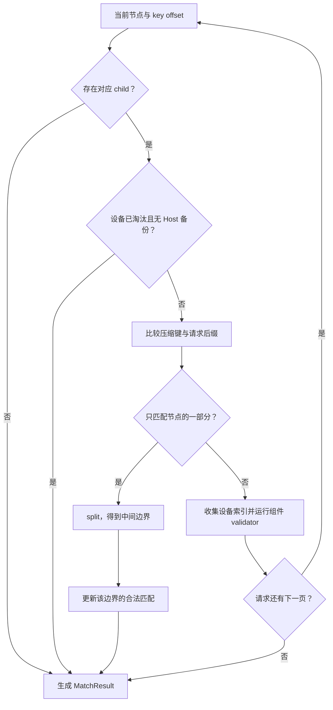
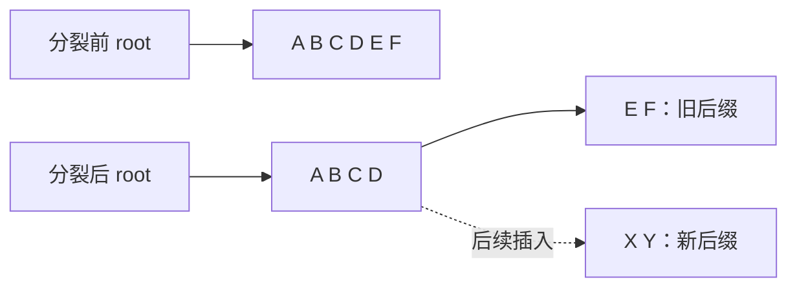
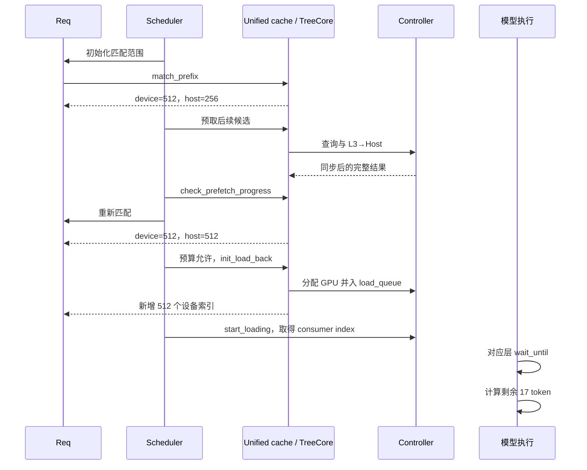

# HiCache 前缀命中源码学习文档

本文是**源码分析型学习资料**，面向第一次读 SGLang 缓存源码的同学。只沿一条主线走：**请求带着相同前缀回来时，系统怎样找到可复用 KV，怎样把 Host 和外部存储的命中变成 GPU 上真正可用的前缀。**

先把结论放在前面：HiCache 的“命中”有多个阶段。树上匹配到前缀、Host 有候选副本、L3 查询到对象、GPU 分配了回载位置、计算 stream 可以读取，分别由不同条件保证。排障时必须说明自己观察的是哪一步。

建议先读第 1～4 节理解对象和匹配，再读第 5～9 节走完整请求，最后用第 10～14 节核对边界和练习。数据搬运与资源退役的完整说明见姊妹篇 [HiCache 下 SGLang L1、L2、L3 与上传回载源码学习文档](<HiCache 下 SGLang L1、L2、L3 与上传回载源码学习文档.md>)。

## 0. 阅读基线与范围

| 项目 | 内容 |
| --- | --- |
| 项目上游 | [sgl-project/sglang](https://github.com/sgl-project/sglang) |
| 固定源码入口 | [固定源码快照](https://github.com/sgl-project/sglang/tree/72d5c5bb73cadd7ffbf5114e5f81e29d36b6c61a) |
| 分支 | 实际读取时为 `codex/main`；内容采用仓内已有的官方开源 `main` 固定快照 |
| commit | `72d5c5bb73cadd7ffbf5114e5f81e29d36b6c61a` |
| 读取时间 | 2026-09-16 |
| 工作区状态 | 实际读取 worktree 干净；原仓库 `muxi-main` 有既存未跟踪文件，保持原状 |
| 操作边界 | 只读源码；没有导入或启动 SGLang，没有 GPU、RDMA、存储后端和推理实验 |
| 主路径 | `UnifiedRadixCache` + Python `UnifiedTreeCore` + FULL 组件，开启 HiCache，Host 模式为 `cache` |
| 对照路径 | 同一 commit 中的 `HiRadixCache`；混合 SWA/Mamba、`buffer_only`、direct linker 仅说明边界 |
| 时效边界 | 沿用可复核快照，没有刷新官方 main；不声称覆盖读取日最新实现 |

正文中的 `[Sxx]` 均指向文末**固定 commit、文件和符号**。源码条件属于静态事实；图、例子和排障推演属于整理者归纳，不是实测记录。

本篇放在 `sglang/`，与已有 HiCache 工程资料和 PP 专题相邻。与 [04-05 HiCache 分层存储与回载](../source-study/04-kv-cache/05-HiCache分层存储与回载.md)相比，本篇集中解释“命中到底如何判定”，并把同名字段的几个时间点拆开。

### 0.1 先固定缓存实现，才能解释字段

`registry.py::default_radix_cache_factory` 的普通选择链最终构造 UnifiedRadixCache；`_create_unified_radix_cache` 根据模型装配 FULL、SWA、MAMBA 等组件，在启用分层缓存时调用 `init_hicache`。[S01]、[S02]

这不表示任何配置都会走同一路径。禁用 radix 配合 chunk、实验 C++ tree、纯 SWA、LMCache、FlexKV、注册的外部 factory，都可能改变选择。HiRadixCache 类仍在源码中，但不能因旧资料使用该名称，就把它写成这一快照普通默认路径。

### 0.2 术语速查

| 术语 | 人话解释 | 本篇关注点 |
| --- | --- | --- |
| prefix | 从请求开头连续一致的一段 token | 中间断开后不能跳过去继续算长前缀 |
| RadixKey | 带命名空间的逻辑 token 序列 | 不只是显示出来的文本 |
| page | 分配、传输和缓存对齐的单位 | 页大小与一次 Prefill chunk 长度不同 |
| device / L1 | 模型计算使用的设备 KV 池 | 用物理槽位索引访问 KV |
| host / L2 | `cache` 模式下的主机 KV 池 | 可常驻，仍需 H2D 才能参与设备计算 |
| storage / L3 | 可选外部存储 backend | 返回对象存在性或数据，不负责请求准入 |
| anchor | 后续查找、回载或加锁所依托的树节点 | device anchor 与 host/best anchor 可能不同 |
| admission | 调度器确认资源并将请求纳入本轮 | 找到缓存不等于通过 admission |
| pending | 某个异步动作已登记，尚未完成收尾 | 地址存在不等于复制完成 |
| lock/ref | 保持节点或槽位不被回收的保护引用 | 与 GPU event 的执行依赖分开 |
| ACK | 操作完成信息及其关联事件 | 先看 ACK 类型，再看完成条件 |

## 1. 先建立整体地图：一条请求要过哪些门

### 1.1 人话版

可以把 GPU 看成工作台，Host 看成旁边的资料架，L3 看成外部仓库。找到资料的目录页，只解决“可能在哪里”；把资料搬到工作台并确认可读，才解决“这次计算能使用多少”。

对重复请求来说，常见路线是：

1. 请求生成可匹配的 token 范围和命名空间。
2. 前缀树返回设备可直接引用的部分，以及较远的 Host 可恢复边界。
3. 如果启用 L3，调度器可以对尚未覆盖的后缀发起预取。
4. 预取结束后重新匹配树，不能沿用排队前的旧长度。
5. 调度器检查本轮 token、KV 容量等预算。
6. Host 命中需要回载，成功后把新 GPU 索引拼到请求前缀。
7. 模型逐层读取前等待对应回载事件，计算剩余 token。

[S03]、[S04]、[S05]、[S06]、[S07]



**图意解读：** 实线表达教学上的阶段关系，不表示每一条请求都会发起 L3 查询。图中的回载准备仍包含拒绝和资源不足分支。`match_prefix` 不会替调度器完成所有 I/O、预算判断和 forward。

### 1.2 三种命中路径对照

| 场景 | 匹配时可观察内容 | 继续计算前还缺什么 |
| --- | --- | --- |
| L1 已有合法前缀 | `device_indices` 含相应槽位 | 请求保护、剩余输入准入与执行 |
| L1 不完整，L2 有可恢复部分 | device anchor 较浅，`host_hit_length` 大于 0 | GPU 空间、H2D 提交、逐层可读事件 |
| L1/L2 未覆盖后缀，L3 有对象 | 预取查询/传输返回结果 | Host 接收、结果纳入树、重匹配、H2D |

“缓存命中率高”必须附上口径：设备命中、Host 匹配、L3 查询命中、读取完成量和最终使用量可能不同。

## 2. 请求实际拿什么去匹配

### 2.1 token 相同之前，先问请求表示是否相同

`Req.init_next_round_input` 刷新 `fill_ids`，以 `full_untruncated_fill_ids` 为基础构造 RadixKey，并传入 `extra_key`、`cache_salt` 和 `limit`。[S03]

RadixKey 的 `child_key_at` 把 token 页和命名空间组合成子节点查找键。存在 salt 时，字典键包含 `(extra_key, cache_salt)`；不存在 salt 时仍可能包含 extra_key。[S08]

| 条件 | 对匹配的影响 | 不能据此下的结论 |
| --- | --- | --- |
| 可见字符串相同 | 仍需比较最终 token IDs | 不能直接认定 KV 等价 |
| token IDs 相同，salt 不同 | 树查找进入不同键空间 | 不应跨 salt 复用 |
| extra_key 不同 | 查找键可分离 | 不能只看 token 数量 |
| 存在 positional embedding overrides | 本入口把待匹配 token 置空 | 不能拿普通 token cache 路径解释该请求 |
| 模型、权重、布局不同 | 必须另查外部 backend 的对象命名和兼容配置 | RadixKey 不是所有跨模型正确性的完整证明 |

**小例子：** 两个请求 token 都是 `[11,22,33,44]`，salt 分别为 `team-a` 和 `team-b`。即使它们共享进程，也不会因为这四个 token 相同就落到相同的带盐 child key。这里解释源码中的键空间隔离，不把它扩展成完整权限认证机制。

### 2.2 为什么重复整个 prompt，也未必匹配到最后一个 token

`Req._compute_max_prefix_len` 先把最大匹配长度设成 `input_len - 1`；若请求特定区间的 logprob，还可能进一步缩短。[S09]

```python
# Req._compute_max_prefix_len 的关键分支
max_prefix_len = input_len - 1
if self.return_logprob and self.logprob_start_len >= 0:
    max_prefix_len = min(max_prefix_len, self.logprob_start_len)
```

源码把这项限制解释为给 logprob 计算保留位置。教学上应记住：缓存匹配长度受到执行输出需要约束，不是越接近 prompt 总长就越“正确”。

如果输入长度是 17，匹配上限通常是 16；若 page_size=4，则最多检查 4 个完整页。若输入长度是 16，上限先变 15，再按页截到 12。后者少匹配一页并不自动表示缓存丢了。

### 2.3 page 对齐和 chunk 切分分别在哪一步发生

TreeCore 的 `match_prefix` 先处理可能的 bigram 视图，再执行 `page_aligned(page_size)`；长度变成 0 时返回空结果。[S68]、[S10]

- page 对齐：决定缓存键可复用的完整单位。
- chunk 切分：调度器决定本轮新增计算多长。
- GPU allocator：决定物理槽位怎么给请求使用。

例如 page_size=16、Prefill chunk=256，不意味着一个树节点必须正好 256 token。节点长度、页粒度和每轮计算量属于不同维度。

本文数值例子使用普通 FULL attention；EAGLE/bigram、SWA 尾部重算和多模态输入有额外条件，不能把原始 token 个数公式直接套过去。

## 3. 树节点保存的到底是什么

### 3.1 索引与数据分开

在 Unified 实现中，`UnifiedTreeNode.component_data` 为不同组件保存设备和 Host 的索引及引用状态。真正 KV 字节位于相应 pool。[S11]

| 对象 | 保存内容 | 谁使用 |
| --- | --- | --- |
| RadixKey / children | 逻辑前缀与分支关系 | TreeCore 匹配和插入 |
| FULL `value` | 设备 KV 索引 | 请求前缀、回收和设备读取 |
| FULL `host_value` | 主机 KV 索引 | 回载、Host 淘汰和 L3 写任务 |
| Req `prefix_indices` | 本请求本轮复用的设备前缀索引 | batch 准备和剩余输入计算 |
| ReqToTokenPool | 请求逻辑位置到物理槽位的视图 | 请求执行和生命周期处理 |
| device/host pool | KV 或辅助状态的实际存储 | transfer engine 与模型层 |

树节点不是一份完整的模型 KV tensor。它更像“从逻辑片段到物理位置的目录”。节点分裂时切分目录与索引，不能想象成每次查找都复制一整段大 KV。[S12]

### 3.2 为什么需要两个边界

假设一个请求的合法前缀为 A→B→C：

- A 在设备。
- B、C 已从设备淘汰，但 Host 仍有。
- 请求后面的 D 不存在。

那么：



**图意解读：** 设备索引只应表达目前设备可引用的匹配边界；Host 边界给出潜在更长的恢复位置。只有回载成功，B、C 的设备位置才会进入请求索引。

### 3.3 pending 与副本存在是两个维度

树上可能已经登记 host_value，但 D2H 尚未完成。也可能已经登记设备 value，但 H2D 尚未完成。相关操作通过 pending ID、ongoing 表、锁与事件追踪。[S13]、[S14]

本篇使用“设备可引用边界”描述索引语义；实际读字节仍须满足执行事件。源码中的 `backuped`、`value is not None` 等结构条件，不能单独替代 I/O 完成证据。

## 4. match_prefix 的控制流逐步拆解

### 4.1 外壳先调用树，再处理动作

`UnifiedRadixCache.match_prefix` 将匹配交给 TreeCore，处理返回的 cache actions，再让组件完成 cache 层结果处理。[S15]

这解释了为什么“查缓存”不一定是纯只读查询：radix 的压缩边在部分匹配时可能需要分裂；某些组件还有与匹配相关的状态准备。主调度循环必须在预期线程和顺序上执行这些动作。

### 4.2 Python TreeCore 的主要判断

阅读 `UnifiedTreeCore._match_prefix_helper` 时，可以沿下列顺序：[S04]

1. 从 root 开始，按照当前页和命名空间找到 child。
2. 如果 child 已 evicted 且没有 Host backup，停止；这条连续可恢复路径已经断开。
3. 比较 child 的压缩键与请求后续键，得到匹配长度。
4. 若只匹配 child 的一部分，分裂该节点，形成明确的边界。
5. 遇到未 evicted 的节点时收集设备索引块。
6. 调用各组件 validator，分别更新“设备合法边界”和“设备或 Host 合法边界”。
7. 查到分支结束或请求范围结束，进入结果后处理。



**图意解读：** validator 决定某个边界是否可用，不只是字符串比较。辅助组件不满足条件时，最深的 token 匹配位置可能超过最终允许复用的位置。

### 4.3 FULL 组件怎样判断有效

`FullComponent.create_match_validator` 在 device-only 模式要求 `value is not None`；允许 Host 时，设备值存在或节点有 backup 即可成为候选边界。[S66]

`finalize_match_result_in_tree_core` 从 best 节点向 device 节点回溯，累加路径上的 Full Host 索引长度，写入 `host_hit_length`。这里是在计算恢复需求，不是执行回载。[S16]、[S65]

| 字段 | 适合回答的问题 | 不足以证明 |
| --- | --- | --- |
| `device_indices` | 当前请求拿到了哪些设备前缀索引 | 异步 H2D 已全部结束 |
| `last_device_node` | 设备侧合法边界在哪里 | Host/L3 没有更长前缀 |
| `best_match_node` | 各组件允许的最深匹配边界在哪里 | 已经通过预算检查 |
| `last_host_node` | 后续 Host/L3 主线从哪里衔接 | 外部存储必定有后续页 |
| `host_hit_length` | 本次匹配存在多少 Full Host 恢复长度 | 实际回载了同样多 token |
| `full_kv_hit_length` | Full 键遍历匹配到了多长 | 混合模型全部状态都可复用 |

### 4.4 部分匹配时节点怎样拆开

教学例子设 page_size=2，已有压缩节点 `[A B C D E F]`，新请求是 `[A B C D X Y]`。前 4 个 token 对齐匹配，形成父节点 `[A B C D]`，原来的 `[E F]` 成为后缀 child，之后新请求可插入 `[X Y]` 分支。



**图意解读：** 新增的是可定位的目录边界。FULL 组件切分对应索引；若节点有未完成备份，cache action 还需要维护 pending 对应的片段列表。旧 ACK 不能只处理旧名字对应的一半。[S12]、[S13]

## 5. L3 命中怎样进入这条主线

### 5.1 L3 查询由谁发起

`Scheduler._prefetch_kvcache` 先做一次本地前缀匹配，再根据 Host anchor、当前匹配长度和请求最大可匹配范围，截出候选后缀，调用 `prefetch_from_storage`。[S05]

在本篇 `cache` 模式，源码检查 anchor 是否已 backup，或者是否为 root。它不是对每条请求、每一页都无条件向外部存储发请求。

传入的信息包括：RID、anchor、候选 token、前一段 hash、可选 prefix keys，以及 extra_key/cache_salt。缓存层核对 anchor 与请求命名空间，候选键也进行 page 对齐。[S17]

### 5.2 查询命中、成功读取、请求使用是三本账

HybridCacheController 的 `_storage_hit_query` 根据页 hash 查询 backend，得到连续 KV 页数；有额外 pool 时使用带组件信息的接口。[S18]

查询成功后仍可能遇到：

- Host 容量不足，缩短到可分配的完整前缀或放弃。
- 某页在实际读取时失败，后面的页不能补成一个不连续前缀。
- 混合组件结果不满足一致恢复条件，整体结果被缩短或丢弃。
- 排队期间另一请求已插入同样前缀，本次读取变成重复副本。
- H2D 阈值或设备预算导致这次请求没有真正使用已读取数据。

[S19]、[S20]

| 观测点 | 语义 | 后续可能缩短的原因 |
| --- | --- | --- |
| 查询 hit pages | 外部 backend 报告可读前缀 | 实际 GET 失败或数据变化 |
| completed tokens | 同步后可交接的读取量 | 树重复、组件条件、结果处理 |
| inserted/loaded span | L3→Host 结果纳入缓存的区间 | 等待期间淘汰、H2D 被拒绝 |
| host_loaded_length | admission 实际拼入的新 Full 设备索引数 | 不表示全部层已可读取 |
| 最终缓存使用量 | 本请求执行真正复用的区间 | 要按实现的区间归因规则统计 |

### 5.3 为什么预取后还要重匹配

调度循环先调用 `check_prefetch_progress(req.rid)`。返回 False 时跳过仍在预取的请求；能够结束这一轮预取后，再调用 `req.init_next_round_input(self.tree_cache)`。[S06]

前后两次匹配之间，缓存可能新增、分裂、淘汰或被别的请求锁住。以新的树状态建立请求视图，是连接异步预取与同步 admission 的关键。

**例子：** 请求 A 排队时 L1 命中 512，发起后面 1024 token 的 L3 预取。等待期间请求 B 已把其中 512 token 插入设备树。A 不能简单计算 `512+1024` 并再次拥有重复 GPU 槽位；它需要重匹配，再恢复真正缺少的部分。

## 6. 一个完整的数值 walkthrough

### 6.1 初始条件

以下全部是教学假设，使用 FULL attention、page_size=16，不代表推荐配置或实测结果：

- 请求总输入 1,041 token，因此可匹配上限为 1,040。
- L1 覆盖 `[0,512)`。
- L2 额外覆盖 `[512,768)`。
- L3 能为后面的 `[768,1024)` 返回完整页。
- 末尾 `[1024,1041)` 需要本轮计算。
- L3 预取候选为 272 token，超过源码默认 256 token 阈值；实际命中 256。
- 假定资源充足、无并发树变化、组件一致，并且没有 logprob 进一步截断。

### 6.2 每个时刻的长度

| 时刻 | 设备前缀 | Host 可恢复增量 | L3 的角色 | 本请求还需计算 |
| --- | ---: | ---: | --- | ---: |
| 第一次匹配后 | 512 | 256 | 尚未查询后缀 | 尚不能用最终值判断 |
| L3 读取完成并纳入 Host | 仍为 512 | 重新匹配后为 512 | 新增 `[768,1024)` | 尚未确认 H2D |
| H2D 准备成功并拼入索引 | 1,024 | 匹配记录与实际加载分开保存 | 本次来源区间仍可追踪 | 17 |
| 对应层回载事件满足后 | 1,024 可按层读取 | Host 可保留副本 | 无须再读该段 | 计算这 17 个 token |

“还需计算 17”与调度预算记账不同：某些预算按 page 向上取整，可能计成 32；实际模型输入与为安全分配记的整数预算必须分开。[S07]



**图意解读：** 最后一次“返回索引”和最后两步“事件满足、计算”之间存在明确间隔。不能从 CPU 日志里一条 load-back success 推断所有层复制已完成。

### 6.3 如果资源不足，会发生什么

若 GPU 无法为 512 个回载 token 提供空间，`load_back` 会尝试相应淘汰；仍不足则返回失败，并解除本次准备阶段的引用。[S21]

`init_load_back` 失败时保留原设备边界。调度器根据真实 `prefix_indices` 重新计算剩余输入，可能切 chunk、暂缓请求或走重算路径，不能仍把 512 个 Host token 当成已经免除了设备空间需求。[S07]、[S22]

## 7. Host 命中怎样变成 GPU 前缀

### 7.1 先过预算，再准备回载

在 `PrefillAdder.add_one_req` 主分支中，可以看到：候选 input、剩余 total tokens、SWA 预算、锁定后复查以及可选 prefill delayer，均先于 `init_load_back` 的关键调用。[S07]

它先用 Host 匹配估算本轮需要重算的 token，但会在回载以后再使用实际设备索引重算输入量。这是“预计可以省掉的工作”和“真正省掉的工作”的交接点。

```python
# PrefillAdder.add_one_req 的关键交接，省略无关参数
new_indices, req.last_node = self.tree_cache.init_load_back(...)
req.host_loaded_length = len(new_indices)
req.prefix_indices = torch.cat([req.prefix_indices, new_indices])
```

以上片段省略号表示教学节选，不是可直接执行的独立程序。

### 7.2 保护、分配、提交和完成

`UnifiedRadixCache.load_back` 先保护 Host anchor 和设备路径，再让组件准备恢复数据。[S64]`_load_back_transfers` 建立传输描述，检查阈值与 quota，分配设备位置，提交树状态并登记 ongoing load。[S21]

| 阶段 | 改变的状态 | 失败时应去哪里查 |
| --- | --- | --- |
| 保护 anchor | Host 和设备引用增加 | 节点是否仍合法、组件准备条件 |
| 建立 spec | 找到需要的 host indices 与额外 pools | 是否为空、组件是否可恢复 |
| 分配设备 | allocator 返回新槽位 | quota、可用量、淘汰结果 |
| 提交树与请求视图 | value、prefix_indices、ongoing 信息更新 | 只说明准备成功 |
| 启动 H2D | controller 合并 load_queue | consumer index 与 batch 绑定 |
| 完成事件与收尾 | 解除传输引用，更新 pending | `loading_check`、finish event |

### 7.3 小片段可能选择重算

固定快照把 `load_back_threshold` 设为 10。纯 FULL 路径中，传输 token 数低于 `max(1, threshold)` 会拒绝这次回载；有额外组件传输时，不能仅凭 Full 长度排除恢复。[S23]、[S21]

这个阈值不是 L3 预取的 256 token 阈值。前者在 L2→L1 阶段，后者在 L3 查询/预取阶段。页粒度也会影响哪些实际长度能够到达该判断。

## 8. 为什么“索引存在”仍然需要事件

### 8.1 异步拷贝分两个时刻

HybridCacheController.load 分配 GPU 索引并放进 `load_queue`，不在这里完成整段复制。Scheduler 构造 batch 后调用 `ready_to_load_host_cache`，经 controller.start_loading 启动复制，并把返回值保存为 `hicache_consumer_index`。[S24]、[S25]

TP worker 在执行相应 batch 时设置 consumer；设备 KV pool 逐层读取前，通过 LayerDoneCounter 等待该批次相应层的事件。[S26]、[S27]

### 8.2 两种保护分别挡住什么问题

| 保护 | 防止的问题 | 不能替代的保护 |
| --- | --- | --- |
| 节点/Host lock | 源或目标仍被使用时遭淘汰、回收 | 不能保证拷贝命令已执行完 |
| stream/event 依赖 | 计算读到复制尚未写完的字节 | 不能自动决定何时回收树节点 |
| consumer index | 模型等待与本 batch 对应的传输事件 | 不是 RID，也不是永久槽位编号 |
| completion ACK 处理 | 操作结束后释放传输持有的引用 | 不能代替请求自身持有的引用 |

**排障提示：** 看到前缀长度正确但输出异常，不能只检查 tokenizer 和树匹配。还应沿 batch→consumer index→layer event→pool read 排查执行依赖；这是源码路径定位建议，不是已确定的故障归因。

## 9. 缓存怎样被填充，为什么下次可能没有命中

### 9.1 请求结束不是把所有 KV 清掉

`cache_finished_req` 使用实际可处理的 token/KV 长度，按组件条件与 page 对齐插入缓存，释放不应保留的尾部，解除请求锁并进行组件清理。[S28]

请求视图生命周期结束，与共享缓存节点生命周期结束不同。被缓存持有的设备槽位仍可能留下，供后续请求复用；只有符合淘汰条件时才回收。

### 9.2 未完成请求也可能建立可复用目录

`cache_unfinished_req` 处理仍在执行的请求，更新可缓存的片段和请求索引。[S29]

但“插入缓存”与“触发 D2H 备份”仍是两步。写策略检查显式跳过 `chunked=True` 的 hit-count 触发路径，因此不能写成“每算完一个 chunk，所有 KV 必定立即写到 L3”。[S30]

### 9.3 命中消失的常见原因

| 原来观察到 | 后来变化 | 应检查 |
| --- | --- | --- |
| L1 有前缀 | 设备淘汰，Host 仍在 | 是否转成 host hit |
| Host 有前缀 | Host 池压力导致回收 | 是否仍可从 L3 获取 |
| L3 有页 | 后端过期、删除或读失败 | 查询结果与实际读取结果 |
| 同样文本 | token、salt、extra_key 或 limit 不同 | 请求键空间与匹配范围 |
| FULL 匹配很长 | SWA/Mamba 恢复边界更短 | 组件 validator 与 checkpoint |
| 请求执行完 | 末尾不满足页对齐或组件保存条件 | 实际插入长度 |

## 10. 混合模型与其他模式的边界

### 10.1 FULL 命中不代表全部状态命中

Unified TreeCore 会对全部组件运行 validator。FULL、SWA、Mamba 的状态含义不同：普通 attention 可引用历史 KV，滑动窗口要求相应窗口数据，状态递推模型还需要合法状态检查点。[S04]、[S31]

因此结果里拆出 `swa_host_hit_length`、`mamba_host_hit_length` 和 branching sequence 信息。不要把所有数值相加，当成“总 token 命中”；也不要用 Full KV hash 存在替代混合状态恢复条件。

本篇不推导所有模型的窗口和 checkpoint 规则。深入路线见 [UnifiedRadix 与混合状态组件](../source-study/04-kv-cache/04-UnifiedRadix与混合状态组件.md)。

### 10.2 cache 与 buffer_only 的 Host 语义不同

| 模式 | Host 的角色 | 预取结果怎样交接 |
| --- | --- | --- |
| `cache` | 树管理的常驻 L2 副本 | 纳入 Host 树，再重匹配和回载 |
| `buffer_only` | 读取与上传的临时中转槽 | 按请求暂存，在 admission 消费 |
| direct external linker | 不使用这条常驻 Host HiCache 链 | 由独立 linker 处理外部存储加载 |

源码分别分派到 BufferModePipeline 或 linker，不能仅凭 `host_hit_length` 这个接口字段，把三种实现写成同一数据流。[S17]、[S22]、[S23]

### 10.3 同一 commit 中的 HiRadixCache 对照

HiRadixCache.match_prefix 也区分设备索引和 Host 命中；它沿 evicted 节点向父节点回溯，计算 Host 长度，再寻找 backuped anchor。[S32]

| 维度 | Unified 主线 | HiRadixCache 对照 |
| --- | --- | --- |
| 树职责 | 独立 TreeCore 与组件回调 | RadixCache/TreeNode 路径上扩展 |
| 对外节点表示 | TreeCore 外暴露 NodeId | TreeNode 对象 |
| 混合状态 | 各组件共同约束恢复边界 | 类构造限定支持的模型池类型 |
| 共享主题 | 匹配与回载分离、锁与完成事件 | 同样需要区分这些阶段 |

读旧文档时可用这张表迁移概念，但函数名和具体返回边界应以目标类为准。

## 11. TP、PP 与 P/D：哪些“就绪”互不等价

### 11.1 HiCache 的同步对象

HiCache 的 `_all_reduce` 在 PP0 的 attention 相关组先做归约，再通过 `_pp_sync` 将结果沿流水线传下去。ready-count 同步用于决定处理多少个 ACK/队列结果，后续 stage 处理时仍同步等待自己的完成事件。[S33]、[S34]

因此不能概括成“所有 PP stage 先同时完成所有复制，再统一放行”。源码采用的有序消费、首 stage 决策传播和本地完成等待各有职责。

### 11.2 三条线各问一个问题

| 路径 | 主要问题 | 代表对象 |
| --- | --- | --- |
| HiCache | 复用的本地/外部缓存怎样进入本 stage 的设备池 | cache、controller、load event |
| PP forward | 这次计算的中间激活怎样送到下一 stage | microbatch、proxy tensor |
| PD transfer | Prefill 产生的 KV 怎样交给 Decode | sender/receiver、bootstrap、transfer 状态 |

一个 HiCache load ACK 不能替代 P/D transfer 成功；一个 PP RID 名单也不能证明 H2D 字节可读。具体 PP 控制流见 [SGLang PP 共识机制源码学习文档](<../disaggregation/SGLang PP 共识机制源码学习文档.md>)。

## 12. 小白排障地图

| 现象 | 先记录什么 | 再回到哪些边界 |
| --- | --- | --- |
| 完全重复 prompt 仍有少量 Prefill | input_len、max_prefix_len、page_size | [S09] 最后 token 限制与页对齐 |
| token 一样却零命中 | token IDs、extra_key、salt、override | [S03]、[S08] 请求与树键 |
| host_hit_length 大但设备前缀没增长 | 返回 new_indices 长度、预算、阈值 | [S07]、[S21]、[S22] admission 与回载拒绝 |
| L3 查询有命中却仍排队 | prefetch progress、stop policy、Host 可用量 | [S19]、[S20] 异步预取交接 |
| prefetch success 比最终使用量大 | 读取区间、重复区间、实际回载区间 | [S20] 插入去重和请求归因 |
| hit 很高但 TTFT 没改善 | 排队、存储读、H2D、剩余计算分别耗时 | 不能只比较一个合计延迟 |
| 某个 PP stage 卡在缓存处理 | ACK 顺序、同步 count、本地 event | [S33]、[S34] 决策与完成分离 |
| 结束请求后显存不降 | allocator 可用量、可淘汰/受保护量 | [S28] 请求解锁与缓存保留 |

这些行是根据源码建立的检查顺序。需要 RID、时间线和事件证据，才能从“可能边界”升级为具体故障原因。

## 13. 自测：把几个易混的判断拆开

### 13.1 问题

1. page_size=16、input_len=32，没有自定义 logprob，普通路径最多先匹配多少 token？
2. L3 返回了 1,024 token，能否立即把 Req.prefix_indices 增加 1,024？
3. host_hit_length=512，但 init_load_back 返回空索引，剩余输入应该按哪个值计算？
4. 两个请求 token 相同但 salt 不同，能否直接复用同一个树分支？
5. 请求结束、请求锁归零，是否意味着对应 GPU KV 已释放？
6. PP0 传播了 ACK 消费个数，是否表示 PP1 的所有复制都已结束？

### 13.2 参考答案

1. 先由 `32-1` 得 31，再页对齐得 16；特定模式还有额外限制。
2. 不能。先完成 Host 结果交接，重匹配，再通过 admission 和 H2D 准备；计算还受事件约束。
3. 使用实际设备 `prefix_indices` 重新计算，不能把未加载的 512 当成已复用。
4. 不能。带 salt 的 child key 分离键空间。
5. 不意味着。请求结束后，缓存仍可以持有可复用 KV，之后才按淘汰策略回收。
6. 不表示。后续 stage 按相同顺序处理，并在消费时等待本地完成事件。

## 14. 推荐源码阅读路线

按下面顺序能把一次请求串起来，而不用先读完整个缓存目录：

1. [S01]、[S02]：确认 tree_cache 的实际类及 HiCache 组装。
2. [S03]、[S09]、[S08]：确认请求匹配范围和键空间。
3. [S15]、[S04]、[S16]：跟踪树遍历、分裂和 MatchResult。
4. [S05]、[S17]、[S18]、[S20]：跟踪 L3 预取及重新匹配。
5. [S07]、[S21]、[S22]：跟踪预算、H2D 准备和索引拼接。
6. [S24]～[S27]：跟踪 batch consumer 和逐层可读依赖。
7. [S28]、[S29]、[S30]：跟踪缓存如何留下，以及何时触发备份。
8. [S33]、[S34]：最后加入 TP/PP 同步，理解为什么本地就绪还不足以独立推进。

## 15. 一句话总结

HiCache 前缀复用是一条“合法键匹配 → 分层数据恢复 → 资源准入 → 设备事件约束”的链路；任何单个 hit 长度都只能解释其中一个阶段。

## 16. 固定源码索引

下列链接定位到本篇读取的 commit。行号由该快照的源码符号生成并复核；本篇所有图和数值例子均为教学整理，没有替代运行验证。

| 锚点 | 文件与符号 | 固定版本 |
| --- | --- | --- |
| S01 | `python/sglang/srt/mem_cache/registry.py::default_radix_cache_factory` | [L80](https://github.com/sgl-project/sglang/blob/72d5c5bb73cadd7ffbf5114e5f81e29d36b6c61a/python/sglang/srt/mem_cache/registry.py#L80) |
| S02 | `python/sglang/srt/mem_cache/registry.py::_create_unified_radix_cache` | [L149](https://github.com/sgl-project/sglang/blob/72d5c5bb73cadd7ffbf5114e5f81e29d36b6c61a/python/sglang/srt/mem_cache/registry.py#L149) |
| S03 | `python/sglang/srt/managers/schedule_batch.py::Req.init_next_round_input` | [L1440](https://github.com/sgl-project/sglang/blob/72d5c5bb73cadd7ffbf5114e5f81e29d36b6c61a/python/sglang/srt/managers/schedule_batch.py#L1440) |
| S04 | `python/sglang/srt/mem_cache/unified_cache/unified_tree_core.py::UnifiedTreeCore._match_prefix_helper` | [L731](https://github.com/sgl-project/sglang/blob/72d5c5bb73cadd7ffbf5114e5f81e29d36b6c61a/python/sglang/srt/mem_cache/unified_cache/unified_tree_core.py#L731) |
| S05 | `python/sglang/srt/managers/scheduler.py::Scheduler._prefetch_kvcache` | [L3070](https://github.com/sgl-project/sglang/blob/72d5c5bb73cadd7ffbf5114e5f81e29d36b6c61a/python/sglang/srt/managers/scheduler.py#L3070) |
| S06 | `python/sglang/srt/managers/scheduler.py::Scheduler._get_new_batch_prefill_raw` | [L3693](https://github.com/sgl-project/sglang/blob/72d5c5bb73cadd7ffbf5114e5f81e29d36b6c61a/python/sglang/srt/managers/scheduler.py#L3693) |
| S07 | `python/sglang/srt/managers/schedule_policy.py::PrefillAdder.add_one_req` | [L1271](https://github.com/sgl-project/sglang/blob/72d5c5bb73cadd7ffbf5114e5f81e29d36b6c61a/python/sglang/srt/managers/schedule_policy.py#L1271) |
| S08 | `python/sglang/srt/mem_cache/radix_cache.py::RadixKey.child_key_at` | [L229](https://github.com/sgl-project/sglang/blob/72d5c5bb73cadd7ffbf5114e5f81e29d36b6c61a/python/sglang/srt/mem_cache/radix_cache.py#L229) |
| S09 | `python/sglang/srt/managers/schedule_batch.py::Req._compute_max_prefix_len` | [L1561](https://github.com/sgl-project/sglang/blob/72d5c5bb73cadd7ffbf5114e5f81e29d36b6c61a/python/sglang/srt/managers/schedule_batch.py#L1561) |
| S10 | `python/sglang/srt/mem_cache/radix_cache.py::RadixKey.page_aligned` | [L150](https://github.com/sgl-project/sglang/blob/72d5c5bb73cadd7ffbf5114e5f81e29d36b6c61a/python/sglang/srt/mem_cache/radix_cache.py#L150) |
| S11 | `python/sglang/srt/mem_cache/unified_cache/unified_tree_core.py::UnifiedTreeNode` | [L109](https://github.com/sgl-project/sglang/blob/72d5c5bb73cadd7ffbf5114e5f81e29d36b6c61a/python/sglang/srt/mem_cache/unified_cache/unified_tree_core.py#L109) |
| S12 | `python/sglang/srt/mem_cache/unified_cache/unified_tree_core.py::UnifiedTreeCore._split_node` | [L1178](https://github.com/sgl-project/sglang/blob/72d5c5bb73cadd7ffbf5114e5f81e29d36b6c61a/python/sglang/srt/mem_cache/unified_cache/unified_tree_core.py#L1178) |
| S13 | `python/sglang/srt/mem_cache/unified_radix_cache.py::UnifiedRadixCache._track_write_through_node` | [L1416](https://github.com/sgl-project/sglang/blob/72d5c5bb73cadd7ffbf5114e5f81e29d36b6c61a/python/sglang/srt/mem_cache/unified_radix_cache.py#L1416) |
| S14 | `python/sglang/srt/mem_cache/unified_radix_cache.py::UnifiedRadixCache.loading_check` | [L2855](https://github.com/sgl-project/sglang/blob/72d5c5bb73cadd7ffbf5114e5f81e29d36b6c61a/python/sglang/srt/mem_cache/unified_radix_cache.py#L2855) |
| S15 | `python/sglang/srt/mem_cache/unified_radix_cache.py::UnifiedRadixCache.match_prefix` | [L521](https://github.com/sgl-project/sglang/blob/72d5c5bb73cadd7ffbf5114e5f81e29d36b6c61a/python/sglang/srt/mem_cache/unified_radix_cache.py#L521) |
| S16 | `python/sglang/srt/mem_cache/unified_cache/components/full_component.py::FullComponent.finalize_match_result_in_tree_core` | [L118](https://github.com/sgl-project/sglang/blob/72d5c5bb73cadd7ffbf5114e5f81e29d36b6c61a/python/sglang/srt/mem_cache/unified_cache/components/full_component.py#L118) |
| S17 | `python/sglang/srt/mem_cache/unified_radix_cache.py::UnifiedRadixCache.prefetch_from_storage` | [L1715](https://github.com/sgl-project/sglang/blob/72d5c5bb73cadd7ffbf5114e5f81e29d36b6c61a/python/sglang/srt/mem_cache/unified_radix_cache.py#L1715) |
| S18 | `python/sglang/srt/mem_cache/hybrid_cache/hybrid_cache_controller.py::HybridCacheController._storage_hit_query` | [L578](https://github.com/sgl-project/sglang/blob/72d5c5bb73cadd7ffbf5114e5f81e29d36b6c61a/python/sglang/srt/mem_cache/hybrid_cache/hybrid_cache_controller.py#L578) |
| S19 | `python/sglang/srt/mem_cache/unified_radix_cache.py::UnifiedRadixCache._drain_storage_control_queues_impl` | [L2383](https://github.com/sgl-project/sglang/blob/72d5c5bb73cadd7ffbf5114e5f81e29d36b6c61a/python/sglang/srt/mem_cache/unified_radix_cache.py#L2383) |
| S20 | `python/sglang/srt/mem_cache/unified_radix_cache.py::UnifiedRadixCache._handle_prefetch_result` | [L1918](https://github.com/sgl-project/sglang/blob/72d5c5bb73cadd7ffbf5114e5f81e29d36b6c61a/python/sglang/srt/mem_cache/unified_radix_cache.py#L1918) |
| S21 | `python/sglang/srt/mem_cache/unified_radix_cache.py::UnifiedRadixCache._load_back_transfers` | [L1509](https://github.com/sgl-project/sglang/blob/72d5c5bb73cadd7ffbf5114e5f81e29d36b6c61a/python/sglang/srt/mem_cache/unified_radix_cache.py#L1509) |
| S22 | `python/sglang/srt/mem_cache/unified_radix_cache.py::UnifiedRadixCache.init_load_back` | [L2910](https://github.com/sgl-project/sglang/blob/72d5c5bb73cadd7ffbf5114e5f81e29d36b6c61a/python/sglang/srt/mem_cache/unified_radix_cache.py#L2910) |
| S23 | `python/sglang/srt/mem_cache/unified_radix_cache.py::UnifiedRadixCache.init_hicache` | [L379](https://github.com/sgl-project/sglang/blob/72d5c5bb73cadd7ffbf5114e5f81e29d36b6c61a/python/sglang/srt/mem_cache/unified_radix_cache.py#L379) |
| S24 | `python/sglang/srt/mem_cache/hybrid_cache/hybrid_cache_controller.py::HybridCacheController.load` | [L500](https://github.com/sgl-project/sglang/blob/72d5c5bb73cadd7ffbf5114e5f81e29d36b6c61a/python/sglang/srt/mem_cache/hybrid_cache/hybrid_cache_controller.py#L500) |
| S25 | `python/sglang/srt/managers/cache_controller.py::HiCacheController.start_loading` | [L914](https://github.com/sgl-project/sglang/blob/72d5c5bb73cadd7ffbf5114e5f81e29d36b6c61a/python/sglang/srt/managers/cache_controller.py#L914) |
| S26 | `python/sglang/srt/managers/tp_worker.py::TpModelWorker.set_hicache_consumer` | [L535](https://github.com/sgl-project/sglang/blob/72d5c5bb73cadd7ffbf5114e5f81e29d36b6c61a/python/sglang/srt/managers/tp_worker.py#L535) |
| S27 | `python/sglang/srt/managers/cache_controller.py::LayerDoneCounter` | [L71](https://github.com/sgl-project/sglang/blob/72d5c5bb73cadd7ffbf5114e5f81e29d36b6c61a/python/sglang/srt/managers/cache_controller.py#L71) |
| S28 | `python/sglang/srt/mem_cache/unified_radix_cache.py::UnifiedRadixCache.cache_finished_req` | [L852](https://github.com/sgl-project/sglang/blob/72d5c5bb73cadd7ffbf5114e5f81e29d36b6c61a/python/sglang/srt/mem_cache/unified_radix_cache.py#L852) |
| S29 | `python/sglang/srt/mem_cache/unified_radix_cache.py::UnifiedRadixCache.cache_unfinished_req` | [L941](https://github.com/sgl-project/sglang/blob/72d5c5bb73cadd7ffbf5114e5f81e29d36b6c61a/python/sglang/srt/mem_cache/unified_radix_cache.py#L941) |
| S30 | `python/sglang/srt/mem_cache/unified_cache/unified_tree_core.py::UnifiedTreeCore._inc_hit_count_and_check` | [L914](https://github.com/sgl-project/sglang/blob/72d5c5bb73cadd7ffbf5114e5f81e29d36b6c61a/python/sglang/srt/mem_cache/unified_cache/unified_tree_core.py#L914) |
| S31 | `python/sglang/srt/mem_cache/unified_cache/components/mamba_component.py::MambaComponent.create_match_validator` | [L142](https://github.com/sgl-project/sglang/blob/72d5c5bb73cadd7ffbf5114e5f81e29d36b6c61a/python/sglang/srt/mem_cache/unified_cache/components/mamba_component.py#L142) |
| S32 | `python/sglang/srt/mem_cache/hiradix_cache.py::HiRadixCache.match_prefix` | [L1734](https://github.com/sgl-project/sglang/blob/72d5c5bb73cadd7ffbf5114e5f81e29d36b6c61a/python/sglang/srt/mem_cache/hiradix_cache.py#L1734) |
| S33 | `python/sglang/srt/mem_cache/unified_radix_cache.py::UnifiedRadixCache._all_reduce` | [L303](https://github.com/sgl-project/sglang/blob/72d5c5bb73cadd7ffbf5114e5f81e29d36b6c61a/python/sglang/srt/mem_cache/unified_radix_cache.py#L303) |
| S34 | `python/sglang/srt/mem_cache/unified_radix_cache.py::UnifiedRadixCache._sync_hicache_ready_counts` | [L2741](https://github.com/sgl-project/sglang/blob/72d5c5bb73cadd7ffbf5114e5f81e29d36b6c61a/python/sglang/srt/mem_cache/unified_radix_cache.py#L2741) |
| S64 | `python/sglang/srt/mem_cache/unified_radix_cache.py::UnifiedRadixCache.load_back` | [L1472](https://github.com/sgl-project/sglang/blob/72d5c5bb73cadd7ffbf5114e5f81e29d36b6c61a/python/sglang/srt/mem_cache/unified_radix_cache.py#L1472) |
| S65 | `python/sglang/srt/mem_cache/unified_cache/unified_tree_core.py::UnifiedTreeCore._match_post_processor` | [L821](https://github.com/sgl-project/sglang/blob/72d5c5bb73cadd7ffbf5114e5f81e29d36b6c61a/python/sglang/srt/mem_cache/unified_cache/unified_tree_core.py#L821) |
| S66 | `python/sglang/srt/mem_cache/unified_cache/components/full_component.py::FullComponent.create_match_validator` | [L105](https://github.com/sgl-project/sglang/blob/72d5c5bb73cadd7ffbf5114e5f81e29d36b6c61a/python/sglang/srt/mem_cache/unified_cache/components/full_component.py#L105) |
| S68 | `python/sglang/srt/mem_cache/unified_cache/unified_tree_core.py::UnifiedTreeCore.match_prefix` | [L704](https://github.com/sgl-project/sglang/blob/72d5c5bb73cadd7ffbf5114e5f81e29d36b6c61a/python/sglang/srt/mem_cache/unified_cache/unified_tree_core.py#L704) |

[S01]: https://github.com/sgl-project/sglang/blob/72d5c5bb73cadd7ffbf5114e5f81e29d36b6c61a/python/sglang/srt/mem_cache/registry.py#L80
[S02]: https://github.com/sgl-project/sglang/blob/72d5c5bb73cadd7ffbf5114e5f81e29d36b6c61a/python/sglang/srt/mem_cache/registry.py#L149
[S03]: https://github.com/sgl-project/sglang/blob/72d5c5bb73cadd7ffbf5114e5f81e29d36b6c61a/python/sglang/srt/managers/schedule_batch.py#L1440
[S04]: https://github.com/sgl-project/sglang/blob/72d5c5bb73cadd7ffbf5114e5f81e29d36b6c61a/python/sglang/srt/mem_cache/unified_cache/unified_tree_core.py#L731
[S05]: https://github.com/sgl-project/sglang/blob/72d5c5bb73cadd7ffbf5114e5f81e29d36b6c61a/python/sglang/srt/managers/scheduler.py#L3070
[S06]: https://github.com/sgl-project/sglang/blob/72d5c5bb73cadd7ffbf5114e5f81e29d36b6c61a/python/sglang/srt/managers/scheduler.py#L3693
[S07]: https://github.com/sgl-project/sglang/blob/72d5c5bb73cadd7ffbf5114e5f81e29d36b6c61a/python/sglang/srt/managers/schedule_policy.py#L1271
[S08]: https://github.com/sgl-project/sglang/blob/72d5c5bb73cadd7ffbf5114e5f81e29d36b6c61a/python/sglang/srt/mem_cache/radix_cache.py#L229
[S09]: https://github.com/sgl-project/sglang/blob/72d5c5bb73cadd7ffbf5114e5f81e29d36b6c61a/python/sglang/srt/managers/schedule_batch.py#L1561
[S10]: https://github.com/sgl-project/sglang/blob/72d5c5bb73cadd7ffbf5114e5f81e29d36b6c61a/python/sglang/srt/mem_cache/radix_cache.py#L150
[S11]: https://github.com/sgl-project/sglang/blob/72d5c5bb73cadd7ffbf5114e5f81e29d36b6c61a/python/sglang/srt/mem_cache/unified_cache/unified_tree_core.py#L109
[S12]: https://github.com/sgl-project/sglang/blob/72d5c5bb73cadd7ffbf5114e5f81e29d36b6c61a/python/sglang/srt/mem_cache/unified_cache/unified_tree_core.py#L1178
[S13]: https://github.com/sgl-project/sglang/blob/72d5c5bb73cadd7ffbf5114e5f81e29d36b6c61a/python/sglang/srt/mem_cache/unified_radix_cache.py#L1416
[S14]: https://github.com/sgl-project/sglang/blob/72d5c5bb73cadd7ffbf5114e5f81e29d36b6c61a/python/sglang/srt/mem_cache/unified_radix_cache.py#L2855
[S15]: https://github.com/sgl-project/sglang/blob/72d5c5bb73cadd7ffbf5114e5f81e29d36b6c61a/python/sglang/srt/mem_cache/unified_radix_cache.py#L521
[S16]: https://github.com/sgl-project/sglang/blob/72d5c5bb73cadd7ffbf5114e5f81e29d36b6c61a/python/sglang/srt/mem_cache/unified_cache/components/full_component.py#L118
[S17]: https://github.com/sgl-project/sglang/blob/72d5c5bb73cadd7ffbf5114e5f81e29d36b6c61a/python/sglang/srt/mem_cache/unified_radix_cache.py#L1715
[S18]: https://github.com/sgl-project/sglang/blob/72d5c5bb73cadd7ffbf5114e5f81e29d36b6c61a/python/sglang/srt/mem_cache/hybrid_cache/hybrid_cache_controller.py#L578
[S19]: https://github.com/sgl-project/sglang/blob/72d5c5bb73cadd7ffbf5114e5f81e29d36b6c61a/python/sglang/srt/mem_cache/unified_radix_cache.py#L2383
[S20]: https://github.com/sgl-project/sglang/blob/72d5c5bb73cadd7ffbf5114e5f81e29d36b6c61a/python/sglang/srt/mem_cache/unified_radix_cache.py#L1918
[S21]: https://github.com/sgl-project/sglang/blob/72d5c5bb73cadd7ffbf5114e5f81e29d36b6c61a/python/sglang/srt/mem_cache/unified_radix_cache.py#L1509
[S22]: https://github.com/sgl-project/sglang/blob/72d5c5bb73cadd7ffbf5114e5f81e29d36b6c61a/python/sglang/srt/mem_cache/unified_radix_cache.py#L2910
[S23]: https://github.com/sgl-project/sglang/blob/72d5c5bb73cadd7ffbf5114e5f81e29d36b6c61a/python/sglang/srt/mem_cache/unified_radix_cache.py#L379
[S24]: https://github.com/sgl-project/sglang/blob/72d5c5bb73cadd7ffbf5114e5f81e29d36b6c61a/python/sglang/srt/mem_cache/hybrid_cache/hybrid_cache_controller.py#L500
[S25]: https://github.com/sgl-project/sglang/blob/72d5c5bb73cadd7ffbf5114e5f81e29d36b6c61a/python/sglang/srt/managers/cache_controller.py#L914
[S26]: https://github.com/sgl-project/sglang/blob/72d5c5bb73cadd7ffbf5114e5f81e29d36b6c61a/python/sglang/srt/managers/tp_worker.py#L535
[S27]: https://github.com/sgl-project/sglang/blob/72d5c5bb73cadd7ffbf5114e5f81e29d36b6c61a/python/sglang/srt/managers/cache_controller.py#L71
[S28]: https://github.com/sgl-project/sglang/blob/72d5c5bb73cadd7ffbf5114e5f81e29d36b6c61a/python/sglang/srt/mem_cache/unified_radix_cache.py#L852
[S29]: https://github.com/sgl-project/sglang/blob/72d5c5bb73cadd7ffbf5114e5f81e29d36b6c61a/python/sglang/srt/mem_cache/unified_radix_cache.py#L941
[S30]: https://github.com/sgl-project/sglang/blob/72d5c5bb73cadd7ffbf5114e5f81e29d36b6c61a/python/sglang/srt/mem_cache/unified_cache/unified_tree_core.py#L914
[S31]: https://github.com/sgl-project/sglang/blob/72d5c5bb73cadd7ffbf5114e5f81e29d36b6c61a/python/sglang/srt/mem_cache/unified_cache/components/mamba_component.py#L142
[S32]: https://github.com/sgl-project/sglang/blob/72d5c5bb73cadd7ffbf5114e5f81e29d36b6c61a/python/sglang/srt/mem_cache/hiradix_cache.py#L1734
[S33]: https://github.com/sgl-project/sglang/blob/72d5c5bb73cadd7ffbf5114e5f81e29d36b6c61a/python/sglang/srt/mem_cache/unified_radix_cache.py#L303
[S34]: https://github.com/sgl-project/sglang/blob/72d5c5bb73cadd7ffbf5114e5f81e29d36b6c61a/python/sglang/srt/mem_cache/unified_radix_cache.py#L2741
[S64]: https://github.com/sgl-project/sglang/blob/72d5c5bb73cadd7ffbf5114e5f81e29d36b6c61a/python/sglang/srt/mem_cache/unified_radix_cache.py#L1472
[S65]: https://github.com/sgl-project/sglang/blob/72d5c5bb73cadd7ffbf5114e5f81e29d36b6c61a/python/sglang/srt/mem_cache/unified_cache/unified_tree_core.py#L821
[S66]: https://github.com/sgl-project/sglang/blob/72d5c5bb73cadd7ffbf5114e5f81e29d36b6c61a/python/sglang/srt/mem_cache/unified_cache/components/full_component.py#L105
[S68]: https://github.com/sgl-project/sglang/blob/72d5c5bb73cadd7ffbf5114e5f81e29d36b6c61a/python/sglang/srt/mem_cache/unified_cache/unified_tree_core.py#L704
