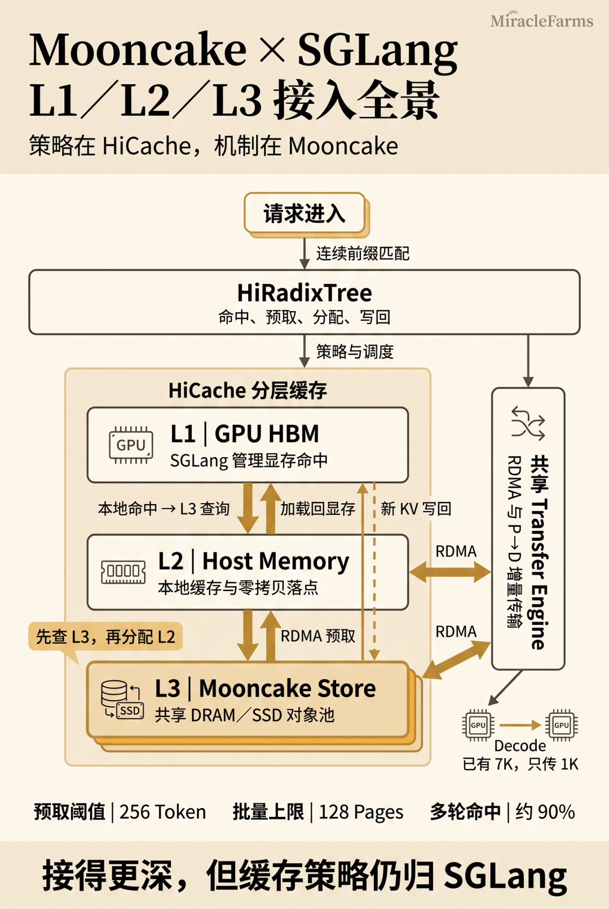
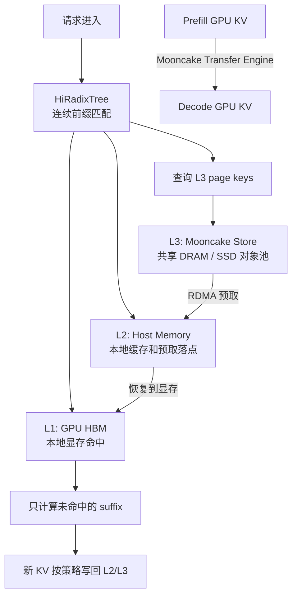
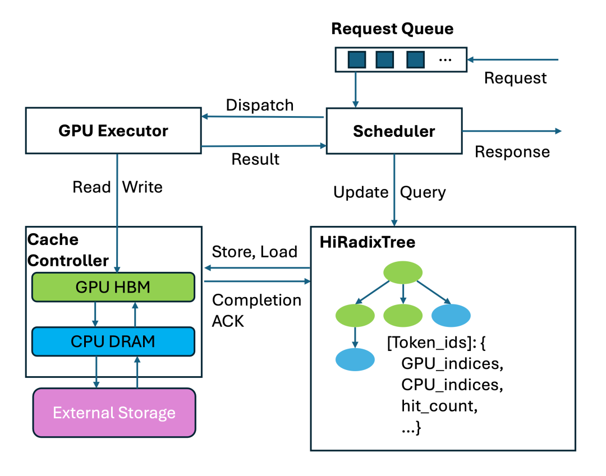
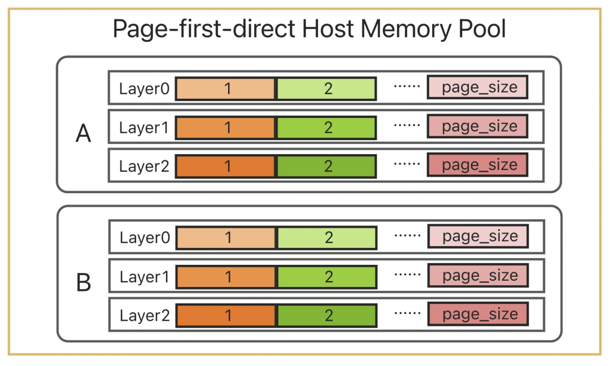
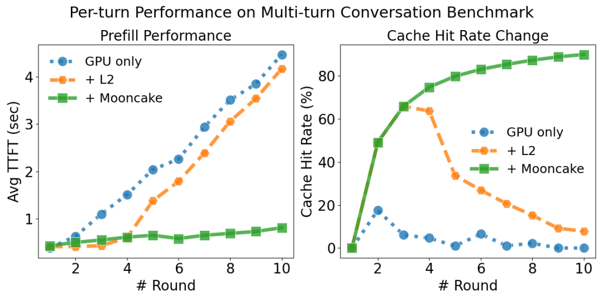

# Mooncake 与 SGLang HiCache 学习文档

本文面向第一次读 Mooncake x SGLang HiCache 资料的同学，整理原文《Mooncake 与 SGLang 的结合点全景：HiCache 的 L1/L2/L3 与 PD 增量传输》的图文内容。本文是基于文章与配图的学习笔记，不做 SGLang / Mooncake 源码级复核。

## 0. 阅读基线与范围

**图文基线**

| 项目 | 内容 |
| --- | --- |
| 原文标题 | Mooncake 与 SGLang 的结合点全景：HiCache 的 L1/L2/L3 与 PD 增量传输 |
| 原文链接 | <https://mp.weixin.qq.com/s/DiwvpbFqXQk0_0PHA904zw> |
| 作者 | Ethan |
| 读取时间 | 2026-07-17 |
| 整理范围 | Mooncake 在 SGLang HiCache 的 L3 backend、PD transfer backend、L1/L2/L3 边界、对象组语义、近期主线变化与性能边界 |
| 不展开内容 | 不逐行审计 SGLang / Mooncake 源码，不验证原文引用 PR 的最新状态 |

**产物假设**

文档以 Markdown 为核心，原文配图下载到 `../images/mooncake-articles/sglang/` 并用相对路径嵌入。图下说明是基于图片内容的二次理解，不复刻原文图注。

**怎么读本文**

每章尽量按四件事展开：

1. 先讲人话：把缓存层级和传输链路翻译成普通语言。
2. 再拆机制：说明谁拥有策略、谁负责搬数据、谁只提供对象存储。
3. 再读图片：解释图里的控制流、数据流和边界。
4. 最后给例子或排障提示：把抽象的 L1/L2/L3 拉回具体请求。

**术语速查**

| 术语 | 人话解释 | 在本文中的重点 |
| --- | --- | --- |
| Mooncake | 面向 KV cache 的分布式存储与传输系统 | 在 SGLang 中同时承担 L3 Store 和 PD Transfer Engine |
| HiCache | SGLang 的分层 KV cache 体系 | 决定命中、预取、恢复、写回、淘汰等策略 |
| HiRadixTree | SGLang 记录本地前缀命中的 radix 树 | 管 L1/L2 本地位置，不持续镜像 L3 全局对象位置 |
| L1 | GPU HBM 中的 KV cache | attention kernel 能直接使用的最热层 |
| L2 | Host memory 中的本地 KV cache | L3 读入和 L1 恢复的落点，由 SGLang 管理容量和布局 |
| L3 | 远端共享 KV 对象池 | Mooncake 的主场，负责跨实例对象查询、读写、复制和 SSD 分层 |
| PD 分离 | Prefill 与 Decode 分集群执行 | Mooncake Transfer Engine 负责 P -> D 的 GPU KV 单边写 |
| 对象组 | 一组有共同生命周期的缓存对象 | 让主 KV 与附属状态一起复制、淘汰和保留 |
| 增量传输 | 只传 decode 侧还没有的 KV suffix | L1/L2/L3 命中长度反向影响 prefill 发送范围 |

---

## 1. 先建立整体地图

### 人话版

SGLang 把 KV cache 分成三层：

- L1 是 GPU HBM，速度最快，也是 attention 真正能直接读的地方。
- L2 是本机 host memory，用来承接本地缓存、远端预取结果和写回缓冲。
- L3 是跨实例共享的远端对象池，Mooncake 在这里是正式 backend。

Mooncake 接得很深，但没有接管 HiCache。可以把二者的分工想成：

- SGLang / HiCache 决定“要不要用这段前缀、等多久、放到哪里、何时写回、何时淘汰”。
- Mooncake 决定“对象是否存在、在哪个 segment、如何 RDMA 读写、如何跨节点共享”。

PD 分离又是另一条线。Prefill 算完 prompt 的 KV 后，Decode 需要接住这些 KV 继续生成。Mooncake Transfer Engine 负责把 prefill 侧 GPU KV 写到 decode 侧注册好的目标地址。它能碰到 GPU buffer，但这不等于它拥有 L1 缓存策略。

### 总览图

### 图意解读

这张图把 SGLang 里的两个 Mooncake 入口放到同一张地图里：

| 区域 | 图里表达的意思 | 谁拥有策略 |
| --- | --- | --- |
| HiRadixTree | 请求进入后先做连续前缀匹配，再驱动命中、预取、分配、写回 | SGLang |
| L1 GPU HBM | 本地显存命中，attention kernel 能直接消费 | SGLang |
| L2 Host Memory | 本地缓存和远端预取落点，也是 L2 -> L1 恢复来源 | SGLang |
| L3 Mooncake Store | 共享 DRAM / SSD 对象池，提供跨实例前缀复用 | Mooncake 搬数据，SGLang 定策略 |
| Transfer Engine | RDMA 和 P -> D 增量传输的数据面 | Mooncake 执行传输，SGLang 决定请求状态 |

图里最重要的一句话是“策略在 HiCache，机制在 Mooncake”。Mooncake 提供 L3 与 RDMA 能力，但命中阈值、批量上限、等待策略和写回策略仍然在 SGLang。

### Mermaid 版控制图

### 小例子

一条 8K prompt 进入 SGLang：

- 前 2K 在 L1 命中，直接用。
- 接着 2K 在 L2 命中，需要搬回 L1。
- 再接着 3K 在 Mooncake L3 命中，需要先 RDMA 到 L2，再恢复到 L1。
- 最后 1K 没命中，才需要 prefill 计算。

如果这是 PD 分离请求，decode 侧知道自己已经能恢复 7K，那么 prefill 只需要把剩下 1K 的 KV 传过去。

---

## 2. HiCache 的请求路径：先问本地树，再问远端 Store

### 人话版

HiCache 不是三套互相独立的 cache，而是一条连续前缀链。请求先沿 HiRadixTree 找本地前缀，再从本地前缀末尾继续向 L3 查询远端 page。远端命中也必须连续：中间第一处 miss 出现后，后面的对象即使存在，也不能算作这次请求的可复用前缀。

请求大致走四步：

1. 在 HiRadixTree 上匹配 L1/L2 本地前缀。
2. 对本地前缀后的 page key 查询 L3。
3. 如果 L3 连续命中超过预取阈值，把远端 page 异步读到 L2。
4. L2 恢复到 L1 后，模型只计算剩余 suffix。

默认 256 token 的预取门槛可以理解成成本闸门。命中太短时，网络 I/O、调度和恢复开销可能比重算还贵。

### 控制流图

### 图意解读

这张图强调 HiCache 的控制权在 SGLang：

- Scheduler 从 Request Queue 取请求，查询或更新 HiRadixTree。
- HiRadixTree 记录 token 前缀和本地 GPU / CPU 索引。
- Cache Controller 负责 GPU HBM、CPU DRAM 和 External Storage 之间的 store/load。
- GPU Executor 只按照调度结果执行，并把结果回给 Scheduler。

Mooncake 对应图里的 External Storage / L3 backend 时，参与的是 store/load 的外部数据路径；但请求何时 dispatch、命中如何截断、结果何时可用，仍由 Scheduler 和 HiRadixTree 组织。

### 机制拆解

| 步骤 | SGLang 做什么 | Mooncake 做什么 |
| --- | --- | --- |
| 本地匹配 | 沿 HiRadixTree 找 L1/L2 前缀 | 不参与 |
| L3 查询 | 生成后续 page key，决定查询范围 | 返回对象是否存在 |
| 预取决策 | 判断命中长度是否过阈值，选择等待策略 | 执行远端读取 |
| L2 落点 | 分配 host KV pool 槽位 | 把数据写到目标 host memory |
| L1 恢复 | 把可用前缀搬回 GPU 并更新状态 | 不决定请求是否 ready |
| 写回 | 决定哪些新 page 写到下层 | 上传 Store 中不存在的对象 |

### 排障提示

如果 L3 查询有命中，但首字延迟没有下降，不能直接说“Mooncake 慢”。需要分段看：

- Store 查询是否返回足够长的连续命中。
- L2 host memory 是否分配成功。
- L3 -> L2 的 RDMA 是否完成。
- L2 -> L1 的恢复是否排队或阻塞。
- Scheduler 是否选择等待完成、按时超时，还是尽力而为。

---

## 3. L1 与 L2：显存策略和 host 布局仍归 SGLang

### 人话版

L1 是 GPU 上的 KV pool。它是最热资源，SGLang 必须自己管理 page 分配、引用计数、锁定和淘汰。MooncakeStore 不持有显存分配器，也不会改写 HiRadixTree。

L2 是 host memory。它离 Mooncake 更近，因为远端读写最终要落到一段本地 host buffer 上；但 L2 的容量、布局、空闲槽位和淘汰仍由 SGLang 管理。

Mooncake 能读写 GPU buffer 的场景主要发生在 PD 分离：Transfer Engine 对 prefill/decode 侧注册的 GPU KV buffer 做 RDMA。这里的“能访问显存”不是“拥有 L1 cache 状态机”。

### Host memory 布局图

### 图意解读

图里展示的是 page-first-direct host memory pool。它的关键不是颜色，而是对象边界：

- 同一个 page 内的多层 KV 被组织成可批量处理的连续区域。
- L2 -> L1 恢复可以按 page 聚合搬运。
- L3 Store 可以把一页 KV 当成连续对象传输。

如果 host memory 按层大数组散开，同一逻辑 page 会被切成很多小片。对 L3 来说，一次大 I/O 会退化成许多小 I/O，RDMA 和对象存储的优势就被打散了。

### 机制拆解

| 层 | 它摸到什么 | 谁管生命周期 | 容易混淆的点 |
| --- | --- | --- | --- |
| L1 GPU HBM | attention kernel 直接读写的 KV page | SGLang | Mooncake PD 能写 GPU buffer，但不管 L1 淘汰 |
| L2 Host Memory | 本地 host KV pool 与 L3 预取落点 | SGLang | Mooncake 写到指针，不等于它分配 host 槽位 |
| L3 Mooncake Store | 分布式对象和远端 segment | Mooncake | Store 内部 SSD 分层对 SGLang 仍只是 L3 backend |

### 小例子

同样是 host memory，语义可能完全不同：

- 本地 L2：某个 SGLang 实例自己的 host cache，服务本机命中和恢复。
- Mooncake embedded Store：多个实例把 host memory 贡献出来，形成分布式共享池。
- Standalone Store：外部 Mooncake client 持有 Store 容量，SGLang 仍需要本地 L2 作为 I/O 落点。

这些模式改变的是 L3 池归谁持有，不改变 SGLang 对 L2 的管理权。

---

## 4. L3 与对象组：Mooncake 的正式主场

### 人话版

L3 是 Mooncake 在 SGLang 里的正式位置。MooncakeStore 把 HiCache 的 page key 映射为远端对象，负责查询、批量读写、复制和可能的 SSD 分层。

但 L3 仍不是一个独立调度器。它只回答对象层面的事实：

- 这个 page 是否存在。
- 对象在哪个 segment。
- RDMA 读写是否完成。
- Store 中是否已有对象，是否需要上传。

HiCache 决定策略：

- 要查询哪段连续前缀。
- 命中多少 token 才值得取。
- L2 空间够不够。
- 要等多久。
- 取回多少 page。
- 新 KV 何时写回。

### 机制拆解

多 TP 场景下，L3 命中不能让不同 rank 得出不同前缀长度。任何一个 rank 少命中一页，整组请求就要在同一连续边界截断。这个约束来自分布式推理的正确性：所有 rank 必须对“哪些 token 已经可复用”达成一致。

对象组语义解决的是另一个问题。传统 KV page 通常只有 K/V 两个对象，但新模型可能还有：

- 滑窗注意力相关状态。
- 状态空间模型隐状态。
- 稀疏索引或 top-k 状态。
- speculative decoding 的 draft KV。

这些附属对象如果和主 KV 分开存取、分开淘汰，就会出现“主 KV 还在，但附属状态丢了”的裂缝。对象组把同一逻辑 page 下的多个物理对象绑成同一个生命周期单元。

### 例子

假设某个逻辑 page 包含：

- 主 attention KV。
- 稀疏索引状态。
- speculative draft KV。

没有对象组时，Store 可能只命中主 KV，调度器以为前缀可复用，但后续模型路径需要的附属状态缺失。对象组让这批对象共享 group id，命中、复制和淘汰都以组为单位讨论，减少半命中的正确性风险。

---

## 5. 最新主线变化：L2 先看实账，PD 传输被削薄

### 5.1 L2 预留从“先押注”变成“看实账”

#### 人话版

旧路径可能先按“理论上可能命中的长度”预留 L2 host memory，再去问 L3。问题是 L3 真实命中可能很短，甚至直接 miss。并发长上下文场景下，这种过早预留会制造瞬时 L2 压力。

新路径更像先查账：

1. 先问 Mooncake 实际连续命中多少 page。
2. 再只为真实命中的 page 分配 L2。
3. 如果 host memory 不够，就把命中裁到页对齐的可分配前缀。
4. 裁完低于预取阈值，则放弃这次远端恢复。

#### 机制拆解

这条变化背后的工程判断是：低层命中带不确定性时，预留时机本身就是容量管理的一部分。过早为“可能命中”锁住 host 页，会把网络和远端对象的不确定性放大成本地内存压力。

### 5.2 Decode 已有前缀反向削薄 Prefill 发送范围

#### 人话版

另一处变化把 HiCache 和 PD transfer 接了起来。Decode 接请求时不只看 L1，还会把本地 L1、L2 和远端 L3 的连续前缀都算进去。它把“我已经有多少前缀”告诉 prefill，prefill 就从这个位置之后开始传 KV。

#### 例子

一条请求有 8K token 前缀：

| Decode 侧位置 | 命中来源 | 累计已有前缀 |
| --- | --- | --- |
| 0K-2K | L1 | 2K |
| 2K-4K | L2 | 4K |
| 4K-7K | L3 预取并恢复 | 7K |
| 7K-8K | 未命中 | 需要 prefill 传 |

如果只看 L1，prefill 会传 6K；如果把 L1/L2/L3 都算进去，prefill 只传 1K。L3 命中不只是省 prefill 计算，还直接减少 P -> D 网络传输。

#### 排障提示

Decode 侧不能把“Mooncake 返回了”直接等同于“attention 可用”。请求 ready 至少要看：

- L3 预取是否完成。
- L2 -> L1 恢复是否完成。
- 显存索引是否覆盖预期前缀。
- PD release / ready 状态是否被 SGLang 调度器确认。

---

## 6. 性能边界：收益来自越过本地容量

### 人话版

Mooncake L3 的收益不是来自“多一层就一定更快”，而是来自工作集越过本地 GPU/host 容量后，远端共享池还能保住可复用前缀。

短上下文、单轮对话、低复用率，或者工作集长期待在本机 L1/L2 内时，L3 的查询、RDMA 和同步可能只是额外开销。长上下文、多轮 Agent、跨实例共享前缀、本地 host 容量见顶时，L3 才更容易把容量优势转成首字延迟和吞吐收益。

### Benchmark 图

### 图意解读

左图看 Avg TTFI，右图看 cache hit rate：

- GPU only 随轮次增加很快失去前缀复用，TTFI 上升。
- 加本地 L2 后前几轮有帮助，但工作集继续增长后命中率下降。
- 加 Mooncake 后，共享 L3 让多轮前缀更稳定地保留下来，命中率持续上升，TTFI 增长更慢。

图里的数值只代表原文引用的特定模型、并发和硬件配置，不能外推为所有部署的固定收益。

### 部署前四问

| 问题 | 为什么重要 |
| --- | --- |
| 可复用前缀会不会跨实例出现？ | 只在本机复用时，本地 L2 可能更简单 |
| 工作集是否经常越过本机 host 容量？ | 不越界时，L3 容量优势用不上 |
| 单次连续命中是否足够长？ | 命中太短可能不值得付网络成本 |
| Host -> GPU 恢复是否跟得上？ | 远端 RDMA 快，不代表 L1 可用也快 |

---

## 7. 一句话总结

SGLang 给 Mooncake 的位置是“更深的 L3 数据面”，不是“外包缓存调度器”：L1/L2 的显存和 host 策略仍归 HiCache，Mooncake 负责远端对象池、RDMA 和 PD 数据搬运；当 L3 命中长度进入 L2 预留和 PD 增量发送决策时，数据面第一次真正反向影响调度链。

## 8. 参考与延伸

- 原文：<https://mp.weixin.qq.com/s/DiwvpbFqXQk0_0PHA904zw>
- 原文作者：Ethan
- 本文图片来自原文页面，已下载到 `../images/mooncake-articles/sglang/`。
- 本文是图文整理和学习笔记，技术结论以原文描述为基础；若用于生产决策，需要再对照 SGLang 与 Mooncake 当前主线源码复核。
