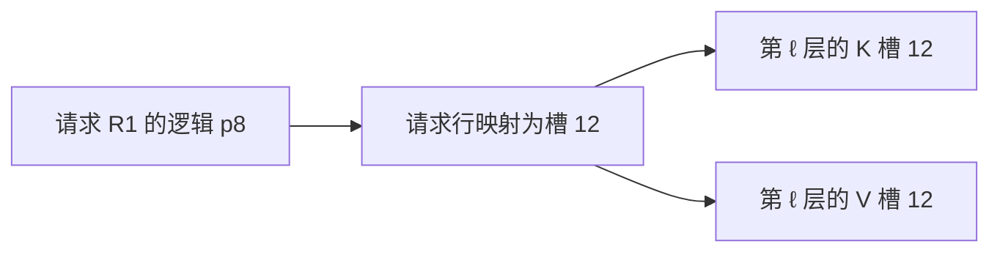
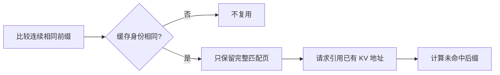
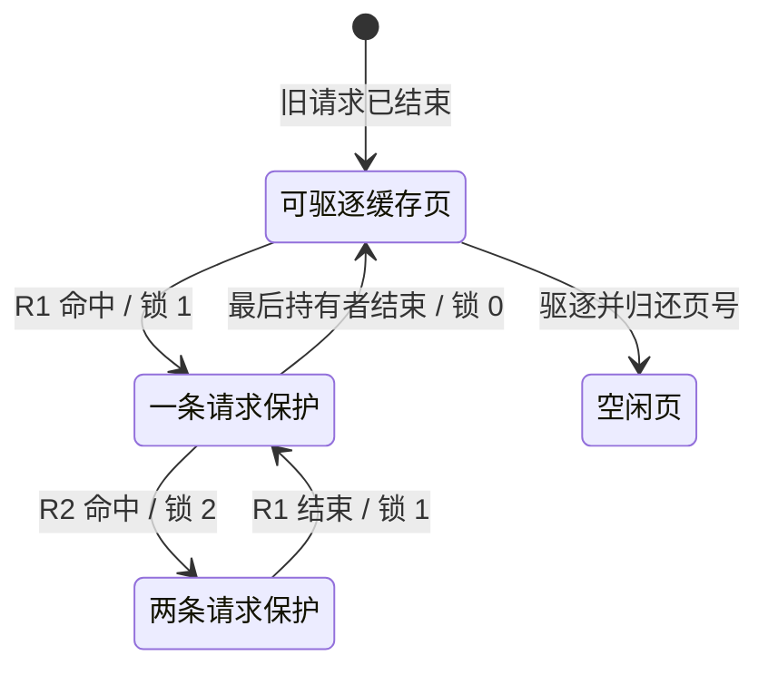

# SGLang KV 映射与共享回收学习文档

一条请求需要连续的历史位置，设备上的 KV 却可以分布在不连续的页中。本篇沿“找到地址 → 续写尾页 → 复用前缀 → 结束与驱逐”解释普通分页 KV 的生命周期。

[交互课程：KV 放在哪里，又在何时回收？](https://asher-xunzhang.github.io/ai-infra-wiki/sglang/kv-memory/) · [本领域路线](README.md)

## 0. 源码基线与范围

本文是源码分析型学习资料，固定选择普通 `RadixCache`、`PagedTokenToKVPoolAllocator` 与普通 MHA 静态 KV buffer 的代表路径。它不是所有模型、启动参数与后端共同经过的唯一实现。

| 项目 | 内容 |
| --- | --- |
| 公开仓库 | [sgl-project/sglang](https://github.com/sgl-project/sglang) |
| 分支与 commit | 公开上游 `main` 快照：[279339f113b79af84f27fd3ac92d0a13bd3f4cbd](https://github.com/sgl-project/sglang/tree/279339f113b79af84f27fd3ac92d0a13bd3f4cbd) |
| 读取时间 | 2026-09-23 |
| 读取与工作区状态 | 从本地 Git 读取固定对象；当前检出分支不是本文基线，存在未跟踪文件，均未修改。 |
| 操作边界 | 只读源码分析、教学模型与网页验证；未运行 SGLang、GPU 或显存实验。 |
| 教学设定 | `page_size=4`，自设 token 标签、页号与请求。普通 token KV，不含 bigram、投机、overlap 或特殊模型状态。 |
| 不展开 | Unified KV / Radix、MLA、SWA、Mamba、HiCache 实现；这些资料保留自己的固定基线。 |

先修：[KV 的计算与复用](https://asher-xunzhang.github.io/ai-infra-wiki/sglang/inference-overview/kv-cache.html)、[普通请求运行时](../runtime/SGLang 普通请求运行时与资源生命周期学习文档.md)。

| 术语 | 本文含义 |
| --- | --- |
| 逻辑位置 `p` | 一条请求历史中的第几个位置，从 0 开始。 |
| 请求行 | `ReqToTokenPool` 为请求保留的映射行，存的是槽号，不是 K/V 数值。 |
| 物理槽 / 页 | 本例 4 个槽组成一页；页号决定槽号范围。页 0 是保留区，不当成普通请求页。 |
| 前缀缓存 | 用 token 与缓存身份查找已有 KV 地址，并管理保护与驱逐。 |
| `lock_ref` | Radix 节点及其祖先上的使用保护计数，不是分配器通用物理引用计数。 |

## 1. 请求保存地址，KV 池保存数值

可以把请求行理解为地址簿：先用请求行与逻辑位置查出物理槽，再到相应模型层的 K/V buffer 读取。连续的是历史顺序，不是物理页号。

图中的 K 和 V 是不同数据；每一层也有自己的内容。同一槽号是跨层定位约定，不代表各层共用同一个 KV 向量。分配器发出可写位置，模型层才把本轮数值写入；“获得地址”不能画成“计算已经完成”。

对应职责：`ReqToTokenPool` 管映射行，分页分配器管理可用页号，`MHATokenToKVPool` 管 buffer 与写入入口，RadixCache 管前缀索引与保护状态。表格行归还不会自动清掉物理 KV。

## 2. 尾页续写：新增 token 数不等于新增页数

页面的初始状态为：R1 已有 6 个计算完成的 KV 位置，逻辑 p0–p3 在页 1 的槽 4–7，p4、p5 在页 7 的槽 28、29。页 7 的槽 30、31 尚未写入，但整页由 R1 持有。页 3 是空闲整页。

这里的箭头解释地址组成；实际 `alloc_extend` 为本轮统一生成输出地址并消耗新页，不是模型每写一个 token 才调用一次分页分配。

新增页数为 `ceil(目标长度 / 4) − ceil(已有长度 / 4)`：

- 6 → 8：新槽 `[30, 31]`，新增 0 页。
- 6 → 9：新槽 `[30, 31, 12]`，新增 1 页。
- 6 → 11：新槽 `[30, 31, 12, 13, 14]`，新增 1 页。

页面将“预留地址”和“写入数值”分步显示，按尾页 / 新页分组方便观察；这种分组不代表实际 GPU kernel 的拆分方式。`available_size()` 按空闲页数乘页大小计数，R1 尾页里的两个空位不算可交给另一条请求的空闲整页。

这一节的“已有 6 个位置”是同一请求已拥有的历史，不能转述为下一节中新请求命中了 6 个缓存位置。

## 3. 整页命中：相同 token 还要满足页与身份条件

设已有缓存为 `A B C D | E F G H`，每条竖线分开一个 4-token 页。新请求有 9 个 token，最后一个 `Z` 保留为未缓存输入；前面与缓存相同的长度可选 3、6、8。

在本例普通分页 Radix 中，字面相同 3 个 → 命中 0 个；相同 6 个 → 命中 4 个；相同 8 个 → 命中 8 个。不足整页的相同尾部仍需计算。源码同时在键处理与匹配长度中保留页边界，不能只看最长字面公共前缀；[`RadixKey.match`](https://github.com/sgl-project/sglang/blob/279339f113b79af84f27fd3ac92d0a13bd3f4cbd/python/sglang/srt/mem_cache/radix_cache.py#L178) 最终将匹配长度向下取整到页大小。

页面可切换 `cache_salt`。它不同，即使 token 相同，也属于不同缓存身份；本例不复用。实际身份还包含 `extra_key` 等条件，本页没有穷举所有请求形态或把 cache_salt 当成完整的安全隔离方案。

命中返回已有槽号。将这些槽号接入新请求映射，不等于复制整份 K/V。Radix 节点拆分中的索引 tensor 切片复制也属于索引维护，不是复制物理 KV buffer。

本例特意保留最后一个未缓存输入；不讨论全部 prompt 已缓存时的输出重建与特殊匹配上限。

## 4. 共享回收：请求结束、可驱逐、空闲是三个时刻

示例开始时，页 2 的 `A B C D` 来自已结束的旧请求，仍在缓存中。R1、R2 分别命中它，各自又计算两个私有尾部位置，分别占页 3、4。两个请求引用同一份页 2，不能将它算成两份物理容量。

R1 结束时发生不同层次的清理：

1. `cache_finished_req` 只处理有效已提交 KV 范围，按页保留整页前缀。本例前 4 个位置已经在缓存，不需要建立第二份。
2. 不足整页的私有尾部对应页 3，归还分配器；缓存保护计数减少。
3. `release_kv_cache` 在缓存与额外尾部处理后归还请求行。

此时 R2 仍持有共享前缀，页 2 的锁为 1；它不属于可驱逐叶节点。一次驱逐尝试不能越过这条保护。R2 结束后私有页 4 与请求行释放，页 2 的锁变为 0，进入可驱逐集合，但可以继续留在缓存中服务后续请求。

只有后来真正驱逐该缓存叶，页 2 才归还分配器。本图只保留一个叶节点，不据此推导真实多节点的驱逐优先级或 LRU 顺序。实际缓存树的保护沿祖先传播。

最后输出 token 与已计算 KV 也可能错位：采样得到了一个 token，不代表已经把它再次送入模型得到自己的 KV。图中“每请求 6 个”始终指已提交 KV 数量。

## 5. 空闲页增加，不等于系统显存下降

普通静态 MHA 池在创建时为各层分配 K/V buffer。上述结束与驱逐主要回收池内的索引和页号，让后续请求重用槽位。它既不要求将所有旧字节清零，也不意味着释放整块设备 buffer。

页面底部固定保留“图中 3 页容量”，同时改变空闲页数量，表达这两种计数的区别。这 3 页只是被画出的子集，不是推导真实服务的总容量。

分层存储是另一个路径：HiCache 可以将副本放在 Host 或外部存储，但再次用于 GPU Attention 时还要准备设备位置并满足回载完成条件。请沿[HiCache L1、L2、L3 与上传回载](HiCache 下 SGLang L1、L2、L3 与上传回载源码学习文档.md)继续；该文保留自己的版本与事件语义，不与本例合并成同一实现。

## 6. 从现象回到对应边界

| 现象 / 问题 | 先检查什么 | 本文不能证明什么 |
| --- | --- | --- |
| 相同 token 却没全部复用 | 页大小、完整匹配长度、cache_salt / extra_key | 没有覆盖特殊模型与全部请求形态。 |
| 只新增几个 token 却需要一整页 | 原尾页是否填满、目标长度是否跨页 | 页数不直接给出真实设备字节数。 |
| 请求结束后 KV 仍占池 | 是否进入前缀缓存、是否还有持有者 | 不能据此认定泄漏。 |
| 驱逐没有回收预期页 | 叶节点资格、lock_ref 与其他子节点 | 不能从单叶演示判断实际驱逐策略收益。 |
| 空闲页增加但显存没降 | 池内容量与 buffer 分配是否被混算 | 未做实际显存测量。 |

## 7. 固定源码阅读入口

路径均相对于公开 SGLang 仓库，链接固定到本文 commit。交互模型另维护逐行核验的同源锚点。

| 行为 | 源码入口 |
| --- | --- |
| 请求映射行与释放 | [`memory_pool.py::ReqToTokenPool`](https://github.com/sgl-project/sglang/blob/279339f113b79af84f27fd3ac92d0a13bd3f4cbd/python/sglang/srt/mem_cache/memory_pool.py#L259) |
| 静态 buffer 分配 | [`MHATokenToKVPool._create_buffers_normal`](https://github.com/sgl-project/sglang/blob/279339f113b79af84f27fd3ac92d0a13bd3f4cbd/python/sglang/srt/mem_cache/memory_pool.py#L2255) |
| 本轮 K/V 写入 | [`MHATokenToKVPool.set_kv_buffer`](https://github.com/sgl-project/sglang/blob/279339f113b79af84f27fd3ac92d0a13bd3f4cbd/python/sglang/srt/mem_cache/memory_pool.py#L2526) |
| 续写地址与新增页 | [`PagedTokenToKVPoolAllocator.alloc_extend`](https://github.com/sgl-project/sglang/blob/279339f113b79af84f27fd3ac92d0a13bd3f4cbd/python/sglang/srt/mem_cache/allocator/paged.py#L183) |
| 空闲容量 | [`available_size`](https://github.com/sgl-project/sglang/blob/279339f113b79af84f27fd3ac92d0a13bd3f4cbd/python/sglang/srt/mem_cache/allocator/paged.py#L147) |
| 按请求片段归还页 | [`free_segment`](https://github.com/sgl-project/sglang/blob/279339f113b79af84f27fd3ac92d0a13bd3f4cbd/python/sglang/srt/mem_cache/allocator/paged.py#L282) |
| 页对齐与身份 | [`RadixKey.page_aligned`](https://github.com/sgl-project/sglang/blob/279339f113b79af84f27fd3ac92d0a13bd3f4cbd/python/sglang/srt/mem_cache/radix_cache.py#L147)、[`child_key_at` 中 cache_salt](https://github.com/sgl-project/sglang/blob/279339f113b79af84f27fd3ac92d0a13bd3f4cbd/python/sglang/srt/mem_cache/radix_cache.py#L245) |
| 返回已有索引与树匹配 | [`RadixCache.match_prefix`](https://github.com/sgl-project/sglang/blob/279339f113b79af84f27fd3ac92d0a13bd3f4cbd/python/sglang/srt/mem_cache/radix_cache.py#L397)、[`_match_prefix_helper`](https://github.com/sgl-project/sglang/blob/279339f113b79af84f27fd3ac92d0a13bd3f4cbd/python/sglang/srt/mem_cache/radix_cache.py#L724) |
| 请求结束的前缀与尾部处理 | [`cache_finished_req`](https://github.com/sgl-project/sglang/blob/279339f113b79af84f27fd3ac92d0a13bd3f4cbd/python/sglang/srt/mem_cache/radix_cache.py#L479) |
| 锁的增减与驱逐资格 | [`inc_lock_ref`](https://github.com/sgl-project/sglang/blob/279339f113b79af84f27fd3ac92d0a13bd3f4cbd/python/sglang/srt/mem_cache/radix_cache.py#L668)、[`dec_lock_ref`](https://github.com/sgl-project/sglang/blob/279339f113b79af84f27fd3ac92d0a13bd3f4cbd/python/sglang/srt/mem_cache/radix_cache.py#L683)、[`_update_leaf_status`](https://github.com/sgl-project/sglang/blob/279339f113b79af84f27fd3ac92d0a13bd3f4cbd/python/sglang/srt/mem_cache/radix_cache.py#L866) |
| 驱逐与页归还 | [`evict`](https://github.com/sgl-project/sglang/blob/279339f113b79af84f27fd3ac92d0a13bd3f4cbd/python/sglang/srt/mem_cache/radix_cache.py#L638) |
| 缓存清理后归还请求行 | [`common.py::release_kv_cache`](https://github.com/sgl-project/sglang/blob/279339f113b79af84f27fd3ac92d0a13bd3f4cbd/python/sglang/srt/mem_cache/common.py#L254) |

## 8. 自测与继续阅读

操作交互前，先预测：6 扩到 8 和 9，各需要几页？相同 6 个 token 为什么不一定命中 6 个？R1 已结束但 R2 活跃时，哪一页可以归还？锁降为 0 后，页号是否已经空闲？

深入资料分别保留自己的基线：

- [请求视图、物理槽位与分配器](../source-study/04-kv-cache/01-请求视图物理槽位与分配器.md)：进一步核对请求行、地址组成与页契约。
- [命中条件与缓存隔离](../source-study/04-kv-cache/03-命中条件与缓存隔离.md)：扩展缓存身份与特殊匹配边界。
- [容量规划、碎片与显存回收](../source-study/04-kv-cache/06-容量规划碎片与显存回收.md)：区分字节预算、池容量与运行时占用。
- [Unified 与混合状态](../source-study/04-kv-cache/04-UnifiedRadix与混合状态组件.md)：不能用普通 token 页寿命替代所有模型状态。
- [调度与批处理](https://asher-xunzhang.github.io/ai-infra-wiki/sglang/inference-overview/scheduling.html)：把页预算连接到本轮准入。
