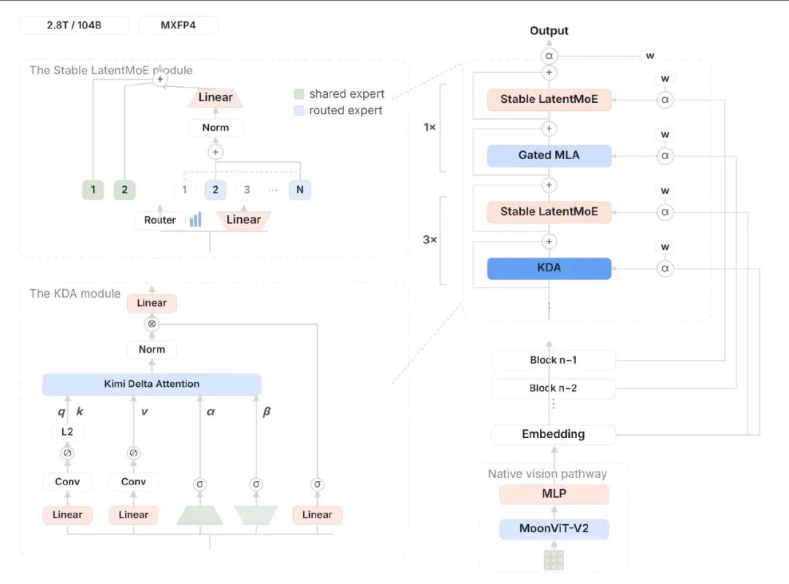
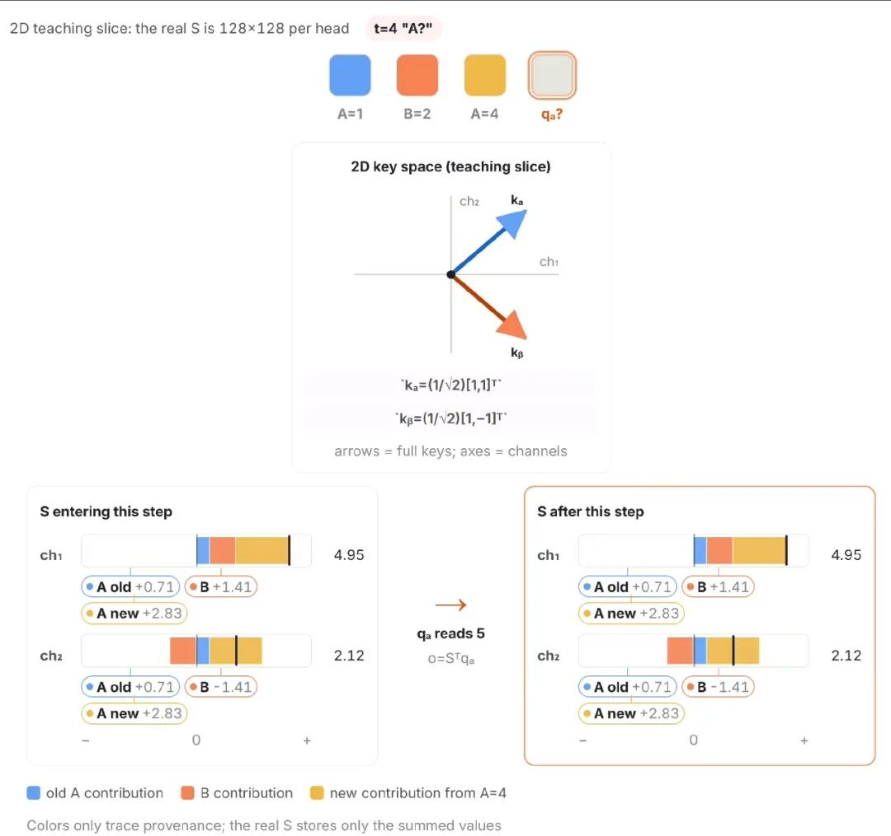
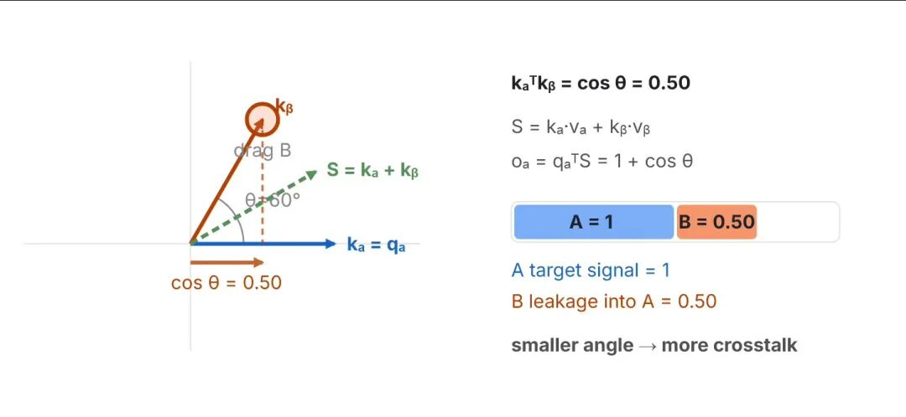
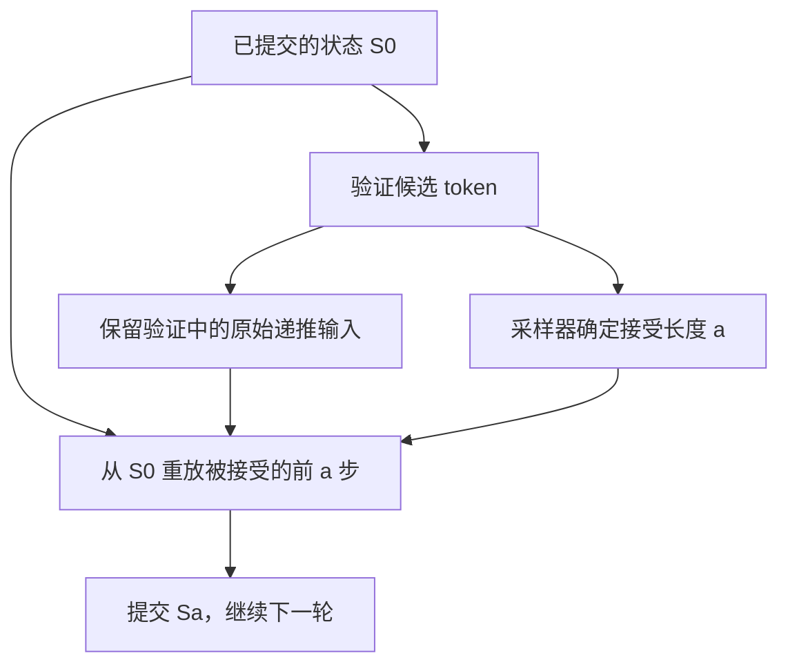
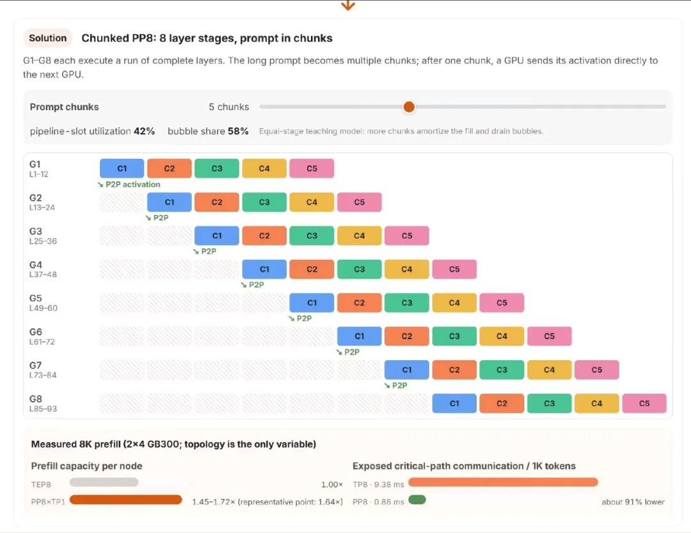
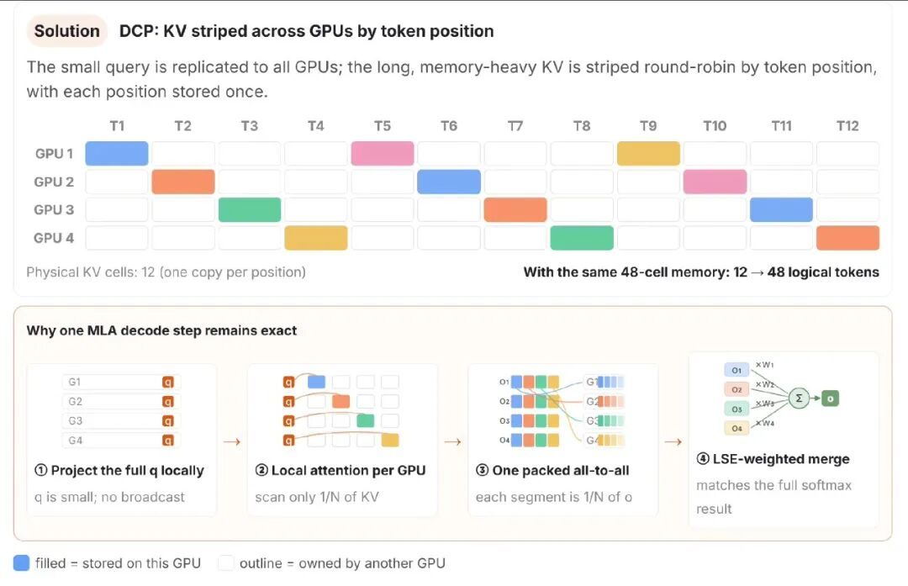
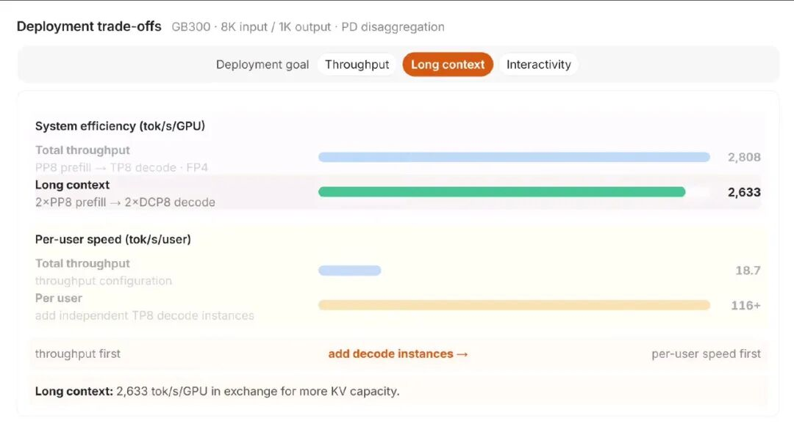

# SGLang Kimi K3 推理协同优化学习文档

Kimi K3 的工程难点不只是权重大：缓存中有可变递推状态，投机解码只能提交被接受的分支，Prefill 与 Decode 又适合不同的并行方式。本篇沿着这些约束，解释缓存、内核、DSpark、PP、DCP 和 Miles 如何配合。

本文是第三方资料整理型学习文档，包含对原文疑点的纠正。没有部署模型、运行 benchmark、执行原文示例或逐行审计 SGLang 源码。

## 0. 阅读基线与范围

| 来源 | 作者 / 账号 | 发布时间 | 整理方式 |
| --- | --- | --- | --- |
| [SGLang 0.5.17：Kimi K3 原生 MXFP4 推理架构解析](https://mp.weixin.qq.com/s/rAEJBvwJVPt7eawrIW6kmQ) | MindLynx / MindLynx开源探索 | 2026-08-18 | 保留主题，核查概念和配置；唯一图片为装饰图，不纳入 |
| [SGLang深度解读Kimi K3：KDA缓存、DSpark投机解码、DCP并行完整拆解](https://mp.weixin.qq.com/s/GUxqBQaH4ItRFQ37NfoYWg) | 未署个人作者 / Aspheer玩AI | 2026-09-01 | 保留全部 6 张技术截图，逐图解释 |
| [SGLang and Miles Add Day-0 Support for Kimi K3](https://www.lmsys.org/blog/2026-07-27-kimi-k3-day0-support/) | SGLang Team | 2026-07-27 | 官方机制与测试条件核对；使用可读取的 LMSYS 入口 |

| 项目 | 内容 |
| --- | --- |
| 读取时间 | 2026-09-09 |
| 整理范围 | 模型结构对推理运行时的影响、MXFP4 边界、投机状态提交、PP/DCP、RL 权重同步 |
| 不展开内容 | 全量部署手册、当前所有硬件支持、完整数学推导和训练配方 |
| 验证边界 | 文章和公开模型配置交叉核对；不能由“Day-0 支持”推断任意 v0.5.17 镜像包含文章所有后续优化 |
| 配图来源 | [原图清单与 SHA256](../../images/sglang-kimi-k3/SOURCES.md)；原截图中的教学状态与测试结果分别说明 |

### 术语速查

| 名称 | 人话解释 |
| --- | --- |
| KDA | Kimi Delta Attention，维护会被更新的递推状态 |
| AttnRes | Attention Residuals，跨深度聚合前面层/块的表示 |
| LatentMoE | 在较低维潜空间执行专家相关计算的 MoE 结构 |
| MXFP4 | 小组共享缩放的 4-bit 浮点权重表示；不意味着所有张量都是 4-bit |
| DSpark | 先提出一组候选 token，再由目标模型验证的投机解码 |
| ReplaySSM | 保存验证所需的输入，在确定接受长度后重放状态递推 |
| PP | 把层分给不同 stage，传递中间激活 |
| DCP | 在 Decode 中沿 token 位置切分 MLA 历史 KV |
| LoRA | 以较小的可训练增量矩阵调整基础模型 |

## 1. 先修正原文里容易带偏的解释

| 第一篇的说法 | 本次处理 | 为什么 |
| --- | --- | --- |
| KDA 是 Kimi Dynamic Attention，以 Top-K 检索历史为核心 | 改为 Kimi Delta Attention | 原图和官方材料描述的是门控递推及 Delta Correction；那段 Top-K 伪代码不能代表 KDA |
| AttnRes 是 Attention Resolution，按远近上下文改变分辨率 | 改为 Attention Residuals | 这里沿模型深度聚合表示，不能等同滑窗或上下文分层摘要 |
| MoE 所有权重必须驻留 HBM，因此本地部署物理上不可能 | 改为“稀疏激活不会自动消除其余权重的存储需求” | 存储可以分布在多 GPU 或其他层级；能否服务还取决于搬运和算力预算 |
| Q4_K_M 约 1612.4 GB 是原生 MXFP4 的显存下限 | 不沿用 | 格式不同；未提供该数字对应的权重清单、精度分布和统计口径 |
| `sgl.Engine(model_path=...)` 是指向云 API 的客户端 | 不作为可运行示例 | 示例没有配置远端服务地址，混淆引擎实例与 HTTP 客户端 |
| 不支持硬件会自动退到 FP8/INT4，配置即可开出全部能力 | 标为未验证，不作为承诺 | 原文未给出对应版本的回退证据；不同权重和内核不能只靠名称互换 |

纠正依据包括[官方 K3 模型介绍](https://www.kimi.com/blog/kimi-k3)、[SGLang 官方文章](https://www.lmsys.org/blog/2026-07-27-kimi-k3-day0-support/)和[公开配置](https://modelscope.cn/models/moonshotai/Kimi-K3/resolve/master/config.json)。这是资料核对，不是执行测试。

公开配置中的 `quantization_config` 使用 `compressed-tensors`，格式为 `mxfp4-pack-quantized`，分组大小 32，且明确列出若干不量化模块。因此 `总参数 × 0.5 字节` 只能作为“全部参数均按 4-bit 存储”的假设算式，不能当成真实权重文件大小或设备显存需求。

## 2. 模型结构怎样变成系统问题



**图意解读：** 右边把 KDA、MLA、LatentMoE 和跨块残差放在同一条深度路径上；左边展开专家与 KDA。缓存管理不能把 93 层全视作同一种 KV。该截图视觉塔标为 MoonViT-V2，官方 SGLang 文字称 MoonViT3d；本篇保留原图，但不以该局部标签确认实际实现类名。

用一条多模态请求理解：视觉处理得到 embeddings，语言模型 Prefill 同时产生 MLA 历史和 KDA 边界状态，之后 Decode 使用这些状态逐步生成。若采用 PD 分离，需要把接收方所需的模型状态传过去；若采用 PP，还要在 stage 之间传中间激活和相应的层间上下文。它们的生命周期不同。

混合缓存的完整机制见[混合注意力缓存与 Mooncake 状态传输](<../../llm-inference/model-architecture/Kimi K3 混合注意力缓存与 Mooncake 状态传输学习文档.md>)。这里抓住三个条件：共享检查点保持稳定、请求更新自己的活动状态、只能从合法边界继续执行。

### 两张教学图该怎样读



**图意解读：** 原图把记忆压成二维教学切片，颜色追踪旧 A、B、新 A 的贡献，真实状态只保存求和后的数值。图中读出 A 得到 5，展示简单累加会混合旧值和新值；它不是证明 KDA 的 Delta 更新也会把 A=4 错读成 5，更不是模型精度测试。



**图意解读：** 这里讨论简化线性记忆：key 夹角为 60°，查询 A 时会读到来自 B 的 0.5 分量。它解释“压进固定状态以后信息会相互干扰”的困难，帮助理解门控和 Delta Correction 的动机。没有展开完整 KDA 公式时，不应把这幅图当作 KDA 算法本身。

## 3. DSpark：验证得更多，不一定走得更快

### 人话版

草稿模型先猜接下来几步，目标模型批量检查。低并发时，多检查几个位置的边际成本可能很小；高并发时，这些位置会挤占其他请求的计算预算。

原文介绍两类优化：利用候选置信度与硬件成本决定验证长度，以及降低 KDA 状态保存/提交成本。整理者把收益关系概括为：

```text
有效生成速度 ≈ 每轮实际推进 token 数 /（草稿 + 验证 + 状态提交 + 调度等待时间）
```

不能只优化 acceptance length。例如候选从 8 个裁到 4 个后，平均接受长度略降，但单轮耗时下降更多，吞吐仍可能上升。反过来，在本来就没有排队的小 batch 下，规划开销可能不划算。

### ReplaySSM 解决的是状态提交

KDA 在验证中会沿候选位置推进状态，但最后可能只接受前 3 个。如果直接把整段候选的末状态写成正式状态，被拒绝的后缀就污染了下一轮。



**图意解读：** 这是根据原文主线整理的逻辑图。它强调“验证过”与“被提交”不同；不把未来可能接受的状态提前作为正式缓存。卷积窗口也有自己的恢复规则，不能只关注一个 recurrent 矩阵。

官方材料补充：ReplaySSM 保存递推输入而非每步完整状态，所举 draft-window scratch 从 512 KB 降到 16 KB；这约 32 倍只属于该临时窗口的口径，不能理解为模型总显存缩小 32 倍。其精确性依赖与验证一致的递推及门值，不能泛化为任意重算都逐位一致。

## 4. 内核优化：先找到真正延长一步的开销

原文报告 batch 1 下常规 Decode 约 113 token/s，加入 DSpark 约 423 token/s。应先把它们读成对应官方配置的结果，而非所有 K3 部署的速度。

**整理者归纳：** 同一个算子变快，可能有两种完全不同的后果：

- 它在关键路径上，后续计算一直等它，减少耗时通常能缩短整步。
- 它已经被另一条更慢的路径覆盖，优化后可能只增加空闲时间。

所以要把融合、减少复制、路由选择、集合通信、算子后端和重叠安排放回同一张 trace 看。MXFP4 是存储/计算格式约束，不能代替对 kernel launch、通信同步和状态搬运的测量。

建议配合[Profiler 与 Trace 学习文档](<../performance-engineering/SGLang Torch Profiler 与 Trace 性能分析学习文档.md>)阅读。

## 5. Prefill 用 PP，Decode 用 DCP：切的是不同对象

### Prefill：长 prompt 拆 chunk，模型按层拆 stage



**图意解读：** 同一 chunk 依次经过 G1–G8；不同 stage 同时处理不同 chunk，stage 间传的是激活。图上“5 chunks、42% 利用率、58% bubble”来自等耗时教学模型；下方 1.45–1.72 倍容量与通信开销比较属于另一个 8K Prefill、2×4 GB300 的实测，不应混成同一个测量。

等耗时、忽略通信时，`m` 个 chunk 经过 `p` 个 stage 的简化占用率约为：

```text
利用率 ≈ m / (m + p - 1)
m=5, p=8 → 5/12 ≈ 41.7%
```

这是解释填充和排空气泡的教学算式。真实 stage 层数、状态处理和通信耗时不等，不能用它准确预测 TTFT。PP8 在低并发下也不保证胜过其他拓扑。

### Decode：让每个 rank 只读取自己拥有的 MLA 历史



**图意解读：** 上半部按 token 位置把 MLA KV 轮转分到 4 个 GPU；下半部先做局部注意力，再交换部分输出和 LSE，以归一化权重合并。它减少的是历史 KV 冗余，没有把模型权重一并减少 4 倍。

KDA 状态不是一列独立历史 token，不能照搬这套位置切分。DCP 缓解 MLA 容量之后，KDA 活动槽位可能成为下一道限制。

两者在 PD 下组合的逻辑是：P 按适合长输入的方式生成状态，D 按自身布局接收并使用。需要适配传输映射；不是把两个启动命令摆在一起就完成兼容性验证。

## 6. 怎样读“每 GPU 2808 token/s”



**图意解读：** 图限定 GB300、8K 输入、1K 输出、PD 分离。吞吐优先的 PP8→TP8 配置为 2808 token/s/GPU；图中的 2×PP8→2×DCP8 长上下文配置为 2633。每用户速度用另一条轴表示，增加独立 Decode 实例会改变吞吐与交互速度的取舍。这些数不是同一配置同时实现的全部收益。

| 原文指标 | 可以得出的认识 | 不能推出的结论 |
| --- | --- | --- |
| 约 113 → 423 token/s | batch 1 的内核与投机协同有明显作用 | 高并发吞吐也固定提升同样倍数 |
| MLA 逻辑容量约 1.5M → 12.2M token | DCP8 能显著减少历史复制的容量压力 | 所有状态和权重占用都除以 8 |
| 2808 token/s/GPU | 对应输入输出和拓扑下的系统效率 | 单用户可达到 2808 token/s |
| AIME 43.3% → 76.7% | 指定 LoRA RL 实验的评测变化 | 所有业务精度提高同样比例 |

本次没有复现这些指标。扩展阅读里的官方博客比短文保留了更多条件，但发布文章本身仍不能替代目标硬件上的验收。

## 7. Miles：同步适配器，也要证明推理确实使用它

### 人话版

基础权重保持原生 MXFP4，训练产生的 LoRA 增量以 BF16 交给推理端。这样不必每轮重传整个模型，也不必每轮重新量化基础权重。

原文报告 64 张 GB300、12 小时数学训练，AIME 2024 贪心评测从 43.3% 到 76.7%。这是特定训练和评测设置，不能外推到任意 LoRA 任务。

**整理者归纳：** 训练与推理协同需要分开验证三件事：适配器字节传到了、当前请求绑定的策略版本正确、推理输出确实随该版本变化。传输成功和哈希一致解决第一件事，不自动解决后两件事。比较同一策略版本下的 log-prob、固定轨迹和训练/rollout 分布差异，才能更接近端到端正确性。

## 8. 读完后应该能回答什么

| 问题 | 抓住的边界 |
| --- | --- |
| 为什么 KDA 不能直接共享一个可写状态？ | 请求分叉以后，原地更新会破坏其他分支 |
| 为什么投机解码不能直接提交最后一个候选状态？ | 只有接受前缀属于正式历史 |
| 为什么 DCP 解决不了所有 KDA 容量问题？ | 递推状态没有可按历史位置切开的轴 |
| 为什么 MXFP4 不等于“所有权重除以四”？ | 量化组、缩放、排除模块和运行时开销都存在 |
| 为什么一篇发布博客不能固定 v0.5.17 的完整能力？ | 页面、PR、镜像与实际后端不是同一个版本证据 |

下一篇建议读 [v0.5.19 功能组合与升级边界](<../version-studies/SGLang v0.5.19 功能组合与升级边界学习文档.md>)，其中 KDA fused-accept 与 ReplaySSM 的关系正好说明“各自优化有效”不意味着能同时启用。
