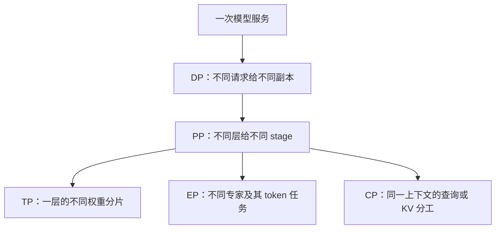
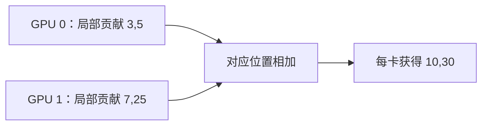
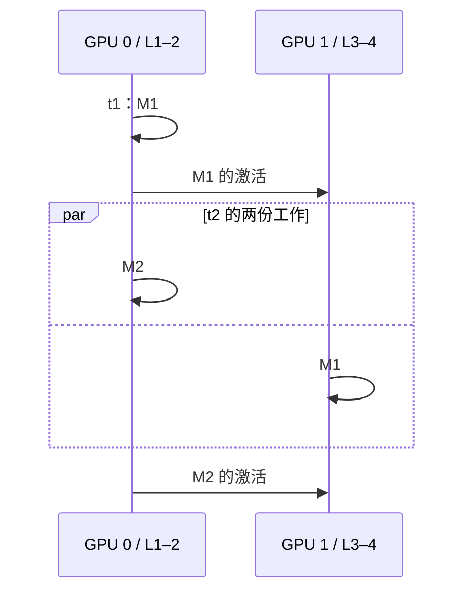
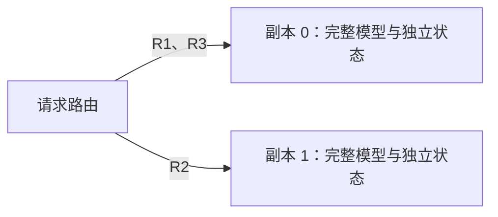
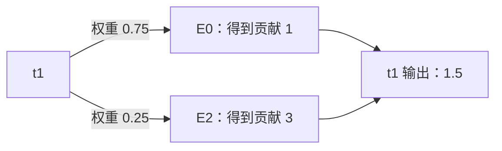
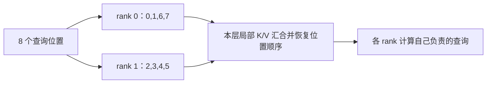

# SGLang 并行分工与执行拓扑

本文是**源码分析型学习资料**。围绕“多张卡究竟切开了什么”解释 TP、PP、普通 DP、EP 与 CP，并把每种分工连接到结果合并、资源归属和进程组。

[在线交互课程](https://asher-xunzhang.github.io/ai-infra-wiki/sglang/parallelism/) 每次只展示一种机制；组合拓扑与源码说明按需展开。[本领域导航](README.md) 提供深入资料。

## 0. 基线与范围

| 项目 | 内容 |
| --- | --- |
| 源码仓库 | [sgl-project/sglang](https://github.com/sgl-project/sglang) |
| 分支与提交 | 公开 `main` 固定快照 `279339f113b79af84f27fd3ac92d0a13bd3f4cbd`；不声称是最新版本 |
| 读取时间 | 2026-09-23 |
| 工作区状态 | 只读取固定 Git 对象；已有未跟踪文件保留，未改动源码工作区 |
| 操作边界 | 源码分析、独立 JavaScript 教学算术和网页验证；未启动 SGLang、初始化通信、运行 GPU 或测量性能 |
| 选择的路径 | 普通 Column / Row 线性层；两级 PP 的依赖模型；健康副本上的普通 DP round-robin；EP dispatch / compute / combine 契约；无前缀的 Zigzag Prefill CP |
| 教学假设 | 无 bias 小矩阵、等长 PP 时隙、标量专家函数、8 个上下文位置；不代表可直接启动的模型配置 |

本篇重新核对固定快照。仓内既有 [并行源码课程](../source-study/README.md) 使用其文首版本，不能把不同版本的 backend、平台和模式支持合并为一份兼容清单。

## 1. 先认清分工对象



这是分类图，不是每次请求都必须经过的五道处理步骤。EP 与 CP 可复用同一个模型并行世界中的 rank；图里的分支不能直接相乘为卡数。

**rank** 是并行进程的编号，**group** 是一组参与通信的 rank。**replica** 是能够完成模型服务的副本；一个副本可以由多个 TP / PP rank 共同组成。一个 rank 的职责还会随层类型改变，不能只用某个参数名称推断所有层的数据布局。[S3][S7]

## 2. TP：拼接不同输出，还是累加同一输出的贡献

### 人话版

让两张卡算一层，可以分配不同的输出，也可以让两张卡分别计算每个输出的一部分。后者即便输出 shape 完整，也还欠一次合并。

### 同一组数，两种分工

页面显示存储权重 `W:[out,in]`，计算 `Y=X×Wᵀ`：

```text
X = [1,2,3,4]
W = [[1,1,1,1],
     [1,2,3,4]]
完整结果 = [10,30]
```

- **Column**：GPU 0 保存 W 的第一行，GPU 1 保存第二行，各得到 `[10]` 和 `[30]`。按输出方向拼接才成为 `[10,30]`。源码名称来自数学权重 `A=Wᵀ` 的列切分；不是 W 存储方向的列。[S1]
- **Row**：GPU 0 保存 W 的前两列并读取 `[1,2]`；GPU 1 保存后两列并读取 `[3,4]`。局部贡献为 `[3,5]`、`[7,25]`；逐位置相加得到 `[10,30]`。拼成四个数会改变语义。[S2]



**图意：** SUM 表示集体操作，不是额外汇总进程。两张卡都参与。页面中的局部输出、合并箭头和结果随步骤出现，切分颜色始终对应同一张卡。

Column 的 `gather_output=False` 会直接交回本地分片；若后续层可以消费，就不必立即收齐。Row 的规约还受 `reduce_results`、`skip_all_reduce`、SP 和融合开关影响；本页只演示选择了普通结果规约的路径，不能读成“每个 Row 调用都执行同一次 All-reduce”。[S1][S2]

## 3. PP：后一级先等激活，再与前一级重叠不同批次

`make_layers` 为本级构造真实层，在其余位置使用占位层。四层、两级的教学模型中，GPU 0 保存 L1–2，GPU 1 保存 L3–4。相同 microbatch 必须经过两个 stage；加入多个 microbatch 后，两个 stage 才能同时处理不同批次。[S4]



**图意：** t1 / t2 是等长教学时隙。在线图将它画成两行时间格：同色 M 必须先出现在上一级，再在后一个时隙进入下一级。单个 microbatch 的依赖没有因为增加卡数消失。

源码通过 PP group 的 tensor 字典传递跨级内容；实际传输细节、异步工作和调度重叠比本图复杂。[S5] 以 Llama 为例，非末级返回的 `PPProxyTensors` 包含 `hidden_states` 与 `residual`，用于下一组层继续计算。[S12] 普通层信息以 PP 的起止层计算有效层数，MHA KV 池再使用该层数和起止层构造；KV 因而属于本级负责的 Attention 层，不是每经过一个 PP stage 都把全部历史 KV 搬到后一级。[S13][S14]P/D 分离则是另一种服务角色与状态交接，另见 [分离部署](../disaggregation/README.md)。

## 4. 普通 DP：选择一个模型副本

普通 DP 启动路径为不同 DP rank 建立各自模型并行组，设备起点按 `TP×PP` 推进。[S6] 两个单卡副本的 round-robin 示例是 R1→副本 0，R2→副本 1，R3→副本 0。图中增加的是对应副本的请求集合，不表示路由瞬间已经完成计算或分配完 KV。



固定源码先检查外部路由，再从活跃且健康的 worker 中选择；图只保留两个健康副本轮流分配的分支。[S8] 普通 DP 不是一层矩阵乘法的分片，也不是请求必然均匀完成的保证；长度、缓存命中和资源压力仍会改变实际负载。

### Attention DP 是另一层分组

`derive_parallel_widths` 在已有 TP 世界内推导 Attention TP 和 MoE TP。忽略 CP 的四-rank 例子中，TP=4、Attention DP=2 得到 Attention TP=2。它描述两个 Attention 请求分组，不等于两个独立完整模型副本。[S7]

页面展开区把 `[0,1]` 与 `[2,3]` 画成同一 TP 世界中的两个子组。切换到 MoE 等不同计算区域时，token 布局可能要重新整理；此图不模拟所有模型的 FFN 数据通路。深入阅读 [DP Attention 源码章节](../source-study/06-parallelism/03-DataParallel与DPAttention.md)。

## 5. EP：token 的专家任务与 HTTP 请求分开计数

模型 gate 为 token 选择专家与权重，dispatcher 把任务安排到执行位置，专家执行后 combine 恢复 token 的结果。固定源码 `forward_impl` 明确依次调用 dispatch、`run_moe_core`、combine。[S9]

页面使用两张卡、四个专家、四个 token、top-k=2，因而共有 8 个 `(token, expert)` 任务。每张卡保存两个完整专家，MoE TP=1。选中一个 token 后，图只突出它的两个专家；其余专家不画多余连线。



**图意：** 数值使用教学函数 `fₑ(t)=t×(e+1)`；0.75×1+0.25×3=1.5，不是实际专家网络输出。带宽、kernel 时间、路由复制与压缩均未模拟。

偏斜开关把同样 8 份任务集中到更少专家上；底部条形只统计逻辑任务数。它说明“专家数量均分”不保证“工作均分”，不声称 task count 与耗时成正比。dispatch 也不必然是 All-to-All：具体 backend 可能在不同的数据预布局下使用不同的本地重排或通信。参见 [EP 与 EPLB](../source-study/06-parallelism/05-MoE专家并行与负载均衡.md)。

## 6. CP：查询个数相等，因果工作量仍可能不同

Zigzag Prefill CP 的元数据将每条序列分成 `2×CP` 段，再把靠前与靠后的段配对。[S10] 8 个位置、CP=2、无已有前缀时：

- 连续切分对照：rank 0 得到位置 0–3，rank 1 得到 4–7。
- Zigzag：rank 0 得到 0、1、6、7，rank 1 得到 2、3、4、5。

因果 Attention 的查询 q 能看 0…q，共 q+1 个位置。在线三角矩阵每个有色格表示一对可见 Q–K 关系；连续切分是 10 / 26 对，Zigzag 是 18 / 18 对。它解释首尾配对的动机，不是 kernel 耗时模型。



**图意：** 本页所选 Zigzag 路径的 `materialize_full_kv` 通过 gather 收齐当前层 K/V，再写入池。[S11] 分摊查询计算不自动意味着每卡永久只保留半份 KV。连续切分仅作工作量对照，不画成这段固定源码的真实布局。

`can_apply` 还检查 CP 大小、token 数、forward mode 和各序列长度。这里不推断所有模型、backend 或每个 batch 都能启用 CP。Decode CP 的 KV 分布与结果合并另读 [Context Parallel 与并行组合](../source-study/06-parallelism/06-ContextParallel与并行组合.md)，不能与本页 Prefill 图混为一条路径。

## 7. 四卡组合与源码定位

TP=2、PP=2 的分组是 TP `[0,1]`、`[2,3]`，PP `[0,2]`、`[1,3]`。[S3] 同级合作一组层，跨级连接相同 TP 坐标。普通 DP 可以在其外复制这样的模型组；Attention DP、CP、EP 则可能在既有 TP 世界内形成不同子组。参数应结合模型支持、backend 与整除条件核对，本文不提供未经运行验证的组合启动命令。

| 现象 / 问题 | 回到哪里核对 |
| --- | --- |
| 输出 shape 正确，数值却少了其他卡贡献 | Row 局部结果与规约责任 [S2] |
| 后级空闲，前级在算 | 本批次激活是否已交接；另查 PP 调度 [S4][S5] |
| 两个副本请求分配不一致 | 活跃集合、健康状态、外部路由与轮询策略 [S8] |
| 专家数平均，任务却偏斜 | token→expert 路由、dispatcher 与专家放置 [S9] |
| 开启 CP 后，KV 没按查询数量同比缩小 | 实际选中策略的 KV 汇合与写入 [S10][S11] |

**固定源码锚点**

| 编号 | 文件 / 函数 |
| --- | --- |
| S1 | `layers/linear.py::ColumnParallelLinear.forward`，L492 |
| S2 | `layers/linear.py::RowParallelLinear.forward`，L1612 |
| S3 | `distributed/parallel_state.py::initialize_model_parallel`，L2507 |
| S4 | `utils/common.py::make_layers`，L1415 |
| S5 | `managers/scheduler_pp_mixin.py::_pp_send_dict_to_next_stage`，L802 |
| S6 | `managers/data_parallel_controller.py::launch_dp_schedulers`，L371 |
| S7 | `runtime_context.py::derive_parallel_widths`，L151 |
| S8 | `managers/data_parallel_controller.py::round_robin_scheduler`，L767 |
| S9 | `layers/moe/ep_moe/layer.py::forward_impl`，L252 |
| S10 | `layers/cp/zigzag.py::build_metadata`，L121；同类 `can_apply`，L109 |
| S11 | `layers/cp/zigzag.py::materialize_full_kv`，L396 |
| S12 | `models/llama.py`，L451–457：非末级返回激活与 residual |
| S13 | `model_executor/model_runner_components/layer_setup.py`，L153–159：PP 有效层范围 |
| S14 | `mem_cache/kv_cache_configurator.py::_build_mha_kv_pool`，L1975：本级 MHA KV 池 |

路径均相对于源码仓库的 `python/sglang/srt/`。脚本 `scripts/test_parallelism.cjs` 可通过 `SGLANG_SOURCE_DIR` 读取固定 Git 对象，核对交互使用的行号与函数；不修改源码仓库。

[S1]: https://github.com/sgl-project/sglang/blob/279339f113b79af84f27fd3ac92d0a13bd3f4cbd/python/sglang/srt/layers/linear.py#L492
[S2]: https://github.com/sgl-project/sglang/blob/279339f113b79af84f27fd3ac92d0a13bd3f4cbd/python/sglang/srt/layers/linear.py#L1612
[S3]: https://github.com/sgl-project/sglang/blob/279339f113b79af84f27fd3ac92d0a13bd3f4cbd/python/sglang/srt/distributed/parallel_state.py#L2507
[S4]: https://github.com/sgl-project/sglang/blob/279339f113b79af84f27fd3ac92d0a13bd3f4cbd/python/sglang/srt/utils/common.py#L1415
[S5]: https://github.com/sgl-project/sglang/blob/279339f113b79af84f27fd3ac92d0a13bd3f4cbd/python/sglang/srt/managers/scheduler_pp_mixin.py#L802
[S6]: https://github.com/sgl-project/sglang/blob/279339f113b79af84f27fd3ac92d0a13bd3f4cbd/python/sglang/srt/managers/data_parallel_controller.py#L371
[S7]: https://github.com/sgl-project/sglang/blob/279339f113b79af84f27fd3ac92d0a13bd3f4cbd/python/sglang/srt/runtime_context.py#L151
[S8]: https://github.com/sgl-project/sglang/blob/279339f113b79af84f27fd3ac92d0a13bd3f4cbd/python/sglang/srt/managers/data_parallel_controller.py#L767
[S9]: https://github.com/sgl-project/sglang/blob/279339f113b79af84f27fd3ac92d0a13bd3f4cbd/python/sglang/srt/layers/moe/ep_moe/layer.py#L252
[S10]: https://github.com/sgl-project/sglang/blob/279339f113b79af84f27fd3ac92d0a13bd3f4cbd/python/sglang/srt/layers/cp/zigzag.py#L121
[S11]: https://github.com/sgl-project/sglang/blob/279339f113b79af84f27fd3ac92d0a13bd3f4cbd/python/sglang/srt/layers/cp/zigzag.py#L396

[S12]: https://github.com/sgl-project/sglang/blob/279339f113b79af84f27fd3ac92d0a13bd3f4cbd/python/sglang/srt/models/llama.py#L451
[S13]: https://github.com/sgl-project/sglang/blob/279339f113b79af84f27fd3ac92d0a13bd3f4cbd/python/sglang/srt/model_executor/model_runner_components/layer_setup.py#L153
[S14]: https://github.com/sgl-project/sglang/blob/279339f113b79af84f27fd3ac92d0a13bd3f4cbd/python/sglang/srt/mem_cache/kv_cache_configurator.py#L1975
