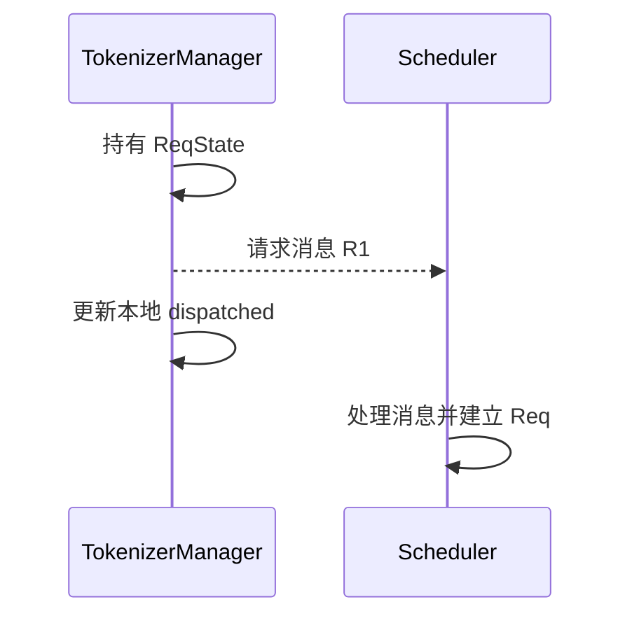
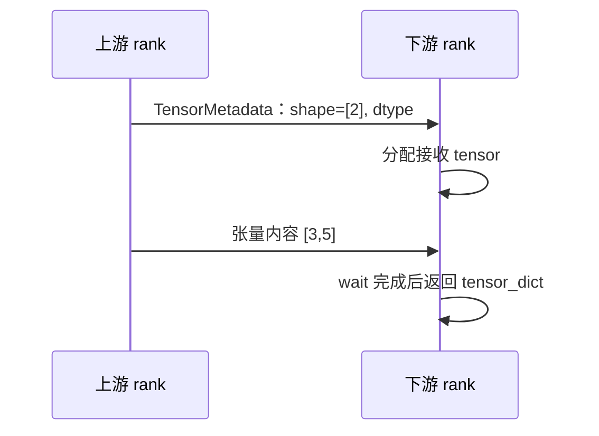
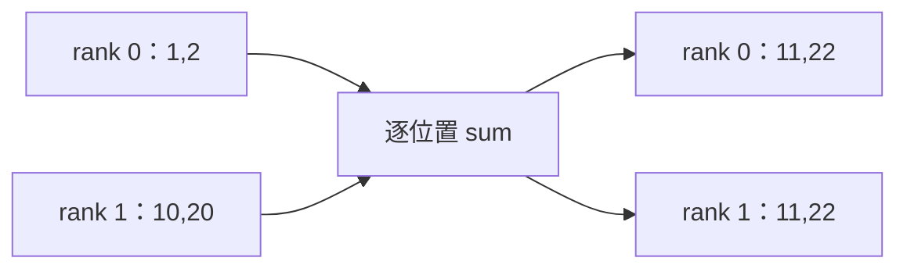
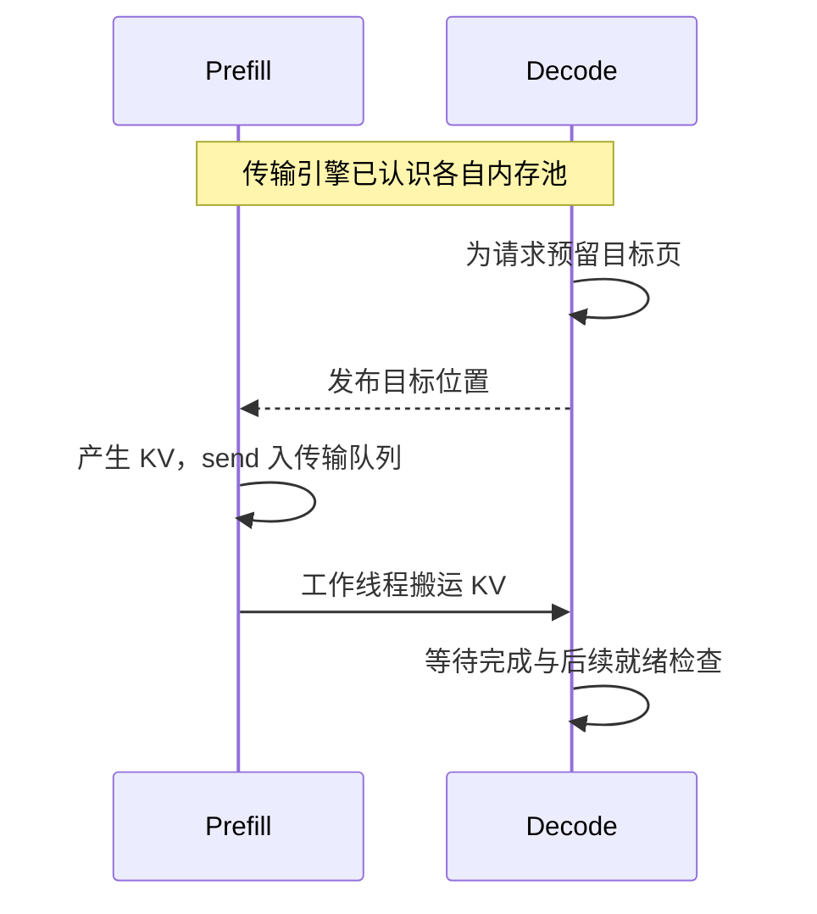
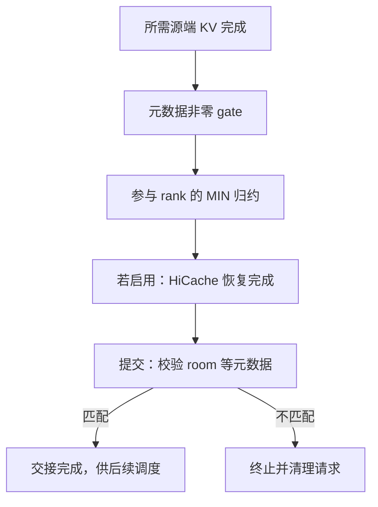
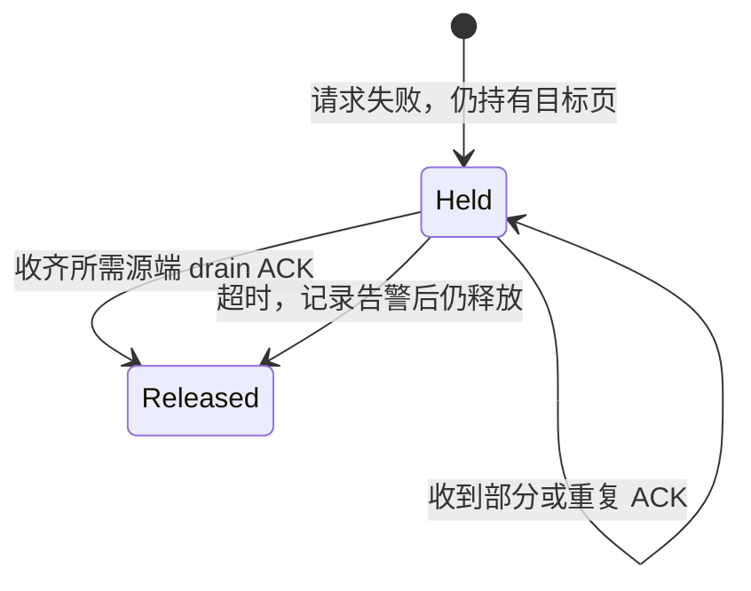

# SGLang 通信与传输机制学习文档

本文沿“发送什么 → 接收需要什么 → 何时可用 → 何时回收”分析 SGLang 通信。先修为[并行分工与执行拓扑](<SGLang 并行分工与执行拓扑学习文档.md>)及[请求运行时](<../runtime/README.md>)。对应 [Pages 交互课程](https://asher-xunzhang.github.io/ai-infra-wiki/sglang/communication/) 含四组独立实验。

## 0. 阅读基线与范围

| 项目 | 内容 |
| --- | --- |
| 类型 | 源码分析型学习资料 |
| 源码仓库 | https://github.com/sgl-project/sglang |
| 分支 | 公开上游 main 的固定快照，不声明为最新 main |
| commit | `279339f113b79af84f27fd3ac92d0a13bd3f4cbd` |
| 读取时间 | 2026-09-23 |
| 工作区状态 | 使用本地已有 Git 对象只读分析；检出分支与分析快照不同，原有未跟踪资料未修改 |
| 操作边界 | 未启动 SGLang、加载模型或运行 GPU / RDMA 通信实验 |
| 范围 | 普通请求派发、张量字典 P2P、三个 collective、Mooncake KV 页映射、Decode 就绪与延迟回收 |

下文箭头表示逻辑依赖，数值、页号、缓冲区基址与完成顺序是教学算例。真实通信算法、时延、设备拓扑和带宽不由这些图推导。已有[传输接口地图](<../source-study/07-disaggregation/04-KV传输接口与后端实现地图.md>)采用独立基线，不能把其历史行为直接并入本文。

| 术语 | 本文中的含义 |
| --- | --- |
| rank / group | 参与通信的进程身份 / 一次通信的成员集合 |
| metadata | 描述形状、类型、位置、请求身份等的信息，不是相应张量或 KV 内容 |
| collective | 一组 rank 共同参与、具有明确输入输出语义的算子 |
| registration | 把一段内存及长度交给传输引擎管理；不是给每条请求分配 KV 页 |
| work | 通信操作句柄；获得句柄与操作完成不同 |
| drain ACK | 源端回报排空的确认；接收侧按源端身份去重，作为延迟回收条件之一 |

## 1. 请求消息：跨进程的是信息，各自持有对象

前端和 Scheduler 要围绕同一请求协调，但不共享同一个 Python 请求对象。`_dispatch_to_scheduler` 调用 `sock_send`；`_send_one_request` 在派发后更新自己的 dispatched 状态。这只能说明发送侧走过对应分支，不能推出 Scheduler 已经接收、排队或执行。[派发入口][ipc]、[前端发送状态][send-request]。

图意：前端的标记与调度侧的处理不是同一事件；图不要求对端处理必然晚于标记，也不增加实际源码中不存在的确认消息。传输层封装或共享内存优化不改变两处对象生命周期的区别。Scheduler 的[请求处理入口][handle]建立对应对象。

**例子：** HTTP 已接受请求，但尚无模型输出。先区分输入处理、派发、调度、执行与结果返回的位置，而不是把它们都称为“网络慢”。本节只画普通生成请求，不展开多模态编码、DP 分发和异常旁路。

## 2. 点对点张量：先有形状，才能接住内容

所选 `send_tensor_dict` / `recv_tensor_dict` 路径把字典拆成元数据与张量。元数据先告诉接收侧需要分配的 shape、dtype、device；后者再分配 tensor、接收内容并等待 work 完成。[发送][send]、[接收][receive]。

图意：分配了两个元素的空间，并不等于其中已有可用的 `[3,5]`。示例只有一个张量、两个 rank，不包含可选 send-allgather 优化。实际实现分别使用 CPU 元数据组与按张量设备选择的进程组。

异步发送会把 work 与 payload 一起放入 `P2PWork`，保留张量引用；不能把 isend 返回当成接收方已经可读。图中的发送与等待是选定接口的语义，不声称所有后端都用同一种拷贝算法。

## 3. Collective：算子决定每张卡最后得到什么

同样两个 rank，都可能互相交换数据，但求和、拼接、按目的地分发不能替代。

图意：All-reduce 合并同一输出的局部贡献。All-gather 则沿选定维度收齐分片，本例两边都得到 `[1,2,10,20]`，没有相加。两者对应不同的数据布局需求。[all_reduce][reduce]、[all_gather][gather]。

All-to-all 的教学输入为 rank 0 的 `[A0,B0]`、rank 1 的 `[A1,B1]`。字母代表目的地，数字代表来源；rank 0 收到 `[A0,A1]`，rank 1 收到 `[B0,B1]`。每个元素保有一个目的地，元素总数守恒。这里选择等长分片，仅解释 [all_to_all_single][exchange] 的交换语义，不代表所有 EP dispatcher 都走此接口。

**自测：** 切换交互算子前，先写出每个 rank 的结果。不能只凭形状相同推断结果已经完整；Row TP 的局部贡献就可能与最终结果同形。

## 4. KV 搬运：先约定位置，再把内容写进去

### 注册池、预留页与请求完成是不同动作

SGLang 的 Mooncake manager 将可注册区域的指针与长度交给引擎；D 的 receiver 用控制消息发送目标 KV 索引、辅助信息等。发送这些位置并不意味着 KV 数据已经到达。[内存注册][register]、[目标元数据][metadata]。

图意：池注册使某段内存可用于引擎操作；请求的页分配与生命周期仍由上层管理。`MooncakeKVSender.send` 调用 `add_transfer_request`，后者把 `TransferKVChunk` 放入工作队列；入队不是写入完成。[传输队列][queue]。

### 页号不必相同，连续性必须两边同时成立

只画一层的 K buffer：每页 `4 token × 1 head × 2 dimensions × 2 bytes = 16 B`。逻辑 KV 段 A/B/C 在 P 的物理页 `[7,8,12]`，D 给它们预留 `[3,4,9]`。假设基址分别是 1000、2000：

- A：`1000+7×16=1112` → `2000+3×16=2048`。
- B：`1128` → `2064`。与 A 在源、目标两端都相邻，因此可合为 32 B。
- C：`1192` → `2144`，另外传 16 B。

这是 2 个传输段、共 48 B，并非整个模型 KV 的字节数。V、其他层、并行切片与 staging 均未画入。地址加法是帮助理解的教学简化；真实实现根据 buffer、层与配置建立传输计划。[KV 计划构造][kv-plan]。

打散 D 的位置为 `[3,9,4]` 后，逻辑 A/B/C 仍相同，A/B 却不再能合并，变成 3 段。`group_concurrent_contiguous` 在源或目标任一侧相邻差不为 1 时切段；只看 P 连续还不够。[连续分组][blocks]。

**排查方向：** 页已分配不证明位置已发布；消息已发出不证明 worker 已搬运；页内看见部分内容不证明所有源端已完成。应逐层确认所观察的是哪个事件，不能把传输等待桶直接当作原始拷贝耗时。

## 5. Decode 就绪：几个条件在这里汇合

本节换用两个可能贡献数据的源端，与上一节单源算例独立。receiver 对成功通知按源端 rank 去重，收齐 expected 数量后才推进；一个源端重复通知两次仍只有一个。[完成计数][success]。

图意：箭头是依赖关系，不表示现实中每件事都要串行等待。某些元数据或缓存恢复可以先完成，交互页选择一种便于观察的事件顺序。

`_apply_metadata_gate` 仅检查元数据区的 bootstrap_room 非零，不在这里验证它等于期望 room；未到达则把 Success 保持为 Transferring。`poll_and_all_reduce` 再归约各参与 rank 的 poll，以免单 rank 提前提交。[元数据 gate 与归约][gate]。

在 `pop_transferred` 中，开启 Decode HiCache 时若恢复仍 PENDING，继续等待。之后 `_commit_transfer_to_req` 校验实际 room，0 或不匹配会中止。只有未被标成 FINISH_ABORT 的请求才追加到 transferred 列表。[提交检查][commit]、[交接队列出口][ready]。

## 6. 失败回收：结束请求不等于马上复用页

本图选择已启用延迟回收、后端支持该功能、且 abort 已通知的 Decode 发起失败分支。其他条件下的释放路径另有处理，不能推广成所有请求取消都这样执行。

图意：release-safe 判断按源端身份集合计数。重复 ACK 不能提前释放。`resolve_deferred_releases` 同时有超时出口；这个固定版本会在未收齐 ACK 时记录告警并释放，所以“槽位释放”不能被画成“已经证明所有远端写入排空”。[延迟释放与超时][release]。

本课只核对接收侧使用 ACK 的条件，不将它升级为已经完成 DMA 安全性实验的结论。

## 7. 传输层与下一步

同机 / 跨机是放置方式，P2P / collective 是参与方式，TCP / RDMA 是底层传输选择。它们不一一对应。SGLang 的 [Mooncake wrapper][engine] 负责注册与传入 transport 配置，代码包含默认 RDMA、TCP 等配置路径；本文不验证外部 Mooncake 版本的内部实现或硬件支持。

继续阅读：

- [并行专题](<README.md>)：把通信算子放回 TP、PP、EP 等分工中。
- [分离部署与状态交接](<../disaggregation/README.md>)：把传输完成放回请求全生命周期。
- [请求、调度与执行主链](<../runtime/README.md>)：区分等待队列、执行与输出。

## 8. 源码锚点

以下链接全部固定到上述公开提交，路径均相对上游仓库。

- [ipc · `managers/tokenizer_manager.py` L601][ipc]
- [send-request · `managers/tokenizer_manager.py` L1592][send-request]
- [handle · `managers/scheduler.py` L2740][handle]
- [send · `distributed/parallel_state.py` L1744][send]
- [receive · `distributed/parallel_state.py` L1799][receive]
- [reduce · `distributed/parallel_state.py` L655][reduce]
- [gather · `distributed/parallel_state.py` L1326][gather]
- [exchange · `distributed/parallel_state.py` L1171][exchange]
- [register · `disaggregation/mooncake/conn.py` L325][register]
- [metadata · `disaggregation/mooncake/conn.py` L2706][metadata]
- [queue · `disaggregation/mooncake/conn.py` L2385][queue]
- [kv-plan · `disaggregation/mooncake/conn.py` L650][kv-plan]
- [blocks · `disaggregation/common/utils.py` L111][blocks]
- [success · `disaggregation/common/conn.py` L569][success]
- [gate · `disaggregation/utils.py` L212][gate]
- [commit · `disaggregation/decode.py` L2158][commit]
- [ready · `disaggregation/decode.py` L2364][ready]
- [release · `disaggregation/decode.py` L2525][release]
- [engine · `distributed/device_communicators/mooncake_transfer_engine.py` L110][engine]

[ipc]: https://github.com/sgl-project/sglang/blob/279339f113b79af84f27fd3ac92d0a13bd3f4cbd/python/sglang/srt/managers/tokenizer_manager.py#L601
[send-request]: https://github.com/sgl-project/sglang/blob/279339f113b79af84f27fd3ac92d0a13bd3f4cbd/python/sglang/srt/managers/tokenizer_manager.py#L1592
[handle]: https://github.com/sgl-project/sglang/blob/279339f113b79af84f27fd3ac92d0a13bd3f4cbd/python/sglang/srt/managers/scheduler.py#L2740
[send]: https://github.com/sgl-project/sglang/blob/279339f113b79af84f27fd3ac92d0a13bd3f4cbd/python/sglang/srt/distributed/parallel_state.py#L1744
[receive]: https://github.com/sgl-project/sglang/blob/279339f113b79af84f27fd3ac92d0a13bd3f4cbd/python/sglang/srt/distributed/parallel_state.py#L1799
[reduce]: https://github.com/sgl-project/sglang/blob/279339f113b79af84f27fd3ac92d0a13bd3f4cbd/python/sglang/srt/distributed/parallel_state.py#L655
[gather]: https://github.com/sgl-project/sglang/blob/279339f113b79af84f27fd3ac92d0a13bd3f4cbd/python/sglang/srt/distributed/parallel_state.py#L1326
[exchange]: https://github.com/sgl-project/sglang/blob/279339f113b79af84f27fd3ac92d0a13bd3f4cbd/python/sglang/srt/distributed/parallel_state.py#L1171
[register]: https://github.com/sgl-project/sglang/blob/279339f113b79af84f27fd3ac92d0a13bd3f4cbd/python/sglang/srt/disaggregation/mooncake/conn.py#L325
[metadata]: https://github.com/sgl-project/sglang/blob/279339f113b79af84f27fd3ac92d0a13bd3f4cbd/python/sglang/srt/disaggregation/mooncake/conn.py#L2706
[queue]: https://github.com/sgl-project/sglang/blob/279339f113b79af84f27fd3ac92d0a13bd3f4cbd/python/sglang/srt/disaggregation/mooncake/conn.py#L2385
[kv-plan]: https://github.com/sgl-project/sglang/blob/279339f113b79af84f27fd3ac92d0a13bd3f4cbd/python/sglang/srt/disaggregation/mooncake/conn.py#L650
[blocks]: https://github.com/sgl-project/sglang/blob/279339f113b79af84f27fd3ac92d0a13bd3f4cbd/python/sglang/srt/disaggregation/common/utils.py#L111
[success]: https://github.com/sgl-project/sglang/blob/279339f113b79af84f27fd3ac92d0a13bd3f4cbd/python/sglang/srt/disaggregation/common/conn.py#L569
[gate]: https://github.com/sgl-project/sglang/blob/279339f113b79af84f27fd3ac92d0a13bd3f4cbd/python/sglang/srt/disaggregation/utils.py#L212
[commit]: https://github.com/sgl-project/sglang/blob/279339f113b79af84f27fd3ac92d0a13bd3f4cbd/python/sglang/srt/disaggregation/decode.py#L2158
[ready]: https://github.com/sgl-project/sglang/blob/279339f113b79af84f27fd3ac92d0a13bd3f4cbd/python/sglang/srt/disaggregation/decode.py#L2364
[release]: https://github.com/sgl-project/sglang/blob/279339f113b79af84f27fd3ac92d0a13bd3f4cbd/python/sglang/srt/disaggregation/decode.py#L2525
[engine]: https://github.com/sgl-project/sglang/blob/279339f113b79af84f27fd3ac92d0a13bd3f4cbd/python/sglang/srt/distributed/device_communicators/mooncake_transfer_engine.py#L110
