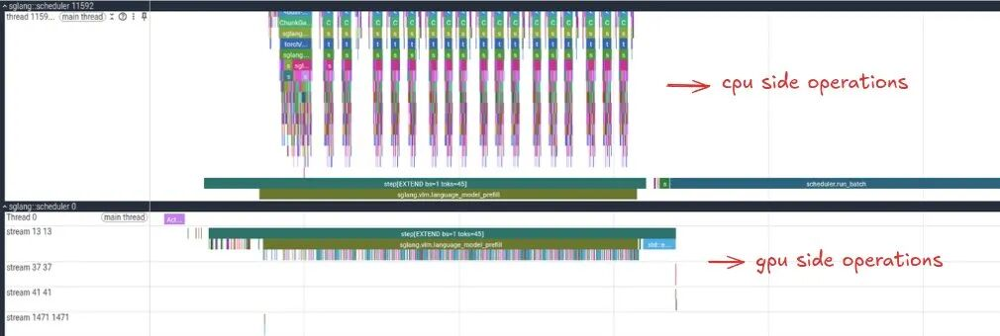
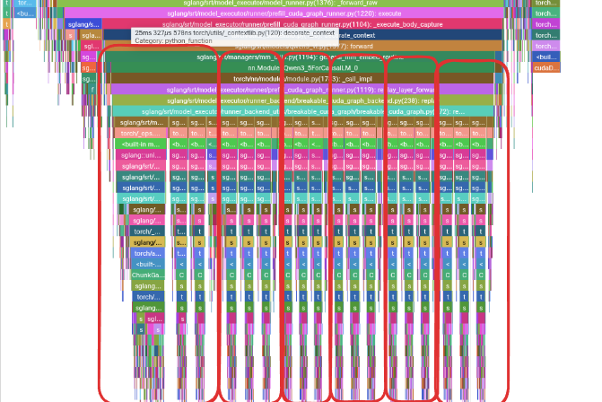
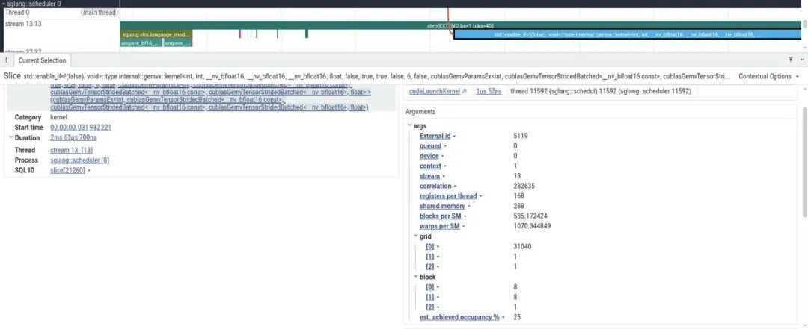
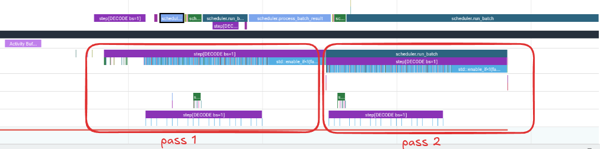
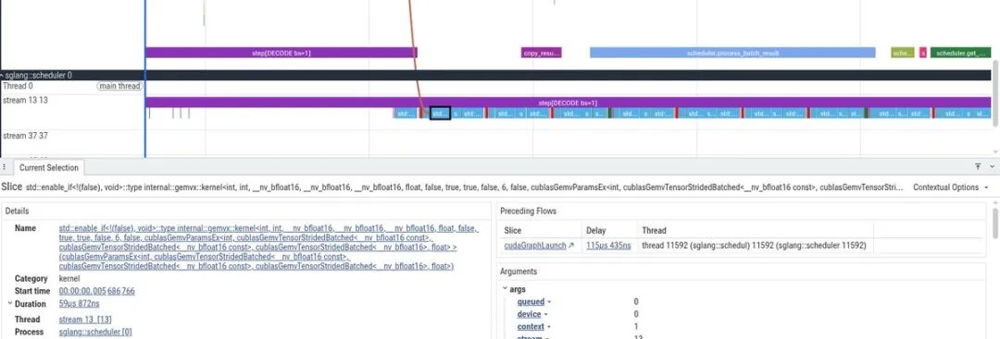
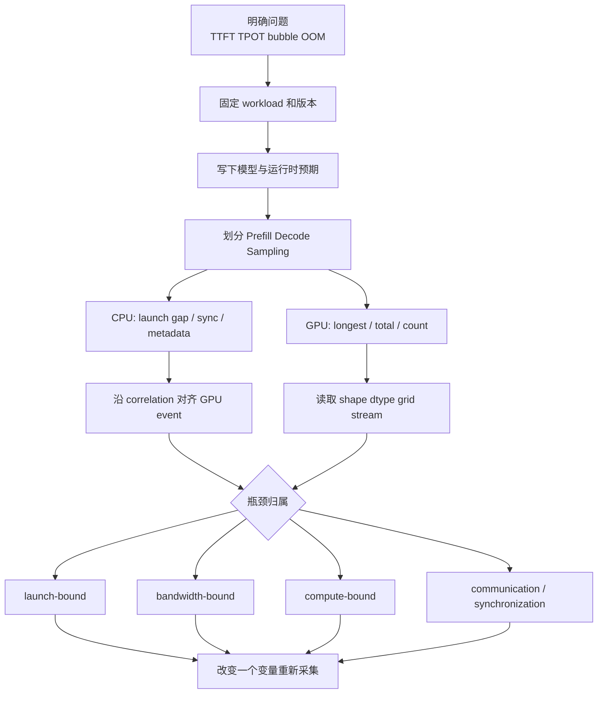

# SGLang Torch Profiler 与 Trace 性能分析学习文档

本文面向第一次打开 SGLang Torch Profiler/Perfetto trace、面对满屏彩色条不知道从哪里读起的同学。目标不是记住某个 kernel 名，而是建立一套可迁移顺序：先用模型结构做预判，再分开 CPU launch 与 GPU execution，最后用张量 shape 和调用次数判断瓶颈属于调度、通信、计算还是带宽。

本文是第三方资料整理型学习资料，不是 SGLang profiling API 的当前版本手册，也没有复现实验。

## 0. 阅读基线与范围

| 项目 | 内容 |
| --- | --- |
| 原文标题 | 《Torch Profiler在Trace里分析性能瓶颈: 剖析SGLang LLM推理》 |
| 原文链接 | <https://mp.weixin.qq.com/s/HPaDwcT_4Rw5ty7LwDG4Ng> |
| 作者/机构 | AI圈的9527 |
| 发布时间 | 2026-08-12 |
| 读取时间 | 2026-08-25 |
| 资料类型 | 单请求性能 Trace 图解 |
| 原文环境 | Qwen3.5-0.8B、单张 NVIDIA L4、BF16、batch size 1；原文 prompt 为 45 tokens，并捕获两个 Decode steps |
| 整理范围 | profiling 边界、CPU/GPU 时间线、Prefill 重复结构、词表投影、Decode GEMV、带宽直觉 |
| 不展开内容 | Nsight Systems/Compute、生产压测统计、SGLang 当前版本完整 profiling 参数 |
| 验证边界 | 只整理原文 trace；未获得原始 trace 文件，无法重新聚合 event；截图中的时长与 kernel 只适用于原文环境 |

### 术语速查

| 术语 | 人话解释 | Trace 中看什么 |
| --- | --- | --- |
| CPU launch | CPU 向某个 stream 提交 kernel/拷贝 | launch 间是否有 gap、是否被同步阻塞 |
| GPU execution | kernel 真正在 GPU stream 上执行 | 哪些 kernel 长、是否串行、是否有空洞 |
| Correlation flow | CPU op 与它发起的 GPU event 的关联线 | “谁启动了谁” |
| GEMM | 矩阵乘矩阵 | batch/token 较大时较容易吃满计算单元 |
| GEMV | 矩阵乘向量/极瘦矩阵 | 常受权重读取带宽限制 |
| CUDA Graph replay | 整体回放已捕获 kernel 序列 | CPU 层不再逐层展开 Python 调用 |
| Roofline | 用 FLOPs 与内存带宽判断上限 | 先猜 compute-bound 还是 bandwidth-bound |

## 1. 不要从最宽的彩色条开始

### 推荐阅读顺序

1. 固定一次请求、模型、batch、prompt 长度和捕获步数。
2. 先写下模型层布局，预测会出现多少组重复结构。
3. 在全局图中圈出 Prefill、Decode、采样与 profiler 开关边界。
4. 先读 CPU launch，再沿 correlation 跳到 GPU kernel。
5. 在 GPU 侧分“最长单次”“累计最长”“调用次数最多”。
6. 点击关键 op 查看 shape、dtype、grid/block 和 stream。
7. 最后才下结论，并换 batch/长度做对照。



**图意解读：** 上方是 CPU 侧调度和调用栈，下方是 GPU streams。CUDA launch 异步，因此 CPU 彩条结束不代表 GPU kernel 同时结束；要沿关联线确认实际执行。该截图只显示单次原文请求，不代表稳态吞吐。

### 四张先验地图

打开 trace 前至少准备：

| 地图 | 需要知道 |
| --- | --- |
| 模型层地图 | layer 数、Attention/SSM/GDN/MoE 的重复方式 |
| 请求地图 | Prefill tokens、Decode steps、batch、是否命中 prefix |
| Runtime 地图 | eager/overlap/CUDA Graph、Attention backend |
| 硬件地图 | 峰值带宽、算力、互联、dtype |

没有这些先验，只凭颜色和 kernel 名很容易把初始化、采样或 profiler 自身开销当成模型瓶颈。

## 2. 原文工作负载的预判

原文给出的 Qwen3.5-0.8B 关键信息是：

- 约 0.8B parameters；
- hidden size 1024；
- vocabulary 约 248K；
- 24 layers；
- 以多组 Gated DeltaNet + FFN 和周期性全 Attention + FFN 组成混合层结构；
- BF16 权重近似 1.6 GB。

对 batch size 1 Decode，可以先做非常粗的带宽上限：

```text
L4 memory bandwidth ≈ 300 GB/s
BF16 weights        ≈   1.6 GB/token
ideal upper bound   ≈ 300 / 1.6 ≈ 187 tokens/s
```

这是忽略 KV、激活、访存效率和其他 kernel 的理论上限，只用于判断方向：batch=1 时每个 token 都要扫大量权重，算术强度低，Decode 更可能 bandwidth-bound。

## 3. Profile 边界：先把要回答的问题缩小

原文通过 SGLang profiling endpoint 开始采集，再发送一个 serving benchmark 请求。文章只展示了类似下面的片段，没有给出完整请求体和目标版本参数：

```bash
curl -X POST http://127.0.0.1:30000/start_profile \
  -H 'Content-Type: application/json'

python -m sglang.bench_serving \
  --backend sglang \
  --num-prompts 1
```

不要把这两行当成当前版本可直接复制的完整命令。真正复现时要确认目标版本 profiling API、warmup/active step 设置、输出路径和停止条件。

### 为什么 warmup 和捕获步数重要

- 不 warmup：JIT、CUDA context、lazy allocation 和 graph capture 污染结果。
- 捕获太多：trace 巨大，单步边界难辨。
- 只捕获一个 Decode step：不容易看迭代间 gap 和稳定性。
- Prefill 与 Decode 混在一个超大视图：两种 workload 的瓶颈被平均掉。

原文设置先等待 5 steps，再采集 2 steps，目的是得到两个相邻 Decode pass 进行比较。

## 4. Prefill：用重复峰值反推模型结构



**图意解读：** 红框圈出重复出现的计算组。重复形状不是随机噪声，而应与模型中 GDN/FFN 和全 Attention/FFN 的周期对应。第一组更宽可能包含初始化、索引或一次性准备，不能用它代表所有层的稳态成本。

### 读法

```text
先看：重复组数是否与模型层配置一致
再看：组内哪类块周期性变小或变大
再点：关键 GPU kernel 核对 GDN / Attention / FFN
最后：统计 total、count、avg，而不是只看一次截图宽度
```

原文在 GDN 路径中看到 causal conv、QKV split、gating、chunked delta rule、normalization 等 kernel；周期性较小块使用 FlashInfer 全 Attention。由于 prompt 只有 45 tokens，全 Attention 在这个实验里不是主瓶颈。换成 32K prompt 后，这个结论完全可能改变。

### 一次性准备与模型计算要分开

左侧小峰值包含 profiler 启动、batch 构造、stream 设置和小 H2D copy。小拷贝可能只是 token IDs 或 metadata；没有读到 tensor shape 前，不应仅凭截图命名其内容。

## 5. Prefill 末尾：巨型词表投影

原文在层堆叠后看到一次 `aten::mm`，概念 shape 为：

```text
[1, 1024] @ [1024, 248320] -> [1, 248320]
```

虽然它在该 Prefill 只运行一次，但因为 batch/token 维度极瘦、词表巨大，表现为昂贵 GEMV。



**图意解读：** kernel grid 第一维为 31040，对应原文解释的 `248320 / 8`。shape 与 grid 的对应关系比 kernel 名更可靠：它说明 kernel 正在遍历巨大词表输出。是否值得融合或替换，还要看累计占比和正确性约束。

### 为什么不能只优化最慢单个 kernel

一次 2 ms kernel 很显眼，但端到端收益取决于：

```text
单次耗时 × 调用次数 / 总请求时长
```

若另一个 80 μs kernel 调用数百次，累计可能更大。Trace 阅读必须同时看 total、count、average 和关键路径是否可重叠。

## 6. Decode：CUDA Graph 会改变 CPU 视图



**图意解读：** 两个红框是连续 Decode passes。周围还包含 profiler start/stop、batch 准备、同步与结果处理。比较两步可以看稳态是否一致，但只有两个样本，不能替代延迟分布。

Decode 已被 CUDA Graph 捕获时，CPU 侧常见顺序是：

1. 准备当前 batch；
2. 把 token、位置和 metadata 写入固定 buffers；
3. 发起 `cudaGraphLaunch`；
4. GPU 在 graph replay 下执行层内 kernel；
5. 拷回或处理采样结果。

因此 CPU 调用栈不再逐层展开，不代表模型层消失。应点开 graph replay，在 GPU 子 events 中观察真正的 kernel 序列。

## 7. Batch=1 Decode 为什么被 GEMV 主导



**图意解读：** 选中的 GPU kernel 通过 preceding flow 关联到 `cudaGraphLaunch`。Decode 每步只有一个新 token，大量线性层退化为极瘦矩阵乘，表现为连续 GEMV；它们读取大量权重，但每次加载做的有效计算少。

### 带宽瓶颈的直觉

```text
batch=1:
  每层读一次权重
  只服务一个 token
  -> 低复用、低算术强度、偏 bandwidth-bound

batch 变大:
  同一份权重服务更多 token/request
  -> 运算变“肥”，更接近 GEMM
  -> 计算单元利用率上升
```

这不意味着 batch 越大越好。更大 batch 会增加排队、KV 容量和尾延迟。Trace 只解释 kernel 形状，Scheduler 还要在吞吐和 SLO 之间取舍。

## 8. 一套可复用的 Trace 分诊流程



### 对照实验矩阵

| 改一个变量 | 能回答什么 |
| --- | --- |
| batch 1 -> 8/32 | GEMV 是否变成更高效 GEMM、吞吐与 TPOT 如何交换 |
| prompt 45 -> 4K/32K | 全 Attention、GDN 和 Prefill GEMM 的占比如何变化 |
| eager -> CUDA Graph | gap 是否主要来自 launch，graph 前后准备是否成为新瓶颈 |
| prefix miss -> hit | Prefill 缩短后 Decode/调度开销是否暴露 |
| 单请求 -> 稳态并发 | demo trace 与生产 continuous batching 的差异 |

## 9. 常见误判

| 误判 | 更可靠的判断 |
| --- | --- |
| 最宽 CPU op 就是最慢 GPU kernel | 沿 correlation 查实际 GPU event |
| CPU launch 结束等于 GPU 执行结束 | CUDA launch 异步，必须看 stream |
| 一段空白都是 CPU 调度慢 | 可能是同步、依赖、通信或 trace 未显示的 stream |
| kernel 名带 GEMM 就一定 compute-bound | 结合 M/N/K shape 和算术强度 |
| batch=1 结论可以外推生产 | 用真实并发、长度分布和 cache 状态复测 |
| CUDA Graph 下看不到 Python 层就是没有模型计算 | 展开 graph replay 的 GPU kernel |
| 平均耗时最低就值得优先优化 | 看累计占比与是否在关键路径 |

## 10. 一句话总结

读 SGLang Trace 的正确顺序是“模型结构预判 -> 阶段切分 -> CPU/GPU 对齐 -> shape 与调用次数 -> 对照实验”；原文的 Qwen3.5-0.8B/L4/batch=1 说明短 Prefill 可由混合层和词表投影主导，而 Decode 的瘦 GEMV 暴露带宽上限，但这些归因必须随 batch、长度和运行时模式重新验证。

## 11. 参考与延伸

- 原文：<https://mp.weixin.qq.com/s/HPaDwcT_4Rw5ty7LwDG4Ng>
- 原文列出的参考 thread：<https://x.com/jino_rohit/status/2085947942339563598>
- Perfetto UI：<https://ui.perfetto.dev/>
- [SGLang 调度器请求生命周期与重叠调度学习文档](../runtime/SGLang%20调度器请求生命周期与重叠调度学习文档.md)
- [SGLang Breakable CUDA Graph 与 Prefill 捕获学习文档](../runtime/SGLang%20Breakable%20CUDA%20Graph%20与%20Prefill%20捕获学习文档.md)
