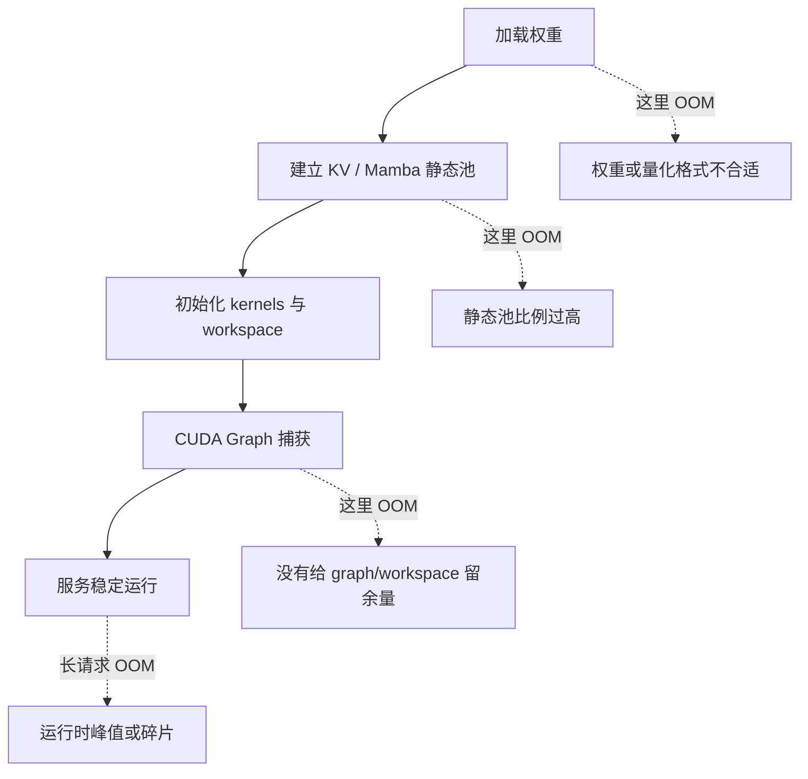
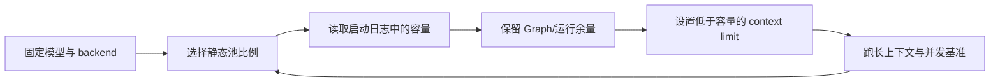

# SGLang v0.5.16 24GB 显存调优案例学习文档

本文整理一篇在单张 RTX 3090 24GB 上运行 35B MoE 模型的实测记录。重点不是抄一份“万能启动参数”，而是学习作者怎样：

1. 先建立显存预算；
2. 一次只改一个参数；
3. 区分“池已经分配”和“逻辑上限”；
4. 用日志验证参数是否真的生效；
5. 把 SGLang 参数与 llama.cpp 参数分开。

本文是第三方实验案例整理，没有在同类硬件上复现，也没有核对 SGLang v0.5.16 源码。所有模型名、版本特性、显存和速度数字都只属于原文条件。

## 0. 阅读基线与范围

| 项目 | 内容 |
| --- | --- |
| 原文标题 | 深度实测：SGLang v0.5.16 升级574 个 PR 带来了什么，24GB 显存的终极指南 |
| 原文链接 | [https://mp.weixin.qq.com/s/rrf6cIAc7HujvXmtf0HNDw](https://mp.weixin.qq.com/s/rrf6cIAc7HujvXmtf0HNDw) |
| 作者 | MindLynx |
| 发布时间 | 2026-07-26 |
| 读取时间 | 2026-07-27 |
| 资料类型 | 单机部署与调参实录 |
| 整理范围 | SGLang v0.5.14-v0.5.16、24GB 显存预算、hybrid KV/Mamba cache、CUDA Graph 余量 |
| 不展开内容 | llama.cpp 完整调优、模型质量评测、SGLang 当前源码核验 |
| 验证边界 | 未复现实验；“574 个 PR”、版本特性、参数生效范围和 benchmark 均来自原文 |

### 原文硬件与服务布局

| 组件 | 原文配置 |
| --- | --- |
| CPU | AMD Ryzen 9 5950X，16C/32T |
| 内存 | 64GB |
| GPU0 | RTX 3090 24GB，运行 llama.cpp 27B dense |
| GPU1 | RTX 3090 24GB，运行 SGLang 35B-A3B MoE |
| 系统 | Debian 13 |
| SGLang | v0.5.16 |
| 模型 | Qwen3.6-35B-A3B 的 4-bit AWQ 变体 |

这里最重要的边界是：**SGLang 服务只使用 GPU1 的单张 24GB 卡。** 双 3090 并没有组成 TP2。

### 怎么读本文

不要先找“推荐值”，先看四个问题：

1. 哪些显存是启动时长期占用？
2. 哪些池已经预分配？
3. 哪些参数只改变逻辑上限，不增加物理分配？
4. 当前 OOM 发生在权重加载、KV 分配还是 CUDA Graph 捕获？

### 术语速查

| 术语 | 人话解释 | 本案例中的作用 |
| --- | --- | --- |
| `mem-fraction-static` | SGLang 可用于静态池的显存比例 | 在 KV/状态容量与 CUDA Graph 余量间取舍 |
| KV Cache | attention 层的历史 K/V | 随可缓存 token 数增长 |
| Mamba/GDN cache | 线性注意力/状态空间层的历史状态 | hybrid 模型的另一类缓存 |
| UnifiedRadixTree | 原文所述用于统一 hybrid cache 管理的机制 | 让部分 Mamba 比例参数开始实际影响分配 |
| CUDA Graph | 捕获固定执行图以减少 launch 开销 | 捕获时还需要额外显存余量 |
| `context-length` | 单请求可接受的上下文上限 | 不一定等于实际 KV 池容量 |
| pool capacity | 启动时根据显存算出的可缓存 token 总量 | 可以大于单请求 context limit |
| OOM | 显存不足 | 要定位发生阶段，不能只盲目降 context |

---

## 1. 先建立显存预算地图

### 人话版

24GB 不是全都能给 KV Cache。启动后至少要装：

```text
模型权重
+ KV Cache
+ Mamba/GDN 状态
+ CUDA Graph
+ runtime workspace
+ allocator 余量
```

### 原文第一阶段的估算

在 v0.5.14、96K context 的一次尝试中，原文记录：

| 项目 | 原文估算 |
| --- | ---: |
| 4-bit AWQ 模型权重 | 约 18.7GB |
| bf16 KV Cache，96K | 约 2.8GB |
| Mamba Cache | 约 1.1GB |
| CUDA Graph | 约 0.5GB |
| 剩余 | 小于 1GB |

随后 CUDA Graph 捕获 OOM，作者把 context 降到 65K 才稳定。

这些数字不是模型通用公式：

- 模型权重文件大小不等于运行时精确占用；
- KV 只来自 attention 层，取决于 KV head、head dim、dtype 和层数；
- Mamba/GDN 状态结构取决于模型实现；
- CUDA Graph 占用取决于 capture shape 和 backend。

### 显存生命周期图



### 关键理解：池容量不等于 context limit

假设启动日志显示 KV/统一缓存池能容纳 93K token，而：

```text
--context-length = 65K
```

这意味着：

- 物理池已经按 93K 左右分配；
- 单请求被逻辑上限限制为 65K；
- 把 `context-length` 从 65K 调到 80K，可能不再增加显存；
- 但不能超过真实池容量和其他调度约束。

原文把这比作“池子已经修好，只是水龙头开得小”。

---

## 2. 原文的四阶段调优过程

### 2.1 阶段一：96K 捕获 OOM，先降到 65K

#### 观察

- 权重、KV、Mamba 状态和 Graph 几乎吃满 24GB；
- OOM 发生在 CUDA Graph 捕获，而不是模型权重加载；
- 说明静态池把运行时余量挤掉了。

#### 学到的方法

不要只看“模型成功加载”。启动完成至少要经过：

```text
权重加载成功
-> 内存池初始化成功
-> CUDA Graph 捕获成功
-> 第一条短请求成功
-> 长请求成功
```

### 2.2 阶段二：`mem-fraction-static` 的 0.01/0.02 试探

原文记录：

| 版本/值 | KV 池容量 | 剩余显存 | 结果 |
| --- | ---: | ---: | --- |
| v0.5.14，0.90 | 约 75K | 约 1.7GB | 池偏小 |
| v0.5.15，0.92 | 约 84K | 约 1.3GB | 原文机器上的折中 |
| 0.95 | 未给完整容量 | 不足 | Graph 捕获 OOM |

#### 正确解读

`0.92` 不是“24GB GPU 的最佳值”。它只是：

```text
该模型
+ 该量化
+ 该 backend
+ 该 graph 配置
+ 该驱动/allocator
```

下的一个实测平衡点。

#### Backend 变化

原文认为：

```text
--mamba-backend flashinfer
```

比默认 Triton 路径节省约 0.6GB，为 Graph 捕获留出余量。这也是单一机器观察，使用前要确认目标模型、GPU 架构和 SGLang 版本支持。

### 2.3 阶段三：池已有 84K，把 context 从 65K 放到 80K

这一步没有额外显存开销，是因为启动时池已经分配。

应验证：

```text
启动日志中的 pool token capacity
>= context-length
+ 生成 token 预算
+ 并发请求占用
```

单请求 80K 能跑，不代表两个 80K 请求能同时跑。

### 2.4 阶段四：调整 Mamba/KV 比例

原文观察到 v0.5.16 后 `uses_mamba_radix_cache` 从 false 变成 true，并认为此前透传但不生效的比例参数开始真正影响分配。

原文数据：

| `mamba-full-memory-ratio` | Mamba Cache | KV/统一池 token | 剩余显存 |
| ---: | ---: | ---: | ---: |
| 0.9 | 1.29GB | 74,628 | 6MiB |
| 0.7 | 1.10GB | 83,625 | 664MiB |
| 0.5 | 0.92GB | 93,273 | 约 1GB |

作者最后把：

```text
context-length = 90,112
```

也就是约 88K，设在 93K 池容量之下。

#### 风险边界

降低 Mamba cache 比例不是“免费换 KV”：

- 线性注意力层仍需要状态；
- 比例太低可能影响可容纳并发或长序列；
- hybrid cache 的实际分配策略可能按版本变化；
- 只看总 token capacity，可能忽略某一种层的局部瓶颈。

---

## 3. 为什么 hybrid 模型的 KV 可能较小

### 原文模型结构

原文把目标模型描述为：

```text
40 层
= 25 层 full attention
+ 15 层 GDN 线性注意力
```

其解释是：

- full-attention 层为历史 token 保存 KV；
- GDN/线性注意力层保存压缩状态，而不是每个 token 的完整 KV；
- 所以 93K token 的 KV 部分只有约 1.8GB。

本文未核对模型配置，以上只作为 hybrid 模型的容量直觉。

### Dense 与 hybrid 的缓存公式

纯 attention 模型的粗略 KV：

```text
KV bytes
≈ num_tokens
× num_kv_layers
× 2
× num_kv_heads
× head_dim
× bytes_per_element
```

hybrid 模型则更像：

```text
总缓存
= attention layers 的 KV
+ state-space/linear-attention layers 的状态
+ 管理元数据与对齐
```

不能用纯 Transformer 的 KV 公式直接估整个 hybrid cache。

---

## 4. 参数表应该怎样读

以下是原文机器上的最终取值与作用解释，不是仓库推荐配置。

| 参数 | 原文取值 | 作用 | 使用前要确认 |
| --- | --- | --- | --- |
| `--mem-fraction-static` | `0.92` | 静态池显存比例 | Graph/workspace 余量 |
| `--mamba-backend` | `flashinfer` | Mamba/GDN backend | 模型与 GPU 支持 |
| `--mamba-full-memory-ratio` | `0.5` | hybrid cache 内存比例 | 当前版本语义 |
| `--context-length` | `90112` | 单请求上下文上限 | 实际池容量与输出预算 |
| `--sleep-on-idle` | 开启 | 降低空闲 CPU | 是否影响唤醒延迟 |
| `--disable-custom-all-reduce` | 开启 | 原文单卡配置中禁用自定义 AR | 单卡通常无多卡 AR |
| `--default-chat-template-kwargs` | 关闭 thinking | 传默认模板参数 | 模型模板是否接受 |
| `SGLANG_MAX_NEW_TOKENS_LIMIT` | `32000` | 服务端限制输出上限 | 当前版本是否支持 |
| `PYTORCH_CUDA_ALLOC_CONF` | `expandable_segments:False` | 原文用于减少预留 | PyTorch 版本与碎片行为 |

### `latest` 镜像不是可复现版本

原文 compose 使用：

```text
lmsysorg/sglang:latest
```

学习时可以理解，但复现实验应固定：

```text
镜像 tag 或 digest
SGLang version
PyTorch/CUDA
FlashInfer/Triton
NVIDIA driver
模型 revision
```

否则同一份参数过几天可能已对应不同代码。

### `default-chat-template-kwargs`

原文认为 v0.5.16 新增/改善了：

```bash
--default-chat-template-kwargs '{"enable_thinking": false}'
```

这改变的是 tokenizer chat template 渲染参数，不是推理 kernel。要确认：

- 模型模板里确实读取 `enable_thinking`；
- 关闭 thinking 是否符合业务需求；
- 客户端是否又覆盖同名参数。

### `SGLANG_MAX_NEW_TOKENS_LIMIT`

它的目标是服务端兜底，防止客户端提交异常大的 `max_tokens`。

容量检查仍要考虑：

```text
prompt tokens + max_new_tokens <= context/model limit
```

只限制输出长度，不能替代总上下文校验。

---

## 5. 不要把 llama.cpp 参数算到 SGLang

原文同一台机器还运行 llama.cpp，因此有些坑只属于 GPU0 的 llama.cpp 服务。

### 框架归属表

| 现象/参数 | 属于 SGLang | 属于 llama.cpp |
| --- | --- | --- |
| `--mem-fraction-static` | 是 | 否 |
| `--mamba-full-memory-ratio` | 是 | 否 |
| `--parallel` 平分 `ctx-size` | 否 | 是 |
| `--ctx-size` | 否 | 是 |
| `--cache-type-k/v` | 否 | 是 |
| `--default-chat-template-kwargs` | 是 | 否 |
| `SGLANG_MAX_NEW_TOKENS_LIMIT` | 是 | 否 |

### `--parallel 1` 的原文结论

原文把 llama.cpp：

```text
--parallel 2
```

改为：

```text
--parallel 1
```

因为单用户场景下多个 slot 会平分 `ctx-size`。这与 SGLang 的 continuous batching、DP 或 TP 无关，不应写进 SGLang 启动参数。

---

## 6. 原文避坑清单的正确边界

### 6.1 `--enable-dynamic-chunking`

原文称它面向 pipeline parallel，单卡场景开启后 CPU 从约 45% 升到 100%。

应把结论写成：

> 在作者的单卡、特定版本部署中，该参数没有带来收益并显著增加 CPU。

不能推导为该功能普遍无用。

### 6.2 `--enable-mixed-chunk`

原文认为单用户、没有并发 prefill 时作用有限。其收益依赖：

- 同时存在 prefill 与 decode；
- 调度器允许混合；
- backend 支持；
- batch 形状和优先级。

### 6.3 FP8 KV Cache

原文认为 RTX 3090/Ampere 没有目标路径所需的原生 FP8 优势，软件反量化反而更慢并影响 CUDA Graph。

正确判断应基于：

- GPU 架构；
- 当前 kernel 是否原生支持；
- KV dtype 的容量收益；
- 反量化成本；
- 精度影响。

### 6.4 Breakable CUDA Graph

原文记录 v0.5.15 下某 Qwen hybrid MoE 与 BCG/LogitsProcessor 类型存在兼容问题，需要回退 full graph backend。

这是版本性问题。复现前应先查当前 release notes 和 issue，不应永久禁用某类 Graph。

### 6.5 “参数透传但不生效”

这是很有价值的调试教训：

```text
CLI 接受参数
!= 后端实际读取参数
!= 内存分配真的改变
```

验证方法：

1. 改一个参数；
2. 对比启动日志；
3. 对比 pool 容量；
4. 对比显存；
5. 对比运行行为；
6. 若都不变，再查 feature gate。

---

## 7. 性能数字怎样读

原文最终配置的短上下文结果：

| 模型/框架 | 原文生成速度 | 原文 8K Prefill |
| --- | ---: | ---: |
| Qwen3.6-27B dense / llama.cpp | 约 57 token/s | 约 1,100 token/s |
| Qwen3.6-35B-A3B MoE / SGLang | 约 187 token/s | 约 2,000 token/s |

原文还称 35B MoE 在长上下文下比 27B dense 快 5-7 倍，并归因于每 token 只激活约 3B 参数。

### 为什么不能直接横比

两行结果同时改变了：

- 模型架构；
- 参数量和激活参数；
- 量化格式；
- 推理框架；
- backend；
- GPU；
- 可能的 batch/采样配置。

因此它不是严格的 SGLang vs llama.cpp 框架 benchmark。

### 合理的复现实验

至少固定：

```text
同一模型 revision
同一量化
同一 GPU
同一 prompt/output 长度
同一并发
同一采样参数
预热轮次
统计窗口
```

同时记录：

- TTFT；
- TPOT；
- input/output throughput；
- 峰值显存；
- cache 命中；
- CPU 占用；
- 错误率。

---

## 8. 从案例提炼出的通用调优方法

### 8.1 一次只改一个变量

推荐日志表：

| 轮次 | 改动 | pool token | 剩余显存 | Graph | TTFT | TPOT | 结论 |
| --- | --- | ---: | ---: | --- | ---: | ---: | --- |
| 0 | 基线 | ... | ... | 成功/失败 | ... | ... | ... |
| 1 | `mem-fraction` | ... | ... | ... | ... | ... | ... |
| 2 | backend | ... | ... | ... | ... | ... | ... |

### 8.2 先定位 OOM 阶段

| OOM 时机 | 更可能的方向 |
| --- | --- |
| 权重加载 | 量化、offload、模型大小 |
| cache pool 初始化 | 静态池比例、context/capacity |
| CUDA Graph 捕获 | capture shape、graph 余量 |
| 第一条请求 | workspace、backend |
| 长请求 | 实际 KV/状态增长 |
| 高并发 | 总 token budget、调度水位 |

### 8.3 保留余量

原文从 6MiB 提升到约 1GB 余量，是更稳健的方向。过度贴边会让：

- 请求形状变化；
- allocator 碎片；
- 临时 workspace；
- 日志/profiler；
- backend 升级；

触发偶发 OOM。

### 8.4 用池容量决定上限，而不是反过来猜



### 8.5 升级前后都跑基线

原文称 v0.5.16 合入 574 个 PR，但在其配置上“性能零变化”，主要收益是可用性和参数生效。

这说明版本升级评估不能只看 PR 数量，应分别检查：

- 启动是否成功；
- 参数语义是否变化；
- cache 容量；
- 输出正确性；
- 性能；
- CPU/显存；
- 长时间稳定性。

---

## 9. 一份更安全的复现清单

### 环境记录

```text
GPU 型号与数量
驱动、CUDA、PyTorch
SGLang tag/commit/镜像 digest
模型 revision 与量化
FlashInfer/Triton 版本
操作系统与容器 runtime
```

### 启动验证

```text
权重加载成功
cache backend 与容量符合预期
CUDA Graph 捕获成功
短请求成功
接近 context limit 的请求成功
max_new_tokens 边界正确
服务重启后结果一致
```

### 性能验证

```text
短、中、长 prompt
单并发和多并发
TTFT、TPOT、吞吐
显存和 CPU
冷启动与预热后
至少数十分钟稳定运行
```

### 回退准备

```text
保留旧镜像 digest
保留旧启动参数
记录每轮日志
不要使用 latest 做唯一生产基线
```

---

## 10. 小白排障地图

| 现象 | 可能原因 | 优先检查 |
| --- | --- | --- |
| 模型加载成功但 Graph OOM | 静态池占太满 | `mem-fraction-static`、capture shape |
| context 调高但显存不变 | 池已预分配 | 启动日志 pool capacity |
| context 仍达不到池容量 | 输出预算、并发或另一类 cache 先满 | KV/Mamba 分池、scheduler |
| 改 Mamba 比例完全没变化 | feature gate/backend 未启用 | `uses_mamba_radix_cache` 类日志 |
| 剩余只有几 MiB | 配置过度贴边 | 降池比例或 Graph shape |
| 升级后同参数容量变化 | 默认值/实现改变 | version diff、启动日志 |
| 空闲 CPU 很高 | scheduler busy loop 或功能开关 | `sleep-on-idle`、dynamic chunking |
| FP8 KV 更慢 | GPU/kernel 缺少原生路径 | 架构与 backend |
| 单用户上下文只有一半 | 可能是 llama.cpp `--parallel` | 不要误查 SGLang |
| benchmark 看似大幅领先 | 模型/框架/量化未对齐 | 重新做受控 A/B |

---

## 11. 一句话总结

**这篇案例最值得复用的不是 `0.92` 或 `88K`，而是“先读真实池容量、给 CUDA Graph 留余量、一次只改一个参数、用日志确认参数确实生效”；所有具体数字都只属于作者的单张 3090、指定 hybrid MoE 模型和 v0.5.16 环境。**

## 12. 参考与延伸

- [深度实测：SGLang v0.5.16 升级574 个 PR 带来了什么，24GB 显存的终极指南](https://mp.weixin.qq.com/s/rrf6cIAc7HujvXmtf0HNDw)
- [SGLang KV Pool、请求视图与 HiCache 工程学习文档](../kv-cache/SGLang%20KV%20Pool、请求视图与%20HiCache%20工程学习文档.md)
- [SGLang Chunked Prefill 与调度器显存预算学习文档](../runtime/SGLang%20Chunked%20Prefill%20与调度器显存预算学习文档.md)

本文基于原文实测记录整理，未验证当前 SGLang 版本、模型结构、参数默认值和性能结果。
