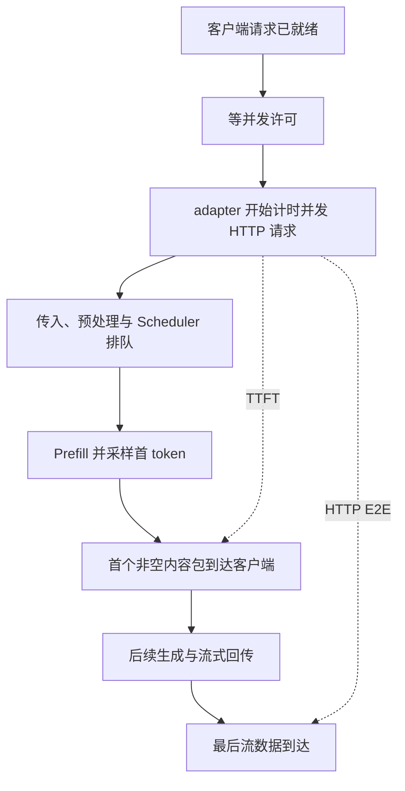
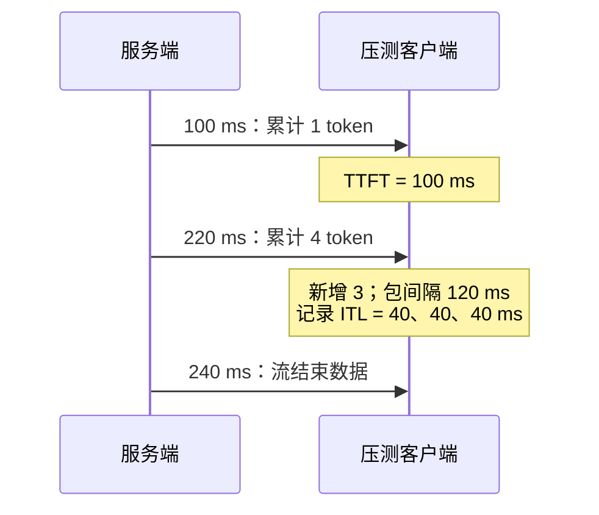
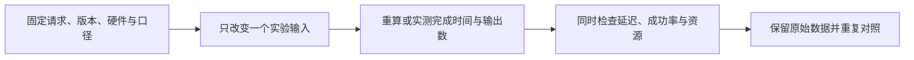

# SGLang 指标口径与性能定位

先找到秒表边界，再判断优化改变了哪一段。本文是源码分析型学习资料，将本地固定源码与仓内 Benchmark、Profiler 资料串成四个机制：请求计时、流式观测、对照实验、样本筛选。

[交互课程](https://asher-xunzhang.github.io/ai-infra-wiki/sglang/performance-engineering/) · [本领域导航](README.md)

## 0. 源码基线与范围

| 项目 | 内容 |
| --- | --- |
| 公开仓库 | https://github.com/sgl-project/sglang |
| 分支与 commit | 公开上游 main 快照 `279339f113b79af84f27fd3ac92d0a13bd3f4cbd` |
| 读取时间 | 2026-09-23 |
| 工作区状态 | 通过本地 Git 固定对象读取；原检出分支另有未跟踪资料，保留且未纳入分析 |
| 主线 | 文本、单轮、native `/generate` 流式客户端；普通 `calculate_metrics` 汇总 |
| 操作边界 | 只读源码、独立教学算术、页面和文档验证；未启动 SGLang、运行 benchmark 或采集 GPU Trace |
| 教学假设 | 所有毫秒数与工作负载均为构造值，解释公式与依赖，不预测具体设备性能 |

先修：[请求运行时](../runtime/README.md)、[服务生命周期与请求治理](<../serving-operations/SGLang 服务生命周期与请求治理学习文档.md>)。已有 [Benchmark 设计与指标口径](../source-study/11-performance-engineering/01-Benchmark设计与指标口径.md) 和 [Profiler 与时间线阅读](../source-study/11-performance-engineering/02-Profiler与时间线阅读.md) 采用独立基线，不能把版本混写为同一实现。

## 1. 请求秒表：先看哪一段被计入

工具不一定从请求在客户端“已经准备好”时开始计时。普通 benchmark 的并发许可包在 adapter 外面；取得 semaphore 后才进入 `async_request_sglang_generate`，随后设置 `st = time.perf_counter()`。[S1][S2]



图意：许可等待在图左侧的总旅程中，却不在 C 开始的单请求秒表里。真实预处理、调度和执行可能重叠；图只表达计时边界，不是进程拓扑。客户端看到首包之前，服务端已经完成首 token 采样；不能把首包时刻当作 GPU 采样时刻。

交互例将这些阶段串行放置：许可 80 ms、请求传入 20 ms、排队 80 ms、Prefill 与采样 100 ms、首包回传 20 ms、后续 Decode 与回传 120 ms、尾部 20 ms。因而发送在 80 ms，首包在 300 ms，结束在 440 ms：

- 客户端 TTFT = 300 − 80 = 220 ms。
- HTTP E2E = 440 − 80 = 360 ms。
- 从就绪到完成 = 440 ms。

若许可多等 120 ms，三处后续绝对时刻都推迟，工具 TTFT 和 HTTP E2E 不变。若 Scheduler 多等 120 ms，工具的两项指标都会增加。页面给出两种独立切换，用条段长度和端点位置直接呈现区别。

源码里服务端 `TokenizerManager.collect_metrics` 用 `state.time_stats.get_first_token_latency()` 观测 TTFT，且有 PD 模式边界。[S3] 它和客户端秒表不是同一对端点；两个数相减不能直接命名为纯网络耗时。客户端 TTFT 高，只能先定位到其包含的整个区间，不能单独证明 Prefill 计算慢。

## 2. 流式观测：一个包可以包含多个 token

native adapter 遇到非空 `text` 才更新对应输出记录；首次记录 TTFT。后续包以 `completion_tokens` 的增量计算新增数量，再把包间隔平均分配给这些新增 token，放入 `output.itl`。[S1][S4]



图意：客户端直接看见两个内容包的到达时刻；“40、40、40”由包间隔均摊而来，不是三个设备生成时刻。首包内部若有多个 token，其内部间隔也没有被观测到。逐包一个 token 与后三个合成一包，可以得到相同 ITL 数组，却代表不同的可见输出节奏。

普通 `calculate_metrics` 对成功且输出长度大于 1 的请求计算：[S5]

```text
请求 TPOT = (latency − ttft) / (output_len − 1)
```

本例 TPOT = (240 − 100) / 3 ≈ 46.7 ms，和三个 ITL 样本的 40 ms 不同，因为 `latency` 在读取流数据时持续更新，包含构造例中的 20 ms 尾部。这里只有一个输出 token 时，没有后续 token 区间；页面显示“无样本”，不把缺失解释成 0 ms。源码汇总空列表时某些字段使用零回退，读报告要同时检查样本数量。

多个请求的 TPOT 均值按请求等权；ITL 汇总把各请求的记录样本连接起来，样本数更多的请求权重更高。协议适配器、usage-only 消息、首包是否有内容、重新分词规则都可能改变口径；本页不把 native 的行为推广给所有 OpenAI 路径。

## 3. 对照实验：变快必须说明分母和代价

吞吐表达“在同一段墙钟时间内完成多少工作”。固定实现将成功请求数、成功输入数、成功输出数分别除以 `dur_s`；输入加输出的总吞吐又是另一项。[S6]



### 3.1 更多并发，可以更早完成整批，也可以让单请求执行更久

交互采用一个封闭批次：6 条请求在 0 ms 就绪，每条输出 4 token；许可外等待不计入 HTTP E2E。每组取得许可后立即执行，结束后释放许可；没有网络尾部。耗时是人为设置的共享成本：

- 并发许可 1：每组 1 条，Prefill 60 ms，3 轮 Decode 共 60 ms。6 组总计 720 ms，输出吞吐 24 / 0.72 ≈ 33.3 token/s；每条 HTTP E2E 为 120 ms。
- 并发许可 3：每组 3 条，Prefill 90 ms，3 轮 Decode 共 90 ms。2 组总计 360 ms，输出吞吐约 66.7 token/s；每条 HTTP E2E 为 180 ms。

图中 A/B 共用时间比例，深色部分为 Prefill。吞吐翻倍，而许可之后的单请求时长增加。与此同时，就绪到完成的平均时长从 420 降到 270 ms，因为许可外等待减少了。三个指标可以同时成立，必须保留各自边界。

这不意味着 SGLang 并发从 1 到 3 必然得到以上收益：图没有拟合硬件、内存压力、缓存、动态 batch 或网络。它用于展示“总量”和“单请求区间”之间没有简单等号。

### 3.2 只优化一段，收益受其他段限制

固定并发为 3，只令 Prefill 从 90 缩短到 45 ms，Decode 仍为 90 ms。每组 180 → 135 ms，两组总计 360 → 270 ms，吞吐提升为 360 / 270 ≈ 1.33 倍。Prefill 快两倍，整批并没有快两倍。

实际流水线还可能重叠。应找决定完成时刻的依赖路径，而不是把各个局部加速比相乘。改变非关键路径，甚至可能不改变最终完成时间；[PP 依赖交互图](https://asher-xunzhang.github.io/ai-infra-wiki/sglang/pd-prefill-pp-loop/) 可继续观察这种情况。

### 3.3 正式 benchmark 的分母还要查外围

固定 `benchmark` 在正式发压前记录 `benchmark_start_time`，收集请求后还可能停止 profiler，并对 SGLang 获取 `server_info`，然后才求 `benchmark_duration`。[S7][S8] 因此正式工具的分母不必等于“第一条 HTTP 发出到最后一条 HTTP 完成”；短测试尤其要核对收尾成本。

保存模型与源码 commit、硬件/拓扑、输入输出实际长度、缓存条件、采样规则、到达率、并发限制、协议、成功率和原始结果。预热与前缀命中分别记录；同一输入集合也可能因执行顺序变化而改变缓存命中。多轮重复后比较分布和波动，而非只挑最好的一次。

## 4. 样本筛选：失败会把慢请求从分布里拿走

`calculate_metrics` 只把 `success=True` 的延迟、输入和输出计入成功统计；失败项的输出长度在此汇总置零。[S9] 即使失败前曾收到部分输出，也不能把成功吞吐视作所有收到过的 token 的速率。

构造 1 秒观察窗，4 条请求分别为 80、80、80、500 ms TTFT，成功请求各输出 4 token：

- 全部成功：平均 TTFT 为 185 ms，成功输出吞吐 16 token/s。
- 最慢一条失败：成功样本均值为 80 ms，成功输出吞吐 12 token/s，失败率 25%。

交互图保留 R4 的位置，用删除标记表示它退出统计，而不让它从画面消失。P95 用 NumPy 默认线性插值对应的算术，四个样本只演示筛选效应，不估计实际尾延迟。若全部失败，应报告没有成功延迟样本，不能宣称零延迟。

## 5. 从现象到下一份证据

先把同一请求的时间端点关联起来，再拆长区间。客户端 TTFT 包括传入、预处理、排队、首轮执行和回传；只看到它变长，不能决定该改 batch、kernel 还是传输。

查看 Trace 时区分 CPU 提交、设备实际执行与等待。多流 kernel 可以重叠，累加 kernel 时长不等于请求墙钟耗时；一段设备空隙也可能在等待必要的数据或其他 rank。先读调用和同步依赖，再提出优化假设。

| 现象 | 下一份证据 | 能排除的误读 |
| --- | --- | --- |
| 用户等待长，工具 TTFT 没变 | 客户端任务就绪、许可取得、adapter 开始时刻 | 把许可外排队误认为引擎计时错误 |
| TTFT 上升，Decode 间隔稳定 | 请求关联的入队、入 batch、首轮执行与首包时刻 | 仅凭 TTFT 就断言 Prefill kernel 回退 |
| ITL 很均匀，实际输出成团 | 原始流式包时刻与 token 增量 | 把均摊 ITL 当成设备逐 token 时刻 |
| 吞吐上升，延迟或失败率变差 | 同负载下成功率、延迟分布、观察窗口 | 用吞吐单项宣称服务整体改善 |
| 局部算子快两倍，E2E 不变 | 同请求关键路径与重叠区域 | 将局部时间缩短等同端到端收益 |

本表是诊断路线，不是运行结论。进一步读取 [Torch Profiler 与 Trace 学习文档](<SGLang Torch Profiler 与 Trace 性能分析学习文档.md>)，保留其来源与版本边界。

## 6. 自测与源码路线

1. 许可外多等 120 ms 与 Scheduler 多等 120 ms，分别改变哪些指标？
2. 一包带 3 个 token，为什么三个相同 ITL 不证明均匀生成？
3. 首包 100 ms、结束 240 ms、输出 4 token，TPOT 为什么不等于 40 ms？
4. Prefill 占一半时，将它耗时减半，为什么整批只快 1.33 倍？
5. 成功样本 P95 下降前，需要同时检查哪一组失败和输出计数？

源码顺序：外层 `limited_request_func` → native adapter → `calculate_metrics` → `benchmark` 外围计时 → 服务端 `collect_metrics`。每次先问“谁持有秒表、起止事件在哪里”，再读公式。对应单元检查是教学算术与固定锚点验证，浏览器检查验证图形和交互；均不替代真实性能验收。

[S1]: https://github.com/sgl-project/sglang/blob/279339f113b79af84f27fd3ac92d0a13bd3f4cbd/python/sglang/benchmark/serving.py#L658
[S2]: https://github.com/sgl-project/sglang/blob/279339f113b79af84f27fd3ac92d0a13bd3f4cbd/python/sglang/benchmark/serving.py#L1389
[S3]: https://github.com/sgl-project/sglang/blob/279339f113b79af84f27fd3ac92d0a13bd3f4cbd/python/sglang/srt/managers/tokenizer_manager.py#L2942
[S4]: https://github.com/sgl-project/sglang/blob/279339f113b79af84f27fd3ac92d0a13bd3f4cbd/python/sglang/benchmark/serving.py#L756
[S5]: https://github.com/sgl-project/sglang/blob/279339f113b79af84f27fd3ac92d0a13bd3f4cbd/python/sglang/benchmark/serving.py#L1136
[S6]: https://github.com/sgl-project/sglang/blob/279339f113b79af84f27fd3ac92d0a13bd3f4cbd/python/sglang/benchmark/serving.py#L1236
[S7]: https://github.com/sgl-project/sglang/blob/279339f113b79af84f27fd3ac92d0a13bd3f4cbd/python/sglang/benchmark/serving.py#L1499
[S8]: https://github.com/sgl-project/sglang/blob/279339f113b79af84f27fd3ac92d0a13bd3f4cbd/python/sglang/benchmark/serving.py#L1613
[S9]: https://github.com/sgl-project/sglang/blob/279339f113b79af84f27fd3ac92d0a13bd3f4cbd/python/sglang/benchmark/serving.py#L1124
