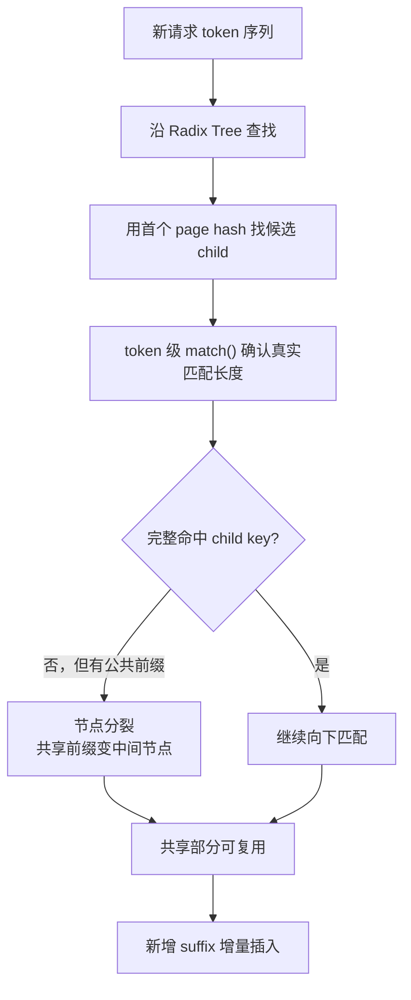
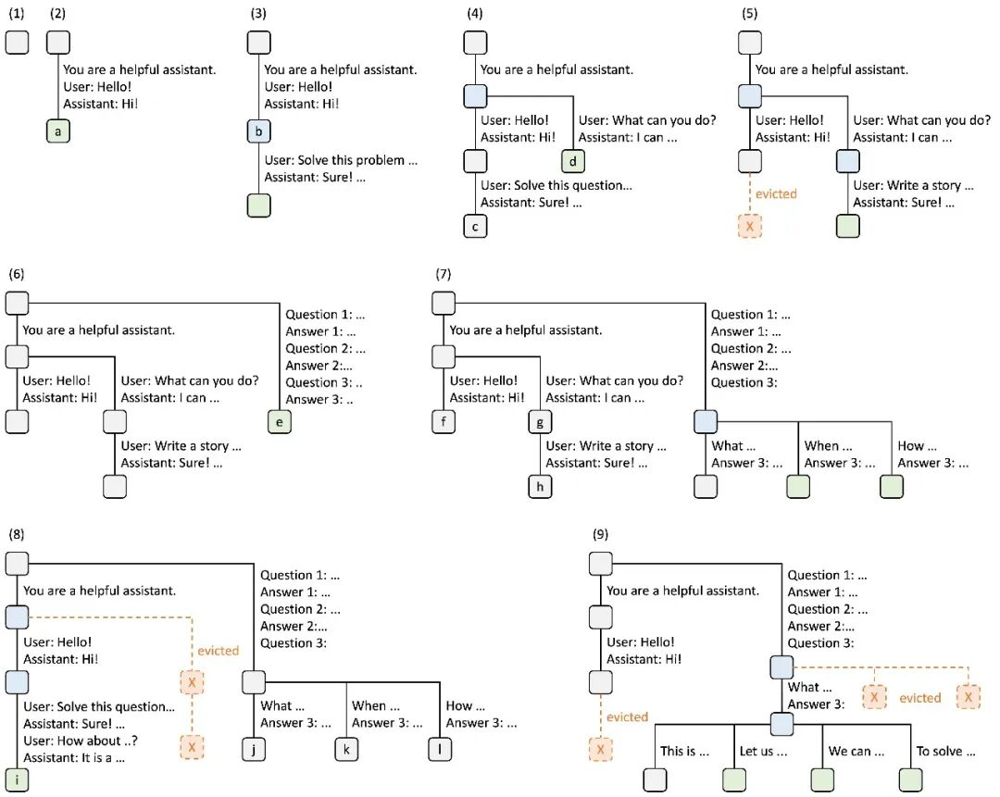
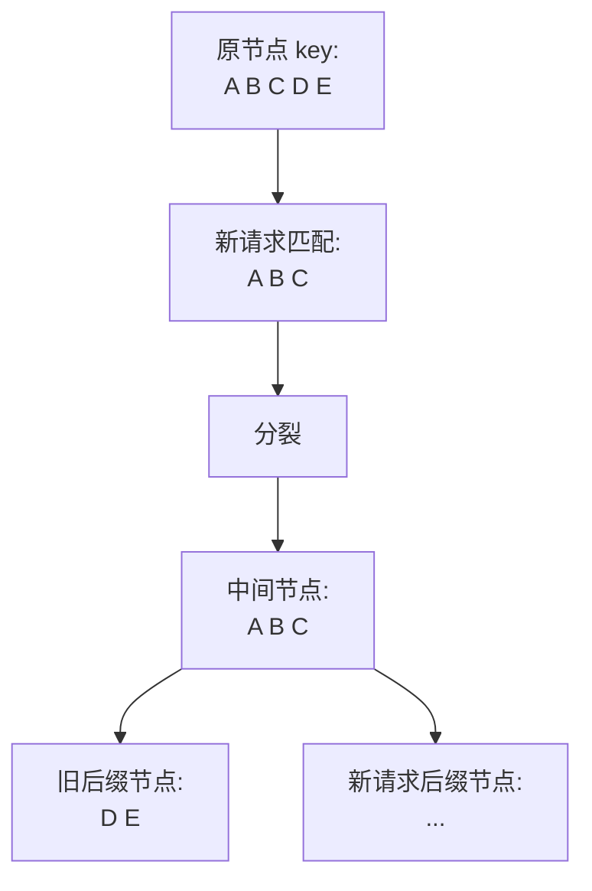

# SGLang Prefix Cache 命中定义学习文档

本文面向第一次理解 SGLang prefix cache 命中语义的同学，整理原文《KV Cache 前缀匹配的设计分野》的 SGLang 相关内容。本文只关注 SGLang，不展开原文中的其他框架；本文是第三方资料整理型学习笔记，未做 SGLang 源码级复核。

## 0. 阅读基线与范围

| 项目 | 内容 |
| --- | --- |
| 原文标题 | KV Cache 前缀匹配的设计分野 |
| 原文链接 | <https://mp.weixin.qq.com/s/GciJebFszheSqU-s3yZPMQ> |
| 作者 | Lychee & Ethan |
| 读取时间 | 2026-07-17 |
| 整理范围 | SGLang RadixAttention 如何定义 prefix cache 命中、压缩 Radix Tree、child_key、token 级匹配、节点分裂 |
| 不展开内容 | 不分析原文中的其他框架；不做源码级复核 |

**术语速查**

| 术语 | 人话解释 | 在本文中的重点 |
| --- | --- | --- |
| Prefix cache | 复用请求开头已经算过的 KV | 决定 prefill 能省多少 |
| 命中 | 新请求前缀能匹配已有缓存 | SGLang 支持任意 token 边界 |
| Radix Tree | 压缩前缀树 | 用一段 token 作为节点 key |
| 节点分裂 | 把已有节点切成共享前缀和后缀 | 支持部分前缀命中的关键成本 |
| child_key | 子节点字典使用的路由 key | 用首个 page 的哈希快速找到候选分支 |
| token 级 match | 进入候选节点后逐 token 确认匹配长度 | 保证 child_key 碰撞不破坏正确性 |

---

## 1. 先建立整体地图

### 人话版

SGLang 对“命中”的定义很精细：只要新请求和已有节点共享某段 token 前缀，即使共享边界落在节点中间，系统也可以把节点切开，让这段前缀成为可复用节点。

这和只认完整 block 的设计不同。SGLang 愿意付出动态维护树结构的成本，换取更高的前缀复用上限。

### 总览图



### 小例子

已有节点保存：

```text
You are a helpful assistant. User: Hello!
```

新请求是：

```text
You are a helpful assistant. User: Help me write ...
```

两者不是完整相同，但共享 `You are a helpful assistant. User:`。SGLang 可以把共享部分切成独立节点，让后续请求继续复用这段前缀。

---

## 2. 压缩 Radix Tree：少存节点，但保留分裂能力

### 人话版

标准 Trie 每个节点只存一个 token。对 32K token 的上下文来说，这会产生大量节点和指针跳转。

SGLang 使用压缩 Radix Tree：没有分叉的连续 token 被折叠成一个节点。这样节点数更少，路径更短；当新请求只命中节点前半段时，再通过节点分裂恢复精细边界。

### RadixAttention 操作图



### 图意解读

这张图包含插入、匹配、分裂和淘汰：

- 前几步展示请求如何逐渐把共享前缀挂到树上。
- 中间步骤出现节点分裂，这是任意 token 边界命中的关键。
- 后续步骤展示分叉不断增多，树保留共享路径，把差异后缀挂到不同分支。
- 被 evicted 的节点不再提供可复用 KV，但树的维护逻辑仍围绕共享边界展开。

图里最值得记住的是：SGLang 的命中不是“完整节点或完整 block 才算命中”，而是“能找到公共 token 前缀，就可以把它变成新的节点边界”。

### 机制拆解

| 动作 | 为什么需要 |
| --- | --- |
| 路径压缩 | 减少 token-by-token Trie 的节点膨胀 |
| token 级比较 | 精确判断真实公共前缀长度 |
| 节点分裂 | 把中间共享边界显式化 |
| 后缀挂载 | 只为新增内容创建节点 |
| LRU 淘汰 | 给不再热点的节点释放缓存空间 |

---

## 3. child_key：快速路由，但正确性靠 token match

### 人话版

树上每个节点的 key 是一段 token。如果每次查找都把完整 token 序列拿来当字典 key，开销会很高。

SGLang 的做法是：子节点字典用 key 的第一个 page 的哈希作为 child_key。这样能快速定位候选子节点；进入候选节点后，再用 token 级 match 确认真实匹配长度。

### 机制拆解

| 层次 | 做什么 | 正确性风险 |
| --- | --- | --- |
| child_key | 用首个 page hash 做 O(1) 候选路由 | 可能碰撞 |
| token match | 对候选节点做真实 token 比较 | 过滤误匹配 |
| 节点分裂 | 根据真实匹配长度重写树结构 | 维护成本上升 |

child_key 的哈希碰撞不会直接导致错误 KV 被复用，因为真正进入节点后还要比较 token 序列。碰撞更像一次无效候选比较，而不是正确性灾难。

### 小例子

两个子节点首个 page hash 碰巧相同：

```text
child A: [10, 20, 30, ...]
child B: [99, 88, 77, ...]
```

child_key 可能把查找带到候选节点，但 token match 会发现 token 不一致。只有真实 token 前缀匹配，才会进入复用或分裂流程。

---

## 4. 节点分裂：任意 token 边界命中的成本

### 人话版

节点分裂是 SGLang prefix cache 的核心成本。它让系统不必等到完整节点匹配，哪怕只匹配节点前半段，也能把这段公共前缀变成可复用节点。

### 分裂过程



### 机制拆解

分裂后，树会多一个中间节点。这个中间节点代表真实共享前缀，下面挂两个方向：

- 旧请求剩余后缀。
- 新请求剩余后缀。

这样一来，未来第三个请求只要也共享 `A B C`，就能直接命中中间节点，而不必重新发现这段共享边界。

### 适用负载

这种设计适合：

- 很长 system prompt。
- 多轮对话共享大段开头。
- tree-of-thought 或 self-consistency 产生分支。
- 请求之间常常只在末尾少量 token 分叉。

如果请求之间几乎没有共享前缀，动态树维护的收益就会下降。

---

## 5. 命中精度与维护复杂度的取舍

### 人话版

SGLang 把命中率上限放得很高：愿意维护一棵动态变化的树，也要尽量复用非 block 对齐的前缀。

这个选择的代价是实现更复杂：

- 树节点会被动态分裂。
- 节点生命周期要和 KV page 绑定。
- 淘汰时要维护树结构和缓存状态。
- 命名空间隔离、锁定状态、访问时间都要参与判断。

### 对比边界

本文不展开其他框架，只保留一个判断边界：SGLang 更偏向“命中精度优先”，用更复杂的数据结构换取任意 token 边界复用。

### 排障提示

如果怀疑 SGLang prefix cache 命中不符合预期，可优先检查：

- 共享前缀是否在同一命名空间。
- 请求是否真的共享 token，而不是文本看似相同但 tokenization 不同。
- 节点是否已被淘汰。
- 分裂后的共享节点是否被后续请求复用。
- 长前缀是否被路由到已有缓存的 worker。

---

## 6. 一句话总结

SGLang 对 prefix cache “命中”的定义是 token 级的：压缩 Radix Tree 减少节点数，child_key 快速定位候选分支，token match 保证正确性，节点分裂把任意共享边界显式化；它用维护复杂度换取更高的前缀复用上限。

## 7. 参考与延伸

- 原文：<https://mp.weixin.qq.com/s/GciJebFszheSqU-s3yZPMQ>
- 原文作者：Lychee & Ethan
- 本文图片来自原文页面，已下载到 `../images/prefix-cache-matching/`。
- 本文只整理 SGLang 相关内容，未做源码级复核；源码判断请再对照当前 SGLang 主线确认。
