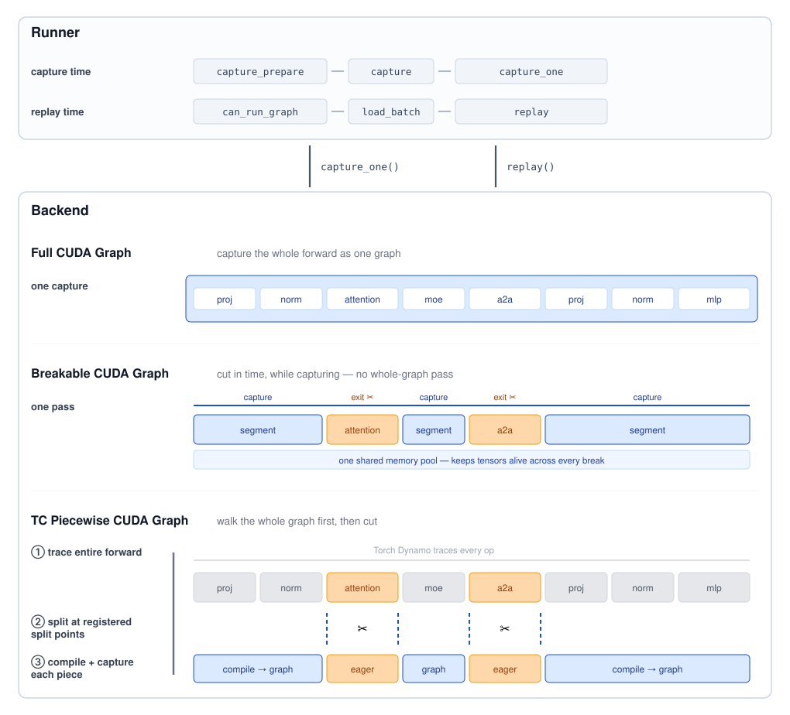
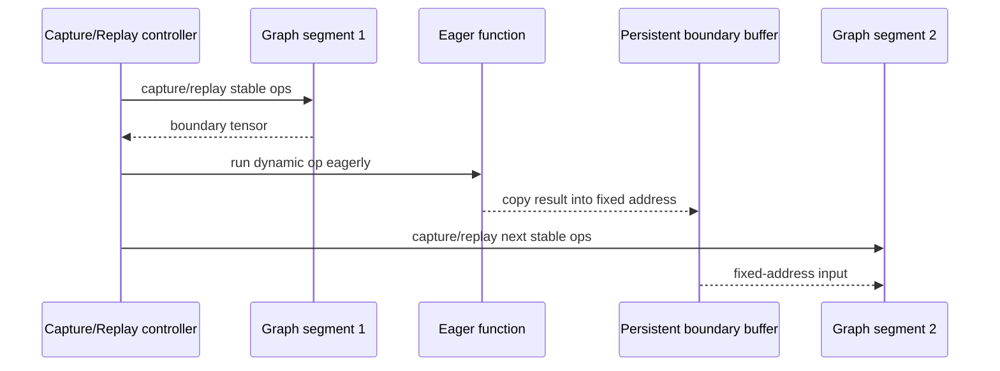
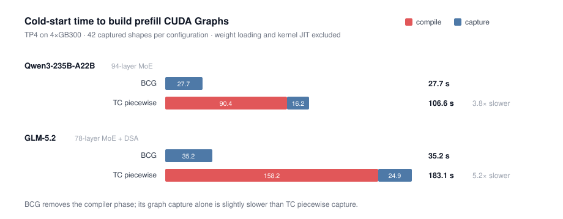
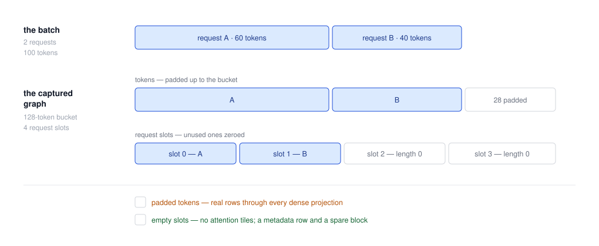
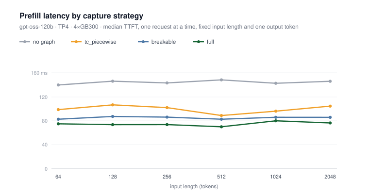
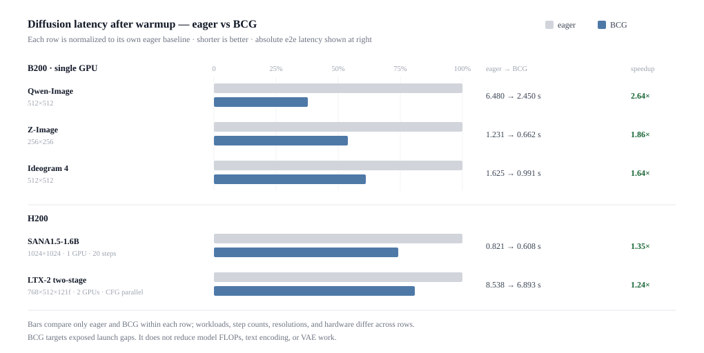
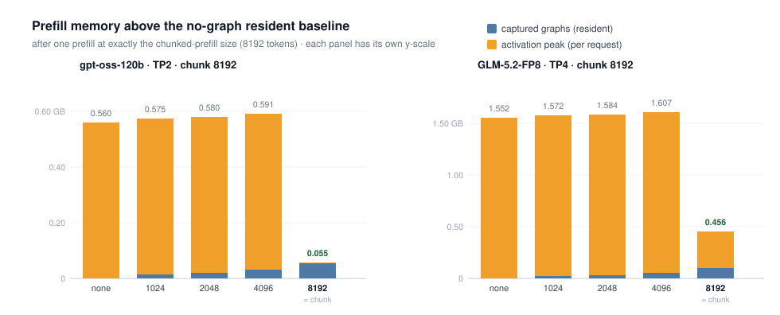

# SGLang Breakable CUDA Graph 与 Prefill 捕获学习文档

本文面向已经知道 CUDA Graph 能减少 kernel launch 开销、但不理解为什么 Prefill 比 Decode 难捕获的同学。重点梳理 SGLang 如何把 Runner 与 Backend 解耦，如何用 Breakable CUDA Graph 把动态操作留在 Eager 区域，以及 Full Prefill Graph 如何用 token bucket 和零长度请求槽位换取静态 shape。

本文是第三方资料整理型学习资料。中文文章已与 LMSYS 官方原文交叉核对，但本文不做源码级审计或性能复现。

## 0. 阅读基线与范围

| 项目 | 内容 |
| --- | --- |
| 原文标题 | 《SGLang 重做 CUDA Graph：Prefill 最高加速 1.93 倍》 |
| 原文链接 | <https://mp.weixin.qq.com/s/qMfwEMDuj7kTGoyEohknjA> |
| 作者/机构 | 一只努力的微服务 |
| 发布时间 | 2026-08-18 |
| 官方原文 | [Advanced CUDA Graph Techniques in SGLang](https://www.lmsys.org/blog/2026-08-17-advanced-cuda-graph) |
| 官方作者 | SGLang Team |
| 读取时间 | 2026-08-25 |
| 资料类型 | 架构与性能解读 |
| 整理范围 | Runner/Backend、Full/BCG/TC Piecewise、Eager Break、Prefill 静态化、显存复用、benchmark 边界 |
| 不展开内容 | 当前源码文件级调用链、完整 server args、CUDA Graph 底层 API 教程 |
| 验证边界 | 机制与数字对照官方博客；所有性能只适用于原文模型、硬件、shape 和 warmup 条件，本文未复现 |

### 术语速查

| 术语 | 人话解释 | 本文中的角色 |
| --- | --- | --- |
| Capture | 录制一次固定 GPU 执行和地址关系 | 构建期 |
| Replay | 复用已录制图 | 请求执行期 |
| Runner | 管输入、静态 buffer、shape 和 padding | 执行场景层 |
| Backend | 决定如何捕获 forward | 捕获策略层 |
| Full CUDA Graph | 整个 forward 一张图 | launch 最少，兼容要求最高 |
| BCG | Breakable CUDA Graph，图段之间允许 Eager | 不依赖完整 compiler trace |
| TC Piecewise | `torch.compile` 追踪后按 split points 分段 | 先理解整图，再切分 |
| Eager Break | 明确留在普通执行的动态区域 | 图与动态逻辑的边界 |
| Captured shape | 预先录制的 batch/token 档位 | 实际输入要映射到这些档位 |

## 1. CUDA Graph 优化的是什么

一次 Transformer forward 包含许多 kernel。普通 Eager 路径由 CPU 逐个 launch：

```text
CPU: launch K1 -> launch K2 -> launch K3 -> ...
GPU:    K1   gap   K2   gap   K3
```

CUDA Graph 先录制，再一次 launch 整体回放：

```text
CPU: cudaGraphLaunch
GPU: K1 -> K2 -> K3 -> ...
```

它主要减少 host launch/dispatch 空隙，不减少模型 FLOPs。若 workload 已被大 GEMM 完全占满，图收益可能有限；若有大量短 kernel 或重复 DiT steps，launch-bound 更容易显著受益。

## 2. 为什么 Decode 容易，Prefill 难

| 阶段 | 主要动态维度 | 图捕获难点 |
| --- | --- | --- |
| Decode | batch 中活跃请求数 | 每请求通常 1 token，可按 batch buckets 捕获 |
| Prefill | 总 input tokens、请求数、各序列长度 | 两个维度同时变化，Attention metadata 可能依赖 CPU |
| Speculative | draft/verify token 数、多个执行路径 | 每种 step 的 shape 和状态不同 |
| Diffusion | 分辨率、帧数、CFG、条件长度、模型 | signature 组合多，但 denoising 重复度高 |

传统 Full Graph 只要遇到一个不能捕获的动态操作，就可能失去整个 forward 的覆盖。SGLang 的目标不是强迫所有操作变静态，而是让不同执行路径选择不同捕获策略。

## 3. Runner/Backend：把“跑什么”和“怎么录”拆开



**图意解读：** Runner 在 capture/replay 两侧管理 shape、输入和静态 buffers；Backend 决定整图、捕获过程中分段，还是先经 Torch Dynamo 追踪再分段。Full、BCG、TC Piecewise 不是三套完整 Runner，而是可替换的捕获策略。

### Runner 拥有什么

- captured shapes；
- 静态输入/输出 buffers；
- Attention metadata；
- 实际 batch 到 captured shape 的 padding；
- 当前 execution path 的准备与回放。

### Backend 拥有什么

- capture 的开始、暂停、恢复和结束；
- Full、Breakable 或 compiler-generated pieces；
- replay 时按什么顺序运行 graph segments 和 Eager regions；
- graph memory pool 与跨段 tensor 地址契约。

### 为什么这层拆分重要

Prefill、Decode、EAGLE draft、draft-extend、frozen-KV MTP 和 target verify 可以有不同 Runner，但复用同一个 Backend contract。新增执行路径不必复制全部 shape/buffer/capture 基础设施。

## 4. 三种捕获策略的区别

| 策略 | 构建方式 | Replay 结构 | 优点 | 代价 |
| --- | --- | --- | --- | --- |
| Full | 整个 forward 一次捕获 | 单图 | launch 最少 | 所有区域都要 graph-compatible |
| BCG | 捕获时遇到标记函数暂停/恢复 | Graph -> Eager -> Graph | 无需 compiler 理解整图，边界服从 serving 逻辑 | 边界 copy 与多段 replay |
| TC Piecewise | `torch.compile(fullgraph=True)` 追踪，按 split point 切 | compiled graph pieces + Eager | 已有平台可继续使用 | compile/fake impl/类型边界维护成本高 |

### 不是“BCG 支持动态 shape”这么简单

BCG 仍依赖 captured segments 的固定地址与 shape。它做的是把无法满足图约束的部分显式留在图外，从而让前后大段稳定计算继续捕获；动态区域本身并未变成 CUDA Graph。

## 5. BCG：捕获到动态区域就暂停

### 机制

开发者用 `@eager_on_graph` 标记不兼容函数：



### 最难的是地址，不是顺序

后一段图在 capture 时记录了输入 tensor 地址。Eager function 每次可能返回新 tensor；若直接交给后一段，地址与 capture 不同。

BCG 在边界保留持久 buffer：Eager 结果每次复制进去，后一段图始终读取同一地址上的最新值。这个 copy 是兼容性的代价，边界位置和 tensor 大小会影响收益。

### 为什么不再依赖 compiler 理解动态区域

TC Piecewise 要让 `torch.compile` 追踪完整 forward。自定义 CUDA/Triton/JIT kernel 需要 `torch.library` 注册和 fake implementation；复杂返回类型还会反向限制 split point。

BCG 只要求 Eager region 能正确运行，不追踪其内部。图边界可以贴近 Attention metadata、MoE All-to-All、LoRA、PD、HiCache 等真实运行时边界。

## 6. 构建时间与调试边界



**图意解读：** 42 个 captured shapes、TP4、4×GB300。TC Piecewise 的 red 部分是 compile，blue 部分是 capture；BCG 没有 compiler 阶段。Qwen3-235B-A22B 从 106.6 s 降到 27.7 s，GLM-5.2 从 183.1 s 降到 35.2 s。这里不含权重加载和 kernel JIT，不能当成完整启动时间。

官方原文总结 BCG 构建 Prefill graphs 比 TC Piecewise 快 3.8～5.2×，原因主要是去掉占准备时间 78%～86% 的 compile 阶段。

### `--debug-cuda-graph` 的分诊思路

调试模式把整个 forward 放入 Eager Break，但仍经过 Runner、静态 buffer、metadata 和 replay 路径：

- 问题仍出现：优先看模型、Runner、buffer/metadata；
- 问题消失：优先看 capture、segment boundary 和 replay。

这是“缩小嫌疑范围”，不是自动证明某层无 bug。

## 7. Full Prefill Graph：把两个动态维度静态化

### Token bucket

实际总 tokens 向上 padding 到最近 captured token bucket，例如 100 tokens -> 128 bucket。补齐 token 会穿过 dense projections/GEMM，是真实计算行；部分 MoE、Attention 或 linear-Attention kernel 可以根据真实 token 数跳过无效区域，但 dense 计算不能全部免除。

### Request slots

每张图预留固定数量 request slots。真实请求占前面槽位，未使用槽位变成 sequence length 和 extend length 都为 0 的哨兵请求。变长 Attention 通常不会为零长度序列生成实际 tiles，因此 slot padding 比 token padding 便宜。



**图意解读：** 两个请求共 100 tokens 被填充到 128-token bucket，同时 4 个 request slots 中后两个置零。图下方强调：padded tokens 是 dense 计算的真实行，empty slots 主要增加 metadata/sparse block。若真实请求数超过 slots，执行回退 Eager。

### 为什么 Full 仍是实验特性

它要求 Attention backend 能在静态 bucket 和零长度请求语义下正确准备 extend metadata。官方原文主要讨论 FA4 和 FlashInfer 支持，并将 BCG 作为当前更稳妥的 Prefill 默认策略。

## 8. 性能图应该怎么读



**图意解读：** gpt-oss-120b、TP4、4×GB300，固定输入长度、单请求、只生成 1 token，并关闭所有方案的 Decode Graph。图比较 no graph、TC Piecewise、BCG、Full。输入长度跨度内曲线相对平坦，说明收益主要来自固定 launch 开销，而不是减少 FLOPs。

官方原文报告相对 Eager：

| 策略 | Prefill-only 加速 |
| --- | ---: |
| TC Piecewise | 1.45× |
| BCG | 1.70× |
| Full | 1.93× |

BCG replay 也比 TC Piecewise 快约 17%，官方解释为后者每次仍要经过 compiled callable 的 guard/dispatch。

GLM-5.2 的稀疏 Attention 使 TC Piecewise 无法完整 trace，Full 也尚不兼容，只有 BCG 可捕获，原文报告相对 Eager 1.60×。这更能说明 BCG 的兼容边界，而不是它对所有模型都固定 1.60×。

## 9. BCG 也适合重复的 Diffusion forward



**图意解读：** 每一行只在自己的模型、分辨率、步数和硬件内比较 Eager 与 BCG，不能跨行比较绝对条长。BCG 捕获重复 DiT forward 的稳定部分，动态 Attention/metadata 留在图外；它不减少 text encoding、VAE 或模型 FLOPs。

Diffusion 有分辨率、帧数、CFG、conditioning length 等 signature。生产系统需要 warmup 真正会服务的 signatures，并为未见 shape 保留 Eager fallback。

## 10. CUDA Graph 显存：常驻图和瞬时激活要一起算

### BCG 的三类复用

1. 多个 graph segments 共享一个 CUDA Graph memory pool；
2. Eager Break 处用弱引用避免 Python 额外持有中间 tensor；
3. 多个 captured shapes 共享按最大尺寸分配的输出 buffer。

跨 Eager Break 的 boundary buffer 例外：为了固定地址，它必须常驻并原地更新。

### 捕获上限为什么最好覆盖 `chunked_prefill_size`

若最大 graph shape 小于 chunk 上限：

- 小 Prefill 支付常驻图内存；
- 最大 Prefill 仍回退 Eager；
- Eager 最大激活峰值仍存在；
- 可能“两头都付钱”。

覆盖整个 chunk 上限后，最大 Prefill 也能走图，临时激活峰值可能被可预测的常驻分配替代。



**图意解读：** 测试输入恰好等于 `chunked_prefill_size=8192`。只有捕获到 8192 时，最大 Prefill 的 Eager activation peak 基本消失。两个 panel 模型、TP 和 y 轴独立；GLM-5.2 的 Indexer 仍在 Eager Break 中，因此残留更高峰值。

官方原文报告：GLM-5.2 捕获 42 shapes 的额外 graph resident memory 约 2.4 GB；覆盖 chunk 上限后，gpt-oss-120b 与 GLM-5.2 的最终总显存反而比 no-graph 分别低约 0.51 GB 和 1.10 GB。该结论绑定原文 allocator、模型与 capture 配置。

## 11. 生产调优顺序

1. 用 Trace 确认 workload 是否 launch-bound，不先假设 CUDA Graph 一定有用。
2. 固定模型、backend、chunk size、batch/token 分布和 warmup。
3. 先验证 BCG 默认路径的正确性与 fallback。
4. 记录 graph 构建时间、Time To Ready、resident memory 和最大 Prefill peak。
5. 检查 captured shape 是否覆盖主要流量和 `chunked_prefill_size`。
6. 若试 Full Prefill，分别统计 token padding 与 request-slot padding 比例。
7. 对未见 shape、超 request slots、动态 feature 建立 Eager fallback 监控。
8. 再比较 TTFT、Goodput 和 P99，而不只看 Prefill-only microbenchmark。

## 12. 小白排障地图

| 现象 | 优先检查 |
| --- | --- |
| BCG capture 成功但 replay 结果错 | Eager boundary buffer 地址、copy 和生命周期 |
| Full Graph 小请求反而变慢 | token bucket padding 是否过大 |
| 请求数稍多就回退 Eager | captured request slots 上限 |
| 图构建慢 | 是否还在 TC Piecewise compile、shape 数是否过多 |
| 图常驻显存增加且峰值不降 | 最大 capture shape 是否覆盖 chunk 上限 |
| `--debug-cuda-graph` 仍复现问题 | Runner/static buffer/model path，而不只 capture |
| microbenchmark 1.7×，线上收益很小 | 排队、Prefill 占比、batch、通信和大 GEMM 是否主导 |
| 新模型只能 Eager | dynamic op 是否需要 Eager Break，backend/return type 是否兼容 |

## 13. 一句话总结

SGLang 把 CUDA Graph 从执行路径专用实现重构为 Runner/Backend 组合：BCG 在捕获时显式绕开动态图外区域，Full Prefill Graph 用 token bucket 和零长度请求槽位进一步静态化；收益来自减少 launch gap，代价落在 padding、边界 copy、构建时间和常驻显存，必须与真实 shape 和 chunk 上限一起调优。

## 14. 参考与延伸

- 中文整理：<https://mp.weixin.qq.com/s/qMfwEMDuj7kTGoyEohknjA>
- LMSYS 官方原文：<https://www.lmsys.org/blog/2026-08-17-advanced-cuda-graph>
- 初始 BCG 与调试模式：<https://github.com/sgl-project/sglang/pull/19102>
- Prefill BCG：<https://github.com/sgl-project/sglang/pull/22218>
- Runner/Backend 重构：<https://github.com/sgl-project/sglang/pull/23906>
- Diffusion BCG：<https://github.com/sgl-project/sglang/pull/27436>
- Full CUDA Graph for Prefill：<https://github.com/sgl-project/sglang/pull/27988>
- [SGLang Torch Profiler 与 Trace 性能分析学习文档](../performance-engineering/SGLang%20Torch%20Profiler%20与%20Trace%20性能分析学习文档.md)
- [SGLang Chunked Prefill 与调度器显存预算学习文档](SGLang%20Chunked%20Prefill%20与调度器显存预算学习文档.md)
