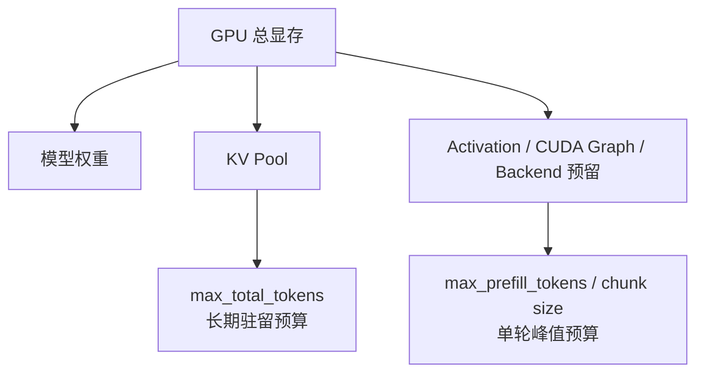
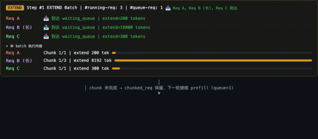
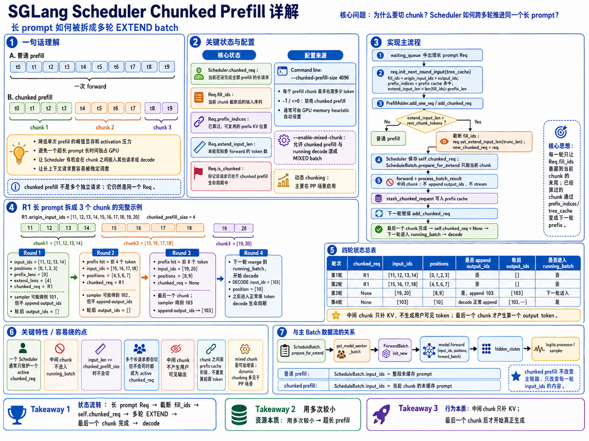
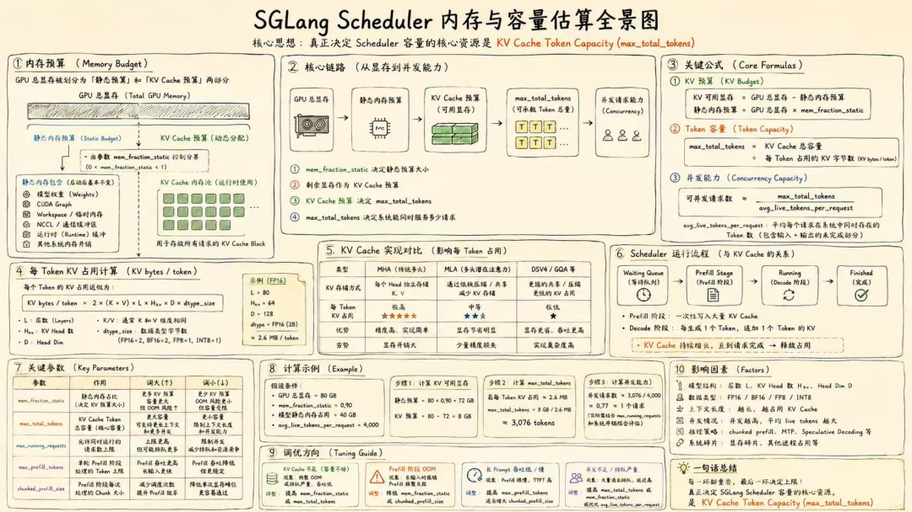
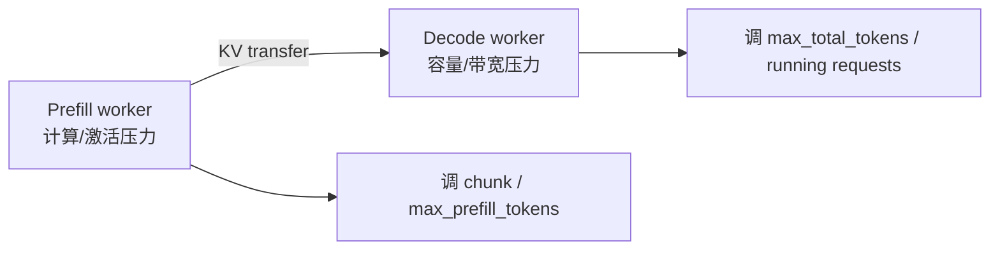
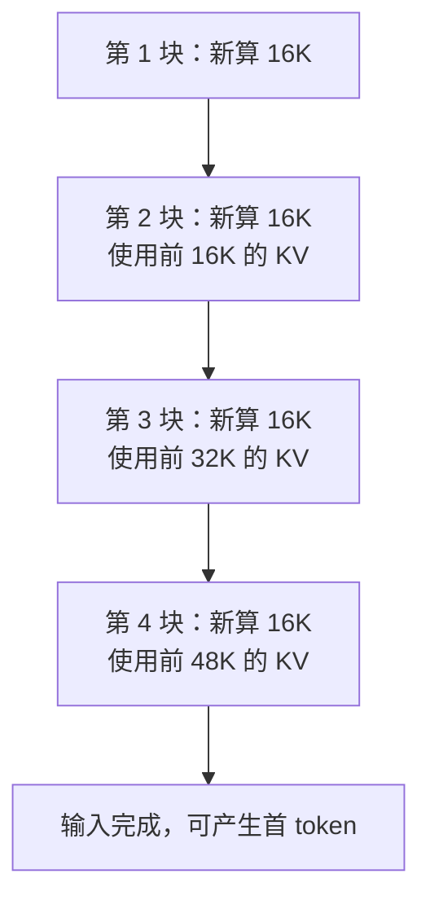
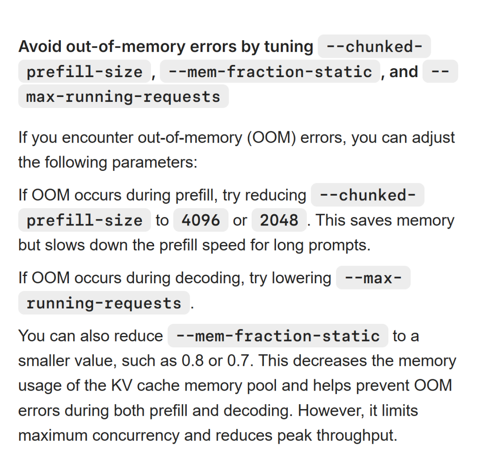
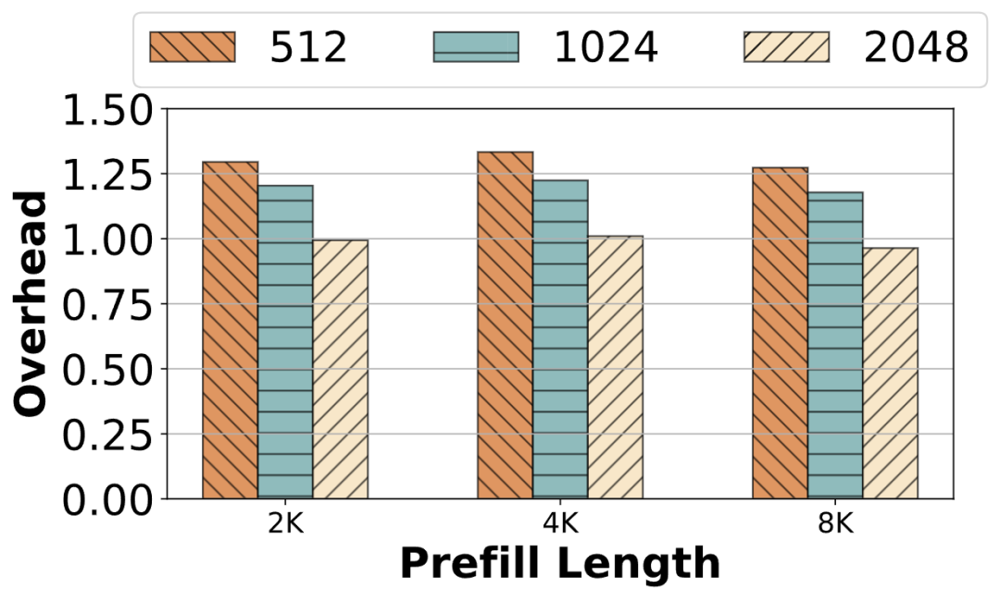
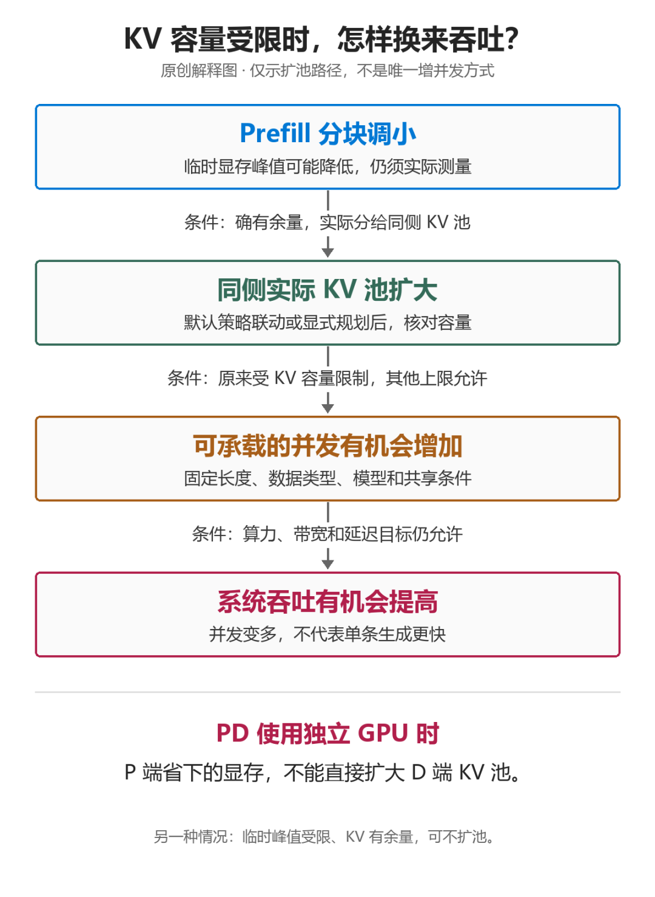
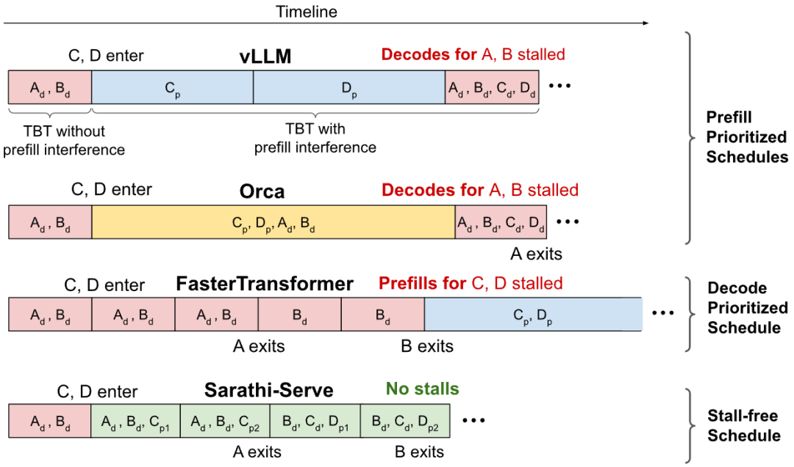

# SGLang Chunked Prefill 与调度器显存预算学习文档

本文面向第一次调 SGLang 长上下文服务的同学，把两个经常分开讨论的问题放到一起：

1. 长 prompt 为什么要切成多个 Prefill chunk？
2. `mem_fraction_static`、`max_total_tokens`、`max_running_requests`、`max_prefill_tokens` 和 `chunked_prefill_size` 分别限制什么？

核心结论是：Chunked Prefill 管单轮计算时间片，KV token capacity 管请求能否长期驻留。减小 chunk 可以降低一次 Prefill 的峰值和阻塞，但不会让已经生成的 KV 消失。

本文是第三方资料整理型学习资料，并用本地 SGLang 源码抽查了 Chunked Prefill 的关键调度路径；它不是完整源码审计或容量承诺。

2026-09-09 补充“64K 调到 16K”的显存、PD 吞吐与数值边界，并按官方固定版本修正第 8.1 节的 chunk 共享额度示例。初学者可先读[调度机制总览与学习路线](<./SGLang 调度机制总览与学习路线.md>)。

> 历史基线说明：表中上游链接用于定位开源项目；本文的 `muxi-main` 是历史阅读分支，不表示该分支或提交属于官方 `main`。历史结论需按所列版本核对；当前开源实现请使用固定的官方源码链接。

## 0. 阅读基线与范围

| 项目 | 内容 |
| --- | --- |
| 原文一 | 《SGLang推理优化-Chunked Prefill》 |
| 链接 | https://mp.weixin.qq.com/s/ZeEt-AyxGXcXjPuk6jnAEg |
| 作者/账号 | kason_zhang / LLM高性能计算 |
| 发布时间 | 2026-06-09 |
| 原文二 | 《SGLang Chunked Prefill — 原理与代码实现》 |
| 链接 | https://mp.weixin.qq.com/s/od6pBMeNMPVlaQyTgTsbAQ |
| 作者/账号 | GrissomFI / AI 原力注入 |
| 发布时间 | 2026-06-13 |
| 原文三 | 《SGLang推理优化-Scheduler 内存和核心参数估算》 |
| 链接 | https://mp.weixin.qq.com/s/UqUroTBI5Hliheck6QRufg |
| 作者/机构 | LLM高性能计算 |
| 发布时间 | 2026-06-10 |
| 新增原文四 | [《Prefill chunk size 从 64K 调到 16K：省显存，也能提吞吐吗？》](https://mp.weixin.qq.com/s/8fPRQaX8ik03r4yAtmRMjA) |
| 作者/账号与发布时间 | 魏新宇 / 大魏分享；2026-09-07 22:53:53（Asia/Shanghai） |
| 资料类型 | 技术博客、机制图与论文图整理 |
| 读取时间 | 前三篇初次整理 2026-08-03；第四篇读取及本文修订 2026-09-09 |
| 整理范围 | Chunked Prefill 生命周期、KV 容量估算、核心调度参数、PD 两侧调参 |
| 不展开内容 | 全量源码逐行审计、DSV4 精确 pool 实现证明、自动调参脚本交付 |
| 验证边界 | 调度结论做静态源码抽查；公式与性能数字仍需用目标部署验证 |

**2026-08-03 本地源码抽查基线**

| 项目 | 内容 |
| --- | --- |
| 项目上游 | [sgl-project/sglang](https://github.com/sgl-project/sglang) |
| 分支 | `muxi-main` |
| commit | `453b33c46be575da6973b31c2d89d9455679110d` |
| 工作区状态 | 有本地修改与未跟踪文件；本文只读，不清理、不修改 |
| 抽查范围 | `server_args.py`、`scheduler.py`、`schedule_policy.py`、`scheduler_output_processor_mixin.py` |
| 运行验证 | 未运行服务或 benchmark |

**2026-09-09 补充抽查基线：** 按第四篇明确引用的官方 commit `6e312af8c25ccedd1dcd2583358be038ab4875b0` 读取 `PrefillAdder`、显存配置钩子、PD Prefill 发送和 AITER 特定分支。使用固定版本临时文件，无分支检出，未修改本地 SGLang 仓库。读取目录与完整边界见[总览基线](<./SGLang 调度机制总览与学习路线.md>)第 0.3 节。本文未重新核验前三篇的所有 benchmark，不将历史本地分支和本次官方快照混成同一基线。

第四篇的四张图均已下载并逐张理解；论文图另核对 Sarathi-Serve v3。原图 URL、出处、SHA256 见[配图记录](../../images/sglang-chunk-size-tradeoffs/SOURCES.md)。

### 怎么读本文

1. 第 1～4 节看一条长请求怎样跨轮推进。
2. 第 5～7 节建立显存与 KV 容量公式。
3. 第 8、9 节分清五个核心参数。
4. 第 10～12 节用于部署与排障。

### 术语速查

| 术语 | 人话解释 |
| --- | --- |
| `fill_ids` | 当前请求用于建立本轮输入视图的完整 token 序列 |
| `prefix_indices` | 已命中、无需本轮重算的 KV slots |
| `extend_input_len` | 本轮真正需要新 Prefill 的 token 数 |
| `chunked_req` | 尚未完成全部 Prefill 的长请求 |
| `max_total_tokens` | GPU KV pool 可容纳的 token/slot 总容量 |
| `max_running_requests` | 允许处于运行态的请求数上限 |
| `max_prefill_tokens` | 一轮 EXTEND batch 的总输入 token 预算 |
| `chunked_prefill_size` | 影响本轮可用 chunk 额度；长请求从剩余额度取片段，多请求不各领一份 |
| `mem_fraction_static` | 权重与 KV 等静态占用希望覆盖的显存比例 |
| Live tokens | 活跃请求当前必须保留 KV 的 token 数 |

## 1. 先建立两条预算线



人话版：

- `max_total_tokens` 像仓库总容量，决定同时能保存多少请求历史。
- `chunked_prefill_size` 像一次搬运的车容量，决定长 prompt 每趟搬多少。
- 车变小能降低每趟拥堵，但货最终仍要进仓库。

## 2. Chunked Prefill 的请求生命周期

### 2.1 原始动画



**图意解读：** 动画展示长 Prefill 被拆成多轮 EXTEND，并在轮次边界重新参与调度。图中队列变化属于控制面；每个 chunk 对应的数据面仍是正常模型 forward 和 KV 写入。动画用于理解时间片，不保证当前版本一定以相同顺序混合 Decode。

### 2.2 原文总览图



**图意解读：** 图把配置、请求字段、三轮 EXTEND 和最终 Decode 放在同一张地图里。控制面由 `Scheduler.chunked_req`、`PrefillAdder` 与缓存索引串起；数据面仍是每轮正常 forward 和 KV 写入。未完成 Prefill 的长请求不能提前成为普通 Decode 请求；启用 mixed chunk 时，是把其他已可 Decode 的请求混入 EXTEND，不是让未读完 prompt 的请求提前生成。

### 2.3 四个关键字段

| 字段 | 本轮前 | 截断后 | 下一轮 |
| --- | --- | --- | --- |
| `fill_ids` | 完整输入 + 已有输出 | 只保留到本 chunk 末尾的工作视图 | 重新恢复完整序列 |
| `prefix_indices` | Radix/HiCache 命中 | 保持已命中的 slots | 加上前一 chunk 已缓存部分 |
| `extend_input_len` | 所有未算 token | 不超过 chunk 额度 | 重新计算剩余量 |
| chunk 状态 | 未完成 | 标记仍需继续 | 最后 chunk 后清零 |

### 2.4 一个 20K 未命中的例子

假设：

```text
已命中前缀 = 100K
未计算后缀 = 20K
chunked_prefill_size = 8192
```

| 轮次 | 本轮 `extend_input_len` | 累计完成 | 剩余 |
| --- | ---: | ---: | ---: |
| 1 | 8192 | 8192 | 11808 |
| 2 | 8192 | 16384 | 3616 |
| 3 | 3616 | 20000 | 0 |

每轮只为新增部分运行 Prefill；前面已经完成的 100K + chunk 会通过前缀索引供下一轮读取。

## 3. 为什么 chunk 间要 stash 和重新匹配

### 3.1 Stash 的作用

前一 chunk 已经写入 GPU KV，但如果不把“token 序列 -> slots”登记回缓存索引，下一轮就不知道它是可复用前缀。

抽象过程：

```text
chunk N forward 完成
-> 把已完成 token 与 KV slots 插入/更新 tree cache
-> 下一轮恢复完整 fill_ids
-> 再 match_prefix
-> 只对剩余后缀 EXTEND
```

### 3.2 为什么中间 chunk 不给用户输出

Prefill 中间 chunk 的任务是补齐 prompt 历史，不代表完整 prompt 已经处理完。若把中间采样结果追加为输出：

- 后续 `fill_ids` 会混入并非用户可见的 token；
- 最终生成语义错误；
- 流式客户端会提前看到无效结果。

只有最后一个 chunk 完成后，请求才具备进入正常 Decode 的条件。

### 3.3 调度顺序的版本边界

原文分析的代码路径表现为 Prefill-first，且存在 `chunked_req` 时会优先使它继续，从而让多个 chunk 连续执行；新到达短请求仍可能被打包进后续 EXTEND batch。2026-08-03 抽查的本地源码先调用 `get_new_batch_prefill()`，只有没有 Prefill batch 时才走 `update_running_batch()`，所以这个结论对默认非 mixed 路径仍成立。

不要把它泛化为：

```text
chunk1 -> decode -> chunk2 -> decode
```

该本地版本同时存在 `--enable-mixed-chunk`、prefill delayer 和 PP dynamic chunking。打开 mixed chunk 且兼容条件满足时，Scheduler 会调用 `mix_with_running()`，把 running Decode 合进 EXTEND batch。稳定结论只有：

> 切 chunk 把一次不可抢占的长 forward 变成多个可重新做调度决策的边界。

### 3.4 2026-08-03 本地源码锚点

| 行为 | 源码锚点 | 抽查结论 |
| --- | --- | --- |
| 初始化 | `scheduler.py::init_chunked_prefill` | 一个 `chunked_req` 主槽位；mixed 由显式开关控制 |
| 每轮选 batch | `scheduler.py::get_next_batch_to_run` | 默认先尝试 Prefill，再尝试 Decode |
| 续传 chunk | `scheduler.py::_get_new_batch_prefill_raw` | 先恢复完整输入，再用 `add_chunked_req` 推进 |
| mixed batch | `scheduler.py` 的 `Mixed-style chunked prefill` 分支 | 满足条件时 `mix_with_running()` |
| 截断与所有权 | `schedule_policy.py::add_one_req` / `add_chunked_req` | 单一 chunk 槽位，截断受预算和对齐约束 |
| 中间结果 | `scheduler_output_processor_mixin.py::process_batch_result_prefill` | 中间 chunk 不作为正常生成 token 对外输出 |
| 参数校验 | `server_args.py` | 普通路径要求 chunk size 可被 page size 整除；dynamic chunking 面向 PP |

## 4. `PrefillAdder` 在决定什么

### 4.1 不是简单截断

它同时要满足：

```text
本轮总 Prefill token 预算
本轮共享的剩余 chunk 额度
KV 可分配 slots
request pool slots
running batch 的未来 Decode 预留
page 对齐与特殊模型约束
```

### 4.2 新请求和续传请求不同

| 路径 | 目标 |
| --- | --- |
| 新请求 `add_one_req` | 判断能否接纳；必要时把它变成新的 chunked request |
| 续传 `add_chunked_req` | 优先推进已经开始的长请求，避免状态长期悬挂 |

续传请求若完全受普通 waiting 顺序影响，可能长期持有前缀资源却无法完成 Prefill。

### 4.3 page 对齐

若 KV allocator 以 page 管理，非最终 chunk 通常要落在合法 page 边界。对齐减少：

- 半页状态；
- hash/共享边界不稳定；
- 回收与 I/O 的复杂度。

最后一段是否可部分页、怎样记录有效长度，依赖目标后端。

## 5. 从 GPU 显存推到 KV Token Capacity



**图意解读：** 图把模型权重、运行时预留、KV pool 和调度参数放在同一张容量表里。它的价值是展示计算顺序，不是给出适用于所有模型的固定比例；真正的权威值来自模型加载后的显存 profile 和初始化日志。

### 5.1 第一层近似

```text
post_model_free
= 模型加载后、KV pool 初始化前的每卡剩余显存

dynamic_reserve
= 激活 + CUDA Graph + backend 临时 buffer + 安全边界

kv_budget
= post_model_free - dynamic_reserve

max_total_tokens
≈ floor(kv_budget / bytes_per_token / page_size) * page_size
```

### 5.2 `mem_fraction_static` 的直觉

原文给出的 profile 思路可写为：

```text
kv_available
≈ post_model_free
  - pre_model_free * (1 - mem_fraction_static)
```

`1 - mem_fraction_static` 相当于留给动态计算的比例。提高它会：

- 增大 KV pool；
- 提高潜在并发；
- 压缩 activation/CUDA Graph 的安全空间；
- 增加 Prefill 或某些 backend OOM 风险。

### 5.3 为什么不能只看 `nvidia-smi` 空闲

部分显存可能必须留给：

- 最大 Prefill chunk 的中间激活；
- CUDA Graph capture/replay buffer；
- NCCL/通信；
- Attention/MoE workspace；
- allocator metadata 与碎片；
- 框架异步流水线。

把启动前看见的空闲显存全部塞进 KV，服务第一条长请求时就可能 OOM。

## 6. 每 token KV 字节数

### 6.1 MHA/GQA

粗略公式：

```text
bytes_per_token_per_gpu
≈ num_layers
  × num_kv_heads_per_gpu
  × (k_head_dim + v_head_dim)
  × kv_dtype_bytes

num_kv_heads_per_gpu
≈ num_kv_heads / attention_tp_size
```

若 K/V 维度相同，就是常见的：

```text
num_layers × num_kv_heads_per_gpu × 2 × head_dim × dtype_bytes
```

### 6.2 MLA

MLA 缓存压缩 latent 与 RoPE 相关部分，原文给出的近似是：

```text
bytes_per_token_per_gpu
≈ (kv_lora_rank + qk_rope_head_dim)
  × num_layers
  × kv_dtype_bytes
```

这说明“模型参数更大”不必然意味着“每 token KV 更大”；Attention 结构才是关键。

### 6.3 DSV4/混合稀疏状态

DeepSeek V4/R1 W8A8 一类后端可能同时维护：

- full/SWA KV；
- 不同压缩比例的 KV pool；
- indexer KV；
- ring/state buffers；
- 不同层组的不同容量。

此时不能用一个简单 `(K+V) × layers` 公式。原文提供了按 pool 折算 full-token capacity 的复杂模型，但它高度依赖当时的：

```text
backend 实现
模型 config
page_size
压缩比例
ring size
speculative mode
```

本文不把其中示例默认值写成通用配置。最稳妥的做法是用目标 commit 的 pool configurator 和启动日志反校准。

## 7. `max_total_tokens` 与 `max_running_requests`

### 7.1 前者是物理容量，后者是逻辑护栏

```text
max_total_tokens:
  所有活跃/受保护 KV slots 的容量上限

max_running_requests:
  Scheduler 最多允许多少请求处于运行集合
```

请求数相同，长度不同，KV 压力可以相差几十倍。因此请求上限不能替代 token 容量。

### 7.2 业务并发估算

```text
business_capacity
≈ max_total_tokens / avg_live_tokens_per_request
```

例如：

```text
max_total_tokens = 760K
平均 live tokens = 4096
理论均值容量 ≈ 185 requests
```

生产上还要为 P95/P99 长请求、page 浪费、缓存保留和突发留安全边界。

### 7.3 为什么框架解析出的请求上限可能很大

框架内部默认值往往是对象池/调度结构的上限估计，不代表业务能让每个请求都长期占 4K、16K 或 128K KV。应取：

```text
建议 running 上限
= min(
    框架 resolved 上限,
    KV 业务容量,
    目标并发,
    latency SLO 下的压测上限
  )
```

## 8. 五个参数各管什么

| 参数 | 约束对象 | 调大可能带来 | 调大可能付出 |
| --- | --- | --- | --- |
| `mem_fraction_static` | 权重 + KV 静态预算 | 更多 KV 容量 | 动态 OOM 风险 |
| `max_total_tokens` | KV token pool | 更多 live tokens | 若超过 profile 会被限制或 OOM |
| `max_running_requests` | 活跃请求数量 | 更高并发上限 | retract、ITL 抖动 |
| `max_prefill_tokens` | 一轮所有 EXTEND token | Prefill 吞吐 | 单轮阻塞与激活峰值 |
| `chunked_prefill_size` | 本轮 chunk 额度及长请求分段 | 可能减少轮次、改善长请求吞吐 | 更高峰值与更长执行片段 |

### 8.1 一个容易混淆的关系

假设：

```text
max_prefill_tokens = 16384
chunked_prefill_size = 4096
```

**2026-09-09 修正：** 不能据此推导一轮能放四个各 4096-token 的 chunk。固定版 [`PrefillAdder`](https://github.com/sgl-project/sglang/blob/6e312af8c25ccedd1dcd2583358be038ab4875b0/python/sglang/srt/managers/schedule_policy.py#L481) 持有 `rem_chunk_tokens`；构造时可先减去 mixed Decode token，接纳请求后继续扣减同一份余量。

教学例子：假设普通路径、关闭 mixed、无命中、页对齐满足、KV 与请求槽位都充足，初始 chunk 余量为 4096：

| 接纳步骤 | 新 Prefill token | 剩余 chunk 额度 |
| --- | ---: | ---: |
| 短请求 R1 | 1000 | 3096 |
| 短请求 R2 | 1000 | 2096 |
| 长请求 R3 的本轮片段 | 最多 2096，实际还受页对齐影响 | 至少 0 |

这里的 token 数只说明共享扣账，不是生产配置。若 R1 已消耗整份 4096 额度，就不能因为 `max_prefill_tokens=16384` 再发给 R2 一份 4096。不同预算同时存在，不等于可以相乘；特殊模型、SWA 和动态 chunk 路径还可能调整截断规则。

源码对应：构造函数处理 `num_mixed_decode_tokens`，`_update_prefill_budget()` 扣减本轮 `extend_input_len`；`add_chunked_req()` 与 `add_one_req()` 再受 KV、页边界和特殊状态约束。最终以所选路径计算出的余量为准。

## 9. 原文 Chunk Benchmark 的边界

原文报告的条件：

```text
模型：Qwen3.5-122B-A10B
硬件：8 × H100
HiCache：write_through
请求数：1600
比较：chunk 8192 vs 16384
```

原文结果：

| 指标 | 8192 | 16384 | 原文变化 |
| --- | ---: | ---: | ---: |
| Prefill batch 数 | 2214 | 1785 | -19.4% |
| 整体 TPS | 19589 | 22314 | +13.9% |
| 运行时间 | 106 min | 91 min | -14.2% |
| TPOT P50 | 19.6 ms | 19.9 ms | +1.5% |

可以从中学习的机制是：

> 大 chunk 减少分段和调度次数，在该离线/高负载配置中提高吞吐，同时让单次 Prefill 更长。

不能泛化为“把 chunk 翻倍总能提升 14%”。模型、请求长度、GPU、HiCache I/O、并发和 TTFT/ITL SLO 都会改变结果。

## 10. PD 分离时两侧为什么不同

### 10.1 Prefill worker

更关注：

- 长 prompt activation 峰值；
- chunk 大小与 TTFT；
- 单轮 Prefill token；
- KV 传输前的 staging。

调参通常更保守地给动态显存留余量。

### 10.2 Decode worker

更关注：

- 最大 live KV；
- running 请求数；
- ITL；
- 长生成尾部；
- 接收 KV 后的持续驻留。

Decode 侧可能愿意把更高比例显存给 KV，但仍需保留 CUDA Graph、Attention/MoE workspace。



具体比例不能从一篇文章复制；应分别 profile 两种角色。

这里还要区分两种“PD”：本节是把 Prefill、Decode 放到不同 worker 的 **PD 分离**；把 Prefill chunk 与 Decode token 合到同一次 forward 的 **P-D 共推**，见 [Chunked Prefill 与 Prefill-Decode 共推学习文档](../../llm-inference/scheduling/Chunked%20Prefill%20与%20Prefill-Decode%20共推学习文档.md)。

## 11. 与 HiCache 的协同

Chunked Prefill 每完成一段，就可能把它登记为下一轮可命中的本地前缀。HiCache 再把这个索引扩展到 L2/L3：

```text
第 N 轮前:
  命中历史前缀 + chunk 1..N-1

第 N 轮:
  只为 chunk N 分配 L1 slots 并计算

第 N 轮后:
  将新完成部分写入缓存索引
  按策略备份到 L2/L3
```

注意：

- Load-back 必须在 forward 需要数据前完成。
- L2/L3 命中减少重算，但搬运也占带宽和时间。
- `write_through` 的 I/O 可能改变 chunk benchmark。

HiCache 详情见：

- [SGLang KV Pool、请求视图与 HiCache 工程学习文档](../kv-cache/SGLang%20KV%20Pool、请求视图与%20HiCache%20工程学习文档.md)
- [Mooncake 与 SGLang HiCache 学习文档](../kv-cache/Mooncake%20与%20SGLang%20HiCache%20学习文档.md)

### 11.1 HiCache 命中怎样进入本轮预算

**固定源码补充（2026-09-16）：** 以下采用官方快照 `72d5c5bb73`，与本文原始文章版本分开；详见 [HiCache 前缀命中源码学习文档](<../kv-cache/HiCache 前缀命中源码学习文档.md>) 的基线与第 7 节。

`PrefillAdder.add_one_req` 可以先用 Host 命中估算需要新算的输入，但它仍检查总 KV 预算，并在 `init_load_back` 返回后根据真实 `prefix_indices` 重算剩余输入。Host 数据恢复到 GPU 仍占设备槽位；输入预算节省与 KV 空间需求不能混成一个数字。

| 阶段 | 需要分清的数值 |
| --- | --- |
| 匹配后 | 设备前缀长度、Host 候选命中长度 |
| 回载准备后 | 实际新设备索引长度、剩余输入长度 |
| chunk 选择 | 本轮剩余 chunk/输入预算，以及页对齐后的资源记账 |
| forward 前 | 对应 batch 的 H2D consumer index 与逐层事件 |

教学例子：请求 1,041 token，设备已有 512，Host 可恢复另外 512。若回载成功，剩余计算 17 token；page_size=16 时相应输入预算可能按 32 记账。若回载失败，则不能继续用“17”决定本轮计算量。

完整 D2H、预取、回载和引用生命周期见 [HiCache 下 SGLang L1、L2、L3 与上传回载源码学习文档](<../kv-cache/HiCache 下 SGLang L1、L2、L3 与上传回载源码学习文档.md>)。这段补充没有进行性能或 OOM 实验。

## 12. 调参和排障地图

### 12.1 建议顺序

1. 固定模型、dtype、Attention backend 和并行方式。
2. 从启动日志取得模型加载后剩余显存。
3. 确认实际 `max_total_num_tokens` 和 page size。
4. 用真实 live-token 分布估算运行并发。
5. 再调 `max_prefill_tokens` 与 chunk。
6. 压测 TTFT、ITL、吞吐、OOM、retract 和 HiCache I/O。

### 12.2 现象反查

| 现象 | 优先检查 | 调整方向 |
| --- | --- | --- |
| Prefill OOM | activation 峰值、静态比例、CUDA Graph | 降 chunk、降 prefill budget、降静态比例 |
| Decode 容量不足 | KV token capacity、live-token 尾部 | 增 KV 预算或降 running |
| 频繁 retract | running 上限、平均/尾部长度 | 降并发、留更多 KV |
| Decode ITL 尖峰 | 是否与大 Prefill 同步 | 降 chunk 或用 PD |
| 长 prompt 吞吐低 | Prefill batch 数、GPU 利用率 | 显存允许时增 chunk |
| `max_total_tokens` 比估算低 | 权重实际占用、backend buffer、page 对齐 | 用启动 profile 重算 |
| HiCache 命中仍慢 | L2/L3 带宽、prefetch wait | 区分命中与数据 ready |

## 13. 常见误解

### 误解一：Chunked Prefill 节省最终 KV 容量

它主要降低单轮计算峰值。完整 prompt 的 KV 最终仍需保存，除非另有稀疏、压缩或 offload。

### 误解二：`max_running_requests` 就是并发能力

它是请求数量护栏。真正容量由 live-token 分布和 `max_total_tokens` 决定。

### 误解三：`mem_fraction_static` 越高越好

它会挤压 activation/CUDA Graph/通信 workspace。启动成功不代表长 Prefill 不会 OOM。

### 误解四：文章中的 DSV4 公式适用于所有版本

复杂 pool 的字段、默认 page size 和压缩比例会变。必须以目标实现为准。

### 误解五：切成 chunk 后，每段之间一定会执行 Decode

chunk 只提供重新调度的边界。本文抽查的普通非 mixed 主线仍是 Prefill-first；只有 mixed chunk 开启且输入、logprob、speculative 等兼容条件允许时，Prefill 与 running Decode 才会同轮执行。

## 14. 64K 调到 16K：一条请求究竟改变了什么

本节起主要整理第四篇文章，并补充官方静态核对。这里 64K、16K 分别表示 **65,536、16,384 tokens**，仅作机制示例，不是两组测得成绩。

### 14.1 分块的是新计算，历史状态继续累积

假设一条 65,536-token 输入，无缓存命中，每轮都能取得足够预算，不考虑其他请求：

| chunk 上限 | 完成输入的理想轮数 | 完成 Prefill 后的逻辑历史 |
| --- | ---: | ---: |
| 65,536 | 1 | 65,536 tokens |
| 16,384 | 4 | 65,536 tokens |



**图意解读：** 这是整理者针对完整因果注意力绘制的逻辑数据流。每一块都保留相同的历史依赖，并非四个互相隔离的 16K 上下文；SWA、稀疏或混合模型仍按其自身规则访问历史。多请求时，还须按第 8.1 节共享剩余额度，不能保证每轮拿满 16K。

### 14.2 峰值显存和最终 KV 分开记账



**图意解读：** 图中的三类参数分别影响单轮 Prefill、静态显存分配与运行请求上限。对长输入缩小 chunk 可以减少临时峰值，但也可能减慢 Prefill；图内 4096/2048 是官方说明中的示例，不能直接迁移成所有部署的推荐值。[固定版官方调优文档](https://github.com/sgl-project/sglang/blob/6e312af8c25ccedd1dcd2583358be038ab4875b0/docs/docs/advanced_features/hyperparameter_tuning.mdx#avoid-out-of-memory-errors-by-tuning---chunked-prefill-size---mem-fraction-static-and---max-running-requests)

需要分开两种限制：

- **临时峰值先触顶，KV 池仍有余量：** 缩小 chunk 后若实际峰值下降，可能让原来会 OOM 的负载完成，无需先扩 KV 池。
- **长期 KV 容量先耗尽：** 仅降低临时峰值没有改变每个请求保留的历史长度。要增加容量，还需同侧实际扩池，或在相同语义下通过前缀共享等方式降低新增物理占用。

共享前缀只计算一份物理 KV 时，不能把所有请求的逻辑长度简单相加当显存占用；反过来，缓存命中率变化也会让两组 chunk 测试失去可比性。

### 14.3 轮数变四倍，不等于耗时变四倍

分块增加调度、元数据、kernel 启动和读取历史 KV 的机会，并改变矩阵乘形状。它没有把已经完成的历史 token 每轮重新完整 Prefill 一遍。实际性能还取决于算子利用率、后端和缓存路径。



**图意解读：** 横轴是输入长度 2K/4K/8K；三组柱是 chunk 512/1024/2048；纵轴为相对不分块 Prefill 的耗时，1 表示相当。来源是 Agrawal 等 [Sarathi-Serve v3 Figure 14、§5.4.1](https://arxiv.org/html/2403.02310v3#S5.SS4.SSS1)，对应 Yi-34B、TP2。图说明该配置下小块执行有额外成本，不能用于预测 SGLang 的 16K/64K 差值，也不是本文复现实验。

### 14.4 只改一个 CLI 参数，也可能改变多个实际配置

官方固定版 [`handle_gpu_memory_settings()`](https://github.com/sgl-project/sglang/blob/6e312af8c25ccedd1dcd2583358be038ab4875b0/python/sglang/srt/arg_groups/memory_hook.py#L246) 有明确分支：

| 条件 | chunk 与定容的关系 |
| --- | --- |
| 未显式给 `mem_fraction_static`，不走捕图后定容，且非纯 Decode | chunk 可参与 activation 预留量估算，进而影响默认静态比例 |
| 显式指定 `mem_fraction_static` | 不能套用上述默认比例派生分支 |
| 走捕图后定容 | 使用捕图后测得的可用空间等信息，跳过该分支的图/激活预留估计 |
| 纯 Decode | 用运行请求数与 draft token 等因素估计，不按 Prefill chunk 的同一公式 |

这里的预留是启发式，不能把估算项直接当成“实测省下多少字节”。同文件还会在条件满足时从 chunk 派生 Prefill 图捕获规模，见[图配置分支](https://github.com/sgl-project/sglang/blob/6e312af8c25ccedd1dcd2583358be038ab4875b0/python/sglang/srt/arg_groups/memory_hook.py#L196)。应记录最终生效参数、实际 KV pool 容量及图配置。

## 15. 从单次 Prefill 走到 PD 全链路吞吐

### 15.1 同一侧显存，才能谈同一侧扩池



**图意解读：** 这是第四篇作者绘制的解释图，非本文生成图或测量结果。每个箭头都需要条件：实际有余量、余量进入同侧池、原限制确实是容量、其他计算与延迟约束仍满足。P/D 使用独立 GPU 时，P 省下的空间不会扩大 D 的 KV 池。图底部还保留了另一条路径：KV 有余量时，可仅通过降低临时峰值解除 OOM。

计算 chunk 与网络传输单位也应拆开。固定版 [`send_kv_chunk()`](https://github.com/sgl-project/sglang/blob/6e312af8c25ccedd1dcd2583358be038ab4875b0/python/sglang/srt/disaggregation/prefill.py#L1229) 对非最终块的发送边界作 page 对齐；计算分四轮，不代表 KV 总字节数只剩四分之一，更不代表一块等于一个网络包。D 必须满足所选协议的 KV/状态就绪条件，才能继续请求。

### 15.2 分块提供机会，调度策略决定机会怎样使用



**图意解读：** A/B 是已经生成的请求，C/D 是新到请求；`p` 表示 Prefill，`d` 表示 Decode。下方通过有限 Prefill 片段和已有 Decode 同批，减少生成停顿。该图来自 [Sarathi-Serve v3 Figure 7](https://arxiv.org/html/2403.02310v3#S3.SS2)，展示论文中的历史机制，不能当成当前 vLLM、SGLang 或其他框架的排名。

将长 Prefill 切成多轮，只是缩短不可重新决策的窗口。要减少正在生成请求的停顿，还要有合适的混批或阶段选择策略。Sarathi 的结果属于研究中的组合设计；在 SGLang 中只改 chunk，不能承诺相同收益，更不能默认每两块之间都会执行 Decode。

### 15.3 全链路先看瓶颈，再解释并发

整理者的容量近似，假设固定 ISL/OSL 分布、没有丢请求、供给充分，并将各阶段单位统一为“请求/秒”：

```text
可持续完成 QPS ≤ min(P 处理能力, KV 传输能力, D 处理能力)
```

教学例子：P 最多 4 请求/秒，D 最多 10 请求/秒，传输充足，完成量不可能长期超过 4。只有 P 实际提升到 8 后，全链路才有机会接近 8；D 的单 token 计算不必变快。这个例子没有声称“调小 chunk 会让 P 从 4 变 8”。

请求更多同时留在系统里，可能表示排队更长。要宣布可持续能力提高，必须同时看完成率、TTFT/ITL、失败/拒绝和队列是否持续增长；不能以发送 QPS 或并发上限替代完成吞吐。

## 16. 数值路径与对照方法

### 16.1 数学目标相同，不代表每次生成逐字相同

chunk 不主动改变上下文规则或缓存 dtype，但会改变算子形状、批组成与可能使用的 kernel。浮点归约顺序等变化可能放大为后续生成差异；相同采样设置也不自动保证所有路径的逐位一致性。参考[固定版确定性说明](https://github.com/sgl-project/sglang/blob/6e312af8c25ccedd1dcd2583358be038ab4875b0/docs/docs/advanced_features/deterministic_inference.mdx)。

第四篇给出一个更具体的例子，本次静态核对成立，但范围必须完整保留：

| 前提或分支 | 固定版观察 |
| --- | --- |
| 调用确实进入非 MLA 的 `AiterAttnBackend.forward_extend` 中 `vectorized_5d` helper | 更早返回的专用路径不适用本例 |
| `extend_prefix_lens_cpu` 存在且整批历史长度均为零 | helper 可直接使用当前 K/V 的路径 |
| 整批至少一条请求已有历史 | helper 改为从 KV 池收集数据的路径 |
| 上述池读取路径且缓存为 FP8 | 代码包含将 Q 转为相应 FP8 dtype 的操作 |

源码：[helper 的无历史分支](https://github.com/sgl-project/sglang/blob/6e312af8c25ccedd1dcd2583358be038ab4875b0/python/sglang/srt/layers/attention/aiter_utils.py#L85)、[FP8 Q 转换](https://github.com/sgl-project/sglang/blob/6e312af8c25ccedd1dcd2583358be038ab4875b0/python/sglang/srt/layers/attention/aiter_utils.py#L162)、[调用入口](https://github.com/sgl-project/sglang/blob/6e312af8c25ccedd1dcd2583358be038ab4875b0/python/sglang/srt/layers/attention/aiter_backend.py#L2908)。

因此，关闭跨请求前缀缓存，仍不能消除本请求前一 chunk 产生的历史。这个特定 FP8 例子也不能拿来解释 BF16 KV 的测试。输出变化与准确率降低是两种结论，后者需要同一评测集、分母与重复实验支持。

### 16.2 先选清楚对照问题

以下是**建议的实验设计，未执行**，不构成已验证的运行手册。

| 对照目标 | 固定什么 | 允许改变什么 | 必须报告 |
| --- | --- | --- | --- |
| 隔离 chunk 对计算的影响 | 固定 commit、权重、后端、dtype、输入/长度分布、缓存状态、实际 KV 池、其余调度配置 | chunk；无法固定的图/内核派生变化须单列 | Prefill 耗时、峰值、实际执行批与最终配置 |
| 评估保留自动配置的整体部署效果 | 固定模型、硬件和负载协议 | chunk 及它触发的默认配置联动 | 静态比例、实际池容量、图捕获变化、吞吐与延迟 |
| 验证省显存能否换并发 | 先确定瓶颈是临时峰值还是长期 KV | 明确记录的并发或同侧容量调整 | 成功/失败、retract、KV 与峰值、TTFT/ITL |
| 检查数值与精度 | 相同 token 前缀、权重、dtype、采样、评测协议 | 待研究的 chunk 与派生路径 | logits/分数差异、输出差异、准确率与运行间波动 |

每组都应完成模型/执行图预热，同时独立控制前缀缓存的冷暖。热缓存需固定前缀、请求顺序及路由，并核对实际命中；仅仅“服务已预热”不足以说明前缀缓存相同。

### 16.3 闭环吞吐与开环容量分别测

| 负载协议 | 控制量 | 适合回答 |
| --- | --- | --- |
| 闭环：完成一条再补一条 | 并发数 | 在该并发下完成多快、单请求等多久 |
| 开环：按外部节奏到达 | 到达率和到达分布 | 给定延迟目标下，队列是否稳定、可持续承载多少到达负载 |

不能同时把固定并发和固定到达率当作互不影响的独立变量。至少报告统计区间、成功/失败/拒绝数、输入吞吐、输出吞吐、完成 QPS、TTFT、TPOT、相邻 token 间隔分布、KV 使用和峰值显存。平均 TPOT 无法单独解释用户看到的停顿。

PD 还需观察 P/D 各自队列、KV 传输与接收就绪等待。跳过真实 Prefill 的 fake-prefill Decode 测试，不能替代端到端性能或真实 Prefill 数值验证。

## 17. 一句话总结

SGLang Chunked Prefill 用跨轮状态把长 prompt 切成可调度时间片；显存容量则由权重、动态预留、每 token KV 字节数和 page 对齐共同决定。先算 KV token capacity，再定运行并发，最后用 TTFT/ITL 与吞吐共同选择 chunk。

## 18. 参考与延伸

- 《SGLang推理优化-Chunked Prefill》：https://mp.weixin.qq.com/s/ZeEt-AyxGXcXjPuk6jnAEg
- 《SGLang Chunked Prefill — 原理与代码实现》：https://mp.weixin.qq.com/s/od6pBMeNMPVlaQyTgTsbAQ
- 《SGLang推理优化-Scheduler 内存和核心参数估算》：https://mp.weixin.qq.com/s/UqUroTBI5Hliheck6QRufg
- [《Prefill chunk size 从 64K 调到 16K：省显存，也能提吞吐吗？》](https://mp.weixin.qq.com/s/8fPRQaX8ik03r4yAtmRMjA)：新增第 14～16 节的第三方主来源。
- [Sarathi-Serve v3](https://arxiv.org/html/2403.02310v3)：第四篇引用的 Figure 7、Figure 14 与消融实验的一手出处。
- [原图与校验值](../../images/sglang-chunk-size-tradeoffs/SOURCES.md)。
- [SGLang 调度器请求生命周期与重叠调度学习文档](SGLang%20调度器请求生命周期与重叠调度学习文档.md)
- [Chunked Prefill 与 Prefill-Decode 共推学习文档](../../llm-inference/scheduling/Chunked%20Prefill%20与%20Prefill-Decode%20共推学习文档.md)

原文提到的估算脚本不在本仓库，本篇也未生成或验证该脚本。源码抽查只确认上述控制流和参数边界；所有性能与容量数值仍仅作估算起点。
