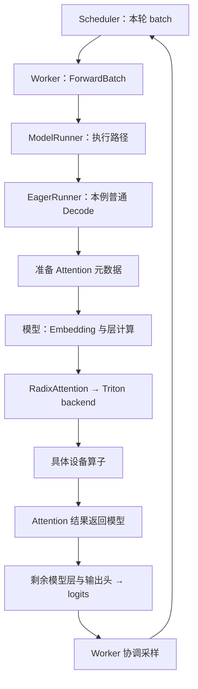
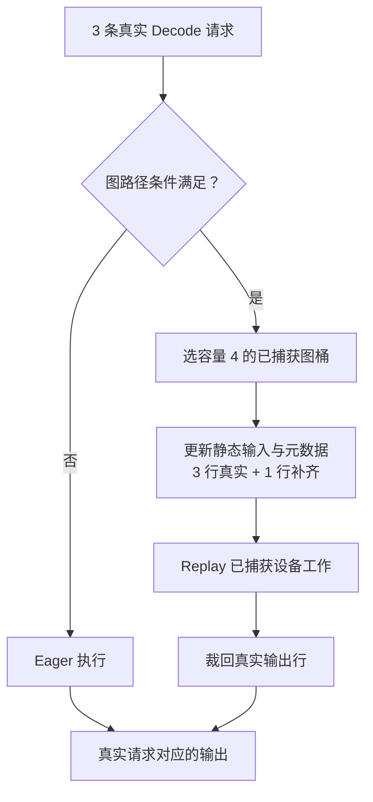

# SGLang 执行分层与硬件机制

一批输入要同时带着“算什么”和“去哪里读写”进入执行层。本文是源码分析型学习资料，追踪普通 Decode 如何经过 Worker、Runner、模型、Attention backend 和设备算子，再观察 CUDA Graph 的形状约束与计算、访存之间的取舍。

[交互课程](https://asher-xunzhang.github.io/ai-infra-wiki/sglang/model-execution/) · [运行时导航](README.md)

## 0. 基线与范围

| 项目 | 内容 |
| --- | --- |
| 公开源码 | https://github.com/sgl-project/sglang |
| 分支 / commit | 公开上游 main 快照 `279339f113b79af84f27fd3ac92d0a13bd3f4cbd` |
| 读取时间 | 2026-09-23 |
| 工作区状态 | 读取本地 Git 固定对象；原检出分支另有未跟踪文件，保留且不纳入源码事实 |
| 主线 | 普通文本生成、单 rank、无 overlap、无投机、非 prefill-only；Llama 风格网络与 Triton Decode 后端代表路径 |
| 对照 | 普通 Decode 的 CUDA Graph 资格、补齐与输出裁剪；单线性层理想成本 |
| 操作边界 | 只读源码与仓内资料，构建独立教学模型并检查页面；未运行 SGLang、模型或 GPU 实验 |

先修：[推理全景](<SGLang 推理全景学习指南.md>)、[普通请求运行时](<SGLang 普通请求运行时与资源生命周期学习文档.md>)。仓内 [执行架构导读](../source-study/architecture/06-模型执行与算子分层.md)、[Worker 与 ModelRunner](../source-study/05-model-execution/01-Worker与ModelRunner执行边界.md)、[Attention 元数据](../source-study/05-model-execution/03-Attention后端与执行元数据.md) 提供了完整阅读主线，保留其原有固定提交；本篇重新核对了下文列出的调用点。

## 1. 从一批请求到设备工作

Scheduler 已经决定这轮谁执行。Worker 将该决定整理成执行输入；Runner 选择执行路径；模型描述网络运算；Attention backend 准备并消费自己的索引；具体 kernel 完成设备工作。几个对象之间的调用，不代表跨了几个网络进程。



图意：图刻意画出“算完 Attention 后还要返回模型”。Attention 输出不是词表分数，更不是最终回答；输出投影、残差、MLP、后续层和输出头仍有自己的计算。交互版本每次只展示一段交接，避免把完整调用栈挤在同一屏。

- `Scheduler.run_batch` 是执行提交入口。[scheduler]
- `TpModelWorker.forward_batch_generation` 在传入 ScheduleBatch 时调用 `ForwardBatch.init_new`，随后调用 `ModelRunner.forward`。[worker][input]
- `ModelRunner._forward_raw` 先判断对应图路径，普通回退最终进入 EagerRunner；不是所有模式都沿同一个分支。[runner]
- `EagerRunner._execute_decode` 按 `needs_forward_metadata_init()` 条件准备元数据，再调用模型。已有规划等路径可能跳过重新初始化，不能说每次都新分配。[eager]
- `LlamaDecoderLayer.forward` 包含 Attention 和 MLP；模型层经 `RadixAttention` 接口进入当前 backend。[layer][attention]
- Triton backend 的普通 Decode 代表路径把 Q、每层 K/V buffer、`kv_indptr`、`kv_indices` 等交给 `decode_attention_fwd`。该 Python 入口还会按条件分发具体 kernel，并不等于单一设备指令。[kernelCall][kernel]
- 模型输出头形成 logits；本篇普通非 overlap 路径随后采样下一 token。Verify、延迟采样、prefill-only、PP 非末 stage 等有不同尾部语义。[logits][sample]

## 2. 数据不能只画成一只不变的请求盒子

交互例有两条 Decode 请求，每条本轮处理一个新位置：

```text
R1：token ID 41，逻辑位置 p3，新 KV 槽位 11
R2：token ID 52，逻辑位置 p2，新 KV 槽位 13
```

这三组数字回答不同问题：token ID 用于模型输入；逻辑位置用于位置相关计算；KV 槽位表示池中的读写地址。数值为教学设定，不能互换或把槽号当词表编号。

为解释 Triton 索引，给 R1 分配读位置 `[2,7,9,11]`，给 R2 分配 `[4,8,13]`。按请求拼接后，分界是 `[0,4,7]`。`kv_indptr` 描述每条请求的片段，`kv_indices` 存对应地址；backend 从请求映射与长度准备这些索引。[metadata]

地址可以在新 K/V 值写入前准备好，前提是执行顺序保证读时内容有效。模型层计算 Q/K/V，backend 的保存路径将本轮 K/V 写入当前层对应位置，随后执行 Attention。索引准备与数据写入是两步；不要把“有地址”理解成“值已经生成”。

图中数据依次表现为请求成员、token/位置/槽位、分段索引、hidden states、Q/K/V、Attention 输出、logits、下一 token。最后用贪心选择作为教学例，R1 三个候选分数 `[1,4,2]` 选中第二项；真实采样还受参数、约束与其他处理影响，不能把贪心当所有请求的默认行为。

## 3. CUDA Graph：改执行方式，不改真实请求身份

打开配置不等于每个 batch 都能 replay。`can_run_graph` 会核对动态 embedding override、形状和其他模式条件；不满足时普通主线可以落到 Eager。[graphGate][runner]



图桶 `[1,2,4]`、允许补齐、普通 Decode 每请求一个输入位置，是交互的教学配置。`load_batch` 根据真实 batch 大小选择桶，记录真实 token 数；重放后普通 logits 按 `raw_num_token` 裁剪。[graphLoad][replay][trim] 3 条请求补成容量 4 后，虚线行不是 R4，不能进入对外回答。

切换到 5 条请求会超出本例最大图桶；关闭图 runner 或有效的动态 embedding 覆盖也会改变资格。后两者不是随机抛错开关，图只展示其导致图资格不满足的机制，不模拟 embedding 内容。

重放仍需更新当前输入与必要元数据，并真正执行设备工作。它不是返回上一轮答案。Eager 也可能复用静态缓冲区，不宜简单画成“Graph 有缓冲、Eager 没缓冲”。本例无并行补齐和投机宽度变化；完整路径见 [CUDA Graph 与执行模式](../source-study/05-model-execution/05-CUDAGraph编译与执行模式.md)。

## 4. 硬件直觉：权重复用后，哪一项更长？

本节是整理者构造的算术演示，补充参考 NVIDIA 官方性能文档。两份来源分别为 NVIDIA 的 [GPU Performance Background User’s Guide](https://docs.nvidia.com/deeplearning/performance/dl-performance-gpu-background/index.html) 与 [Matrix Multiplication Background User’s Guide](https://docs.nvidia.com/deeplearning/performance/dl-performance-matrix-multiplication/index.html)，类型为官方技术指南，读取于 2026-09-23；本篇仅引用成本估算方法，不复现其中设备跑分或配图。

只观察一个线性变换 `X[M,K] × W[K,N] → Y[M,N]`。令 K=N=4096，M 为本轮新位置总数。M 可以来自一段 Prefill，也可以来自多个 Decode 请求；它不是固定等于请求数。多行 X 复用同一份 W，权重矩阵大小不随 M 增长。

假定输入、权重和输出每元素均为 2 bytes，且理想情况下各访问一次：

```text
计算工作 = 2 × M × K × N FLOPs
读写数据 = 2 × (M×K + K×N + M×N) bytes
计算下界 = FLOPs / 算力
访存下界 = bytes / 带宽
理想下界 = max(计算下界, 访存下界)
```

这是成本下界示意，不是完整请求耗时模型。交互自设算力 8 TFLOP/s、带宽 100 GB/s；两个柱条共用时间比例，虚线保留原配成本。选择 M=1、16、256，以及算力或带宽翻倍，观察哪条缩短、哪条仍控制最大值。

在本例 M=1 时，理想访存项约 0.336 ms，大于计算项约 0.004 ms；只增加算力不改变最大值。M=256 时，计算项约 1.074 ms，大于访存项约 0.377 ms；只增加带宽同样不能缩短该最大值。数值完全来自上面的人为参数。

实际 kernel 可能重复读数据，也可能受缓存、启动延迟、并行度、形状和精度影响。公式尤其不能证明很小的 M 已充分利用设备，更不能覆盖 Attention 的历史 KV、通信、采样与调度。不要把“Prefill 一定计算受限、Decode 一定带宽受限”写成通用结论。真实瓶颈需要 [指标与性能定位](<../performance-engineering/SGLang 指标口径与性能定位学习文档.md>) 中的测量与 Trace 证据。

## 5. 回到代码与自测

1. Scheduler 选好的两条请求，哪一层把它们整理成模型需要的执行字段？
2. 已经有 Q/K/V，为什么仍需要长度、分段索引和层身份？
3. 为什么 kernel 输出还不能直接作为下一 token 返回？
4. 3 条请求补齐到 4 行，为什么输出仍只能对应 3 条请求？
5. 没走图重放，是否等于没有 GPU 计算？
6. 如果访存项控制理想下界，仅提高算力能证明端到端变快吗？

阅读顺序：Scheduler → Worker → Runner 分支 → Eager 元数据 → 模型层 → backend 调用 → kernel 入口 → 模型输出与采样。每次记录输入输出及控制权，不仅抄函数名字。

本篇检查独立模型中的真实请求守恒、补齐不外泄、图资格分支、成本公式和固定源码锚点，并通过浏览器观察图形。所有结果只证明资料和教学实现的一致性，不证明任何设备的实际吞吐或精度。

## 6. 固定源码锚点

| 标识 | 仓内路径 / 符号 |
| --- | --- |
| scheduler | [`python/sglang/srt/managers/scheduler.py::def run_batch`][scheduler] |
| worker | [`python/sglang/srt/managers/tp_worker.py::def forward_batch_generation`][worker] |
| input | [`python/sglang/srt/model_executor/forward_batch_info.py::def init_new`][input] |
| runner | [`python/sglang/srt/model_executor/model_runner.py::def _forward_raw`][runner] |
| eager | [`python/sglang/srt/model_executor/runner/eager_runner.py::def _execute_decode`][eager] |
| metadata | [`python/sglang/srt/layers/attention/triton_backend.py::def init_forward_metadata`][metadata] |
| layer | [`python/sglang/srt/models/llama.py::def forward`][layer] |
| attention | [`python/sglang/srt/layers/radix_attention.py::return get_attn_backend().forward`][attention] |
| kernelCall | [`python/sglang/srt/layers/attention/triton_backend.py::self.decode_attention_fwd`][kernelCall] |
| kernel | [`python/sglang/kernels/ops/attention/decode_attention.py::def decode_attention_fwd(`][kernel] |
| logits | [`python/sglang/srt/models/llama.py::return self.logits_processor`][logits] |
| sample | [`python/sglang/srt/managers/tp_worker.py::batch_result.next_token_ids = self.model_runner.sample`][sample] |
| graphGate | [`python/sglang/srt/model_executor/runner/decode_cuda_graph_runner.py::def can_run_graph`][graphGate] |
| graphLoad | [`python/sglang/srt/model_executor/runner/decode_cuda_graph_runner.py::self._pad_to_bucket(raw_bs, self.capture_bs)`][graphLoad] |
| replay | [`python/sglang/srt/model_executor/runner/decode_cuda_graph_runner.py::self.backend.replay`][replay] |
| trim | [`python/sglang/srt/model_executor/runner/decode_cuda_graph_runner.py::output.next_token_logits[: self.raw_num_token]`][trim] |

[scheduler]: https://github.com/sgl-project/sglang/blob/279339f113b79af84f27fd3ac92d0a13bd3f4cbd/python/sglang/srt/managers/scheduler.py#L4285
[worker]: https://github.com/sgl-project/sglang/blob/279339f113b79af84f27fd3ac92d0a13bd3f4cbd/python/sglang/srt/managers/tp_worker.py#L593
[input]: https://github.com/sgl-project/sglang/blob/279339f113b79af84f27fd3ac92d0a13bd3f4cbd/python/sglang/srt/model_executor/forward_batch_info.py#L835
[runner]: https://github.com/sgl-project/sglang/blob/279339f113b79af84f27fd3ac92d0a13bd3f4cbd/python/sglang/srt/model_executor/model_runner.py#L1782
[eager]: https://github.com/sgl-project/sglang/blob/279339f113b79af84f27fd3ac92d0a13bd3f4cbd/python/sglang/srt/model_executor/runner/eager_runner.py#L244
[metadata]: https://github.com/sgl-project/sglang/blob/279339f113b79af84f27fd3ac92d0a13bd3f4cbd/python/sglang/srt/layers/attention/triton_backend.py#L775
[layer]: https://github.com/sgl-project/sglang/blob/279339f113b79af84f27fd3ac92d0a13bd3f4cbd/python/sglang/srt/models/llama.py#L340
[attention]: https://github.com/sgl-project/sglang/blob/279339f113b79af84f27fd3ac92d0a13bd3f4cbd/python/sglang/srt/layers/radix_attention.py#L290
[kernelCall]: https://github.com/sgl-project/sglang/blob/279339f113b79af84f27fd3ac92d0a13bd3f4cbd/python/sglang/srt/layers/attention/triton_backend.py#L2301
[kernel]: https://github.com/sgl-project/sglang/blob/279339f113b79af84f27fd3ac92d0a13bd3f4cbd/python/sglang/kernels/ops/attention/decode_attention.py#L1156
[logits]: https://github.com/sgl-project/sglang/blob/279339f113b79af84f27fd3ac92d0a13bd3f4cbd/python/sglang/srt/models/llama.py#L585
[sample]: https://github.com/sgl-project/sglang/blob/279339f113b79af84f27fd3ac92d0a13bd3f4cbd/python/sglang/srt/managers/tp_worker.py#L672
[graphGate]: https://github.com/sgl-project/sglang/blob/279339f113b79af84f27fd3ac92d0a13bd3f4cbd/python/sglang/srt/model_executor/runner/decode_cuda_graph_runner.py#L632
[graphLoad]: https://github.com/sgl-project/sglang/blob/279339f113b79af84f27fd3ac92d0a13bd3f4cbd/python/sglang/srt/model_executor/runner/decode_cuda_graph_runner.py#L1302
[replay]: https://github.com/sgl-project/sglang/blob/279339f113b79af84f27fd3ac92d0a13bd3f4cbd/python/sglang/srt/model_executor/runner/decode_cuda_graph_runner.py#L1431
[trim]: https://github.com/sgl-project/sglang/blob/279339f113b79af84f27fd3ac92d0a13bd3f4cbd/python/sglang/srt/model_executor/runner/decode_cuda_graph_runner.py#L1450
